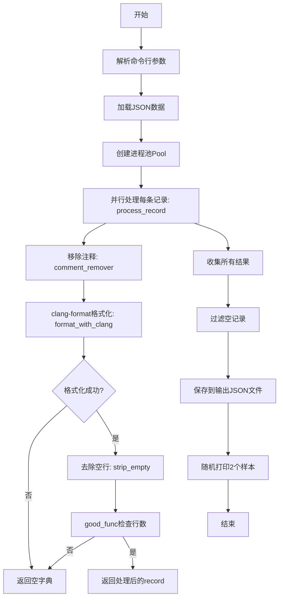
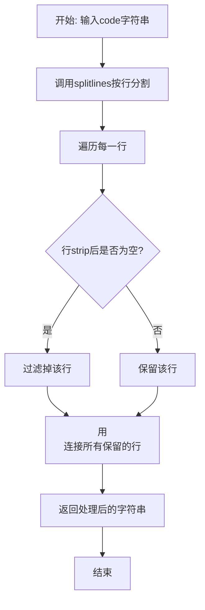
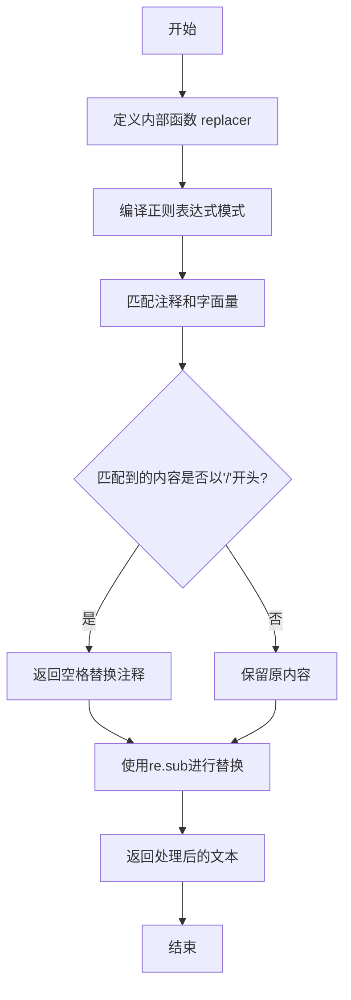

# `LLM4Decompile\sk2decompile\Preprocess\format.py` 详细设计文档

一个并行处理代码格式化的工具脚本，通过移除注释、使用clang-format对代码进行格式化，并过滤掉不符合长度要求的函数（3-300行），最终输出格式化的代码到JSON文件。

## 整体流程



## 类结构

```
无面向对象类结构
脚本仅包含全局函数
```

## 全局变量及字段


### `args`
    
命令行参数对象，包含输入输出文件路径和并行任务数

类型：`argparse.Namespace`
    


### `data`
    
从输入JSON加载的原始数据列表

类型：`list`
    


### `results`
    
处理后的结果列表，仅保留符合规范的函数记录

类型：`list`
    


### `data_sample`
    
随机采样的两条记录用于展示格式化效果

类型：`list`
    


    

## 全局函数及方法


### `good_func`

该函数用于判断输入的代码片段是否符合预期的代码行数要求，通过去除函数签名部分并统计有效代码行数（每行去除空格后长度>=3）来进行过滤，仅保留行数在4到299之间的代码片段。

参数：

- `func`：`str`，待检测的代码字符串，应包含大括号包裹的函数体

返回值：`bool`，如果代码的有效行数大于3且小于300则返回True，否则返回False

#### 流程图

```mermaid
flowchart TD
    A[开始 good_func] --> B[去除第一个大括号前的内容]
    B --> C[按换行符分割字符串]
    C --> D[初始化计数器 total = 0]
    D --> E{遍历每一行代码}
    E -->|当前行.strip()长度 >= 3| F[total += 1]
    E -->|当前行.strip()长度 < 3| G[继续下一行]
    F --> G
    G --> H{还有未遍历的行?}
    H -->|是| E
    H -->|否| I{total > 3 且 total < 300}
    I -->|是| J[返回 True]
    I -->|否| K[返回 False]
    J --> L[结束]
    K --> L
```

#### 带注释源码

```python
def good_func(func):
    """
    判断代码片段是否符合预期的行数要求
    
    该函数通过以下步骤进行判断：
    1. 去除函数签名（第一个大括号之前的内容）
    2. 统计有效代码行（每行去除空格后长度>=3）
    3. 判断行数是否在4-299之间
    """
    # 去除第一个大括号之前的内容，保留函数体
    # 例如：'void test() { int a; }' -> '{ int a; }'
    func = '{'.join(func.split('{')[1:])
    
    # 按换行符分割为行列表
    func_sp = func.split('\n')
    
    # 初始化有效行计数器
    total = 0
    
    # 遍历每一行，统计有效代码行
    for line in func_sp:
        # 只统计去除首尾空格后长度>=3的行
        # 这样可以过滤掉空行和只有1-2个字符的行
        if len(line.strip()) >= 3:
            total += 1
    
    # 判断有效行数是否在指定范围内
    # 要求至少4行有效代码，最多299行
    if total > 3 and total < 300:
        return True
    
    return False
```


### `strip_empty`

该函数用于移除代码字符串中的所有空行，通过过滤掉只包含空白字符的行来清理代码格式。

参数：

- `code`：`str`，输入的原始代码字符串

返回值：`str`，移除空行后的代码字符串

#### 流程图



#### 带注释源码

```python
def strip_empty(code):
    """
    移除代码字符串中的空行
    
    参数:
        code: 输入的原始代码字符串
        
    返回值:
        移除所有空行后的代码字符串
    """
    # 使用列表推导式过滤空行
    # splitlines() 将字符串按行分割
    # line.strip() 移除行首尾的空白字符
    # if line.strip() 判断行是否为空（空白行strip后长度为0）
    # "\n".join() 将所有非空行用换行符连接
    return "\n".join(line for line in code.splitlines() if line.strip())
```


### `comment_remover`

该函数用于从源代码中移除 C/C++ 风格的注释（单行注释 `//` 和多行注释 `/* */`），同时保留字符串字面量和字符字面量中的内容不被误删。

参数：

- `text`：`str`，需要处理的源代码文本

返回值：`str`，去除注释后的代码文本

#### 流程图



#### 带注释源码

```python
def comment_remover(text):
    """
    从源代码中移除C/C++风格的注释，保留字符串和字符字面量
    
    参数:
        text: str, 需要处理的源代码文本
        
    返回:
        str, 去除注释后的代码文本
    """
    def replacer(match):
        """
        内部替换函数，根据匹配内容决定替换策略
        
        参数:
            match: re.Match对象，正则表达式匹配结果
            
        返回:
            str, 空格或原匹配内容
        """
        s = match.group(0)  # 获取匹配到的完整内容
        if s.startswith('/'):
            # 如果以'/'开头，说明是注释，替换为空格
            # 注意：这里是空格而不是空字符串，避免破坏代码结构
            return " " 
        else:
            # 否则保留原内容（字符串字面量或字符字面量）
            return s
    
    # 定义正则表达式模式：
    # //.*?$     - 单行注释
    # /\*.*?\*/ - 多行注释
    # \'...\'   - 字符字面量
    # "..."    - 字符串字面量
    pattern = re.compile(
        r'//.*?$|/\*.*?\*/|\'(?:\\.|[^\\\'])*\'|"(?:\\.|[^\\"])*"',
        re.DOTALL | re.MULTILINE  # DOTALL使.匹配换行符，MULTILINE使^和$匹配行首行尾
    )
    
    # 使用re.sub进行替换
    return re.sub(pattern, replacer, text)
```


### `format_with_clang`

该函数是一个封装了 `clang-format` 工具的辅助函数。它接收一段 C/C++ 源代码字符串和格式化风格，运行系统级别的 `clang-format` 进程对该代码进行美化格式化，并返回格式化后的字符串。如果输入为空或 `clang-format` 执行失败（如超时、找不到命令），函数将捕获异常并返回 `None`。

参数：

-  `func`：`str`，需要被格式化的 C/C++ 源代码字符串。
-  `style`：`str`，指定 `clang-format` 的代码风格（如 "Google", "LLVM"），默认为 "Google"。

返回值：`str | None`，成功时返回格式化后的代码字符串，失败时返回 `None`。

#### 流程图

```mermaid
graph TD
    A([开始 format_with_clang]) --> B{输入 func 是否为空?}
    B -- 是 --> C[直接返回 None]
    B -- 否 --> D[构建命令行列表 cmd]
    D --> E[使用 subprocess.run 执行 cmd]
    E --> F{执行过程是否抛出异常?}
    F -- 是 --> G[捕获异常, 打印失败日志(可选), 返回 None]
    F -- 否 --> H[检查返回码是否成功]
    H -- 成功 --> I[从 proc.stdout 获取格式化结果]
    I --> J([返回格式化后的字符串])
    H -- 失败 --> G
```

#### 带注释源码

```python
def format_with_clang(func: str, style: str = "Google") -> str:
    # 检查输入代码是否为空，如果为空则直接返回 None，避免无谓的进程调用
    if not func:
        return None
    
    # 构建命令行命令，指定 clang-format 可执行文件及其参数
    # 格式为: ["clang-format", "--style=Google"]
    cmd = ["clang-format", f"--style={style}"]
    
    try:
        # 使用 subprocess.run 调用外部工具
        # input=func: 将代码字符串传递给 clang-format 的标准输入
        # text=True: 以文本模式处理输入输出
        # capture_output=True: 捕获标准输出和标准错误
        # check=True: 如果返回码非零，则抛出 CalledProcessError
        # timeout=0.5: 设置超时时间为 0.5 秒，防止代码解析挂起
        proc = subprocess.run(
            cmd,
            input=func,
            text=True,
            capture_output=True,
            check=True,
            timeout=0.5
        )
        # 如果执行成功，返回标准输出（格式化后的代码）
        return proc.stdout
    except:
        # 捕获所有可能的异常（包括 FileNotFoundError, TimeoutExpired, CalledProcessError）
        # 简单起见，这里选择静默失败，并在上层返回空记录
        # print("clang-format failed")
        return None
```

### 关键组件信息

- **subprocess**：Python 标准库模块，用于执行外部系统命令（这里是 `clang-format`）。
- **clang-format**：外部依赖工具，必须安装在运行环境的系统 PATH 中。

### 潜在的技术债务或优化空间

1.  **错误处理过于宽泛**：`except:` 块捕获了所有异常，这会掩盖潜在的问题（例如 `FileNotFoundError` 表示环境缺少 `clang-format`，或 `TimeoutExpired` 表示代码处理超时）。建议根据异常类型进行针对性处理或日志记录。
2.  **超时时间硬编码**：超时时间 `0.5` 秒是硬编码的，对于极长或复杂的代码片段可能不够，而对于简单的片段又显得过长。建议将其配置化或设为参数。
3.  **缺乏状态反馈**：函数失败时只返回 `None`，调用者无法得知失败的具体原因（是超时？是格式错误？还是工具缺失？）。

### 其它项目

- **外部依赖契约**：本函数强依赖于系统安装了 `clang-format` 二进制文件。如果系统未安装，该功能将完全失效。
- **数据流**：上游调用者（`process_record`）负责移除注释和清理空行，将“干净”的代码传递给本函数进行格式化；下游接收格式化后的代码并写入 JSON。


### `process_record`

该函数接收一个包含源代码的字典记录，通过移除注释、使用 clang-format 格式化代码，并验证格式化后的代码是否为有效的函数（行数在 3-300 行之间），最终返回添加了格式化代码的记录或空字典。

参数：

- `record`：`dict`，包含代码数据的字典，必须包含 "code_norm" 键，存储待格式化的原始代码

返回值：`dict`，如果格式化失败或代码不符合有效函数标准则返回空字典 `{}`，否则返回添加了 "code_format" 键的记录字典

#### 流程图

```mermaid
flowchart TD
    A[开始: process_record] --> B[获取record.code_norm]
    B --> C[调用comment_remover移除注释]
    C --> D[调用format_with_clang格式化代码]
    D --> E{格式化是否成功?}
    E -->|否| F[返回空字典 {}]
    E -->|是| G[调用strip_empty移除空行]
    G --> H[设置record.code_format = cleaned]
    H --> I[调用good_func验证函数有效性]
    I --> J{代码是否有效函数?}
    J -->|否| F
    J -->|是| K[返回record]
    
    style F fill:#ffcccc
    style K fill:#ccffcc
```

#### 带注释源码

```python
def process_record(record):
    """
    处理单条代码记录：移除注释、格式化代码、验证函数有效性
    
    Args:
        record: 包含原始代码的字典，必须有 'code_norm' 键
        
    Returns:
        dict: 格式化后的记录，或空字典表示无效
    """
    # 1. 从记录中获取待处理的源代码，默认空字符串
    src = record.get("code_norm", "")
    
    # 2. 移除代码中的注释（单行和多行注释）
    no_comments = comment_remover(src)
    
    # 3. 使用 clang-format 格式化代码（默认 Google 风格）
    formatted = format_with_clang(no_comments)
    
    # 4. 如果格式化失败（clang-format 不可用或超时），返回空字典
    if formatted is None:
        return {}
    
    # 5. 清理格式化后的空行
    cleaned = strip_empty(formatted)
    
    # 6. 将格式化后的代码存入记录
    record["code_format"] = cleaned
    
    # 7. 验证是否为有效函数（行数在 3-300 之间）
    if not good_func(cleaned):
        return {}
    
    # 8. 返回添加了格式化代码的记录
    return record
```

---

### 全局函数依赖说明

#### `comment_remover(text: str) -> str`

- **参数**：`text` - `str`，原始代码文本
- **返回值**：`str`，移除注释后的代码
- **功能**：使用正则表达式移除 C/C++ 风格的 `//` 和 `/* */` 注释，同时保留字符串字面量

#### `format_with_clang(func: str, style: str = "Google") -> str | None`

- **参数**：
  - `func` - `str`，待格式化的代码
  - `style` - `str`，格式化风格（默认 "Google"）
- **返回值**：`str | None`，格式化后的代码或 None（失败时）
- **功能**：通过子进程调用 clang-format 工具进行代码格式化

#### `strip_empty(code: str) -> str`

- **参数**：`code` - `str`，代码文本
- **返回值**：`str`，移除空行后的代码
- **功能**：过滤掉代码中的空行

#### `good_func(func: str) -> bool`

- **参数**：`func` - `str`，代码文本
- **返回值**：`bool`，是否为有效函数
- **功能**：验证代码是否为有效函数（非空行数在 3-300 之间）

---

### 关键组件信息

| 组件名称 | 一句话描述 |
|---------|-----------|
| `process_record` | 核心处理函数，协调注释移除、代码格式化与有效性验证 |
| `comment_remover` | 使用正则表达式移除 C/C++ 风格注释 |
| `format_with_clang` | 通过子进程调用 clang-format 格式化代码 |
| `strip_empty` | 移除代码中的空行 |
| `good_func` | 验证代码行数是否符合有效函数标准 |

---

### 潜在技术债务与优化空间

1. **错误处理不足**：`format_with_clang` 中的异常被静默捕获，仅返回 `None`，缺乏详细的错误日志记录
2. **硬编码阈值**：函数有效性判断的行数阈值（3-300）硬编码在 `good_func` 中，可考虑配置化
3. **缺少输入校验**：`process_record` 未验证 `record` 参数是否为字典类型，可能导致运行时错误
4. **超时时间固定**：`format_with_clang` 的超时时间为 0.5 秒，对于大型代码可能不足
5. **并行处理中的 GIL 限制**：虽然使用了多进程，但 `process_record` 内部的 `format_with_clang` 调用外部命令可能存在效率瓶颈

---

### 其它项目

#### 设计目标与约束

- **目标**：对 JSON 数据中的代码进行标准化格式化，移除无效记录
- **约束**：依赖外部工具 `clang-format`，必须在系统中安装

#### 错误处理与异常设计

- 格式化失败时返回空字典，由调用方（如主函数的列表推导式）过滤
- 外部命令执行异常被捕获，避免程序崩溃但可能隐藏问题

#### 数据流与状态机

```
输入 record (dict)
    ↓
提取 code_norm
    ↓
移除注释 → 格式化 → 清理空行 → 验证有效性
    ↓                              ↓
返回 {} (无效)          返回 record (有效)
```

#### 外部依赖与接口契约

| 依赖项 | 用途 | 备注 |
|--------|------|------|
| `clang-format` | 代码格式化 | 必须在 PATH 中可用 |
| `tqdm` | 进度条显示 | 仅主进程使用 |
| `multiprocessing.Pool` | 并行处理 | 支持自定义进程数 |

## 关键组件


### 代码格式化管道

该脚本是一个并行处理工具，用于对JSON数据中的代码进行clang-format格式化、注释移除和函数过滤。

### 注释移除器

使用正则表达式移除C/C++代码中的单行注释(//)和多行注释(/* */)，同时保留字符串和字符常量中的内容。

### 代码格式化器

调用clang-format工具对代码进行格式化，支持Google等多种代码风格，失败时返回None。

### 函数质量过滤器

判断函数是否符合条件：非空行数在3到300行之间，否则过滤掉。

### 空行移除器

移除代码中的空行，只保留有实际内容的行。

### 记录处理器

将上述组件串联起来：对原始代码移除注释、格式化、清理空行，并进行函数质量检查。

### 并行处理框架

使用multiprocessing.Pool实现多进程并行处理，配合tqdm显示进度条。

### 命令行接口

使用argparse定义输入输出文件路径和并行进程数参数。


## 问题及建议


### 已知问题

- **异常处理过于宽泛**：在 `format_with_clang` 函数中使用空的 `except:` 捕获所有异常，会隐藏真正的错误信息，导致调试困难
- **随机采样未做安全检查**：`random.sample(results, 2)` 在 `results` 为空或少于2个元素时会抛出 `ValueError` 异常
- **缺少输入文件存在性检查**：程序直接尝试打开输入文件，如果文件不存在会抛出未捕获的 `FileNotFoundError`
- **内存效率低下**：一次性将整个JSON文件加载到内存，并在最后才处理结果，大数据量时可能导致内存溢出
- **进度条与数据加载时机**：`total=len(data)` 需要提前计算数据长度，增加了内存和时间开销
- **硬编码的magic number**：`good_func` 中3行和300行的阈值硬编码，缺乏可配置性
- **未使用日志模块**：没有使用 `logging` 模块进行错误记录和调试，格式化失败时静默返回 `None`
- **进程池资源未优化**：默认使用所有CPU核心，可能导致系统资源竞争和性能下降
- **JSON解析错误未处理**：加载JSON时如果文件格式错误会直接崩溃
- **格式化样式固定**：`style` 参数硬编码为 "Google"，缺乏灵活性

### 优化建议

- 将空 `except:` 改为捕获具体异常（如 `subprocess.TimeoutExpired`、`subprocess.CalledProcessError`），并记录日志
- 在随机采样前检查 `results` 长度：`if len(results) >= 2:` 再执行采样
- 添加输入文件存在性检查或使用 `argparse` 的 `type=argparse.FileType('r')`
- 使用生成器模式流式处理数据，或使用 `ijson` 进行流式JSON解析
- 将 `good_func` 的阈值参数化，通过命令行参数传入
- 引入 `logging` 模块，记录格式化失败的原因和数量
- 限制进程池大小：`max(1, cpu_count() - 1)` 或允许用户通过 `--jobs` 参数指定
- 使用 `try-except` 包裹 `json.load`，捕获 `json.JSONDecodeError`
- 将格式化样式改为可配置参数：`parser.add_argument("--style", type=str, default="Google")`

## 其它


### 设计目标与约束

该工具旨在对大量代码片段进行并行格式化和标准化处理，主要目标包括：1）利用多进程并行处理提升大规模代码格式化的吞吐量；2）通过clang-format确保代码符合Google代码风格；3）过滤掉无效代码（空函数或行数超出范围的函数）；4）输入输出均为JSON格式，便于流水线集成。约束条件包括：依赖外部工具clang-format、需要在多核机器上运行、timeout设置为0.5秒防止格式化耗时过长。

### 错误处理与异常设计

代码采用多层次错误处理机制：1）format_with_clang函数中使用try-except捕获subprocess异常，若clang-format执行失败返回None；2）process_record函数中检查formatted是否为None，若为None则返回空字典；3）主流程中使用list comprehension过滤空结果；4）文件操作使用with语句确保资源正确释放。潜在改进点：可增加重试机制处理临时性失败、记录详细错误日志、区分不同类型的异常以便针对性处理。

### 数据流与状态机

数据流遵循以下路径：1）主程序启动并解析命令行参数；2）从输入JSON文件加载数据到内存列表；3）将数据分发给进程池中的worker进程；4）每个worker执行process_record：加载code_norm字段→移除注释→调用clang-format格式化→去除空行→验证函数有效性→返回处理后的record；5）主进程收集所有结果并过滤空值；6）将结果写入输出JSON文件。状态机相对简单，主要状态包括：加载状态、处理中状态、完成状态。

### 外部依赖与接口契约

主要外部依赖包括：1）clang-format：外部二进制工具，必须安装在系统PATH中；2）Python标准库：re、os、json、argparse、subprocess、multiprocessing；3）tqdm库：用于显示进度条。输入接口：JSON文件，每条记录包含code字段（原始代码）和code_norm字段（标准化后的代码）。输出接口：JSON文件，每条记录包含原始字段以及新增的code_format字段（格式化后的代码）。接口契约要求输入JSON为数组格式，每条记录必须有code_norm字段，若处理失败则该记录不出现在输出中。

### 性能考虑

当前实现存在以下性能特征：1）使用multiprocessing.Pool实现真正的多进程并行，充分利用多核CPU；2）进程池大小默认为CPU核心数，可通过-j参数自定义；3）使用tqdm显示进度，提供良好的用户体验；4）clang-format设置0.5秒超时，防止单个任务阻塞；5）数据一次性加载到内存，大数据集可能存在内存压力。优化建议：对于超大文件可考虑流式处理或分批加载、增加进度保存和恢复功能、支持断点续传。

### 安全性考虑

代码安全性分析：1）使用subprocess.run执行外部命令，通过input参数传递数据而非shell拼接，避免命令注入风险；2）文件读写使用with语句，确保资源正确释放；3）无网络通信功能；4）无用户输入直接执行代码的能力。潜在安全风险：1）输入文件路径来自命令行参数，需防止路径遍历攻击；2）处理敏感代码数据时需注意内存中明文存储。

### 配置管理

配置通过命令行参数管理：1）--input_json：输入JSON文件路径，默认train_norm.json；2）--output_json：输出JSON文件路径，默认train_format.json；3）-j/--jobs：并行任务数，默认为CPU核心数。格式化风格通过format_with_clang函数中的style参数控制，当前默认为Google风格，可通过修改代码扩展其他风格支持。

### 测试策略

当前代码未包含单元测试，建议补充：1）单元测试：测试good_func、comment_remover、strip_empty、format_with_clang等纯函数；2）集成测试：测试完整的数据处理流程，使用样例数据验证输出正确性；3）性能测试：测试大规模数据集的处理时间和内存占用；4）边界测试：测试空输入、单条记录、超大函数、特殊字符等边界情况。

### 部署要求

部署环境要求：1）Python 3.6+；2）系统已安装clang-format并加入PATH；3）已安装tqdm库（pip install tqdm）；4）建议至少4核CPU以发挥并行处理优势；5）内存要求取决于输入文件大小。部署步骤：1）安装Python依赖pip install tqdm；2）确保clang-format可用（apt-get install clang-format或brew install clang-format）；3）直接运行Python脚本即可。

### 并发与同步机制

multiprocessing.Pool使用进程级并行而非线程，避免GIL限制。进程间通过pickle序列化数据传递，主进程负责收集结果。结果收集使用list保持顺序，与输入顺序一致。最后通过列表推导式过滤空结果，此操作在主进程完成。

### 潜在改进建议

1. 增强错误处理：记录每条记录的处理状态和错误信息；
2. 增加日志：使用logging模块记录处理统计信息；
3. 断点续传：支持从中间状态恢复处理；
4. 流式处理：对于超大输入文件采用生成器模式；
5. 格式化配置：支持通过配置文件自定义clang-format风格；
6. 性能监控：添加处理速度、内存占用等指标；
7. 验证输出：增加对格式化后代码的有效性验证。


    