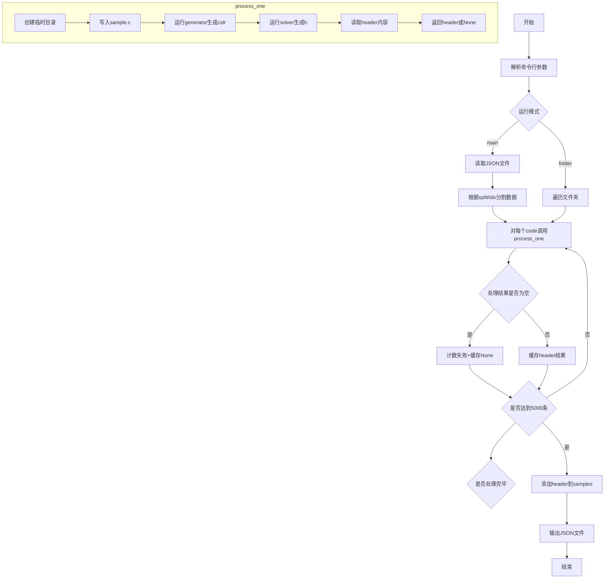
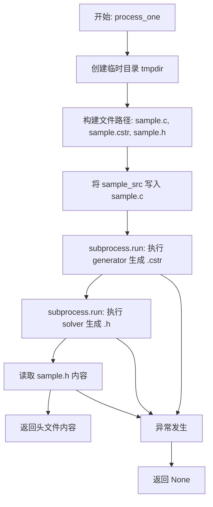
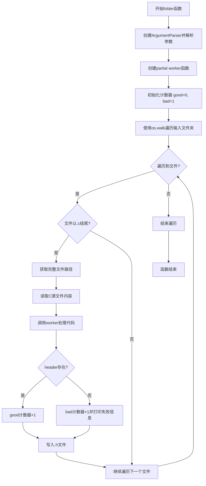

# `LLM4Decompile\sk2decompile\Preprocess\inf_type.py` 详细设计文档

该代码是一个批量处理C语言源代码的工具，通过调用psycheC生成器和求解器将C代码样本转换为C头文件，并将其作为header字段添加到原始JSON数据中输出。

## 整体流程



## 类结构

```
无类结构 (面向过程脚本)
主要函数:
├── process_one (处理单个样本)
├── main (主函数: JSON批量处理)
└── folder (文件夹批量处理)
```

## 全局变量及字段


### `args`
    
命令行参数对象，包含输入输出文件路径、生成器和解算器路径、分片参数等配置

类型：`argparse.Namespace`
    


### `samples`
    
从JSON文件加载的样本列表，每个元素包含代码字符串和格式信息

类型：`list[dict]`
    


### `codes`
    
从样本中提取的C语言代码字符串列表，用于后续处理

类型：`list[str]`
    


### `worker`
    
封装了process_one函数的偏函数，只需传入代码即可执行生成和解算流程

类型：`functools.partial`
    


### `memo`
    
结果缓存字典，以代码字符串为键，生成的header为值，避免重复处理相同代码

类型：`dict[str, str|None]`
    


### `results`
    
存储每个样本对应的生成结果（header字符串或None），顺序与输入样本一致

类型：`list[str|None]`
    


### `count_non`
    
main函数中处理失败的样本计数，用于统计生成失败的总数

类型：`int`
    


### `good`
    
folder函数中成功生成header文件的计数

类型：`int`
    


### `bad`
    
folder函数中生成header文件失败的计数

类型：`int`
    


    

## 全局函数及方法


### `process_one`

该函数接收一段 C 源代码，通过在临时目录中调用外部 generator 和 solver 工具链，将源代码转换为对应的 C 头文件（.h），并返回头文件内容。整个过程自动管理临时文件的创建与清理，任何异常均返回 None。

#### 参数

- `sample_src`：`str`，C 源代码文本
- `generator`：`str`，generator 可执行文件的完整路径
- `solver`：`str`，solver 可执行文件名称（配合 `stack exec` 使用）

#### 返回值

`str | None`，成功时返回生成的 C 头文件内容字符串，失败时返回 `None`

#### 流程图



#### 带注释源码

```python
def process_one(sample_src, generator, solver):
    """
    Write sample_src to temp file (sample.c),
    run generator -> sample.cstr,
    run solver -> sample.h,
    read header, return header text.
    Any temp files are cleaned up automatically.
    """
    # 1) 创建临时目录，退出时自动清理
    with tempfile.TemporaryDirectory() as tmpdir:
        # 构建临时文件完整路径
        sample_path = os.path.join(tmpdir, "sample.c")      # C 源文件路径
        output_path = os.path.join(tmpdir, "sample.cstr")    # 中间表示文件路径
        header_path = os.path.join(tmpdir, "sample.h")       # 输出头文件路径

        # 2) 将 C 源代码写入临时文件
        with open(sample_path, "w", encoding="utf-8") as f:
            f.write(sample_src)

        try:
            # 3) 运行 generator: sample.c -> sample.cstr
            # 使用 subprocess.run 执行外部程序，设置超时为 1 秒
            subprocess.run(
                [generator, sample_path, "-o", output_path],
                check=True,                # 检查返回码，非零则抛异常
                stdout=subprocess.PIPE,    # 捕获标准输出
                stderr=subprocess.PIPE,    # 捕获标准错误
                timeout=1,                # 超时限制 1 秒
            )
            
            # 4) 运行 solver: sample.cstr -> sample.h
            # 使用 stack exec 调用 Haskell solver
            subprocess.run(
                ["stack", "exec", solver, "--", "-i", output_path, "-o", header_path],
                check=True,
                stdout=subprocess.PIPE,
                stderr=subprocess.PIPE,
                timeout=1,
            )

            # 5) 读取生成的头文件内容并返回
            with open(header_path, "r", encoding="utf-8") as f:
                return f.read()

        # 异常统一处理：记录错误信息并返回 None
        # 注意：被注释的 CalledProcessError 分支会输出详细错误
        # except subprocess.CalledProcessError as e:
        #     sys.stderr.write(
        #         f"[ERROR] sample failed:\n"
        #         f"  cmd: {e.cmd!r}\n"
        #         f"  returncode: {e.returncode}\n"
        #         f"  stdout: {e.stdout.decode(errors='ignore')}\n"
        #         f"  stderr: {e.stderr.decode(errors='ignore')}\n"
        #     )
        except Exception as e:
            return None
```

---

### 关键组件信息

| 组件名称 | 一句话描述 |
|---------|-----------|
| `tempfile.TemporaryDirectory` | Python 上下文管理器，自动创建与清理临时目录 |
| `subprocess.run` | 执行外部命令行工具的接口，支持超时与管道捕获 |
| `partial` (functools) | 用于预绑定 generator/solver 参数，创建可调用 worker |
| `tqdm` | 命令行进度条显示库 |

---

### 潜在技术债务与优化空间

1. **硬编码超时时间**：当前 `timeout=1` 对复杂代码可能不足，应考虑根据实际情况动态调整或提供 CLI 参数
2. **错误信息丢失**：注释掉的 `CalledProcessError` 处理被删除，导致调试时缺乏具体失败原因
3. **缺乏重试机制**：外部工具调用失败直接返回 None，可考虑增加重试逻辑
4. **内存占用**：所有结果存储在 `results` 列表中，大数据集会导致内存压力，应考虑流式写入
5. **缺少日志记录**：仅依赖 `tqdm` 显示进度，建议添加结构化日志

---

### 其它项目

#### 设计目标与约束
- **目标**：批量将 C 源代码转换为类型推断后的 C 头文件
- **约束**：依赖外部工具 `/psychec/psychecgen` 和 `stack exec ../psychec/psychecsolver-exe`，必须在支持 Haskell Stack 环境中运行

#### 错误处理与异常设计
- 使用 `try/except` 捕获所有异常，统一返回 `None`
- `check=True` 确保命令失败时立即抛异常，而非静默忽略
- 超时保护防止外部工具卡死

#### 数据流与状态机
```
输入 JSON (code) 
    → process_one() 
    → 临时文件 (sample.c) 
    → generator 
    → 临时文件 (sample.cstr) 
    → solver 
    → 临时文件 (sample.h) 
    → 读取返回 
    → 输出 JSON (header)
```

#### 外部依赖与接口契约
- **generator**：接收 C 源文件路径和输出路径，生成中间表示
- **solver**：通过 `stack exec` 调用，接收中间表示输入，生成 .h 头文件
- **输入格式**：JSON 中 `code_format` 字段存储 C 源代码


### `main`

`main` 函数是批量处理C语言样本并生成对应头文件的主入口点。它通过命令行参数接收输入输出路径、外部工具路径等配置，加载JSON格式的C代码样本，根据split参数分割数据，遍历每个代码样本调用 `process_one` 函数生成头文件，并使用memoization缓存避免重复处理相同代码，最终将带有头文件的增强样本写入输出JSON文件。

参数：
- 该函数无显式参数，通过 `argparse` 从命令行获取以下参数：
  - `--input_json`：`str`，输入JSON文件路径，包含 `{'code_format': ...}` 格式的样本列表
  - `--output_name`：`str`，输出JSON文件的基础名称
  - `--generator`：`str`，PsyChE代码生成器的可执行文件路径
  - `--solver`：`str`，Haskell求解器可执行文件名称（用于 `stack exec`）
  - `--split`：`int`，将数据分割为多少部分，默认为5
  - `--idx`：`int`，当前处理的分割部分索引，默认为0

返回值：`None`，无返回值，直接将结果写入JSON文件

#### 流程图

```mermaid
flowchart TD
    A[开始] --> B[解析命令行参数]
    B --> C[打开并加载input_json文件]
    C --> D{split != 1?}
    D -->|是| E[计算SPLIT = len/args.split]
    D -->|否| F[跳过分割]
    E --> G{idx == split-1?}
    G -->|是| H[samples = samples[SPLIT*idx:]]
    G -->|否| I[samples = samples[SPLIT*idx:SPLIT*(idx+1)]]
    H --> J[提取code_format列表]
    I --> J
    F --> J
    J --> K[创建partial worker函数]
    K --> L[初始化memo字典、results列表、count_non计数器]
    L --> M[遍历codes列表]
    M --> N{code in memo?}
    N -->|是| O[header = memo[code]]
    N -->|否| P[header = worker(code)]
    P --> Q{header == None?}
    Q -->|是| R[count_non += 1]
    Q -->|否| S[memo[code] = header]
    R --> S
    S --> O
    O --> T[results.append header]
    T --> U{len(results) % 5000 == 0?}
    U -->|是| V[打印进度信息]
    U -->|否| W[继续遍历]
    V --> W
    W --> M
    M --> X[遍历完成]
    X --> Y[将header写入对应sample]
    Y --> Z[打开输出文件]
    Z --> AA[json.dump写入]
    AA --> BB[打印最终统计]
    BB --> CC[结束]
```

#### 带注释源码

```python
def main():
    """
    主入口函数：批量处理C代码样本并生成头文件
    """
    # 1. 创建命令行参数解析器
    p = argparse.ArgumentParser(description="Batch process C samples into headers.")
    p.add_argument("--input_json", default="train_norm.json", help="Path to JSON file with a list of {{'code': …} entries")
    p.add_argument("--output_name", default="train_type", help="Where to write the augmented JSON")
    p.add_argument("--generator", default="/psychec/psychecgen", help="Path to your generator executable")
    p.add_argument("--solver", default="/psychec/psychecsolver-exe", help="Name of your solver (for `stack exec …)") 
    p.add_argument("--split", type=int, default=5, help="split the data to split parts")
    p.add_argument("--idx", type=int, default=0, help="index of the split")
    args = p.parse_args()

    # 2. 加载输入JSON文件
    with open(args.input_json, "r", encoding="utf-8") as f:
        samples = json.load(f)

    # 3. 根据split和idx参数分割数据
    if args.split != 0:
        SPLIT = int(len(samples) / args.split)
        if args.idx == args.split - 1:
            # 最后一部分取剩余所有数据
            samples = samples[SPLIT * args.idx:]
        else:
            # 中间部分按固定大小分割
            samples = samples[SPLIT * args.idx:SPLIT * (args.idx + 1)]
    
    # 4. 提取所有代码字符串
    codes = [s["code_format"] for s in samples]  # code_format是最终期望的代码格式

    # 5. 创建部分应用函数，传入generator和solver
    worker = partial(process_one, generator=args.generator, solver=args.solver)

    # 6. 初始化缓存和结果容器
    memo = {}  # 缓存已处理过的代码及其对应头文件
    results = []  # 存储所有处理结果
    count_non = 0  # 统计处理失败的数量
    
    # 7. 遍历处理每个代码样本
    for code in tqdm(codes):
        # 7.1 检查是否已有缓存
        if code not in memo:
            # 7.2 调用worker处理代码
            header = worker(code)
            # 7.3 记录失败计数
            if header == None:
                count_non += 1
            # 7.4 存入缓存
            memo[code] = header
        # 7.5 从缓存获取结果
        results.append(memo[code])
        # 7.6 每5000个样本打印一次进度
        if len(results) % 5000 == 0:
            print(f"len code:{len(codes)}, fail:{count_non}")

    # 8. 将头文件添加到样本中
    for sample, header in zip(samples, results):
        sample["header"] = header

    # 9. 写入输出JSON文件
    output_filename = args.output_name + '_' + str(args.idx) + '.json'
    with open(output_filename, "w", encoding="utf-8") as f:
        json.dump(samples, f, indent=2)
    # 10. 打印最终统计信息
    print(f"len code:{len(codes)}, fail:{count_non}")
```


### `folder`

该函数用于批量处理指定文件夹中的所有C语言源文件，通过调用外部的generator和solver工具为每个.c文件生成对应的.h头文件，并将结果写入同目录下的同名.h文件中。

参数：
- 无显式参数（内部通过argparse获取命令行参数）
  - `args.input_folder`：`str`，输入文件夹路径，默认为"/workspace/llm4binary/type/evaluation/result/exebench-8800_github1000"
  - `args.generator`：`str`，generator可执行文件路径，默认为"../psychec/psychecgen"
  - `args.solver`：`str`，solver可执行文件名称，默认为"../psychec/psychecsolver-exe"

返回值：`None`，该函数无返回值，直接将结果写入文件

#### 流程图



#### 带注释源码

```python
def folder():
    """
    批量处理文件夹中的C源文件，生成对应的头文件
    遍历指定文件夹下的所有.c文件，使用process_one生成.h文件
    """
    # 创建命令行参数解析器
    p = argparse.ArgumentParser(description="Batch process C samples into headers.")
    # 添加输入文件夹参数
    p.add_argument("--input_folder", default="/workspace/llm4binary/type/evaluation/result/exebench-8800_github1000")
    # 添加generator可执行文件路径参数
    p.add_argument("--generator", default="../psychec/psychecgen", help="Path to your generator executable")
    # 添加solver可执行文件名称参数
    p.add_argument("--solver", default="../psychec/psychecsolver-exe", help="Name of your solver (for `stack exec`)") 
    # 解析命令行参数
    args = p.parse_args()
    
    # 创建partial函数，绑定generator和solver参数
    worker = partial(process_one, generator=args.generator, solver=args.solver)
    
    # 初始化成功和失败计数器
    good = 0
    bad = 1
    
    # 遍历输入文件夹中的所有文件
    for root, dirs, files in tqdm(os.walk(args.input_folder)):
        # 遍历每个文件
        for filename in files:
            # 只处理.c源文件
            if filename.endswith(".c"):
                # 拼接完整的文件路径
                file_path = os.path.join(root, filename)
                
                # 读取C源文件内容
                with open(file_path, 'r') as f:
                    code = f.read()
                
                # 调用worker处理代码生成header
                header = worker(code)
                
                # 生成对应的.h文件路径
                header_file_path = file_path.split('.c')[0] + ".h"
                
                # 写入header内容到.h文件
                with open(header_file_path, 'w') as f:
                    # 如果成功生成header则写入，否则写入空字符串
                    if header:
                        good += 1
                        f.write(header)
                    else:
                        bad += 1
                        # 打印当前统计信息
                        print(f'good:{good},bad:{bad}')
                        f.write("")
```

### 全局函数和变量

#### `process_one`

核心处理函数，将C源代码通过外部工具转换为头文件内容

参数：
- `sample_src`：`str`，C语言源代码字符串
- `generator`：`str`，generator可执行文件路径
- `solver`：`str`，solver可执行文件名称

返回值：`str` 或 `None`，成功返回头文件内容，失败返回None

#### 全局变量

- `os`, `sys`, `json`, `tempfile`, `subprocess`, `functools.partial`, `tqdm`, `argparse`：标准库模块导入
- `process_one`：已定义的全局函数
- `main`：已定义的全局函数（未在folder中使用）

### 关键组件信息

1. **process_one函数**：核心处理单元，负责单次C代码到头文件的转换
2. **worker (partial函数)**：预绑定了generator和solver参数的process_one封装
3. **argparse参数解析**：提供灵活的命令行配置能力
4. **os.walk遍历**：递归遍历文件夹获取所有C文件

### 潜在的技术债务或优化空间

1. **异常处理缺失**：folder函数中没有对文件读取异常、写入异常进行处理
2. **错误信息不够详细**：仅打印good/bad计数，缺少失败文件的路径记录
3. **硬编码的split参数**：虽然在folder中注释掉了，但在main函数中存在，folder函数应该统一处理
4. **计数器初始化问题**：bad初始值为1可能导致计数不准确
5. **缺少日志记录**：没有使用logging模块，调试困难
6. **tempfile未在folder中使用**：该函数创建临时目录的逻辑在process_one中，folder直接读写文件
7. **无并发处理**：串行处理大量文件效率低下，可考虑使用多进程/多线程优化
8. **输出路径硬编码**：.h文件路径通过字符串分割生成，缺少安全检查

### 其它项目

#### 设计目标与约束
- 目标：批量将C源文件转换为对应的类型头文件
- 约束：依赖外部工具psychecgen和psychecsolver-exe
- 输入：指定文件夹中的.c文件
- 输出：同目录下的.h文件

#### 错误处理与异常设计
- 文件读取失败：未捕获异常，程序可能中断
- 外部工具执行失败：process_one返回None，folder中仅打印计数
- header生成失败：写入空字符串到.h文件

#### 数据流
1. 读取.c源文件 → 传递给worker处理 → 获取header内容 → 写入.h文件
2. 使用memo字典缓存处理结果（仅在main函数中实现，folder函数未使用缓存）

#### 外部依赖
- `os`, `sys`, `json`, `tempfile`, `subprocess`：Python标准库
- `functools.partial`：函数柯里化
- `tqdm`：进度条显示
- `argparse`：命令行参数解析
- `../psychec/psychecgen`：外部C代码转换工具
- `../psychec/psychecsolver-exe`：外部求解器工具


## 关键组件


### process_one函数

单样本处理核心函数，负责将C源代码通过外部工具链生成对应的头文件内容。函数创建临时目录，写入C源文件，依次调用generator和solver工具，最后读取生成的头文件并返回。

### main函数

批量处理主入口函数，负责加载JSON数据集、解析命令行参数、实现分片逻辑、调用工作函数处理所有代码样本，并将结果写回JSON文件。包含样本缓存机制避免重复处理。

### folder函数

文件夹批量处理函数，递归遍历指定文件夹中的所有.c文件，对每个C文件调用外部工具生成对应的.h头文件，支持批量处理文件系统中的代码。

### 参数解析模块

使用argparse构建的命令行参数系统，支持输入输出路径、generator和solver可执行文件路径、数据分片数量和索引等配置。

### 缓存机制

通过memo字典实现结果缓存，对相同代码避免重复调用外部工具，提升处理效率并减少计算资源消耗。

### 临时文件管理

使用tempfile.TemporaryDirectory自动管理临时文件的创建和清理，确保处理过程中产生的中间文件不会残留在文件系统中。

### 子进程调用模块

通过subprocess.run分别调用generator和solver两个外部工具，处理C源代码并生成头文件，包含超时控制和错误处理。

### 分片处理逻辑

根据split和idx参数将大数据集划分为多个子集，支持并行或分布式处理大规模样本数据。

## 问题及建议


### 已知问题

- **错误处理过于宽泛且不完善**：`process_one` 函数中使用 `except Exception as e` 捕获所有异常，仅返回 `None`，导致真正的错误信息被丢弃，无法追踪失败原因；原本详细的 `CalledProcessError` 处理代码被注释掉。
- **内存泄漏风险**：`memo` 字典用于缓存结果但没有大小限制，处理大规模数据集时可能导致内存溢出。
- **硬编码配置**：`timeout=1` 超时设置过短，对于复杂的 C 代码生成可能不够；生成器和 solver 的路径硬编码，可能在不同环境下不适用。
- **数据分割逻辑存在缺陷**：当 `idx == split - 1` 时使用 `samples[SPLIT * args.idx:]` 切片，但当 `args.split != 0` 且总样本数不能被整除时，末尾部分数据会被截断。
- **进度和统计信息不规范**：使用 `print` 而非标准日志模块，无法分级控制输出；计数逻辑 `good` 和 `bad` 初始化值不符合实际计数习惯（good=0, bad=1）。
- **字段访问缺乏校验**：直接通过 `s["code_format"]` 访问 JSON 字段，若字段缺失会导致 `KeyError`，未做容错处理。
- **字符串处理隐患**：文件名拼接 `file_path.split('.c')[0] + ".h"` 假设文件名中仅有一个 `.c`，若路径中包含 `.c` 目录会导致错误。

### 优化建议

- **改进错误处理**：恢复 `CalledProcessError` 的详细日志记录，区分不同异常类型并返回结构化错误信息；在 `process_one` 中添加重试机制处理临时性失败。
- **添加缓存限制**：为 `memo` 字典设置最大容量（如使用 `lru_cache` 或手动实现 LRU 策略），防止内存无限增长。
- **配置外部化**：将超时时间、路径等参数通过命令行参数或配置文件传入，提高脚本灵活性。
- **修复数据分割逻辑**：使用 `divmod` 或更清晰的切片方式处理分割，确保所有数据都被处理；添加对边界条件的测试。
- **规范化日志记录**：使用 `logging` 模块替代 `print`，支持日志级别配置和输出重定向。
- **添加输入校验**：在处理 JSON 数据前验证必需字段是否存在；对文件路径进行规范化处理。
- **并行化处理**：考虑使用 `multiprocessing` 或 `concurrent.futures` 并行调用 `process_one`，提高批量处理效率。
- **重构代码结构**：将 `process_one` 提取为独立模块或类，便于单元测试和复用；合并 `main` 和 `folder` 的公共逻辑。

## 其它


### 设计目标与约束

本代码旨在实现一个自动化批处理工具，将C语言源代码样本批量转换为对应的头文件（.h），核心目标是为机器学习训练数据生成增强的header信息。设计约束包括：1) 必须依赖外部工具psychecgen和psychecsolver-exe；2) 处理流程需在1秒超时内完成单个样本；3) 支持大规模数据集的分片处理（split参数）；4) 输出JSON格式需保持与输入格式兼容。

### 错误处理与异常设计

代码采用多层错误处理机制：1) subprocess.run调用时使用check=True捕获命令执行失败，timeout=1防止无限等待；2) 通用异常捕获（except Exception as e）返回None表示处理失败；3) 被注释的CalledProcessError处理块可用于更详细的错误日志。当前设计将失败样本的header设为None，由调用方决定后续处理策略。潜在改进：区分不同类型的失败（超时/文件不存在/工具错误），实现重试机制。

### 数据流与状态机

数据流转路径为：输入JSON/文件夹 → 提取code字段 → process_one处理 → 生成header → 缓存结果(memo字典) → 合并输出。状态机包含三种状态：待处理、处理中（临时目录创建→写文件→执行generator→执行solver→读取结果→自动清理）、完成。memoization优化避免重复处理相同代码。

### 外部依赖与接口契约

外部依赖包括：1) psychecgen生成器可执行文件路径（默认/psychec/psychecgen）；2) psychecsolver-exe求解器（通过stack exec调用）；3) Python标准库（os/sys/json/tempfile/subprocess/tqdm/argparse）。接口契约：generator接收参数"sample.c -o sample.cstr"，solver接收参数"-i sample.cstr -o sample.h"，均返回0表示成功，非0表示失败。

### 安全性分析

存在以下安全风险：1) 命令注入风险：subprocess.run直接使用外部输入构建命令列表，虽使用列表形式但sample_src内容未经严格校验写入临时文件；2) 路径遍历风险：输入路径未做安全校验；3) 资源耗尽风险：未限制临时文件大小和数量。建议：1) 对输入代码进行长度和内容校验；2) 使用临时目录隔离；3) 添加资源限制。

### 性能优化策略

当前已实现：1) memoization缓存机制避免重复处理相同代码；2) tqdm进度条可视化；3) 分片处理支持大数据集。潜在优化空间：1) 使用进程池（multiprocessing.Pool）并行处理；2) 预创建临时目录池减少创建开销；3) 对失败样本进行分类统计以便针对性优化；4) 流式写入避免内存峰值。

### 配置管理与命令行接口

命令行参数设计：--input_json指定输入JSON文件路径；--output_name指定输出文件名；--generator指定生成器路径；--solver指定求解器名称；--split和--idx实现数据分片。配置管理采用argparse模块，支持默认值和帮助信息。所有路径建议使用绝对路径避免工作目录问题。

### 可观测性与日志设计

当前仅使用tqdm进度条和print语句输出关键指标（已处理数量、失败数量）。建议改进：1) 结构化日志（logging模块）区分INFO/WARNING/ERROR；2) 添加处理耗时统计；3) 失败样本详情记录（可重试）；4) 输出处理报告（成功率、平均耗时等）。

### 资源管理与生命周期

临时资源管理：1) 使用tempfile.TemporaryDirectory()自动清理；2) with语句确保资源释放。进程资源：subprocess.PIPE捕获输出但未使用，可能导致管道缓冲区满死锁。建议：显式设置stdout/stderr或使用communicate()方法。

### 路径处理规范

当前路径处理存在不一致：1) 使用os.path.join构建路径；2) 文件名拆分采用.split('.c')[0]不够稳健；3) 输出文件名拼接使用+操作符。建议统一使用pathlib.Path或os.path相关函数，处理文件扩展名的添加和替换。

### 输入数据验证

代码假设输入数据格式固定（JSON数组，每项包含code_format字段），但缺乏验证机制。建议添加：1) JSON格式校验；2) 必需字段存在性检查；3) code_format字段类型和内容验证；4) 空值处理。异常数据可能导致程序崩溃或产生难以追踪的错误。

### 代码组织与模块化

当前代码将所有功能集中在一个文件，包括process_one处理函数、main主函数、folder文件夹处理函数。建议重构：1) 将process_one抽取为独立模块；2) 配置常量集中定义；3) 异常类自定义；4) 考虑拆分为独立命令行工具（main.py和folder.py）。

### 部署与运行环境

依赖环境：1) Python 3.x；2) Haskell Stack（用于执行solver）；3) psychec工具链已安装。部署文档应包含：工具链安装步骤、环境变量配置、运行示例。当前硬编码路径（/psychec/）应通过配置文件或环境变量管理。

### 使用示例与最佳实践

典型使用场景：1) 批量处理JSON数据：python script.py --input_json train.json --output_name train_augmented --split 5 --idx 0；2) 处理文件夹：python script.py --input_folder /path/to/c/files。建议添加--dry_run选项和--verbose选项便于调试。


    