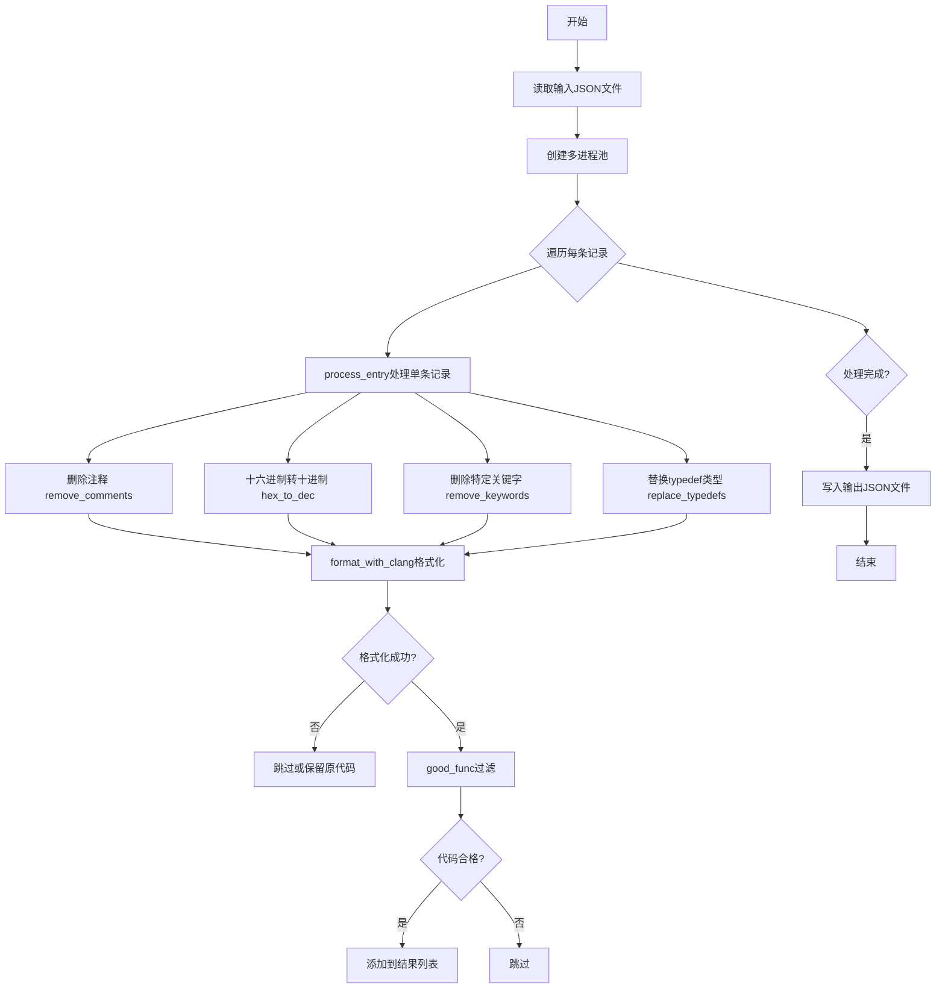
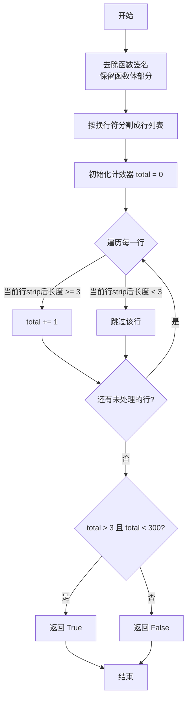
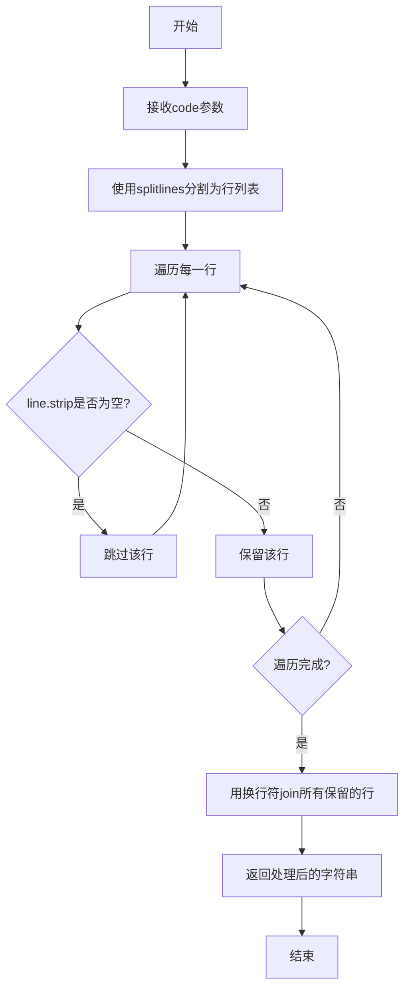
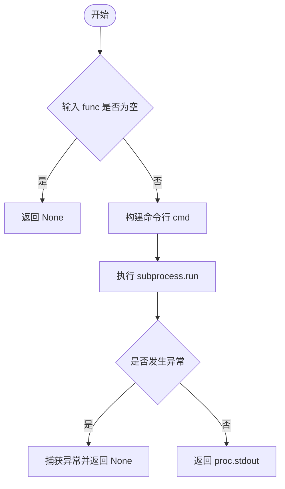
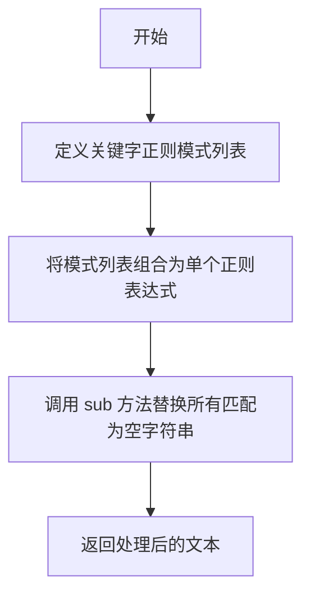
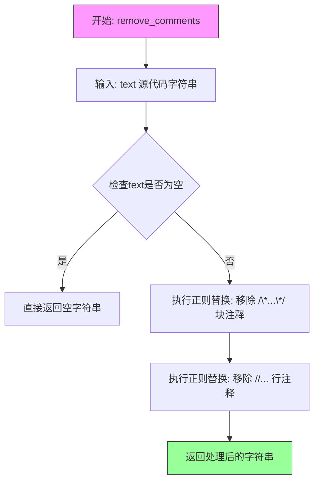
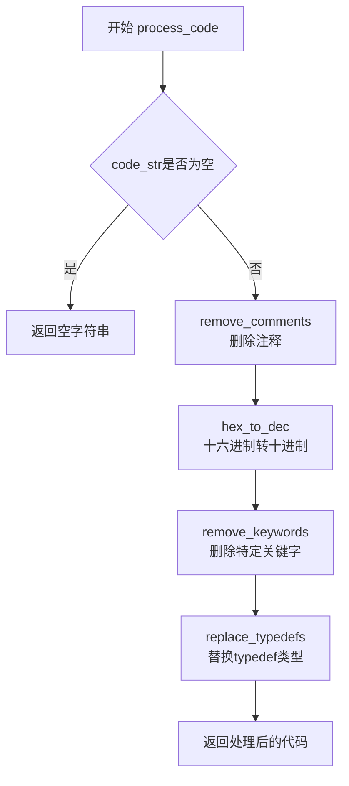
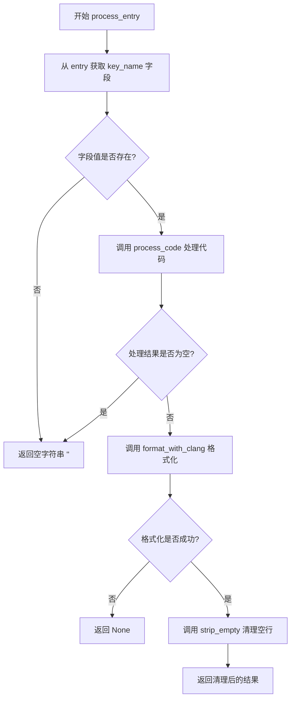
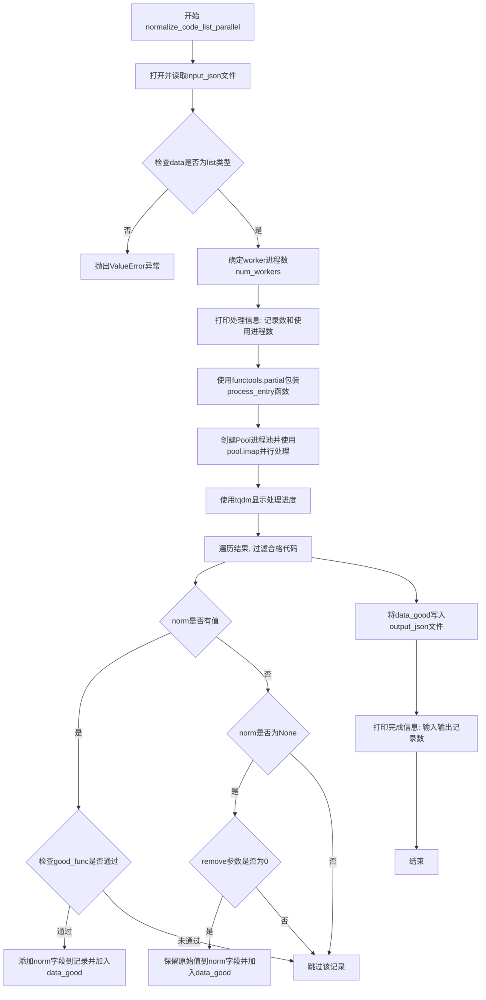

# `LLM4Decompile\sk2decompile\Preprocess\normalize_src_basedonpseudo.py` 详细设计文档

这是一个用于处理和规范化IDA Pro生成的伪代码的工具，主要功能包括十六进制转十进制、删除特定关键字、替换typedef类型、删除注释、使用clang-format格式化代码，并通过多进程并行处理JSON格式的伪代码列表，最终输出规范化的代码。

## 整体流程



## 类结构

```
无类层次结构
└── 全局函数模块
```

## 全局变量及字段


### `typedef_map`
    
typedef类型映射字典，将C语言类型别名（如cpu_set_t、size_t等）映射为原始基础类型（如int、unsigned int等），用于代码规范化处理

类型：`dict`
    


    

## 全局函数及方法


### `good_func`

该函数用于过滤函数代码，判断函数体（去除函数签名后）的有效代码行数是否在3到300行之间（开区间），若在范围内则返回True，否则返回False。

参数：

- `func`：`str`，待检测的函数代码字符串

返回值：`bool`，如果函数体有效代码行数大于3且小于300行则返回True，否则返回False

#### 流程图



#### 带注释源码

```python
def good_func(func):
    """
    判断函数代码行数是否在3-300行之间（开区间）
    
    参数:
        func: str, 待检测的函数代码字符串
        
    返回:
        bool: 如果有效代码行数在(3, 300)范围内返回True，否则返回False
    """
    # Step 1: 去除函数签名，保留函数体部分
    # 通过split('{')[1:]去掉第一个'{'之前的内容（通常是函数返回类型和函数名）
    # 再用'{'join重新拼接，保留函数体
    func = '{'.join(func.split('{')[1:])
    
    # Step 2: 按换行符分割成行列表
    func_sp = func.split('\n')
    
    # Step 3: 初始化有效行计数器
    total = 0
    
    # Step 4: 遍历每一行，统计有效代码行
    # 有效行定义：去除首尾空格后长度 >= 3 的行
    for line in func_sp:
        if len(line.strip()) >= 3:
            total += 1
    
    # Step 5: 判断行数是否在(3, 300)开区间内
    if total > 3 and total < 300:
        return True
    
    # 不满足条件返回False
    return False
```


### `strip_empty`

该工具函数用于移除代码中的空行，通过将代码按行分割、过滤掉空白行（去除首尾空格后为空字符串的行），然后重新用换行符连接，从而得到一个不包含空行的代码字符串。

参数：

- `code`：`str`，需要处理的原始代码字符串

返回值：`str`，移除空行后的代码字符串

#### 流程图



#### 带注释源码

```python
def strip_empty(code):
    """
    移除代码中的空行
    
    参数:
        code: str, 原始代码字符串
        
    返回:
        str, 移除空行后的代码字符串
    """
    # 使用splitlines()将代码分割成行列表
    # 遍历每一行，使用line.strip()去除首尾空格
    # 过滤掉strip()后为空字符串的行（即空行或仅包含空白字符的行）
    # 用换行符将保留的行重新连接成字符串并返回
    return "\n".join(line for line in code.splitlines() if line.strip())
```


### `format_with_clang`

该函数是一个代码格式化的核心组件，通过调用系统本地安装的 `clang-format` 工具，对输入的 C/C++ 源代码字符串（通常为 IDA 伪代码）按照指定的代码风格（如 Google Style）进行标准化处理，并返回格式化后的字符串。

参数：

- `func`：`str`，待格式化的源代码字符串。
- `style`：`str`，`clang-format` 的风格配置选项（默认为 "Google"，常用的还有 "LLVM", "Mozilla" 等）。

返回值：`str | None`，成功返回格式化后的代码字符串；失败（如输入为空、进程超时或 `clang-format` 工具调用异常）返回 `None`。

#### 流程图



#### 带注释源码

```python
def format_with_clang(func: str, style: str = "Google") -> str:
    # 1. 参数校验：如果输入代码为空，直接返回 None，避免无意义的进程调用
    if not func:
        return None
    
    # 2. 构建命令：构造 clang-format 的命令行参数列表
    # 格式：["clang-format", "--style=Google"]
    cmd = ["clang-format", f"--style={style}"]
    
    try:
        # 3. 执行格式化：
        # input=func: 将代码字符串通过 stdin 传给 clang-format
        # text=True: 允许使用字符串而非字节进行输入输出
        # capture_output=True: 捕获 stdout 和 stderr
        # check=True: 如果返回码非 0，则抛出 CalledProcessError
        # timeout=0.5: 设置超时时间，防止 clang-format 陷入无限等待
        proc = subprocess.run(
            cmd,
            input=func,
            text=True,
            capture_output=True,
            check=True,
            timeout=0.5
        )
        
        # 4. 成功处理：clang-format 成功执行，输出结果在 stdout 中
        return proc.stdout
    
    except Exception as e:
        # 5. 异常处理：吞掉所有异常（静默失败），返回 None
        # 实际场景中可选择打印日志：print(f"clang-format failed: {e}")
        return None
```


### `hex_to_dec`

该函数是代码标准化处理流程中的核心组件之一，负责将 IDA Pro 生成的伪代码里的十六进制数字字面量（以 `0x` 开头）转换为其十进制表示形式，以便于代码的归一化和比对分析。

参数：

-  `text`：`str`，输入的包含十六进制常量的字符串（如 C 语言伪代码）。

返回值：`str`，十六进制常量已被替换为十进制的字符串。

#### 流程图

```mermaid
graph TD
    Input([输入 text]) --> Compile[正则匹配: \b0x[0-9a-fA-F]+...]
    Compile --> Replace{遍历匹配项进行替换}
    Replace -->|找到匹配| Extract[提取 hex_part 和 suffix]
    Extract --> Convert[int(hex_part, 16) 转十进制]
    Convert --> Concat[拼接: dec_value + suffix]
    Concat --> Output([返回替换后的 text])
    Replace -->|无匹配| Output
```

#### 带注释源码

```python
def hex_to_dec(text):
    # 定义正则表达式：匹配十六进制数 (0x开头) 和可选的后缀 (u, U, l, L)
    # \b 作为单词边界，防止匹配到类似 0xabcxyz 这种非法格式
    # group(1) 捕获 0x 部分，group(2) 捕获后缀部分
    pattern = re.compile(r'\b(0x[0-9a-fA-F]+)([uUlL]{1,3})?\b')
    
    # 定义内部转换函数，供 re.sub 调用
    def convert(match):
        hex_part = match.group(1) # 提取 '0x...' 部分
        suffix = match.group(2) or "" # 提取类型后缀，如 'u', 'll'，无则为空
        dec_value = str(int(hex_part, 16)) # 将十六进制转换为十进制字符串
        return dec_value + suffix # 拼接十进制值和后缀
    
    # 使用正则替换所有匹配项
    return pattern.sub(convert, text)
```

#### 关键组件与逻辑细节

1.  **正则表达式设计**：
    -   `\b(0x[0-9a-fA-F]+)`：精确匹配十六进制数。
    -   `([uUlL]{1,3})?`：可选地匹配 C/C++ 风格的无符号 (`u`) 或长整型 (`l`, `L`) 后缀。这是必要的，因为 IDA 伪代码常保留这些后缀（如 `0x1000ull`），直接转换可能会丢失类型信息。
2.  **类型转换**：使用 Python 内置的 `int(hex_part, 16)` 确保转换的准确性，即使十六进制数超过 Python 的默认整数精度也能处理（Python 整数是任意精度）。

#### 潜在的技术债务或优化空间

1.  **性能考量**：当前代码在每次调用 `hex_to_dec` 时都会重新编译正则表达式 `pattern`。如果该函数在高频循环（如处理数万条数据）中调用，建议将 `pattern` 提升为模块级全局变量或使用 `functools.lru_cache` 缓存编译结果，以减少正则编译的开销。
2.  **边界情况**：正则表达式对大小写敏感（虽然匹配了 `a-fA-F`）。如果输入代码存在非标准的十六进制写法（如混合大小写），该逻辑能处理，但对于形如 `0XFF` (大写X) 的格式可能会漏匹配（虽然 C 语言标准通常是小写 `x`，但 IDA 有时输出可能不规范）。当前实现未处理大写 `X`。


### `remove_keywords`

该函数用于移除 C/C++ 代码中的特定关键字或修饰符（如函数调用约定 `__fastcall`、`__cdecl`，指针修饰符 `__ptr32`，以及属性关键字 `__noreturn noreturn`）。函数通过正则表达式匹配这些关键字并将其从文本中删除，常用于 IDA Pro 伪代码的规范化预处理流程。

参数：

- `text`：`str`，输入的 C/C++ 代码文本字符串，从中移除特定关键字

返回值：`str`，移除指定关键字后的文本内容

#### 流程图



#### 带注释源码

```python
# ----------------------------
# 2. 删除特定关键字
# ----------------------------
def remove_keywords(text):
    # 定义需要移除的关键字正则表达式模式列表
    # \b 表示单词边界，确保精确匹配而非部分匹配
    # 支持匹配: __fastcall, __cdecl, __ptr32, __noreturn noreturn
    patterns = [
        r'\b__fastcall\b',        # Microsoft C++ 调用约定修饰符
        r'\b__cdecl\b',           # C 调用约定修饰符
        r'\b__ptr32\b',           # 32位指针修饰符
        r'\b__noreturn\s+noreturn\b'  # noreturn 属性（可能重复）
    ]
    
    # 使用 | 将多个模式组合为一个正则表达式，实现一次性匹配所有关键字
    combined_pattern = re.compile('|'.join(patterns))
    
    # 使用 sub 方法将所有匹配到的关键字替换为空字符串（即删除）
    return combined_pattern.sub('', text)
```


### `replace_typedefs`

该函数是代码规范化处理流水线中的核心环节，用于将 C/C++ 代码中的 typedef 类型别名（如 `size_t`、`DWORD` 等）替换为标准原始类型（如 `unsigned int`、`uint32_t`），以便后续代码分析和格式化处理。

参数：

- `text`：`str`，输入的包含 C/C++ 伪代码的字符串，可能包含 typedef 类型别名

返回值：`str`，替换所有 typedef 别名后的字符串

#### 流程图

```mermaid
flowchart TD
    A[开始: 输入text] --> B{text是否为空}
    B -->|是| C[直接返回原text]
    B -->|否| D[获取typedef_map的迭代器]
    D --> E{迭代 typedef_map}
    E -->|还有条目| F[取出 alias 和 original]
    F --> G[使用re.compile构建正则: \b{alias}\b]
    G --> H[使用pattern.sub替换text中的alias为original]
    H --> I{继续迭代}
    I -->|是| E
    I -->|否| J[返回替换后的text]
    C --> J
    J --> K[结束]
```

#### 带注释源码

```python
# 全局变量：typedef 类型别名映射字典
# 键为类型别名，值为对应的原始类型
typedef_map = {
    "cpu_set_t": "int", 
    "nl_item": "int", 
    "__time_t": "int", 
    "__mode_t": "unsigned short",
    "__off64_t": "long long", 
    "__blksize_t": "long", 
    "__ino_t": "unsigned long",
    "__blkcnt_t": "unsigned long long", 
    "__syscall_slong_t": "long", 
    "__ssize_t": "long int",
    "wchar_t": "unsigned short int", 
    "wctype_t": "unsigned short int", 
    "__int64": "long long",
    "__int32": "int", 
    "__int16": "short", 
    "__int8": "char", 
    "_QWORD": "uint64_t",
    "_OWORD": "long double", 
    "_DWORD": "uint32_t", 
    "size_t": "unsigned int", 
    "_BYTE": "uint8_t",
    "_TBYTE": "uint16t_t", 
    "_BOOL8": "uint8_t", 
    "gcc_va_list": "va_list", 
    "_WORD": "unsigned short",
    "_BOOL4": "int", 
    "__va_list_tag": "va_list", 
    "_IO_FILE": "FILE", 
    "DIR": "int",
    "__fsword_t": "long", 
    "__kernel_ulong_t": "int", 
    "cc_t": "int", 
    "speed_t": "int",
    "fd_set": "int", 
    "__suseconds_t": "int", 
    "_UNKNOWN": "void",
    "__sighandler_t": "void (*)(int)", 
    "__compar_fn_t": "int (*)(const void *, const void *)",
}

def replace_typedefs(text):
    """
    替换函数：将typedef类型别名替换为原始类型
    
    参数:
        text: str, 输入的C/C++代码字符串
        
    返回:
        str, 替换后的代码字符串
    """
    # 遍历typedef_map字典中的每一个别名-原始类型对
    for alias, original in typedef_map.items():
        # 使用正则表达式匹配完整的单词边界\b，避免部分匹配
        # re.escape()确保特殊字符被正确转义
        pattern = re.compile(rf'\b{re.escape(alias)}\b')
        # 将文本中所有匹配的别名替换为原始类型
        text = pattern.sub(original, text)
    # 返回完成所有替换后的文本
    return text
```

---

### 相关全局变量

#### `typedef_map`

- **类型**：`dict`
- **描述**：一个静态字典，定义了 C/C++ 中常见的 typedef 类型别名到其原始类型的映射关系，涵盖了 Linux 内核类型、Windows 类型、GCC 扩展类型等多个体系。


### `remove_comments`

该函数用于删除C语言代码中的注释，包括块注释（`/* ... */`）和行注释（`// ...`），通过两个正则表达式替换操作将注释内容从源代码字符串中移除并返回处理后的文本。

参数：

- `text`：`str`，输入的包含C语言注释的源代码字符串

返回值：`str`，移除所有注释后的源代码字符串

#### 流程图



#### 带注释源码

```python
# ----------------------------
# 4. 删除注释
# ----------------------------
def remove_comments(text):
    """
    删除C语言代码中的块注释和行注释
    
    Args:
        text: 包含C语言注释的源代码字符串
    
    Returns:
        移除注释后的源代码字符串
    """
    # 移除块注释 /* ... */，使用 re.DOTALL 让 . 可以匹配换行符
    text = re.sub(r'/\*.*?\*/', '', text, flags=re.DOTALL)
    
    # 移除行注释 // ... ，使用 re.MULTILINE 让 ^ 匹配每行开头
    text = re.sub(r'//.*?$', '', text, flags=re.MULTILINE)
    
    return text
```

---

#### 关键组件信息

| 组件名称 | 一句话描述 |
|---------|-----------|
| `re` 模块 | Python正则表达式模块，用于模式匹配和文本替换 |
| `re.DOTALL` 标志 | 使 `.` 元字符匹配包括换行符在内的所有字符 |
| `re.MULTILINE` 标志 | 使 `^` 和 `$` 匹配每行的行首和行尾 |

#### 潜在的技术债务或优化空间

1. **正则表达式效率**：对于大型代码文件，连续执行两次 `re.sub` 可能存在性能优化空间，可考虑合并为一个正则表达式或使用预编译模式 `re.compile()` 缓存正则表达式对象以提升多次调用时的性能
2. **嵌套注释处理**：当前实现无法正确处理嵌套的块注释（如 `/* outer /* inner */ */`），这种场景在标准C语言中虽不常见但理论上可能存在
3. **字符串字面量保护**：函数未考虑字符串字面量内的注释（如 `char *s = "// this is not a comment";`），可能会错误删除字符串内容中的 `//` 部分
4. **缺少输入校验**：未对输入 `text` 的类型进行校验，若传入非字符串类型可能导致运行时错误

#### 其它项目

**设计目标与约束**：
- 目标：清除C语言风格的所有注释，保留实际代码内容
- 约束：仅处理 `/* */` 和 `//` 两种注释形式，不处理其他注释风格（如Python的 `#` 注释）

**错误处理与异常设计**：
- 未实现显式错误处理，若输入为 `None` 或非字符串类型可能抛出 `TypeError`
- 正则表达式操作失败时（理论上极少发生）会向上传播异常

**数据流与状态机**：
- 该函数是纯函数式转换，输入字符串经正则替换后直接输出，无状态依赖
- 作为 `process_code` 处理流水线（remove_comments → hex_to_dec → remove_keywords → replace_typedefs）的第一道工序

**外部依赖与接口契约**：
- 依赖 `re` 标准库，无外部依赖
- 输入：任意包含C语言注释的字符串
- 输出：移除注释后的字符串，可能为空字符串（若输入全为注释）


# 伪代码标准化处理工具设计文档

## 1. 一段话描述

该代码是一个**IDA Pro伪代码标准化工具**，通过多进程并行处理方式，对反编译生成的伪代码进行一系列清理和转换操作（包括删除注释、十六进制转十进制、移除特定关键字、替换typedef类型），最终使用clang-format格式化输出，得到统一规范的C风格代码。

## 2. 文件的整体运行流程

```
┌─────────────────┐
│  命令行参数解析  │
│  (argparse)     │
└────────┬────────┘
         │
         ▼
┌─────────────────┐
│  加载JSON数据   │
│  normalize_code_ │
│  list_parallel  │
└────────┬────────┘
         │
         ▼
┌─────────────────┐
│  多进程池处理    │
│  (multiprocess) │
│  ├─ process_entry│
│  │   └─ process_code
│  │       ├─ remove_comments
│  │       ├─ hex_to_dec
│  │       ├─ remove_keywords
│  │       └─ replace_typedefs
│  │   └─ format_with_clang
│  │   └─ strip_empty
│  │   └─ good_func
│  └─ tqdm进度条
└────────┬────────┘
         │
         ▼
┌─────────────────┐
│  过滤 & 保存结果 │
│  JSON文件输出   │
└─────────────────┘
```

## 3. 全局变量和全局函数详细信息

### 3.1 全局变量

| 名称 | 类型 | 描述 |
|------|------|------|
| `typedef_map` | `dict` | 类型别名映射字典，将伪代码中的typedef类型替换为原始C类型 |

### 3.2 全局函数

#### good_func

参数：
- `func`：`str`，待检测的函数代码字符串

返回值：`bool`，如果函数有效（行数在4-299之间）返回True，否则返回False

#### strip_empty

参数：
- `code`：`str`，待处理的代码字符串

返回值：`str`，移除空行后的代码字符串

#### format_with_clang

参数：
- `func`：`str`，待格式化的代码字符串
- `style`：`str`，格式化风格（默认"Google"）

返回值：`str` 或 `None`，格式化后的代码字符串，失败返回None

#### hex_to_dec

参数：
- `text`：`str`，待转换的文本

返回值：`str`，将十六进制数字转换为十进制的文本

#### remove_keywords

参数：
- `text`：`str`，待处理的文本

返回值：`str`，移除特定关键字后的文本

#### replace_typedefs

参数：
- `text`：`str`，待处理的文本

返回值：`str`，替换typedef别名后的文本

#### remove_comments

参数：
- `text`：`str`，待处理的文本

返回值：`str`，移除注释后的文本

#### process_code

参数：
- `code_str`：`str`，待处理的伪代码字符串

返回值：`str`，处理后的标准化代码字符串

#### process_entry

参数：
- `entry`：`dict`，包含伪代码的字典对象
- `key_name`：`str`，伪代码字段名（默认"pseudo"）

返回值：`str` 或 `''` 或 `None`，处理后的标准化代码

#### normalize_code_list_parallel

参数：
- `input_json`：`str`，输入JSON文件路径
- `output_json`：`str`，输出JSON文件路径
- `key_name`：`str`，字段名（默认"pseudo"）
- `num_workers`：`int` 或 `None`，进程数（默认CPU核心数）
- `remove`：`int`，是否移除失败案例（默认1）

返回值：`None`，无返回值

---

### `process_code`

这是工具的核心处理函数，依次调用四个处理函数完成伪代码的标准化。

参数：
- `code_str`：`str`，待处理的伪代码字符串

返回值：`str`，处理后的标准化代码字符串

#### 流程图



#### 带注释源码

```python
def process_code(code_str):
    """
    主处理函数 - 依次调用各处理函数标准化伪代码
    
    处理流程：
    1. 删除注释（remove_comments）
    2. 十六进制转十进制（hex_to_dec）
    3. 删除特定关键字（remove_keywords）
    4. 替换typedef类型（replace_typedefs）
    
    参数:
        code_str: 待处理的伪代码字符串
        
    返回值:
        处理后的标准化代码字符串
    """
    # 步骤1: 删除代码中的注释（/* */ 和 // 注释）
    code_str = remove_comments(code_str)
    
    # 步骤2: 将十六进制数字（如0xFF）转换为十进制（如255）
    code_str = hex_to_dec(code_str)
    
    # 步骤3: 移除特定的关键字（如__fastcall, __cdecl等）
    code_str = remove_keywords(code_str)
    
    # 步骤4: 将typedef定义的类型别名替换为原始类型
    code_str = replace_typedefs(code_str)
    
    # 返回处理后的代码字符串
    return code_str
```

---

## 4. 关键组件信息

| 组件名称 | 功能描述 |
|----------|----------|
| `process_code` | 核心处理函数，串联四个处理步骤 |
| `typedef_map` | 类型别名映射表，定义40+种类型转换规则 |
| `normalize_code_list_parallel` | 多进程并行处理入口，负责整体流程控制 |
| `format_with_clang` | 调用clang-format进行代码格式化 |
| `good_func` | 过滤无效代码（行数过少或过多） |

---

## 5. 潜在的技术债务或优化空间

1. **硬编码的类型映射表**：`typedef_map` 字典包含40+个类型映射，建议改为配置文件或从外部加载
2. **异常处理不完善**：`format_with_clang` 中捕获异常后仅返回None，缺少日志记录
3. **缺少重试机制**：格式化失败时直接跳过，无重试逻辑
4. **配置分散**：格式化风格、超时时间等参数硬编码在函数内
5. **性能优化空间**：可考虑使用线程池替代进程池（针对I/O密集型任务）
6. **错误报告不详细**：处理失败时缺少具体错误原因和位置信息
7. **依赖外部工具**：依赖`clang-format`可执行文件在PATH中，建议添加检测逻辑

---

## 6. 其它项目

### 设计目标与约束

- **目标**：将IDA Pro反编译的伪代码转换为标准化的C风格代码
- **输入格式**：JSON数组，每项包含伪代码字段
- **输出格式**：JSON数组，包含标准化后的伪代码
- **性能要求**：支持多进程并行处理大规模数据集

### 错误处理与异常设计

| 场景 | 处理方式 |
|------|----------|
| clang-format执行失败 | 返回None，由上层决定是否保留原代码 |
| 输入JSON格式错误 | 抛出ValueError异常 |
| 文件读写失败 | 抛出IOError异常 |
| 进程池异常 | 捕获并记录，继续处理其他记录 |

### 数据流与状态机

```
输入JSON → 读取文件 → 多进程分发 → process_entry
                                      │
                                      ├─ process_code (4步转换)
                                      ├─ format_with_clang (格式化)
                                      ├─ strip_empty (清理空行)
                                      ├─ good_func (有效性检查)
                                      │
                                      ▼
                              过滤无效记录 → 输出JSON
```

### 外部依赖与接口契约

| 依赖项 | 版本要求 | 用途 |
|--------|----------|------|
| Python | 3.6+ | 运行环境 |
| clang-format | 在PATH中 | 代码格式化 |
| tqdm | - | 进度条显示 |
| multiprocessing | Python标准库 | 多进程并行 |
| json/re/argparse | Python标准库 | 数据处理 |

### 命令行接口

```bash
python script.py \
    --input_json input.json \      # 输入文件
    --output_json output.json \    # 输出文件  
    --key_name pseudo \            # 字段名
    --workers 32 \                 # 进程数
    --remove 1                     # 是否移除失败案例
```


### `process_entry`

包装函数，处理单条记录的核心逻辑。该函数接收一个包含伪代码的字典，根据指定的键名提取伪代码，进行注释移除、十六进制转换、关键字删除、typedef 替换等处理，然后使用 clang-format 格式化代码，最后清理空行并返回规范化后的代码字符串。

参数：

- `entry`：`dict`，输入的记录字典，包含伪代码字段
- `key_name`：`str`，要处理的字段名，默认为 `'pseudo'`

返回值：`str | None`，清洗格式化后的代码字符串；空字符串表示输入为空，None 表示格式化失败

#### 流程图



#### 带注释源码

```python
# 包装 process_code，使其接受一个 dict 并处理字段
def process_entry(entry, key_name='pseudo'):
    """
    处理单条记录的核心逻辑
    
    Args:
        entry: 输入的记录字典
        key_name: 要处理的字段名，默认为 'pseudo'
    
    Returns:
        str | None: 清洗格式化后的代码字符串，空字符串表示输入为空，None 表示格式化失败
    """
    # 从 entry 字典中获取指定 key_name 的值，默认为空字符串
    result = process_code(entry.get(key_name, ''))
    
    # 检查处理后的代码是否为空（仅包含空白字符）
    if not result.strip():
        return ''  # 输入为空，返回空字符串
    
    # 使用 clang-format 格式化代码
    formatted = format_with_clang(result)
    
    # 格式化失败时返回 None
    if formatted is None:
        return None
    
    # 清理格式化后代码中的空行
    cleaned = strip_empty(formatted)
    
    # 返回清理后的结果
    return cleaned
```


### `normalize_code_list_parallel`

该函数是主入口函数，用于并行处理JSON文件中的IDA伪代码列表。它使用多进程Pool对输入JSON数组中的每条记录进行规范化处理（包括十六进制转十进制、删除特定关键字、替换typedef类型、删除注释、格式化代码等），过滤掉不合格的代码，并将结果保存到输出JSON文件。

参数：

- `input_json`：`str`，输入的JSON文件路径，包含对象数组
- `output_json`：`str`，输出的JSON文件路径，处理后的结果将保存到此
- `key_name`：`str`，指定JSON对象中需要处理的字段名，默认为'pseudo'
- `num_workers`：`int | None`，并行worker进程数，默认为None（使用cpu_count()自动获取）
- `remove`：`int`，是否移除处理失败的记录，1表示移除，0表示保留原始值

返回值：`None`，该函数直接写入文件，不返回数据

#### 流程图



#### 带注释源码

```python
def normalize_code_list_parallel(input_json, output_json, key_name='pseudo', num_workers=None, remove=1):
    """
    并行处理JSON文件中的IDA伪代码列表
    
    参数:
        input_json: str, 输入JSON文件路径
        output_json: str, 输出JSON文件路径  
        key_name: str, 要处理的字段名，默认为'pseudo'
        num_workers: int | None, 并行进程数，None时使用cpu_count()
        remove: int, 是否移除处理失败的记录，1移除，0保留原值
    
    返回:
        None, 结果直接写入output_json文件
    """
    # 1. 读取输入JSON文件
    with open(input_json, 'r', encoding='utf-8') as f:
        data = json.load(f)

    # 2. 验证输入数据格式，必须是数组
    if not isinstance(data, list):
        raise ValueError("输入 JSON 应为对象数组")

    # 3. 确定并行worker数量，未指定则使用CPU核心数
    num_workers = num_workers or cpu_count()
    print(f"[+] 开始处理 {len(data)} 条记录，使用 {num_workers} 个进程")

    # 4. 使用functools.partial包装process_entry函数，绑定key_name参数
    from functools import partial
    process_entry_key = partial(process_entry, key_name=key_name)

    # 5. 创建进程池并并行处理所有记录，使用tqdm显示进度
    with Pool(processes=num_workers) as pool:
        result = list(tqdm(pool.imap(process_entry_key, data), total=len(data), desc="Processing"))

    # 6. 遍历处理结果，过滤和整理数据
    data_good = []
    for record, norm in zip(data, result):
        if norm:
            # 如果有规范化结果，检查是否通过good_func验证
            if not good_func(norm):
                continue  # 代码行数不符合要求，跳过
            # 规范化成功，添加norm字段并加入结果列表
            record[f"{key_name}_norm"] = norm
            data_good.append(record)
        elif norm is None:
            # 规范化失败（format_with_clang返回None）
            if not remove:
                # remove=0时保留原始值
                record[f"{key_name}_norm"] = record[key_name]
                data_good.append(record)
            # remove=1时跳过失败的记录

    # 7. 将处理结果写入输出JSON文件
    with open(output_json, 'w', encoding='utf-8') as f:
        json.dump(data_good, f, indent=2, ensure_ascii=False)

    # 8. 打印完成统计信息
    print(f"[✓] 完成处理：{input_json}:{len(data)} → {output_json}:{len(data_good)}")
```

## 关键组件


### 十六进制转十进制转换

将IDA伪代码中的十六进制字面量（如0x1000）转换为十进制表示

### 特定关键字删除

移除IDA伪代码中的特定编译器修饰符（如__fastcall、__cdecl、__ptr32等）

### typedef类型映射替换

将IDA伪代码中的Windows/Linux特定类型别名（如cpu_set_t、size_t、_DWORD等）替换为标准C类型

### 注释清理

删除C风格（/* */）和C++风格（//）的代码注释

### 伪代码标准化处理管道

将hex转decimal、删除关键字、typedef替换、注释删除等步骤串联成完整的伪代码预处理流程

### Clang-format代码格式化

调用系统clang-format工具对处理后的伪代码进行标准化格式化

### 函数有效性过滤

基于代码行数（3-300行）判断伪代码是否为有效函数，排除过短或过长的无效代码片段

### 空行清理

移除格式化后代码中的空白行，保留有效代码行

### 多进程并行处理框架

使用Python multiprocessing.Pool实现大规模伪代码列表的并行处理，支持可配置的worker数量

### 命令行参数解析

使用argparse构建的CLI入口，支持输入输出文件路径、JSON键名、进程数等参数配置

## 问题及建议


### 已知问题

- **正则表达式重复编译**：在 `replace_typedefs` 函数中，每次调用都重新编译所有 `typedef` 的正则表达式，效率低下，应在模块加载时预编译。
- **`format_with_clang` 超时过短**：超时设置为 0.5 秒，对于复杂的代码片段可能导致格式化失败，建议增加超时时间或添加重试机制。
- **`good_func` 函数逻辑不清晰**：`func = '{'.join(func.split('{')[1:]` 这种写法难以理解，且魔法数字 3 和 300 缺乏注释说明。
- **`remove_keywords` 正则表达式问题**：`__noreturn\s+noreturn` 模式可能无法匹配实际场景中的关键字。
- **异常处理过于宽泛**：`format_with_clang` 中捕获所有 Exception，没有区分不同类型的错误。
- **缺少输入验证**：没有检查 `clang-format` 是否安装，直接调用可能导致程序崩溃。
- **进度条提示语法错误**：代码中 `[+] 开始处理...` 缺少结束引号。
- **数据处理效率低**：`process_entry` 函数中先处理再格式化，没有利用批量处理的优势。

### 优化建议

- **预编译正则表达式**：将 `typedef_map` 的正则表达式在模块初始化时编译并存入字典，避免重复编译。
- **增加超时和重试**：将 `clang-format` 超时调整为更合理的值（如 2-3 秒），并对格式化失败的条目添加重试逻辑。
- **完善错误处理**：区分不同异常类型，添加详细的日志记录，记录格式化失败的原因。
- **添加输入验证**：在程序启动时检查 `clang-format` 是否可用，不可用时给出明确提示。
- **优化 `good_func`**：添加注释解释行数阈值的含义，考虑使用更易读的代码逻辑。
- **添加日志模块**：使用 `logging` 模块替代 print 输出，便于调试和问题追踪。
- **考虑批量处理**：如果上游数据允许，可以考虑在子进程中批量处理多条记录，减少进程间通信开销。

## 其它


### 设计目标与约束

本项目旨在清理和标准化IDA反编译器生成的伪代码，通过一系列转换操作（移除注释、十六进制转十进制、关键字清理、typedef替换、代码格式化）提升代码可读性，同时利用多进程并行处理提升大规模数据处理效率。约束条件包括：依赖外部工具clang-format、输入必须是JSON数组格式、输出JSON文件必须保持UTF-8编码。

### 错误处理与异常设计

代码采用分层异常处理策略。在format_with_clang函数中，使用try-except捕获subprocess超时和执行异常，返回None表示格式化失败；在normalize_code_list_parallel函数中，验证输入JSON数据必须为list类型，否则抛出ValueError；文件读写操作使用with语句确保资源正确释放。对于格式化失败的处理，通过remove参数控制：remove=1时丢弃失败记录，remove=0时保留原始伪代码。

### 数据流与状态机

数据处理遵循线性管道模式：输入JSON数组 → 遍历每条记录 → 提取指定key的伪代码 → remove_comments(移除C风格和单行注释) → hex_to_dec(转换十六进制常量) → remove_keywords(清理特定关键字) → replace_typedefs(替换typedef别名) → format_with_clang(调用clang-format格式化) → strip_empty(移除空行) → good_func(验证代码行数在3-300行之间) → 输出到新JSON文件。

### 外部依赖与接口契约

核心依赖包括：Python标准库re、json、argparse、multiprocessing、subprocess、random；第三方库tqdm（进度条显示）；外部工具clang-format（代码格式化，必须在系统PATH中或可执行）。接口契约方面，输入JSON必须是数组对象，每项包含key_name指定的字段；输出JSON为处理成功且通过good_func验证的记录数组，每条记录包含原始字段和新增的{key_name}_norm字段。

### 性能考量

代码通过多进程Pool实现并行处理，默认使用cpu_count()确定进程数，实际调用时可通过--workers参数指定。使用tqdm实时显示处理进度和预估剩余时间。good_func函数过滤掉行数少于3行或多于300行的无效代码，减少无效计算。针对大规模数据集（可能数万条记录），32个进程可有效利用多核CPU资源。

### 安全性考虑

代码在文件操作层面使用with语句确保文件句柄正确关闭，防止资源泄漏。输入数据通过isinstance验证类型，防止非数组输入导致的后续处理错误。subprocess调用使用capture_output=True避免子进程输出污染主进程，timeout=0.5秒防止clang-format无限等待。虽然代码主要处理可信的IDA伪代码输出，但正则替换和subprocess调用潜在注入风险，在处理不可信来源时应谨慎。

### 配置与参数说明

命令行参数包括：--input_json（输入JSON文件路径，默认exebench_format_top1p.json）、--output_json（输出JSON文件路径，默认exebench_format_pseudo_top1p.json）、--key_name（要处理的字段名，默认pseudo）、--workers（进程数，默认32）、--remove（是否移除格式化失败记录，1移除0保留，默认1）。typedef_map字典可在代码中直接修改以扩展类型映射。

### 使用示例

```bash
# 基本用法
python script.py

# 指定输入输出文件
python script.py --input_json input.json --output_json output.json

# 指定处理字段和进程数
python script.py --key_name assembly_pseudo --workers 16

# 保留格式化失败的原始记录
python script.py --remove 0
```

### 部署要求

部署环境需要满足：Python 3.6+解释器；安装tqdm依赖（pip install tqdm）；系统安装clang-format工具（Ubuntu: apt-get install clang-format，macOS: brew install clang-format，Windows: 从LLVM官网下载并添加到PATH）。内存需求随输入数据集大小线性增长，建议至少4GB可用内存处理万级记录。

### 版本历史和变更记录

当前版本为1.0.0初始版本。核心功能包括：完整的伪代码处理管道、多进程并行支持、命令行参数化配置、clang-format集成格式化、good_func质量过滤。后续可考虑添加：支持更多代码格式化工具、增加自定义正则替换规则、支持更多输入格式（CSV、XML）、添加日志记录系统。
    