# `LLM4Decompile\sk2decompile\evaluation\bringupbench\scripts\build-func-maps.py` 详细设计文档

该脚本是一个函数级映射生成工具，用于将源代码文件、伪代码(.pseudo)和汇编文件(.s)中的函数进行关联分析。它解析Makefile获取源文件，提取源代码函数，解析伪代码和汇编代码中的函数定义，最终生成JSONL格式的映射文件，记录源代码、伪代码及其规范化结果、汇编代码之间的对应关系。

## 整体流程

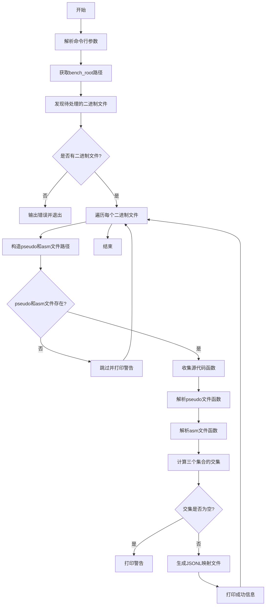

## 类结构

```
无类定义（纯函数式编程）
所有功能通过模块级函数实现
```

## 全局变量及字段


### `FUNC_KEYWORDS`
    
存储用于过滤的C语言函数关键词集合，包含if、for、while等关键字，用于在提取函数时跳过这些标识符

类型：`set`
    


### `TYPEDEF_MAP`
    
存储C语言类型别名到标准类型的映射关系，用于将非标准的类型名称（如cpu_set_t、size_t等）替换为标准类型

类型：`dict`
    


    

## 全局函数及方法


### `_load_config_env`

该函数用于从项目根目录（当前脚本所在目录的父级目录）读取名为 `config.env` 的配置文件，并将其内容解析为字典格式返回。它会忽略空行、以 `#` 开头的注释行以及不包含 `=` 的无效行。

参数：

- （无参数，该函数不接收任何输入参数）

返回值：`dict`，返回包含配置键值对的字典。如果文件不存在或内容为空，则返回空字典。

#### 流程图

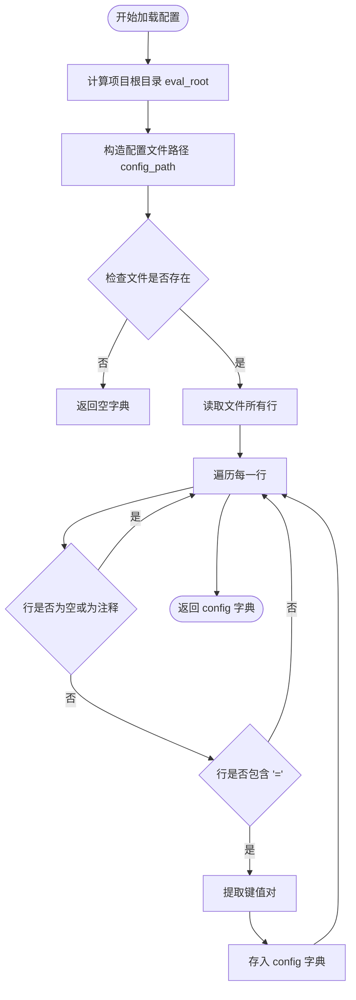

#### 带注释源码

```python
def _load_config_env() -> dict:
    """Load config.env from the eval project root."""
    # 1. 确定项目根目录：通过当前脚本文件的路径向上两级（即父目录的父目录）
    eval_root = Path(__file__).resolve().parents[1]
    # 2. 拼接 config.env 文件的完整路径
    config_path = eval_root / "config.env"
    # 3. 初始化配置字典
    config = {}
    # 4. 检查配置文件是否存在
    if config_path.exists():
        # 5. 读取文件内容并按行分割
        for line in config_path.read_text().splitlines():
            # 去除行首尾空格
            line = line.strip()
            # 6. 跳过空行和注释行（以 # 开头）
            if not line or line.startswith("#"):
                continue
            # 7. 检查是否符合 Key=Value 格式
            if "=" in line:
                # 使用 partition 分割只取第一个等号前的键和后的值
                key, _, value = line.partition("=")
                # 去除键值多余的空格并存入字典
                config[key.strip()] = value.strip()
    # 8. 返回解析后的配置字典
    return config
```


### `_get_bench_root`

解析并返回benchmark仓库根目录路径，优先级顺序为：CLI参数 > 环境变量 > 配置文件 `config.env`，若三者均未设置则程序退出并输出错误信息。

参数：

- `cli_value`：`str | None`，可选的CLI传入值，优先级最高

返回值：`Path`，解析后的benchmark仓库根目录绝对路径

#### 流程图

```mermaid
flowchart TD
    A[开始] --> B{cli_value 是否存在?}
    B -- 是 --> C[返回 Path/cli_value].resolve]
    B -- 否 --> D{环境变量 BENCH_REPO_ROOT 是否存在?}
    D -- 是 --> E[返回 Path/env_val].resolve]
    D -- 否 --> F[加载 config.env]
    F --> G{config 中 BENCH_REPO_ROOT 是否存在?}
    G -- 是 --> H[返回 Path/config_value].resolve]
    G -- 否 --> I[sys.exit 错误信息]
    C --> Z[结束]
    E --> Z
    H --> Z
```

#### 带注释源码

```python
def _get_bench_root(cli_value: str | None = None) -> Path:
    """
    Resolve the benchmark repo root from CLI arg, env var, or config.env.
    
    优先级顺序：
    1. CLI 参数 (cli_value)
    2. 环境变量 (BENCH_REPO_ROOT)
    3. 配置文件 (config.env)
    4. 若均未设置则退出程序
    """
    # 步骤1：检查CLI参数，若存在则直接返回解析后的绝对路径
    if cli_value:
        return Path(cli_value).resolve()
    
    # 步骤2：检查环境变量 BENCH_REPO_ROOT
    env_val = os.environ.get("BENCH_REPO_ROOT")
    if env_val:
        return Path(env_val).resolve()
    
    # 步骤3：从 config.env 加载配置并检查
    config = _load_config_env()
    if "BENCH_REPO_ROOT" in config:
        return Path(config["BENCH_REPO_ROOT"]).resolve()
    
    # 步骤4：三者均未设置，退出程序并输出错误信息
    sys.exit("error: BENCH_REPO_ROOT not set. Use --bench-root, set the env var, or configure config.env")
```


### `_read_text`

该函数是一个简单的工具函数，用于读取指定路径的文件内容并以字符串形式返回，支持 UTF-8 编码。

参数：

- `path`：`Path`，需要读取的文件路径对象

返回值：`str`，返回读取到的文件内容字符串

#### 流程图

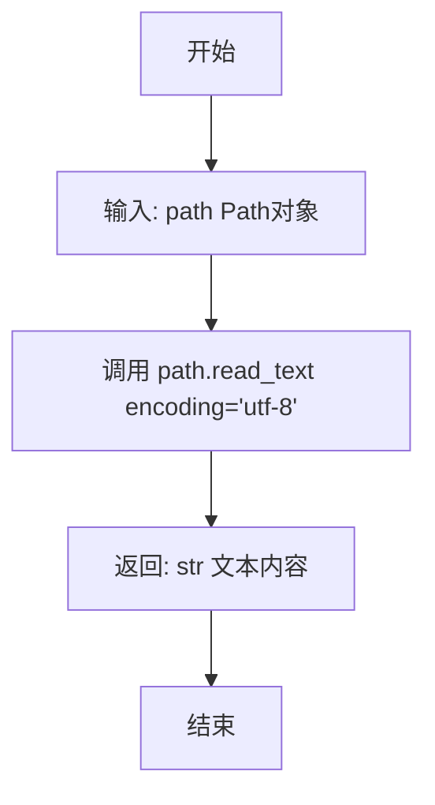

#### 带注释源码

```python
def _read_text(path: Path) -> str:
    """
    读取文件内容并返回字符串。
    
    Args:
        path: pathlib.Path 对象，指向需要读取的文件
        
    Returns:
        str: 文件的文本内容，使用 UTF-8 编码读取
    """
    return path.read_text(encoding="utf-8")
```


### `_strip_empty`

移除代码中的空行（只包含空白字符的行），返回清理后的代码字符串。

参数：

- `code`：`str`，输入的代码字符串，需要移除空行

返回值：`str`，移除空行后的代码字符串

#### 流程图

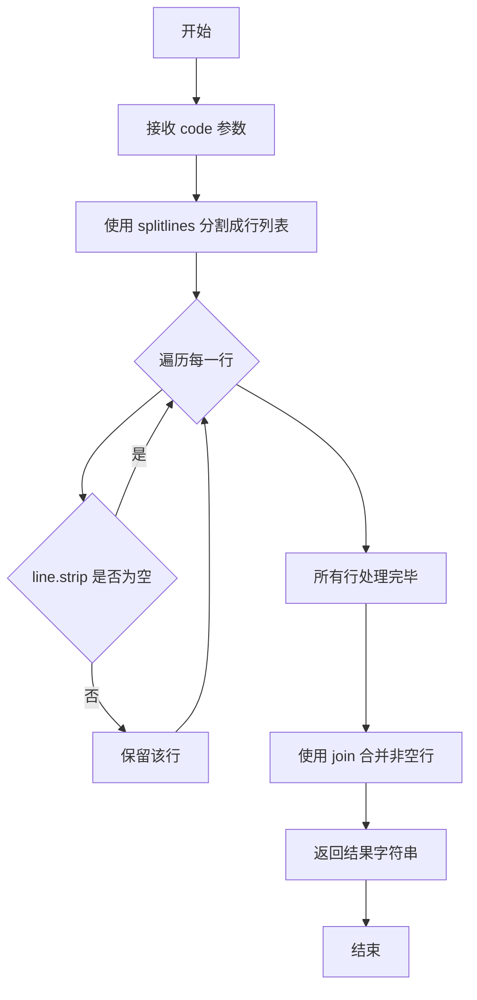

#### 带注释源码

```python
def _strip_empty(code: str) -> str:
    """
    移除代码字符串中的空行。
    
    该函数过滤掉只包含空白字符的行，保留有效代码行。
    用于清理格式化后的代码，保持代码结构紧凑。
    
    参数:
        code: 输入的代码字符串，可能包含空行
        
    返回:
        移除空行后的代码字符串，行之间用换行符连接
    """
    # 使用生成器表达式过滤空行
    # splitlines() 按换行符分割字符串为行列表
    # line.strip() 移除行首尾的空白字符
    # 如果处理后长度为0，则该行为空行，应过滤掉
    return "\n".join(line for line in code.splitlines() if line.strip())
```


### `_good_func`

该函数用于判断给定的函数代码是否符合有效条件，通过计算函数体中非空且长度大于等于3的行数来判断，合理的函数行数应在3到300行之间。

参数：

- `func`：`str`，待检查的函数代码字符串

返回值：`bool`，如果函数体包含的非空行数大于3且小于300则返回True，否则返回False

#### 流程图

```mermaid
flowchart TD
    A[开始] --> B{func中是否包含{字符}
    B -->|是| C[取{之后的部分作为body]
    B -->|否| D[将整个func作为body]
    C --> E[初始化计数器total=0]
    D --> E
    E --> F[遍历body的每一行]
    F --> G{当前行strip后长度>=3?}
    G -->|是| H[total+=1]
    G -->|否| I[不计数]
    H --> J[遍历下一行]
    I --> J
    J --> K{是否还有未处理行?}
    K -->|是| F
    K -->|否| L{3 < total < 300?}
    L -->|是| M[返回True]
    L -->|否| N[返回False]
```

#### 带注释源码

```python
def _good_func(func: str) -> bool:
    """
    判断函数代码是否符合有效条件。
    
    通过计算函数体中非空且长度>=3的行数来判断函数是否有效。
    有效的函数行数应在3到300行之间（不包括3和300）。
    
    参数:
        func: str, 待检查的函数代码字符串
        
    返回值:
        bool: 如果函数体有效返回True,否则返回False
    """
    # 处理函数体：如果包含{，则取{之后的部分；否则使用整个字符串
    body = "{".join(func.split("{", 1)[1:]) if "{" in func else func
    
    # 初始化行计数器
    total = 0
    
    # 遍历函数体的每一行
    for line in body.splitlines():
        # 只统计非空且长度>=3的行（排除短注释、空行等）
        if len(line.strip()) >= 3:
            total += 1
    
    # 返回判断结果：行数必须在3到300之间（开区间）
    return 3 < total < 300
```


### `_format_with_clang`

使用 clang-format 工具对输入的函数代码进行格式化，支持自定义代码风格，返回格式化后的代码字符串。如果输入为空或格式化失败，则返回 None。

参数：

- `func`：`str`，需要格式化的函数代码字符串
- `style`：`str`，clang-format 的代码风格选项，默认为 "Google"

返回值：`Optional[str]`，格式化后的代码字符串；如果输入为空或发生异常则返回 None

#### 流程图

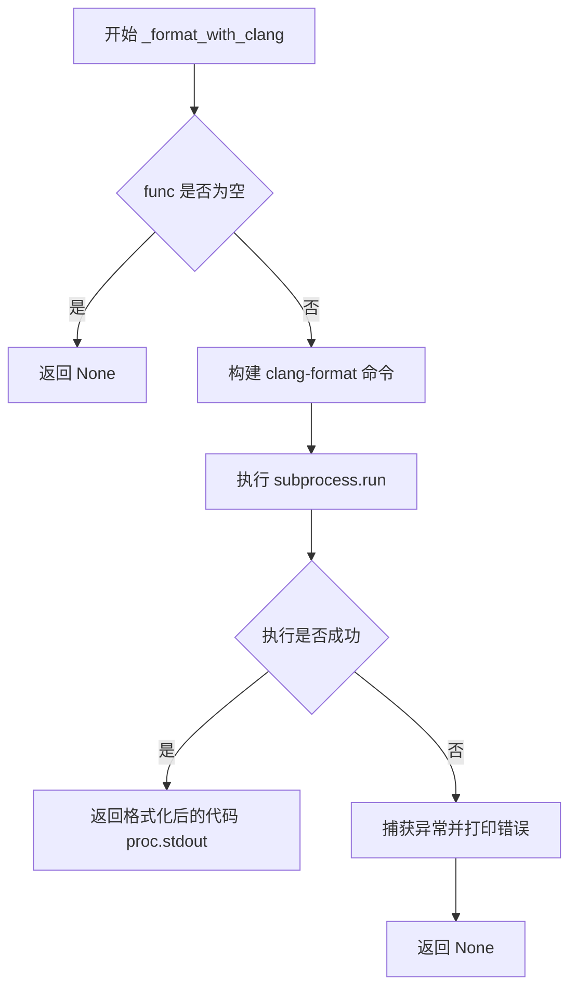

#### 带注释源码

```python
def _format_with_clang(func: str, style: str = "Google") -> Optional[str]:
    """
    使用 clang-format 对代码进行格式化
    
    参数:
        func: 要格式化的代码字符串
        style: clang-format 风格选项，默认为 Google 风格
    
    返回:
        格式化后的代码字符串，失败返回 None
    """
    # 检查输入是否为空
    if not func:
        return None
    
    # 构建 clang-format 命令
    # 格式: clang-format --style=Google
    cmd = ["clang-format", f"--style={style}"]
    
    try:
        # 执行子进程运行 clang-format
        # input: 将 func 作为输入传递给 clang-format
        # text: 使用文本模式（字符串而非字节）
        # capture_output: 捕获 stdout 和 stderr
        # check: 如果返回码非零则抛出异常
        # timeout: 15秒超时保护
        proc = subprocess.run(
            cmd,
            input=func,
            text=True,
            capture_output=True,
            check=True,
            timeout=15,
        )
        # 返回格式化后的代码
        return proc.stdout
    except Exception as e:
        # 捕获所有异常并打印错误信息
        print(e)
        return None
```


### `_hex_to_dec`

将文本中的十六进制数字（如 `0x1A`）转换为十进制表示，支持处理带后缀的十六进制数（如 `0x1UL`）。

参数：

- `text`：`str`，需要转换的文本，包含十六进制数字

返回值：`str`，转换后的文本，其中所有十六进制数字已被替换为对应的十进制表示

#### 流程图

```mermaid
flowchart TD
    A[接收输入文本 text] --> B[编译正则表达式模式]
    B --> C{遍历文本中的所有匹配}
    C -->|找到匹配| D[提取十六进制部分 match.group(1)]
    C -->|无匹配| G[返回转换后的文本]
    D --> E[提取后缀 match.group(2) 或空]
    E --> F[将十六进制转为十进制字符串<br/>strinthex_part, 16<br/>然后拼接后缀]
    F --> C
    C -->|完成所有替换| G
```

#### 带注释源码

```python
def _hex_to_dec(text: str) -> str:
    """将文本中的十六进制数字转换为十进制表示"""
    # 正则表达式模式：
    # \b - 单词边界
    # (0x[0-9a-fA-F]+) - 捕获组1：十六进制数字（0x开头，后跟十六进制字符）
    # ([uUlL]{1,3})? - 捕获组2（可选）：C语言整型后缀（u/U/l/L，1到3个字符）
    # \b - 单词边界
    pattern = re.compile(r"\b(0x[0-9a-fA-F]+)([uUlL]{1,3})?\b")

    def convert(match: re.Match[str]) -> str:
        """转换函数：对每个正则匹配进行处理"""
        hex_part = match.group(1)  # 提取十六进制部分，如 "0x1A"
        suffix = match.group(2) or ""  # 提取后缀，如 "UL"，若无后缀则为空字符串
        # 将十六进制转换为十进制，并拼接后缀
        # int(hex_part, 16) 将十六进制字符串转换为十进制整数
        return str(int(hex_part, 16)) + suffix

    # re.sub 会将所有匹配项替换为 convert 函数的返回值
    return pattern.sub(convert, text)
```


### `_remove_keywords`

该函数用于从文本中移除特定的C语言关键字（如 `__fastcall`、`__cdecl`、`__ptr32`、`__noreturn` 等），通常在处理反汇编代码或伪代码时用于清理不需要的调用约定修饰符和属性修饰符。

参数：

- `text`：`str`，需要处理的原始文本字符串

返回值：`str`，移除指定关键字后的文本字符串

#### 流程图

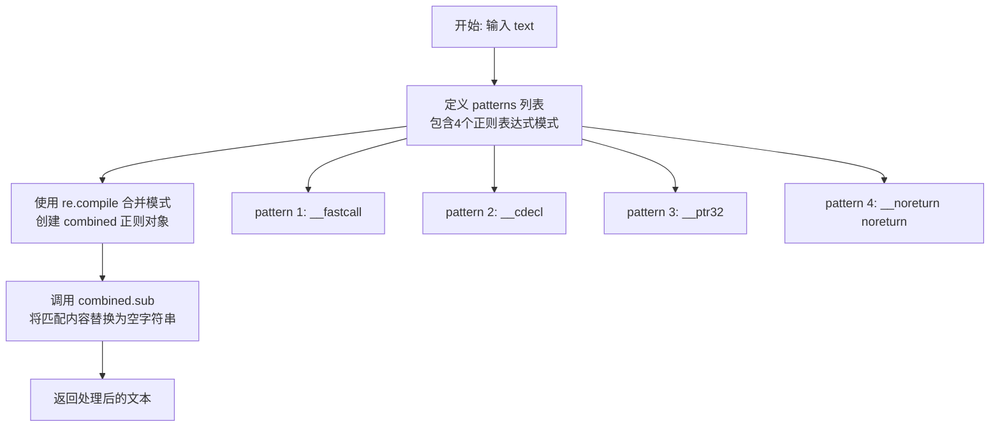

#### 带注释源码

```python
def _remove_keywords(text: str) -> str:
    """Remove specific C language keywords from the given text.
    
    This function targets calling convention modifiers and attribute 
    specifiers commonly found in disassembled or pseudo-generated C code,
    such as __fastcall, __cdecl, __ptr32, and __noreturn.
    
    Args:
        text: The input string potentially containing C keywords to remove.
        
    Returns:
        The input text with all matching keyword patterns replaced by empty string.
    """
    # Define regex patterns for C calling convention and attribute keywords
    # \b ensures word boundary matching to avoid partial matches
    patterns = [
        r"\b__fastcall\b",      # Microsoft fastcall calling convention
        r"\b__cdecl\b",        # C declaration calling convention
        r"\b__ptr32\b",        # 32-bit pointer modifier (MSVC specific)
        r"\b__noreturn\s+noreturn\b",  # Noreturn attribute (appears duplicated)
    ]
    
    # Combine all patterns into a single regex using alternation (|)
    # This is more efficient than running multiple separate regex operations
    combined = re.compile("|".join(patterns))
    
    # Replace all matching patterns with empty string (effectively removing them)
    return combined.sub("", text)
```


### `_replace_typedefs`

该函数用于将代码文本中的类型定义别名替换为标准类型，通过遍历预定义的 `TYPEDEF_MAP` 映射表，使用正则表达式匹配单词边界并进行全局替换。

参数：

- `text`：`str`，输入的代码文本字符串，需要进行类型别名替换的原始文本

返回值：`str`，替换完成的代码文本，所有已知的类型别名均已被替换为标准类型

#### 流程图

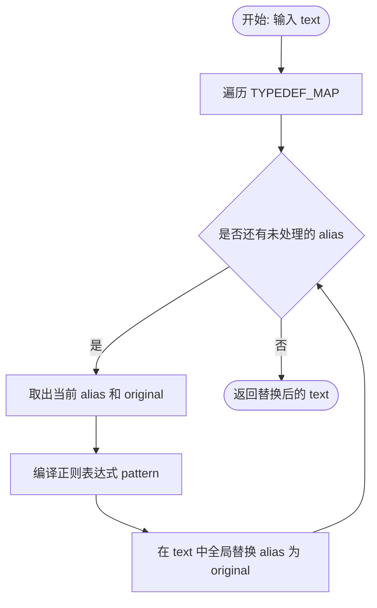

#### 带注释源码

```python
def _replace_typedefs(text: str) -> str:
    """
    将文本中的类型定义别名替换为标准类型
    
    参数:
        text: str - 输入的代码文本，包含需要替换的类型别名
    
    返回:
        str - 替换类型别名后的文本
    """
    # 遍历全局类型映射表 TYPEDEF_MAP
    # TYPEDEF_MAP 存储了类型别名到标准类型的映射关系
    # 例如: {"cpu_set_t": "int", "_DWORD": "uint32_t", ...}
    for alias, original in TYPEDEF_MAP.items():
        # 使用正则表达式编译匹配模式
        # \b 表示单词边界，确保只匹配完整的类型名称，不会匹配到子字符串
        # re.escape(alias) 转义别名中的特殊字符，防止正则表达式注入
        pattern = re.compile(rf"\b{re.escape(alias)}\b")
        # 使用标准类型 original 替换文本中所有匹配到的别名
        text = pattern.sub(original, text)
    # 返回完成所有替换后的文本
    return text
```

#### 相关全局变量

- `TYPEDEF_MAP`：`Dict[str, str]` - 类型定义映射表，将各种平台相关的类型别名（如 `cpu_set_t`、`_DWORD`、`size_t` 等）映射到标准 C 类型（如 `int`、`uint32_t`、`unsigned int` 等），用于代码标准化处理。


### `_remove_comments`

移除文本中的 C 风格（/* ... */）和 C++ 风格（// ...）注释，返回清理后的文本。

参数：

- `text`：`str`，需要移除注释的原始代码文本

返回值：`str`，移除注释后的代码文本

#### 流程图

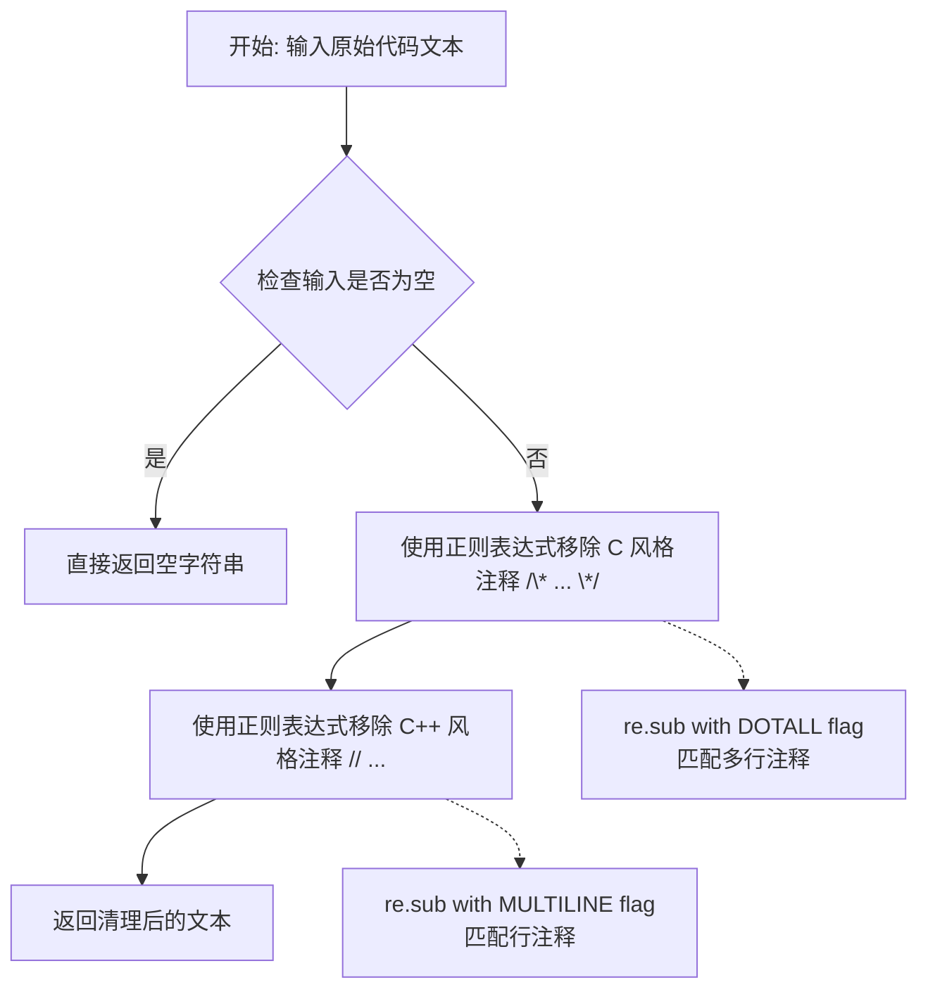

#### 带注释源码

```python
def _remove_comments(text: str) -> str:
    """
    移除文本中的 C 风格和 C++ 风格注释
    
    Args:
        text: 需要处理注释的原始代码文本
        
    Returns:
        移除注释后的代码文本
    """
    # 步骤1: 移除 C 风格多行注释 /* ... */
    # 使用 re.DOTALL 标志使 . 匹配换行符,实现跨行匹配
    text = re.sub(r"/\*.*?\*/", "", text, flags=re.DOTALL)
    
    # 步骤2: 移除 C++ 风格单行注释 // ...
    # 使用 re.MULTILINE 标志使 $ 匹配行首,确保每行独立处理
    text = re.sub(r"//.*?$", "", text, flags=re.MULTILINE)
    
    # 返回清理后的文本
    return text
```


### `_process_code`

该函数是代码预处理的核心环节，组合调用多个代码处理函数，依次对输入的代码字符串执行移除注释、十六进制转十进制转换、移除特定关键字、替换typedef别名等操作，最终输出清洗后的代码字符串。

参数：

-  `code_str`：`str`，输入的待处理源代码字符串

返回值：`str`，经过一系列预处理操作后的代码字符串

#### 流程图

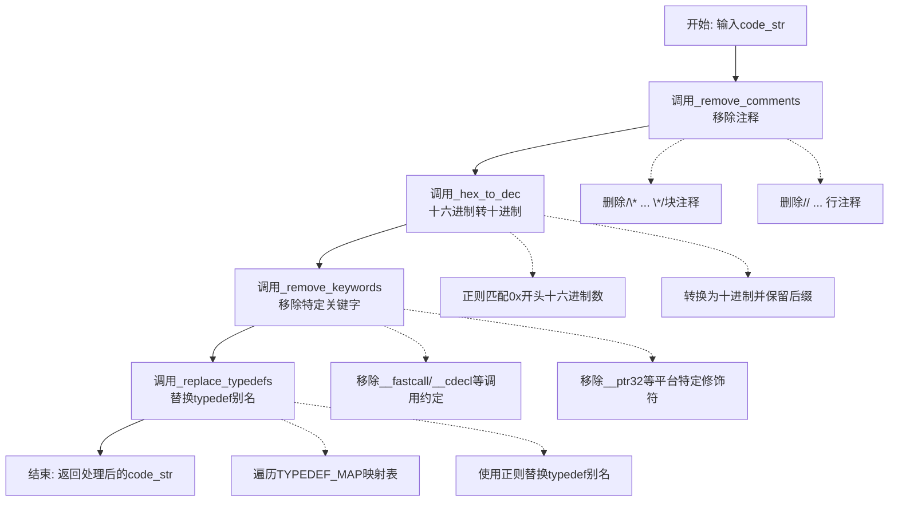

#### 带注释源码

```python
def _process_code(code_str: str) -> str:
    """
    组合调用多个代码处理函数，对代码字符串进行预处理。
    
    该函数是整个代码处理流程的核心管道，依次执行：
    1. 移除代码中的注释（多行和单行）
    2. 将十六进制常量转换为十进制
    3. 移除特定的关键字和调用约定修饰符
    4. 将typedef定义的别名替换为实际类型
    
    Args:
        code_str: 输入的待处理源代码字符串
        
    Returns:
        经过一系列预处理操作后的代码字符串
    """
    # 步骤1: 移除代码中的注释（/* ... */ 和 // ...）
    code_str = _remove_comments(code_str)
    
    # 步骤2: 将十六进制数字常量（如0xFF）转换为十进制（如255）
    code_str = _hex_to_dec(code_str)
    
    # 步骤3: 移除特定的C/C++关键字和调用约定修饰符
    # 如 __fastcall, __cdecl, __ptr32, __noreturn 等
    code_str = _remove_keywords(code_str)
    
    # 步骤4: 将typedef定义的类型别名替换为原始类型
    # 例如 cpu_set_t -> int, size_t -> unsigned int 等
    code_str = _replace_typedefs(code_str)
    
    return code_str
```


### `_normalize_pseudo`

规范化伪代码格式，将原始伪代码文本经过处理、格式化、清理和验证后输出标准化的代码格式。

参数：

- `text`：`str`，输入的原始伪代码文本内容

返回值：`str`，规范化处理后的伪代码文本，若处理失败则返回空字符串

#### 流程图

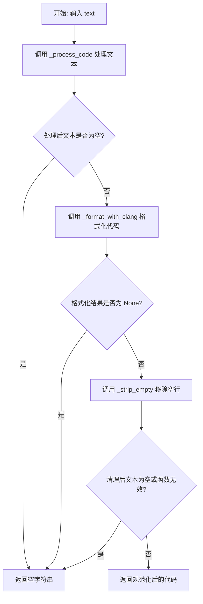

#### 带注释源码

```python
def _normalize_pseudo(text: str) -> str:
    """
    规范化伪代码格式的主函数。
    
    处理流程：
    1. 处理代码：移除注释、转换十六进制、移除关键字、替换typedef
    2. 格式化：使用 clang-format 进行代码格式化
    3. 清理：移除空行
    4. 验证：检查函数是否有效
    
    参数:
        text: 输入的原始伪代码文本
    
    返回值:
        规范化后的伪代码文本，失败时返回空字符串
    """
    # 步骤1: 处理代码 - 移除注释、转换十六进制、移除关键字、替换typedef
    processed = _process_code(text)
    
    # 检查处理后的文本是否为空，如果是则直接返回空字符串
    if not processed.strip():
        return ""
    
    # 步骤2: 使用 clang-format 格式化代码
    # 使用 Google 风格进行格式化
    formatted = _format_with_clang(processed)
    
    # 如果格式化失败（返回 None），则返回空字符串
    if formatted is None:
        return ""
    
    # 步骤3: 移除格式化后的空行
    cleaned = _strip_empty(formatted)
    
    # 步骤4: 验证清理后的代码是否符合有效函数的标准
    # _good_func 检查函数体行数是否在 3-300 行之间
    if not cleaned or not _good_func(cleaned):
        return ""
    
    # 返回规范化后的伪代码
    return cleaned
```


### `_strip_comments_and_strings`

该函数用于移除C/C++源代码中的注释（行注释`//`和块注释`/* */`）以及字符串字面量和字符字面量，将这些内容替换为空格字符，保持源代码的结构完整性。

参数：

- `text`：`str`，需要进行注释和字符串移除的源代码文本

返回值：`str`，移除注释和字符串字面量后的源代码文本

#### 流程图

```mermaid
flowchart TD
    A[开始: 输入源代码text] --> B[初始化result列表为text的字符列表]
    B --> C[初始化i=0, length=lentext]
    C --> D{i < length?}
    D -->|否| Z[返回''.joinresult]
    D -->|是| E[获取nxt=text[i:i+2]和ch=text[i]]
    E --> F{nxt == '//'?}
    F -->|是| G[查找下一个换行符作为end]
    G --> H[将i到end的字符置为空格]
    H --> I[i = end, 继续循环]
    I --> C
    F -->|否| J{nxt == '/*'?}
    J -->|是| K[查找'*/'作为end]
    K --> L[将i到end+2的字符置为空格]
    L --> M[i = end + 2, 继续循环]
    M --> C
    J -->|否| N{ch in {'\"', \"'\"}?}
    N -->|是| O[记录引号类型quote]
    O --> P[将result[i]置为空格, i+=1]
    P --> Q{i < length?}
    Q -->|是| R{c == '\\'?}
    R -->|是| S[i += 2, 继续]
    S --> Q
    R -->|否| T{c == quote?}
    T -->|是| U[i += 1, 跳出内循环]
    U --> V[i += 1, 继续外循环]
    V --> C
    T -->|否| W[i += 1, 继续内循环]
    W --> Q
    Q -->|否| V
    N -->|否| X[i += 1, 继续外循环]
    X --> C
```

#### 带注释源码

```python
def _strip_comments_and_strings(text: str) -> str:
    """移除C/C++代码中的注释和字符串字面量"""
    # 使用列表存储结果，方便逐字符修改
    result = list(text)
    i = 0
    length = len(text)
    
    # 遍历整个文本
    while i < length:
        # 获取当前字符和下一个字符（用于双字符检测）
        nxt = text[i : i + 2]
        ch = text[i]
        
        # 处理行注释 // ...
        if nxt == "//":
            # 查找该行的结束位置（换行符）
            end = text.find("\n", i)
            if end == -1:
                end = length
            # 将行注释内容替换为空格
            for j in range(i, end):
                result[j] = " "
            i = end
            continue
        
        # 处理块注释 /* ... */
        if nxt == "/*":
            # 查找块注释结束标记
            end = text.find("*/", i + 2)
            if end == -1:
                end = length - 2
            # 将块注释内容替换为空格
            for j in range(i, end + 2):
                result[j] = " "
            i = end + 2
            continue
        
        # 处理字符串字面量和字符字面量
        if ch in {'"', "'"}:
            quote = ch  # 记录引号类型
            result[i] = " "  # 将开头引号替换为空格
            i += 1
            
            # 遍历字符串内容，寻找结束引号
            while i < length:
                c = text[i]
                result[i] = " "  # 将字符替换为空格
                
                # 处理转义字符
                if c == "\\":
                    i += 2  # 跳过转义字符和下一个字符
                    continue
                
                # 找到结束引号
                if c == quote:
                    i += 1  # 跳过结束引号
                    break
                i += 1
            continue
        
        # 继续处理下一个字符
        i += 1
    
    # 将列表重新组合为字符串
    return "".join(result)
```

#### 关键组件信息

| 组件名称 | 描述 |
|---------|------|
| `result` | 用于存储处理后文本的字符列表，通过索引直接修改字符 |
| `nxt` | 双字符窗口，用于检测`//`和`/*`等双字符模式 |
| `quote` | 记录当前处理的引号类型（单引号或双引号） |

#### 潜在技术债务与优化空间

1. **性能问题**：使用`list(text)`复制整个字符串会消耗O(n)内存，对于大文件可能产生性能瓶颈
2. **字符集处理**：未处理Unicode转义序列（如`\u0041`）和数字分隔符
3. **三引号字符串**：未处理Python风格的三引号字符串和多行字符串
4. **原始字符串**：未处理C++11的R"(...)"原始字符串字面量
5. **错误处理**：没有处理字符串未正确闭合的边界情况

#### 其它项目

**设计目标与约束**：
- 保持源代码的原始结构（行号、缩进），仅将注释和字符串内容替换为空格
- 适用于C/C++语法的注释和字符串处理

**错误处理与异常设计**：
- 对于未闭合的注释或字符串，假设到达文本末尾为结束
- 不抛出异常，静默处理边界情况

**数据流与状态机**：
- 该函数是一个简单的状态机，在普通文本、注释、字符串三种状态间切换
- 不修改源代码的结构，只替换内容字符


### `_find_matching_brace`

该函数用于在给定的源代码文本中，从指定的起始位置开始查找与之匹配的右花括号（`}`）的位置，能够正确处理注释和字符串中的括号。

参数：

- `text`：`str`，需要搜索的源代码文本
- `start_idx`：`int`，左花括号（`{`）的起始位置索引

返回值：`int`，匹配的右花括号（`}`）的位置索引；如果未找到匹配的右花括号，则返回文本的最后一个字符位置（`length - 1`）

#### 流程图

```mermaid
flowchart TD
    A[开始: 输入 text 和 start_idx] --> B[初始化 depth = 0, i = start_idx]
    B --> C{i < length?}
    C -->|是| D[获取当前字符和下一字符]
    D --> E{是否为 // 注释?}
    E -->|是| F[查找下一个换行符\n]
    F --> G{找到换行符?}
    G -->|是| H[i = 换行符位置]
    G -->|否| I[返回 length - 1]
    H --> C
    I --> C
    
    E -->|否| J{是否为 /* 注释?}
    J -->|是| K[查找 */ 结束注释]
    K --> L{找到结束符?}
    L -->|是| M[i = 结束位置 + 2]
    L -->|否| N[返回 length - 1]
    M --> C
    
    J -->|否| O{是否为引号 ' 或 \"?}
    O -->|是| P[跳过引号内的所有内容]
    P --> Q{找到闭合引号?}
    Q -->|是| R[i = 引号后一位]
    Q -->|否| S[继续到文本结束]
    R --> C
    
    O -->|否| T{当前字符是否为 {?}
    T -->|是| U[depth += 1]
    U --> C
    
    T -->|否| V{当前字符是否为 }?}
    V -->|是| W[depth -= 1]
    W --> X{depth == 0?}
    X -->|是| Y[返回当前位置 i]
    X -->|否| Z[i += 1]
    Z --> C
    
    V -->|否| AA[i += 1]
    AA --> C
    
    C -->|否| BB[返回 length - 1]
    BB --> EE{结束}
    
    Y --> EE
    I --> EE
    N --> EE
```

#### 带注释源码

```python
def _find_matching_brace(text: str, start_idx: int) -> int:
    """
    查找匹配的右花括号位置。
    
    该函数从 start_idx 位置开始遍历文本，跟踪花括号的嵌套深度，
    跳过注释和字符串内容，以找到与起始 { 匹配的 } 位置。
    
    Args:
        text: 要搜索的源代码文本
        start_idx: 起始搜索位置（通常是左花括号的位置）
    
    Returns:
        匹配的右花括号位置索引，如果未找到则返回 text 的最后一个索引
    """
    depth = 0      # 花括号嵌套深度计数器
    i = start_idx  # 当前遍历位置
    length = len(text)  # 文本总长度
    
    # 遍历文本的每个字符
    while i < length:
        nxt = text[i : i + 2]  # 当前字符和下一个字符组成的双字符序列
        ch = text[i]           # 当前单个字符
        
        # 处理单行注释 //
        if nxt == "//":
            # 查找下一个换行符
            i = text.find("\n", i)
            if i == -1:
                # 没有找到换行符，说明到了文本末尾，返回最后一个位置
                return length - 1
            continue  # 继续循环
        
        # 处理多行注释 /* ... */
        if nxt == "/*":
            # 查找注释结束符 */
            i = text.find("*/", i + 2)
            if i == -1:
                # 没有找到注释结束，返回最后一个位置
                return length - 1
            i += 2  # 跳过 */ 两个字符
            continue
        
        # 处理字符串和字符字面量，跳过其中的内容
        if ch in {'"', "'"}:
            quote = ch  # 记录引号类型（单引号或双引号）
            i += 1      # 移动到引号后的第一个字符
            while i < length:
                c = text[i]
                if c == "\\":
                    # 处理转义字符，跳过转义字符及其后的字符
                    i += 2
                    continue
                if c == quote:
                    # 找到匹配的闭合引号
                    i += 1
                    break
                i += 1
            continue
        
        # 处理花括号
        if ch == "{":
            depth += 1  # 进入新的嵌套层级
        elif ch == "}":
            depth -= 1  # 退出当前嵌套层级
            if depth == 0:
                # 匹配成功，返回右花括号的位置
                return i
        
        i += 1  # 移动到下一个字符
    
    # 如果遍历结束仍未找到匹配，返回文本最后一个位置
    return length - 1
```


### `_extract_source_functions`

从源代码文件中提取函数信息，通过正则表达式匹配函数签名，并使用平衡大括号算法定位函数体，返回包含函数名、文件路径和函数内容的字典。

参数：

- `path`：`Path`，待处理的源代码文件路径
- `repo_root`：`Path`，代码仓库的根目录路径

返回值：`Dict[str, Dict[str, str]]`，键为函数名，值为包含 path、function_name 和 content 的字典

#### 流程图

```mermaid
flowchart TD
    A[开始 _extract_source_functions] --> B[读取源文件 text]
    B --> C[清理注释和字符串得到 sanitized]
    C --> D[编译正则表达式匹配函数签名]
    D --> E{遍历所有匹配项}
    E -->|是函数名| F{函数名是否在 FUNC_KEYWORDS}
    F -->|是关键字| G[跳过当前匹配]
    F -->|不是关键字| H[查找函数开始的 { 位置]
    H --> I{找到 {?}
    I -->|未找到| G
    I -->|找到| J[调用 _find_matching_brace 找配对的 }]
    J --> K{end_idx > brace_idx?}
    K -->|否| G
    K -->|是| L[提取函数内容 content]
    L --> M[构建字典项并添加到 funcs]
    M --> E
    E -->|无更多匹配| N[返回 funcs 字典]
    G --> E
```

#### 带注释源码

```python
def _extract_source_functions(path: Path, repo_root: Path) -> Dict[str, Dict[str, str]]:
    """从源代码文件中提取函数信息，返回函数名到详细信息的映射字典。"""
    # 步骤1: 读取源文件全部内容
    text = _read_text(path)
    
    # 步骤2: 移除注释和字符串字面量，避免干扰函数签名匹配
    sanitized = _strip_comments_and_strings(text)
    
    # 步骤3: 编译正则表达式匹配 C 语言函数签名
    # 匹配模式: (前缀)(返回类型和函数名)(参数列表){ 
    # 前缀可以是行首、分号、换号或右花括号
    # 函数名必须是字母或下划线开头，后续可以是字母数字下划线
    pattern = re.compile(
        r"(?P<prefix>^|[;\n}])(?P<signature>[^{;}]*?)\b(?P<name>[A-Za-z_][\w]*)\s*\([^;{}]*\)\s*\{",
        re.MULTILINE,
    )
    
    # 初始化结果字典
    funcs: Dict[str, Dict[str, str]] = {}
    
    # 步骤4: 遍历所有匹配的函数候选
    for match in pattern.finditer(sanitized):
        name = match.group("name")
        
        # 跳过 C 语言关键字（如 if, for, while 等）
        if name in FUNC_KEYWORDS:
            continue
        
        # 步骤5: 在清理后的代码中查找函数体的开始花括号
        brace_idx = sanitized.find("{", match.start("signature"))
        if brace_idx == -1:
            continue
        
        # 步骤6: 在原始文本中使用平衡括号算法找到对应的结束花括号
        end_idx = _find_matching_brace(text, brace_idx)
        if end_idx <= brace_idx:
            continue
        
        # 步骤7: 提取完整的函数源码（包括签名和函数体）
        start_idx = match.start("signature")
        content = text[start_idx : end_idx + 1].strip("\n") + "\n"
        
        # 步骤8: 使用 setdefault 避免重复函数覆盖（保留首次匹配）
        funcs.setdefault(
            name,
            {
                "path": str(path.relative_to(repo_root)),  # 相对路径
                "function_name": name,                      # 函数名
                "content": content,                          # 完整源码
            },
        )
    
    return funcs
```


### `_parse_makefile`

解析Makefile文件，提取与特定构建目标相关的C源文件路径列表。该函数通过读取Makefile内容，解析`PROG`和`LOCAL_OBJS`变量，转换对象文件名为对应的C源文件名，并返回存在的源文件路径。

参数：

- `makefile`：`Path`，待解析的Makefile文件路径对象

返回值：`List[Path]`，返回Makefile对应的C源文件路径列表，如果未找到任何源文件则返回空列表

#### 流程图

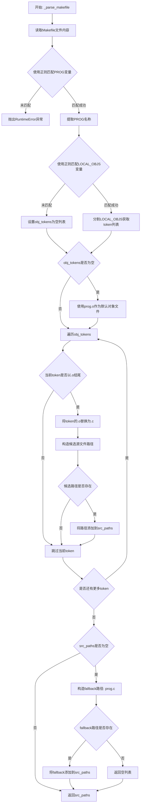

#### 带注释源码

```python
def _parse_makefile(makefile: Path) -> List[Path]:
    """解析Makefile获取源文件列表，输出名称
    
    1. 读取Makefile内容
    2. 提取PROG变量定义的程序名
    3. 提取LOCAL_OBJS变量定义的目标文件列表
    4. 将.o文件转换为对应的.c源文件
    5. 返回存在的源文件路径列表
    
    Args:
        makefile: Makefile文件路径
        
    Returns:
        存在的C源文件路径列表
        
    Raises:
        RuntimeError: 当PROG变量未在Makefile中定义时
    """
    # 步骤1: 读取Makefile文件内容
    text = _read_text(makefile)
    
    # 步骤2: 使用正则表达式匹配PROG变量
    # 匹配格式: PROG = <程序名>
    prog_match = re.search(r"^PROG\s*=\s*(\S+)", text, flags=re.MULTILINE)
    
    # 如果未找到PROG变量，抛出异常
    if not prog_match:
        raise RuntimeError(f"PROG not found in {makefile}")
    
    # 提取程序名并去除首尾空格
    prog = prog_match.group(1).strip()
    
    # 步骤3: 使用正则表达式匹配LOCAL_OBJS变量
    # 匹配格式: LOCAL_OBJS = <对象文件列表>
    objs_match = re.search(r"^LOCAL_OBJS\s*=\s*(.*)$", text, flags=re.MULTILINE)
    
    # 初始化对象文件token列表
    obj_tokens: List[str] = []
    
    # 如果匹配到LOCAL_OBJS，分割获取所有token
    if objs_match:
        # 使用空白字符分割，并过滤空字符串
        obj_tokens = [token for token in objs_match.group(1).split() if token]
    
    # 步骤4: 如果没有LOCAL_OBJS，使用默认的prog.o
    if not obj_tokens:
        obj_tokens = [f"{prog}.o"]
    
    # 初始化源文件路径列表
    src_paths: List[Path] = []
    
    # 步骤5: 遍历对象文件token，转换为C源文件
    for token in obj_tokens:
        # 只处理以.o结尾的文件
        if not token.endswith(".o"):
            continue
        
        # 将.o替换为.c
        candidate = makefile.parent / token.replace(".o", ".c")
        
        # 检查转换后的C文件是否存在
        if candidate.exists():
            src_paths.append(candidate)
    
    # 步骤6: 如果没有找到任何源文件，尝试fallback方案
    # 直接使用prog.c作为默认源文件
    if not src_paths:
        fallback = makefile.parent / f"{prog}.c"
        if fallback.exists():
            src_paths.append(fallback)
    
    # 返回源文件路径列表
    return src_paths
```


### `_collect_source_functions`

该函数是代码的核心函数之一，负责收集指定基准测试目录中所有源文件（.c 文件）内的函数信息。它通过解析 Makefile 获取源文件列表，然后逐个提取每个源文件中的函数定义，最终返回包含所有函数元数据的字典映射。

参数：

-  `bench_dir`：`Path`，基准测试目录路径，指向包含 Makefile 和源文件的目录
-  `repo_root`：`Path`，代码仓库根目录路径，用于计算相对路径

返回值：`Dict[str, Dict[str, str]]`，返回字典，键为函数名，值为包含函数元数据的字典（包含 path、function_name、content 字段）

#### 流程图

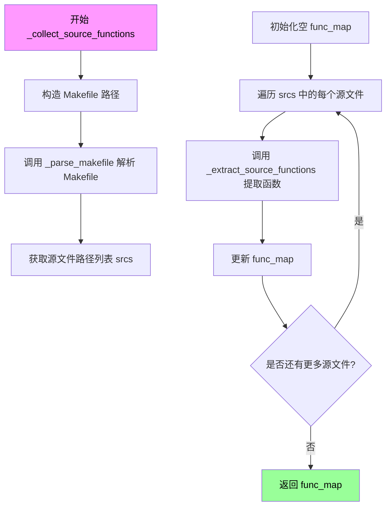

#### 带注释源码

```python
def _collect_source_functions(bench_dir: Path, repo_root: Path) -> Dict[str, Dict[str, str]]:
    """
    收集指定基准测试目录中所有源文件内的函数信息。
    
    该函数是整个代码的关键入口点之一，负责从源文件中提取函数级映射所需的基础数据。
    它首先解析 Makefile 获取源文件列表，然后逐个提取函数信息。
    
    参数:
        bench_dir: 基准测试目录路径，应包含 Makefile 和对应的 .c 源文件
        repo_root: 代码仓库根目录，用于计算相对路径
        
    返回:
        字典类型，键为函数名，值为包含以下字段的字典:
        - path: 源文件相对路径
        - function_name: 函数名称
        - content: 函数的完整代码内容
    """
    # 构造 Makefile 的完整路径
    makefile = bench_dir / "Makefile"
    
    # 解析 Makefile，提取源文件路径列表
    # _parse_makefile 会查找 PROG 和 LOCAL_OBJS 变量来确定编译目标及依赖
    srcs = _parse_makefile(makefile)
    
    # 初始化函数映射字典
    func_map: Dict[str, Dict[str, str]] = {}
    
    # 遍历每个源文件，提取其中的函数
    for src in srcs:
        # 调用 _extract_source_functions 提取单个源文件中的所有函数
        # 该函数使用正则表达式匹配函数签名，并处理嵌套花括号
        func_map.update(_extract_source_functions(src, repo_root))
    
    # 返回合并后的函数映射
    return func_map
```


### `_parse_pseudo`

该函数用于解析伪代码文件（.pseudo 文件），从文件注释中提取函数名称和地址，并将每个函数及其内容存储到字典中返回。

参数：

- `pseudo_path`：`Path`，伪代码文件的路径
- `repo_root`：`Path`，代码仓库的根目录，用于计算相对路径

返回值：`Dict[str, Dict[str, str]]`，返回一个字典，键为函数名，值为包含 path、function_name、address、label 和 content 字段的字典

#### 流程图

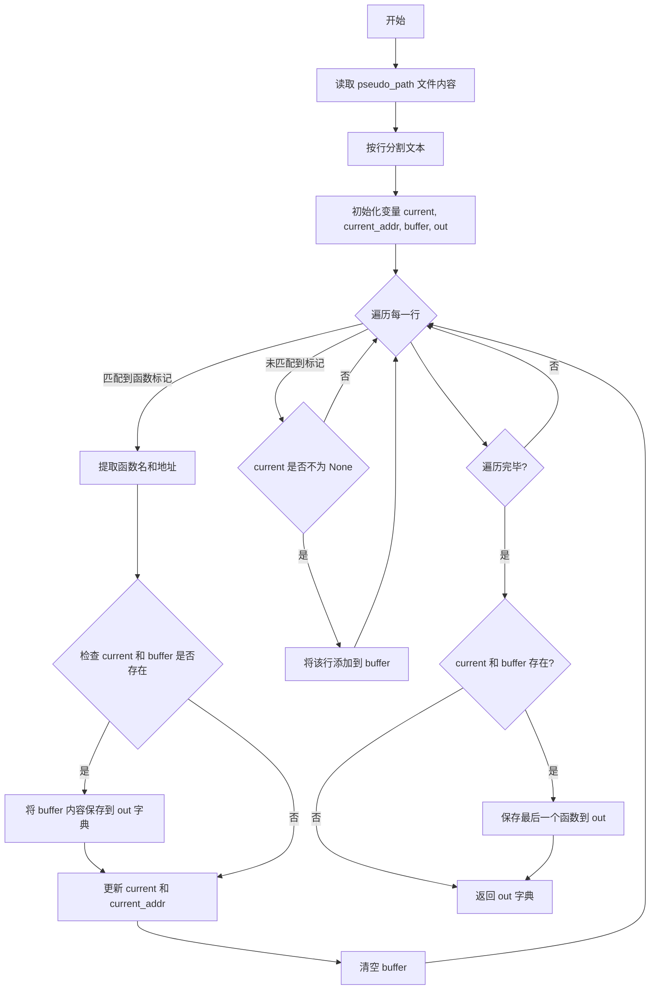

#### 带注释源码

```python
def _parse_pseudo(pseudo_path: Path, repo_root: Path) -> Dict[str, Dict[str, str]]:
    """解析伪代码文件，提取函数及其内容"""
    # 读取伪代码文件的所有文本内容
    text = _read_text(pseudo_path)
    # 将文本分割成行列表
    lines = text.splitlines()
    # 正则表达式：匹配形如 /* 函数名 @ 0x地址 */ 的注释行
    pattern = re.compile(r"^/\*\s*(?P<name>[^@]+?)\s*@\s*(?P<addr>0x[0-9a-fA-F]+)\s*\*/$")
    # 当前正在解析的函数名
    current: Optional[str] = None
    # 当前函数的地址
    current_addr: Optional[str] = None
    # 用于存储函数体的行缓冲区
    buffer: List[str] = []
    # 存储解析结果的输出字典
    out: Dict[str, Dict[str, str]] = {}
    
    # 遍历文件中的每一行
    for raw_line in lines:
        # 去除首尾空格
        line = raw_line.strip()
        # 尝试匹配函数标记注释
        match = pattern.match(line)
        if match:
            # 如果之前有解析过的函数且缓冲区有内容
            if current and buffer:
                # 将缓冲区内容合并为函数体字符串
                content = "\n".join(buffer).strip("\n") + "\n"
                # 将函数信息存入输出字典
                out.setdefault(
                    current,
                    {
                        "path": str(pseudo_path.relative_to(repo_root)),
                        "function_name": current,
                        "address": current_addr,
                        "label": current,
                        "content": content,
                    },
                )
            # 更新当前函数名为匹配到的名称
            current = match.group("name").strip()
            # 更新当前函数地址
            current_addr = match.group("addr")
            # 清空缓冲区，准备读取下一个函数
            buffer = []
        else:
            # 如果当前正在解析一个函数
            if current is not None:
                # 将当前行添加到函数体缓冲区
                buffer.append(raw_line)
    
    # 处理最后一部分内容（文件末尾可能没有新的函数标记）
    if current and buffer:
        content = "\n".join(buffer).strip("\n") + "\n"
        out.setdefault(
            current,
            {
                "path": str(pseudo_path.relative_to(repo_root)),
                "function_name": current,
                "address": current_addr,
                "label": current,
                "content": content,
            },
        )
    # 返回包含所有函数信息的字典
    return out
```


### `_clean_instruction`

该函数用于清洗汇编指令，去除地址和机器码部分，提取实际的汇编指令内容，同时过滤掉空行和仅包含十六进制数据的无效指令。

参数：

- `raw`：`str`，原始汇编指令行（通常包含地址、机器码和指令，格式如 `0x00401000 <func>: 指令`）

返回值：`Optional[str]`，清洗后的指令字符串；如果输入为空或仅包含十六进制数据则返回 `None`

#### 流程图

```mermaid
flowchart TD
    A["开始: raw 输入"] --> B{raw.strip() 是否为空}
    B -- 是 --> C["返回 None"]
    B -- 否 --> D["按制表符分割 raw"]
    E{"len(parts) >= 3?"}
    E -- 是 --> F["relevant = parts[2:]"]
    E -- 否 --> G{"len(parts) == 2?"}
    G -- 是 --> H["relevant = parts[1:]"]
    G -- 否 --> I["relevant = [stripped]"]
    F --> J["instr = '\\t'.join(relevant)"]
    H --> J
    I --> J
    J --> K["按 # 分割，去除注释"]
    K --> L["instr = instr.strip()"]
    L --> M{instr 是否为空}
    M -- 是 --> C
    M -- 否 --> N{instr 仅包含十六进制字符和空格}
    N -- 是 --> C
    N -- 否 --> O["返回 instr"]
```

#### 带注释源码

```python
def _clean_instruction(raw: str) -> Optional[str]:
    """
    清洗汇编指令，去除地址和机器码部分，提取实际指令。
    
    输入格式示例: "0x00401000 <func>:\tmov\teax, 1"
    输出示例: "mov	eax, 1"
    
    Args:
        raw: 原始汇编指令行
        
    Returns:
        清洗后的指令字符串，或 None（空/无效输入）
    """
    # 1. 去除首尾空白
    stripped = raw.strip()
    if not stripped:
        return None
    
    # 2. 按制表符分割（汇编通常用制表符分隔字段）
    parts = raw.split("\t")
    
    # 3. 提取有效部分（跳过地址和机器码列）
    if len(parts) >= 3:
        # 格式: 地址  机器码  指令  注释
        relevant = parts[2:]  # 取指令及之后部分
    elif len(parts) == 2:
        # 格式: 地址  指令
        relevant = parts[1:]  # 取第二部分
    else:
        # 只有指令部分
        relevant = [stripped]
    
    # 4. 重新用制表符连接（保留指令中的制表符格式）
    instr = "\t".join(relevant)
    
    # 5. 去除行内注释（如 "mov eax, 1 # comment"）
    instr = instr.split("#")[0].strip()
    
    # 6. 检查是否为空
    if not instr:
        return None
    
    # 7. 过滤仅包含十六进制数据的行（如纯机器码 "89 45 fc"）
    # 检查移除空格后是否全为十六进制字符
    if all(c in "0123456789abcdefABCDEF" for c in instr.replace(" ", "")):
        return None
    
    # 8. 返回清洗后的指令
    return instr
```


### `_clean_asm_block`

该函数用于清洗汇编代码块，通过去除地址、机器码等冗余信息，提取出可读的汇编指令文本。

参数：
-  `name`：`str`，汇编代码块对应的函数或标签名称，用于生成标签行。
-  `lines`：`List[str]`，原始汇编代码块的所有行列表，通常第一行为标签行，后续行为指令行。

返回值：`str`，清洗后的汇编代码块字符串，格式为以标签行开头，后跟各有效指令行，末尾加换行符。

#### 流程图

```mermaid
graph TD
    A([开始]) --> B[初始化列表 cleaned, 包含标签 <name>:]
    B --> C{遍历 lines 的剩余行}
    C --> D{调用 _clean_instruction 处理当前行}
    D --> E{返回的指令是否有效}
    E -->|是| F[将指令添加到 cleaned 列表]
    E -->|否| G[跳过当前行]
    F --> H{是否还有更多行}
    G --> H
    H -->|是| C
    H -->|否| I[用换行符连接 cleaned 并添加末尾换行符]
    I --> J([返回结果字符串])
```

#### 带注释源码

```python
def _clean_asm_block(name: str, lines: List[str]) -> str:
    """
    清洗汇编代码块，去除地址和机器码等冗余信息。
    
    参数:
        name: 汇编代码块对应的函数名或标签名 (str)
        lines: 原始汇编代码块的所有行列表 (List[str])
    
    返回值:
        清洗后的汇编代码块字符串 (str)
    """
    # 初始化结果列表，第一项为函数标签行
    cleaned = [f"<{name}>:"]
    
    # 遍历原始行的剩余部分（跳过第一行的标签行）
    for raw in lines[1:]:
        # 清洗单行汇编指令，去除地址、机器码和注释
        instr = _clean_instruction(raw)
        # 如果清洗后的指令有效（非空），则添加到结果中
        if instr:
            cleaned.append(instr)
    
    # 将所有行用换行符连接，并在末尾添加换行符
    return "\n".join(cleaned) + "\n"
```


### `_parse_assembly`

该函数用于解析汇编文件（.s 文件），提取其中的函数代码块。它通过正则表达式匹配汇编文件中以地址和函数名组成的行（如 `0000000000400590 <main>:`）作为函数起始标记，然后将每个函数对应的多行汇编指令收集起来，并调用 `_clean_asm_block` 清洗后存储到字典中返回。

参数：

- `asm_path`：`Path`，待解析的汇编文件路径

返回值：`Dict[str, str]`，键为函数名（如 `main`），值为清洗后的汇编代码块字符串

#### 流程图

```mermaid
flowchart TD
    A[开始: 读取 asm_path 文件内容并按行分割] --> B[初始化正则表达式匹配函数头部]
    B --> C[初始化 current=None, buffer=[], result={}]
    C --> D{遍历 lines 中的每行}
    D -->|匹配到头部| E[将前一个函数代码块写入 result]
    E --> F[更新 current 为当前函数名]
    F --> G[重置 buffer 为当前行]
    D -->|未匹配到头部| H{current is not None}
    H -->|是| I[将当前行加入 buffer]
    H -->|否| D
    I --> D
    D --> J{遍历结束}
    J --> K{current and buffer}
    K -->|是| L[将最后一个函数代码块写入 result]
    K -->|否| M[返回 result 字典]
    L --> M
```

#### 带注释源码

```python
def _parse_assembly(asm_path: Path) -> Dict[str, str]:
    """解析汇编文件，提取函数级别的代码块。"""
    # 读取文件所有行
    lines = _read_text(asm_path).splitlines()
    # 匹配形如 "  0000000000400590 <main>:" 的函数头部
    header = re.compile(r"^\s*([0-9a-fA-F]+)\s+<([^>]+)>:\s*$")
    # 当前处理的函数名
    current: Optional[str] = None
    # 属于当前函数的行缓冲
    buffer: List[str] = []
    # 结果字典：函数名 -> 清洗后的汇编代码
    result: Dict[str, str] = {}
    for line in lines:
        match = header.match(line)
        if match:
            # 如果已有未保存的函数块，先清洗并保存
            if current and buffer:
                result.setdefault(current, _clean_asm_block(current, buffer))
            # 更新当前函数名为匹配到的名字
            current = match.group(2)
            # 重置缓冲区，只包含头部行
            buffer = [line]
        else:
            # 非头部行，若当前正在处理函数则追加到缓冲区
            if current is not None:
                buffer.append(line)
    # 处理文件末尾可能遗留的函数块
    if current and buffer:
        result.setdefault(current, _clean_asm_block(current, buffer))
    return result
```


### `_discover_binaries`

该函数用于发现待处理的二进制文件（.o0/.o1/.o2/.o3 目标文件），支持显式指定或自动扫描两种模式，是整个映射流程的入口点。

参数：

- `explicit`：`Optional[List[str]]`，可选参数，用于显式指定待处理的二进制文件路径列表（可以是相对路径或绝对路径）
- `repo_root`：`Path`，代码仓库的根目录路径，用于解析相对路径或作为扫描的起始目录

返回值：`List[Path]`：返回发现的二进制文件路径列表，按字母顺序排序

#### 流程图

```mermaid
flowchart TD
    A[开始 _discover_binaries] --> B{explicit 参数是否存在?}
    B -->|是| C[遍历 explicit 列表]
    C --> D[构建 candidate 路径]
    D --> E{路径是否为绝对路径?}
    E -->|否| F[拼接 repo_root / candidate]
    E -->|是| G[直接使用 candidate]
    F --> H{文件是否存在?}
    G --> H
    H -->|是| I[添加到 binaries 列表]
    H -->|否| J[跳过]
    I --> K[explicit 遍历完成?]
    K -->|否| C
    K -->|是| L[返回 binaries 列表]
    B -->|否| M[递归扫描 repo_root 下的 *.O* 文件]
    M --> N{文件后缀是否在 .o0 .o1 .o2 .o3 中?}
    N -->|是| O[添加到 matches 列表]
    N -->|否| P[跳过]
    O --> Q[扫描完成?]
    Q -->|否| M
    Q -->|是| R[对 matches 排序]
    R --> S[返回排序后的 matches]
    L --> T[结束]
    S --> T
```

#### 带注释源码

```python
def _discover_binaries(explicit: Optional[List[str]], repo_root: Path) -> List[Path]:
    """Discover binary files to be processed.
    
    支持两种模式：
    1. 显式模式：如果提供了 explicit 参数，则检查指定的文件是否存在
    2. 自动扫描模式：否则在 repo_root 下递归搜索 .o0/.o1/.o2/.o3 后缀的目标文件
    
    Args:
        explicit: 可选的显式二进制文件路径列表
        repo_root: 代码仓库根目录
    
    Returns:
        发现的二进制文件路径列表（已排序）
    """
    # 显式指定模式：处理用户提供的具体二进制文件路径
    if explicit:
        binaries: List[Path] = []
        for entry in explicit:
            candidate = Path(entry)
            # 相对路径需要拼接 repo_root
            if not candidate.is_absolute():
                candidate = repo_root / candidate
            # 只返回实际存在的文件
            if candidate.exists():
                binaries.append(candidate)
        return binaries
    
    # 自动扫描模式：查找所有 .o0/.o1/.o2/.o3 后缀的目标文件
    matches = []
    # 使用 rglob 递归扫描 repo_root 下所有匹配 *.O* 的文件
    for path in repo_root.rglob("*.O*"):
        suffix = path.suffix.lower()
        # 只保留特定后缀的目标文件
        if suffix in {".o0", ".o1", ".o2", ".o3"}:
            matches.append(path)
    # 返回排序后的结果，保证输出一致性
    return sorted(matches)
```


### `_build_map`

构建函数映射并写入JSONL文件，将源函数、伪代码和汇编函数进行关联，生成包含函数源码、伪代码、规范化伪代码和汇编代码的记录文件。

参数：

- `binary`：`Path`，待处理的二进制文件路径（如 `bench.O0`）
- `repo_root`：`Path`，代码仓库根目录路径，用于计算相对路径

返回值：`None`，该函数直接写入JSONL文件并通过print输出状态信息

#### 流程图

```mermaid
flowchart TD
    A["_build_map(binary, repo_root)"] --> B{pseudo_path 和 asm_path 是否存在?}
    B -->|否| C[打印 skip 警告并返回]
    B -->|是| D[获取 bench_dir = binary.parent]
    D --> E[调用 _collect_source_functions 收集源码函数]
    E --> F[调用 _parse_pseudo 解析伪代码文件]
    F --> G[调用 _parse_assembly 解析汇编文件]
    G --> H[计算三个集合的交集 common]
    H --> I{common 是否为空?}
    I -->|是| J[打印 warn 警告并返回]
    I -->|否| K[构造输出路径 .func_map.jsonl]
    K --> L[遍历 common 中的每个函数名]
    L --> M[构建 record 字典包含 source/pseudo/pseudo_normalize/binary/assembly]
    M --> N[写入 JSONL 记录]
    L --> O{遍历结束?}
    O -->|否| L
    O -->|是| P[打印 ok 状态信息]
    P --> Q[函数结束]
```

#### 带注释源码

```python
def _build_map(binary: Path, repo_root: Path) -> None:
    """
    构建函数映射并写入JSONL文件。
    
    该函数执行以下步骤：
    1. 计算并验证 .pseudo 和 .s 文件路径
    2. 从源文件收集函数定义
    3. 解析伪代码和汇编文件
    4. 找到三者共有的函数
    5. 输出包含四种表示的 JSONL 记录
    """
    # Step 1: 根据二进制路径构造伪代码和汇编文件路径
    pseudo_path = Path(str(binary) + ".pseudo")
    asm_path = Path(str(binary) + ".s")
    
    # 验证必需文件是否存在，不存在则跳过
    if not pseudo_path.exists() or not asm_path.exists():
        print(f"[skip] Missing pseudo or assembly for {binary.relative_to(repo_root)}")
        return
    
    # Step 2: 获取二进制文件所在目录（benchmark目录）
    bench_dir = binary.parent
    
    # Step 3: 收集三个来源的函数数据
    # 从 Makefile 解析源文件并提取函数定义
    source_funcs = _collect_source_functions(bench_dir, repo_root)
    # 解析 .pseudo 文件中的伪代码函数
    pseudo_funcs = _parse_pseudo(pseudo_path, repo_root)
    # 解析 .s 文件中的汇编函数
    asm_funcs = _parse_assembly(asm_path)
    
    # Step 4: 求取三个函数集合的交集
    common = sorted(set(source_funcs) & set(pseudo_funcs) & set(asm_funcs))
    
    # 如果没有交集函数，打印警告并返回
    if not common:
        print(f"[warn] No overlapping functions for {binary.relative_to(repo_root)}")
        return
    
    # Step 5: 构造输出文件路径
    output_path = Path(str(binary) + ".func_map.jsonl")
    # 计算二进制文件的相对路径
    rel_binary = str(binary.relative_to(repo_root))
    
    # 打开输出文件并写入JSONL记录
    with output_path.open("w", encoding="utf-8") as handle:
        for name in common:
            # 获取伪代码条目
            pseudo_entry = pseudo_funcs[name]
            # 对伪代码内容进行规范化处理（清理、转换、格式化）
            pseudo_norm = _normalize_pseudo(pseudo_entry.get("content", ""))
            
            # 构建包含四种表示的记录字典
            record = {
                "source": source_funcs[name],           # 源码函数信息
                "pseudo": pseudo_entry,                 # 伪代码原始条目
                "pseudo_normalize": pseudo_norm,         # 规范化后的伪代码
                "binary": rel_binary,                    # 二进制相对路径
                "assembly": asm_funcs[name],             # 汇编代码
            }
            
            # 写入JSON行（无ASCII转义）
            handle.write(json.dumps(record, ensure_ascii=False))
            handle.write("\n")
    
    # 打印成功状态信息
    print(f"[ok] {output_path.relative_to(repo_root)} -> {len(common)} functions")
```


### `main`

主函数，处理命令行参数并协调整个流程，包括解析参数、获取基准仓库根路径、发现二进制文件并为每个二进制文件构建函数映射。

参数：

- `argv`：`List[str]`，命令行参数列表（不包含脚本名称）

返回值：`int`，返回 0 表示成功，返回 1 表示未找到二进制文件或发生错误

#### 流程图

```mermaid
flowchart TD
    A[开始 main] --> B[创建 argparse ArgumentParser]
    B --> C[添加 --binary 参数]
    B --> D[添加 --bench-root 参数]
    C --> E[解析命令行参数 args]
    D --> E
    E --> F[调用 _get_bench_root 获取 repo_root]
    F --> G[调用 _discover_binaries 发现二进制文件]
    G --> H{二进制文件列表是否为空?}
    H -->|是| I[输出错误信息到 stderr]
    I --> J[返回 1]
    H -->|否| K[遍历每个二进制文件]
    K --> L[调用 _build_map 处理单个二进制文件]
    L --> K
    K --> M[返回 0]
    M --> N[结束]
```

#### 带注释源码

```python
def main(argv: List[str]) -> int:
    """
    主函数，处理命令行参数并协调整个流程。
    
    参数:
        argv: 命令行参数列表（不包含脚本名称）
    
    返回:
        成功返回 0，未找到二进制文件返回 1
    """
    # 创建命令行参数解析器，设置程序描述
    parser = argparse.ArgumentParser(description="Map source/pseudo/assembly per function")
    
    # 添加 --binary 参数：可重复，用于指定特定的二进制文件路径（相对于仓库根目录）
    parser.add_argument(
        "--binary",
        action="append",
        help="Specific binary path (relative to repo) to process; can be repeated.",
    )
    
    # 添加 --bench-root 参数：可选，用于指定 Bringup-Bench 仓库根路径（默认从 config.env 读取）
    parser.add_argument(
        "--bench-root",
        default=None,
        help="Path to the Bringup-Bench repository root (default: from config.env).",
    )
    
    # 解析命令行参数
    args = parser.parse_args(argv)
    
    # 获取基准仓库根目录路径
    # 优先级：CLI 参数 > 环境变量 > config.env 文件
    repo_root = _get_bench_root(args.bench_root)
    
    # 发现要处理的二进制文件
    # 如果指定了 --binary 参数，则使用指定的路径；否则自动搜索 *.O* 文件（.o0, .o1, .o2, .o3）
    binaries = _discover_binaries(args.binary, repo_root)
    
    # 如果没有找到任何二进制文件，输出错误信息并返回错误码
    if not binaries:
        print("No binaries found", file=sys.stderr)
        return 1
    
    # 遍历每个二进制文件，构建函数映射
    for binary in binaries:
        # 为单个二进制文件构建映射：
        # 1. 查找对应的 .pseudo 和 .s 文件
        # 2. 收集源代码函数
        # 3. 解析伪代码
        # 4. 解析汇编代码
        # 5. 找出三个来源中都存在的函数
        # 6. 将结果写入 .func_map.jsonl 文件
        _build_map(binary, repo_root)
    
    # 成功完成，返回 0
    return 0
```

## 关键组件


### TYPEDEF_MAP

类型别名映射字典，将各种架构特定或编译器特定的类型定义映射到标准 C 类型，用于代码规范化处理。

### _load_config_env

从 eval 项目根目录加载 config.env 配置文件，返回包含环境变量的字典。

### _get_bench_root

解析基准仓库根目录路径，支持从 CLI 参数、环境变量或配置文件中获取优先顺序。

### _process_code

核心代码处理流水线，整合注释移除、十六进制转换、关键字清理和类型别名替换等步骤。

### _strip_comments_and_strings

使用状态机方式移除代码中的注释（单行和多行）和字符串字面量，保持代码结构完整性。

### _find_matching_brace

大括号匹配算法，用于准确定位函数的结束位置，处理嵌套大括号、注释和字符串内的特殊字符。

### _extract_source_functions

使用正则表达式从源代码中提取函数定义，返回包含函数名、文件路径和函数体的字典。

### _parse_makefile

解析 Makefile 文件以确定源代码文件列表，提取 PROG 和 LOCAL_OBJS 变量来定位编译目标。

### _parse_pseudo

解析伪代码文件，提取以特定注释格式（/* function_name @ address */）标记的函数及其内容。

### _parse_assembly

解析汇编文件，提取以地址和函数名标记的汇编代码块，并进行指令清洗。

### _normalize_pseudo

伪代码规范化流程，包括代码处理、clang-format 格式化和有效性验证，确保输出质量。

### _discover_binaries

二进制文件发现机制，支持显式指定或通过通配符（.O0, .O1, .O2, .O3）自动扫描仓库。

### _build_map

核心映射构建函数，整合源函数、伪函数和汇编函数，找出交集并生成 JSONL 格式的映射文件。


## 问题及建议


### 已知问题

- **正则表达式复杂且可能不够健壮**：`_extract_source_functions` 中的正则 `r"(?P<prefix>^|[;\n}])(?P<signature>[^{;}]*?)\b(?P<name>[A-Za-z_][\w]*)\s*\([^;{}]*\)\s*\{"` 对于复杂的函数声明（如嵌套括号、默认参数）可能匹配失败
- **字符串处理函数重复且低效**：`_strip_comments_and_strings` 和 `_remove_comments` 功能有重叠，且前者使用字符数组逐个处理，效率低下
- **外部依赖缺乏容错**：`_format_with_clang` 依赖 `clang-format` 工具，失败时仅打印异常并返回 None，可能导致后续流程静默失败
- **硬编码值缺乏灵活性**：`FUNC_KEYWORDS` 集合、`*.O*` 文件扩展名匹配规则硬编码，若需扩展需修改源码
- **配置加载逻辑薄弱**：`_load_config_env` 仅支持 `key=value` 格式，不支持引号包裹的值、跨行值或变量引用
- **缺少资源清理**：使用 `subprocess.run` 时未显式关闭文件句柄，且无超时全局控制（仅格式化有15秒超时）
- **类型注解不完整**：部分变量如 `_extract_source_functions` 中的 `content`、`_parse_makefile` 中的 `obj_tokens` 缺少类型注解
- **日志输出不一致**：部分信息通过 `print` 输出，部分通过 `sys.stderr`，缺乏统一的日志级别管理

### 优化建议

- **重构正则表达式**：考虑使用更健壮的解析方法（如 AST 解析或状态机），或分阶段匹配（先匹配函数签名，再验证函数体）
- **合并字符串处理逻辑**：统一注释和字符串移除逻辑，使用 `re.sub` 配合编译后的正则模式提升性能
- **增强外部依赖容错**：添加 `clang-format` 可用性检查，提供优雅降级（如跳过格式化直接使用原始文本）
- **配置外部化**：将硬编码值（关键词、文件模式）移至配置文件，支持 YAML/JSON 配置格式
- **完善错误处理**：为关键函数添加异常捕获、返回值校验和详细的错误日志
- **添加类型注解**：使用 `mypy` 工具检查并补全所有类型注解，提升代码可维护性
- **统一日志系统**：引入 `logging` 模块，配置统一的日志级别和格式
- **性能优化**：对大文件处理添加流式读取，对常用正则表达式进行预编译以提升性能

## 其它


### 设计目标与约束

本代码的设计目标是自动化的函数级映射生成，具体包括：(1) 从C源代码中提取函数定义和函数体；(2) 从伪代码文件(.pseudo)中解析函数及其十六进制地址标签；(3) 从汇编文件(.s)中提取函数及其对应的机器指令；(4) 找出上述三个来源中共同存在的函数，并生成包含完整信息的JSONL映射文件。核心约束包括：仅处理Makefile中声明的源文件、依赖clang-format工具进行代码规范化、输入文件必须遵循特定的命名约定（binary.O文件对应binary.pseudo和binary.s）。

### 错误处理与异常设计

代码采用多层次的错误处理策略。在配置加载阶段，使用`sys.exit()`直接终止程序并输出错误信息（如BENCH_REPO_ROOT未设置时）。在文件操作层面，通过`Path.exists()`检查文件存在性，对不存在的文件输出警告而非中断执行。在外部命令调用层面，`_format_with_clang()`函数使用try-except捕获所有异常并打印错误信息，返回None表示格式化失败，调用方通过检查返回值来处理。在正则匹配层面，使用`re.search()`和`re.finditer()`时若匹配失败则返回None或空结果，调用方需显式检查。关键函数如`_parse_makefile()`在无法解析PROG变量时会抛出RuntimeError。整体采用"快速失败"与"优雅降级"相结合的策略。

### 数据流与状态机

数据流遵循"输入→提取→处理→输出"的管道模型。输入阶段由`_discover_binaries()`发现或指定目标二进制文件路径；提取阶段并行调用三个解析器：`_collect_source_functions()`从源文件提取函数、`_parse_pseudo()`从伪代码提取函数、`_parse_assembly()`从汇编文件提取函数；处理阶段通过集合交集`set(source_funcs) & set(pseudo_funcs) & set(asm_funcs)`找出共同函数，并对伪代码调用`_normalize_pseudo()`进行规范化处理；输出阶段将每条记录以JSON格式写入.jfunc_map.jsonl文件。内部状态机主要体现在`_parse_pseudo()`中：按行遍历文本，通过正则匹配`/* name @ address */`模式来切换"新函数开始"与"函数体累积"两种状态。

### 外部依赖与接口契约

本代码依赖以下外部组件：(1) **clang-format**：用于将处理后的伪代码规范化输出，调用方式为`clang-format --style=Google`，超时限制15秒；(2) **文件系统**：依赖特定的目录结构和文件命名约定，二进制文件位于repo_root下，源文件通过Makefile解析获得，伪代码和汇编文件分别以.pseudo和.s为后缀；(3) **config.env**：位于eval项目根目录的配置文件，格式为`KEY=VALUE`，支持注释（以#开头）；(4) **环境变量**：支持通过BENCH_REPO_ROOT环境变量指定仓库根目录。接口契约方面：输入的源文件应为有效C代码，伪代码文件应包含`/* func_name @ 0xADDR */`格式的函数标签，汇编文件应包含`ADDR <func_name>:`格式的函数头；输出为JSONL格式每行一个JSON对象，包含source、pseudo、pseudo_normalize、binary、assembly五个字段。

### 性能考量与资源限制

代码在性能方面有以下考量：(1) 文件读取使用`Path.read_text()`一次性加载，对于大文件可能存在内存压力；(2) 正则表达式匹配使用`re.compile()`预编译以提升效率；(3) `_format_with_clang()`设置15秒超时防止外部命令挂起；(4) `_good_func()`函数通过行数限制（3<行数<300）过滤异常函数；(5) 使用集合交集而非嵌套循环查找公共函数，时间复杂度为O(n)。建议的优化方向包括：对大文件采用流式读取、实现增量处理而非全量重处理、添加缓存机制避免重复解析相同文件。

### 安全性与输入验证

代码在安全性方面存在以下风险和应对：(1) **路径遍历风险**：`_get_bench_root()`将用户输入的cli_value直接用于Path构造，虽调用了`.resolve()`但未验证路径是否在预期目录内，建议添加路径前缀检查；(2) **命令注入风险**：`_format_with_clang()`通过subprocess.run()执行clang-format，参数func来自文件内容而非用户直接输入，但建议对输入进行白名单校验；(3) **正则表达式DoS**：多个正则表达式未设置复杂度限制，恶意构造的输入可能导致回溯超时，建议使用`re.compile()`时添加`re.MAX_REPEAT`限制；(4) **文件写入**：输出文件以覆盖模式打开，若目标路径被符号链接指向敏感位置可能被篡改，建议在写入前检查路径是否为符号链接。

### 可维护性与测试建议

代码可维护性方面的特点包括：(1) 函数命名清晰，采用下划线分隔的小写命名法；(2) 每个函数职责单一，符合单一职责原则；(3) 使用类型提示（typing.Dict、List、Optional等）增强代码可读性；(4) 文档字符串完整，关键函数都有功能说明。测试建议覆盖的场景包括：空的或格式不正确的输入文件、缺失的配置或环境变量、clang-format不可用的情况、超大源文件的处理、特殊字符和Unicode内容的处理、符号链接和相对路径的解析、以及Makefile格式与预期不符的情况。

### 版本兼容性与依赖管理

代码声明`from __future__ import annotations`以支持Python 3.7+的类型注解延迟求值。依赖的标准库模块包括：argparse（命令行参数解析）、json（JSON序列化）、os和sys（系统操作）、re（正则表达式）、pathlib（路径操作）、subprocess（外部进程调用）、typing（类型提示）。外部依赖仅有clang-format工具。Python版本要求至少为3.7（支持pathlib和typing的所有特性），建议使用3.8+以获得更好的性能。代码中使用了海象运算符（walrus operator，`:=`）在`_parse_makefile()`函数中，该特性需要Python 3.8+。


    