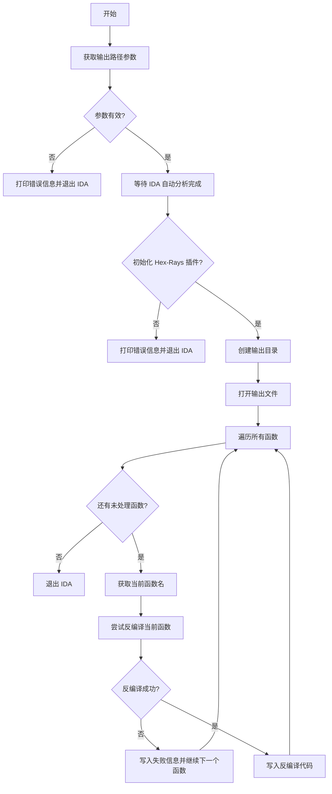
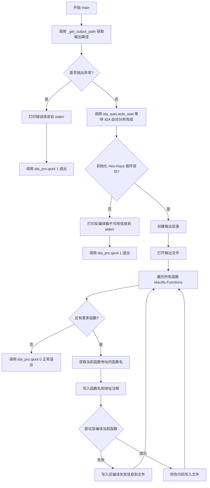

# `LLM4Decompile\sk2decompile\evaluation\bringupbench\scripts\dump_pseudo.py` 详细设计文档

这是一个 IDA Pro headless 自动化脚本，用于在无图形界面的环境下批量反编译二进制文件中所有已发现函数，并将反编译代码输出到指定文件。

## 整体流程



## 类结构

```
无类定义（脚本文件）
```

## 全局变量及字段


    

## 全局函数及方法


### `_get_output_path`

该函数用于从 IDA 脚本的命令行参数中获取用户指定的输出文件路径，并将其转换为绝对路径返回，若参数缺失则抛出异常。

参数：
（无参数）

返回值：`str`，返回用户指定的输出文件的绝对路径。

#### 流程图

```mermaid
flowchart TD
    A[开始] --> B{检查 idc.ARGV 长度是否小于 2}
    B -- 是 --> C[抛出 RuntimeError: output path argument missing]
    B -- 否 --> D[获取 idc.ARGV[1] 的绝对路径]
    D --> E[返回绝对路径]
    C --> F[异常向上传播]
```

#### 带注释源码

```python
def _get_output_path() -> str:
    # IDA populates idc.ARGV with the script path at index 0 and the
    # user-provided arguments afterwards.
    # 检查命令行参数数量，索引0为脚本自身路径，索引1为用户提供的输出路径
    if len(idc.ARGV) < 2:
        # 参数不足时抛出运行时错误
        raise RuntimeError("output path argument missing")
    # 将用户提供的相对路径或绝对路径转换为标准绝对路径
    return os.path.abspath(idc.ARGV[1])
```


### `main`

该函数为 IDA/Hex-Rays 自动化脚本的入口点，负责等待 IDA 分析完成、初始化反编译器、遍历二进制文件中所有已发现的函数、调用 Hex-Rays 反编译每个函数并将伪代码写入指定输出文件，最后正常退出 IDA。

参数：

- 该函数无参数

返回值：`None`，无返回值描述

#### 流程图



#### 带注释源码

```python
def main() -> None:
    """
    主函数：遍历所有已发现函数的反编译伪代码并输出到文件
    """
    # 尝试获取用户指定的输出路径，可能抛出异常
    try:
        output_path = _get_output_path()
    except Exception as exc:  # pragma: no cover - defensive
        # 捕获异常并打印错误信息到标准错误流
        print(f"[dump_pseudo] {exc}", file=sys.stderr)
        # 以错误码 1 退出 IDA
        ida_pro.qexit(1)
        return

    # 等待 IDA 自动分析完成，确保所有函数已被识别
    ida_auto.auto_wait()

    # 检查 Hex-Rays 反编译器插件是否可用
    if not ida_hexrays.init_hexrays_plugin():
        print("[dump_pseudo] Hex-Rays decompiler is unavailable", file=sys.stderr)
        ida_pro.qexit(1)
        return

    # 确保输出目录存在，exist_ok=True 避免目录已存在的异常
    os.makedirs(os.path.dirname(output_path), exist_ok=True)

    # 以 UTF-8 编码打开输出文件
    with open(output_path, "w", encoding="utf-8") as handle:
        # 遍历 IDA 分析出的所有函数地址
        for ea in idautils.Functions():
            # 获取当前地址对应的函数名
            name = ida_funcs.get_func_name(ea)
            # 写入函数名和地址的注释块
            handle.write(f"/* {name} @ 0x{ea:x} */\n")
            
            try:
                # 调用 Hex-Rays API 对当前函数进行反编译
                cfunc = ida_hexrays.decompile(ea)
            except ida_hexrays.DecompilationFailure as exc:
                # 反编译失败时写入错误信息到文件，继续处理下一个函数
                handle.write(f"// decompilation failed: {exc}\n\n")
                continue

            # 将反编译结果转换为字符串并写入文件
            handle.write(str(cfunc))
            # 函数之间用两个换行符分隔
            handle.write("\n\n")

    # 成功完成所有操作后以正常状态码退出 IDA
    ida_pro.qexit(0)
```

## 关键组件


### _get_output_path()

从IDA的ARGV中获取用户提供的输出路径，如果参数不足则抛出RuntimeError

### main()

主函数，协调整个伪代码转储流程，包括获取输出路径、等待自动分析、初始化Hex-Rays、遍历函数并反编译、写入文件

### 输出文件处理

将每个函数的反编译结果写入指定文件，包含函数名、地址和伪代码，支持错误处理和异常恢复

### Hex-Rays 反编译器集成

初始化Hex-Rays插件并调用decompile()函数将函数地址转换为伪代码对象，处理DecompilationFailure异常

### 函数遍历

使用idautils.Functions()遍历IDA数据库中所有已发现的函数地址

### 命令行参数处理

通过idc.ARGV获取脚本路径和用户提供的输出路径参数，进行基本的参数验证

### 错误处理与退出

捕获异常并向stderr输出错误信息，使用ida_pro.qexit()以适当的状态码退出


## 问题及建议


### 已知问题

-   **异常处理过于宽泛**：在 `_get_output_path()` 中使用了 `except Exception` 捕获所有异常，缺乏针对性的异常处理，可能隐藏真实错误
-   **缺少进度反馈**：遍历所有函数时没有进度指示，对于大型二进制文件，用户无法了解处理进度
-   **输出路径处理缺陷**：当 `output_path` 为相对路径或位于当前目录时，`os.path.dirname(output_path)` 返回空字符串，`os.makedirs` 可能失败
-   **函数名未做安全处理**：直接使用 `ida_funcs.get_func_name(ea)` 返回的函数名写入文件，未清理可能包含的非法文件名字符
-   **日志记录缺失**：仅使用 `print` 输出到 stderr，缺乏结构化日志记录，不利于问题排查和审计
-   **Hex-Rays 初始化失败无后备方案**：`init_hexrays_plugin()` 失败后直接退出，未尝试其他初始化方式或提供更详细的错误信息
-   **未处理反编译失败函数**：遇到 `DecompilationFailure` 时仅记录错误并跳过，可能遗漏关键函数信息
-   **文件编码假设**：假设输出文件可以成功以 UTF-8 编码写入，未处理可能的编码错误
-   **批量处理能力缺失**：顺序处理所有函数，未利用多核加速，对于大量函数效率较低
-   **资源未显式释放**：使用 `with` 语句虽然能自动关闭文件，但未显式调用 Hex-Rays 清理函数

### 优化建议

-   改用具体的异常类型捕获（如 `IndexError`），并为不同异常提供差异化处理
-   添加进度条或阶段性输出（如每处理 N 个函数输出一次进度）
-   在写入文件前对函数名进行清理，替换或移除非法字符
-   使用标准日志模块（`logging`）替代 `print`，并配置日志级别和格式
-   增加 Hex-Rays 初始化失败时的详细诊断信息输出
-   考虑并发处理（使用 `concurrent.futures`）提升处理速度
-   为输出文件添加 BOM 或显式指定编码错误处理策略
-   考虑添加命令行参数支持（如 `--parallel`, `--skip-failed` 等）增强灵活性

## 其它


### 设计目标与约束

本脚本的设计目标是实现无头（headless）环境下自动导出 IDA 数据库中所有函数的 Hex-Rays 伪代码。约束条件包括：(1) 必须作为 IDA批处理脚本运行（idat -A -S"script" binary）；(2) 依赖 Hex-Rays 反编译器插件；(3) 输出路径通过命令行参数传递；(4) 仅支持 Python 3 环境。

### 错误处理与异常设计

脚本采用分层错误处理策略：(1) 参数缺失时抛出 RuntimeError 并退出；(2) 反编译失败时捕获 DecompilationFailure 异常，将失败信息写入输出文件并继续处理下一个函数，而非中断整个流程；(3) IDA 插件初始化失败时打印错误信息并以错误码退出。所有错误均输出到 stderr 并通过 ida_pro.qexit() 终止 IDA 进程。

### 数据流与状态机

数据流为：命令行参数 → 输出路径解析 → IDA 自动分析等待 → Hex-Rays 初始化 → 函数遍历 → 单函数反编译 → 伪代码写入文件。状态机包含：初始态（参数解析）→ 等待态（auto_wait）→ 初始化态（Hex-Rays 检查）→ 处理态（函数遍历）→ 结束态（正常退出或异常退出）。

### 外部依赖与接口契约

外部依赖包括：(1) IDA SDK 模块：ida_auto（自动分析等待）、ida_funcs（函数名获取）、ida_hexrays（反编译接口）、ida_pro（进程退出）、idautils（函数枚举）、idc（命令行参数访问）；(2) 标准库：os（路径操作）、sys（流输出）。接口契约：idc.ARGV[1] 必须提供有效的输出文件路径；目标二进制必须已加载至 IDA 数据库且包含可识别的函数。

### 性能考虑与优化空间

当前实现逐个处理函数，反编译失败时直接跳过。可优化方向：(1) 使用多线程/多进程并行反编译不同函数以提升大规模二进制的处理速度；(2) 添加缓存机制避免重复反编译已处理的地址范围；(3) 实现增量导出模式，仅处理新增或修改的函数；(4) 对大型二进制可考虑批量提交写入而非逐函数写入文件。

### 安全考量与输入验证

输入验证方面：仅检查 idc.ARGV[1] 是否存在，未验证路径合法性（是否可写、是否指向目录等）；未检查输出路径是否覆盖重要文件。安全建议：添加输出路径存在性检查和覆盖确认机制；验证输出目录权限；考虑添加沙箱模式。

### 配置与可扩展性

当前硬编码程度较高，可扩展性设计包括：(1) 支持通过额外命令行参数指定函数过滤规则（如仅导出特定段或命名模式的函数）；(2) 支持输出格式选择（纯文本/JSON/结构化）；(3) 支持配置反编译选项（优化级别、输出选项等）；(4) 可添加日志级别控制以支持调试。

### 兼容性说明

本脚本兼容 IDA Pro 7.x 及以上版本（Hex-Rays 插件需同时安装）。不同 IDA 版本可能存在 API 差异（如 idc.ARGV 在新版中可能变化），建议添加版本检测或使用 try-except 包裹版本特定代码。Python 2 兼容性通过 `from __future__ import annotations` 保留但实际运行应使用 Python 3。

    