# `LLM4Decompile\sk2decompile\evaluation\bringupbench\scripts\eval_infer_out.py` 详细设计文档

该代码是一个自动化评估框架，通过在隔离的工作区中修补基准测试源代码、重新构建、执行测试并收集结构化日志，来评估infer-out-model2函数的替换效果，支持并行处理和多种输出格式的报告生成。

## 整体流程

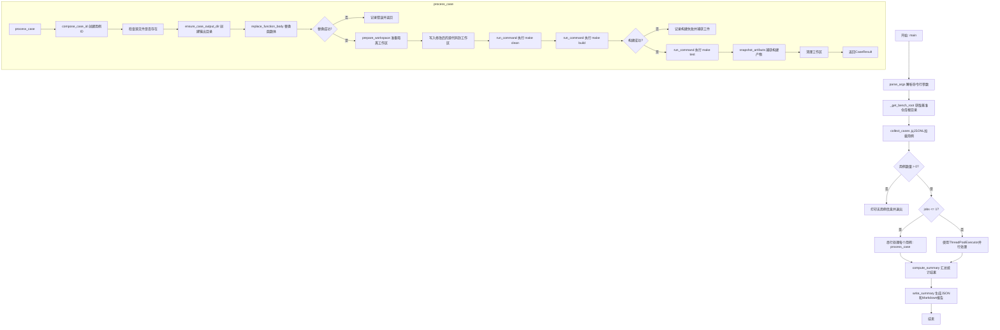

## 类结构

```
eval_infer_out_model2.py (主模块)
├── CaseResult (dataclass - 用例结果容器)
│   ├── 字段: case_id, source_path, benchmark_dir, output_dir, workspace_dir, artifact_dir, replacement_applied, build_status, test_status, notes, errors, log_files
│   └── 无方法
└── 全局函数集
    ├── _load_config_env - 加载config.env配置
    ├── _get_bench_root - 解析基准仓库根目录
    ├── parse_args - 解析命令行参数
    ├── canonicalize - 规范化文本换行符
    ├── replace_function_body - 替换函数体
    ├── compose_case_id - 构建用例标识符
    ├── ensure_case_output_dir - 创建用例输出目录
    ├── run_command - 执行shell命令并记录日志
    ├── write_case_artifacts - 写入用例工件
    ├── sanitize_case_id - 生成文件系统安全的ID
    ├── copy_ignore_eval_dirs - 复制时忽略评估目录
    ├── prepare_workspace - 准备隔离工作区
    ├── relative_to_repo - 获取相对路径
    ├── init_case_result - 初始化用例结果
    ├── snapshot_artifacts - 快照构建产物
    ├── process_case - 处理单个用例
    ├── collect_cases - 从JSONL收集用例
    ├── compute_summary - 计算汇总统计
    ├── write_summary - 写入汇总报告
    └── main - 主入口函数
```

## 全局变量及字段


### `eval_root`
    
评估项目根目录

类型：`Path`
    


### `repo_root`
    
基准仓库根目录

类型：`Path`
    


### `jsonl_path`
    
输入JSONL文件路径

类型：`Path`
    


### `args`
    
解析后的命令行参数

类型：`argparse.Namespace`
    


### `cases`
    
用例列表

类型：`List[Dict]`
    


### `results`
    
用例结果列表

类型：`List[Optional[CaseResult]]`
    


### `final_results`
    
过滤后的最终结果列表

类型：`List[CaseResult]`
    


### `summary`
    
汇总统计数据

类型：`Dict`
    


### `timestamp`
    
时间戳字符串

类型：`str`
    


### `base_name`
    
报告基础文件名

类型：`str`
    


### `json_report`
    
JSON报告文件路径

类型：`Path`
    


### `markdown_report`
    
Markdown报告文件路径

类型：`Path`
    


### `config`
    
从config.env加载的配置字典

类型：`dict`
    


### `processed`
    
已处理用例计数

类型：`int`
    


### `limit`
    
可选的处理用例数量限制

类型：`Optional[int]`
    


### `workspace_root`
    
工作区根目录

类型：`Path`
    


### `workspace_case_root`
    
当前用例的工作区根目录

类型：`Optional[Path]`
    


### `workspace_repo_root`
    
工作区中的仓库根目录

类型：`Path`
    


### `workspace_benchmark_dir`
    
工作区中的基准测试目录

类型：`Path`
    


### `full_source_text`
    
原始源代码文本

类型：`str`
    


### `updated_source`
    
修改后的源代码文本

类型：`str`
    


### `replaced`
    
替换是否成功的标志

类型：`bool`
    


### `case_dir`
    
当前用例的输出目录

类型：`Path`
    


### `log_path`
    
日志文件路径

类型：`Path`
    


### `artifacts_dir`
    
工件目录路径

类型：`Path`
    


### `clean_rc`
    
make clean返回码

类型：`Optional[int]`
    


### `build_rc`
    
make build返回码

类型：`Optional[int]`
    


### `test_rc`
    
make test返回码

类型：`Optional[int]`
    


### `artifacts_captured`
    
工件是否已捕获的标志

类型：`bool`
    


### `total`
    
总用例数

类型：`int`
    


### `replacements`
    
成功替换数

类型：`int`
    


### `build_success`
    
构建成功数

类型：`int`
    


### `test_success`
    
测试成功数

类型：`int`
    


### `per_benchmark`
    
按基准测试分类的统计字典

类型：`Dict[str, Dict[str, float]]`
    


### `CaseResult.case_id`
    
用例唯一标识符

类型：`str`
    


### `CaseResult.source_path`
    
源文件路径

类型：`str`
    


### `CaseResult.benchmark_dir`
    
基准测试目录

类型：`str`
    


### `CaseResult.output_dir`
    
输出目录路径

类型：`str`
    


### `CaseResult.workspace_dir`
    
工作区目录（可选）

类型：`str`
    


### `CaseResult.artifact_dir`
    
工件目录（可选）

类型：`str`
    


### `CaseResult.replacement_applied`
    
是否成功应用替换

类型：`bool`
    


### `CaseResult.build_status`
    
构建状态 (succeeded|failed|skipped)

类型：`str`
    


### `CaseResult.test_status`
    
测试状态 (succeeded|failed|skipped)

类型：`str`
    


### `CaseResult.notes`
    
备注信息列表

类型：`List[str]`
    


### `CaseResult.errors`
    
错误信息列表

类型：`List[str]`
    


### `CaseResult.log_files`
    
日志文件路径字典

类型：`Dict[str, str]`
    
    

## 全局函数及方法


### `_load_config_env`

从 eval 项目根目录下的 config.env 文件加载配置信息，并返回一个包含所有配置项的字典。

参数：  
（无）

返回值：`dict`，返回从 config.env 文件解析出的键值对集合，如果文件不存在或为空则返回空字典。

#### 流程图

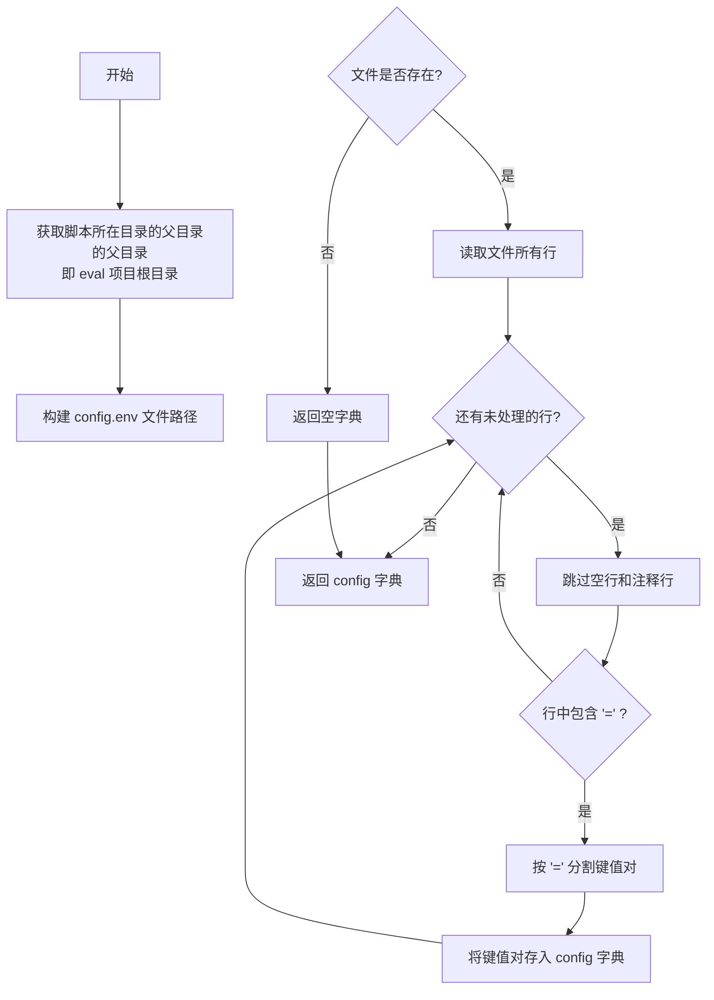

#### 带注释源码

```python
def _load_config_env() -> dict:
    """Load config.env from the eval project root."""
    # 获取当前脚本文件的绝对路径，然后取其父目录的父目录（即项目根目录）
    eval_root = Path(__file__).resolve().parents[1]
    
    # 拼接 config.env 文件的完整路径
    config_path = eval_root / "config.env"
    
    # 初始化空字典用于存储配置
    config = {}
    
    # 检查配置文件是否存在
    if config_path.exists():
        # 读取文件所有行并逐行处理
        for line in config_path.read_text().splitlines():
            # 去除行首尾的空白字符
            line = line.strip()
            
            # 跳过空行和以 '#' 开头的注释行
            if not line or line.startswith("#"):
                continue
            
            # 处理形如 KEY=VALUE 的配置行
            if "=" in line:
                # 使用 partition 分割，只取第一个 '=' 的左侧作为键，右侧作为值
                key, _, value = line.partition("=")
                # 去除键和值的多余空白后存入字典
                config[key.strip()] = value.strip()
    
    # 返回解析后的配置字典
    return config
```


### `_get_bench_root`

该函数负责解析并获取基准仓库（Benchmark Repository）的根目录。它通过 CLI 参数、环境变量 `BENCH_REPO_ROOT` 以及本地配置文件 `config.env` 三种渠道按优先级获取路径，若均未设置，则打印错误信息并终止程序。

参数：

-  `cli_value`：`str | None`，从命令行传入的基准仓库路径（优先级最高）。

返回值：`Path`，解析并返回的基准仓库绝对路径对象。

#### 流程图

```mermaid
flowchart TD
    Start([开始]) --> CheckCLI{cli_value 是否存在?}
    CheckCLI -- 是 --> ResolveCLI[执行 Path(cli_value).resolve()]
    ResolveCLI --> Return1[返回 Path 对象]
    CheckCLI -- 否 --> CheckEnv{os.environ 中<br>是否存在 BENCH_REPO_ROOT?}
    CheckEnv -- 是 --> ResolveEnv[执行 Path(env_val).resolve()]
    ResolveEnv --> Return2[返回 Path 对象]
    CheckEnv -- 否 --> LoadConfig[调用 _load_config_env<br>读取 config.env]
    LoadConfig --> CheckConfig{config 字典中<br>是否存在 BENCH_REPO_ROOT?}
    CheckConfig -- 是 --> ResolveConfig[执行 Path(config[...]).resolve()]
    ResolveConfig --> Return3[返回 Path 对象]
    CheckConfig -- 否 --> Exit[调用 sys.exit<br>输出错误信息并退出]
```

#### 带注释源码

```python
def _get_bench_root(cli_value: str | None = None) -> Path:
    """Resolve the benchmark repo root from CLI arg, env var, or config.env."""
    # 1. 优先级最高：检查 CLI 参数是否直接提供了路径
    if cli_value:
        # 将字符串路径转换为 Path 对象并解析为绝对路径
        return Path(cli_value).resolve()
    
    # 2. 优先级第二：检查环境变量 BENCH_REPO_ROOT
    env_val = os.environ.get("BENCH_REPO_ROOT")
    if env_val:
        return Path(env_val).resolve()
    
    # 3. 优先级第三：回退到读取项目根目录下的 config.env 配置文件
    config = _load_config_env()
    if "BENCH_REPO_ROOT" in config:
        return Path(config["BENCH_REPO_ROOT"]).resolve()
    
    # 4. 如果以上三者都未获取到路径，则打印错误并退出程序
    sys.exit("error: BENCH_REPO_ROOT not set. Use --bench-root, set the env var, or configure config.env")
```


### `parse_args`

该函数通过 argparse 库定义并解析命令行参数，支持自定义基准仓库路径、案例处理限制、构建目标、报告输出目录、工作区管理、并行任务数等多种配置选项，最终返回包含所有命令行参数的 `argparse.Namespace` 对象。

参数：无（函数不接受任何输入参数）

返回值：`argparse.Namespace`，包含所有解析后的命令行参数及其值

#### 流程图

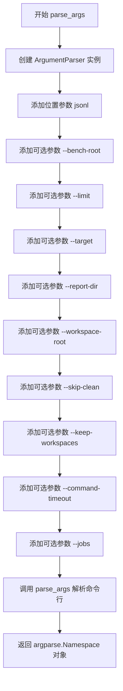

#### 带注释源码

```python
def parse_args() -> argparse.Namespace:
    """
    解析命令行参数并返回包含所有配置选项的 Namespace 对象。
    
    该函数使用 argparse 定义了评估脚本所需的所有命令行参数，
    包括输入文件路径、各种输出/工作目录配置、构建选项和并行处理设置。
    
    Returns:
        argparse.Namespace: 包含所有解析后命令行参数的命名空间对象
    """
    # 1. 创建 ArgumentParser 实例，设置程序描述
    parser = argparse.ArgumentParser(
        description="Replace functions with infer-out-model2 bodies, build, "
        "execute, and record results without modifying the original benchmarks."
    )
    
    # 2. 添加位置参数 jsonl（必需）：输入的 JSONL 文件路径
    parser.add_argument(
        "jsonl",
        help="Path to the merged.*.jsonl file containing cases to evaluate.",
    )
    
    # 3. 添加可选参数 --bench-root：基准仓库根目录
    parser.add_argument(
        "--bench-root",
        default=None,
        help="Path to the Bringup-Bench repository root (default: from config.env).",
    )
    
    # 4. 添加可选参数 --limit：限制处理的案例数量
    parser.add_argument(
        "--limit",
        type=int,
        default=None,
        help="Optional limit on the number of cases to process.",
    )
    
    # 5. 添加可选参数 --target：构建目标（默认为 host）
    parser.add_argument(
        "--target",
        default="host",
        help="Benchmark build target passed as TARGET=<target> (default: host).",
    )
    
    # 6. 添加可选参数 --report-dir：聚合报告输出目录
    parser.add_argument(
        "--report-dir",
        default="reports/infer_out_eval",
        help="Directory (relative to eval root) where aggregated reports are written.",
    )
    
    # 7. 添加可选参数 --workspace-root：临时工作区根目录
    parser.add_argument(
        "--workspace-root",
        default="reports/infer_out_eval/workspaces",
        help="Directory (relative to eval root) to host temporary build workspaces.",
    )
    
    # 8. 添加可选参数 --skip-clean：跳过 make clean 步骤
    parser.add_argument(
        "--skip-clean",
        action="store_true",
        help="Skip running 'make clean' inside the workspace (useful when iterating).",
    )
    
    # 9. 添加可选参数 --keep-workspaces：保留临时工作区
    parser.add_argument(
        "--keep-workspaces",
        action="store_true",
        help="Keep temporary workspaces after each case finishes (default removes them).",
    )
    
    # 10. 添加可选参数 --command-timeout：命令执行超时时间（秒）
    parser.add_argument(
        "--command-timeout",
        type=int,
        default=20,
        help="Timeout (in seconds) for each make invocation; 0 disables the timeout.",
    )
    
    # 11. 添加可选参数 --jobs：并行处理的任务数
    parser.add_argument(
        "--jobs",
        type=int,
        default=96,
        help="Number of cases to process in parallel (default: 1).",
    )
    
    # 12. 解析命令行参数并返回 Namespace 对象
    return parser.parse_args()
```


### `canonicalize`

该函数用于将文本中的换行符规范化，将 Windows 风格的 CRLF（`\r\n`）转换为 Unix 风格的 LF（`\n`），以确保在进行子字符串匹配时的准确性和一致性。

参数：

- `text`：`str`，需要规范化的原始文本

返回值：`str`，换行符规范化后的文本

#### 流程图

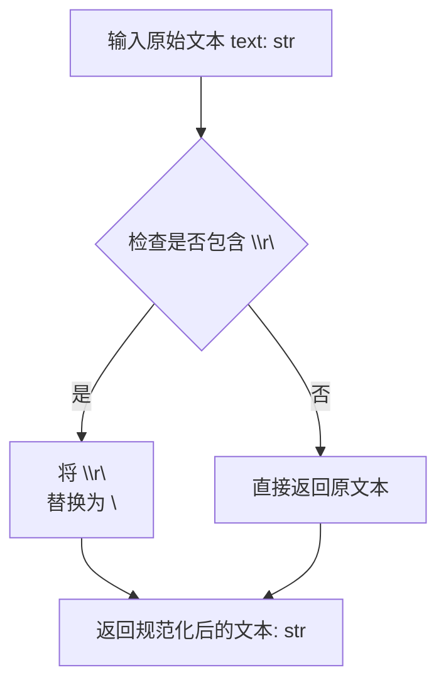

#### 带注释源码

```python
def canonicalize(text: str) -> str:
    """
    Normalize newlines for reliable substring matching.
    
    该函数将 Windows/传统 Mac 风格的回车换行符 (CRLF, \\r\\n) 
    统一转换为 Unix/Linux/macOS 风格的换行符 (LF, \\n)。
    这一规范化操作对于代码替换功能至关重要，因为它确保了
    在进行子字符串查找和替换时，原始源代码与参考函数文本
    的换行符格式一致，避免因换行符差异导致的匹配失败。
    
    参数:
        text: str - 需要规范化的原始文本，通常是源代码或函数内容
        
    返回:
        str - 换行符统一为 \\n 后的文本
    """
    return text.replace("\r\n", "\n")
```


### `replace_function_body`

该函数用于在完整源代码中查找并替换指定的函数体文本，通过规范化处理换行符差异，尝试多种匹配形式（原始文本、尾部添加换行、去除空白），找到目标文本后进行精确替换，并返回更新后的源代码及替换是否成功的标志。

参数：

- `full_source`：`str`，完整的源代码文件内容
- `reference_function`：`str`，需要被替换的原始函数代码文本
- `inferred_function`：`str`，用来替换的新函数代码文本

返回值：`Tuple[str, bool]`，返回元组包含更新后的源代码字符串和布尔值（True 表示替换成功，False 表示未找到匹配项）

#### 流程图

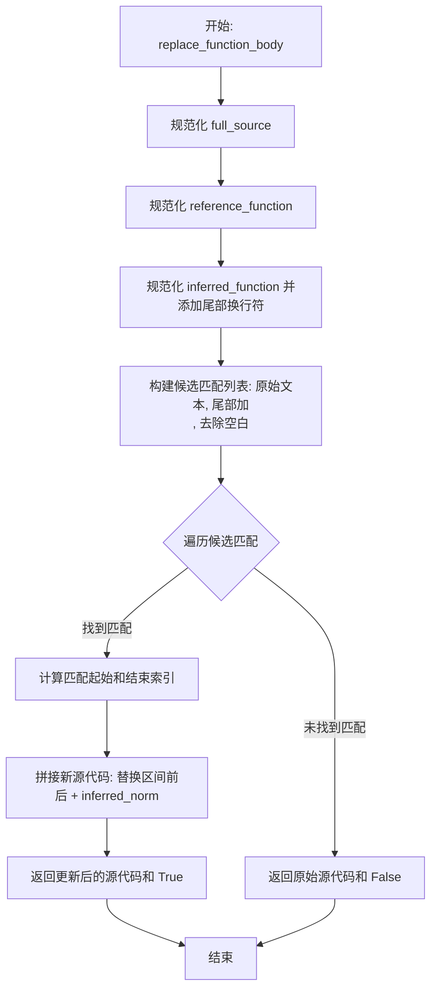

#### 带注释源码

```python
def replace_function_body(
    full_source: str, reference_function: str, inferred_function: str
) -> Tuple[str, bool]:
    """
    Replace the exact reference_function text with inferred_function.

    Returns the updated source and a boolean indicating if replacement happened.
    
    参数:
        full_source: 完整的源代码文件内容字符串
        reference_function: 需要被替换的原始函数代码文本
        inferred_function: 用来替换的新函数代码文本
    
    返回:
        Tuple[str, bool]: 
            - str: 更新后的源代码，如果未找到匹配则返回原始源代码
            - bool: 替换是否成功发生
    """
    # 1. 规范化源代码：统一换行符为 \n（处理 Windows \r\n 和 Unix \n 差异）
    source_norm = canonicalize(full_source)
    
    # 2. 规范化参考函数（需要被替换的函数）
    reference_norm = canonicalize(reference_function)
    
    # 3. 规范化推断函数（替换后的函数），确保尾部有换行符
    inferred_norm = canonicalize(inferred_function).rstrip() + "\n"

    # 4. 构建候选匹配列表：尝试多种形式以提高匹配成功率
    #    - 原始形式
    #    - 尾部添加换行符的形式
    #    - 去除首尾空白的形式
    candidates = (
        reference_norm,
        reference_norm.rstrip() + "\n",
        reference_norm.strip(),
    )

    # 5. 遍历每个候选匹配模式
    for snippet in candidates:
        # 在规范化后的源代码中查找匹配位置
        start_idx = source_norm.find(snippet)
        
        # 如果未找到，继续尝试下一个候选
        if start_idx == -1:
            continue
        
        # 6. 找到匹配：计算匹配的结束索引
        end_idx = start_idx + len(snippet)
        
        # 7. 执行替换：拼接 [0:start_idx] + inferred_norm + [end_idx:]
        updated = source_norm[:start_idx] + inferred_norm + source_norm[end_idx:]
        
        # 8. 返回更新后的源代码和成功标志
        return updated, True
    
    # 9. 所有候选都未匹配：返回原始源代码和失败标志
    return full_source, False
```


### `compose_case_id`

构建一个稳定的、唯一的用例标识符，用于在评估流程中追踪和识别每个测试用例。

参数：

- `case`：`Dict`，包含 `source` 和 `pseudo` 两个键的字典，其中 `source` 包含 `path` 和 `function_name`，`pseudo` 包含 `address`

返回值：`str`，格式为 `{source.path}::{source.function_name}@{pseudo.address}` 的唯一标识字符串

#### 流程图

```mermaid
flowchart TD
    A[开始] --> B[提取 case['source']['path']]
    C[提取 case['source']['function_name']]
    D[提取 case['pseudo']['address']]
    B --> E[拼接字符串: path::function_name@address]
    C --> E
    D --> E
    E --> F[返回标识符字符串]
```

#### 带注释源码

```python
def compose_case_id(case: Dict) -> str:
    """
    Build a stable identifier for a case.
    
    通过组合源文件路径、函数名和伪代码地址来构建一个唯一的用例标识符。
    标识符格式: {path}::{function_name}@{address}
    """
    return (
        f"{case['source']['path']}::{case['source']['function_name']}"
        f"@{case['pseudo']['address']}"
    )
```


### `ensure_case_output_dir`

创建用例输出目录。该函数根据传入的 `pseudo_path_str` 拼接出基础目录，并在此基础上创建包含 `pseudo_address` 的最终用例目录。函数还处理了路径冲突（例如目标路径是文件而非目录）以及清理同名旧目录的情况。

参数：

- `output_root`：`Path`，输出报告的根目录。
- `pseudo_path_str`：`str`，伪路径字符串，用于构建基础目录结构。
- `pseudo_address`：`str`，伪地址字符串，作为最终目录的名称。
- `result`：`CaseResult`，用例结果对象，用于记录路径冲突等备注信息。

返回值：`Path`，返回创建好的用例目录的绝对路径。

#### 流程图

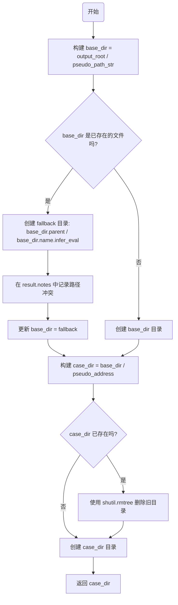

#### 带注释源码

```python
def ensure_case_output_dir(
    output_root: Path, pseudo_path_str: str, pseudo_address: str, result: CaseResult
) -> Path:
    """Create the per-case output directory, handling file path collisions."""
    # 1. 将传入的字符串路径转换为 Path 对象，并与根目录拼接
    pseudo_rel = Path(pseudo_path_str)
    base_dir = output_root / pseudo_rel

    # 2. 检查基础路径是否与现有文件冲突
    if base_dir.exists() and base_dir.is_file():
        # 如果 pseudo_path 是一个文件而非目录，则创建一个带后缀的备用目录
        fallback = base_dir.parent / f"{base_dir.name}.infer_eval"
        fallback.mkdir(parents=True, exist_ok=True)
        
        # 记录日志，说明为什么改变路径
        result.notes.append(
            f"pseudo.path '{pseudo_path_str}' is a file; using '{fallback.relative_to(output_root)}' for logs."
        )
        base_dir = fallback
    else:
        # 如果路径不存在或是目录，直接创建
        base_dir.mkdir(parents=True, exist_ok=True)

    # 3. 构建最终的用例目录（包含 address）
    case_dir = base_dir / pseudo_address
    
    # 4. 如果该目录已存在（可能是之前运行的残留），则删除它以确保环境干净
    if case_dir.exists():
        shutil.rmtree(case_dir)
        
    # 5. 创建最终的目录并返回
    case_dir.mkdir(parents=True, exist_ok=True)
    return case_dir
```


### `run_command`

执行外部命令并捕获其标准输出和标准错误，将所有输出写入日志句柄，同时处理超时场景。如果命令超时则返回 None，否则返回命令的退出码。

参数：

- `command`：`List[str]`，要执行的命令及参数列表
- `cwd`：`Path`，命令执行时的工作目录
- `log_handle`：日志文件句柄，用于写入命令执行信息
- `step_name`：`str`，步骤标识名称，用于日志中标识当前执行步骤
- `timeout`：`Optional[int]`，命令执行超时时间（秒），0 或 None 表示无超时限制

返回值：`Optional[int]`，命令执行完成时返回退出码（整数），超时时返回 None

#### 流程图

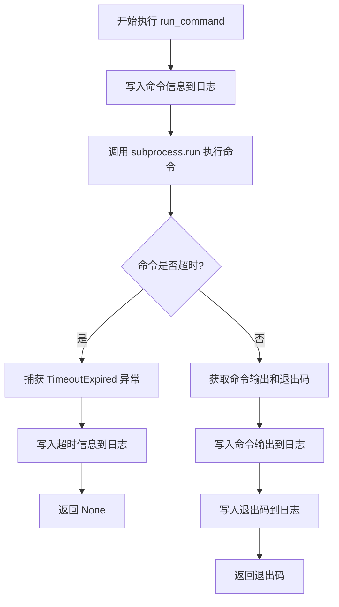

#### 带注释源码

```python
def run_command(
    command: List[str],
    cwd: Path,
    log_handle,
    step_name: str,
    timeout: Optional[int],
) -> Optional[int]:
    """Run a command, capture stdout/stderr, and write everything to log_handle."""
    # 记录要执行的命令到日志，供调试和审计使用
    log_handle.write(f"\n[{step_name}] $ {' '.join(command)}\n")
    log_handle.flush()  # 确保日志立即写入文件
    
    try:
        # 使用 subprocess.run 执行外部命令
        # stdout=PIPE 和 stderr=STDOUT 合并输出到 stdout
        # text=True 自动将输出解码为字符串
        # encoding="utf-8" 指定输出编码
        # errors="replace" 处理解码错误，用替换字符代替
        completed = subprocess.run(
            command,
            cwd=str(cwd),  # Path 对象需转为字符串
            stdout=subprocess.PIPE,
            stderr=subprocess.STDOUT,
            text=True,
            encoding="utf-8",
            errors="replace",
            timeout=timeout if timeout and timeout > 0 else None,  # 0 或负数视为无超时
        )
        # 写入命令的实际输出内容
        log_handle.write(completed.stdout)
        # 记录命令的退出码，供后续判断成功或失败
        log_handle.write(f"[{step_name}] exit code: {completed.returncode}\n")
        log_handle.flush()
        # 返回命令的退出码，0 通常表示成功
        return completed.returncode
    
    except subprocess.TimeoutExpired as exc:
        # 处理命令执行超时的情况
        # 超时异常可能包含部分输出
        output = exc.output or exc.stdout
        if output:
            # 异常中的输出可能是 bytes 或 str 类型，需分别处理
            if isinstance(output, bytes):
                log_handle.write(output.decode("utf-8", "replace"))
            else:
                log_handle.write(output)
        # 记录超时信息到日志，便于排查问题
        log_handle.write(
            f"[{step_name}] timed out after {timeout} seconds; terminating process.\n"
        )
        log_handle.flush()
        # 返回 None 表示命令超时失败，区别于正常退出码
        return None
```


### `write_case_artifacts`

**描述**：该函数负责将评估用例的关键产物持久化到磁盘。它接收用例目录、元数据字典、修改后的源码以及原始源码作为输入，并将这些信息连同从元数据中提取的原始函数和推理函数片段一起写入到指定的 `case_dir` 中，形成一套完整的审计追踪文件。

**参数**：
- `case_dir`：`Path`，用于存放当前用例所有输出文件的根目录路径。
- `case`：`Dict`，包含用例完整元数据的字典对象（如 `source`、`pseudo` 等键值）。
- `modified_source`：`str`，经过函数体替换后的完整 C 源码文件内容。
- `original_source`：`str`，未经过修改的原始完整 C 源码文件内容。

**返回值**：`None`（无返回值）。该函数通过执行文件写入操作产生副作用。

#### 流程图

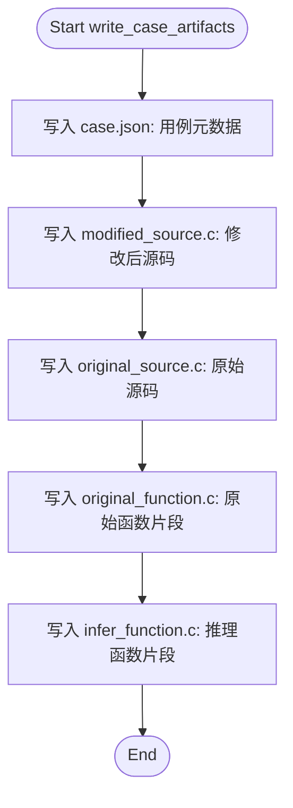

#### 带注释源码

```python
def write_case_artifacts(
    case_dir: Path,
    case: Dict,
    modified_source: str,
    original_source: str,
) -> None:
    """Persist reusable artifacts for a case."""
    # 1. 将用例的完整元数据（JSON 格式）写入文件，用于记录用例的原始属性
    (case_dir / "case.json").write_text(json.dumps(case, indent=2), encoding="utf-8")
    
    # 2. 写入替换了推理函数后的完整源码文件
    (case_dir / "modified_source.c").write_text(modified_source, encoding="utf-8")
    
    # 3. 写入未修改前的原始源码文件备份
    (case_dir / "original_source.c").write_text(original_source, encoding="utf-8")
    
    # 4. 从元数据中提取原始函数的代码片段，经过规范化处理后写入文件
    (case_dir / "original_function.c").write_text(
        canonicalize(case["source"]["content"]), encoding="utf-8"
    )
    
    # 5. 从元数据中提取推理出的函数代码片段（content-fix），经过规范化处理后写入文件
    (case_dir / "infer_function.c").write_text(
        canonicalize(case["pseudo"]["content-fix"]), encoding="utf-8"
    )
```


### `sanitize_case_id`

生成文件系统安全的 case 标识符，将不符合文件系统命名规范的字符替换为下划线，并处理空值情况。

参数：

-  `case_id`：`str`，需要被清理的 case 标识符

返回值：`str`，文件系统安全的标识符

#### 流程图

```mermaid
flowchart TD
    A[开始] --> B{使用正则替换非法字符}
    B --> C[将 [^A-Za-z0-9._-]+ 替换为 _]
    D[去除首尾下划线] --> E{判断结果是否为空}
    E -->|是| F[返回 'case']
    E -->|否| G[返回 sanitized]
    C --> D
    
    style A fill:#f9f,color:#000
    style F fill:#9f9,color:#000
    style G fill:#9f9,color:#000
```

#### 带注释源码

```python
def sanitize_case_id(case_id: str) -> str:
    """Generate filesystem-safe case identifier."""
    # 使用正则表达式将所有非字母、数字、点、下划线、连字符的字符替换为下划线
    # [^A-Za-z0-9._-]+ 匹配一个或多个不符合文件系统安全命名的字符
    sanitized = re.sub(r"[^A-Za-z0-9._-]+", "_", case_id)
    # 去除首尾的下划线，防止生成的路径出现以点或下划线开头/结尾的情况
    # 如果清理后的字符串为空（例如原 case_id 全是特殊字符），则返回默认值 "case"
    return sanitized.strip("_") or "case"
```


### `copy_ignore_eval_dirs`

该函数是 `shutil.copytree` 的忽略回调辅助函数，用于在复制基准测试目录时排除评估产物目录（以 `.infer_eval` 结尾的目录），确保工作空间复制过程中不包含之前的评估 artifacts。

参数：

- `_src`：`str`，源目录路径（Shutil copytree 签名要求，虽未使用）
- `names`：`List[str]`，
</think>

需要检查的文件或目录名列表，由 shutil.copytree 自动传入

返回值：`List[str]`，返回需要忽略的文件/目录名列表（即所有以 `.infer_eval` 结尾的名称）

#### 流程图

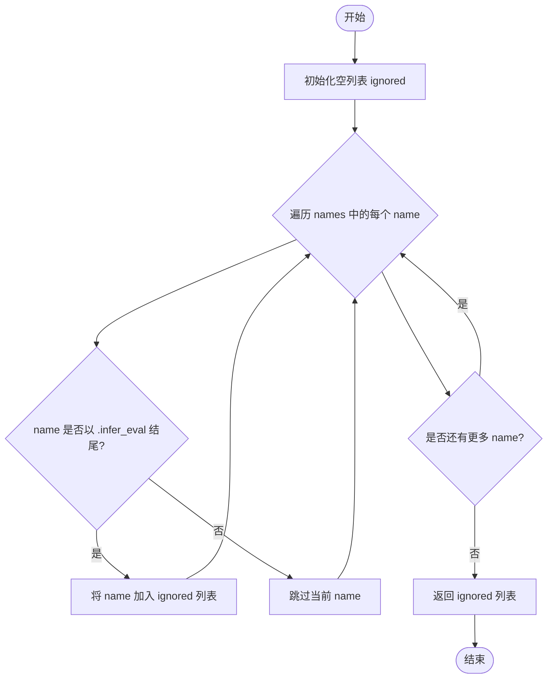

#### 带注释源码

```python
def copy_ignore_eval_dirs(_src: str, names: List[str]) -> List[str]:
    """
    Ignore helper to skip evaluation artifacts when copying benchmark dirs.
    
    该函数作为 shutil.copytree 的 ignore 参数传入，
    用于在复制 benchmark 目录时排除评估过程中生成的临时目录。
    
    参数:
        _src: 源目录路径 (shutil.copytree 调用约定所需,本函数未使用)
        names: 正在复制的目录中的文件/子目录名称列表
    
    返回:
        需要在复制时忽略的名称列表 (以 .infer_eval 结尾的目录)
    """
    ignored: List[str] = []  # 用于存储需要忽略的目录名
    for name in names:       # 遍历所有传入的文件/目录名
        if name.endswith(".infer_eval"):  # 检查是否以评估产物后缀结尾
            ignored.append(name)  # 将其加入忽略列表
    return ignored  # 返回需要忽略的名称列表
```


### `prepare_workspace`

该函数用于在评估测试用例时，准备一个隔离的临时工作区，将基准仓库的必要文件（Makefile、common、target目录以及特定的benchmark目录）复制到工作区中，以避免污染原始仓库，同时支持并行评估多个用例。

参数：

- `repo_root`：`Path`，基准仓库的根目录路径
- `benchmark_dir`：`Path`，需要评估的benchmark目录路径
- `workspace_root`：`Path`，工作区的根目录路径
- `case_id`：`str`，用例的唯一标识符，用于生成工作区子目录名称

返回值：`Tuple[Path, Path]`，返回一个元组，包含工作区用例根目录和工作区复制的仓库根目录

#### 流程图

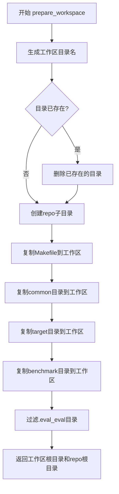

#### 带注释源码

```python
def prepare_workspace(
    repo_root: Path,
    benchmark_dir: Path,
    workspace_root: Path,
    case_id: str,
) -> Tuple[Path, Path]:
    """Clone the necessary subset of the repo into a temporary workspace."""
    # 使用sanitize_case_id函数将case_id转换为文件系统安全的名称
    # 并在workspace_root下创建对应的子目录
    workspace_case_root = workspace_root / sanitize_case_id(case_id)
    
    # 如果该目录已存在（可能是之前失败的残留），先删除以确保干净的环境
    if workspace_case_root.exists():
        shutil.rmtree(workspace_case_root)
    
    # 在用例工作区内创建repo子目录，用于存放复制的仓库文件
    workspace_repo_root = workspace_case_root / "repo"
    workspace_repo_root.mkdir(parents=True, exist_ok=True)

    # 复制基准仓库的Makefile到工作区（用于后续的make命令）
    shutil.copy2(repo_root / "Makefile", workspace_repo_root / "Makefile")
    
    # 复制common目录（可能包含共享的构建脚本或配置）
    shutil.copytree(repo_root / "common", workspace_repo_root / "common", dirs_exist_ok=True)
    
    # 复制target目录（可能包含目标平台相关的配置）
    shutil.copytree(repo_root / "target", workspace_repo_root / "target", dirs_exist_ok=True)
    
    # 复制需要评估的benchmark目录到工作区
    # 使用copy_ignore_eval_dirs过滤掉以.infer_eval结尾的目录（避免复制评估产物）
    shutil.copytree(
        benchmark_dir,
        workspace_repo_root / benchmark_dir.name,
        dirs_exist_ok=True,
        ignore=copy_ignore_eval_dirs,
    )
    
    # 返回两个路径：
    # 1. workspace_case_root - 用例的工作区根目录
    # 2. workspace_repo_root - 复制的仓库根目录
    return workspace_case_root, workspace_repo_root
```


### `relative_to_repo`

获取相对路径，尝试将给定路径转换为相对于仓库根目录的路径；如果路径不在仓库根目录下，则返回原始路径的字符串表示。

参数：

- `path`：`Path`，需要转换的输入路径
- `repo_root`：`Path`，仓库根目录路径

返回值：`str`，相对路径字符串（如果可以转换）或原始路径字符串（如果转换失败）

#### 流程图

```mermaid
flowchart TD
    A[开始: relative_to_repo] --> B[接收参数 path 和 repo_root]
    B --> C{尝试 path.relative_to(repo_root)}
    C -->|成功| D[返回相对路径字符串]
    C -->|抛出 ValueError| E[返回原始路径字符串]
    D --> F[结束]
    E --> F
```

#### 带注释源码

```python
def relative_to_repo(path: Path, repo_root: Path) -> str:
    """Return a path relative to repo_root when possible."""
    try:
        # 尝试获取 path 相对于 repo_root 的相对路径
        return str(path.relative_to(repo_root))
    except ValueError:
        # 如果 path 不在 repo_root 下（不在同一路径树下），抛出 ValueError
        # 此时返回原始 path 的字符串表示
        return str(path)
```


### `init_case_result`

该函数用于根据传入的用例数据字典和代码仓根目录，初始化并返回一个 `CaseResult` 对象。它主要负责提取用例的元数据（如源文件路径、基准测试目录），并处理路径的相对计算。

参数：

- `case`：`Dict`，包含用例原始信息的字典，必须包含 `source`（含 path, function_name）和 `pseudo`（含 address）键。
- `repo_root`：`Path`，基准测试代码仓库的根目录路径（Path 对象）。

返回值：`CaseResult`，初始化好的用例结果对象，包含用例 ID、源文件路径、基准测试目录（相对路径或绝对路径），但尚不包含执行结果。

#### 流程图

```mermaid
graph TD
    A([开始 init_case_result]) --> B[从 case 中提取 source.path 并转为 Path 对象]
    B --> C[计算基准目录路径: benchmark_dir_path = (repo_root / source_rel).parent]
    C --> D{尝试获取相对路径}
    D -- 成功 --> E[benchmark_rel = 相对路径字符串]
    D -- 失败 (ValueError) --> F[benchmark_rel = 绝对路径字符串]
    E --> G[调用 compose_case_id 生成用例 ID]
    F --> G
    G --> H[实例化 CaseResult 对象]
    H --> I([返回 CaseResult])
```

#### 带注释源码

```python
def init_case_result(case: Dict, repo_root: Path) -> CaseResult:
    """Create a CaseResult with basic metadata for the given case."""
    # 1. 从 case 字典中提取源文件路径，并转换为 Path 对象
    source_rel = Path(case["source"]["path"])
    
    # 2. 计算该源文件所在的目录，即 benchmark 目录的路径
    benchmark_dir_path = (repo_root / source_rel).parent
    
    # 3. 尝试将该目录路径转换为相对于 repo_root 的路径，以便于报告聚合
    #    如果失败（例如路径不在 repo_root 下），则使用绝对路径字符串
    try:
        benchmark_rel = str(benchmark_dir_path.relative_to(repo_root))
    except ValueError:
        benchmark_rel = str(benchmark_dir_path)
        
    # 4. 构造并返回 CaseResult 实例
    return CaseResult(
        case_id=compose_case_id(case),
        source_path=str(source_rel),
        benchmark_dir=benchmark_rel,
        output_dir="",  # 初始为空，后续由 process_case 填充
    )
```


### `snapshot_artifacts`

将工作空间的 benchmark 目录复制到案例目录中作为构建产物。

参数：

- `case_dir`：`Path`，案例的输出目录，用于存放 artifacts
- `workspace_benchmark_dir`：`Path`，工作空间中 benchmark 目录的路径，包含构建产物
- `eval_root`：`Path`，评估项目的根目录，用于计算相对路径
- `result`：`CaseResult`，用于记录 artifact 目录路径和错误信息

返回值：`None`，无返回值，通过 result 参数输出结果

#### 流程图

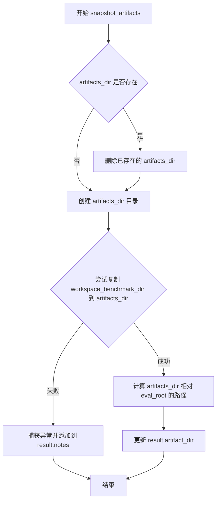

#### 带注释源码

```python
def snapshot_artifacts(
    case_dir: Path,
    workspace_benchmark_dir: Path,
    eval_root: Path,
    result: CaseResult,
) -> None:
    """
    Copy the workspace benchmark directory into the case directory.
    将工作空间的 benchmark 目录复制到案例目录中作为构建产物。
    """
    # 构建 artifacts 目录路径：case_dir/artifacts
    artifacts_dir = case_dir / "artifacts"
    
    # 如果 artifacts 目录已存在，先删除（确保是干净的副本）
    if artifacts_dir.exists():
        shutil.rmtree(artifacts_dir)
    
    try:
        # 使用 copytree 复制整个目录树
        # 这会递归复制 workspace_benchmark_dir 下的所有文件和子目录
        shutil.copytree(workspace_benchmark_dir, artifacts_dir)
        
        # 计算 artifacts_dir 相对于 eval_root 的路径
        # 并存储到 result.artifact_dir 中供后续使用
        result.artifact_dir = relative_to_repo(artifacts_dir, eval_root)
        
    except Exception as exc:  # pragma: no cover - defensive
        # 防御性编程：捕获复制过程中的异常
        # 将错误信息记录到 result.notes 中，不中断主流程
        result.notes.append(f"Failed to copy artifacts: {exc}")
```


### `process_case`

处理单个用例的完整流程，包括验证源文件、应用函数替换、创建临时工作空间、执行构建与测试、捕获产物并清理资源。

参数：

- `case`：`Dict`，从 JSONL 文件中读取的用例字典，包含 source（原始函数信息）和 pseudo（推断函数信息）
- `args`：`argparse.Namespace`，命令行参数，包含 target、skip_clean、keep_workspaces、command_timeout、workspace_root 等
- `repo_root`：`Path`，Bringup-Bench 仓库的根目录
- `eval_root`：`Path`，评估项目的根目录

返回值：`CaseResult`，包含用例处理结果的 dataclass，记录构建状态、测试状态、错误信息等

#### 流程图

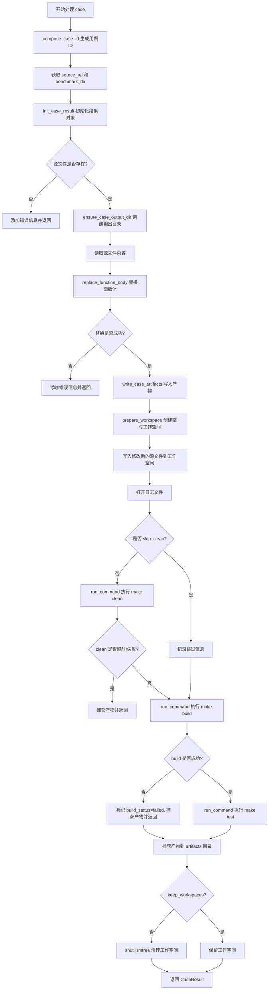

#### 带注释源码

```python
def process_case(
    case: Dict,
    args: argparse.Namespace,
    repo_root: Path,
    eval_root: Path,
) -> CaseResult:
    """Process a single JSONL entry."""
    # 步骤1: 构建用例唯一标识符
    case_id = compose_case_id(case)
    # 步骤2: 从 case 字典中提取源文件相对路径和基准目录
    source_rel = Path(case["source"]["path"])
    source_path = repo_root / source_rel
    benchmark_dir = source_path.parent

    # 步骤3: 创建初始的 CaseResult 对象，包含基本元数据
    result = init_case_result(case, repo_root)

    # 步骤4: 验证源文件是否存在
    if not source_path.exists():
        result.errors.append(f"Source file '{source_rel}' does not exist.")
        return result

    # 步骤5: 创建该用例的输出目录
    try:
        case_dir = ensure_case_output_dir(
            eval_root, case["pseudo"]["path"], case["pseudo"]["address"], result
        )
    except Exception as exc:  # pragma: no cover - defensive
        result.errors.append(f"Failed to prepare case directory: {exc}")
        return result

    # 设置输出目录相对路径
    result.output_dir = str(case_dir.relative_to(eval_root))

    # 步骤6: 读取原始源文件内容
    full_source_text = source_path.read_text(encoding="utf-8")
    # 步骤7: 使用推断函数替换原始函数
    updated_source, replaced = replace_function_body(
        full_source_text,
        case["source"]["content"],
        case["pseudo"]["content-fix"],
    )

    # 步骤8: 检查替换是否成功
    if not replaced:
        result.errors.append(
            "Could not locate the original function snippet in source file."
        )
        return result

    # 标记替换已应用
    result.replacement_applied = True
    # 步骤9: 写入用例产物到 case 目录
    write_case_artifacts(case_dir, case, updated_source, full_source_text)

    # 步骤10: 确定工作空间根目录
    workspace_root = Path(args.workspace_root)
    if not workspace_root.is_absolute():
        workspace_root = eval_root / workspace_root
    workspace_root.mkdir(parents=True, exist_ok=True)

    workspace_case_root: Optional[Path] = None
    try:
        # 步骤11: 准备临时工作空间（克隆必要的仓库文件）
        workspace_case_root, workspace_repo_root = prepare_workspace(
            repo_root, benchmark_dir, workspace_root, case_id
        )
        workspace_benchmark_dir = workspace_repo_root / benchmark_dir.name
        artifacts_captured = False

        # 定义内部函数用于延迟捕获产物
        def capture_artifacts() -> None:
            nonlocal artifacts_captured
            if artifacts_captured:
                return
            snapshot_artifacts(case_dir, workspace_benchmark_dir, eval_root, result)
            artifacts_captured = True

        # 步骤12: 将修改后的源文件写入工作空间
        workspace_source_path = workspace_repo_root / source_rel
        workspace_source_path.write_text(updated_source, encoding="utf-8")

        result.workspace_dir = relative_to_repo(workspace_case_root, eval_root)

        # 步骤13: 打开日志文件并记录初始信息
        log_path = case_dir / "case.log"
        with log_path.open("w", encoding="utf-8") as log_handle:
            log_handle.write(f"Case: {case_id}\n")
            log_handle.write(f"Workspace: {workspace_case_root}\n")
            log_handle.write(f"Benchmark copy: {workspace_benchmark_dir}\n")
            log_handle.write(f"Target: {args.target}\n")
            log_handle.flush()

            # 步骤14: 执行 make clean（除非指定跳过）
            if not args.skip_clean:
                clean_rc = run_command(
                    ["make", f"TARGET={args.target}", "clean"],
                    workspace_benchmark_dir,
                    log_handle,
                    "clean",
                    args.command_timeout,
                )
                if clean_rc is None:
                    result.errors.append(
                        f"'make clean' timed out after {args.command_timeout} seconds."
                    )
                    capture_artifacts()
                    result.log_files["case"] = relative_to_repo(log_path, eval_root)
                    return result
                if clean_rc != 0:
                    result.build_status = "failed"
                    result.errors.append("make clean failed.")
                    capture_artifacts()
                    result.log_files["case"] = relative_to_repo(log_path, eval_root)
                    return result
            else:
                log_handle.write("Skipping 'make clean' per --skip-clean flag.\n")

            # 步骤15: 执行 make build
            build_rc = run_command(
                ["make", f"TARGET={args.target}", "build"],
                workspace_benchmark_dir,
                log_handle,
                "build",
                args.command_timeout,
            )

            result.log_files["case"] = relative_to_repo(log_path, eval_root)
            if build_rc is None:
                result.build_status = "failed"
                result.errors.append(
                    f"'make build' timed out after {args.command_timeout} seconds."
                )
                capture_artifacts()
                log_handle.write("Skipping test because build timed out.\n")
                return result
            if build_rc == 0:
                result.build_status = "succeeded"
            else:
                result.build_status = "failed"
                result.errors.append("make build failed.")
                log_handle.write("Skipping test because build failed.\n")
                capture_artifacts()
                return result

            # 步骤16: 执行 make test
            test_rc = run_command(
                ["make", f"TARGET={args.target}", "test"],
                workspace_benchmark_dir,
                log_handle,
                "test",
                args.command_timeout,
            )

            if test_rc is None:
                result.test_status = "failed"
                result.errors.append(
                    f"'make test' timed out after {args.command_timeout} seconds."
                )
            elif test_rc == 0:
                result.test_status = "succeeded"
            else:
                result.test_status = "failed"
                result.errors.append("make test failed.")

            # 步骤17: 捕获产物到 artifacts 目录
            capture_artifacts()

    finally:
        # 步骤18: 清理临时工作空间（除非指定保留）
        if (
            workspace_case_root
            and workspace_case_root.exists()
            and not args.keep_workspaces
        ):
            shutil.rmtree(workspace_case_root, ignore_errors=True)

    # 步骤19: 返回处理结果
    return result
```


### `collect_cases`

该函数是一个生成器函数，用于从指定的JSONL文件中逐行读取数据，解析JSON对象并yield返回，直到达到指定的限制数量或文件结束。

参数：

- `jsonl_path`：`Path`，JSONL文件的路径
- `limit`：`Optional[int]`，可选参数，用于限制返回的用例数量，None表示不限制

返回值：`Iterable[Dict]`，返回一个可迭代对象，每次迭代yield一个字典类型的用例数据

#### 流程图

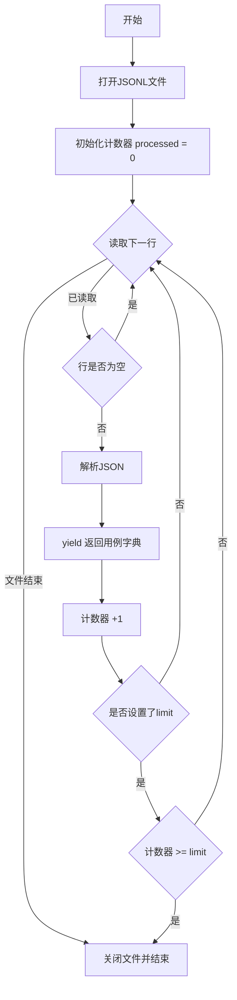

#### 带注释源码

```python
def collect_cases(jsonl_path: Path, limit: Optional[int]) -> Iterable[Dict]:
    """
    Yield cases from jsonl file respecting the optional limit.
    
    从JSONL文件中逐行读取并yield用例字典，可选地限制返回的用例数量。
    """
    # 已处理的用例计数
    processed = 0
    
    # 以UTF-8编码打开JSONL文件
    with jsonl_path.open("r", encoding="utf-8") as handle:
        # 遍历文件中的每一行
        for line in handle:
            # 去除首尾空白字符
            stripped = line.strip()
            
            # 跳过空行
            if not stripped:
                continue
            
            # 解析JSON字符串为字典并yield
            yield json.loads(stripped)
            
            # 已处理计数+1
            processed += 1
            
            # 如果设置了limit且已达到限制，则退出循环
            if limit is not None and processed >= limit:
                break
```


### `compute_summary`

该函数接收一个 `CaseResult` 对象列表，计算所有测试用例的汇总统计数据，包括总案例数、替换成功率、编译成功率、测试成功率，并按基准目录分组统计，最后返回包含各类统计指标的字典。

参数：

- `results`：`List[CaseResult]`，待汇总的案例结果列表

返回值：`Dict`，包含汇总统计数据的字典，包括总案例数、替换成功计数和比率、编译成功计数和比率、执行成功计数和比率、编译失败案例ID列表、执行失败案例ID列表、所有案例详情以及按基准目录分组的统计信息。

#### 流程图

```mermaid
flowchart TD
    A[开始 compute_summary] --> B[计算 total = len(results)]
    B --> C[统计 replacements 数量<br/>replacement_applied == True]
    C --> D[统计 build_success 数量<br/>build_status == succeeded]
    D --> E[统计 test_success 数量<br/>test_status == succeeded]
    E --> F[定义内部函数 frac(passed, denom)]
    F --> G[初始化 per_benchmark 字典]
    G --> H{遍历 results 中的每个案例 r}
    H -->|首次遇到基准| I[在 per_benchmark 中创建该基准的初始统计]
    H -->|非首次| J[获取该基准的现有统计]
    I --> K[更新该基准的 cases 计数]
    J --> K
    K --> L{r.replacement_applied?}
    L -->|是| M[replacements 计数 +1]
    L -->|否| N{r.build_status == succeeded?}
    M --> N
    N -->|是| O[build_success 计数 +1]
    N -->|否| P{r.test_status == succeeded?}
    O --> P
    P -->|是| Q[test_success 计数 +1]
    P -->|否| H
    Q --> H
    H -->|遍历完成| R[遍历 per_benchmark 的每个 stats]
    R --> S[计算 replacement_rate = frac(replacements, cases)]
    S --> T[计算 build_rate = frac(build_success, cases)]
    T --> U[计算 test_rate = frac(test_success, cases)]
    U --> V[构建最终 summary 字典]
    V --> W[包含 total_cases, replacement_success_count/rate,<br/>compilable_count/rate, executable_count/rate,<br/>compilation_failures, execution_failures,<br/>cases, by_benchmark]
    W --> X[返回 summary]
```

#### 带注释源码

```python
def compute_summary(results: List[CaseResult]) -> Dict:
    """Aggregate statistics over all case results."""
    # 统计总案例数
    total = len(results)
    # 统计成功应用替换的案例数
    replacements = sum(1 for r in results if r.replacement_applied)
    # 统计编译成功的案例数
    build_success = sum(1 for r in results if r.build_status == "succeeded")
    # 统计测试执行成功的案例数
    test_success = sum(1 for r in results if r.test_status == "succeeded")

    # 内部辅助函数：计算比率，处理除零情况
    def frac(passed: int, denom: int) -> float:
        return round(passed / denom, 4) if denom else 0.0

    # 按基准目录分组统计
    per_benchmark: Dict[str, Dict[str, float]] = {}
    for r in results:
        # 使用 benchmark_dir 作为键，获取或初始化统计对象
        stats = per_benchmark.setdefault(
            r.benchmark_dir,
            {
                "cases": 0,
                "replacements": 0,
                "build_success": 0,
                "test_success": 0,
            },
        )
        # 增加该基准的案例总数
        stats["cases"] += 1
        # 如果替换成功，增加替换计数
        if r.replacement_applied:
            stats["replacements"] += 1
        # 如果编译成功，增加编译成功计数
        if r.build_status == "succeeded":
            stats["build_success"] += 1
        # 如果测试成功，增加测试成功计数
        if r.test_status == "succeeded":
            stats["test_success"] += 1

    # 为每个基准计算各项比率
    for stats in per_benchmark.values():
        stats["replacement_rate"] = frac(stats["replacements"], stats["cases"])
        stats["build_rate"] = frac(stats["build_success"], stats["cases"])
        stats["test_rate"] = frac(stats["test_success"], stats["cases"])

    # 构建最终汇总字典
    summary = {
        "total_cases": total,
        "replacement_success_count": replacements,
        "replacement_success_rate": frac(replacements, total),
        "compilable_count": build_success,
        "compilable_rate": frac(build_success, total),
        "executable_count": test_success,
        "executable_rate": frac(test_success, total),
        # 收集编译失败的案例ID
        "compilation_failures": [
            r.case_id for r in results if r.build_status == "failed"
        ],
        # 收集执行失败的案例ID（编译成功但测试失败）
        "execution_failures": [
            r.case_id
            for r in results
            if r.build_status == "succeeded" and r.test_status == "failed"
        ],
        # 包含所有案例的详细结果
        "cases": [asdict(r) for r in results],
        # 按基准目录分组的统计信息
        "by_benchmark": per_benchmark,
    }
    return summary
```


### `write_summary`

该函数接收评估根目录、命令行参数、输入文件路径和汇总数据，生成包含详细统计信息的 JSON 报告和格式化的 Markdown 报告，并将它们写入指定的报告目录。

参数：

- `eval_root`：`Path`，项目根目录，用于构建报告文件的相对路径。
- `args`：`argparse.Namespace`，包含 `report_dir`（报告输出目录）和 `target`（构建目标）等配置的命令行参数对象。
- `jsonl_path`：`Path`，输入的 JSONL 测试用例文件路径，用于在报告标题中关联数据源。
- `summary`：`Dict`，包含聚合统计数据（如总数、成功率、失败案例列表、按基准分类的数据）的字典。

返回值：`Tuple[Path, Path]`，返回一个元组，包含生成的 JSON 报告文件路径和 Markdown 报告文件路径。

#### 流程图

```mermaid
graph TD
    A([Start write_summary]) --> B[确定报告输出目录 report_root]
    B --> C{report_root 是否存在}
    C -- 否 --> D[创建目录]
    C -- 是 --> E[生成时间戳和文件名]
    D --> E
    E --> F[写入 JSON 报告]
    F --> G[构建 Markdown 内容]
    G --> H[写入 Markdown 报告]
    H --> I([返回 (json_path, md_path)])
    
    subgraph 构建Markdown内容
    G --> G1[生成头部信息]
    G1 --> G2[构建基准数据表格]
    G2 --> G3[构建失败案例列表]
    end
```

#### 带注释源码

```python
def write_summary(
    eval_root: Path,
    args: argparse.Namespace,
    jsonl_path: Path,
    summary: Dict,
) -> Tuple[Path, Path]:
    """Write JSON and Markdown summary reports."""
    # 1. 确定报告根目录并创建（如果不存在）
    report_root = eval_root / args.report_dir
    report_root.mkdir(parents=True, exist_ok=True)

    # 2. 生成时间戳和基础文件名
    timestamp = datetime.now().strftime("%Y%m%d-%H%M%S")
    base_name = f"{jsonl_path.stem}-{args.target}"
    
    # 3. 构造完整的报告文件路径（JSON 和 Markdown）
    json_report = report_root / f"{base_name}-{timestamp}.json"
    markdown_report = report_root / f"{base_name}-{timestamp}.md"

    # 4. 写入 JSON 格式的汇总报告
    json_report.write_text(json.dumps(summary, indent=2), encoding="utf-8")

    # 5. 构建 Markdown 报告的表格部分（按基准分类统计）
    benchmark_lines = [
        "| Benchmark | Cases | Replacement% | Build% | Exec% |",
        "| --- | --- | --- | --- | --- |",
    ]
    for bench, stats in sorted(summary["by_benchmark"].items()):
        benchmark_lines.append(
            f"| {bench} | {stats['cases']} | "
            f"{stats['replacement_rate']*100:.2f}% | "
            f"{stats['build_rate']*100:.2f}% | "
            f"{stats['test_rate']*100:.2f}% |"
        )
    # 如果没有基准数据，添加空行占位符
    if len(benchmark_lines) == 2:
        benchmark_lines.append("| (none) | 0 | 0.00% | 0.00% | 0.00% |")

    # 6. 准备失败案例列表（如果为空则显示 'None'）
    compilation_items = summary["compilation_failures"] or ["None"]
    execution_items = summary["execution_failures"] or ["None"]

    # 获取 JSONL 文件的相对路径用于展示
    relative_jsonl = relative_to_repo(jsonl_path, eval_root)

    # 7. 组装 Markdown 报告的完整内容
    lines = [
        f"# Infer-Out Model 2 Evaluation ({base_name})",
        "",
        f"- Timestamp: {timestamp}",
        f"- Source JSONL: {relative_jsonl}",
        f"- Target: {args.target}",
        f"- Total cases: {summary['total_cases']}",
        f"- Replacement success: {summary['replacement_success_count']} "
        f"({summary['replacement_success_rate']*100:.2f}%)",
        f"- Compilable: {summary['compilable_count']} "
        f"({summary['compilable_rate']*100:.2f}%)",
        f"- Executable: {summary['executable_count']} "
        f"({summary['executable_rate']*100:.2f}%)",
        "",
        "## Benchmark Breakdown",
        *benchmark_lines,
        "",
        "## Compilation Failures",
    ]
    # 添加编译失败案例
    lines.extend(f"- {cid}" for cid in compilation_items)
    lines.append("")
    lines.append("## Execution Failures")
    # 添加执行失败案例
    lines.extend(f"- {cid}" for cid in execution_items)

    # 8. 写入 Markdown 报告
    markdown_report.write_text("\n".join(lines), encoding="utf-8")
    
    # 9. 返回生成的报告文件路径
    return json_report, markdown_report
```


### `main()`

主入口函数，负责解析命令行参数、初始化执行环境、调度案例处理（串行或并行）、收集结果并生成汇总报告。

参数：此函数无显式参数，通过调用 `parse_args()` 内部获取 `argparse.Namespace` 对象。

返回值：`int`，返回 0 表示执行成功，返回 1 表示因文件不存在等错误导致的提前终止。

#### 流程图

```mermaid
flowchart TD
    A([开始 main()]) --> B[args = parse_args()]
    B --> C[eval_root = 获取评估项目根目录]
    C --> D[repo_root = _get_bench_root]
    D --> E[jsonl_path = 解析输入的JSONL文件路径]
    E --> F{jsonl_path 是否存在?}
    F -- 否 --> G[打印错误信息]
    G --> H[return 1]
    F -- 是 --> I[cases = collect_cases 加载案例列表]
    I --> J{案例列表是否为空?}
    J -- 是 --> K[print 'No cases to process']
    K --> L[return 0]
    J -- 否 --> M[results 列表初始化]
    M --> N{args.jobs <= 1?}
    N -- 是 --> O[逐个处理案例: for loop]
    N -- 否 --> P[使用 ThreadPoolExecutor 并行处理]
    O --> Q[record_result 记录结果]
    P --> Q
    Q --> R[compute_summary 汇总统计]
    R --> S[write_summary 生成报告]
    S --> T[return 0]
    T --> U([结束])
```

#### 带注释源码

```python
def main() -> int:
    """
    主入口函数。
    流程：
    1. 解析命令行参数。
    2. 确定评估根目录和基准仓库根目录。
    3. 校验并加载 JSONL 输入文件。
    4. 加载待处理的案例集合。
    5. 根据并行度配置，串行或并行处理每个案例。
    6. 收集处理结果，计算汇总统计。
    7. 生成 JSON 和 Markdown 格式的汇总报告。
    """
    # 1. 解析命令行参数
    args = parse_args()
    
    # 2. 获取评估项目根目录 (脚本所在目录的父目录)
    eval_root = Path(__file__).resolve().parents[1]
    
    # 3. 获取基准仓库根目录 (支持 CLI 参数、环境变量或 config.env 配置)
    repo_root = _get_bench_root(args.bench_root)
    
    # 4. 处理输入的 JSONL 文件路径 (支持相对路径和绝对路径)
    jsonl_path = Path(args.jsonl)
    if not jsonl_path.is_absolute():
        jsonl_path = eval_root / jsonl_path

    # 5. 校验 JSONL 文件是否存在
    if not jsonl_path.exists():
        print(f"JSONL file '{jsonl_path}' not found.", file=sys.stderr)
        return 1

    # 6. 加载案例集合 (支持 limit 限制处理数量)
    cases = list(collect_cases(jsonl_path, args.limit))
    
    # 7. 如果没有案例，直接退出
    if not cases:
        print("No cases to process.")
        return 0

    # 8. 初始化结果列表，用于存储每个案例的处理结果
    results: List[Optional[CaseResult]] = [None] * len(cases)

    # 定义内部函数：记录单个案例的处理结果并打印状态摘要
    def record_result(idx: int, case_result: CaseResult) -> None:
        results[idx] = case_result
        # 根据是否成功应用替换生成状态描述
        status = (
            f"build={case_result.build_status}, test={case_result.test_status}"
            if case_result.replacement_applied
            else "replacement_failed"
        )
        print(f"[{idx + 1}] {case_result.case_id}: {status}")

    # 9. 根据 --jobs 参数决定是串行处理还是并行处理
    if args.jobs <= 1:
        # 串行处理模式
        for idx, case in enumerate(cases):
            case_result = process_case(case, args, repo_root, eval_root)
            record_result(idx, case_result)
    else:
        # 并行处理模式，使用 ThreadPoolExecutor
        with ThreadPoolExecutor(max_workers=args.jobs) as executor:
            # 提交所有案例处理任务，构建 future 到索引的映射
            future_to_idx = {
                executor.submit(process_case, case, args, repo_root, eval_root): idx
                for idx, case in enumerate(cases)
            }
            # 遍历已完成的任务 (无序完成)
            for future in as_completed(future_to_idx):
                idx = future_to_idx[future]
                try:
                    case_result = future.result()
                except Exception as exc:  # 防御性捕获，处理未预期的异常
                    case_result = init_case_result(cases[idx], repo_root)
                    case_result.errors.append(f"Unhandled exception: {exc}")
                record_result(idx, case_result)

    # 10. 过滤掉 None 值 (理论上不应该有，但确保类型安全)
    final_results = [res for res in results if res is not None]

    # 11. 计算汇总统计信息
    summary = compute_summary(final_results)
    
    # 12. 生成并写入汇总报告 (JSON 和 Markdown)
    json_report, markdown_report = write_summary(eval_root, args, jsonl_path, summary)
    
    # 13. 打印报告路径并返回成功状态
    print(f"Wrote summary reports:\n - {json_report}\n - {markdown_report}")
    return 0
```

## 关键组件


### 配置与环境加载模块

负责从config.env文件和环境变量中加载配置，特别是BENCH_REPO_ROOT路径的解析，支持CLI参数、环境变量和配置文件三种方式。

### 参数解析模块

使用argparse定义命令行参数，包括jsonl文件路径、bench-root、limit、target、report-dir、workspace-root、skip-clean、keep-workspaces、command-timeout和jobs等选项，用于控制评估流程的各项参数。

### 文本规范化与函数替换模块

canonicalize函数将文本中的Windows换行符转换为Unix换行符，确保匹配的可靠性；replace_function_body函数实现精确的函数体替换，支持多种空白符变体，尝试在源码中找到目标函数并用推断函数替换。

### 工作空间管理模块

prepare_workspace函数创建隔离的临时工作空间，复制必要的Makefile、common和target目录，并处理benchmark目录的复制同时排除评估产生的目录；ensure_case_output_dir创建每个用例的输出目录，处理路径冲突情况。

### 命令执行模块

run_command函数封装subprocess.run调用，捕获stdout和stderr，写入日志句柄，支持超时控制，处理TimeoutExpired异常并记录超时信息。

### 用例结果数据类

CaseResult dataclass存储单个用例的处理结果，包含case_id、source_path、benchmark_dir、output_dir、workspace_dir、artifact_dir、replacement_applied、build_status、test_status、notes、errors和log_files等字段。

### 用例处理核心模块

process_case函数是核心处理逻辑：验证源文件存在、创建输出目录、读取并替换函数体、准备工作空间、执行make clean/build/test、捕获结果和制品、清理临时文件，返回完整的CaseResult对象。

### 日志与制品写入模块

write_case_artifacts将case.json、modified_source.c、original_source.c、original_function.c和infer_function.c写入用例目录；snapshot_artifacts复制工作空间的benchmark目录到制品目录。

### 用例收集与汇总模块

collect_cases从JSONL文件逐行读取JSON对象，支持可选的limit限制；compute_summary统计替换成功率、编译成功率、测试成功率，按benchmark分组计算各项指标。

### 报告生成模块

write_summary生成JSON和Markdown格式的汇总报告，包含总体统计、benchmark分类统计、编译失败用例列表和执行失败用例列表。

### 并行处理模块

使用ThreadPoolExecutor实现多任务并行处理，支持通过--jobs参数控制并行度，按顺序记录结果并打印进度状态。

### 主入口函数

main函数协调整个评估流程：解析参数、加载用例、并行处理、汇总结果、生成报告，返回0表示成功，1表示失败。


## 问题及建议


### 已知问题

-   **异常处理过于宽泛**：在 `snapshot_artifacts`、`ensure_case_output_dir`、`process_case` 等多处使用裸的 `except Exception` 捕获异常，这会隐藏潜在的真实错误，难以定位问题根源。
-   **线程安全问题**：`process_case` 函数中的嵌套函数 `capture_artifacts` 使用 `nonlocal` 声明修改 `artifacts_captured` 标志，虽然在当前实现中每个 case 有独立的工作区，但在高并发场景下可能存在潜在的竞态条件。
-   **字符串匹配效率低下**：`replace_function_body` 函数使用简单的 `str.find()` 进行函数体替换，对于大型源文件和多行函数匹配效率较低，且仅尝试有限的候选格式，可能导致替换失败。
-   **硬编码的配置值**：超时默认值（20秒）、并行任务数默认值（96）、默认目标（host）等硬编码在 `parse_args` 中，缺乏灵活配置或从配置文件读取的机制。
-   **文件路径处理风险**：`prepare_workspace` 中直接使用 `shutil.copytree` 复制目录，如果目标路径存在且包含大量文件，`shutil.rmtree` 操作可能耗时较长且存在失败风险。
-   **日志管理不完善**：所有日志写入单个文件（`case.log`），没有按阶段分离日志，且 `run_command` 函数直接写入文件句柄，在高并发写入时可能导致日志混乱或丢失。
-   **资源清理可能失败**：`finally` 块中使用 `shutil.rmtree(workspace_case_root, ignore_errors=True)` 忽略错误，可能导致磁盘空间泄漏或状态残留，且没有任何重试机制。
-   **类型注解不完整**：部分函数如 `_load_config_env` 返回类型为 `dict` 而非 `Dict[str, str]`，`collect_cases` 生成的 `Dict` 缺少详细类型注解，影响代码可读性和静态分析。
-   **缺乏事务性操作**：整个 `process_case` 流程涉及多个文件系统操作（写入源文件、构建、测试、复制工件），如果中间步骤失败，可能留下不一致的中间状态。
-   **缺少重试机制**：网络或文件系统操作（如 `shutil.copy2`、构建命令）失败时没有重试逻辑，对于 transient 错误（如临时文件系统问题）处理不够健壮。

### 优化建议

-   **细化异常处理**：将宽泛的 `except Exception` 替换为具体的异常类型捕获（如 `OSError`、`subprocess.TimeoutExpired`），并为每种异常提供有意义的错误消息和恢复策略。
-   **增强并发安全性**：对共享资源（结果列表、日志文件）使用线程锁保护，或考虑使用 `multiprocessing` 替代 `ThreadPoolExecutor` 以避免 GIL 限制和潜在的线程安全问题。
-   **优化函数替换逻辑**：考虑使用 AST（抽象语法树）解析来精确识别和替换函数体，避免字符串匹配的局限性，同时提高匹配准确性。
-   **配置外部化**：将超时、并行数、默认目标等配置项移至配置文件（如 `config.env` 或专用 YAML/JSON 配置），并提供环境变量覆盖能力。
-   **改进日志系统**：使用 Python 的 `logging` 模块替代直接文件写入，支持按级别、时间、案例分离日志，并添加日志轮转（rotation）机制。
-   **完善资源清理**：实现更健壮的清理机制，包括清理状态跟踪、清理失败告警、以及可选的清理报告生成。
-   **补充类型注解**：完善所有函数和变量的类型注解，使用 `typing.Optional`、`typing.List` 等明确类型，配合 mypy 进行静态类型检查。
-   **实现事务性流程**：引入状态机管理案例处理流程，确保每个步骤的原子性，失败时能够回滚或清理已创建的资源。
-   **添加重试装饰器**：为关键的文件系统和命令执行操作添加重试机制，使用指数退避策略处理 transient 错误。
-   **增加监控指标**：在关键步骤添加耗时统计、内存使用、磁盘 I/O 等监控指标，便于性能分析和瓶颈定位。

## 其它


### 设计目标与约束

本代码的核心设计目标是在隔离环境中对基准测试代码进行函数替换评估，具体包括：1）通过JSONL文件批量处理评估案例；2）在临时工作区中执行构建和测试以避免污染原始代码库；3）支持并行处理以提升效率；4）生成结构化的日志和报告。约束条件包括：依赖外部Makefile构建系统、需要预先配置BENCH_REPO_ROOT环境变量或配置文件、假设基准测试遵循特定的目录结构（Makefile、common、target目录）、以及要求JSONL输入文件遵循特定的 schema 格式。

### 错误处理与异常设计

代码采用分层错误处理策略。在process_case函数中，使用try-except块捕获文件操作、目录创建等可能的异常，并将其记录到CaseResult的errors列表中而非立即终止程序。run_command函数通过捕获subprocess.TimeoutExpired异常处理超时情况，返回None表示超时。对于关键操作（如替换函数体），如果失败则设置相应的状态标志并记录错误信息，最终通过CaseResult的build_status和test_status字段反映整体执行结果。主要异常类型包括：文件不存在异常、替换文本未找到异常、构建失败异常、测试执行异常、以及超时异常。

### 数据流与状态机

数据流遵循以下顺序：首先从JSONL文件读取案例（collect_cases），然后对每个案例执行处理流程（process_case），最后汇总结果并生成报告（compute_summary和write_summary）。每个案例的处理状态机包括：初始化状态（init_case_result）→ 源码读取状态 → 函数替换状态 → 工作区准备状态 → 构建状态（make clean → make build）→ 测试状态（make test）→ 工件快照状态 → 清理状态。CaseResult中的replacement_applied、build_status和test_status字段记录了状态转换结果。

### 外部依赖与接口契约

本代码依赖以下外部组件：1）Python标准库（argparse、json、os、re、shutil、subprocess、pathlib等）；2）concurrent.futures用于并行执行；3）外部Makefile构建系统（需支持TARGET、clean、build、test目标）；4）文件系统（用于配置读取和工作区管理）。输入接口契约要求JSONL文件每行包含：source.path（源文件路径）、source.function_name（函数名）、source.content（原始函数内容）、pseudo.address（伪地址）、pseudo.path（伪路径）、pseudo.content-fix（替换后的函数内容）。输出接口包括：case.json（案例元数据）、modified_source.c（修改后的源码）、original_source.c（原始源码）、original_function.c（原始函数）、infer_function.c（推断函数）、case.log（执行日志）、artifacts/（构建产物目录）。

### 安全性考虑

代码在安全性方面存在以下考量：1）使用shutil.rmtree清理工作区时使用了ignore_errors=True以防止清理失败导致程序异常；2）通过Path.resolve()处理路径以防止符号链接攻击；3）workspace目录与原始代码库分离，避免对源仓库的直接修改；4）文件写入使用utf-8编码指定；5）subprocess.run使用errors="replace"处理编码问题。潜在风险包括：如果攻击者控制JSONL输入，可能通过构造恶意路径导致目录遍历；make命令的执行未做沙箱隔离。

### 性能考虑

性能优化方面包括：1）支持通过--jobs参数进行并行处理（ThreadPoolExecutor）；2）工作区目录按需创建，避免预先创建大量目录；3）使用shutil.copytree的ignore参数跳过不必要的文件（.infer_eval后缀的目录）；4）collect_cases使用生成器模式避免一次性加载整个JSONL文件到内存。性能瓶颈可能出现在：大量案例串行处理时的工作区初始化开销、make构建的I/O操作、以及日志写入的同步开销。

### 并发模型

代码采用ThreadPoolExecutor实现多案例并行处理。在main函数中，根据args.jobs参数决定是串行还是并行执行。并行模式下，使用future_to_idx字典映射future到案例索引，通过as_completed遍历完成的任务。每个process_case执行过程中，其内部操作（构建、测试）是串行的，但多个案例可以并行处理。注意：由于共享repo_root和eval_root，需要确保对同一源码文件的并发修改不会冲突（通过每个案例使用独立的工作区避免）。

### 资源管理

资源管理策略包括：1）临时工作区通过--keep-workspaces参数控制是否保留，默认在处理完成后删除；2）使用shutil.rmtree配合ignore_errors确保清理操作不会因权限问题失败；3）命令执行超时通过command_timeout参数控制，默认20秒；4）日志文件在每个案例结束时写入case.log；5）大量案例可通过--limit参数限制处理数量。资源清理发生在finally块中，确保即使发生异常也能清理工作区。

### 日志规范

日志规范遵循以下模式：1）日志文件命名为case.log，存放在每个案例的输出目录中；2）日志包含执行步骤标记（如[clean]、[build]、[test]）；3）每个步骤记录完整的命令内容、输出内容、以及退出码；4）超时情况会记录超时时间和终止信息；5）汇总报告生成JSON和Markdown两种格式，包含案例处理状态、构建成功率、测试成功率等统计信息；6）控制台输出使用简化的格式（[序号] case_id: status）。

### 测试策略

代码本身作为测试框架，其测试策略体现在：1）通过CaseResult的结构化结果记录每个案例的替换、构建、测试状态；2）compute_summary函数汇总所有案例的统计信息；3）Markdown报告提供可视化的成功率和失败案例列表；4）通过--limit参数支持小规模验证；5）--skip-clean参数支持在迭代过程中跳过耗时的清理步骤；6）日志文件完整记录了构建和测试的输出，便于调试失败原因。

### 兼容性考虑

兼容性方面：1）代码使用Python 3语法（from __future__ import annotations）；2）支持Python 3.9+（使用str | None类型提示语法需要3.10+，但实际代码使用了cli_value: str | None = None这种现代语法）；3）路径处理使用pathlib.Path，兼容Windows、Linux、macOS；4）subprocess调用使用text=True和encoding="utf-8"，确保跨平台文本处理一致；5）Makefile目标（TARGET=、clean、build、test）需要与基准测试项目的构建系统兼容。当前Python版本要求至少3.10以支持str | None联合类型语法。

### 配置管理

配置管理通过以下方式实现：1）命令行参数通过argparse解析（--bench-root、--limit、--target、--report-dir、--workspace-root、--skip-clean、--keep-workspaces、--command-timeout、--jobs）；2）环境变量BENCH_REPO_ROOT支持动态指定基准仓库路径；3）config.env文件支持持久化配置（通过_load_config_env函数读取）；4）配置优先级为：CLI参数 > 环境变量 > 配置文件。配置相关函数包括_get_bench_root和_load_config_env。

### 部署模型

部署模型为独立命令行工具，无需安装直接执行。典型部署步骤包括：1）确保Python 3.10+环境可用；2）配置config.env或设置BENCH_REPO_ROOT环境变量；3）准备包含评估案例的JSONL文件；4）运行脚本并指定JSONL路径和所需参数。输出产物包括：按案例组织的输出目录（包含日志和工件）、以及汇总报告（JSON和Markdown格式）存放在reports/infer_out_eval目录下。

### 扩展性考虑

扩展性设计包括：1）CaseResult作为数据类，便于添加新字段；2）process_case函数结构清晰，可容易地添加新的处理步骤（如静态分析、代码覆盖率收集）；3）通过ThreadPoolExecutor支持增加并行度；4）报告生成逻辑封装在write_summary中，可扩展支持其他格式（如HTML、XML）；5）函数替换逻辑replace_function_body支持多种匹配候选（原始、去掉尾部空白、带strip的版本），便于处理不同的代码格式变体。潜在扩展方向包括：支持更多的构建系统（CMake、ninja）、支持远程执行、集成CI/CD流水线。


    