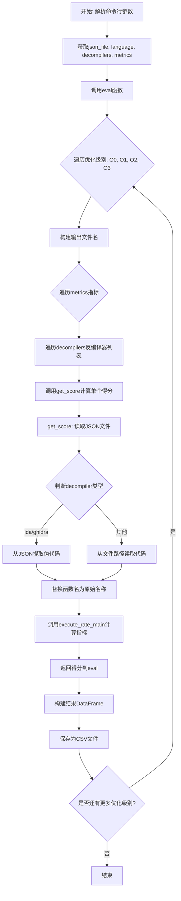
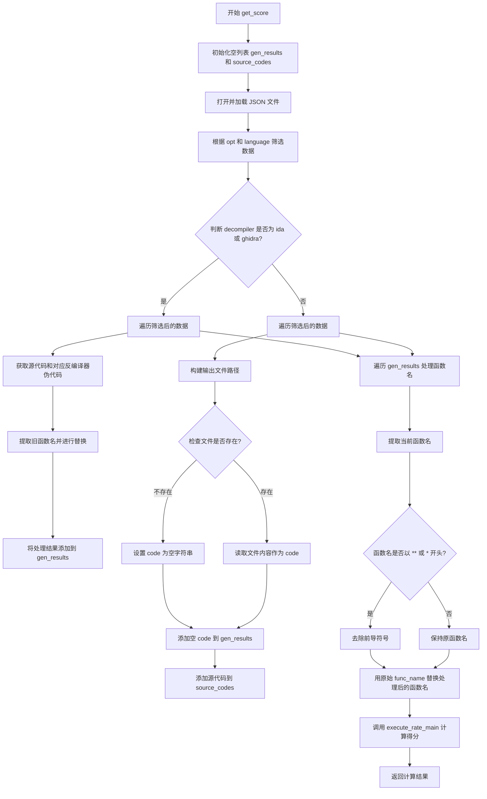
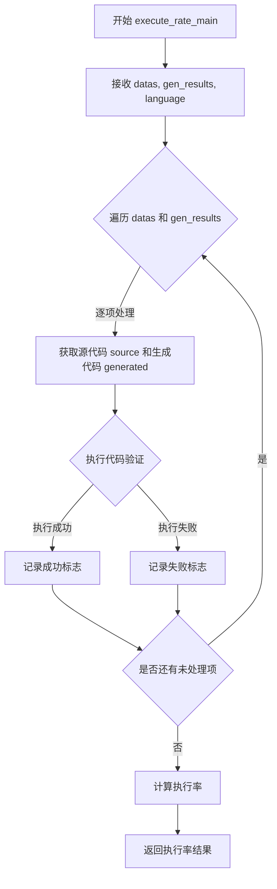

# `LLM4Decompile\sk2decompile\evaluation\evaluate_exe.py` 详细设计文档

一个反编译器输出质量评估工具，通过读取包含源代码和反编译伪代码的JSON文件，针对不同优化级别(O0-O3)和多种指标，计算各反编译器的得分，并输出CSV格式的评估结果。

## 整体流程



## 类结构

```
无类定义 (过程式编程)
```

## 全局变量及字段


### `current_dir`
    
当前脚本所在目录的绝对路径

类型：`str`
    


    

## 全局函数及方法


### `get_score`

该函数是计算单个指标得分的核心函数，负责读取反编译器生成的伪代码或源代码，处理函数名称替换，并调用指标计算模块获得评分结果。

参数：

- `metric`：`str`，要计算的指标名称（如 'exe_rate' 表示执行率）
- `json_file`：`str`，包含测试数据和反编译器输出的 JSON 文件路径
- `opt`：`str`，编译优化级别（如 'O0', 'O1', 'O2', 'O3'）
- `decompiler`：`str`，反编译器名称（如 'ida', 'ghidra' 或其他模型输出名称）
- `language`：`str`，编程语言类型（如 'c'）

返回值：`any`，返回 `execute_rate_main` 函数的计算结果，通常为指标得分或评分对象

#### 流程图



#### 带注释源码

```python
def get_score(metric, json_file, opt, decompiler, language):
    """
    计算单个指标得分的主函数
    
    参数:
        metric: str, 要计算的指标名称
        json_file: str, 包含测试数据的JSON文件路径
        opt: str, 编译优化级别
        decompiler: str, 反编译器名称
        language: str, 编程语言
    
    返回:
        执行率计算结果
    """
    # 初始化存储生成结果和源代码的列表
    gen_results = []
    source_codes = []
    
    # 打开并读取JSON数据文件
    with open(json_file) as f:
        json_obj = json.load(f)
        # 根据优化级别和语言筛选符合条件的测试数据
        datas = [data for data in json_obj if data['opt'] == opt and data['language'] == language]
        
        # 判断是否为IDA或Ghidra反编译器（它们的结果直接存储在JSON中）
        if decompiler in ['ida','ghidra']:
            # 遍历筛选后的数据
            for data in datas:
                # 添加源代码到列表
                source_codes.append(data['func'])
                # 获取对应反编译器的伪代码
                gen_result = data[f'{decompiler}_pseudo']
                # 提取旧函数名（取第一个括号前的最后一个空格分隔的词）
                old_name = gen_result.split('(')[0].split(' ')[-1]
                # 将旧函数名替换为原始函数名
                gen_result = gen_result.replace(old_name, data['func_name'])
                # 将处理后的伪代码添加到结果列表
                gen_results.append(gen_result)  
        else:
            # 其他反编译器需要从文件系统读取输出文件
            for data in datas:
                # 构建输出文件名：索引_优化级别
                fileName = str(data['index']) + '_' + opt
                # 从JSON文件路径提取名称
                jsonName = json_file.split('/')[-1].replace('.json','')
                # 拼接完整的输出文件路径
                filePath = f'./model_outputs/{jsonName}/{decompiler}/{opt}/{fileName}.{data["language"]}'
                # 检查文件是否存在
                if not os.path.exists(filePath):
                    code = ''  # 文件不存在时设为空字符串
                else:
                    # 读取生成代码文件内容
                    with open(filePath) as file:
                        code = file.read()
                # 添加代码到结果列表
                gen_results.append(code)
                # 添加源代码到列表
                source_codes.append(data['func'])     

    # 遍历所有生成结果，处理函数名
    for idx in range(len(gen_results)):
        one = gen_results[idx]
        # 提取函数名：取第一个括号前最后一个空格分隔的词
        func_name = one.split('(')[0].split(' ')[-1].strip()
        # 处理函数名中的星号（处理C/C++指针返回类型等特殊情况）
        if func_name.strip() and func_name[0:2] == '**':
            func_name = func_name[2:]
        elif func_name.strip() and func_name[0] == '*':
            func_name = func_name[1:]
        
        # 用测试数据中的原始函数名替换处理后的函数名
        one = one.replace(func_name, datas[idx]["func_name"])
        gen_results[idx] = one
    else:
        # 调用执行率计算函数，传入原始数据、生成结果和语言
        return execute_rate_main(datas, gen_results, language=language)
```

#### 技术债务与优化空间

1. **文件句柄泄漏风险**：在读取模型输出文件时，内层 `with open(filePath)` 语句未在 `else` 分支的 `if` 条件中使用，可能导致文件句柄未正确关闭
2. **异常处理缺失**：缺少对 JSON 文件格式错误、文件读取失败等情况的异常捕获机制
3. **硬编码路径问题**：文件路径 `./model_outputs/` 硬编码，缺乏灵活配置
4. **逻辑分支冗余**：`for...else` 结构的使用场景不当，`else` 块会无条件执行，可简化逻辑
5. **重复代码片段**：`source_codes.append(data['func'])` 在两个分支中重复出现，可提取到循环外部


### `eval`

评估主函数，遍历所有优化级别（O0、O1、O2、O3）和指标，为每个优化级别计算各反编译器的分数，并将结果保存为CSV文件。

参数：

- `json_file`：`str`，JSON数据文件的路径，包含待评估的函数数据
- `lan`：`str`，目标编程语言（如'c'）
- `decompilers`：`list[str]`，反编译器名称列表，如['ida', 'ghidra']
- `metrics`：`list[str]`，评估指标列表，如['exe_rate']

返回值：`None`，无返回值，结果直接写入CSV文件

#### 流程图

```mermaid
flowchart TD
    A[开始 eval 函数] --> B[定义优化级别列表: O0, O1, O2, O3]
    B --> C[外层循环: 遍历每个优化级别 opt]
    C --> D[构建输出文件名: {json文件名}_{语言}_{优化级别}.csv]
    D --> E[内层循环: 遍历每个指标 metric]
    E --> F[对每个反编译器调用 get_score 计算分数]
    F --> G[收集所有反编译器的分数到 scores 列表]
    G --> E
    E --> H[将结果存入 result 字典]
    C --> I[使用 pandas 创建 DataFrame]
    I --> J[保存为 CSV 文件到 results 目录]
    J --> C
    C --> K[结束]
```

#### 带注释源码

```python
def eval(json_file, lan, decompilers, metrics):
    """
    评估主函数，遍历所有优化级别和指标，输出结果到CSV文件
    
    参数:
        json_file: JSON数据文件路径
        lan: 目标编程语言
        decompilers: 反编译器列表
        metrics: 评估指标列表
    """
    # 定义要评估的编译器优化级别
    optimal_level = ['O0', 'O1', 'O2', 'O3']
    
    # 遍历每个优化级别
    for opt in optimal_level:
        # 初始化结果字典，包含反编译器名称
        result = {'decompiler': decompilers}
        
        # 构建输出文件名：原始json文件名_语言_优化级别.csv
        output_name = json_file.split('/')[-1].split('.')[0] + '_' + lan + '_' + opt + '.csv'
        
        # 遍历每个评估指标
        for metric in metrics:
            # 为每个反编译器计算当前指标的分数
            # 使用列表推导式并行计算所有反编译器的分数
            scores = [get_score(metric, json_file, opt, decompiler, lan) for decompiler in decompilers]
            # 将分数存入结果字典，键为指标名
            result[metric] = scores
        
        # 使用pandas创建数据框
        df = pd.DataFrame(result)
        
        # 将结果保存为CSV文件到results目录
        df.to_csv(f'{current_dir}/results/{output_name}', index = False)
```

---

### 关键组件信息

| 组件名称 | 描述 |
|---------|------|
| `get_score` | 核心评分函数，根据指标、反编译器和优化级别计算分数 |
| `execute_rate_main` | 从metrics模块导入的执行率计算主函数 |
| `optimal_level` | 优化级别列表['O0', 'O1', 'O2', 'O3'] |
| `current_dir` | 当前脚本所在目录路径 |

---

### 潜在的技术债务或优化空间

1. **硬编码路径问题**：结果保存路径使用f-string拼接，建议使用`os.path.join()`以提高跨平台兼容性
2. **异常处理缺失**：`eval`函数未对文件读写操作进行异常捕获，可能导致程序崩溃
3. **重复文件解析**：每次调用`get_score`都会重新打开和解析JSON文件，应在函数外部加载一次
4. **并行化机会**：各反编译器的分数计算相互独立，可使用多进程/多线程加速
5. **魔法字符串**：优化级别列表和输出目录名称应定义为常量
6. **命令行参数验证**：缺少对输入参数的有效性校验

---

### 其它项目

#### 设计目标与约束
- 支持多种反编译器的横向对比评估
- 支持多种评估指标扩展
- 输出格式统一为CSV便于后续分析

#### 错误处理与异常设计
- 当前版本无异常处理机制
- 建议添加：JSON文件不存在、results目录不存在、文件读写权限等异常捕获

#### 数据流与状态机
- 输入：JSON数据文件 → 解析提取特定优化级别和语言的数据 → 调用get_score计算分数 → 聚合为DataFrame → 输出CSV
- 状态流转：初始化 → 遍历优化级别 → 遍历指标 → 计算分数 → 保存结果

#### 外部依赖与接口契约
- 依赖`pandas`库进行数据封装和CSV输出
- 依赖`metrics.cal_execute_rate.execute_rate_main`函数进行指标计算
- `get_score`函数约定返回浮点数分数值


### `execute_rate_main`

该函数是用于评估代码执行率的评估指标函数，从 `metrics.cal_execute_rate` 模块导入，通过比较源代码与反编译器/模型生成的伪代码或源代码，计算生成代码的正确性和可执行性评分。

参数：

- `datas`：`list`，原始源代码数据列表，每个元素包含源代码、功能名称等信息
- `gen_results`：`list`，模型或反编译器生成的代码结果列表，与 `datas` 一一对应
- `language`：`str`，编程语言类型（如 'c'、'python' 等），用于指定评估的语言上下文

返回值：`float` 或 `dict`，执行率评估分数，通常为 0-1 之间的浮点数或包含详细指标的字典

#### 流程图



#### 带注释源码

```python
# 注：由于 execute_rate_main 函数的源码在 metrics.cal_execute_rate 模块中，
# 以下是基于其在代码中的使用方式推断的函数签名和预期功能：

def execute_rate_main(datas, gen_results, language='c'):
    """
    执行率评估主函数
    
    参数:
        datas: 原始代码数据列表，每个元素应为包含 'func', 'func_name' 等字段的字典
        gen_results: 生成的代码列表，与 datas 顺序对应
        language: 编程语言类型，默认为 'c'
    
    返回值:
        执行率评分，类型为 float (0-1) 或包含详细指标的 dict
    """
    
    # 1. 初始化统计变量
    # total_count = len(datas)
    # success_count = 0
    
    # 2. 遍历每对源代码和生成代码
    # for source, generated in zip(datas, gen_results):
    #     # 3. 尝试执行或编译生成代码
    #     # success = validate_code(source, generated, language)
    #     # if success:
    #     #     success_count += 1
    
    # 4. 计算执行率
    # execute_rate = success_count / total_count if total_count > 0 else 0
    
    # 5. 返回结果
    # return execute_rate
    
    pass  # 实际实现位于 metrics.cal_execute_rate 模块
```

> **注意**：由于 `execute_rate_main` 函数的实际源代码位于 `metrics.cal_execute_rate` 模块中，而该模块的具体实现未在当前代码文件中提供，以上信息基于函数调用上下文推断得出。如需完整的函数实现详情，请参考 `metrics/cal_execute_rate.py` 源文件。

## 关键组件


### JSON数据加载与过滤

从JSON文件中加载数据，并根据优化级别(opt)和编程语言(language)进行过滤

### 反编译结果获取

根据反编译器类型(IDA/Ghidra或其他)获取对应的伪代码或源代码，支持从文件系统中读取或从JSON对象中直接提取

### 函数名标准化

对反编译结果中的函数名进行规范化处理，移除特殊字符(如*、**)，并替换为原始函数名

### 指标计算

调用metrics.cal_execute_rate模块的execute_rate_main函数，计算源代码与反编译结果之间的执行率指标

### 批量评估流程

对多个优化级别(O0-O3)循环执行评估，收集不同反编译器和指标的结果

### CSV结果导出

将评估结果整理为DataFrame并保存为CSV文件，包含反编译器名称和各指标分数

### 命令行参数解析

使用argparse解析JSON文件路径、语言类型、反编译器列表和指标列表等命令行参数


## 问题及建议


### 已知问题

- **JSON文件重复读取**：在`eval`函数中，每次循环`opt`都会调用`get_score`，而`get_score`内部每次都重新打开并解析整个JSON文件，导致同一文件被读取多次（`optimal_level`有4个级别），应在外层缓存JSON数据
- **硬编码反编译器类型**：代码中直接判断`if decompiler in ['ida','ghidra']`，这种硬编码方式导致扩展困难，新增反编译器需要修改源码
- **路径拼接不规范**：使用字符串拼接如`f'./model_outputs/...'`和`f'{current_dir}/results/...'`，应使用`os.path.join()`以保证跨平台兼容性
- **异常处理缺失**：文件读取（`open()`）、JSON解析（`json.load()`）、CSV写入（`df.to_csv()`）均无try-except保护，文件不存在或格式错误时程序会直接崩溃
- **函数职责过重**：`get_score`函数同时负责数据加载、过滤、反编译结果获取、函数名替换、指标计算等多个职责，单个函数超过80行代码
- **循环与else误用**：第49-60行的`for...else`结构使用不当，else分支的return语句使其失去实际意义，且该else与外层if-else混用导致逻辑混乱
- **变量命名不规范**：使用`datas`（复数形式）作为列表变量名，应为`data_list`或`records`；`gen_results`和`source_codes`等缩写降低可读性
- **命令行参数无验证**：未对`args.json_file`路径是否存在、`args.language`是否为有效值、`args.decompilers`列表是否为空等进行校验
- **magic string/magic number**：结果目录`results/`、模型输出目录`model_outputs/`、优化级别列表`['O0', 'O1', 'O2', 'O3']`等应提取为配置常量
- **函数名替换逻辑脆弱**：依赖空格分割和特殊字符判断（`func_name[0:2] == '**'`），若反编译器输出格式变化则可能失效

### 优化建议

- **提取配置常量**：将反编译器列表、优化级别、目录路径等抽取为模块级常量或配置文件
- **重构函数职责**：将`get_score`拆分为`load_json_data()`、`get_decompiler_output()`、`normalize_function_name()`等独立函数
- **添加异常处理**：使用try-except包装所有文件I/O操作，提供有意义的错误信息
- **缓存JSON数据**：在`eval`函数开头加载一次JSON，在循环中复用
- **使用pathlib**：用`Path`对象替代字符串拼接路径，提升可读性和跨平台性
- **添加参数验证**：使用argparse的`choices`参数限制合法值，如`choices=['c', 'python']`
- **增加日志记录**：使用`logging`模块替代print，区分DEBUG/INFO/WARNING/ERROR级别
- **添加类型注解**：为函数参数和返回值添加类型提示，提升代码可维护性

## 其它


### 设计目标与约束

该代码旨在构建一个自动化评估框架，用于比较不同反编译器（IDA、Ghidra以及基于GPT的模型等）在不同优化级别（O0-O3）下的输出质量。核心目标是通过执行率（exe_rate）等指标量化反编译结果的准确性和可用性。设计约束包括：支持多语言（当前主要支持C语言）、支持多个反编译器同时评估、输出结果统一为CSV格式便于后续分析。性能约束方面，需要处理大量JSON数据和文件I/O操作，期望在合理时间内完成评估。

### 错误处理与异常设计

代码在文件读取环节存在一定的错误处理：当指定路径的文件不存在时，会设置code为空字符串。但整体错误处理机制较为薄弱，缺乏对以下场景的防护：JSON文件格式错误导致json.load()失败、CSV写入失败、metrics模块导入失败或execute_rate_main函数执行异常、命令行参数格式错误、目录权限问题导致结果无法保存等。建议增加try-except块捕获关键异常、输出有意义的错误信息、设置合理的默认值或回退机制，以及添加日志记录以便问题追踪。

### 数据流与状态机

数据流从JSON输入文件开始，经过筛选、转换、反编译器输出获取、函数名替换等处理，最终输出CSV报告。核心状态转换包括：主流程从eval函数遍历四个优化级别，对每个优化级别遍历所有反编译器并调用get_score获取各指标分数，get_score内部根据decompiler类型决定处理逻辑（对于IDA/Ghidra从JSON直接提取，对于其他模型从文件系统读取伪代码）。数据流动过程中保持了source_codes与gen_results的一一对应关系，确保评估的准确性。

### 外部依赖与接口契约

代码依赖以下外部组件：Python标准库（os、json、subprocess、argparse）、pandas用于数据表格化输出、metrics.cal_execute_rate模块的execute_rate_main函数。execute_rate_main的接口契约为接收datas（原始函数列表）、gen_results（生成的伪代码列表）、language参数，返回评估分数。输入JSON文件格式需包含opt、language、func、func_name、以及各decompiler的pseudo字段。输出CSV文件采用特定命名格式：{原始文件名}_{语言}_{优化级别}.csv。

### 性能考虑与优化空间

当前实现存在以下性能瓶颈：文件逐个打开读取（当反编译器数量多时I/O频繁）、每个metric都重新遍历全部数据进行get_score调用（存在重复计算）、decompilers列表遍历顺序可能导致文件重复打开关闭。优化方向包括：批量文件读取并缓存结果、预先过滤数据减少重复筛选、考虑使用生成器处理大数据集、并行化处理多个反编译器的评估任务（使用multiprocessing或concurrent.futures）。当前代码在处理大规模数据集时可能面临内存压力，特别是gen_results和source_codes列表可能占用大量内存。

### 安全性考虑

代码存在以下安全隐患：直接使用字符串格式化构建文件路径（存在路径注入风险，虽然当前场景风险较低），未对命令行输入进行严格验证（decompilers和metrics参数未做白名单检查），文件操作缺乏权限验证。建议对用户输入的json_file路径进行规范化处理、添加路径遍历检测、对反编译器和指标名称进行白名单验证、避免使用shell=True执行subprocess（当前代码未使用但import了subprocess模块）。

### 配置管理

当前配置通过命令行参数传入，缺少独立的配置文件管理。decompilers列表和metrics列表通过逗号分隔的字符串传递，这种方式在列表元素包含逗号时会出错。优化级别（O0-O3）硬编码在optimal_level列表中，扩展性受限。建议引入配置文件（如YAML或JSON）管理默认参数、优化级别列表、可用的反编译器和指标，使代码更易于维护和扩展。

### 测试策略

当前代码缺乏单元测试和集成测试。测试策略应包括：单元测试覆盖get_score函数的各个分支（IDA/Ghidra分支 vs 其他decompiler分支、文件存在/不存在场景、函数名替换逻辑），测试eval函数对不同参数组合的输出，测试JSON格式兼容性（缺失字段、类型错误等），mock execute_rate_main函数进行隔离测试，集成测试验证完整的评估流程和CSV输出正确性。

### 部署与运行环境要求

代码运行需要Python 3.x环境，安装依赖包pandas。输入数据需要预先准备：符合格式要求的JSON文件、反编译器输出文件（对于非IDA/Ghidra的反编译器需要放在model_outputs目录下）。输出结果自动保存在results子目录，需要确保该目录存在或具有创建权限。代码设计为命令行工具运行，支持定时任务或CI/CD流程集成。

    