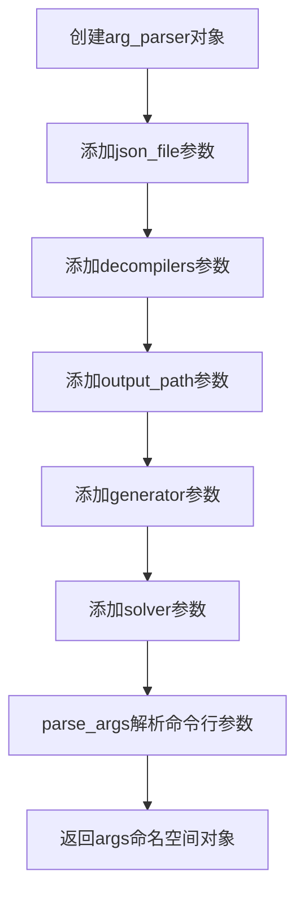
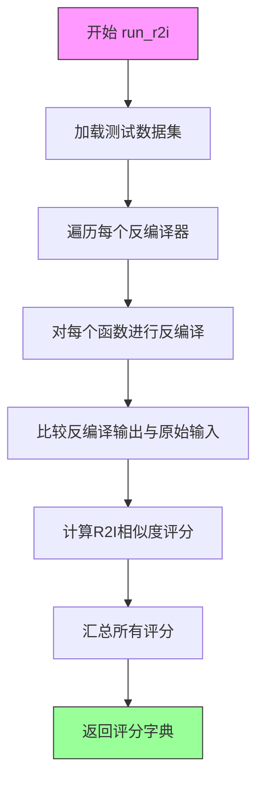
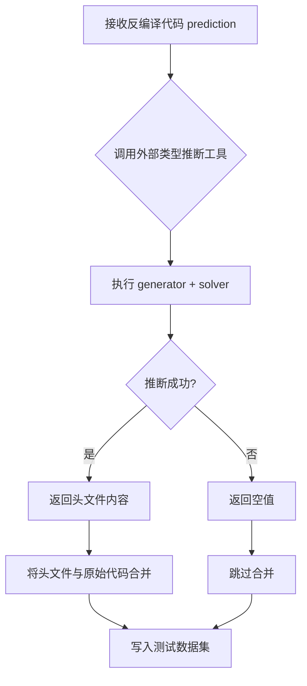
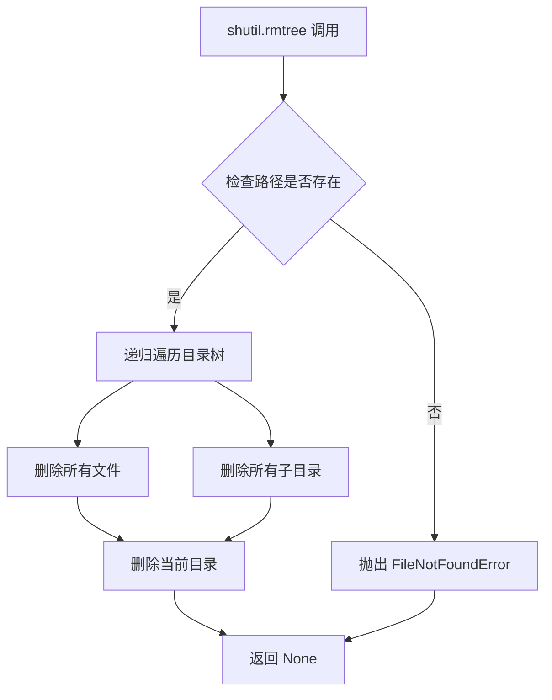
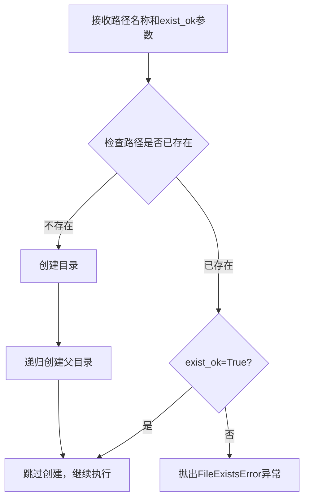
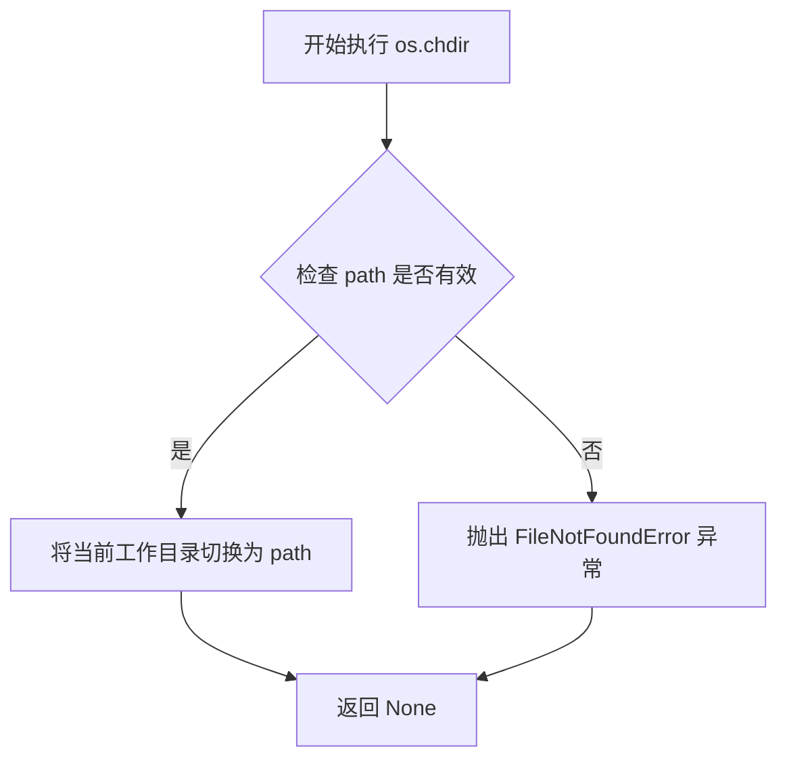
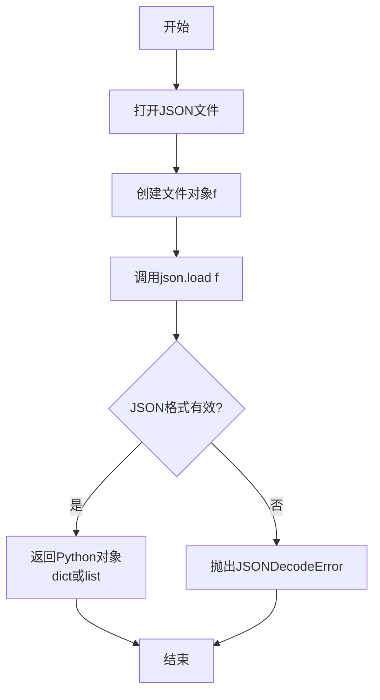
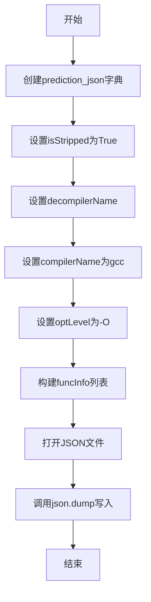

# `LLM4Decompile\sk2decompile\evaluation\evaluate_r2i.py` 详细设计文档

该代码是一个R2I（反编译到中间表示）评估框架的主程序，用于对多个反编译器的输出结果进行标准化处理和评分。它读取反编译预测结果，处理函数名和类型信息，组织成统一的目录结构，然后调用R2I指标计算模块进行评估，并输出各优化级别下的评分结果。

## 整体流程

```mermaid
graph TD
    A[开始] --> B[解析命令行参数]
    B --> C[加载JSON数据集并筛选C语言数据]
    C --> D[清理并创建反编译器目录结构]
    D --> E{遍历优化级别: O0, O1, O2, O3}
    E --> F{遍历数据集}
    F --> G{检查预测文件是否存在}
    G -- 否 --> H[prediction设为空字符串]
    G -- 是 --> I[读取并处理预测代码]
    H --> J[处理函数名]
    I --> J
    J --> K{检查头文件是否存在]
    K -- 是 --> L[读取头文件]
    K -- 否 --> M[调用process_one生成头文件]
    L --> N[合并头文件和预测代码]
    M --> N
    N --> O[构建prediction_json]
    O --> P[保存.c .json和syntax_correction文件]
    P --> Q{数据集遍历完成?}
    Q -- 否 --> F
    Q -- 是 --> R[调用run_r2i计算R2I分数]
    R --> S[保存结果到输出文件]
    S --> T{优化级别遍历完成?]
    T -- 否 --> E
    T -- 是 --> U[结束]
```

## 类结构

```
该脚本为单文件程序，无类定义
主要逻辑分为以下几个部分:
├── 参数解析模块
├── 数据加载与筛选模块
├── 目录创建模块
├── 数据处理循环模块
└── 结果输出模块
```

## 全局变量及字段


### `args`
    
命令行参数对象，包含json_file、decompilers、output_path、generator和solver等配置

类型：`argparse.Namespace`
    


### `decompilers`
    
反编译器名称列表，通过逗号分隔的命令行参数解析得到

类型：`List[str]`
    


### `dataset`
    
数据集名称，从JSON文件路径中提取的文件名（不含.json后缀）

类型：`str`
    


### `datas`
    
加载的JSON数据列表，经过筛选只保留language为'c'的数据项

类型：`List[Dict]`
    


### `opts`
    
优化级别列表，包含O0、O1、O2、O3四个编译器优化选项

类型：`List[str]`
    


### `names`
    
当前优化级别下的函数名列表，用于R2I指标计算

类型：`List[str]`
    


### `i`
    
文件索引计数器，用于为每个处理的函数生成唯一的输出文件编号

类型：`int`
    


### `func_name`
    
当前处理的函数名，从数据集中提取的待反编译函数名称

类型：`str`
    


### `index`
    
当前数据的索引，用于构建文件路径和关联原始数据

类型：`int`
    


### `prediction`
    
反编译预测代码，从模型输出文件中读取的反编译结果

类型：`str`
    


### `old_name`
    
原始函数名，从反编译预测代码中提取的旧函数名（去除修饰后）

类型：`str`
    


### `header`
    
生成或读取的头文件内容，包含函数声明信息

类型：`str`
    


### `prediction_json`
    
用于R2I评估的JSON结构，包含isStripped、decompilerName等元数据

类型：`Dict`
    


### `scores`
    
R2I评分结果字典，键为函数名，值为评分（0-1之间）

类型：`Dict[str, float]`
    


### `current_dir`
    
当前工作目录，用于在计算完成后恢复原始路径

类型：`str`
    


    

## 全局函数及方法


### `arg_parser`

该代码片段定义了一个命令行参数解析器对象`arg_parser`，用于配置R2I（Return-to-Input）指标评估任务的各种输入参数，包括JSON数据文件路径、反编译器列表、输出路径、生成器和求解器路径等。

参数：
- 该对象本身无直接调用参数，但其通过`add_argument()`添加了以下命令行参数：
  - `json_file`：`str`，输入的JSON数据文件路径，默认为`'./data/humaneval_normsrcpseudo.json'`
  - `decompilers`：`str`，逗号分隔的反编译器名称列表，默认为`'gpt-5-mini-name7,idioms,lmdc6.7,pseudo2norm_RLFinal+norm2codeFinal-Debug-11000'`
  - `output_path`：`str`，结果输出目录路径，默认为`'./result/humaneval_normsrcpseudo'`
  - `generator`：`str`，生成器可执行文件路径，默认为`'./psychec/psychecgen'`
  - `solver`：`str`，求解器名称（用于`stack exec …`），默认为`'./psychec/psychecsolver-exe'`

返回值：`argparse.ArgumentParser`，返回配置好的参数解析器对象

#### 流程图



#### 带注释源码

```python
# 创建ArgumentParser对象，用于解析命令行参数
arg_parser = argparse.ArgumentParser()

# 添加json_file参数：输入的JSON数据文件路径
arg_parser.add_argument("--json_file", 
                        type=str, 
                        default='./data/humaneval_normsrcpseudo.json')

# 添加decompilers参数：逗号分隔的反编译器列表
arg_parser.add_argument("--decompilers", 
                        type=str, 
                        default='gpt-5-mini-name7,idioms,lmdc6.7,pseudo2norm_RLFinal+norm2codeFinal-Debug-11000')

# 添加output_path参数：结果输出目录路径
arg_parser.add_argument("--output_path", 
                        type=str, 
                        default='./result/humaneval_normsrcpseudo')

# 添加generator参数：生成器可执行文件路径
arg_parser.add_argument("--generator", 
                        default="./psychec/psychecgen", 
                        help="Path to your generator executable")

# 添加solver参数：求解器名称
arg_parser.add_argument("--solver", 
                        default="./psychec/psychecsolver-exe", 
                        help="Name of your solver (for `stack exec …`)")

# 解析命令行参数，返回命名空间对象
args = arg_parser.parse_args()
```


### `run_r2i`

外部导入函数，用于计算R2I（Reversibility to Input）指标。该函数接收反编译器列表和函数名称列表，通过比较不同反编译器的输出来计算R2I评分，以评估反编译结果的可逆性。

参数：

- `decompilers`：`List[str]`，反编译器名称列表，至少需要两个反编译器才能进行R2I指标计算
- `names`：`List[str]`，待评估的函数名称列表

返回值：`Dict[str, float]`，返回R2I评分字典，键为反编译器名称或相关标识符，值为0到1之间的评分（百分比形式）

#### 流程图



#### 带注释源码

```
# 注意：run_r2i 函数定义在 metrics.R2I.run 模块中
# 以下为从调用方的上下文推断的函数签名和使用方式

# 函数调用方式：
scores = run_r2i(decompilers, names)

# 参数说明：
# decompilers: 来自命令行参数 --decompilers，以逗号分隔的反编译器名称列表
#             例如: 'gpt-5-mini-name7,idioms,lmdc6.7,pseudo2norm_RLFinal+norm2codeFinal-Debug-11000'
# names: 从数据集中提取的函数名列表，每个元素对应一个待评估的C函数

# 返回值说明：
# scores: 字典类型，包含各反编译器的R2I评分
#         在主代码中被格式化为百分比输出: scores[key]*100:.2f

# R2I指标含义：
# R2I (Reversibility to Input) 用于衡量反编译器输出的代码能否还原回原始输入
# 评分越高表示反编译结果的可逆性越好
```


### `process_one`

从预测代码生成头文件类型信息的外部导入函数，接收反编译的C代码和外部工具路径，返回包含函数声明的头文件内容（字符串），若失败则返回空值。

参数：

- `prediction`：`str`，反编译器生成的C代码字符串，包含需要类型推断的函数定义
- `generator`：`str`，指向类型推断生成器可执行文件的路径（如"./psychec/psychecgen"）
- `solver`：`str`，指向求解器可执行文件的名称（如"./psychec/psychecsolver-exe"）

返回值：`str`，生成的头文件内容（包含函数声明和类型信息），若推断失败则返回空字符串或None

#### 流程图



#### 带注释源码

```python
# 注：此函数源码未在当前文件中提供
# 根据调用上下文推断的函数签名和用途：
# from inf_type import process_one

def process_one(prediction, generator, solver):
    """
    从反编译代码中推断函数签名和类型信息，生成C头文件
    
    参数:
        prediction: str - 反编译器生成的C函数代码
        generator: str - 类型推断生成器可执行文件路径
        solver: str - 求解器可执行文件路径
    
    返回:
        str - 生成的头文件内容，包含函数声明
              若推断失败返回空字符串或None
    """
    # 实际实现在 inf_type 模块中
    # 该函数会调用外部C++工具链进行类型推断
    pass

# 调用示例（来自主代码）：
# header = process_one(prediction, args.generator, args.solver)
# if header:
#     prediction = header + prediction
```


### `shutil.rmtree`

删除指定目录及其所有内容，用于在生成R2I评估数据集前清理旧的测试目录。

参数：

- `path`：`str`，要删除的目录路径（本代码中为 `metrics/R2I/dataset/test`）
- `ignore_errors`：`bool`，可选，默认为 `False`，若设为 `True` 则忽略删除过程中的错误
- `onerror`：`Callable`，可选，删除出错时的回调函数
- `dirs_exist_ok`：`bool`，可选（Python 3.12+），若为 `True` 则即使目录非空也会删除

返回值：`None`，该函数无返回值，直接操作文件系统

#### 流程图



#### 带注释源码

```python
# 删除 metrics/R2I/dataset/test 目录及其所有内容
# 这是一个清理操作，确保在重新生成测试数据前目录为空
# 函数签名: shutil.rmtree(path, ignore_errors=False, onerror=None, *, dirs_exist_ok=False)
# 返回值: None
shutil.rmtree(f'metrics/R2I/dataset/test')
```


### `os.makedirs`

`os.makedirs` 是 Python 标准库 `os` 模块中的函数，用于递归创建目录（即创建多层目录结构，如果父目录不存在也会自动创建）。在代码中用于创建反编译器输出结果目录、语法纠正目录以及最终结果输出目录。

#### 参数

- `name`：`str`，要创建的目录路径，支持多层路径（如 `metrics/R2I/dataset/test/gpt-5-mini-name7/c`）
- `mode`：`int`，权限模式，默认为 `0o777`（在代码中未显式指定）
- `exist_ok`：`bool`，如果设为 `True`，当目录已存在时不会抛出 `FileExistsError` 异常，代码中均使用此参数

#### 返回值

`None`，该函数不返回任何值，直接创建目录

#### 流程图



#### 带注释源码

```python
# 代码中的实际使用示例

# 1. 为每个反编译器创建C代码输出目录
os.makedirs(f'metrics/R2I/dataset/test/{decompiler}/c', exist_ok=True)
# 说明：创建如 metrics/R2I/dataset/test/gpt-5-mini-name7/c 的目录
# exist_ok=True 确保如果目录已存在不会报错

# 2. 为每个反编译器创建JSON元数据目录
os.makedirs(f'metrics/R2I/dataset/test/{decompiler}/json', exist_ok=True)
# 说明：存放反编译结果的JSON元数据文件

# 3. 为每个反编译器创建语法纠正目录
os.makedirs(f'metrics/R2I/dataset/test/{decompiler}/syntax_correction', exist_ok=True)
# 说明：存放经过语法纠正后的C代码文件

# 4. 创建最终结果输出目录
os.makedirs(args.output_path, exist_ok=True)
# 说明：根据命令行参数 --output_path 创建结果输出目录
# 默认值为 ./result/humaneval_normsrcpseudo
```


### os.chdir

`os.chdir` 是 Python 标准库 `os` 模块提供的函数，用于改变当前进程的工作目录（Change Directory）。在给定的代码中，它被用于在每次优化级别循环结束后，确保进程返回到原始脚本所在目录，以便正确创建输出文件和执行后续操作。

参数：

- `path`：`str`，表示要切换到的目标目录的路径字符串。在代码中传入的是 `current_dir`，即脚本启动时的初始工作目录。

返回值：`None`，该函数无返回值，执行成功后直接修改进程的当前工作目录。

#### 流程图



#### 带注释源码

```python
# 在文件开头获取脚本当前所在目录的绝对路径
current_dir = os.path.dirname(os.path.abspath(__file__))

# ... 前面代码省略 ...

# 在每次优化级别（O0/O1/O2/O3）的循环结束后
# 执行 run_r2i 计算指标（该函数内部可能会改变工作目录）
scores = run_r2i(decompilers, names)

# 强制将工作目录切换回脚本初始所在目录
# 目的：确保后续的文件路径操作（如 os.makedirs、with open）都在正确的目录下执行
os.chdir(current_dir)

# 创建输出目录（如果不存在）
os.makedirs(args.output_path, exist_ok=True)

# 将计算结果写入指定的输出文件
with open(os.path.join(args.output_path, args.output_path.split('/')[-1]+'_results.txt'), 'a') as f:
    for key in scores:
        f.write(f'r2i {opt} {key}: {scores[key]*100:.2f}, ')
    f.write("\n")
```

---

#### 设计文档

##### 核心功能概述

该脚本是一个自动化反编译评估工具，用于运行多个反编译器（decompiler）在不同优化级别（O0-O3）下的代码恢复任务，计算 R2I（Recovery to Implementation）指标，并将结果保存到指定文件中。

##### 文件整体运行流程

1. 解析命令行参数（反编译器列表、输入 JSON 文件、输出路径等）
2. 加载并过滤 JSON 数据集（仅保留 C 语言相关数据）
3. 遍历四个编译优化级别（O0、O1、O2、O3）
4. 对每个优化级别，遍历对应数据：
   - 读取反编译器输出文件
   - 处理函数名替换和头文件生成
   - 生成符合 R2I 指标计算要求的 JSON 和 C 源文件
5. 调用 `run_r2i` 计算当前优化级别下各反编译器的得分
6. 使用 `os.chdir(current_dir)` 恢复初始工作目录
7. 将结果追加写入输出文件

##### 关键组件信息

| 组件名称 | 一句话描述 |
|---------|-----------|
| `run_r2i` | R2I 指标计算核心函数，来自 `metrics.R2I.run` 模块 |
| `process_one` | 根据 C 源码生成函数声明头文件的工具，来自 `inf_type` 模块 |
| `shutil.rmtree` | 用于清理上一次测试的旧数据集目录 |
| `os.makedirs` | 创建支持多层级目录结构的输出文件夹 |

##### 潜在技术债务与优化空间

1. **目录清理时机不当**：`shutil.rmtree` 在每次运行开始时无差别清理，可能导致并行执行时的冲突
2. **文件路径硬编码**：多处使用字符串拼接构建路径，缺乏统一的路径管理模块
3. **异常处理缺失**：文件读写操作未做完整的异常捕获，文件不存在时仅返回空字符串
4. **重复文件写入**：同一份 prediction 被写入三个目录（`c/`、`json/`、`syntax_correction/`），存在 I/O 冗余
5. **输出文件名覆盖风险**：使用 `file{i}.c/json` 命名，若数据集中索引不连续会导致文件顺序混乱

##### 其它要点

- **设计约束**：必须至少提供两个反编译器才能计算 R2I 指标（代码中有显式检查）
- **错误处理**：通过 `warnings.warn` 提示参数不足，但以 `sys.exit(1)` 强制退出
- **数据流**：JSON 输入 → 预处理 → 生成测试数据集 → R2I 计算 → 结果输出


### `json.load`

这是 Python 标准库中的函数，用于从 JSON 文件中读取数据并将其转换为 Python 对象（通常是字典或列表）。

参数：

-  `fp`：`file-like object`，支持 `read()` 方法的文件对象，通常是通过 `open()` 打开的 JSON 文件。

返回值：`any`，返回从 JSON 文件解析出来的 Python 对象，通常是字典（`dict`）或列表（`list`），取决于 JSON 文件的内容结构。

#### 流程图



#### 带注释源码

```python
# 代码中使用 json.load 的部分：
with open(args.json_file) as f:
    datas = json.load(f)  # 从文件对象 f 中读取 JSON 数据并解析为 Python 对象
    datas = [data for data in datas if data['language'] == 'c']  # 过滤出语言为 C 的数据
```

#### 在本项目中的具体使用

| 项目 | 说明 |
|------|------|
| **调用位置** | 第 35 行 |
| **输入文件** | `args.json_file`（默认为 `./data/humaneval_normsrcpseudo.json`） |
| **数据格式** | JSON 数组，包含多个字典，每个字典包含 `language`、`opt`、`func_name`、`index` 等字段 |
| **后续处理** | 过滤出 `language == 'c'` 的条目，然后遍历不同优化级别（O0-O3）的数据 |


# 代码设计文档

## 概述

该脚本是一个R2I（Reverse-to-Initial）指标计算工具，通过处理多个反编译器的输出结果，对比不同反编译器在C语言代码反编译任务上的性能，并根据不同的优化级别（O0、O1、O2、O3）生成评估报告。

## 文件整体运行流程

1. **参数解析阶段**：通过argparse解析命令行参数，包括JSON文件路径、反编译器列表、输出路径等
2. **数据加载阶段**：读取JSON数据文件，筛选出C语言的条目
3. **目录准备阶段**：为每个反编译器创建测试数据集目录结构
4. **数据处理阶段**：遍历不同优化级别，读取预测代码，重命名函数，生成头部文件
5. **结果计算阶段**：调用R2I指标计算函数，获取评分
6. **结果输出阶段**：将评分结果写入输出文件

## json.dump 函数详情

### `json.dump`

将Python对象序列化为JSON格式并写入文件对象。

参数：
- `obj`：`Any`，要序列化的Python对象（此处为字典类型）
- `fp`：`TextIO`，文件对象，用于写入JSON数据
- `indent`：`int`，缩进级别（此处为4）
- `ensure_ascii`：`bool`，是否确保ASCII编码（此处为False）

返回值：`None`，无返回值

#### 流程图



#### 带注释源码

```python
# 构建预测结果的JSON结构
prediction_json = {}
prediction_json['isStripped'] = True  # 标记为剥离了调试信息的二进制
prediction_json['decompilerName'] = decompiler  # 反编译器名称
prediction_json['compilerName'] = 'gcc'  # 编译器名称
prediction_json['optLevel'] = "-O"  # 优化级别
# 函数信息列表，包含函数名和反编译后的代码
prediction_json['funcInfo'] = [{"funcName":func_name,"decompiledFuncCode":prediction}]

# 写入JSON文件
with open(f'metrics/R2I/dataset/test/{decompiler}/json/file{i}.json','w') as f:
    json.dump(prediction_json, f, indent=4, ensure_ascii=False)
```

## 关键组件信息

| 组件名称 | 功能描述 |
|---------|---------|
| `json` 模块 | 用于JSON数据的序列化和反序列化 |
| `argparse` 模块 | 命令行参数解析 |
| `os` 模块 | 操作系统接口，文件和目录操作 |
| `shutil` 模块 | 高级文件操作，删除目录树 |
| `warnings` 模块 | 警告信息管理 |
| `run_r2i` 函数 | 计算R2I评估指标 |
| `process_one` 函数 | 生成C代码的头文件 |

## 潜在技术债务与优化空间

1. **错误处理不足**：文件读取、目录创建等操作缺乏异常捕获机制，可能导致程序意外终止
2. **硬编码路径**：大量使用字符串拼接构建路径，应提取为配置常量或使用pathlib
3. **重复代码模式**：循环中有多处类似的文件读取和写入逻辑，可封装为函数
4. **函数命名依赖**：代码中处理函数名的逻辑（处理`__fastcall`、`**`、`*`等前缀）逻辑复杂且脆弱
5. **缺少日志系统**：使用print进行调试输出，应引入标准日志模块
6. **性能考虑**：在循环中多次打开关闭文件，可使用缓冲I/O优化

## 其它项目

### 设计目标与约束
- **目标**：计算多个反编译器在C代码反编译任务上的R2I指标
- **约束**：至少需要两个反编译器才能计算R2I指标

### 错误处理与异常设计
- 当反编译器数量少于2时，输出警告并退出
- 文件不存在时，使用空字符串作为预测结果
- 缺少头文件时，自动调用`process_one`生成

### 数据流与状态机
- 数据流：JSON输入 → 数据筛选 → 预测处理 → 指标计算 → 结果输出
- 状态机：解析参数 → 加载数据 → 遍历优化级别 → 计算评分 → 写入结果

### 外部依赖与接口契约
- `run_r2i(decompilers, names)`：输入反编译器列表和函数名列表，返回评分字典
- `process_one(prediction, generator, solver)`：输入预测代码和工具路径，返回头文件内容

## 关键组件


### 命令行参数解析模块

使用argparse解析命令行参数，包括json_file（输入数据集）、decompilers（反编译器列表）、output_path（输出路径）、generator和solver路径。提供默认值并在运行时进行反编译器数量验证。

### 数据加载与过滤模块

从JSON文件加载数据集，筛选出语言为C的条目。根据数据集文件名提取数据集名称，用于构建后续的输出目录结构。

### 文件系统管理模块

清理并创建测试数据集目录结构，为每个反编译器创建c、json、syntax_correction三个子目录。使用shutil.rmtree清理旧数据，os.makedirs创建新目录。

### 代码预测加载与处理模块

加载各反编译器生成的C代码预测，处理函数名替换（去除__fastcall前缀，修复指针符号），将预测中的旧函数名替换为标准化的func_name。

### 头部处理模块

调用process_one函数生成函数头文件，如果已存在头部文件则直接读取。头部文件与函数实现代码合并，组成完整的反编译结果。

### 数据集格式转换模块

将处理后的预测代码转换为R2I指标计算所需的数据格式，包含isStripped、decompilerName、compilerName、optLevel和funcInfo字段。分别写入c、json、syntax_correction三个目录。

### R2I指标计算模块

调用run_r2i函数计算各反编译器的R2I指标，传入反编译器列表和函数名列表。返回各反编译器的评分结果。

### 结果输出模块

将计算得到的R2I指标结果写入输出文件，按优化级别（O0/O1/O2/O3）和反编译器名称组织输出格式，输出百分比形式的评分值。


## 问题及建议


### 已知问题

-   **硬编码路径问题**：多处使用硬编码路径（如 `./model_outputs/`, `./headers/`, `metrics/R2I/dataset/test/`），导致代码缺乏可移植性，配置不灵活
-   **重复目录创建**：为每个反编译器重复创建三个子目录（c、json、syntax_correction），代码冗余且效率低下
-   **变量作用域问题**：`i` 变量在循环外定义但在嵌套循环内使用，可能导致文件索引不连续和潜在的文件覆盖问题
-   **缺乏错误处理**：文件读写操作、目录创建、`run_r2i` 函数调用均未使用 try-except 捕获异常，程序在遇到错误时可能直接崩溃
-   **文件句柄未显式关闭**：使用 `with open()` 但在嵌套循环中频繁开关文件，性能较低
-   **魔法数字和字符串**：`'*'` 和 `'**'` 的处理逻辑散落在代码中，缺乏统一管理
-   **变量覆盖风险**：`prediction` 变量在多个分支中被重复赋值和修改，容易引入潜在的逻辑错误
-   **路径拼接不安全**：使用字符串拼接构建文件路径，未使用 `os.path.join()`，可能在不同操作系统上出现问题

### 优化建议

-   将所有路径配置提取到命令行参数或配置文件中，提高代码灵活性
-   将目录创建逻辑抽取为独立的辅助函数，使用集合去重后统一创建
-   重构代码结构，将主循环拆分为更小的函数单元，每个函数负责单一职责
-   添加完整的异常处理机制，捕获文件读写、目录操作等可能的异常
-   统一使用 `os.path.join()` 进行路径拼接，提高跨平台兼容性
-   考虑使用生成器或批量写入方式减少文件操作频率
-   将 `run_r2i` 调用的返回值检查和错误处理纳入代码流程

## 其它


### 1. 设计目标与约束

本项目旨在构建一个自动化评估反编译器R2I（Recovery to Identity）指标的工具。主要设计目标包括：支持多个反编译器的批量评估、自动化处理不同编译器优化级别（O0-O3）的反编译结果、标准化输出格式以便后续分析。约束条件包括：至少需要两个反编译器才能计算R2I指标、依赖特定的目录结构和文件命名规范、仅支持C语言反编译结果的评估。

### 2. 错误处理与异常设计

代码中包含以下错误处理机制：当反编译器数量少于2个时，使用warnings.warn()发出警告并通过sys.exit(1)退出程序。对于文件不存在的情况，采用保守策略——如果预测文件不存在则将prediction设为空字符串。对于头文件不存在的情况，调用process_one函数生成头文件。潜在改进空间：可增加更详细的错误日志记录、对JSON解析异常进行处理、增加对无效命令行参数的验证。

### 3. 数据流与状态机

数据流主要分为以下几个阶段：首先从JSON文件加载原始数据集并筛选C语言样本；然后为每个反编译器创建目录结构；接着按优化级别分组处理数据，对于每个样本读取反编译结果、替换函数名、处理头文件、生成标准化JSON输出；最后调用run_r2i计算指标并写入结果文件。状态机转换逻辑：主循环按opt_level分组处理，外层循环遍历四个优化级别，内层循环遍历每个数据样本，再内层循环遍历每个反编译器。

### 4. 外部依赖与接口契约

本项目依赖以下外部组件：metrics.R2I.run模块中的run_r2i函数用于计算R2I指标；inf_type模块中的process_one函数用于从反编译代码生成头文件信息；argparse模块用于命令行参数解析；json模块用于JSON数据处理；shutil和os模块用于文件系统操作。接口契约方面：run_r2i函数接收反编译器列表和函数名列表作为参数，返回包含各反编译器得分的字典；process_one函数接收预测代码、生成器路径和求解器路径，返回头文件内容字符串。

### 5. 配置与参数设计

主要配置参数包括：json_file参数指定输入数据集路径（默认./data/humaneval_normsrcpseudo.json）；decompilers参数指定逗号分隔的反编译器列表（默认gpt-5-mini-name7,idioms,lmdc6.7,pseudo2norm_RLFinal+norm2codeFinal-Debug-11000）；output_path参数指定结果输出目录（默认./result/humaneval_normsrcpseudo）；generator参数指定生成器可执行文件路径（默认./psychec/psychecgen）；solver参数指定求解器可执行文件名称（默认./psychec/psychecsolver-exe）。

### 6. 文件与目录结构规范

代码依赖以下目录结构：输入数据位于args.json_file指定的路径；模型输出应位于./model_outputs/{dataset}/{decompiler}/{opt}/{index}_{opt}.c；头文件应位于./headers/{dataset}/{decompiler}/{opt}/{index}_{opt}.h；测试数据集生成在metrics/R2I/dataset/test/{decompiler}/{c|json|syntax_correction}/目录下。文件命名规范：预测文件使用{index}_{opt}.c格式命名；JSON元数据文件使用file{i}.json命名。

### 7. 性能考量与优化空间

当前实现的性能瓶颈主要包括：重复读取同一个JSON文件多次（外层循环每次都重新遍历datas）；每个样本都为每个反编译器创建新文件导致大量I/O操作；文件存在性检查（os.path.exists）调用频繁。优化建议：可在循环外预先筛选数据减少重复遍历；考虑批量写入或使用缓冲；缓存文件存在性检查结果；使用生成器替代列表推导式减少内存占用。

### 8. 可扩展性与模块化设计

当前代码采用单脚本设计，模块化程度较低。可扩展性设计建议：将数据加载逻辑分离为独立函数；将目录创建逻辑封装；将文件处理流程模块化；增加插件机制支持新的反编译器；支持配置文件而非硬编码参数；可将重复的文件操作抽象为工具类。

### 9. 安全性与权限考量

代码涉及文件系统操作，需要注意以下安全要点：使用shutil.rmtree删除目录时存在风险（虽然删除的是固定路径metrics/R2I/dataset/test）；文件写入操作未进行充分的用户输入校验（dataset名称来自文件路径）；缺乏对恶意构造的JSON文件的防护。建议增加路径验证、输入清理和异常捕获机制。

### 10. 测试策略建议

建议补充以下测试用例：命令行参数边界情况测试（空字符串、无效路径）；单个反编译器场景测试；JSON文件格式错误处理测试；文件不存在场景的容错测试；不同优化级别组合测试；输出文件内容正确性验证。

### 11. 部署与运维指南

部署环境要求：Python 3.x运行环境；所有依赖模块已安装；反编译器工具链已配置；相关目录具有读写权限。运维建议：定期清理metrics/R2I/dataset/test目录释放空间；监控输出结果文件大小；建立日志记录机制便于问题排查；备份输入数据集和输出结果。

### 12. 版本兼容性与依赖管理

代码依赖的Python标准库模块：argparse（Python 3.2+）、json、os、shutil、warnings、sys。外部依赖：metrics.R2I.run模块、inf_type模块。版本兼容性方面：argparse在Python 3.2之前不可用；建议在requirements.txt或setup.py中明确声明依赖版本。


    