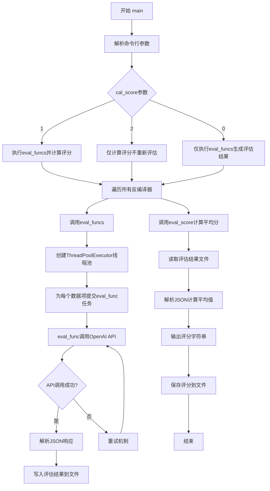
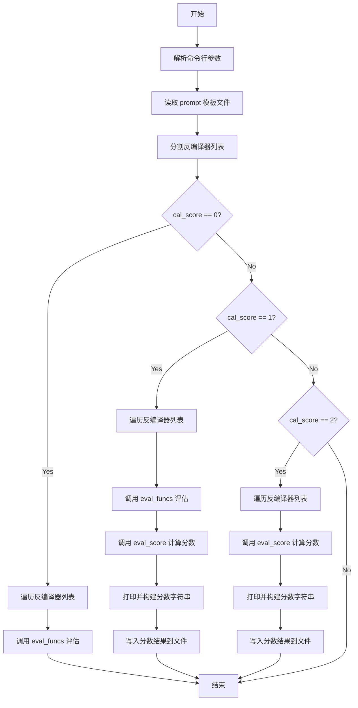
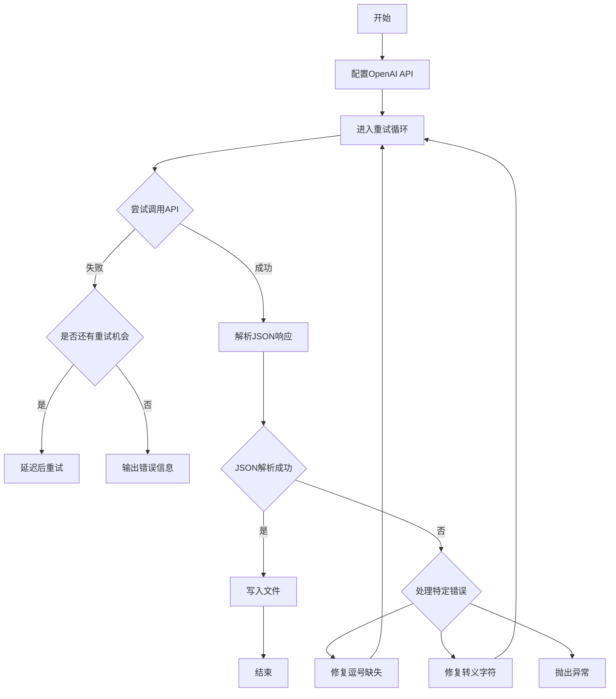
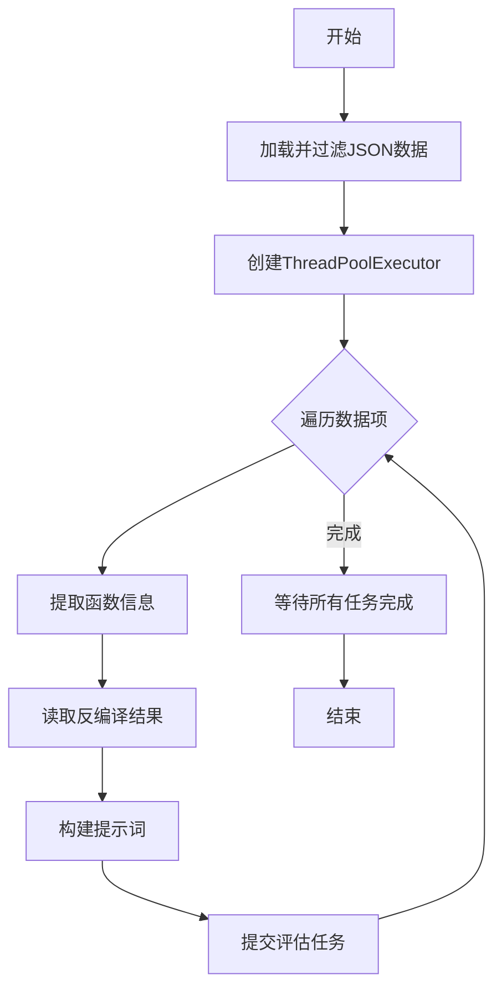
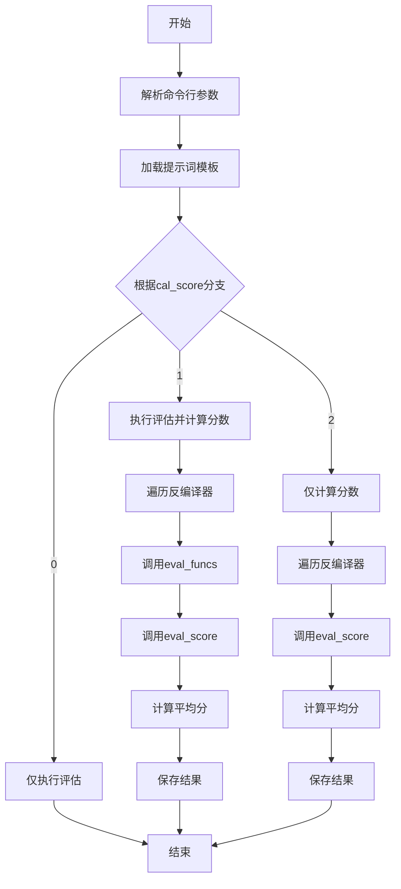

# `LLM4Decompile\sk2decompile\evaluation\gpt_judge.py` 详细设计文档

该代码是一个基于 OpenAI GPT-5-mini 模型的代码反编译结果评估框架，通过调用大语言模型对不同反编译器生成的代码进行质量评分，支持多线程并行处理多个反编译任务，并生成详细的评分报告。

## 整体流程



## 类结构

```
无类层次结构（面向过程编程）
主要模块:
├── 全局变量
│   ├── current_dir
│   └── scores_tmp
├── 核心函数
│   ├── eval_func (评估单个代码)
│   ├── eval_score (计算评分)
│   ├── eval_funcs (并行评估调度)
│   └── main (主入口)
```

## 全局变量及字段


### `current_dir`
    
当前脚本所在目录路径

类型：`str`
    


### `scores_tmp`
    
评分模板字典，定义评分维度和默认值

类型：`dict`
    


    

## 全局函数及方法


### `eval_func`

调用 OpenAI API 评估单个代码片段，发送提示词到 GPT 模型并解析返回的 JSON 评分结果，支持重试机制和多种 JSON 解析错误修复，最终将评分结果写入指定文件。

参数：

- `write_path`：`str`，输出文件路径，用于保存评估结果
- `input_prompt`：`str`，发送给 OpenAI API 的提示词内容
- `api_key`：`str`，OpenAI API 密钥，用于身份验证
- `max_retries`：`int`（可选，默认值 5），最大重试次数
- `initial_delay`：`int`（可选，默认值 1），重试初始延迟时间（秒）

返回值：`None`，函数无返回值，直接将结果写入文件

#### 流程图

```mermaid
flowchart TD
    A[开始 eval_func] --> B[设置 OpenAI API URL 和密钥]
    B --> C[初始化延迟时间]
    C --> D{尝试次数 < max_retries?}
    D -->|是| E[调用 OpenAI ChatCompletion API]
    E --> F{API 调用成功?}
    F -->|是| G[获取模型返回内容]
    F -->|否| H[等待延迟时间后重试]
    H --> D
    G --> I{返回内容是字符串?}
    I -->|是| J[直接使用返回内容]
    I -->|否| K[从返回内容中提取文本]
    J --> L[清理 JSON 格式标记]
    K --> L
    L --> M{尝试解析 JSON}
    M -->|成功| N[遍历评分数据验证]
    N --> O[跳出重试循环]
    M -->|失败| P{错误类型?}
    P -->|Expecting ',' delimiter| Q[尝试添加 '}' 后重试解析]
    P -->|Invalid \\escape| R[尝试移除反斜杠后重试解析]
    P -->|其他| S[抛出 ValueError]
    Q --> T{解析成功?}
    T -->|是| N
    T -->|否| S
    R --> U{解析成功?}
    U -->|是| N
    U -->|否| S
    S --> V[记录错误信息并打印]
    V --> D
    D -->|否| W[记录错误信息并打印]
    O --> X[确保输出目录存在]
    X --> Y[写入评分结果到文件]
    Y --> Z[结束]
```

#### 带注释源码

```python
def eval_func(write_path, input_prompt, api_key, max_retries=5, initial_delay=1):
    """
    调用 OpenAI API 评估单个代码片段
    
    参数:
        write_path: 输出文件路径
        input_prompt: 发送给 API 的提示词
        api_key: OpenAI API 密钥
        max_retries: 最大重试次数
        initial_delay: 初始延迟时间(秒)
    """
    # 设置 OpenAI API 基础 URL（自定义端点）
    openai.base_url = "https://api5.xhub.chat/v1/"
    # 设置 API 密钥
    openai.api_key = api_key
    # 初始化延迟时间
    delay = initial_delay
    
    # 重试循环
    for attempt in range(max_retries):
        try:
            # 调用 OpenAI ChatCompletion API
            response = openai.chat.completions.create(
                model="gpt-5-mini",  # 使用的模型
                messages=[{"role": "user", "content": input_prompt}],  # 用户消息
                max_tokens=8192,  # 最大生成 token 数
                temperature=0,  # 温度参数设为 0，减少随机性
            )
            # 获取模型返回的消息内容
            answer = response.choices[0].message.content
            
            # 处理非字符串返回值的情况
            if not isinstance(answer, str):
                # 从复杂结构中提取文本
                answer = response.choices[0].message.content[1]['text']
            
            # 尝试解析 JSON
            try:
                txt = answer.strip()
                # 移除 Markdown JSON 代码块标记
                txt = txt.replace("```json","").replace("```", "").strip()
                # 解析 JSON
                score = json.loads(txt)
                # 验证评分数据
                for score_name in scores_tmp:
                    score_one = score[score_name]
            except Exception as e:
                # 处理 JSON 解析错误：缺少逗号分隔符
                if "Expecting ',' delimiter" in str(e):
                    try:
                        txt = answer.strip()
                        txt = txt.replace("```json","").replace("```", "").strip()+'}'
                        score = json.loads(txt)
                        for score_name in scores_tmp:
                            score_one = score[score_name]
                    except Exception as e2:
                        raise ValueError()
                # 处理 JSON 解析错误：无效的转义字符
                elif "Invalid \\escape:" in str(e):
                    try:
                        txt = answer.strip()
                        txt = txt.replace("```json","").replace("```", "").strip().replace('\\','')
                        score = json.loads(txt)
                        for score_name in scores_tmp:
                            score_one = score[score_name]
                    except Exception as e2:
                        raise ValueError()
                else:
                    raise ValueError()
            # 解析成功，跳出重试循环
            break
            
        except Exception as e:
            # 处理 API 调用异常
            if attempt < max_retries - 1:
                # 延迟后重试（当前延迟逻辑未启用乘以 2 的增长）
                # print(f"Retrying in {delay} seconds...")
                time.sleep(delay)
            else:
                # 达到最大重试次数，记录错误
                answer = f"# Error during judge: {str(e)}"
                print(answer)

    # 确保输出目录存在
    os.makedirs(os.path.dirname(write_path), exist_ok=True)
    # 将评分结果写入文件
    with open(write_path, 'w') as f:
        f.write(txt)
```


### `eval_score`

该函数从指定的JSON文件读取评估数据，根据优化选项过滤数据，然后遍历每个数据项对应的评分文件路径，解析评分结果并计算各个评估维度的分数列表，最终返回包含所有评分结果的字典。

参数：

- `json_file`：`str`，输入的JSON文件路径，包含待评估的代码数据列表
- `decompiler`：`str`，反编译器名称，用于构建评分文件的目录路径
- `opt`：`str`，优化级别（如"O0"、"O2"等），用于过滤JSON数据中的记录以及构建评分文件路径

返回值：`dict`，返回以评估维度名称（如"Code Readability Assessment"）为键、对应分数列表为值的字典

#### 流程图

```mermaid
flowchart TD
    A[开始 eval_score] --> B[打开并加载json_file]
    B --> C[根据opt过滤数据]
    C --> D[初始化scores字典]
    D --> E{遍历datas中的每个data}
    E -->|是| F[构建score_path路径]
    F --> G[尝试打开score_path读取内容]
    G --> H[尝试解析JSON]
    H -->|成功| I[提取各维度分数并添加到scores]
    H -->|失败| J{检查错误类型}
    J -->|Expecting delimiter| K[尝试添加}后重试解析]
    J -->|Invalid escape| L[尝试移除反斜杠后重试]
    J -->|其他错误| M[输出错误信息并默认分数为1]
    K -->|成功| I
    K -->|失败| M
    L -->|成功| I
    L -->|失败| M
    I --> E
    E -->|否| N[返回scores字典]
    N --> O[结束]
```

#### 带注释源码

```python
def eval_score(json_file, decompiler, opt):
    """
    从JSON文件读取评估数据，计算并返回各个评估维度的分数
    
    参数:
        json_file: str, 输入的JSON文件路径,包含待评估的代码数据列表
        decompiler: str, 反编译器名称,用于构建评分文件的目录路径
        opt: str, 优化级别(如"O0"等),用于过滤JSON数据中的记录
    
    返回:
        dict, 返回以评估维度名称为键、对应分数列表为值的字典
    """
    
    # 打开JSON文件并加载数据
    with open(json_file) as f:
        datas = json.load(f)
        # 根据opt过滤出符合条件的评估数据
        datas = [data for data in datas if data['opt'] == opt]

    # 初始化scores字典,每个评估维度对应一个空列表
    scores = {score_name: [] for score_name in scores_tmp}
    
    # 遍历每一条评估数据
    for data in datas:
        opt = data['opt']  # 获取优化级别
        language = data['language']  # 获取编程语言
        # 从json_file路径中提取文件名(不含.json后缀)
        file_name = os.path.basename(json_file).replace('.json', '')
        # 构建输出名称: 索引号_优化级别
        output_name = str(data['index']) + '_' + opt
        # 构建评分文件的完整路径
        score_path = f'{current_dir}/judge_outputs/{file_name}/{decompiler}/{opt}/{output_name}.{language}'
        
        try:
            # 尝试打开评分文件并读取内容
            with open(score_path, 'r') as f:
                txt = f.read().strip()
                # 移除markdown代码块标记
                txt = txt.replace("```json","").replace("```", "").strip()
                # 解析JSON评分数据
                score = json.loads(txt)
                # 遍历所有评估维度,提取分数
                for score_name in scores:
                    score_one = score.get(score_name, {"score":1})  # 默认分数为1
                    scores[score_name].append(int(score_one["score"]))
        except Exception as e:
            # 处理JSON解析错误: 缺少逗号分隔符
            if "Expecting ',' delimiter" in str(e):
                try:
                    with open(score_path, 'r') as f:
                        txt = f.read().strip()
                        txt = txt.replace("```json","").replace("```", "").strip()+'}'
                        score = json.loads(txt)
                        for score_name in scores:
                            score_one = score.get(score_name, {"score":1})
                            scores[score_name].append(int(score_one["score"]))
                except Exception as e2:
                    # 修复失败,打印错误并使用默认分数
                    print(f"Error loading score for {score_path}: {str(e2)}")
                    for score_name in scores:
                        scores[score_name].append(1)
            # 处理JSON解析错误: 无效的转义字符
            elif "Invalid \\escape:" in str(e):
                try:
                    with open(score_path, 'r') as f:
                        txt = f.read().strip()
                        txt = txt.replace("```json","").replace("```", "").strip().replace('\\','')
                        score = json.loads(txt)
                        for score_name in scores:
                            score_one = score.get(score_name, {"score":1})
                            scores[score_name].append(int(score_one["score"]))
                except Exception as e2:
                    # 修复失败,打印错误并使用默认分数
                    print(f"Error loading score for {score_path}: {str(e2)}")
                    for score_name in scores:
                        scores[score_name].append(1)
            else:
                # 处理其他异常情况
                print(f"Error loading score for {score_path}: {str(e)}")
                for score_name in scores:
                    scores[score_name].append(1)
    
    # 返回包含所有评估维度分数的字典
    return scores
```


### `eval_funcs`

并行调度多个评估任务，该函数读取JSON配置文件，根据指定的优化级别(opt)筛选数据，为每个数据项构造评估prompt，并通过ThreadPoolExecutor以多线程方式并发调用eval_func执行实际的模型评估任务，最后等待所有任务完成。

参数：

- `json_file`：`str`，JSON格式的测试数据文件路径，包含待评估的源代码和反编译结果信息
- `decompiler`：`str`，反编译器名称，用于构建输入输出路径，标识不同反编译器产生的输出
- `prompt`：`str`，评估模板字符串，包含[SRC]和[DSRC]占位符，将被替换为源代码和反编译结果
- `opt`：`str`，优化级别（如"O0"、"O2"等），用于筛选JSON中对应优化级别的数据
- `api_key`：`str`，OpenAI API密钥，用于调用大语言模型进行评估

返回值：`None`，该函数执行副作用（写入评估结果文件），不返回任何值

#### 流程图

```mermaid
flowchart TD
    A[开始 eval_funcs] --> B[打开json_file读取数据]
    B --> C[根据opt筛选数据]
    C --> D[创建ThreadPoolExecutor, max_workers=64]
    D --> E{遍历筛选后的datas}
    E -->|每个data| F[提取opt/func/language/index]
    F --> G[解析func_name并处理**或*前缀]
    G --> H[将func中的func_name替换为func0]
    H --> I[构建output_name和decompile_path]
    I --> J[读取decompile_result文件]
    J --> K{文件读取成功?}
    K -->|是| L[使用prompt替换[SRC]和[DSRC]]
    K -->|否| M[设置decompile_result为decompile error并打印]
    M --> L
    L --> N[构建write_path]
    N --> O[提交任务到线程池: executor.submiteval_func]
    E --> P{所有data遍历完成?}
    P -->|否| E
    P -->|是| Q[遍历as_completedtasks]
    Q --> R[调用future.result捕获异常]
    R --> S[结束]
```

#### 带注释源码

```python
def eval_funcs(json_file, decompiler, prompt, opt, api_key):
    """
    并行调度多个评估任务
    
    参数:
        json_file: JSON格式的测试数据文件路径
        decompiler: 反编译器名称
        prompt: 评估模板字符串
        opt: 优化级别
        api_key: OpenAI API密钥
    """
    tasks = []
    # 读取JSON配置文件
    with open(json_file) as f:
        datas = json.load(f)
        # 根据优化级别筛选数据
        datas = [data for data in datas if data['opt'] == opt]

    # 创建线程池，最多64个并发worker
    with ThreadPoolExecutor(max_workers=64) as executor:  # 可根据实际情况调整线程数
        # 遍历筛选后的每个数据项
        for data in datas:
            opt = data['opt']
            func = data['func']
            
            # 提取函数名：处理函数定义字符串，提取函数名部分
            func_name = func.split('(')[0].split(' ')[-1].strip()
            
            # 处理函数名前缀：**func 或 *func 的情况
            if func_name.strip() and func_name[0:2] == '**':
                func_name = func_name[2:]
            elif func_name.strip() and func_name[0] == '*':
                func_name = func_name[1:]
            
            # 将源代码中的函数名替换为统一占位符func0
            func = func.replace(func_name, 'func0')
            
            language = data['language']
            file_name = os.path.basename(json_file).replace('.json', '')
            output_name = str(data['index']) + '_' + opt
            
            # 构建反编译结果文件路径
            decompile_path = f'./model_outputs/{file_name}/{decompiler}/{opt}/{output_name}.{language}'
            
            # 尝试读取反编译结果
            try:
                with open(decompile_path, 'r') as f:
                    decompile_result = f.read().strip()
            except:
                # 读取失败时设置默认值
                decompile_result = 'decompile error'
                print(decompile_result)
            
            # 使用prompt模板替换占位符，构造评估输入
            input_prompt = prompt.replace('[SRC]', func).replace('[DSRC]', decompile_result)
            
            # 构建评估输出路径
            write_path = f'{current_dir}/judge_outputs/{file_name}/{decompiler}/{opt}/{output_name}.{language}'
            
            # 提交评估任务到线程池
            tasks.append(executor.submit(eval_func, write_path, input_prompt, api_key))

        # 等待所有任务完成并捕获异常
        for future in as_completed(tasks):
            future.result()  # 捕获异常，确保所有任务完成
```


### `main`

命令行入口函数，处理参数和流程控制，协调评估任务的执行。

参数：该函数无显式参数，通过 `argparse` 模块从命令行接收以下参数：

- `json_file`：`str`，输入的 JSON 数据文件路径，默认为 `'./data/humaneval_normsrcpseudo.json'`
- `prompt`：`str`，用于评估的 prompt 模板文件路径，默认为 `'template.txt'`
- `decompilers`：`str`，逗号分隔的反编译器列表，默认为多个反编译器名称
- `cal_score`：`int`，控制执行流程的标志：0 仅执行评估，1 执行评估并计算分数，2 仅计算分数，默认为 `1`
- `opt`：`str`，优化级别（如 O0、O2 等），默认为 `'O0'`
- `api_key`：`str`，OpenAI API 密钥，用于调用评估接口

返回值：`None`，该函数执行完成后无返回值，主要通过副作用（如写入文件、打印输出）产生结果。

#### 流程图



#### 带注释源码

```python
def main():
    """
    命令行入口函数，处理参数和流程控制，协调评估任务的执行。
    根据 cal_score 参数决定执行不同的工作流程：
    - 0: 仅执行评估任务
    - 1: 执行评估任务并计算分数
    - 2: 仅计算分数
    """
    # 创建命令行参数解析器
    arg_parser = argparse.ArgumentParser()
    
    # 添加命令行参数定义
    arg_parser.add_argument("--json_file", type=str, default='./data/humaneval_normsrcpseudo.json')
    arg_parser.add_argument("--prompt", type=str, default='template.txt')
    arg_parser.add_argument("--decompilers", type=str, 
                            default='gpt-5-mini-name7,idioms,lmdc6.7,pseudo2normFinal-Debug,pseudo2normFinal_RL-Debug,pseudo2norm_Final+norm2codeFinal-Debug-11000,pseudo2norm_RLFinal+norm2codeFinal-Debug-11000,pseudo2code_Final-3200')
    arg_parser.add_argument("--cal_score", type=int, default=1)
    arg_parser.add_argument("--opt", type=str, default='O0')
    arg_parser.add_argument("--api_key", type=str)
    
    # 解析命令行参数
    args = arg_parser.parse_args()
    
    # 读取 prompt 模板文件内容
    with open(args.prompt, 'r') as f:
        prompt = f.read()
    
    # 将反编译器字符串分割为列表
    decompilers = args.decompilers.split(",")
    opt = args.opt
    
    # 流程控制分支
    if args.cal_score == 0:
        # 仅执行评估任务，不计算分数
        for decompiler in decompilers:
            eval_funcs(args.json_file, decompiler, prompt)
    
    if args.cal_score == 1:
        # 执行评估任务并计算分数
        scores = {}
        scores_str = f'{opt}:\n'
        file_name = os.path.basename(args.json_file).replace('.json', '')
        
        for decompiler in decompilers:
            # 调用评估函数生成评估结果
            eval_funcs(args.json_file, decompiler, prompt, opt, args.api_key)
            # 计算评估分数
            scores[decompiler] = eval_score(args.json_file, decompiler, opt)
            
            # 构建分数字符串
            score_string = f'{decompiler}:'
            for score_key in scores[decompiler]:
                score_list = scores[decompiler][score_key]
                score_string += f'{score_key}:{sum(score_list)/len(score_list):.2f};'
            
            # 打印分数结果
            print(score_string)
            scores_str += score_string + '\n'
        
        # 将分数结果写入文件
        with open(f'{current_dir}/{file_name}_gpt5minijudge_src.txt', 'w') as f:
            f.write(scores_str)
    
    if args.cal_score == 2:
        # 仅计算分数，不执行评估任务
        scores = {}
        scores_str = ''
        file_name = os.path.basename(args.json_file).replace('.json', '')
        
        for decompiler in decompilers:
            # 直接计算评估分数
            scores[decompiler] = eval_score(args.json_file, decompiler, opt)
            
            # 构建分数字符串
            score_string = f'{decompiler}:'
            for score_key in scores[decompiler]:
                score_list = scores[decompiler][score_key]
                score_string += f'{score_key}:{sum(score_list)/len(score_list):.2f};'
            
            # 打印分数结果
            print(score_string)
            scores_str += score_string + '\n'
        
        # 将分数结果写入文件
        with open(f'{current_dir}/{file_name}_gpt5minijudge.txt', 'w') as f:
            f.write(scores_str)


if __name__ == '__main__':
    # 脚本入口点
    main()
```

## 关键组件


### 1. 核心功能概述

该代码是一个基于GPT-5-mini模型的代码反编译结果评估框架，通过调用OpenAI API对不同反编译器的输出进行质量评分，支持多线程并发处理和批量评估。

### 2. 文件整体运行流程

代码的main()函数作为入口，接收命令行参数后，首先加载评估提示词模板，然后根据cal_score参数执行不同模式：当cal_score=0时仅执行评估生成；当cal_score=1时执行评估并计算分数；当cal_score=2时仅计算已有分数。对于每个反编译器，程序先调用eval_funcs批量提交评估任务（使用64线程的线程池），然后调用eval_score读取并解析评估结果，最终输出各反编译器的平均分数并保存到文件。

### 3. 类详细信息

#### 3.1 全局变量

**current_dir**
- 类型：str
- 描述：当前脚本所在目录的绝对路径，用于构建输出文件路径

**scores_tmp**
- 类型：dict
- 描述：评分模板字典，定义评估维度和默认分值，包含Code Readability Assessment等评估项

#### 3.2 全局函数

**eval_func(write_path, input_prompt, api_key, max_retries=5, initial_delay=1)**
- 参数：
  - write_path (str): 评估结果输出文件路径
  - input_prompt (str): 发送给GPT模型的提示词
  - api_key (str): OpenAI API密钥
  - max_retries (int): 最大重试次数，默认5
  - initial_delay (int): 初始重试延迟（秒），默认1
- 返回值：None（结果写入文件）
- 流程图：

- 源码：
```python
def eval_func(write_path, input_prompt, api_key, max_retries=5, initial_delay=1):
    openai.base_url = "https://api5.xhub.chat/v1/"
    openai.api_key = api_key
    delay = initial_delay
    for attempt in range(max_retries):
        try:
            response = openai.chat.completions.create(
                model="gpt-5-mini",
                messages=[{"role": "user", "content": input_prompt}],
                max_tokens=8192,
                temperature=0,
            )
            answer = response.choices[0].message.content
            if not isinstance(answer, str):
                answer = response.choices[0].message.content[1]['text']
            
            try:
                txt = answer.strip()
                txt = txt.replace("```json","").replace("```", "").strip()
                score = json.loads(txt)
                for score_name in scores_tmp:
                    score_one = score[score_name]
            except Exception as e:
                if "Expecting ',' delimiter" in str(e):
                    try:
                        txt = answer.strip()
                        txt = txt.replace("```json","").replace("```", "").strip()+'}'
                        score = json.loads(txt)
                        for score_name in scores_tmp:
                            score_one = score[score_name]
                    except Exception as e2:
                        raise ValueError()
                elif "Invalid \\escape:" in str(e):
                    try:
                        txt = answer.strip()
                        txt = txt.replace("```json","").replace("```", "").strip().replace('\\','')
                        score = json.loads(txt)
                        for score_name in scores_tmp:
                            score_one = score[score_name]
                    except Exception as e2:
                        raise ValueError()
                else:
                    raise ValueError()
            break
        except Exception as e:
            if attempt < max_retries - 1:
                time.sleep(delay)
            else:
                answer = f"# Error during judge: {str(e)}"
                print(answer)

    os.makedirs(os.path.dirname(write_path), exist_ok=True)
    with open(write_path, 'w') as f:
        f.write(txt)
```

**eval_score(json_file, decompiler, opt)**
- 参数：
  - json_file (str): 输入数据JSON文件路径
  - decompiler (str): 反编译器名称
  - opt (str): 优化级别（如O0、O2等）
- 返回值：dict，包含各评估维度的分数列表
- 流程图：
```mermaid
flowchart TD
    A[开始] --> B[加载JSON数据并过滤]
    B --> C[初始化分数字典]
    C --> D{遍历数据项}
    D -->|每项| E[构建评分文件路径]
    E --> F{尝试读取评分文件}
    F -->|成功| G[解析JSON]
    F -->|失败| H{错误类型处理}
    G --> I[提取分数并添加到列表]
    H -->|逗号缺失| J[添加}后重试]
    H -->|转义错误| K[移除反斜杠重试]
    H -->|其他| L[添加默认分值1]
    J --> G
    K --> G
    I --> D
    D -->|完成| M[返回分数字典]
```
- 源码：
```python
def eval_score(json_file, decompiler, opt):
    with open(json_file) as f:
        datas = json.load(f)
        datas = [data for data in datas if data['opt'] == opt]

    scores = {score_name: [] for score_name in scores_tmp}
    for data in datas:
        opt = data['opt']
        language = data['language']
        file_name = os.path.basename(json_file).replace('.json', '')
        output_name = str(data['index']) + '_' + opt
        score_path = f'{current_dir}/judge_outputs/{file_name}/{decompiler}/{opt}/{output_name}.{language}'
        try:
            with open(score_path, 'r') as f:
                txt = f.read().strip()
                txt = txt.replace("```json","").replace("```", "").strip()
                score = json.loads(txt)
                for score_name in scores:
                    score_one = score.get(score_name, {"score":1})
                    scores[score_name].append(int(score_one["score"]))
        except Exception as e:
            if "Expecting ',' delimiter" in str(e):
                # ... 错误处理逻辑
            elif "Invalid \\escape:" in str(e):
                # ... 错误处理逻辑
            else:
                print(f"Error loading score for {score_path}: {str(e)}")
                for score_name in scores:
                    scores[score_name].append(1)
    return scores
```

**eval_funcs(json_file, decompiler, prompt, opt, api_key)**
- 参数：
  - json_file (str): 输入数据JSON文件路径
  - decompiler (str): 反编译器名称
  - prompt (str): 评估提示词模板
  - opt (str): 优化级别
  - api_key (str): OpenAI API密钥
- 返回值：None（通过线程池执行任务）
- 流程图：

- 源码：
```python
def eval_funcs(json_file, decompiler, prompt, opt, api_key):
    tasks = []
    with open(json_file) as f:
        datas = json.load(f)
        datas = [data for data in datas if data['opt'] == opt]

    with ThreadPoolExecutor(max_workers=64) as executor:
        for data in datas:
            # ... 构建任务逻辑
            tasks.append(executor.submit(eval_func, write_path, input_prompt, api_key))

        for future in as_completed(tasks):
            future.result()
```

**main()**
- 参数：无（通过argparse获取命令行参数）
- 返回值：None
- 流程图：

- 源码：
```python
def main():
    arg_parser = argparse.ArgumentParser()
    arg_parser.add_argument("--json_file",type=str,default='./data/humaneval_normsrcpseudo.json')
    arg_parser.add_argument("--prompt",type=str,default='template.txt')
    arg_parser.add_argument("--decompilers",type=str,default='gpt-5-mini-name7,idioms,lmdc6.7,...')
    arg_parser.add_argument("--cal_score",type=int,default=1)
    arg_parser.add_argument("--opt",type=str,default='O0')
    arg_parser.add_argument("--api_key",type=str)
    args = arg_parser.parse_args()
    # ... 执行逻辑
```

### 4. 关键组件信息

**ThreadPoolExecutor (并发评估引擎)**
- 使用64个工作线程的线程池，实现批量评估任务的并发执行，提高API调用效率

**JSON解析容错机制**
- 包含针对"逗号缺失"和"无效转义字符"两种常见JSON解析错误的自动修复逻辑

**多反编译器支持**
- 支持通过逗号分隔的字符串配置多个反编译器，统一进行评估和比较

**评分结果聚合**
- 对每个反编译器的多个评估项分别计算平均值，生成可读的评分报告

### 5. 潜在技术债务与优化空间

**硬编码API配置**：OpenAI API的base_url和model名称硬编码在eval_func中，缺乏灵活性

**异常处理冗余**：eval_func和eval_score中存在大量重复的错误处理代码，可提取为通用函数

**文件路径构建**：输出路径的构建逻辑分散在多个函数中，可封装为统一的路径生成工具

**线程数硬编码**：max_workers=64为硬编码值，应根据系统资源和任务特点可配置

**变量遮蔽**：eval_score函数中使用了opt参数进行数据过滤后又重新赋值opt，存在变量遮蔽问题

**缺少日志记录**：仅使用print输出错误信息，缺乏结构化日志记录

**API重试策略简单**：延迟时间固定为initial_delay，未实现指数退避

**评分模板静态**：scores_tmp定义为全局常量，扩展性受限

### 6. 其它项目

**设计目标与约束**
- 目标：批量评估反编译器输出质量
- 约束：依赖OpenAI API，支持批量并发处理

**错误处理与异常设计**
- API调用失败时自动重试
- JSON解析失败时尝试自动修复
- 文件读取失败时使用默认分值

**数据流与状态机**
- 数据流：JSON输入 → 提示词替换 → API评估 → 结果写入 → 分数读取 → 聚合输出
- 状态：评估任务提交态、执行态、完成态

**外部依赖与接口契约**
- 依赖openai库进行API调用
- 依赖concurrent.futures实现并发
- 依赖argparse处理命令行参数
- 输入格式：包含opt、language、func、index字段的JSON数组
- 输出格式：各评估维度的平均分数文本文件


## 问题及建议


### 已知问题

-   **硬编码的配置与路径**：API URL（`https://api5.xhub.chat/v1/`）、模型名称（`gpt-5-mini`）、线程池大小（64）以及目录路径（`./model_outputs/`、`./judge_outputs/`）均直接写在代码中，缺乏灵活配置机制。
-   **变量命名拼写错误**：代码中存在 `socre_key`（应为 `score_key`）和 `score_one` 等变量命名不一致问题，影响可读性。
-   **重复的JSON解析逻辑**：`eval_func` 和 `eval_score` 中均包含大量相同的 JSON 解析与错误处理代码块（处理 `Expecting ',' delimiter` 和 `Invalid \\escape:` 错误），未进行函数复用。
-   **未使用的全局变量**：`scores_tmp` 字典被定义但实际未被动态使用，评估逻辑中硬编码了 `scores_tmp` 的键进行遍历。
-   **错误处理不当**：使用通用的 `Exception` 捕获所有异常，缺乏具体的异常类型区分；错误发生时仅打印消息或返回默认值 1，未记录详细日志。
-   **API重试机制未启用**：虽然代码中实现了重试循环，但指数退避逻辑（`delay *= 2`）被注释掉，导致重试时延迟固定。
-   **命令行参数缺失默认值**：`--api_key` 参数未设置默认值，若未提供会导致后续调用失败。
-   **资源泄露风险**：文件操作未使用 `with` 语句确保关闭（尽管此处多数使用了 `with`，但 `eval_func` 中写入文件时变量 `txt` 可能未定义）。
-   **缺乏输入验证**：未对 JSON 文件格式、文件路径存在性、API 密钥有效性等进行验证。
-   **线程池配置不灵活**：线程数硬编码为 64，未根据系统资源或任务性质动态调整。

### 优化建议

-   **抽取公共函数**：将 JSON 解析与错误处理逻辑抽取为独立的工具函数（如 `parse_json_response`），在 `eval_func` 和 `eval_score` 中复用。
-   **配置外部化**：使用配置文件（如 `.env` 或 `config.json`）或命令行参数管理 API URL、模型名称、线程池大小等配置项。
-   **完善错误处理**：区分异常类型，引入结构化日志记录（如 `logging` 模块），为不同错误提供明确的错误码和错误信息。
-   **启用指数退避**：取消注释 `delay *= 2` 实现指数退避重试策略，并添加最大延迟上限。
-   **输入验证**：在读取文件和调用 API 前，增加必要的校验逻辑（如检查文件是否存在、JSON 格式是否正确、API 密钥是否有效）。
-   **统一变量命名**：修正拼写错误，统一使用 `score_key`、`score_value` 等规范的命名。
-   **优化资源管理**：确保所有文件操作都使用上下文管理器，并检查变量定义顺序，避免使用未定义的 `txt` 变量。
-   **增加并发控制**：将线程池大小作为可配置参数，或根据系统 CPU 核心数动态计算合理的线程数。
-   **添加文档注释**：为关键函数和类添加 docstring，说明参数、返回值和可能的异常。

## 其它


### 设计目标与约束

本代码的核心设计目标是构建一个自动化反编译代码质量评估系统，通过调用OpenAI GPT模型对不同反编译器在各种优化级别下的输出进行评分和比较。主要约束包括：1) 依赖外部API服务（api5.xhub.chat），需要稳定的网络连接；2) 并发线程数限制为64；3) API调用具有最大重试次数（5次）和初始延迟（1秒）的指数退避策略；4) 评估结果以JSON格式存储于judge_outputs目录。

### 错误处理与异常设计

代码采用多层次异常处理机制。在eval_func函数中，使用try-except捕获API调用异常、JSON解析异常和文件操作异常。当JSON解析失败时，代码尝试两种修复策略：1) 补充缺失的闭合大括号；2) 移除无效的转义字符。若修复失败则抛出ValueError。在eval_score函数中，针对文件读取和JSON解析的异常进行相似处理，并设置默认分数为1。API调用异常会导致重试机制触发，最大重试次数为5次，最终失败时返回错误信息字符串而非抛出异常。

### 数据流与状态机

数据流遵循以下路径：1) 主程序读取JSON配置文件获取待评估数据；2) 对每个反编译器调用eval_funcs并发提交评估任务；3) eval_func内部读取反编译结果文件，构造prompt模板，调用OpenAI API；4) API返回结果经JSON解析后写入judge_outputs目录；5) eval_score函数读取评估结果并计算各评分维度的平均值。状态转换包括：就绪状态→评估中状态→评分计算状态→完成状态，异常情况下可回退至重试状态。

### 外部依赖与接口契约

主要外部依赖包括：1) openai库（用于调用GPT模型API）；2) concurrent.futures.ThreadPoolExecutor（用于并发任务调度）；3) json/os/time/argparse标准库。API接口契约方面，openai.chat.completions.create接受参数：model="gpt-5-mini"、messages数组、max_tokens=8192、temperature=0，返回包含choices[0].message.content的响应对象。输入JSON配置文件需包含opt、language、func、index等字段。

### 配置文件格式与示例

输入JSON文件格式示例（data字段结构）：
```json
[
  {
    "opt": "O0",
    "language": "c",
    "func": "int main() { ... }",
    "index": 0
  }
]
```
输出评分文件格式为JSON，包含score和rationale字段。命令行参数包括：--json_file（输入数据文件路径）、--prompt（提示模板文件路径）、--decompilers（逗号分隔的反编译器列表）、--cal_score（计算模式：0仅评估、1评估+评分、2仅评分）、--opt（优化级别如O0/O2）、--api_key（OpenAI API密钥）。

### 性能考量与资源使用

代码使用ThreadPoolExecutor实现并发评估，默认最大工作线程数为64。在高并发场景下需要注意：1) API速率限制可能导致请求排队；2) 内存使用与待评估数据量成正比；3) 评分计算采用流式处理避免内存峰值。评估结果按反编译器和优化级别分组存储于judge_outputs/{file_name}/{decompiler}/{opt}/目录下，文件命名格式为{index}_{opt}.{language}。

### 安全考虑

API密钥通过命令行参数传入，应避免明文存储于代码或配置文件中。文件路径处理使用os.path.dirname和os.path.basename防止路径遍历攻击。写入文件前调用os.makedirs确保目录存在。敏感信息（如API密钥）不应写入日志或输出文件。

### 扩展性与未来改进

代码可从以下方面扩展：1) 支持更多GPT模型版本（当前硬编码gpt-5-mini）；2) 添加缓存机制避免重复评估相同输入；3) 支持分布式评估（多机器协同）；4) 增加更多评分维度和自定义评分模板；5) 提供Web界面或API服务便于交互使用。

    