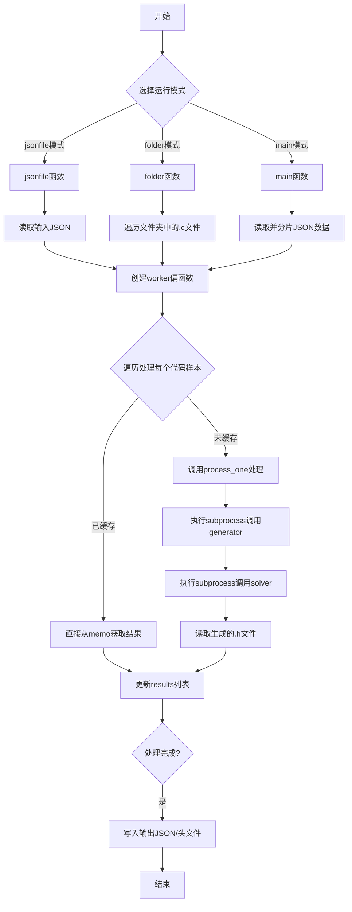
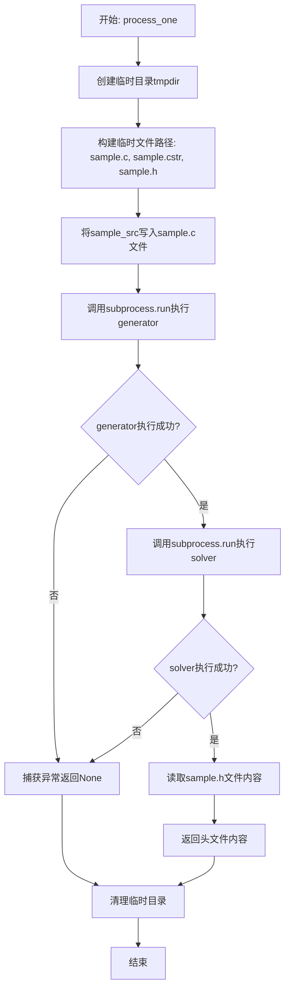
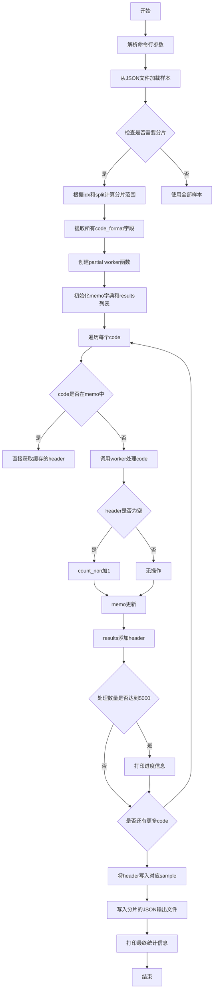
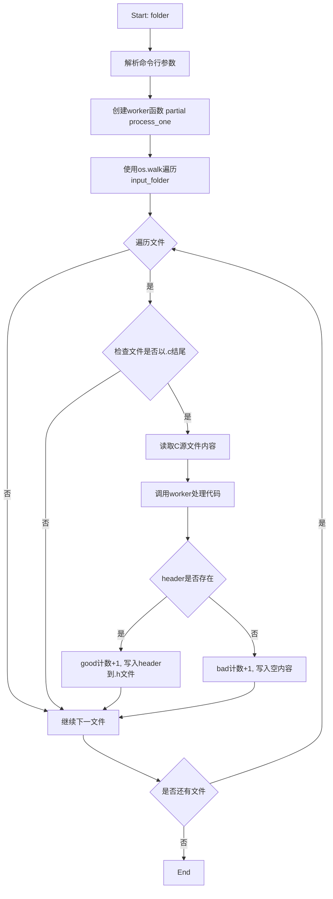
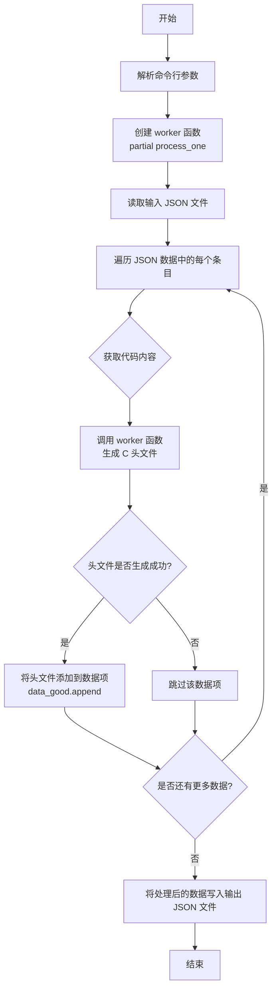

# `LLM4Decompile\sk2decompile\evaluation\inf_type.py` 详细设计文档

这是一个批量处理C语言源代码的工具，通过调用外部generator和solver工具将C代码转换为对应的.h头文件，支持从JSON文件、文件夹或直接处理JSON数据三种模式，并提供数据分片功能。

## 整体流程



## 类结构

```
无类定义（纯函数式编程）
├── process_one (核心处理函数)
├── main (命令行入口 - JSON批量处理)
├── folder (文件夹遍历模式)
└── jsonfile (JSON文件处理模式)
```

## 全局变量及字段


### `SPLIT`
    
分片大小计算变量

类型：`int`
    


### `memo`
    
代码到头文件的缓存字典

类型：`dict`
    


### `results`
    
存储处理结果列表

类型：`list`
    


### `count_non`
    
失败计数

类型：`int`
    


### `codes`
    
代码字符串列表

类型：`list`
    


### `samples`
    
原始样本数据列表

类型：`list`
    


### `good`
    
成功处理计数

类型：`int`
    


### `bad`
    
失败处理计数

类型：`int`
    


### `data_good`
    
成功处理的数据列表

类型：`list`
    


    

## 全局函数及方法


### `process_one`

该函数是批量处理C代码样本的核心函数，负责将单个C源代码样本转换为对应的头文件。它首先将源代码写入临时文件，然后依次调用外部生成器（generator）将C代码转换为中间表示（.cstr文件），再调用求解器（solver）从中间表示生成头文件（.h文件），最后读取并返回头文件内容，临时文件会自动清理。

参数：

- `sample_src`：`str`，输入的C源代码字符串
- `generator`：`str`，外部生成器可执行文件的路径，用于将C源代码转换为中间表示
- `solver`：`str`，外部求解器可执行文件的名称（配合`stack exec`使用），用于从中间表示生成头文件

返回值：`str | None`，成功时返回生成的头文件内容（字符串），失败时返回`None`

#### 流程图



#### 带注释源码

```python
def process_one(sample_src, generator, solver):
    """
    处理单个C代码样本的核心函数
    
    处理流程：
    1. 将C源代码写入临时sample.c文件
    2. 运行generator生成器生成中间表示sample.cstr
    3. 运行solver求解器从头文件中间表示生成sample.h
    4. 读取并返回生成的头文件内容
    5. 临时文件自动清理
    
    参数:
        sample_src: C源代码字符串
        generator: 生成器可执行文件路径
        solver: 求解器可执行文件名称
    
    返回:
        成功返回头文件内容字符串，失败返回None
    """
    # 使用上下文管理器创建临时目录，退出时自动清理
    with tempfile.TemporaryDirectory() as tmpdir:
        # 构建临时文件路径
        sample_path = os.path.join(tmpdir, "sample.c")      # 原始C源代码文件
        output_path = os.path.join(tmpdir, "sample.cstr")    # 中间表示文件
        header_path = os.path.join(tmpdir, "sample.h")       # 生成的头文件

        # 步骤1: 将C源代码写入临时文件
        with open(sample_path, "w", encoding="utf-8") as f:
            f.write(sample_src)

        try:
            # 步骤2: 运行generator生成器
            # 使用subprocess调用外部工具，将C代码转换为中间表示
            subprocess.run(
                [generator, sample_path, "-o", output_path],
                check=True,              # 检查返回码，非0则抛出CalledProcessError
                stdout=subprocess.PIPE, # 捕获标准输出
                stderr=subprocess.PIPE, # 捕获标准错误
                timeout=1,              # 设置1秒超时防止挂起
            )
            
            # 步骤3: 运行solver求解器
            # 使用stack exec调用Haskell求解器，从中间表示生成头文件
            subprocess.run(
                ["stack", "exec", solver, "--", "-i", output_path, "-o", header_path],
                check=True,
                stdout=subprocess.PIPE,
                stderr=subprocess.PIPE,
                timeout=1,
            )

            # 步骤4: 读取生成的头文件内容
            with open(header_path, "r", encoding="utf-8") as f:
                return f.read()

        # 注释掉的CalledProcessError异常处理
        # except subprocess.CalledProcessError as e:
        #     sys.stderr.write(
        #         f"[ERROR] sample failed:\n"
        #         f"  cmd: {e.cmd!r}\n"
        #         f"  returncode: {e.returncode}\n"
        #         f"  stdout: {e.stdout.decode(errors='ignore')}\n"
        #         f"  stderr: {e.stderr.decode(errors='ignore')}\n"
        #     )
        
        # 通用异常捕获，任何错误都返回None
        except Exception as e:
            return None
```

---

## 补充信息

### 关键组件信息

| 组件名称 | 描述 |
|---------|------|
| `tempfile.TemporaryDirectory` | Python标准库，用于创建自动清理的临时目录 |
| `subprocess.run` | 用于执行外部进程（generator和solver工具） |
| `functools.partial` | 用于创建预绑定参数的worker函数（在main函数中使用） |

### 潜在的技术债务或优化空间

1. **错误处理过于宽泛**：使用`except Exception as e`捕获所有异常并简单返回`None`，丢失了详细的错误信息，建议区分不同异常类型并记录日志
2. **超时时间固定**：硬编码`timeout=1`秒可能对复杂代码不够用，对简单代码又过于保守，建议根据实际情况动态调整
3. **临时文件路径固定**：使用固定的临时文件名（sample.c/sample.cstr/sample.h），虽然有临时目录隔离，但缺乏唯一性标识
4. **缺少重试机制**：外部工具调用失败时直接返回None，没有重试逻辑
5. **资源未显式释放**：虽然使用`with`语句但对subprocess的.stdout/.stderr缓冲区未做显式处理

### 设计目标与约束

- **设计目标**：将C源代码批量转换为对应的类型头文件，用于数据增强或类型推断任务
- **约束**：依赖外部工具（psychecgen和psychecsolver-exe），需要正确安装Haskell Stack环境

### 错误处理与异常设计

- 外部工具执行失败（返回非零码）会抛出`CalledProcessError`，但被捕获后只返回`None`
- 超时异常`TimeoutExpired`被捕获后返回`None`
- 文件读写异常被捕获后返回`None`
- 所有错误静默处理，调用方通过返回值`None`判断失败

### 数据流与状态机

```
输入: sample_src (C源代码字符串)
    ↓
状态1: 创建临时目录和文件路径
    ↓
状态2: 写入sample.c文件 [持久化]
    ↓
状态3: 执行generator工具 [外部调用]
    ↓
状态4: 执行solver工具 [外部调用]
    ↓
状态5: 读取sample.h文件 [持久化]
    ↓
输出: header文本字符串 或 None
```

### 外部依赖与接口契约

| 依赖项 | 接口要求 | 说明 |
|-------|---------|------|
| generator | `generator <input.c> -o <output.cstr>` | 接收C源代码文件路径，输出中间表示文件 |
| solver | `stack exec <solver> -- -i <input.cstr> -o <output.h>` | 通过stack运行，从中间表示生成头文件 |
| Python标准库 | tempfile, subprocess, os | 文件操作和进程管理 |


### `main`

命令行主入口函数，支持从JSON文件批量读取C代码样本，通过数据分片并行处理，利用外部生成器和求解器为每个代码样本生成对应的头文件（header），并将结果写入分片的JSON输出文件。

参数：无（命令行参数通过 `argparse` 解析）

返回值：无返回值（直接写入JSON文件）

#### 流程图



#### 带注释源码

```python
def main():
    """
    命令行主入口函数，支持JSON批量处理和数据分片。
    读取JSON格式的C代码样本，通过外部工具生成头文件，
    支持将大数据集分割成多个部分进行处理。
    """
    # 创建命令行参数解析器
    p = argparse.ArgumentParser(description="Batch‐process C samples into headers.")
    
    # 添加输入JSON文件路径参数
    p.add_argument("--input_json", default="train_norm.json", 
                   help="Path to JSON file with a list of {{'code': …}} entries")
    
    # 添加输出文件名参数
    p.add_argument("--output_name", default="train_type", 
                   help="Where to write the augmented JSON")
    
    # 添加生成器可执行文件路径参数
    p.add_argument("--generator", default="/psychec/psychecgen", 
                   help="Path to your generator executable")
    
    # 添加求解器名称参数（用于stack exec命令）
    p.add_argument("--solver", default="/psychec/psychecsolver-exe", 
                   help="Name of your solver (for `stack exec …`)")
    
    # 添加数据分片数量参数
    p.add_argument("--split", type=int, default=5, 
                   help="split the data to split parts")
    
    # 添加分片索引参数
    p.add_argument("--idx", type=int, default=0, 
                   help="index of the split")
    
    # 解析命令行参数
    args = p.parse_args()

    # 加载输入JSON文件
    with open(args.input_json, "r", encoding="utf-8") as f:
        samples = json.load(f)

    # 如果split不等于0，进行数据分片处理
    if args.split != 0:
        # 计算每个分片的大小
        SPLIT = int(len(samples) / args.split)
        
        # 根据idx选择当前分片的数据
        if args.idx == args.split - 1:
            # 最后一个分片包含所有剩余数据
            samples = samples[SPLIT * args.idx:]
        else:
            # 正常分片
            samples = samples[SPLIT * args.idx:SPLIT * (args.idx + 1)]
    
    # 从样本中提取所有code_format字段（代码规范格式）
    codes = [s["code_format"] for s in samples]  # code norm is the final expectation

    # 创建一个partial函数，预填generator和solver参数
    worker = partial(process_one, generator=args.generator, solver=args.solver)

    # 初始化memo字典（缓存已处理的code）和results列表
    memo = {}
    results = []
    count_non = 0  # 统计处理失败的数量
    
    # 使用tqdm显示进度，遍历每个code
    for code in tqdm(codes):
        # 如果code不在缓存中
        if code not in memo:
            # 调用worker处理code
            header = worker(code)
            # 如果处理失败（返回None）
            if header == None:
                count_non += 1
            # 更新缓存
            memo[code] = header
        
        # 将结果添加到results列表
        results.append(memo[code])
        
        # 每处理5000条打印一次进度
        if len(results) % 5000 == 0:
            print(f"len code:{len(codes)}, fail:{count_non}")

    # 将header添加到对应的sample中
    for sample, header in zip(samples, results):
        sample["header"] = header

    # 写入输出JSON文件（带分片索引）
    with open(args.output_name+'_'+str(args.idx)+'.json', "w", encoding="utf-8") as f:
        json.dump(samples, f, indent=2)
    
    # 打印最终统计信息
    print(f"len code:{len(codes)}, fail:{count_non}")
```

---

## 1. 一段话描述

该脚本是一个批量处理C代码的工具，通过集成外部的PsychoChrome生成器和求解器，将C源代码样本转换为对应的头文件（.h），支持JSON批量输入和多进程分片处理，可将大规模数据集分割成多个部分并行处理，并提供结果缓存机制避免重复计算。

## 2. 文件整体运行流程

```
┌─────────────────────────────────────────────────────────────┐
│                         启动入口                              │
│                    (jsonfile / main / folder)                │
└─────────────────────────────────────────────────────────────┘
                              │
                              ▼
┌─────────────────────────────────────────────────────────────┐
│                    参数解析 (argparse)                        │
│          (input_json, output_name, generator, solver,       │
│           split, idx, input_folder, output_json)            │
└─────────────────────────────────────────────────────────────┘
                              │
                              ▼
┌─────────────────────────────────────────────────────────────┐
│                      加载输入数据                             │
│           (JSON文件读取 / 文件夹遍历 / JSON解析)               │
└─────────────────────────────────────────────────────────────┘
                              │
                              ▼
┌─────────────────────────────────────────────────────────────┐
│                      数据预处理                               │
│        (分片计算 / 提取code字段 / 创建worker函数)             │
└─────────────────────────────────────────────────────────────┘
                              │
                              ▼
┌─────────────────────────────────────────────────────────────┐
│                    核心处理循环                               │
│  ┌─────────────────────────────────────────────────────────┐ │
│  │  1. 检查缓存(memo)是否存在该code的处理结果               │ │
│  │  2. 如不存在，调用process_one处理：                     │ │
│  │     - 创建临时目录                                     │ │
│  │     - 写入sample.c                                     │ │
│  │     - 运行generator生成.cstr                           │ │
│  │     - 运行solver生成.h                                 │ │
│  │     - 读取并返回header内容                             │ │
│  │  3. 更新缓存和结果列表                                  │ │
│  │  4. 定期打印进度信息                                    │ │
│  └─────────────────────────────────────────────────────────┘ │
└─────────────────────────────────────────────────────────────┘
                              │
                              ▼
┌─────────────────────────────────────────────────────────────┐
│                      结果输出                                │
│          (JSON文件写入 / .h文件写入)                          │
└─────────────────────────────────────────────────────────────┘
```

## 3. 类/函数详细信息

### 3.1 全局函数

#### `process_one`

- **名称**: process_one
- **参数**:
  - `sample_src`: `str`，C源代码文本
  - `generator`: `str`，生成器可执行文件路径
  - `solver`: `str`，求解器名称
- **返回值**: `Optional[str]`，生成的头文件内容，失败返回None
- **功能**: 将单个C源代码样本通过生成器和求解器转换为头文件

#### `main`

- **名称**: main
- **参数**: 无（通过argparse解析）
- **返回值**: 无
- **功能**: 命令行主入口，支持JSON批量处理和数据分片

#### `folder`

- **名称**: folder
- **参数**: 无（通过argparse解析）
- **返回值**: 无
- **功能**: 遍历文件夹处理所有.c文件

#### `jsonfile`

- **名称**: jsonfile
- **参数**: 无（通过argparse解析）
- **返回值**: 无
- **功能**: 处理JSON文件中的函数代码，生成类型依赖头文件

### 3.2 全局变量

| 变量名 | 类型 | 描述 |
|--------|------|------|
| `memo` | `dict` | 缓存已处理code的结果，避免重复计算 |
| `results` | `list` | 存储所有处理结果 |
| `count_non` | `int` | 统计处理失败的数量 |
| `codes` | `list` | 从样本中提取的code列表 |
| `worker` | `partial` | 预填参数的process_one函数 |

## 4. 关键组件信息

| 组件名称 | 一句话描述 |
|----------|------------|
| `argparse` | 命令行参数解析模块 |
| `tempfile.TemporaryDirectory` | 自动清理的临时目录管理 |
| `subprocess.run` | 执行外部生成器和求解器 |
| `partial` | 函数部分参数绑定 |
| `tqdm` | 进度条显示 |
| `json` | JSON序列化/反序列化 |

## 5. 潜在技术债务与优化空间

### 5.1 错误处理
- `process_one`中异常捕获过于宽泛，使用`except Exception as e`会隐藏具体错误类型
- 被注释掉的`CalledProcessError`处理代码应该恢复，提供更详细的错误诊断
- 缺少对超时情况的特定处理（当前timeout=1可能被频繁触发）

### 5.2 性能优化
- 串行处理效率低，可考虑使用`multiprocessing`或`concurrent.futures`并行化
- `memo`缓存仅基于code字符串，未考虑hash索引优化
- 每5000条打印一次进度，频率可调整

### 5.3 代码质量
- `codes = [s["code_format"] for s in samples]`中的注释`############# code norm is the final expectation`应删除或规范化
- `count_non`变量命名不清晰，应使用`failed_count`或`error_count`
- 多个入口函数（main/folder/jsonfile）可重构为统一的CLI接口

### 5.4 可维护性
- 硬编码的路径`/psychec/psychecgen`和`/psychec/psychecsolver-exe`应作为配置或环境变量
- 缺少日志记录模块，使用`print`调试不够规范
- 魔法数字（如timeout=1, 5000）应定义为常量

## 6. 其它项目

### 6.1 设计目标与约束
- **目标**: 批量将C源代码转换为类型头文件，用于训练数据增强
- **约束**: 
  - 依赖外部工具（psychecgen, psychecsolver-exe）
  - 工具需在特定路径或通过stack执行
  - 单次处理超时设置为1秒

### 6.2 错误处理与异常设计
- **主要异常**: `subprocess.CalledProcessError`（被注释）、`Exception`（捕获所有）、`FileNotFoundError`
- **处理策略**: 返回None表示失败，记录stderr但不中断流程
- **边界情况**: 空JSON文件、空code字段、最后一个分片的不均匀分配

### 6.3 数据流与状态机
- **输入**: JSON文件（含code字段）或文件夹（含.c文件）
- **处理**: 字符串替换 → 外部工具调用 → 结果缓存
- **输出**: 带header字段的JSON或.h头文件

### 6.4 外部依赖与接口契约
- **生成器接口**: `generator <input.c> -o <output.cstr>`
- **求解器接口**: `stack exec <solver> -- -i <input.cstr> -o <output.h>`
- **依赖环境**: Python 3, stack工具链, Haskell编译环境


### `folder`

遍历指定文件夹中的所有`.c`文件，使用psychoec工具（generator和solver）将每个C源代码文件转换为其对应的头文件（.h），并输出到同目录下。

参数：

- 无显式参数（通过`argparse`从命令行获取参数）

命令行参数：

- `input_folder`：`str`，输入文件夹路径，默认为`/workspace/llm4binary/type/evaluation/result/exebench-8800_github1000`
- `generator`：`str`，generator可执行文件路径，默认为`./psychec/psychecgen`
- `solver`：`str`，solver可执行文件名称，默认为`./psychec/psychecsolver-exe`

返回值：`None`，该函数无返回值（执行完成后自动结束）

#### 流程图



#### 带注释源码

```python
def folder():
    """
    遍历指定文件夹中的所有.c文件，
    使用psychoec工具生成对应的.h头文件
    """
    # 创建命令行参数解析器
    p = argparse.ArgumentParser(description="Batch‐process C samples into headers.")
    
    # 添加输入文件夹参数
    p.add_argument("--input_folder", 
                   default="/workspace/llm4binary/type/evaluation/result/exebench-8800_github1000")
    
    # 添加generator可执行文件路径参数
    p.add_argument("--generator", 
                   default="./psychec/psychecgen", 
                   help="Path to your generator executable")
    
    # 添加solver可执行文件名称参数
    p.add_argument("--solver", 
                   default="./psychec/psychecsolver-exe", 
                   help="Name of your solver (for `stack exec …`)")
    
    # 解析命令行参数
    args = p.parse_args()
    
    # 使用functools.partial创建worker函数
    # 预先绑定generator和solver参数
    worker = partial(process_one, generator=args.generator, solver=args.solver)
    
    # 初始化成功/失败计数器
    good = 0
    bad = 1
    
    # 使用os.walk递归遍历输入文件夹
    for root, dirs, files in tqdm(os.walk(args.input_folder)):
        # 遍历当前目录下的所有文件
        for filename in files:
            # 只处理.c源文件
            if filename.endswith(".c"):
                # 拼接完整的文件路径
                file_path = os.path.join(root, filename)
                
                # 读取C源代码文件内容
                with open(file_path, 'r') as f:
                    code = f.read()
                
                # 调用worker函数处理代码，生成header
                header = worker(code)
                
                # 生成对应的.h头文件路径
                header_path = file_path.split('.c')[0] + ".h"
                
                # 写入头文件内容
                with open(header_path, 'w') as f:
                    if header:
                        # 成功生成header
                        good += 1
                        f.write(header)
                    else:
                        # 生成失败，写入空内容
                        bad += 1
                        print(f'good:{good},bad:{bad}')
                        f.write("")
```

---

## 完整设计文档

### 一段话描述

该代码是一个C代码到头文件（.h）的批量转换工具，通过调用外部psychoec工具链（generator和solver），将C源代码文件转换为其对应的类型声明头文件，支持三种工作模式：处理单个JSON输入文件（main）、遍历文件夹处理所有.c文件（folder）、处理JSON文件并添加类型信息（jsonfile）。

### 文件整体运行流程

1. **入口选择**：通过`if __name__ == "__main__"`判断入口函数，当前配置为执行`jsonfile()`
2. **参数解析**：各函数使用`argparse`解析命令行参数
3. **数据加载**：读取输入数据（JSON文件或文件夹）
4. **worker创建**：使用`functools.partial`绑定`process_one`函数和工具路径
5. **批量处理**：遍历数据源，对每个C代码样本调用`process_one`生成头文件
6. **结果输出**：将结果写入输出文件（JSON或.h头文件）

### 全局函数详细信息

#### `process_one(sample_src, generator, solver)`

| 项目 | 详情 |
|------|------|
| **参数** | `sample_src`: str, C源代码字符串 |
| | `generator`: str, generator可执行文件路径 |
| | `solver`: str, solver可执行文件名称 |
| **返回值** | str或None，成功返回header内容，失败返回None |
| **功能** | 将单个C源代码转换为头文件 |

#### `main()`

| 项目 | 详情 |
|------|------|
| **参数** | 命令行参数：input_json, output_name, generator, solver, split, idx |
| **返回值** | None |
| **功能** | 处理JSON文件中的C代码样本，支持数据分片 |

#### `folder()`

| 项目 | 详情 |
|------|------|
| **参数** | 命令行参数：input_folder, generator, solver |
| **返回值** | None |
| **功能** | 遍历文件夹处理所有.c文件 |

#### `jsonfile()`

| 项目 | 详情 |
|------|------|
| **参数** | 命令行参数：input_json, output_json, generator, solver |
| **返回值** | None |
| **功能** | 读取JSON文件，为每个func字段生成类型头文件 |

### 关键组件信息

| 组件名称 | 描述 |
|----------|------|
| `process_one` | 核心处理函数，封装了subprocess调用外部工具的完整流程 |
| `worker (partial)` | 预绑定参数的worker函数，用于批量处理 |
| `memo` | 字典缓存，避免重复处理相同的代码 |
| `tqdm` | 进度条显示组件 |

### 潜在技术债务与优化空间

1. **异常处理过于宽泛**：使用`except Exception as e`捕获所有异常，应区分不同异常类型进行针对性处理
2. **临时文件未显式清理**：`process_one`使用`tempfile.TemporaryDirectory()`自动清理，但错误情况下可能需要更详细的日志
3. **缺少重试机制**：subprocess调用失败时直接返回None，应考虑增加重试逻辑
4. **硬编码超时时间**：subprocess调用超时固定为1秒，应考虑作为可配置参数
5. **memo缓存无过期机制**：内存中的memo字典会随处理样本增长，应考虑持久化或限制大小

### 其它项目

#### 设计目标与约束

- **目标**：批量将C源代码转换为类型声明头文件
- **约束**：依赖外部psychoec工具链（generator和solver），必须在正确安装stack和psychec的环境中运行

#### 错误处理与异常设计

- subprocess调用使用`check=True`检查返回码
- 捕获异常后返回None，由调用方判断处理
- 失败的文件写入空内容并打印计数信息

#### 数据流与状态机

```
输入数据 → 代码提取 → worker处理 → header生成 → 结果存储
                    ↓
              subprocess调用
              (generator → solver)
```

#### 外部依赖与接口契约

- **psychoecgen**：接收C源文件路径和输出路径，生成.cstr文件
- **psychecsolver-exe**：接收.cstr文件路径，生成.h头文件
- **stack**：Haskell工具管理，用于执行solver


### `jsonfile`

该函数是一个命令行工具，用于批量处理 JSON 文件中的 C 代码样本。它读取包含代码的 JSON 文件，对每个代码样本调用外部生成器和求解器来生成 C 头文件（类型声明），然后将结果（包括原始代码和生成的头文件）写入到新的 JSON 文件中。

参数：

- 该函数没有显式参数，通过 `argparse` 从命令行获取以下参数：
  - `--input_json`：`str`，输入 JSON 文件路径，默认值为 `/workspace/llm4binary/type/evaluation/data/github2025_normsrcpseudo.json`
  - `--output_json`：`str`，输出 JSON 文件路径，默认值为 `/workspace/llm4binary/type/evaluation/data/github2025_normsrcpseudo_type.json`
  - `--generator`：`str`，生成器可执行文件路径，默认值为 `./psychec/psychecgen`
  - `--solver`：`str`，求解器可执行文件名称（用于 `stack exec …`），默认值为 `./psychec/psychecsolver-exe`

返回值：`None`，该函数没有返回值，主要通过文件 I/O 产生副作用。

#### 流程图



#### 带注释源码

```python
def jsonfile():
    """
    批量处理 JSON 文件中的 C 代码样本，生成对应的头文件类型声明。
    该函数读取包含代码的 JSON 文件，对每个代码样本调用外部工具生成 C 头文件，
    并将结果写入新的 JSON 文件。
    """
    # 创建命令行参数解析器，描述其用途
    p = argparse.ArgumentParser(description="Batch‐process C samples into headers.")
    
    # 添加输入 JSON 文件路径参数
    p.add_argument("--input_json", default="/workspace/llm4binary/type/evaluation/data/github2025_normsrcpseudo.json")
    
    # 添加输出 JSON 文件路径参数
    p.add_argument("--output_json", default="/workspace/llm4binary/type/evaluation/data/github2025_normsrcpseudo_type.json")
    
    # 添加生成器可执行文件路径参数
    p.add_argument("--generator", default="./psychec/psychecgen", help="Path to your generator executable")
    
    # 添加求解器可执行文件名称参数（用于 stack exec 命令）
    p.add_argument("--solver", default="./psychec/psychecsolver-exe", help="Name of your solver (for `stack exec …`)") 
    
    # 解析命令行参数
    args = p.parse_args()
    
    # 创建 worker 函数，使用 partial 绑定 generator 和 solver 参数
    # worker 是一个偏函数，接收代码字符串作为唯一参数
    worker = partial(process_one, generator=args.generator, solver=args.solver)

    # 读取输入 JSON 文件
    with open(args.input_json, 'r') as f:
        data = json.load(f)
    
    # 初始化存储成功处理数据的列表
    data_good = []
    
    # 遍历 JSON 数据中的每个条目，使用 tqdm 显示进度条
    for one in tqdm(data):
        # 从数据项中获取代码内容（键为 'func'）
        code = one['func']
        
        # 调用 worker 函数处理代码，生成 C 头文件
        header = worker(code)
        
        # 检查头文件是否成功生成
        if header:
            # 将生成的头文件添加到数据项中（键为 'func_dep'）
            one['func_dep'] = header
            
            # 将处理成功的数据项添加到结果列表
            data_good.append(one)
        # else:
        #     # 可选：处理失败的情况，可以添加空的头文件
        #     one['func_dep'] = ''
    
    # 将处理后的数据写入输出 JSON 文件
    with open(args.output_json, 'w') as f:
        json.dump(data_good, f, indent=4)
```

## 关键组件


### process_one 函数

核心处理函数，将单个C代码样本通过psyche工具链转换为C头文件。使用临时目录管理文件生命周期，通过subprocess分别调用generator和solver完成转换，返回头文件内容或失败时返回None。

### main 函数

主入口函数，支持JSON批量处理模式。实现了数据分片功能，可将大规模数据集分割为多个部分并行处理。解析命令行参数后，加载JSON输入文件，根据split和idx参数进行数据切片，然后通过worker处理每个代码样本并添加header字段。

### folder 函数

文件夹批量处理函数，递归遍历指定输入文件夹中的所有.c文件，对每个C源文件调用psyche工具链生成对应的.h头文件，统计成功和失败数量。

### jsonfile 函数

JSON文件处理函数，读取包含func字段的JSON数据，对每条记录调用worker获取类型声明头文件，筛选出成功处理的样本并输出到新的JSON文件。

### memoization 缓存机制

使用字典作为缓存(memo)，对相同code只处理一次，避免重复调用耗时的subprocess，显著提升批量处理效率。

### 命令行参数解析

支持多个参数配置：input_json输入文件、output_name输出文件名、generator生成器路径、solver求解器路径、split分片数量、idx当前分片索引，用于控制不同处理模式。


## 问题及建议


### 已知问题

- **硬编码的超时时间**：超时时间硬编码为1秒（`timeout=1`），对于复杂的C代码生成任务可能不足，导致误判失败。
- **错误处理不完整**：`process_one`函数中注释掉了`CalledProcessError`的特定处理，只捕获通用`Exception`，导致无法区分不同类型的错误。
- **内存使用风险**：`memo`字典用于缓存结果，但随着处理样本增多，可能消耗大量内存，尤其对于大规模数据集。
- **文件路径处理不健壮**：在`folder()`中使用`file_path.split('.c')[0] + ".h"`拼接路径，可能在文件名包含多个".c"时出错。
- **代码重复严重**：`main()`、`folder()`和`jsonfile()`三个函数存在大量重复的argparse参数定义和worker初始化逻辑。
- **串行处理效率低**：处理过程是完全串行的，未利用多进程/多线程加速，对于大量样本处理速度慢。
- **缺乏输入验证**：未检查输入文件是否存在、JSON格式是否正确、必需字段是否存在等。
- **日志记录不规范**：使用`print`而非`logging`模块，无法灵活控制日志级别和输出目标。
- **硬编码的命令前缀**：`stack exec`命令前缀在代码中写死，无法适配不同的构建系统（如cabal、pure executable等）。
- **部分变量命名不一致**：`SPLIT`使用全大写但非真正常量，变量`good`和`bad`的增量逻辑在`folder()`中初始值设置不符合逻辑（good=0但首次成功才+1导致少计）。

### 优化建议

- 将超时时间设为可配置参数或根据实际情况动态调整；恢复`CalledProcessError`的专门处理以提供更详细的错误信息。
- 为`memo`字典设置最大容量限制或定期清理机制；或使用LRU缓存替代。
- 使用`pathlib.Path`替代字符串拼接处理文件路径，更健壮且跨平台。
- 提取公共的argparse配置和worker初始化逻辑到独立的辅助函数中，减少代码重复。
- 考虑使用`multiprocessing`或`concurrent.futures`实现并发处理，提升大规模数据处理效率。
- 添加输入验证函数，检查文件存在性、JSON格式、必要字段等，并在验证失败时给出明确错误信息。
- 替换`print`为`logging`模块，配置合理的日志级别和格式。
- 将"stack exec"部分抽象为可配置的调用方式，或在参数中接受完整的命令列表。
- 修正`folder()`中的计数器初始值设置，使其逻辑自洽。

## 其它


### 设计目标与约束

本代码的设计目标是将大量C语言源代码样本批量转换为对应的头文件（.h），用于机器学习训练数据的增强。具体约束包括：1) 依赖外部工具`psychecgen`和`psychecsolver-exe`；2) 处理超时限制为1秒；3) 需要支持大规模数据集的分片处理；4) 输入输出格式为JSON。

### 错误处理与异常设计

代码采用多层次错误处理机制：1) `process_one`函数中使用`try-except`捕获所有异常，返回`None`表示处理失败；2) `subprocess.run`使用`check=True`确保命令非零返回时抛出异常；3) 设置`timeout=1`防止单个样本处理无限阻塞；4) 异常时打印错误信息到stderr但继续处理后续样本。潜在问题：注释掉的`CalledProcessError`处理被删除，导致错误信息不详细。

### 数据流与状态机

数据流为：JSON输入→读取code字段→写入临时C文件→调用generator生成cstr→调用solver生成h文件→读取h内容→清理临时文件。状态转换：初始化→处理中（带缓存memo）→结果收集→JSON输出。缓存机制(memo字典)避免重复处理相同代码。

### 外部依赖与接口契约

外部依赖：1) `psychecgen`：接受C源文件路径和输出路径参数；2) `psychecsolver-exe`：通过`stack exec`调用，接受`-i`和`-o`参数；3) Python标准库（tempfile、subprocess、tqdm等）。接口契约：输入JSON中每个条目需包含`code`或`func`字段，输出在原JSON中添加`header`字段。

### 配置与参数说明

命令行参数包括：--input_json输入文件路径、--output_json输出文件路径、--generator生成器可执行文件路径、--solver求解器名称、--split和--idx用于数据分片处理。默认值配置为当前目录下的psychec工具。

### 性能优化与缓存策略

采用memo字典实现结果缓存，避免重复处理相同源代码。tqdm库提供进度条显示。每处理5000条输出中间状态。潜在优化点：并行处理（当前为串行）、结果持久化缓存。

### 临时文件管理

使用`tempfile.TemporaryDirectory()`自动管理临时目录，函数退出时自动清理。通过os.path.join构建临时文件路径，确保跨平台兼容性。

### 安全考虑

潜在安全风险：1) 命令行参数未做严格校验，可能存在注入风险；2) 外部工具调用无权限控制；3) 文件路径处理需防范路径遍历攻击。建议：1) 对输入路径进行规范化；2) 设置子进程运行环境隔离；3) 限制可访问的目录范围。

### 测试与验证策略

测试策略：1) 验证生成器和解算器路径可执行；2) 检查输出JSON格式正确性；3) 统计失败率（count_non变量）；4) 对比输入输出文件内容完整性。当前通过good/bad计数器监控处理质量。

### 部署与环境要求

部署要求：1) 安装Python 3.x及依赖库（tqdm）；2) 预编译psychecgen和psychecsolver-exe工具；3) 系统已安装stack工具用于执行Haskell求解器；4) 工作目录需有足够磁盘空间存放临时文件。

    