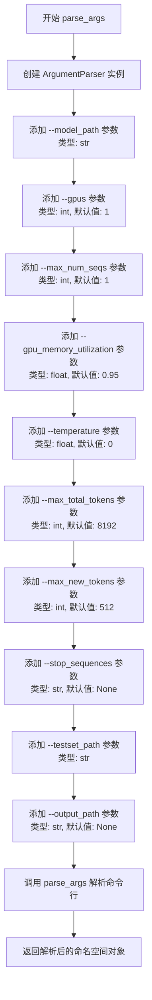
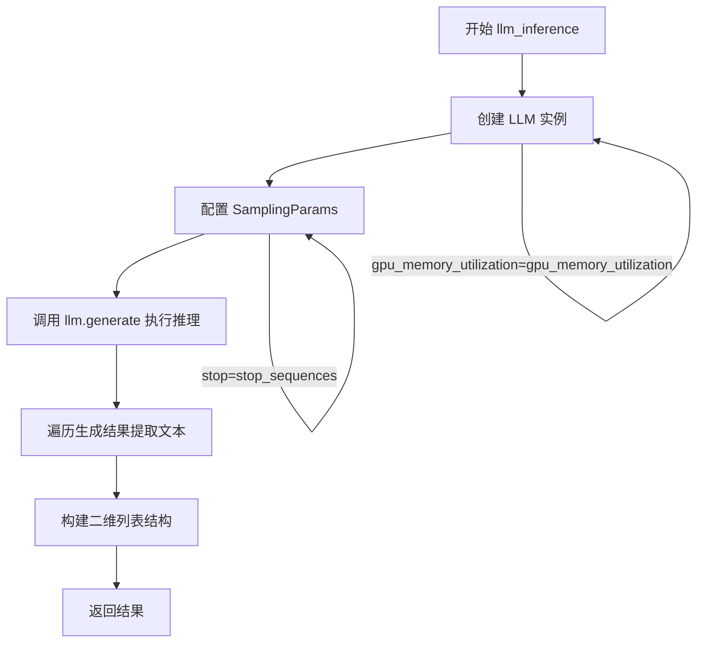

# `LLM4Decompile\sk2decompile\evaluation\llm_server.py` 详细设计文档

该代码是一个基于vLLM框架的大语言模型推理工具，专注于将汇编代码反汇编为对应的C源代码。它通过命令行参数加载预训练模型和配置，读取包含汇编代码提示的JSON测试集，构造特定格式的prompt，利用LLM进行推理生成，最终将生成的C代码结果保存为独立的.c文件。

## 整体流程

```mermaid
graph TD
    A[开始] --> B[parse_args 解析命令行参数]
    B --> C[打开testset_path对应的JSON文件]
    C --> D[遍历samples中的每个样本]
    D --> E[构造prompt: 拼接assembly code和question]
    E --> F[将prompt加入inputs列表]
    F --> D
    D --> G{所有样本处理完毕?}
    G -- 是 --> H[AutoTokenizer.from_pretrained加载tokenizer]
    H --> I{stop_sequences是否为None?}
    I -- 是 --> J[设置stop_sequences为tokenizer.eos_token]
    I -- 否 --> K[使用命令行传入的stop_sequences]
    J --> L[调用llm_inference执行推理]
    K --> L
    L --> M[llm.generate生成结果]
    M --> N[提取output.outputs[0].text]
    N --> O{output_path是否存在?}
    O -- 否 --> P[创建output_path目录]
    O -- 是 --> Q[直接进入下一步]
    P --> Q
    Q --> R[遍历gen_results]
    R --> S[将每个结果写入 idx.c 文件]
    S --> T[结束]
```

## 类结构

```
本代码无类定义
仅包含模块级函数和全局变量
Structure:
├── 全局变量
│   └── inputs: list - 存储待推理的prompt列表
├── 函数
│   ├── parse_args() - 命令行参数解析
│   └── llm_inference() - LLM推理核心逻辑
└── 主程序块
```

## 全局变量及字段


### `inputs`
    
全局变量，存储构造好的prompt列表，用于后续LLM推理

类型：`list`
    


    

## 全局函数及方法


### `parse_args`

解析命令行参数，创建一个 ArgumentParser 对象并配置各种命令行选项，最终返回解析后的参数命名空间。

参数： 该函数没有输入参数。

返回值：`Namespace`（ArgumentParser.parse_args() 返回的命名空间对象），包含所有命令行参数及其解析后的值。

#### 流程图



#### 带注释源码

```python
def parse_args() -> ArgumentParser:
    """
    解析命令行参数并返回包含所有参数值的命名空间对象。
    
    该函数创建一个 ArgumentParser 实例，定义了一系列用于控制
    LLM 推理过程的各种命令行参数，包括模型路径、GPU 配置、
    生成参数、输入输出路径等。
    
    Returns:
        Namespace: 包含所有解析后命令行参数的命名空间对象
    """
    # 创建 ArgumentParser 实例，用于解析命令行参数
    parser = ArgumentParser()
    
    # 添加模型路径参数（必需）
    parser.add_argument("--model_path", type=str)
    
    # 添加 GPU 数量参数，默认值为 1
    parser.add_argument("--gpus", type=int, default=1)
    
    # 添加最大序列数参数，默认值为 1
    parser.add_argument("--max_num_seqs", type=int, default=1)
    
    # 添加 GPU 内存利用率参数，默认值为 0.95
    parser.add_argument("--gpu_memory_utilization", type=float, default=0.95)
    
    # 添加温度参数，用于控制生成多样性，默认值为 0（贪婪搜索）
    parser.add_argument("--temperature", type=float, default=0)
    
    # 添加最大总 token 数参数，默认值为 8192
    parser.add_argument("--max_total_tokens", type=int, default=8192)
    
    # 添加最大新生成 token 数参数，默认值为 512
    parser.add_argument("--max_new_tokens", type=int, default=512)
    
    # 添加停止序列参数，用于控制生成停止条件，默认值为 None
    parser.add_argument("--stop_sequences", type=str, default=None)
    
    # 添加测试集路径参数（必需），指定输入数据文件位置
    parser.add_argument("--testset_path", type=str)
    
    # 添加输出路径参数，指定生成结果的输出目录，默认值为 None
    parser.add_argument("--output_path", type=str, default=None)
    
    # 解析命令行参数并返回包含所有参数值的命名空间对象
    return parser.parse_args()
```


### `llm_inference`

核心推理函数，接收输入文本和模型参数，通过 vLLM 框架加载大语言模型并执行生成任务，最终返回模型生成的文本结果列表。

参数：

- `inputs`：`List[str]`，待推理的输入文本列表，每个元素为一个字符串 prompt
- `model_path`：`str`，大语言模型的权重路径或 HuggingFace 模型标识符
- `gpus`：`int`，用于模型推理的 GPU 数量，默认为 1（张量并行）
- `max_total_tokens`：`int`，模型支持的最大上下文长度，默认为 8192
- `gpu_memory_utilization`：`float`，每个 GPU 的显存占用比例，默认为 0.95
- `temperature`：`float`，生成时的温度参数，控制随机性，默认为 0（ greedy 采样）
- `max_new_tokens`：`int`，生成过程中最大允许生成的 token 数量，默认为 512
- `stop_sequences`：`Optional[List[str]]`，生成停止序列，当生成到该序列时终止，默认为 None

返回值：`List[List[str]]`，二维列表，外层列表长度与输入 inputs 长度一致，内层列表每个元素为包含生成文本的列表（结构为 `[[text1], [text2], ...]`）

#### 流程图



#### 带注释源码

```python
def llm_inference(inputs,
                  model_path,
                  gpus=1,
                  max_total_tokens=8192,
                  gpu_memory_utilization=0.95,
                  temperature=0,
                  max_new_tokens=512,
                  stop_sequences=None):
    """
    核心推理函数，使用 vLLM 框架加载模型并进行文本生成
    
    参数:
        inputs: 待推理的输入文本列表
        model_path: 模型路径或 HuggingFace 模型标识符
        gpus: GPU 数量，用于张量并行
        max_total_tokens: 模型最大上下文长度
        gpu_memory_utilization: GPU 显存占用比例
        temperature: 生成温度，0 为 greedy 采样
        max_new_tokens: 最大生成 token 数
        stop_sequences: 停止序列列表
    
    返回:
        二维列表，每个元素为包含生成文本的列表
    """
    
    # 步骤 1: 初始化 vLLM LLM 实例
    # - model: 指定模型路径或 HuggingFace 模型 ID
    # - tensor_parallel_size: 张量并行度，等于使用的 GPU 数量
    # - max_model_len: 设置模型最大支持上下文长度
    # - gpu_memory_utilization: 控制 GPU 显存使用上限，避免 OOM
    llm = LLM(
        model=model_path,
        tensor_parallel_size=gpus,
        max_model_len=max_total_tokens,
        gpu_memory_utilization=gpu_memory_utilization,
    )

    # 步骤 2: 配置采样参数 SamplingParams
    # - temperature: 控制生成多样性，0 表示确定性 greedy 采样
    # - max_tokens: 单次生成的最大 token 数
    # - stop: 遇到该序列时停止生成
    sampling_params = SamplingParams(
        temperature=temperature,
        max_tokens=max_new_tokens,
        stop=stop_sequences,
    )

    # 步骤 3: 调用 vLLM 的 generate 方法执行推理
    # 返回 RequestOutput 对象列表，每个输入对应一个输出
    gen_results = llm.generate(inputs, sampling_params)

    # 步骤 4: 提取生成文本并转换为目标格式
    # - output.outputs[0].text 包含实际的生成文本
    # - 构建 [[text1], [text2], ...] 格式的二维列表
    gen_results = [[output.outputs[0].text] for output in gen_results]

    # 步骤 5: 返回结果
    return gen_results
```

## 关键组件


### 参数解析模块 (parse_args)

负责解析命令行参数，包括模型路径、GPU数量、内存利用率、采样参数等配置。

### LLM推理引擎 (llm_inference)

封装vLLM的LLM推理能力，负责模型加载、采样参数配置和生成结果的提取。

### 输入准备模块

从JSON测试集加载汇编代码样本，构建符合模型输入格式的prompt。

### 输出保存模块

将LLM生成的C代码逐个保存为独立的.c文件。

### 采样参数配置 (SamplingParams)

配置推理过程中的采样策略，包括温度、最大token数、停止序列等。

### 全局配置

包含环境变量设置（TOKENIZERS_PARALLELISM）和全局输入列表（inputs）。


## 问题及建议


### 已知问题

-   **全局状态污染**：`inputs` 列表在模块级别定义为全局变量，容易导致命名冲突和意外的副作用，且在循环中持续追加会导致内存持续增长
-   **参数冗余与重复定义**：`parse_args()` 返回的参数与 `llm_inference()` 函数参数重复定义，导致维护成本增加且容易出现不一致
-   **路径拼接不安全**：使用字符串拼接 `args.output_path + '/' + str(idx) + '.c'` 构建文件路径，未使用 `os.path.join()`，可能在不同操作系统上出现问题
-   **资源未正确管理**：LLM 实例未显式关闭，缺少上下文管理器或显式的资源释放机制
-   **错误处理缺失**：未检查 `model_path` 有效性、`testset_path` 文件是否存在、JSON 格式是否合法、推理结果是否为空等异常情况
-   **Tokenizer 并行设置时机不当**：`os.environ["TOKENIZERS_PARALLELISM"]` 在模块导入时设置，可能影响同一进程中的其他模块
-   **硬编码字符串**：`before` 和 `after` 提示词字符串硬编码在主逻辑中，不利于国际化或多场景复用
-   **代码复用性差**：主逻辑与推理逻辑强耦合，难以在不修改源码情况下复用到其他场景

### 优化建议

-   **消除全局变量**：将 `inputs` 改为函数内部局部变量或通过参数传递
-   **使用配置对象**：创建配置类（dataclass）或配置字典，统一管理参数，减少重复定义
-   **安全路径操作**：使用 `os.path.join()` 替代字符串拼接
-   **添加异常处理**：对文件读写、模型加载、推理过程添加 try-except 块和适当的错误提示
-   **资源管理**：使用上下文管理器或显式调用 `llm.close()` 释放资源
-   **环境变量设置**：将 `TOKENIZERS_PARALLELISM` 设置移至函数内部或使用更明确的作用域控制
-   **模块化重构**：将提示词构建、结果保存等逻辑拆分为独立函数，提高代码可测试性和可维护性

## 其它


### 设计目标与约束

本项目旨在实现一个基于vLLM的汇编到C源代码的反编译推理工具。设计目标包括：支持大规模语言模型（LLM）的推理任务，将汇编代码转换为等效的C源代码。约束条件包括：依赖GPU进行推理（通过tensor_parallel_size参数支持多GPU），模型最大长度为8192个token，输出最大512个token，支持自定义停止序列，输出结果以单文件形式保存。

### 错误处理与异常设计

代码在文件读取、模型加载、推理过程和文件写入等关键环节缺少异常处理。主要风险点包括：测试集文件路径不存在或格式错误（JSON解析失败）、模型路径无效导致AutoTokenizer或LLM初始化失败、GPU内存不足导致推理崩溃、输出目录创建失败、文件写入失败等。建议添加try-except块捕获FileNotFoundError、json.JSONDecodeError、RuntimeError（GPU相关）、IOError等异常，并提供有意义的错误信息和优雅的退出机制。

### 数据流与状态机

数据流分为三个主要阶段：输入阶段（解析参数→读取JSON测试集→构建prompt模板）、推理阶段（加载tokenizer→初始化LLM→配置SamplingParams→执行推理→解析输出）、输出阶段（创建输出目录→逐个写入.c文件）。状态转换相对简单，呈现线性流程，无复杂状态机设计。输入数据格式要求为JSON数组，每个元素包含"input_asm_prompt"字段。

### 外部依赖与接口契约

主要依赖包括：vLLM（LLM推理框架）、transformers（AutoTokenizer）、argparse（命令行参数解析）、os和json（标准库）。外部接口契约：testset_path必须指向有效的JSON文件，JSON格式必须包含input_asm_prompt字段；model_path必须指向有效的HuggingFace兼容模型目录；output_path为可选参数，默认为None；stop_sequences参数支持字符串或列表格式。

### 性能考虑与优化空间

当前实现存在以下性能问题：1)inputs列表在全局定义，推理前一次性加载所有样本到内存，大数据集可能导致内存溢出；2)未使用批处理优化，vLLM支持max_num_seqs参数可控制批处理大小；3)模型加载未指定trust_remote_code参数，可能导致某些自定义模型加载失败；4)推理结果以列表推导式方式处理，存在额外内存开销。建议采用流式读取测试集、分批推理、使用生成器模式处理大规模数据。

### 安全性考虑

代码存在以下安全隐患：1)直接使用命令行参数构造文件路径，存在路径遍历风险（output_path未做路径验证）；2)生成的C代码直接写入文件，未进行内容安全检查；3)环境变量TOKENIZERS_PARALLELISM设置为true可能引入死锁风险；4)未设置请求超时限制，推理可能无限期等待。建议添加输入验证、路径安全检查、超时控制等安全措施。

### 配置管理

当前配置通过命令行参数传递，配置项包括：model_path（模型路径）、gpus（GPU数量）、max_num_seqs（最大序列数）、gpu_memory_utilization（GPU内存利用率，默认为0.95）、temperature（采样温度，默认为0）、max_total_tokens（最大token数，默认为8192）、max_new_tokens（最大新token数，默认为512）、stop_sequences（停止序列）、testset_path（测试集路径）、output_path（输出路径）。配置缺少版本控制和配置验证机制。

### 并发和资源管理

当前代码为单线程顺序执行，未使用多进程或多线程。资源管理方面：LLM实例在推理完成后未显式释放（依赖GC），GPU资源通过vLLM内部管理，未提供显式的资源清理接口。建议添加上下文管理器模式或显式的资源释放逻辑，确保推理完成后释放GPU内存。

### 日志和监控

代码完全缺少日志输出，无法追踪执行进度、推理耗时、内存使用等关键指标。建议添加logging模块配置，记录关键节点（开始推理、推理完成、文件写入等）的日志信息，便于问题排查和性能监控。

### 测试策略

当前代码无任何单元测试或集成测试。测试策略应包括：1)单元测试：测试parse_args参数解析、prompt构建逻辑、结果解析逻辑；2)集成测试：使用小规模测试集验证完整流程；3)性能测试：评估不同batch size和模型配置的推理速度；4)边界测试：测试空输入、最大token限制、特殊字符处理等边界情况。

### 部署注意事项

部署时需注意：1)确保CUDA版本与vLLM兼容；2)GPU内存需满足gpu_memory_utilization参数要求；3)模型下载需要网络连接或预先准备本地模型；4)输出目录权限需要可写；5)建议使用虚拟环境隔离依赖；6)生产环境建议添加健康检查和监控告警机制。

### 潜在的改进建议

1. 将inputs列表改为生成器模式，支持流式处理大规模数据集；2. 添加参数验证和错误处理；3. 实现断点续传功能，支持增量推理；4. 添加进度条显示推理进度；5. 支持自定义prompt模板；6. 添加推理结果质量评估功能；7. 实现缓存机制，避免重复推理；8. 添加多模态支持或其他推理任务扩展。


    