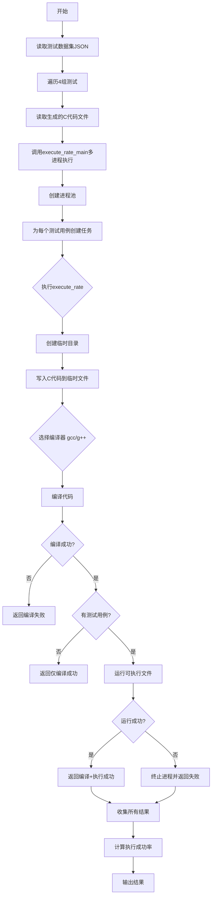
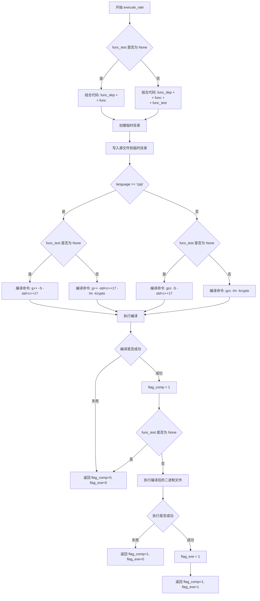
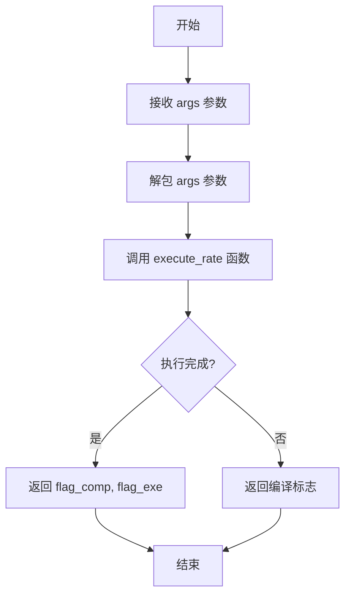
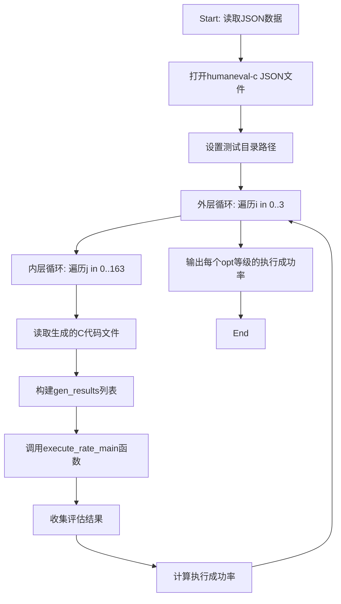

# `LLM4Decompile\sk2decompile\evaluation\metrics\cal_execute_rate.py` 详细设计文档

该代码是一个代码执行评估框架，用于并行编译和运行C/C++代码片段，验证LLM生成的代码正确性，通过多进程池实现高效批量测试，支持gcc/g++编译，统计编译成功率和执行成功率。

## 整体流程



## 类结构

```
该代码为面向过程编程，无类定义
模块级函数: execute_rate, wrapper_func, execute_rate_main
```

## 全局变量及字段


### `current_dir`
    
当前脚本所在目录路径

类型：`str`
    


### `exe_all`
    
存储各组的执行成功率

类型：`list`
    


### `json_new`
    
加载的测试数据集

类型：`dict`
    


### `gen_results`
    
生成的代码结果列表

类型：`list`
    


### `testset`
    
单个测试用例数据

类型：`dict`
    


### `gen_result`
    
单个生成的代码

类型：`str`
    


### `tasks`
    
任务参数列表

类型：`list`
    


### `eval_results`
    
评估结果列表

类型：`list`
    


### `flag_comp`
    
编译成功标志(0/1)

类型：`int`
    


### `flag_exe`
    
执行成功标志(0/1)

类型：`int`
    


### `temp_dir`
    
临时目录路径

类型：`str`
    


### `file_exe`
    
临时C代码文件路径

类型：`str`
    


### `binary_exe`
    
编译后的可执行文件路径

类型：`str`
    


### `compile_command`
    
编译命令列表

类型：`list`
    


### `run_command`
    
运行命令列表

类型：`list`
    


    

## 全局函数及方法


### `execute_rate`

该函数用于编译并运行C/C++代码，根据传入的函数依赖、主函数和可选的测试代码，调用g++或gcc编译器进行编译，若提供测试代码则执行编译后的程序，最终返回编译状态标志和执行状态标志（元组形式）。

参数：

- `func_dep`：`str`，函数依赖代码部分
- `func`：`str`，主函数代码
- `func_test`：`str | None`，测试代码，默认为None
- `timeout`：`int`，编译和执行的超时时间（秒），默认10
- `language`：`str`，编程语言类型（'cpp'或'c'），默认'cpp'
- `opt`：`str`，编译器优化选项，默认'-O0'

返回值：`tuple[int, int]`，返回(flag_comp, flag_exe)元组，其中flag_comp表示编译是否成功（1成功/0失败），flag_exe表示执行是否成功（1成功/0失败）

#### 流程图



#### 带注释源码

```python
def execute_rate(func_dep, func, func_test=None, timeout=10, language='cpp', opt="-O0"):
    """
    编译并运行C/C++代码，返回编译和执行状态标志
    
    参数:
        func_dep: 函数依赖代码
        func: 主函数代码  
        func_test: 测试代码（可选）
        timeout: 超时时间（秒）
        language: 编程语言 ('cpp' 或 'c')
        opt: 编译器优化选项
    
    返回:
        (flag_comp, flag_exe): 编译状态和执行状态的元组
    """
    flag_exe = 0  # 初始化执行状态标志：0表示未成功执行
    flag_comp = 0  # 初始化编译状态标志：0表示未成功编译

    # 根据是否有测试代码决定组合方式
    if func_test!=None:
        # 有测试代码：组合依赖、主函数和测试代码
        func_exe = func_dep + "\n" + func + "\n" + func_test
    else:
        # 无测试代码：仅组合依赖和主函数（仅编译）
        func_comp = func_dep + "\n" + func  

    # 使用临时目录管理编译过程产生的文件
    with tempfile.TemporaryDirectory() as temp_dir:
        pid = os.getpid()  # 获取当前进程ID用于生成唯一文件名
        file_exe = os.path.join(temp_dir, f"exe_{pid}.c")  # 源文件路径
        binary_exe = os.path.join(temp_dir, f"exe_{pid}")  # 编译后的可执行文件路径
        
        # 将代码写入临时源文件
        with open(file_exe, "w") as f:
            f.write(func_exe)
        
        # 根据语言类型和是否有测试代码构建编译命令
        if language == 'cpp':
            if func_test!=None:
                # C++且有测试：完整编译为可执行文件
                compile_command = ["g++", opt, '-std=c++17', file_exe, "-o", binary_exe, "-lm", "-lcrypto"]
            else:
                # C++且无测试：仅编译生成汇编文件（-S选项）
                compile_command = ["g++", opt, '-S', '-std=c++17', file_exe, "-o", binary_exe, "-lm", "-lcrypto"]
        else:
            if func_test!=None:
                # C语言且有测试：完整编译为可执行文件
                compile_command = ["gcc", opt, file_exe, "-o", binary_exe, "-lm"]
            else:
                # C语言且无测试：仅编译生成汇编文件
                compile_command = ["gcc", opt, '-S', file_exe, "-o", binary_exe, "-lm"]

        # 执行编译
        try:
            subprocess.run(compile_command, check=True, timeout=timeout)
            flag_comp = 1  # 编译成功
        except:
            # 编译失败，返回编译状态
            return flag_comp, flag_exe

        # 如果没有测试代码，直接返回编译结果
        if func_test==None:
            return flag_comp, flag_exe
        
        # 有测试代码：运行编译后的可执行文件
        run_command = [binary_exe]
        try:
            process = subprocess.run(run_command, timeout=timeout, check=True)
            flag_exe = 1  # 执行成功
        except:
            # 执行失败，清理进程资源后返回
            if "process" in locals() and process:
                process.kill()
                process.wait()
            return flag_comp, flag_exe
    
    # 编译和执行都成功
    return flag_comp, flag_exe
```


### `wrapper_func`

多进程调用的包装函数，用于解包参数列表并调用 `execute_rate` 函数执行编译和运行任务。

参数：

- `args`：`tuple/list`，包含传递给 `execute_rate` 函数的参数元组，包括 `func_dep`、`func`、`func_test`、`timeout`、`language`、`opt`

返回值：`tuple`，返回 `(flag_comp, flag_exe)` 元组，其中 `flag_comp` 表示编译是否成功（1成功/0失败），`flag_exe` 表示执行是否成功（1成功/0失败）

#### 流程图



#### 带注释源码

```python
def wrapper_func(args):
    """
    多进程调用的包装函数，解包参数并调用 execute_rate
    
    参数:
        args: 包含 execute_rate 函数参数的元组/列表
              格式: [func_dep, func, func_test, timeout, language, opt]
    
    返回值:
        tuple: (flag_comp, flag_exe) 编译和执行状态标志
    """
    # Unpack arguments and call the original function
    # 使用 *args 解包参数，将元组/列表中的元素作为独立参数传递
    return execute_rate(*args)
```


### `execute_rate_main`

该函数是代码评估的主入口，接收测试集和LLM生成的代码结果，通过多进程池并行编译和执行每个测试用例，计算并返回代码执行成功率（成功执行的测试用例数除以总测试用例数）。

参数：

- `testsets`：`list[dict]`，测试集列表，每个字典包含 `func_dep`（函数依赖）、`test`（测试代码）等字段
- `gen_results`：`list[str]`，LLM生成的代码结果列表，与 testsets 一一对应
- `num_workers`：`int`，并行工作进程数，默认为 20
- `timeout`：`int`，编译和执行超时时间（秒），默认为 10
- `language`：`str`，编程语言类型（'cpp' 或 'c'），默认为 'cpp'
- `opt`：`str`，编译优化选项，默认为 '-O0'

返回值：`float`，执行成功率（成功执行的测试用例数除以总测试用例数）

#### 流程图

```mermaid
flowchart TD
    A[开始 execute_rate_main] --> B[创建进程池, 数量=num_workers]
    B --> C[构建任务列表 tasks]
    C --> D[为每个 testset 和 gen_result 组合创建任务参数]
    D --> E[使用 pool.imap 并行执行 wrapper_func]
    E --> F[使用 tqdm 显示进度]
    F --> G[收集所有执行结果 eval_results]
    G --> H[解包结果: comp, exe]
    I[计算成功率: sum(exe) / len(exe)] --> J[返回成功率]
    E --> I
```

#### 带注释源码

```python
def execute_rate_main(testsets, gen_results, num_workers=20, timeout=10, language='cpp', opt="-O0"):
    """
    主函数：创建多进程池并行执行所有测试用例，返回执行成功率
    
    参数:
        testsets: 测试集列表，每个元素包含 func_dep, test 等字段
        gen_results: LLM生成的代码结果列表
        num_workers: 并行工作进程数，默认20
        timeout: 超时时间(秒)，默认10
        language: 编程语言('cpp' 或 'c')，默认'cpp'
        opt: 编译优化选项，默认'-O0'
    
    返回:
        float: 执行成功率
    """
    # 创建进程池，使用指定的worker数量
    with multiprocessing.Pool(num_workers) as pool:
        # 构建任务列表：为每个测试用例组合参数
        # 每个任务包含: [func_dep, gen_result, test, timeout, language, opt]
        tasks = [[testset["func_dep"], gen_result, testset["test"],\
                  timeout, language, opt]
            for testset, gen_result in zip(testsets, gen_results)
        ]
        # 并行执行任务，使用imap保持顺序，tqdm显示进度条
        eval_results = list(tqdm(pool.imap(wrapper_func, tasks), total=len(tasks)))

    # 解包所有结果：comp为编译成功标志，exe为执行成功标志
    comp, exe = zip(*eval_results)       
    # 计算并返回执行成功率
    return sum(exe) / len(exe)
```


### `main block (if __name__ == "__main__")`

这是代码的主入口块，负责读取JSON数据、遍历测试文件、调用评估函数并输出执行成功率。

参数：无（不接受外部参数，路径硬编码）

返回值：无（直接输出到标准输出）

#### 流程图



#### 带注释源码

```python
if __name__ == "__main__":
    # 步骤1: 读取JSON数据 - 加载humaneval-c测试集
    with open('/workspace/llm4binary/benchmark/data/humaneval-c-processed_20250402_2014.json','r') as f:
        json_new = json.load(f)

    # 步骤2: 设置测试文件目录 - LLM生成的代码存放路径
    test_dir = '/workspace/llm4binary/benchmark/text/llm4decompile-1.3b-v1.5-humaneval-c-vllm-ori'
    
    # 初始化结果存储列表
    exe_all = []
    
    # 步骤3: 外层循环 - 遍历4个不同的优化级别(i=0,1,2,3)
    for i in [0,1,2,3]:
        gen_results = []
        
        # 步骤4: 内层循环 - 遍历164个测试用例
        for j in range(164):
            # 读取每个生成的C代码文件
            with open(os.path.join(test_dir, str(j*4+i)+'.c'), 'r') as f:
                gen_results.append(f.read().strip())
        
        # 步骤5: 调用execute_rate_main进行评估
        # 参数: 测试集、生成结果、工作线程数、超时时间、语言、优化级别
        eval_results, comp, exe = execute_rate_main(json_new, gen_results, num_workers=32, timeout=10, language='c', opt="-O0")

        # 步骤6: 收集执行成功率结果
        exe_all.append(exe)
    
    # 步骤7: 输出每个优化级别的执行成功率
    for i in [0,1,2,3]:
        print(f'opt={i}, rate:{exe_all[i]/164.0}')
```

---

### 相关函数信息补充

#### `execute_rate_main(testsets, gen_results, num_workers, timeout, language, opt)`

**参数：**
- `testsets`：list，JSON加载的测试集数据，包含func_dep和test字段
- `gen_results`：list，LLM生成的代码列表
- `num_workers`：int，并行工作进程数（默认20）
- `timeout`：int，超时时间（默认10秒）
- `language`：str，编程语言类型（'cpp'或'c'，默认'cpp'）
- `opt`：str，编译优化级别（默认"-O0"）

**返回值：** `float`，执行成功率（成功执行的测试数/总测试数）

**描述：** 使用多进程池并行执行代码编译和运行测试，评估LLM生成代码的正确性

#### `execute_rate(func_dep, func, func_test, timeout, language, opt)`

**参数：**
- `func_dep`：str，依赖函数代码
- `func`：str，待测试的函数代码
- `func_test`：str，测试代码（可为None）
- `timeout`：int，超时时间
- `language`：str，编程语言
- `opt`：str，编译优化选项

**返回值：** `tuple`，(flag_comp, flag_exe) - 编译标志和执行标志

**描述：** 编译并运行C/C++代码，返回编译和执行是否成功

## 关键组件


### execute_rate 函数

核心编译执行单元，负责将输入的C/C++代码写入临时文件、调用g++/gcc编译、检查编译结果，并在有测试用例时执行编译后的程序并返回编译和执行状态标志。

### wrapper_func 函数

多进程调用包装器，将参数元组解包后传递给execute_rate函数，用于适配multiprocessing.Pool的imap接口。

### execute_rate_main 函数

主并行评估函数，使用multiprocessing.Pool创建进程池，通过imap方法并发执行多个代码的编译和运行任务，使用tqdm显示进度条，最终返回代码执行成功率。

### 主程序流程控制

协调整个基准测试流程，包括读取JSON测试配置、遍历多个生成代码目录、调用execute_rate_main进行批量评估、计算并打印各优化级别下的执行成功率。

### 进程池管理

利用Python的multiprocessing模块实现多进程并发，默认配置20-32个工作进程，通过Pool上下文管理器自动管理进程生命周期。

### 临时文件与目录管理

使用tempfile.TemporaryDirectory创建临时工作目录，为每个编译任务生成唯一的临时C源文件(.c)和可执行文件(.exe)，任务完成后自动清理。

### JSON配置解析

加载包含测试用例的JSON文件，提取每个测试的依赖代码(func_dep)、被测代码(func)和测试用例(func_test)。

### subprocess编译执行

通过subprocess.run调用系统编译器(gcc/g++)，设置超时机制捕获编译和执行超时、编译错误、执行错误等异常情况。

### 参数化编译控制

支持通过opt参数指定编译器优化级别(如-O0、-O2、-O3)，支持C和C++语言切换，支持仅编译(-S选项)或编译加执行两种模式。


## 问题及建议


### 已知问题

-   **异常处理不完善**：捕获异常时使用空except块，没有记录错误信息（如编译失败原因、执行超时等），难以调试和问题定位
-   **资源管理风险**：使用`os.getpid()`作为临时文件标识符存在潜在冲突风险；`process.kill()`和`process.wait()`可能抛出异常但未处理
-   **参数校验缺失**：未对输入参数（如`testsets`、`gen_results`、`num_workers`等）进行有效性验证，可能导致运行时错误
-   **多进程资源泄漏**：使用`multiprocessing.Pool`但未设置`maxtasksperchild`，长期运行可能导致资源累积
-   **代码路径不一致**：`execute_rate`函数在不同分支下返回值形式不统一（有时返回tuple，有时直接返回），main函数中解包`eval_results`的方式与实际返回值不匹配
-   **硬编码路径和魔数**：文件路径和数值（如164、4）硬编码在代码中，降低了可维护性和可配置性
-   **文件IO效率低下**：在循环中逐个打开读取文件，每次调用`execute_rate_main`都重新构建完整的gen_results列表
-   **安全隔离缺失**：直接编译执行LLM生成的代码，没有沙箱隔离机制，存在代码执行风险
-   **日志系统未启用**：导入了loguru但被注释，代码中仅依赖print输出，难以进行生产级调试和监控

### 优化建议

-   完善异常处理：记录编译错误信息、超时原因、执行失败详情；使用结构化日志替代print
-   添加输入参数校验：验证列表长度一致、检查文件存在性、验证num_workers合理范围
-   改进资源管理：使用UUID或时间戳+随机数替代pid作为临时文件标识；添加进程终止的异常保护
-   优化多进程配置：设置`maxtasksperchild`参数避免worker进程资源累积
-   统一返回值语义：明确`execute_rate`的返回类型，使用namedtuple或dataclass增强可读性
-   提取配置常量：将路径、阈值、魔数等提取为配置文件或命令行参数
-   批量文件读取：将同批次文件读取整合为一次性操作，减少IO次数
-   考虑安全隔离：使用容器技术或受限执行环境运行生成的代码
-   启用日志系统：取消logger注释或使用标准logging模块，便于问题追踪和性能监控

## 其它


### 设计目标与约束

本代码的核心目标是在HumanEval-C基准数据集上评估大语言模型生成的C/C++代码的正确性，通过并行编译和执行生成的代码来计算通过率。设计约束包括：1) 只能运行C/C++代码（通过g++/gcc编译器）；2) 超时限制为10秒，防止恶意或无限循环代码占用资源；3) 编译优化级别可配置（默认为-O0）；4) 并行 worker 数量默认为20，可配置；5) 临时文件使用Python的tempfile模块自动管理。

### 错误处理与异常设计

代码采用try-except结构处理编译和执行过程中的异常。编译阶段捕获subprocess.TimeoutExpired和subprocess.CalledProcessError异常，返回flag_comp=0表示编译失败。执行阶段额外捕获异常后，若进程存在则调用kill()和wait()终止进程防止僵尸进程。异常处理粒度较粗，所有编译错误统一返回flag_comp=0，运行时错误统一返回flag_exe=0，缺乏具体的错误分类和详细错误信息收集。

### 数据流与状态机

数据流从JSON配置文件加载测试集（包含func_dep、func、test字段），从指定目录读取模型生成的C代码文件，组合成完整程序后写入临时目录，调用g++/gcc编译，编译成功后执行可执行文件，最后统计执行成功数量计算通过率。状态机包含：编译中(Compiling)、编译成功(Compiled)、执行中(Executing)、执行成功(Executed)、超时/错误(Terminated)五个状态，状态转换仅支持从编译到执行的单向流程。

### 外部依赖与接口契约

外部依赖包括：1) Python标准库（subprocess, os, json, tempfile, multiprocessing, tqdm, argparse, sys）；2) g++/gcc编译器（必须安装且支持C++17）；3) Boost库（libboost-dev）和OpenSSL库（libssl-dev）在apt-get注释中声明但代码实际未使用；4) numpy库（代码导入但未使用）。接口契约：execute_rate()函数接收func_dep依赖代码、func待测代码、func_test测试代码、timeout超时时间、language语言类型、opt编译选项，返回(flag_comp, flag_exe)元组；execute_rate_main()接收测试集、生成结果列表、worker数量等参数，返回执行成功率。

### 资源管理与生命周期

临时资源通过tempfile.TemporaryDirectory()上下文管理器自动管理，退出时自动删除。进程资源通过subprocess.run()的timeout参数和手动kill()/wait()处理。内存资源方面，每个worker独立运行在独立进程中，进程间不共享内存。文件资源包括临时C源文件(.c)和编译产物(可执行文件)，均在临时目录内创建。

### 安全性考量

代码存在严重安全风险：1) 动态编译和执行用户提供的代码，存在代码注入风险；2) 缺乏沙箱隔离，执行的代码拥有Python进程同等权限；3) 未限制系统调用，可能被用于恶意行为；4) 临时文件使用固定命名模式(os.getpid())，存在竞态条件风险。建议添加代码执行沙箱（如docker容器）、限制编译选项、添加代码复杂度/长度限制。

### 并发模型与同步机制

采用multiprocessing.Pool实现进程级并行，使用pool.imap()分发任务确保任务顺序与输入顺序一致。使用tqdm显示进度条，通过list()强制遍历所有结果以等待全部完成。进程池生命周期在execute_rate_main()函数内，函数返回后自动关闭。任务队列使用列表推导式一次性构建，内存占用与任务数成正比。

### 配置与参数设计

主要可配置参数包括：num_workers（并行worker数量，默认20）、timeout（编译和执行超时时间，默认10秒）、language（语言类型，cpp或c，默认cpp）、opt（编译优化级别，默认-O0）、测试集JSON文件路径、生成的代码文件目录路径。这些参数通过execute_rate_main()函数参数传递，缺乏统一的配置管理模块。

### 测试策略与验证方法

代码本身缺乏单元测试和集成测试。验证方法通过在__main__块中实际运行benchmark来验证：加载164个测试用例×4个批次，评估模型生成的代码并计算通过率。正确性验证依赖编译器返回码和可执行文件执行返回码，编译成功但执行失败返回(1, 0)，编译失败返回(0, 0)。

### 日志与监控

代码中已注释掉loguru日志库的导入和使用。当前没有任何日志输出，调试信息仅通过print输出最终通过率。缺乏执行时间监控、内存使用监控、编译错误详情记录、运行时错误详情记录。建议添加结构化日志记录编译警告/错误、收集编译器输出用于调试。

### 潜在技术债务与优化空间

1) 未使用的导入（numpy, traceback）和注释掉的依赖（libboost-dev, libssl-dev）增加代码冗余；2) 硬编码路径（/workspace/llm4binary/...）降低可移植性；3) 缺乏配置管理类，所有参数散布在函数参数中；4) 错误处理粒度过粗，无法区分具体错误类型；5) 串行读取文件（for循环中逐个open）可优化为批量读取；6) 未对生成代码进行预验证（如语法检查），直接编译执行效率低下；7) 缺乏结果缓存机制，重复运行需重新编译执行。

### 关键组件信息

1) execute_rate()：核心执行函数，负责单个测试用例的编译和执行，返回编译和执行状态标志
2) wrapper_func()：multiprocessing的包装函数，将参数元组解包后调用execute_rate()
3) execute_rate_main()：主协调函数，负责构建任务队列、启动进程池、收集结果、计算通过率
4. tempdir管理：使用Python tempfile模块确保临时文件自动清理
5. tqdm进度条：可视化展示并行任务执行进度


    