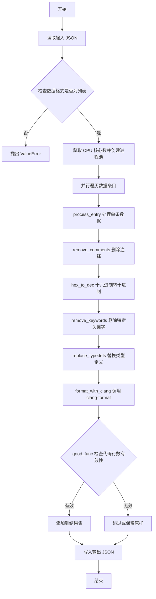
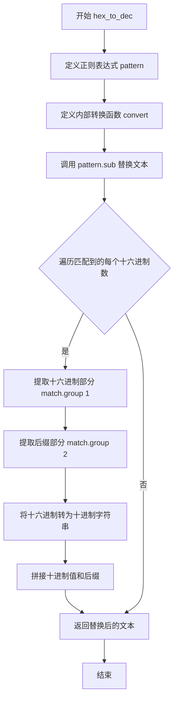
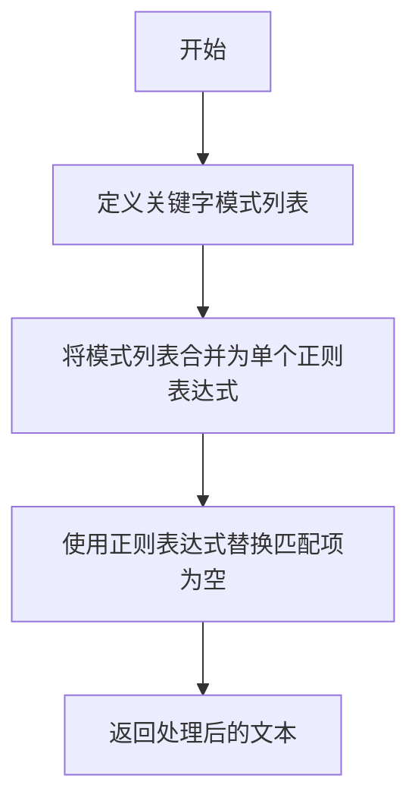
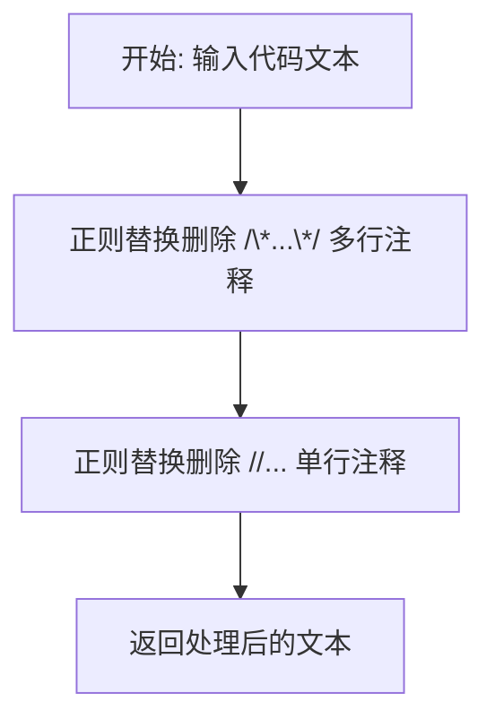
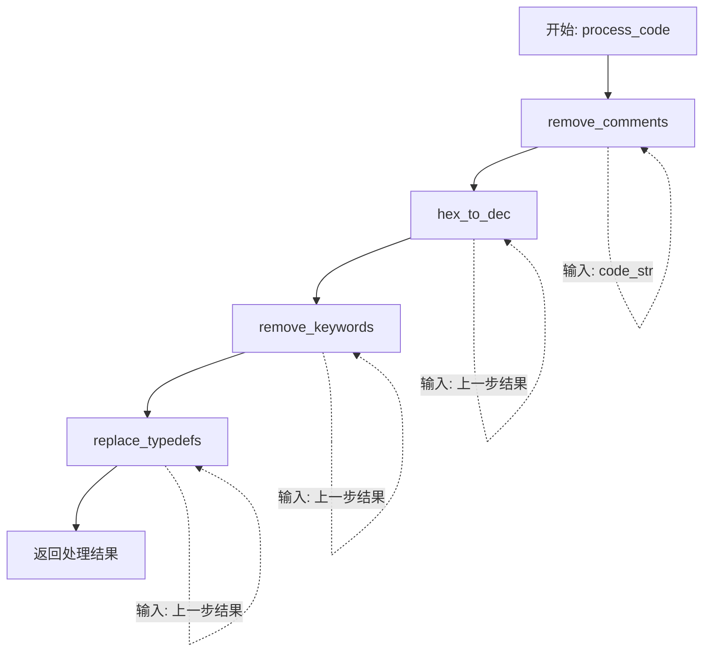
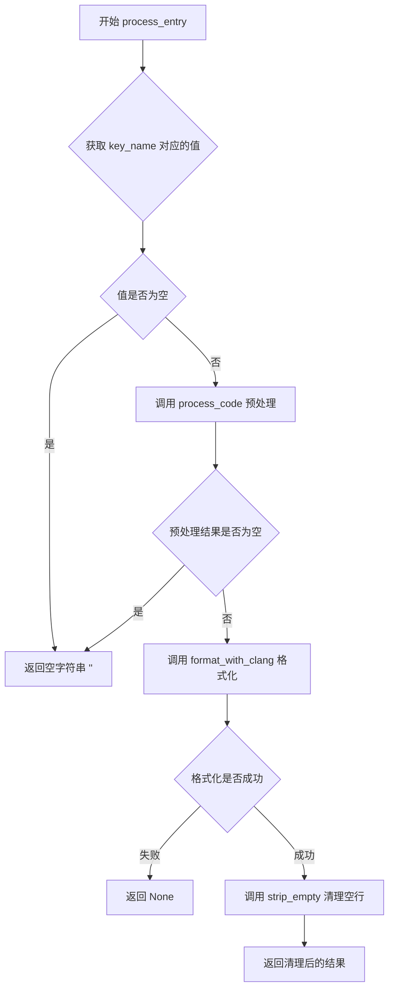
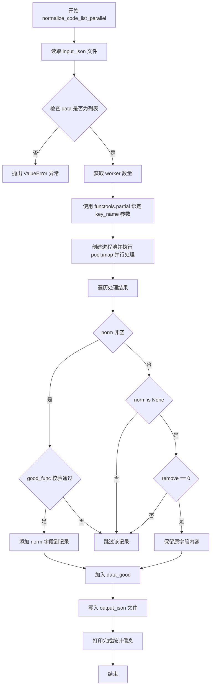

# `LLM4Decompile\sk2decompile\evaluation\normalize_pseudo.py` 详细设计文档

这是一个用于并行处理和规范化 IDA Pro 伪代码的 Python 脚本，其核心功能是通过正则替换十六进制数值、剔除特定关键字、还原 typedef 类型定义、删除注释，并利用 clang-format 格式化代码，最后过滤无效代码块并输出为 JSON。

## 整体流程



## 类结构

```
Script (脚本主入口)
├── Global Variables
│   └── typedef_map (类型映射字典)
└── Functions
    ├── good_func (代码质量校验)
    ├── strip_empty (去除空行)
    ├── format_with_clang (格式化工具包装)
    ├── hex_to_dec (进制转换)
    ├── remove_keywords (关键字清理)
    ├── replace_typedefs (类型重映射)
    ├── remove_comments (注释清理)
    ├── process_code (单条代码处理流水线)
    ├── process_entry (数据条目包装处理)
    └── normalize_code_list_parallel (主逻辑与并行控制)
```

## 全局变量及字段


### `typedef_map`
    
用于将 IDA 伪代码中的特定类型别名（如 cpu_set_t、size_t 等）映射为标准 C 类型的字典，配合 replace_typedefs 函数进行类型规范化

类型：`dict`
    


    

## 全局函数及方法


### `good_func`

该函数用于判断一段函数代码是否为"有效"函数，通过统计代码中非空行（长度≥3）的数量是否在合理范围（4-299行）内来过滤掉过短或过长的无效函数。

参数：

- `func`：`str`，输入的函数代码字符串

返回值：`bool`，如果代码行数在 (3, 300) 区间内返回 True，否则返回 False

#### 流程图

```mermaid
flowchart TD
    A[Start good_func] --> B[Remove everything before first '{']
    B --> C[Split by newline into func_sp list]
    C --> D[Initialize total = 0]
    D --> E{Iterate over each line in func_sp}
    E -->|For each line| F{len(line.strip()) >= 3?}
    F -->|Yes| G[total += 1]
    F -->|No| E
    G --> E
    E -->|After loop| H{total > 3 and total < 300?}
    H -->|Yes| I[Return True]
    H -->|No| J[Return False]
```

#### 带注释源码

```python
def good_func(func):
    """
    判断函数代码是否为有效的函数（行数在合理范围内）
    
    逻辑说明：
    1. 移除函数签名部分（第一个'{'之前的内容）
    2. 统计非空行（长度>=3）的数量
    3. 如果行数在4-299之间，认为是有效函数
    """
    # Step 1: 移除第一个'{'之前的所有内容（包括'{'本身）
    # 假设输入是完整的函数代码，包含函数签名
    func = '{'.join(func.split('{')[1:])
    
    # Step 2: 按行分割
    func_sp = func.split('\n')
    
    # Step 3: 统计有效行数（去除空行和只有1-2个字符的行）
    total = 0
    for line in func_sp:
        # 只统计长度>=3的非空行（排除空行、注释行、单一符号行等）
        if len(line.strip()) >= 3:
            total += 1
    
    # Step 4: 判断是否为合理大小的函数
    # 有效函数：行数 > 3 且 < 300
    if total > 3 and total < 300:
        return True
    return False
```


### `strip_empty`

该函数用于移除代码字符串中的所有空行，只保留非空行，通过过滤空白内容来清理代码格式。

参数：

- `code`：`str`，输入的代码字符串，需要移除空行的原始代码

返回值：`str`，移除空行后的代码字符串

#### 流程图

```mermaid
flowchart TD
    A[开始: strip_empty] --> B[接收代码字符串 code]
    B --> C[调用 splitlines 按行分割]
    C --> D[遍历每一行]
    D --> E{line.strip() 是否为空?}
    E -->|是| F[跳过该行]
    E -->|否| G[保留该行]
    F --> D
    G --> H{是否还有更多行?}
    H -->|是| D
    H -->|否| I[用 '\n' 连接所有保留的行]
    I --> J[返回处理后的字符串]
    J --> K[结束]
```

#### 带注释源码

```python
def strip_empty(code):
    """
    移除代码字符串中的空行
    
    参数:
        code: 输入的代码字符串
        
    返回:
        移除空行后的代码字符串
    """
    # 使用列表推导式过滤空行
    # splitlines() 将字符串按行分割成列表
    # strip() 移除字符串两端的空白字符（包括空格、制表符等）
    # 只有非空行会被保留
    return "\n".join(line for line in code.splitlines() if line.strip())
```


### `format_with_clang`

该函数用于调用系统 `clang-format` 工具对输入的代码字符串进行格式化，支持指定代码风格（如 Google、LLVM 等），若格式化失败则返回 `None`。

参数：

- `func`：`str`，需要格式化的源代码字符串
- `style`：`str`，格式化风格，默认为 "Google"（可选值对应 clang-format 的 --style 参数）

返回值：`str`，格式化后的代码字符串；若输入为空或格式化失败则返回 `None`

#### 流程图

```mermaid
flowchart TD
    A[开始 format_with_clang] --> B{func 是否为空}
    B -- 是 --> C[返回 None]
    B -- 否 --> D[构建命令 cmd = ['clang-format', --style=style]]
    D --> E[调用 subprocess.run 执行 cmd]
    E --> F{执行是否成功}
    F -- 是 --> G[返回 proc.stdout 格式化后的字符串]
    F -- 否 --> H[捕获异常]
    H --> I[返回 None]
```

#### 带注释源码

```python
def format_with_clang(func: str, style: str = "Google") -> str:
    # 检查输入代码字符串是否为空，若为空直接返回 None
    if not func:
        return None
    
    # 构建 clang-format 命令行参数
    # 格式: clang-format --style=Google
    cmd = ["clang-format", f"--style={style}"]
    
    try:
        # 使用 subprocess.run 调用外部 clang-format 工具
        # input=func: 将代码字符串通过 stdin 传入
        # text=True: 使用文本模式（字符串而非字节）
        # capture_output=True: 捕获 stdout 和 stderr
        # check=True: 若返回非零退出码则抛出 CalledProcessError
        # timeout=0.5: 设置超时时间为 0.5 秒，防止 clang-format 挂起
        proc = subprocess.run(
            cmd,
            input=func,
            text=True,
            capture_output=True,
            check=True,
            timeout=0.5
        )
        # 格式化成功，返回 stdout（即格式化后的代码）
        return proc.stdout
    except Exception as e:
        # 捕获所有异常（包括子进程错误、超时等）
        # 异常时返回 None，表示格式化失败
        # 注：原代码中注释掉了打印调试信息的语句
        # print(f"clang-format failed:{e}")
        # print(func)
        # print('-------------------------')
        return None
```


### `hex_to_dec`

该函数用于将文本中的十六进制数字字面量（如 `0x1A`、`0xFF` 等）转换为十进制表示，并保留原有的整数后缀（如 `u`、`U`、`l`、`L` 等），常用于处理 IDA Pro 生成的伪代码中的十六进制常量。

参数：

- `text`：`str`，需要转换的文本字符串，包含需要被转换的十六进制数字

返回值：`str`，转换后的文本字符串，十六进制数字已被替换为十进制表示

#### 流程图



#### 带注释源码

```python
def hex_to_dec(text):
    # 定义正则表达式模式，用于匹配十六进制数字
    # \b: 单词边界，确保匹配完整的十六进制数
    # (0x[0-9a-fA-F]+): 捕获组1，匹配 0x 或 0X 开头的十六进制数
    # ([uUlL]{1,3})?: 捕获组2（可选），匹配 1-3 个 u/U/l/L 后缀（无符号/长整型标记）
    pattern = re.compile(r'\b(0x[0-9a-fA-F]+)([uUlL]{1,3})?\b')
    
    def convert(match):
        # 获取匹配的十六进制部分（不含0x前缀）
        hex_part = match.group(1)
        
        # 获取后缀部分，如果不存在则为空字符串
        suffix = match.group(2) or ""
        
        # 将十六进制字符串转换为十进制整数，再转为字符串
        dec_value = str(int(hex_part, 16))
        
        # 返回十进制数值拼接后缀的字符串
        return dec_value + suffix
    
    # 使用正则替换所有匹配的十六进制数
    # sub 方法会遍历所有匹配项并调用 convert 函数进行转换
    return pattern.sub(convert, text)
```


### `remove_keywords`

该函数用于从文本中删除特定的C/C++编译修饰关键字（如`__fastcall`、`__cdecl`、`__ptr32`、`__noreturn`等），通过正则表达式匹配并替换为空字符串，以净化伪代码输出。

参数：

- `text`：`str`，需要处理的原始文本字符串

返回值：`str`，删除特定关键字后的文本字符串

#### 流程图



#### 带注释源码

```python
# ----------------------------
# 2. 删除特定关键字
# ----------------------------
def remove_keywords(text):
    """
    从文本中删除特定的C/C++编译修饰关键字
    
    Args:
        text: 需要处理的原始文本字符串
        
    Returns:
        删除特定关键字后的文本字符串
    """
    # 定义需要删除的关键字正则表达式模式
    # \b 表示单词边界，确保精确匹配
    patterns = [
        r'\b__fastcall\b',      # fastcall调用约定修饰符
        r'\b__cdecl\b',         # cdecl调用约定修饰符
        r'\b__ptr32\b',        # 32位指针修饰符
        r'\b__noreturn\s+noreturn\b'  # noreturn属性修饰符（双重修饰）
    ]
    
    # 将多个模式用|连接成单个正则表达式，实现或匹配
    combined_pattern = re.compile('|'.join(patterns))
    
    # 使用sub方法将所有匹配到的关键字替换为空字符串（即删除）
    return combined_pattern.sub('', text)
```


### `replace_typedefs`

该函数用于将代码文本中的 typedef 类型别名替换为原始类型，通过遍历预定义的 typedef_map 字典，对每个别名使用正则表达式进行全局替换，从而规范化代码中的类型表示。

参数：

- `text`：`str`，待处理的代码文本字符串

返回值：`str`，将所有 typedef 别名替换为原始类型后的文本字符串

#### 流程图

```mermaid
flowchart TD
    A([开始]) --> B[遍历 typedef_map 中的每个 alias → original]
    B --> C{还有未处理的 alias?}
    C -->|是| D[使用正则表达式\b{alias}\b创建匹配模式]
    D --> E[将文本中的 alias 替换为 original]
    E --> C
    C -->|否| F([返回替换后的文本])
```

#### 带注释源码

```python
def replace_typedefs(text):
    """
    替换代码文本中的 typedef 类型别名为原始类型
    
    参数:
        text: str, 待处理的代码文本字符串
        
    返回:
        str, 替换typedef后的文本字符串
    """
    # 遍历预定义的 typedef_map 字典中的每个类型别名映射
    for alias, original in typedef_map.items():
        # 使用正则表达式创建匹配模式，\b 匹配单词边界确保准确替换
        # re.escape() 转义特殊字符避免正则表达式元字符问题
        pattern = re.compile(rf'\b{re.escape(alias)}\b')
        # 将文本中所有匹配到的别名替换为原始类型
        text = pattern.sub(original, text)
    # 返回完成所有替换后的文本
    return text
```


### `remove_comments`

该函数用于删除代码中的 C 风格多行注释（`/* ... */`）和 C++ 风格单行注释（`// ...`），是代码标准化处理流程中的关键步骤。

参数：

- `text`：`str`，输入的包含注释的代码文本

返回值：`str`，删除注释后的代码文本

#### 流程图



#### 带注释源码

```python
def remove_comments(text):
    """
    删除代码中的 C 风格多行注释和 C++ 风格单行注释
    
    参数:
        text: 输入的代码文本字符串
    
    返回:
        删除注释后的代码文本字符串
    """
    # 删除 C 风格多行注释 /* ... */
    # 使用 re.DOTALL 标志使 . 匹配换行符，从而匹配跨行注释
    text = re.sub(r'/\*.*?\*/', '', text, flags=re.DOTALL)
    
    # 删除 C++ 风格单行注释 // ...
    # 使用 re.MULTILINE 标志使 ^ 匹配每行开始，$ 匹配每行结束
    text = re.sub(r'//.*?$', '', text, flags=re.MULTILINE)
    
    return text
```


### `process_code`

该函数是代码预处理流程的核心入口，负责对输入的代码字符串依次进行注释移除、十六进制转十进制、关键字删除以及 typedef 类型替换四项标准化处理，最终输出清理后的代码文本。

参数：

- `code_str`：`str`，待处理的原始代码字符串

返回值：`str`，经过四项处理后的标准化代码字符串

#### 流程图



#### 带注释源码

```python
# ----------------------------
# 5. 单条伪代码处理
# ----------------------------
def process_code(code_str):
    """
    对单条代码字符串进行标准化预处理
    
    处理流程依次为：
    1. remove_comments - 删除代码中的注释（多行注释 /* */ 和单行注释 //）
    2. hex_to_dec - 将十六进制常量（如 0xFF）转换为十进制表示
    3. remove_keywords - 移除特定编译器关键字（如 __fastcall, __cdecl 等）
    4. replace_typedefs - 将 typedef 定义的自定义类型替换为原始类型
    """
    # 第一步：删除代码中的注释
    code_str = remove_comments(code_str)
    
    # 第二步：将十六进制数字转换为十进制
    code_str = hex_to_dec(code_str)
    
    # 第三步：移除特定的关键字修饰符
    code_str = remove_keywords(code_str)
    
    # 第四步：将 typedef 别名替换为原始类型
    code_str = replace_typedefs(code_str)
    
    # 返回处理完成的代码字符串
    return code_str
```


### `process_entry`

该函数是代码标准化处理流程的核心入口，负责接收单个数据条目，根据指定键名提取伪代码，执行去除注释、类型替换、十六进制转换等预处理操作，随后调用 clang-format 进行代码格式化，并清理空行后返回标准化结果。

参数：

- `entry`：`dict`，待处理的数据条目，包含伪代码内容的字典对象
- `key_name`：`str`，默认为 "pseudo"，指定从 entry 中提取伪代码的键名

返回值：`str` 或 `None`，返回清理格式化后的代码字符串；若输入为空则返回空字符串；若格式化失败则返回 `None`

#### 流程图



#### 带注释源码

```python
def process_entry(entry, key_name='pseudo'):
    """
    处理单个代码条目，提取、预处理并格式化伪代码
    
    参数:
        entry: dict, 输入的数据条目字典
        key_name: str, 要从 entry 中提取的键名，默认为 'pseudo'
    
    返回:
        str 或 None: 格式化并清理后的代码，失败返回 None，空输入返回 ''
    """
    # 从 entry 中根据 key_name 获取原始伪代码，默认为空字符串
    result = process_code(entry.get(key_name, ''))
    
    # 检查预处理后的代码是否为空（仅有空白字符）
    if not result.strip():
        return ''  # 返回空字符串表示该条目无需处理
    
    # 使用 clang-format 对代码进行格式化（使用 Google 风格）
    formatted = format_with_clang(result)
    
    # 如果格式化失败（clang-format 未安装或超时）
    if formatted is None:
        return None  # 返回 None 表示格式化失败
    
    # 移除格式化后的空行，使代码更紧凑
    cleaned = strip_empty(formatted)
    
    # 返回最终清理后的代码
    return cleaned
```


### `normalize_code_list_parallel`

该函数是代码规范化处理管道的主入口，采用多进程并行处理方式读取输入的IDA伪代码JSON数组，经过十六进制转十进制、删除特定关键字、替换typedef类型、删除注释、clang-format格式化等步骤后，输出清洗后的标准化伪代码列表。

参数：

- `input_json`：`str`，输入JSON文件的路径
- `output_json`：`str`，输出JSON文件的路径
- `key_name`：`str`，待处理字段的名称，默认为"pseudo"
- `num_workers`：`int | None`，并行 worker 进程数量，默认为CPU核心数
- `remove`：`int`，当格式化失败时是否移除记录，1为移除，0为保留原内容

返回值：`None`，该函数直接写入文件，无返回值

#### 流程图



#### 带注释源码

```python
def normalize_code_list_parallel(input_json, output_json, key_name='pseudo', num_workers=None, remove=1):
    """
    并行处理 IDA 伪代码列表的主函数
    
    参数:
        input_json: 输入 JSON 文件路径
        output_json: 输出 JSON 文件路径
        key_name: 要处理的字段名，默认为 'pseudo'
        num_workers: 并行进程数，默认为 CPU 核心数
        remove: 格式化失败时是否移除记录，1-移除，0-保留原内容
    """
    # 步骤1: 读取输入 JSON 文件
    with open(input_json, 'r', encoding='utf-8') as f:
        data = json.load(f)

    # 步骤2: 验证输入数据格式，必须为数组
    if not isinstance(data, list):
        raise ValueError("输入 JSON 应为对象数组")

    # 步骤3: 确定并行 worker 数量，默认为 CPU 核心数
    num_workers = num_workers or cpu_count()
    print(f"[+] 开始处理 {len(data)} 条记录，使用 {num_workers} 个进程")

    # 步骤4: 使用 partial 绑定 key_name 参数，生成目标处理函数
    from functools import partial
    process_entry_key = partial(process_entry, key_name=key_name)

    # 步骤5: 创建进程池并执行并行处理
    with Pool(processes=num_workers) as pool:
        # 使用 tqdm 显示处理进度
        result = list(tqdm(pool.imap(process_entry_key, data), total=len(data), desc="Processing"))

    # 步骤6: 过滤和处理结果
    data_good = []
    for record, norm in zip(data, result):
        if norm:  # 格式化成功且结果非空
            if not good_func(norm):  # 检查代码行数是否在合理范围内(3-300行)
                continue
            record[f"{key_name}_norm"] = norm  # 添加标准化字段
            data_good.append(record)
        elif norm is None:  # 格式化失败
            if not remove:  # 如果不移除，则保留原内容
                record[f"{key_name}_norm"] = record[key_name]
                data_good.append(record)

    # 步骤7: 写入输出文件
    with open(output_json, 'w', encoding='utf-8') as f:
        json.dump(data_good, f, indent=2, ensure_ascii=False)

    # 步骤8: 打印处理统计信息
    print(f"[✓] 完成处理：{input_json}:{len(data)} → {output_json}:{len(data_good)}")
```

## 关键组件


### hex_to_dec

将 IDA 伪代码中的十六进制常量转换为十进制表示，支持可选的 C 语言后缀（u、U、l、L 等）。

### remove_keywords

从代码中删除特定的关键字修饰符，如 `__fastcall`、`__cdecl`、`__ptr32` 等用于清理伪代码。

### replace_typedefs

将 C 语言中的 typedef 别名替换为原始基础类型，例如将 `size_t` 替换为 `unsigned int`，将 `_DWORD` 替换为 `uint32_t`。

### remove_comments

移除 C 风格的多行注释（`/* ... */`）和单行注释（`// ...`），保留代码逻辑部分。

### process_code

作为主处理管道，依次调用删除注释、十六进制转换、关键字删除和 typedef 替换四个步骤，对单条伪代码进行标准化处理。

### format_with_clang

调用系统 clang-format 工具对处理后的代码进行格式化，采用 Google 代码风格，支持超时控制，失败时返回 None。

### good_func

过滤函数，根据代码行数（3-300 行之间）判断伪代码是否有效，过滤掉过短或过长的无效代码片段。

### strip_empty

移除代码中的空行，仅保留非空内容行，用于清理格式化后的冗余空白。

### process_entry

包装函数，接受包含伪代码的字典 entry 和 key_name 参数，执行标准化处理、格式化及空行清理，返回规范化后的代码字符串。

### normalize_code_list_parallel

主入口函数，使用多进程池并行处理 JSON 数组中的伪代码列表，支持自定义工作进程数、输出键名和处理失败时的保留策略。

### 命令行参数解析模块

使用 argparse 定义命令行接口，支持输入/输出文件路径、JSON 键名、工作进程数和失败处理策略等参数。


## 问题及建议


### 已知问题

- **正则表达式重复编译效率低下**：在 `replace_typedefs` 函数中，每次调用都对每个 typedef 重新编译正则表达式，应预先编译所有模式
- **全局可变状态**：`typedef_map` 作为全局字典，缺乏封装，难以测试和维护
- **异常处理过于宽泛**：`format_with_clang` 中的 `except Exception` 捕获所有异常，掩盖了具体错误信息
- **硬编码配置**：`clang-format` 超时时间（0.5秒）、进程数默认值（32）、函数行数阈值（3-300）均硬编码，无法灵活配置
- **进度条与多进程组合问题**：`tqdm(pool.imap(...))` 在某些情况下进度显示不准确
- **good_func 函数逻辑脆弱**：通过简单字符串分割和行数统计判断函数有效性，容易被特殊代码模式误导
- **缺乏输入验证**：未检查输入文件是否存在、JSON 格式是否正确、key_name 字段是否缺失
- **资源管理不当**：未根据系统实际 CPU 核心数限制进程数，可能导致资源争抢
- **进度条依赖可选库**：代码依赖 `tqdm` 但未在严格模式下保证其可用性
- **内存占用风险**：一次性加载整个 JSON 到内存，大数据集可能导致 OOM

### 优化建议

- **预编译正则表达式**：使用 `re.compile` 预先编译 `typedef_map` 中的所有模式，避免循环中重复编译
- **配置外部化**：将超时时间、进程数限制、行数阈值等配置提取到配置文件或命令行参数
- **细粒度异常处理**：区分 `subprocess.TimeoutExpired`、`FileNotFoundError` 等具体异常类型
- **添加输入验证**：在处理前检查文件存在性、JSON 结构、必需字段
- **动态进程数计算**：`num_workers = min(num_workers, cpu_count())` 避免过度分配
- **改进 good_func 逻辑**：考虑使用 AST 解析或更健壮的代码分析方式
- **使用标准日志模块**：替换 print 为 logging，支持日志级别和输出控制
- **分块处理流式读写**：对于大文件，采用生成器或分块处理避免一次性加载
- **添加类型注解**：为函数参数和返回值添加类型提示，提高代码可读性
- **单元测试覆盖**：为各独立函数（hex_to_dec、remove_keywords、replace_typedefs 等）编写单元测试

## 其它


### 设计目标与约束

该工具旨在对IDA Pro生成的伪代码进行标准化处理，包括类型转换、格式化和代码清洗，以提高代码可读性和后续分析的准确性。设计目标包括：1) 支持批量处理大规模伪代码数据集；2) 通过多进程并行处理提升性能；3) 提供灵活的命令行参数配置；4) 确保处理失败时不会中断整体流程。约束条件包括依赖clang-format外部工具、处理超时限制为0.5秒、仅支持UTF-8编码的JSON文件输入输出。

### 错误处理与异常设计

代码采用分层错误处理策略：1) format_with_clang函数捕获subprocess异常并返回None；2) process_entry函数处理空字符串和格式化失败的情况；3) normalize_code_list_parallel函数验证输入JSON格式（必须为数组）；4) 主函数通过argparse进行参数校验。异常处理原则是静默失败（返回None或空字符串），由上层调用决定是否保留原始数据。

### 数据流与状态机

数据流经过以下阶段：1) 读取JSON输入；2) 并行处理每个条目；3) 对每条记录依次执行：remove_comments → hex_to_dec → remove_keywords → replace_typedefs → format_with_clang → strip_empty；4) good_func筛选有效代码；5) 写入JSON输出。状态转换由good_func的返回值决定：True表示有效代码保留，False表示过滤，None表示格式化失败但根据remove参数决定是否保留原始数据。

### 外部依赖与接口契约

外部依赖包括：1) clang-format：用于代码格式化，必须在系统PATH中可用；2) tqdm：进度条显示；3) multiprocessing：多进程并行处理；4) argparse：命令行参数解析。输入接口要求JSON文件为对象数组，每个对象包含key_name指定的字段（如pseudo）。输出接口为JSON文件，每条记录包含原始字段和规范化后的字段（{key_name}_norm）。

### 性能考量与优化空间

当前实现使用multiprocessing.Pool进行进程级并行，默认使用cpu_count()个 worker。优化空间包括：1) 对于小数据集，进程创建开销可能大于收益，可添加数据集大小阈值判断；2) 可使用进程池预初始化减少创建开销；3) good_func函数可被优化以减少正则匹配次数；4) 考虑使用共享内存减少进程间数据传输开销。

### 配置与参数说明

主要配置参数包括：1) --input_json：输入文件路径，默认exebench_format_top1p.json；2) --output_json：输出文件路径，默认exebench_format_pseudo_top1p.json；3) --key_name：处理的JSON字段名，默认pseudo；4) --workers：并行 worker 数量，默认32；5) --remove：失败时是否移除记录，1表示移除，0表示保留原始数据。

### 并发与线程安全分析

由于采用进程级并行（multiprocessing.Pool），各 worker 进程拥有独立的内存空间，不存在共享状态竞争问题。process_entry函数为纯函数，无副作用。读取和写入JSON文件在主进程中完成，通过pool.imap分发任务，天然支持并发安全。typedef_map和good_func中的变量均为只读，无线程安全问题。

### 可测试性设计

代码具有较好的可测试性：1) 各处理函数（hex_to_dec、remove_keywords、replace_typedefs、remove_comments、process_code）为纯函数，易于单元测试；2) format_with_clang依赖外部工具，可通过mock进行隔离测试；3) good_func的过滤逻辑（行数3-300）可独立验证；4) 命令行接口可通过argparse直接测试参数解析。

### 版本兼容性与环境要求

代码兼容Python 3.6+，使用标准库multiprocessing、json、re、subprocess、argparse。外部依赖tqdm可通过pip install tqdm安装。要求系统已安装clang-format工具且版本支持--style参数。内存需求取决于输入数据集大小，每个进程会复制处理后的字符串。
    