# `LLM4Decompile\sk2decompile\evaluation\sk2decompile_inf.py` 详细设计文档

这是一个基于LLM的反编译推理脚本，通过两阶段模型将二进制汇编代码逐步转换为源代码：第一阶段使用反编译模型将汇编代码转换为规范化伪代码，第二阶段使用恢复模型将伪代码还原为最终源代码，并支持函数名剥离和结果保存。

## 整体流程

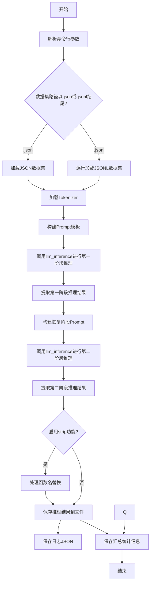

## 类结构

```
该脚本为单文件无类结构设计
所有逻辑在main函数中顺序执行
依赖外部模块: llm_inference, transformers.AutoTokenizer
```

## 全局变量及字段


### `opts`
    
优化级别选项列表 ['O0', 'O1', 'O2', 'O3']

类型：`list[str]`
    


### `current_dir`
    
当前脚本所在目录的绝对路径

类型：`str`
    


### `arg_parser`
    
命令行参数解析器

类型：`ArgumentParser`
    


### `args`
    
解析后的命令行参数对象

类型：`Namespace`
    


### `before`
    
反编译提示词前缀 '# This is the assembly code:\n'

类型：`str`
    


### `after`
    
反编译提示词后缀 '\n# What is the source code?\n'

类型：`str`
    


### `samples`
    
加载的数据集样本列表

类型：`list[dict]`
    


### `tokenizer`
    
HuggingFace分词器对象

类型：`AutoTokenizer`
    


### `inputs`
    
第一阶段推理的输入prompt列表

类型：`list[str]`
    


### `infos`
    
样本元信息列表，包含opt/language/index/func_name

类型：`list[dict]`
    


### `gen_results`
    
第一阶段模型推理结果列表

类型：`list[str]`
    


### `inputs_recovery`
    
第二阶段恢复模型的输入prompt列表

类型：`list[str]`
    


### `before_recovery`
    
恢复阶段提示词前缀 '# This is the normalized code:\n'

类型：`str`
    


### `after_recovery`
    
恢复阶段提示词后缀 '\n# What is the source code?\n'

类型：`str`
    


### `gen_results_recovery`
    
第二阶段恢复模型推理结果列表

类型：`list[str]`
    


### `save_path`
    
推理结果保存路径

类型：`str`
    


### `log_path`
    
日志文件保存路径

类型：`str`
    


### `log_data`
    
日志数据结构

类型：`dict`
    


### `json_path`
    
汇总JSON结果路径

类型：`str`
    


### `stats_path`
    
统计信息文件路径

类型：`str`
    


### `opt_counts`
    
各优化级别样本计数 {'O0':0,'O1':0,'O2':0,'O3':0}

类型：`dict[str, int]`
    


    

## 全局函数及方法


### `llm_inference`

外部导入的LLM推理接口函数，用于调用大型语言模型进行推理生成。

参数：

- `inputs`：`List[str]`，输入的prompt列表，每个元素是一个字符串prompt
- `model_path`：`str`，模型路径，指定要使用的LLM模型路径
- `gpus`：`int`，GPU数量，指定用于推理的GPU设备数量
- `max_total_tokens`：`int`，最大token总数，指定推理过程中最大的token数量限制
- `gpu_memory_utilization`：`float`，GPU内存利用率，指定GPU显存使用比例（0.0-1.0）
- `temperature`：`float`，温度参数，控制生成的随机性，值为0时表示贪婪解码
- `max_new_tokens`：`int`，最大新token数，指定模型生成的最大token数量
- `stop_sequences`：`List[str]`，停止序列列表，当生成到这些序列时停止生成

返回值：`List[List[str]]`，二维列表，外层列表每个元素对应一个输入的推理结果，内层列表通常只包含一个元素（即`gen_result[0]`），是模型生成的文本结果。

#### 流程图

```mermaid
graph TD
    A[开始 llm_inference 调用] --> B[接收输入参数: inputs, model_path, gpus等]
    B --> C[加载指定模型]
    C --> D[对inputs中的每个prompt进行tokenize]
    D --> E[调用LLM模型进行推理生成]
    E --> F[根据stop_sequences判断是否停止]
    F --> G[将生成结果decode为文本]
    G --> H[返回结果列表 List[List[str]]]
```

#### 带注释源码

```python
# 第一次调用：使用主模型进行反编译推理
# inputs: 预处理后的prompt列表，包含汇编代码
# args.model_path: 主模型路径，如 "LLM4Binary/sk2decompile-struct-6.7b"
# args.gpus: GPU数量
# args.max_total_tokens: 32768
# args.gpu_memory_utilization: 0.8
# args.temperature: 0（零温度，确定性输出）
# args.max_new_tokens: 4096
# args.stop_sequences: [tokenizer.eos_token]
gen_results = llm_inference(
    inputs,                    # List[str]: 输入的prompt列表
    args.model_path,           # str: 模型路径
    args.gpus,                 # int: GPU数量
    args.max_total_tokens,    # int: 最大token总数
    args.gpu_memory_utilization, # float: GPU内存利用率
    args.temperature,         # float: 温度参数
    args.max_new_tokens,      # int: 最大新token数
    args.stop_sequences       # List[str]: 停止序列
)

# 提取第一个结果（因为每个输入只生成一个结果）
gen_results = [gen_result[0] for gen_result in gen_results]

# 第二次调用：使用恢复模型进行代码规范化
# inputs_recovery: 包含第一次生成结果的prompt列表
# args.recover_model_path: 恢复模型路径，如 "LLM4Binary/sk2decompile-ident-6.7"
gen_results_recovery = llm_inference(
    inputs_recovery,           # List[str]: 输入的恢复prompt列表
    args.recover_model_path,   # str: 恢复模型路径
    args.gpus,                 # int: GPU数量
    args.max_total_tokens,    # int: 最大token总数
    args.gpu_memory_utilization, # float: GPU内存利用率
    args.temperature,         # float: 温度参数
    args.max_new_tokens,      # int: 最大新token数
    args.stop_sequences       # List[str]: 停止序列
)

# 提取第一个结果
gen_results_recovery = [gen_result[0] for gen_result in gen_results_recovery]
```

> **注意**：`llm_inference`是从外部模块`llm_server`导入的函数，上述源码为调用点的注释说明，并非该函数的具体实现。该函数的具体实现位于`llm_server`模块中，是外部依赖接口。


### `AutoTokenizer.from_pretrained`

外部导入函数：HuggingFace Transformers库的核心方法，用于加载预训练的分词器（Tokenizer），支持自动识别模型架构并加载对应的分词器配置、词汇表和后处理规则。

参数：

- `pretrained_model_name_or_path`：`str`，预训练模型的名称（如 "gpt2"）或本地模型目录路径
- `cache_dir`：`Optional[str]`，可选，指定模型缓存目录
- `force_download`：`bool`，可选，是否强制重新下载已缓存的模型
- `resume_download`：`bool`，可选，是否支持断点续传
- `proxies`：`Optional[Dict[str, str]]`，可选，代理服务器配置
- `use_fast`：`bool`，可选，是否使用Rust实现的快速分词器（默认True）
- `token`：`Optional[str]`，可选，HuggingFace访问令牌用于私有模型认证
- `revision`：`str`，可选，模型版本分支（默认 "main"）
- `subfolder`：`str`，可选，模型在仓库中的子文件夹路径
- `trust_remote_code`：`bool`，可选，是否信任远程代码执行
- `torch_dtype`：`Optional[Union[str, torch.dtype]]`，可选，指定PyTorch数据类型
- `use_safetensors`：`bool`，可选，是否使用safetensors格式加载模型

返回值：`PreTrainedTokenizer`，预训练分词器对象，包含词汇表、编码方法、解码方法及特殊token信息

#### 流程图

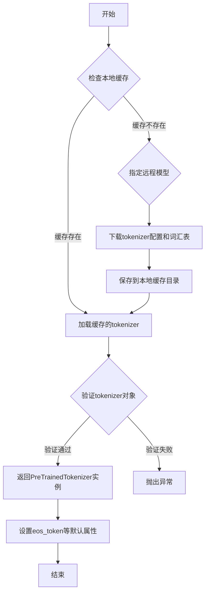

#### 带注释源码

```python
# 从transformers库导入AutoTokenizer类
from transformers import AutoTokenizer

# 调用from_pretrained类方法加载预训练分词器
# 参数args.model_path: 字符串类型，指定预训练模型的名称或本地路径
# 例如: "LLM4Binary/sk2decompile-struct-6.7b"
# 该方法会自动识别模型架构并加载对应的分词器配置
tokenizer = AutoTokenizer.from_pretrained(args.model_path)
```


### `argparse.ArgumentParser`

这是 Python 标准库 `argparse` 模块中的命令行参数解析器类，用于定义和解析命令行参数。代码中通过 `arg_parser = argparse.ArgumentParser()` 创建了一个 ArgumentParser 实例，用于接收用户输入的各种配置参数。

#### 参数

在代码中，`argparse.ArgumentParser()` 未显式传入任何参数，使用全部默认值：

- 无显式参数（使用默认参数）

#### 流程图

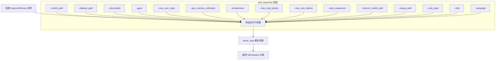

#### 带注释源码

```python
# 导入 argparse 模块（标准库，无需安装）
import argparse

# 创建 ArgumentParser 实例
# 默认参数说明：
# - prog: 程序名（默认取 sys.argv[0]）
# - description: None（无描述信息）
# - epilog: None（无结尾说明）
# - parents: []（无父解析器）
# - formatter_class: RawDescriptionHelpFormatter
# - prefix_chars: '-'
# - fromfile_prefix_chars: None
# - argument_default: None
# - conflict_handler: 'error'
# - add_help: True（自动添加 -h/--help）
arg_parser = argparse.ArgumentParser()

# 添加 --model_path 参数
# 类型: str
# 默认值: "LLM4Binary/sk2decompile-struct-6.7b"
arg_parser.add_argument("--model_path", type=str, default="LLM4Binary/sk2decompile-struct-6.7b")

# 添加 --dataset_path 参数
# 类型: str
# 默认值: 'reverse_sample.json'
arg_parser.add_argument("--dataset_path", type=str, default='reverse_sample.json')

# 添加 --decompiler 参数
# 类型: str
# 默认值: 'ida_pseudo_norm'
arg_parser.add_argument("--decompiler", type=str, default='ida_pseudo_norm')

# 添加 --gpus 参数
# 类型: int
# 默认值: 1
arg_parser.add_argument("--gpus", type=int, default=1)

# 添加 --max_num_seqs 参数
# 类型: int
# 默认值: 1
arg_parser.add_argument("--max_num_seqs", type=int, default=1)

# 添加 --gpu_memory_utilization 参数
# 类型: float
# 默认值: 0.8
arg_parser.add_argument("--gpu_memory_utilization", type=float, default=0.8)

# 添加 --temperature 参数
# 类型: float
# 默认值: 0
arg_parser.add_argument("--temperature", type=float, default=0)

# 添加 --max_total_tokens 参数
# 类型: int
# 默认值: 32768
arg_parser.add_argument("--max_total_tokens", type=int, default=32768)

# 添加 --max_new_tokens 参数
# 类型: int
# 默认值: 4096
arg_parser.add_argument("--max_new_tokens", type=int, default=4096)

# 添加 --stop_sequences 参数
# 类型: str
# 默认值: None
arg_parser.add_argument("--stop_sequences", type=str, default=None)

# 添加 --recover_model_path 参数
# 类型: str
# 默认值: 'LLM4Binary/sk2decompile-ident-6.7'
arg_parser.add_argument("--recover_model_path", type=str, default='LLM4Binary/sk2decompile-ident-6.7', help="Path to the model to recover from, if any.")

# 添加 --output_path 参数
# 类型: str
# 默认值: './result/sk2decompile'
arg_parser.add_argument("--output_path", type=str, default='./result/sk2decompile')

# 添加 --only_save 参数
# 类型: int
# 默认值: 0
arg_parser.add_argument("--only_save", type=int, default=0)

# 添加 --strip 参数
# 类型: int
# 默认值: 1
arg_parser.add_argument("--strip", type=int, default=1)

# 添加 --language 参数
# 类型: str
# 默认值: 'c'
arg_parser.add_argument("--language", type=str, default='c')

# 解析命令行参数
# 返回值类型: argparse.Namespace
# 返回值描述: 包含所有命令行参数的命名空间对象，通过属性访问（如 args.model_path）
args = arg_parser.parse_args()
```


### `json.load`

从标准库加载JSON文件，将JSON格式的文本内容解析为Python对象（通常是字典或列表）。

参数：

-  `fp`：`file object`，文件对象，必须是一个可读的文本文件对象（具有`read()`方法）

返回值：`Any`，返回解析后的Python对象，通常是字典或列表，取决于JSON文件的结构

#### 流程图

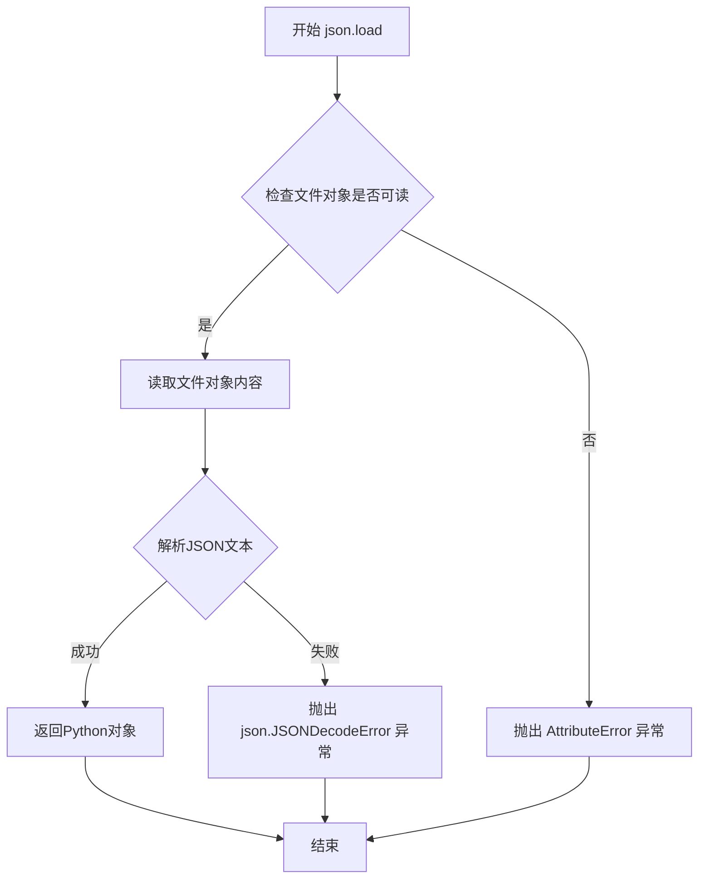

#### 带注释源码

```python
def load(fp, *, cls=None, object_hook=None, parse_float=None, 
         parse_int=None, object_pairs_hook=None, **kw):
    """
    从文件对象中加载JSON数据并解析为Python对象
    
    参数:
        fp: 文件对象, 必须是可读的文本文件对象, 包含有效的JSON文本
        cls: 可选的JSONDecoder类, 用于自定义解码行为
        object_hook: 可选函数, 用于将解码后的字典转换为自定义对象
        parse_float: 可选函数, 用于解析JSON中的浮点数
        parse_int: 可选函数, 用于解析JSON中的整数
        object_pairs_hook: 可选函数, 用于处理键值对列表
        **kw: 传递给JSONDecoder的其他关键字参数
    
    返回值:
        返回解析后的Python对象, 通常是字典或列表
    
    异常:
        json.JSONDecodeError: 当JSON文本格式不正确时抛出
        ValueError: 当fp不是有效的文件对象时抛出
    """
    # 使用默认的JSONDecoder解析文件对象中的内容
    return loads(fp.read(), 
                 cls=cls, 
                 object_hook=object_hook, 
                 parse_float=parse_float, 
                 parse_int=parse_int, 
                 object_pairs_hook=object_pairs_hook, 
                 **kw)
```


### `json.loads`

解析JSON字符串（通常是UTF-8编码的字符串），将其转换为Python对象（如字典、列表等）。

参数：

-  `s`：`str` 或 `bytes` 或 `bytearray`，要解析的JSON字符串
-  `encoding`：`str` 或 `None`，已弃用参数，用于指定字符编码（默认为UTF-8）
-  `cls`：`json.JSONDecoder` 子类或 `None`，自定义JSON解码器类
-  `object_hook`：`callable` 或 `None`，用于将解码后的字典转换为对象的回调函数
-  `parse_float`：`callable` 或 `None`，用于解析浮点数的回调函数（默认将数字解析为float）
-  `parse_int`：`callable` 或 `None`，用于解析整数的回调函数（默认将数字解析为int）
-  `object_pairs_hook`：`callable` 或 `None`，用于处理键值对列表的回调函数

返回值：`任意Python对象`，返回解析后的Python对象（可能是dict、list、str、int、float、bool、None等）

#### 流程图

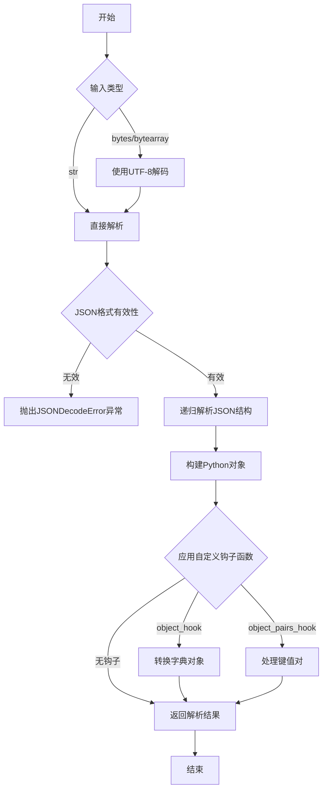

#### 带注释源码

```python
# 以下是 json.loads 在本代码中的使用示例及说明

# 从JSONL文件逐行读取并解析JSON对象
elif args.dataset_path.endswith('.jsonl'):
    samples = []  # 存储解析后的样本列表
    with open(args.dataset_path, "r") as f:  # 打开JSONL文件
        for line in f:  # 遍历文件的每一行
            line = line.strip()  # 去除行首尾的空白字符
            if line:  # 如果行不为空
                # json.loads 将JSON字符串解析为Python对象（字典或列表）
                # 输入: line - JSON格式的字符串（如: {"key": "value"}）
                # 输出: Python字典对象（如: {'key': 'value'}）
                samples.append(json.loads(line))
```

#### 实际使用上下文

```python
# 在本项目中的具体使用场景：
# 解析JSONL格式的数据集文件，每行包含一个独立的JSON对象
# 这些对象包含反编译相关的样本数据

# 输入示例（JSONL文件的一行）:
# {"index": 0, "opt": "O0", "language": "c", "func_name": "main", "ida_pseudo_norm": "..."}

# json.loads 执行后:
# {'index': 0, 'opt': 'O0', 'language': 'c', 'func_name': 'main', 'ida_pseudo_norm': '...'}

# 返回的Python字典可以用于:
# - 访问样本属性: sample["func_name"]
# - 遍历样本数据: for sample in samples
# - 构建提示词: prompt = before + sample[args.decompiler].strip() + after
```


### `json.dump`

将 Python 对象序列化为 JSON 格式并写入文件对象。

参数：

- `log_data`：`dict`，要序列化的日志数据字典，包含推理过程中的各种信息
- `fp`：文件对象，通过 `open(log_path, "w")` 打开的文件，用于写入 JSON 数据
- `indent`：`int`，设置为 2，表示使用 2 个空格进行缩进，使输出的 JSON 文件具有良好的可读性
- `ensure_ascii`：`bool`，设置为 `False`，允许输出非 ASCII 字符（如中文）

返回值：`None`，该函数直接将序列化后的 JSON 写入文件，不返回任何值

#### 流程图

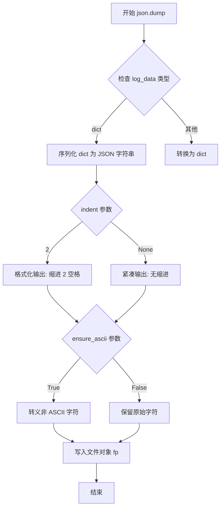

#### 带注释源码

```python
# 将日志数据序列化为 JSON 并写入文件
# log_data: 包含推理过程完整信息的字典
#   - index: 样本索引
#   - opt: 优化级别 (O0/O1/O2/O3)
#   - language: 编程语言
#   - func_name: 函数名
#   - decompiler: 反编译器类型
#   - input_asm: 输入的汇编代码
#   - prompt_model1: 第一个模型的提示词
#   - gen_result_model1: 第一个模型的生成结果
#   - prompt_model2: 第二个模型(恢复模型)的提示词
#   - gen_result_model2: 第二个模型的生成结果
#   - final_result: 最终结果
#   - stripped: 是否剥离了函数名
# fp: 已打开的文件对象，以写入模式打开
# indent=2: 使用 2 个空格缩进，使 JSON 文件可读性更好
# ensure_ascii=False: 保留非 ASCII 字符(如中文注释)

with open(log_path, "w") as f:
    json.dump(log_data, f, indent=2, ensure_ascii=False)
```


### `os.path.exists`

检查给定的路径（文件或目录）是否存在。

参数：
-  `path`：`str`，需要检查的文件或目录路径。

返回值：`bool`，如果路径存在返回 `True`，否则返回 `False`。

#### 流程图

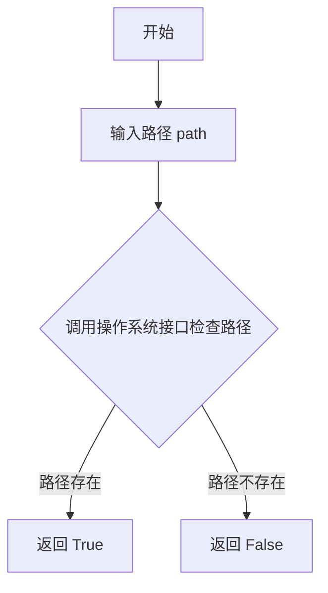

#### 带注释源码

```python
# 检查输出路径是否已经存在
if os.path.exists(args.output_path):
    # 如果存在，则删除整个目录树，以避免混合新旧结果
    shutil.rmtree(args.output_path)
```

---

### `os.path.join`

将多个路径组件智能地拼接成一个路径字符串，自动处理路径分隔符。

参数：
-  `path`：`str`，初始路径组件。
-  `*paths`：`str`，可变数量的后续路径组件。

返回值：`str`，拼接后的完整路径字符串。

#### 流程图

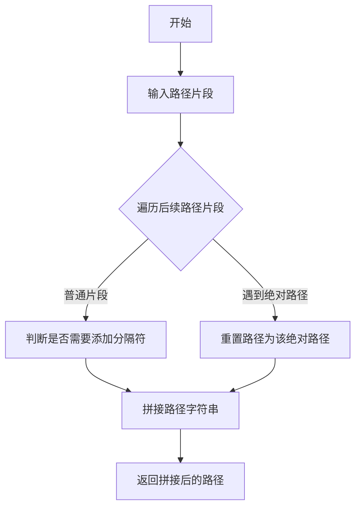

#### 带注释源码

```python
# 为每个优化等级（如 O0, O1, O2, O3）创建对应的输出子目录
for opt in opts:
    os.makedirs(os.path.join(args.output_path, opt))

# 构建最终结果文件的保存路径：./result/sk2decompile/O2/123_O2.c
save_path = os.path.join(args.output_path, opt, f"{original_index}_{opt}.{language}")

# 构建日志文件和统计文件的路径
json_path = os.path.join(args.output_path, 'inference_results.jsonl')
stats_path = os.path.join(args.output_path, 'inference_stats.txt')
```

---

### `os.path.dirname`

返回路径的目录部分，即去掉文件名或路径的最后一个组件。

参数：
-  `path`：`str`，文件或目录的路径。

返回值：`str`，路径的目录部分。

#### 流程图

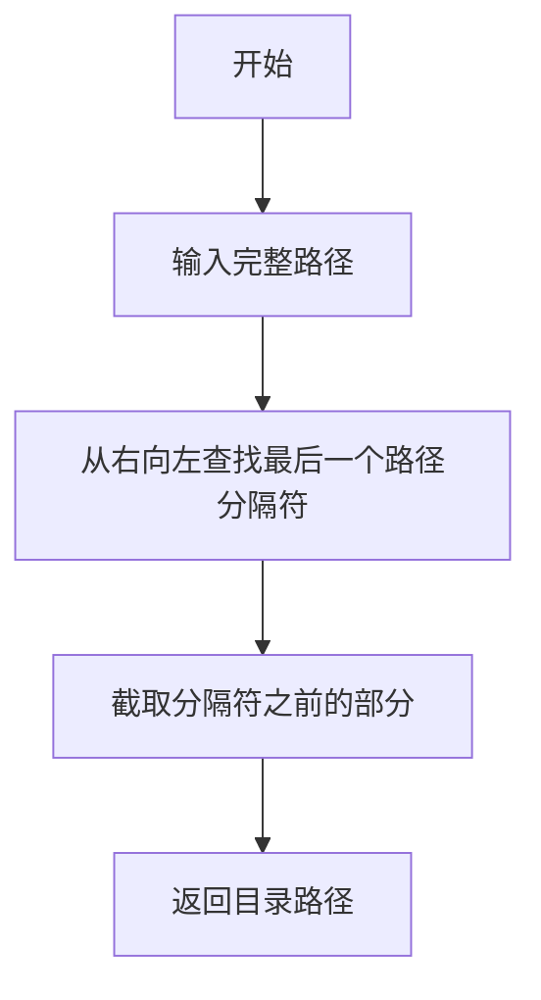

#### 带注释源码

```python
# 获取当前脚本文件所在的目录路径
# 1. __file__ 获取当前文件的相对路径
# 2. os.path.abspath 将其转换为绝对路径
# 3. os.path.dirname 提取其所在目录
current_dir = os.path.dirname(os.path.abspath(__file__))
```

---

### `os.path.abspath`

将相对路径转换为绝对路径。通常用于确保路径解析基于当前工作目录（CWD）。

参数：
-  `path`：`str`，相对路径或绝对路径。

返回值：`str`，绝对路径字符串。

#### 流程图

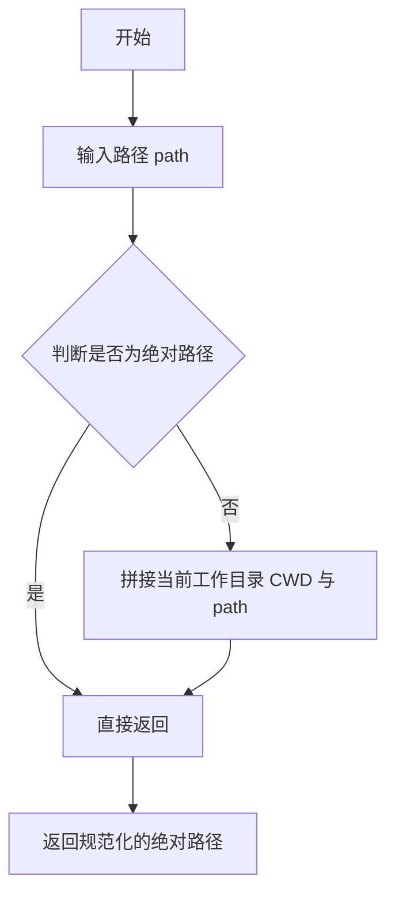

#### 带注释源码

```python
# 获取当前脚本文件的绝对路径，并提取其所在目录
# 这一步常用于确定项目根目录或配置文件的相对路径基准
current_dir = os.path.dirname(os.path.abspath(__file__))
```


### `shutil.rmtree`

删除指定目录及其所有内容，用于清理输出目录以便重新生成结果。

参数：

-  `path`：`str`，要删除的目录路径，由命令行参数 `--output_path` 提供
-  `ignore_errors`：可选参数，代码中未使用，默认为 `False`
-  `onerror`：可选参数，代码中未使用，默认为 `None`

返回值：`None`，该函数无返回值，执行副作用（删除目录树）

#### 流程图

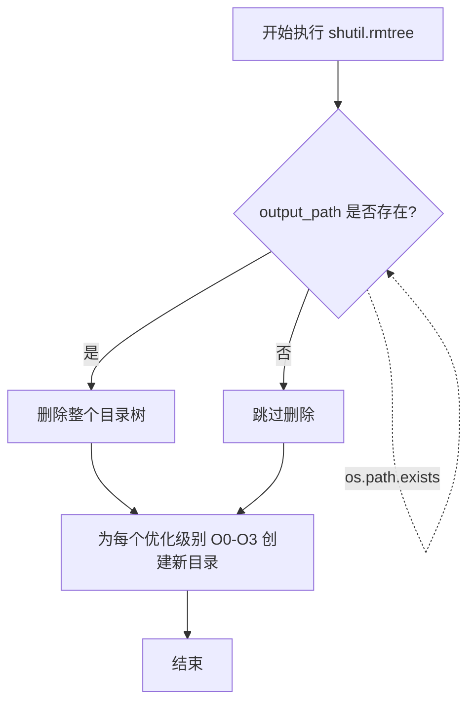

#### 带注释源码

```python
# 检查是否指定了输出路径
if args.output_path:
    # 如果输出目录已存在，先删除整个目录树以清理旧结果
    # 这确保每次运行都是全新的开始，避免旧文件干扰
    if os.path.exists(args.output_path):
        shutil.rmtree(args.output_path)
    
    # 为每个优化级别（O0, O1, O2, O3）创建独立的输出子目录
    for opt in opts:
        os.makedirs(os.path.join(args.output_path, opt))
```

#### 使用场景说明

该函数在代码中的作用是：

1. **清理旧结果**：在重新运行推理任务时，删除之前生成的所有输出文件、目录和日志
2. **目录重建**：删除后立即为每个优化级别（O0-O3）创建对应的子目录结构
3. **确保一致性**：避免旧结果与新结果混合，保证输出目录的纯净性


### `tqdm`

`tqdm` 是一个 Python 外部库，用于在循环中显示进度条，提供直观的迭代进度可视化。在本代码中通过 `from tqdm import tqdm` 导入但未实际使用。

#### 带注释源码

```python
# 导入语句（在代码文件顶部）
from tqdm import tqdm

# tqdm 库的标准用法示例（代码中虽导入但未使用）
# 用法1：直接包装可迭代对象
# for i in tqdm(range(100)):
#     do_something()

# 用法2：手动控制进度条
# pbar = tqdm(total=100)
# for i in range(100):
#     pbar.update(1)
# pbar.close()

# 用法3：带描述的进度条
# for i in tqdm(range(100), desc="Processing"):
#     do_something()
```

#### 参数信息

- `iterable`：可迭代对象，可选，要包装的可迭代对象
- `desc`：字符串，可选，进度条左侧的描述文字
- `total`：整数，可选，预期迭代总数
- `unit`：字符串，可选，默认 "it"，计数单位名称
- `ncols`：整数，可选，进度条宽度
- `leave`：布尔值，可选，默认为 True，迭代结束后是否保留进度条
- `file`：文件对象，可选，默认输出到 stderr
- `colour`：字符串，可选，进度条颜色

#### 返回值

- **类型**：`tqdm` 对象（迭代器）
- **描述**：返回一个包装后的迭代器，迭代时自动更新进度条

#### 流程图

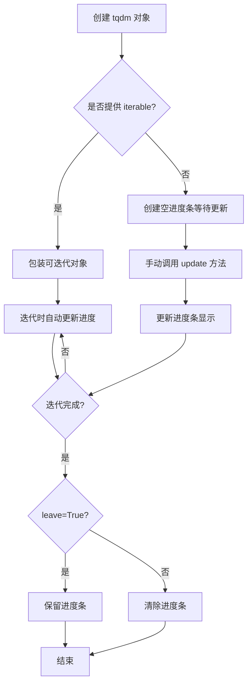

#### 潜在的技术债务或优化空间

1. **未使用的导入**：代码导入了 `tqdm` 但未使用，造成了不必要的依赖。建议移除未使用的导入以保持代码整洁。
2. **如需使用进度条**：当前代码处理大量样本时没有进度提示，建议在 `for sample in samples:` 循环处添加 tqdm 以显示推理进度，提升用户体验。

## 关键组件


### 命令行参数解析模块

负责解析用户提供的各种参数，包括模型路径、数据集路径、GPU配置、推理参数等，提供灵活的配置选项。

### 数据加载模块

支持加载JSON和JSONL格式的数据集，解析反编译样本数据，为后续推理提供输入数据。

### Prompt构建模块

构建两阶段推理所需的提示词，包括模型1的反编译提示词（汇编代码到规范化代码）和模型2的恢复提示词（规范化代码到源代码）。

### LLM推理模块

调用llm_inference函数执行两阶段模型推理：第一阶段将汇编代码反编译为规范化代码，第二阶段将规范化代码恢复为最终源代码。

### 函数名Stripping模块

处理生成代码中的函数名，将模型生成的函数名替换为原始函数名，确保输出代码的函数名与原始二进制文件一致。

### 结果保存模块

将推理结果按优化级别保存到对应目录，生成详细的JSON日志文件，以及统计信息文件。


## 问题及建议


### 已知问题

- **硬编码优化级别列表**：`opts = ["O0", "O1", "O2", "O3"]` 硬编码了优化级别，若数据集中包含其他级别（如Os）会导致目录创建失败或保存路径错误
- **未使用的导入**：`tqdm` 被导入但未在推理过程中使用进度条展示
- **缺少错误处理**：文件读取、模型加载、LLM推理失败时程序会直接崩溃，缺乏异常捕获和重试机制
- **缺少参数校验**：`args.gpus`、`args.max_new_tokens` 等关键参数未做有效性校验，负数或零值可能导致异常
- **大数据集内存风险**：所有样本数据、推理结果一次性加载到内存，大数据集场景下可能导致OOM
- **函数名处理逻辑脆弱**：`func_name_in_gen` 的提取和替换逻辑依赖特定格式，泛化能力不足
- **重复代码块**：两次调用 `llm_inference` 传递大量相同参数，可封装为函数减少重复
- **路径安全风险**：直接使用 `shutil.rmtree(args.output_path)` 删除输出目录，若路径配置错误可能导致误删重要数据
- **缺少日志记录**：仅使用 `print` 输出状态，无结构化日志，排查问题困难
- **未使用配置文件**：所有参数硬编码在代码中，缺乏配置管理机制
- **未验证的依赖假设**：假设 `sample` 字典中必然存在 `args.decompiler`、`opt`、`func_name` 等键，缺失时会导致 KeyError
- **文件覆盖风险**：保存结果时直接覆盖已有文件，无备份机制

### 优化建议

- 将优化级别列表参数化，从数据集动态获取或作为命令行参数传入
- 移除未使用的 `tqdm` 导入，或在推理循环中添加进度条
- 添加 try-except 块捕获文件读取、模型加载、推理异常，记录错误日志并跳过失败样本继续处理
- 对关键数值参数添加校验逻辑，如 `gpus > 0`、`max_new_tokens > 0` 等
- 实现批量处理或流式处理机制，分批加载数据和保存结果，避免内存溢出
- 使用正则表达式或更鲁棒的 AST 解析方式处理函数名提取和替换
- 抽取公共参数构建字典，使用 `**kwargs` 简化 `llm_inference` 调用
- 输出目录删除前增加确认逻辑或使用唯一性命名（如时间戳）避免误删
- 引入 Python `logging` 模块替代 print，实现分级日志记录
- 使用配置文件（如 YAML/JSON）或环境变量管理参数，支持不同部署场景
- 在访问 sample 字典前使用 `.get()` 方法并提供默认值，或提前进行数据校验
- 保存文件前检查文件是否存在，支持可选的备份策略


## 其它


### 设计目标与约束

本项目的设计目标是利用两个级联的LLM模型（结构模型和恢复模型）实现从二进制汇编代码到高级语言源代码的反编译功能。主要约束包括：模型推理受限于GPU显存（默认80%利用率），单次推理token数量上限为32768，单次生成token上限为4096，支持的优化级别仅为O0/O1/O2/O3。

### 错误处理与异常设计

代码主要采用防御式编程进行错误处理：1) 使用try-except捕获文件读写异常；2) 对JSON解析使用json.JSONDecodeError处理；3) 对模型路径不存在的情况未做显式检查，依赖底层库抛异常；4) 对空样本或格式不正确的样本未做过滤，可能导致后续推理出错；5) 缺失日志记录异常处理，当写入日志失败时程序会中断。

### 数据流与状态机

数据流主要经历以下状态：1) 初始化状态：解析命令行参数、加载tokenizer；2) 数据加载状态：从JSON/JSONL文件读取样本；3) 第一阶段推理：调用结构模型进行反编译；4) 第二阶段推理：调用恢复模型优化代码；5) 后处理状态：函数名替换和结果保存。各状态之间通过samples列表和gen_results传递数据，状态转换失败时无回滚机制。

### 外部依赖与接口契约

主要外部依赖包括：1) llm_server.llm_inference函数，接受(inputs, model_path, gpus, max_total_tokens, gpu_memory_utilization, temperature, max_new_tokens, stop_sequences)参数，返回二维列表；2) transformers.AutoTokenizer.from_pretrained，接受model_path返回tokenizer对象；3) 命令行参数约束：model_path和recover_model_path必须为有效的HuggingFace模型标识符或本地路径，dataset_path必须为.json或.jsonl文件，decompiler字段必须在sample中存在。

### 配置与参数管理

所有配置通过argparse统一管理，支持12个命令行参数：model_path（主模型路径）、dataset_path（数据集路径）、decompiler（反编译器类型）、gpus（GPU数量）、max_num_seqs（未实际使用）、gpu_memory_utilization（显存利用率）、temperature（采样温度）、max_total_tokens（最大token数）、max_new_tokens（最大生成长度）、stop_sequences（停止序列）、recover_model_path（恢复模型路径）、output_path（输出路径）、only_save（未实际使用）、strip（是否替换函数名）、language（目标语言）。

### 性能考虑与资源管理

代码在性能方面存在以下特点：1) 使用tqdm库但未实际用于进度显示；2) 推理过程为串行处理，未利用批处理加速；3) 样本数据全部加载到内存，可能导致大数据集OOM；4) GPU显存利用率固定为80%，未根据实际GPU数量动态调整；5) 每个样本独立推理，未做批量推理优化。

    