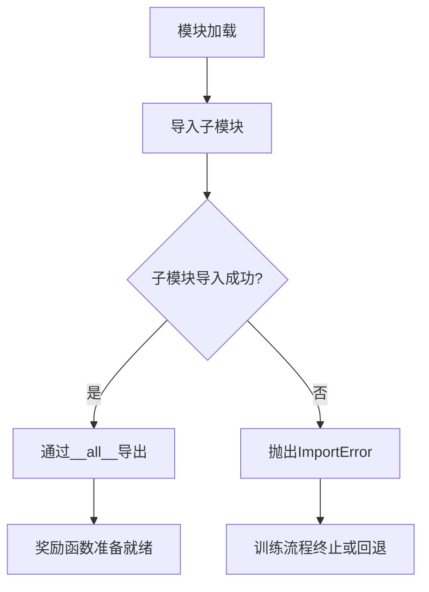

# `LLM4Decompile\sk2decompile\verl\SK2DECOMPILE\reward_functions\__init__.py` 详细设计文档

SK2Decompile 项目的奖励函数模块入口文件，导出四个参考奖励函数实现（exe_type、sim_exe、embedding_gte、embedding_qwen3），用于 GRPO 训练流程中的奖励计算。这些实现分别基于编译性+标识符Jaccard相似度、编译性+词级Jaccard相似度、Tree-sitter+GTE嵌入余弦相似度以及Tree-sitter+Qwen3嵌入余弦相似度。

## 整体流程



## 类结构

```
SK2Decompile_reward_functions (包)
├── __init__.py (入口模块)
├── exe_type (子模块)
├── sim_exe (子模块)
├── embedding_gte (子模块)
└── embedding_qwen3 (子模块)
```

## 全局变量及字段


### `__all__`
    
导出符号列表，定义模块公开接口

类型：`list`
    


    

## 全局函数及方法


## 关键组件


### exe_type

可编译性检查结合占位符标识符Jaccard相似度的奖励函数实现

### sim_exe

可编译性检查结合词级别Jaccard相似度的奖励函数实现

### embedding_gte

基于Tree-sitter的标识符提取结合GTE嵌入余弦相似度的奖励函数实现

### embedding_qwen3

基于Tree-sitter的标识符提取结合Qwen3嵌入余弦相似度的奖励函数实现


## 问题及建议


### 已知问题

- **模块入口文件过于简单**：该`__init__.py`仅重导出四个子模块，缺乏任何配置、初始化逻辑或统一接口定义
- **缺少统一的奖励函数接口规范**：四个奖励函数（exe_type、sim_exe、embedding_gte、embedding_qwen3）可能采用不同的函数签名和返回值格式，缺乏标准化约定
- **文档与实现脱节**：模块文档提及"Tree-sitter identifier extraction"等实现细节，但入口文件未提供任何抽象层或辅助函数来统一这些操作
- **集成过程复杂且易出错**：文档要求手动复制文件到`verl/utils/reward_score/`并修改`__init__.py`，缺乏自动化部署机制
- **无版本控制和变更追踪**：缺少`__version__`或`__release__`等版本标识
- **缺乏单元测试和集成测试**：未提供测试套件，无法验证奖励函数的正确性和性能基准
- **外部依赖声明不明确**：模块依赖Tree-sitter、GTE、Qwen3等库，但未通过`pyproject.toml`或`requirements.txt`声明
- **错误处理机制缺失**：未定义统一的异常类或错误码，奖励计算失败时的行为未定义

### 优化建议

- **设计统一的奖励函数基类或协议**：定义抽象基类`BaseRewardFunction`，规范`compute_reward(decompiled_code, ground_truth_code)`等接口方法，确保返回格式一致（如`{"score": float, "details": dict}`）
- **提取公共逻辑到共享模块**：将Tree-sitter标识符提取等重复逻辑抽象为独立工具函数，四个奖励函数通过组合这些工具实现差异化
- **引入配置类或配置文件**：使用`dataclass`或`pydantic`定义奖励函数参数（如阈值、权重、模型选择），提高灵活性
- **实现自动化集成脚本**：提供`setup.py`或`setuptools`配置，自动安装到目标路径并注册模块
- **添加版本元数据**：定义`__version__ = "1.0.0"`和`__paper__ = "arXiv:2509.22114"`，便于追踪
- **构建测试覆盖**：使用`pytest`编写单元测试，验证各奖励函数的数值正确性，并添加性能基准测试
- **明确依赖管理**：在`pyproject.toml`中声明所有运行时和开发依赖，纳入版本约束
- **设计异常体系**：定义`RewardComputationError`等自定义异常，区分"编译失败"、"模型推理错误"等不同场景

## 其它


### 设计目标与约束

本模块的设计目标是提供标准化的奖励函数接口，用于SK2Decompile的GRPO（Group Relative Policy Optimization）训练流程。约束条件包括：1）必须与VERL框架集成；2）奖励函数需返回可微分的浮点数分数；3）模块需保持轻量级以减少训练开销；4）各奖励函数需支持批量处理以提高吞吐量。

### 错误处理与异常设计

由于本文件为包初始化文件，错误处理主要依赖子模块实现。预期异常包括：1）导入子模块失败（ModuleNotFoundError）可能导致训练中断；2）子模块内部计算异常应返回负无穷或零分以保证训练稳定性；3）建议在VERL框架层面添加异常捕获机制，避免单个样本错误影响整个批次。

### 数据流与状态机

数据流为：VERL框架输入（源代码对）→奖励函数路由选择→子模块计算→返回奖励分数→GRPO策略更新。本文件作为路由入口，根据配置选择对应的奖励函数模块。状态机涉及奖励函数的初始化状态、计算状态和结果返回状态。

### 外部依赖与接口契约

外部依赖包括：1）Tree-sitter用于代码解析和标识符提取；2）GTE和Qwen3 embedding模型用于语义相似度计算；3）VERL框架用于训练集成。接口契约：所有奖励函数需接受（源代码, 反编译代码）对，输出浮点型奖励分数，值域范围通常为[0,1]或[-1,1]。

### 配置与参数说明

本模块无直接配置参数，配置通过子模块和VERL框架传递。关键配置项包括：1）奖励函数类型选择（exe_type/sim_exe/embedding_gte/embedding_qwen3）；2）Jaccard相似度阈值；3）Embedding模型路径和版本；4）编译命令配置。

### 性能考虑

性能瓶颈主要集中在：1）Tree-sitter解析大文件时的CPU开销；2）Embedding模型推理延迟；3）编译检查的IO操作。优化建议：1）使用批处理减少模型推理次数；2）实现缓存机制存储已计算结果；3）考虑使用轻量级embedding模型。

### 安全性考虑

代码安全性：1）子模块执行外部编译命令需进行输入校验，防止命令注入；2）下载外部模型需验证完整性；3）处理用户提供的代码片段需在沙箱环境中执行。数据安全性：编译产物需及时清理，避免信息泄露。

### 使用示例

```python
# VERL框架集成示例
from verl.utils.reward_score import exe_type, sim_exe, embedding_gte, embedding_qwen3

# 配置奖励函数
reward_fn = exe_type.reward_function  # 编译性+标识符Jaccard
# 或
reward_fn = embedding_gte.reward_function  # GTE embedding相似度

# 训练循环中调用
rewards = reward_fn(source_codes, decompiled_codes)
```

### 参考文献

1. SK2Decompile: LLM-based Two-Phase Binary Decompilation from Skeleton to Skin (arXiv:2509.22114) - Section 3.5奖励函数设计
2. VERL框架官方文档 - 奖励函数集成指南
3. Tree-sitter官方文档 - 代码解析API
4. GTE/Qwen3模型论文 - Embedding相似度计算方法
    