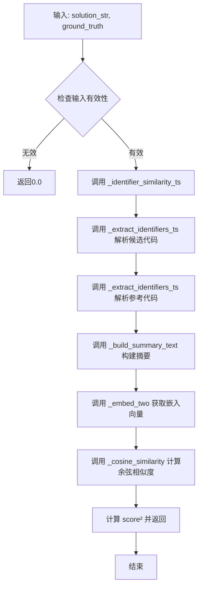
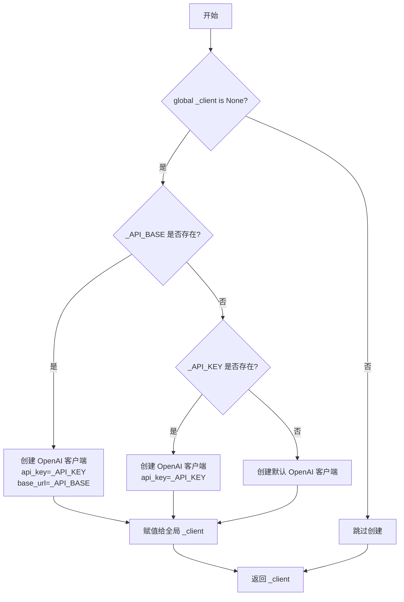
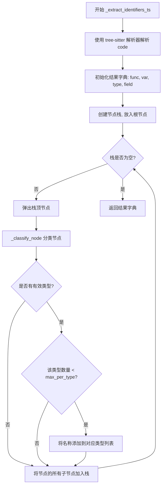
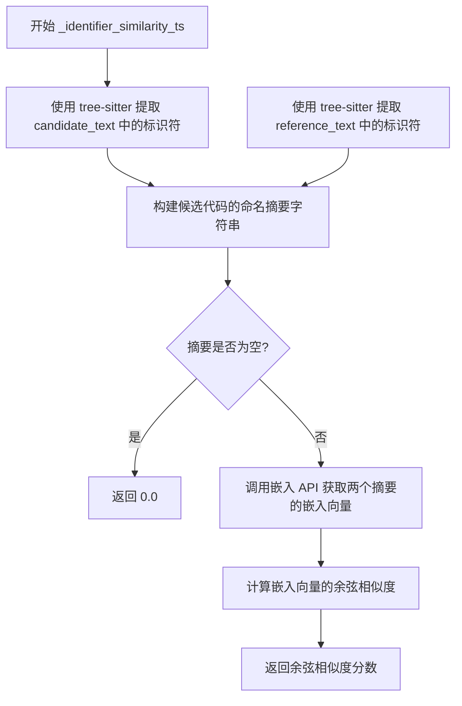
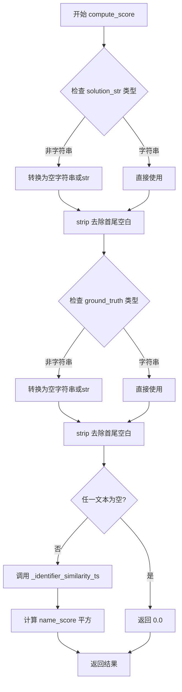

# `LLM4Decompile\sk2decompile\verl\SK2DECOMPILE\reward_functions\embedding_gte.py` 详细设计文档

基于GTE Embedding的标识符相似度奖励函数，用于评估反编译C代码的质量。通过tree-sitter解析代码提取标识符（函数/变量/类型/字段），构建命名摘要，计算GTE嵌入的余弦相似度并平方以强化奖励信号。

## 整体流程



## 类结构

```
无类定义 (基于函数的模块化设计)
模块划分:
├── OpenAI Embedding Client (嵌入客户端)
├── Tree-sitter C: Identifier Extraction (标识符提取)
├── Summary Construction & Similarity (摘要构建与相似度)
└── Main Reward Function (主奖励函数)
```

## 全局变量及字段


### `_MODEL_NAME`
    
GTE嵌入模型的名称，从环境变量GTE_EMBEDDING_MODEL_PATH获取，默认值为gte-large-en-v1.5

类型：`str`
    


### `_API_KEY`
    
API认证密钥，从环境变量GTE_EMBEDDING_API_KEY或OPENAI_API_KEY获取，默认值为none

类型：`str`
    


### `_API_BASE`
    
OpenAI兼容嵌入服务器的API基础URL，从环境变量GTE_EMBEDDING_API_BASE获取，默认值为http://127.0.0.1:8000/v1

类型：`str`
    


### `_client`
    
全局OpenAI客户端单例，用于与嵌入服务器通信，首次调用时延迟初始化

类型：`Optional[OpenAI]`
    


### `C_LANG`
    
tree-sitter的C语言定义对象，用于初始化解析器解析C代码

类型：`Language`
    


### `_TS_PARSER`
    
全局tree-sitter解析器实例，用于解析C代码并提取标识符

类型：`Parser`
    


    

## 全局函数及方法


### `_get_client`

该函数实现了一个单例模式的 OpenAI 客户端获取器，根据环境变量配置返回适当初始化的 OpenAI 客户端实例。

参数：该函数无参数

返回值：`OpenAI`，返回全局单例的 OpenAI 客户端实例

#### 流程图



#### 带注释源码

```python
def _get_client() -> OpenAI:
    """
    获取全局 OpenAI 客户端的单例实例。
    
    根据环境变量配置创建客户端：
    - 若 GTE_EMBEDDING_API_BASE 存在：使用自定义 base_url
    - 否则若 GTE_EMBEDDING_API_KEY 或 OPENAI_API_KEY 存在：使用默认 base_url
    - 否则：使用匿名客户端（本地模型场景）
    """
    global _client  # 声明使用全局变量 _client
    if _client is None:  # 延迟初始化：仅在客户端未创建时执行
        if _API_BASE:  # 检查是否配置了自定义 API 端点
            # 优先使用自定义 base_url（适用于 vLLM 等本地部署）
            _client = OpenAI(api_key=_API_KEY, base_url=_API_BASE)
        elif _API_KEY:  # 检查是否配置了 API 密钥
            # 使用标准 OpenAI API 端点
            _client = OpenAI(api_key=_API_KEY)
        else:
            # 无密钥模式：适用于本地运行的嵌入服务（如本地 vLLM）
            _client = OpenAI()
    return _client  # 返回单例客户端实例
```


### `_embed_two`

该函数接收两个文本字符串，通过 OpenAI 客户端调用 GTE 嵌入模型在单次 API 请求中对两个文本进行向量化处理，并将返回的嵌入向量转换为 float 类型的列表后一并返回。

参数：

- `text_a`：`str`，第一个待嵌入的文本内容
- `text_b`：`str`，第二个待嵌入的文本内容

返回值：`Tuple[List[float], List[float]]`，包含两个文本对应的嵌入向量列表

#### 流程图

```mermaid
flowchart TD
    A[开始 _embed_two] --> B[调用 _get_client 获取 OpenAI 客户端]
    B --> C[调用 embeddings.create API<br/>model: _MODEL_NAME<br/>input: [text_a, text_b]]
    C --> D[提取 resp.data[0].embedding 作为第一个向量]
    D --> E[将第一个向量转换为 float 列表 emb_a]
    E --> F[提取 resp.data[1].embedding 作为第二个向量]
    F --> G[将第二个向量转换为 float 列表 emb_b]
    G --> H[返回 Tuple[emb_a, emb_b]]
```

#### 带注释源码

```python
def _embed_two(text_a: str, text_b: str) -> Tuple[List[float], List[float]]:
    """Embed two texts in a single API call, return their embedding vectors."""
    # 获取全局 OpenAI 客户端实例（单例模式）
    client = _get_client()
    
    # 调用嵌入模型 API，在单次请求中同时嵌入两个文本
    # 使用环境变量配置模型名称 (_MODEL_NAME)
    resp = client.embeddings.create(model=_MODEL_NAME, input=[text_a, text_b])
    
    # 从 API 响应中提取第一个文本的嵌入向量
    # 并将 numpy float32 或其他数值类型转换为 Python float
    emb_a = [float(x) for x in resp.data[0].embedding]
    
    # 从 API 响应中提取第二个文本的嵌入向量
    emb_b = [float(x) for x in resp.data[1].embedding]
    
    # 返回两个嵌入向量元组
    return emb_a, emb_b
```


### `_cosine_similarity`

该函数计算两个向量之间的余弦相似度，通过计算点积除以两个向量的欧几里得范数乘积得到。如果任一向量的范数为零（即向量为空或全为零），则返回 0.0 以避免除零错误。

参数：

- `vec_a`：`Sequence[float]`，第一个向量
- `vec_b`：`Sequence[float]`，第二个向量

返回值：`float`，返回两个向量之间的余弦相似度值，范围在 [-1, 1] 之间（当向量非零时）

#### 流程图

```mermaid
flowchart TD
    A[开始 _cosine_similarity] --> B[计算点积 dot = Σ a*b]
    B --> C[计算向量A的范数 norm_a = √Σ a²]
    C --> D[计算向量B的范数 norm_b = √Σ b²]
    D --> E{检查范数是否为零}
    E -->|norm_a == 0 或 norm_b == 0| F[返回 0.0]
    E -->|否则| G[返回 dot / (norm_a * norm_b)]
    F --> H[结束]
    G --> H
```

#### 带注释源码

```python
def _cosine_similarity(vec_a: Sequence[float], vec_b: Sequence[float]) -> float:
    """
    计算两个向量之间的余弦相似度。
    
    余弦相似度 = (A · B) / (||A|| * ||B||)
    其中 · 表示点积，||A|| 表示向量A的L2范数（欧几里得长度）
    
    参数:
        vec_a: 第一个向量，浮点数序列
        vec_b: 第二个向量，浮点数序列
    
    返回:
        float: 余弦相似度值，范围[-1, 1]。如果任一向量范数为0，返回0.0
    """
    # 计算两个向量的点积（对应元素相乘后求和）
    # 例如: [1,2,3] · [4,5,6] = 1*4 + 2*5 + 3*6 = 32
    dot = sum(a * b for a, b in zip(vec_a, vec_b))
    
    # 计算第一个向量的L2范数（欧几里得距离）
    # ||A|| = √(a1² + a2² + ... + an²)
    norm_a = math.sqrt(sum(a * a for a in vec_a))
    
    # 计算第二个向量的L2范数
    norm_b = math.sqrt(sum(b * b for b in vec_b))
    
    # 边界情况处理：如果任一向量为空或全为零，其范数为0
    # 此时无法计算余弦相似度（分母为0），返回0.0
    if norm_a == 0 or norm_b == 0:
        return 0.0
    
    # 计算余弦相似度：点积除以两个范数的乘积
    # 结果范围为[-1, 1]：
    #   1.0 = 完全相同方向
    #   0.0 = 正交（90度）
    #  -1.0 = 完全相反方向
    return dot / (norm_a * norm_b)
```


### `_classify_node`

该函数是树解析器的节点分类器，用于将 tree-sitter 解析出的 C 代码 AST 节点根据其语法角色（如函数调用、变量声明、类型定义等）划分为不同的标识符类别（func/var/type/field），以便后续构建代码命名摘要进行嵌入相似度计算。

参数：

- `node`：`tree_sitter.Node`，待分类的语法树节点对象，包含节点类型和文本信息

返回值：`Tuple[Optional[str], Optional[str]]`，返回元组 (id_type, name)，其中 id_type 为标识符类别（"func"/"var"/"type"/"field" 或 None），name 为标识符名称字符串（若无法分类则为 None）

#### 流程图

```mermaid
flowchart TD
    A[开始: 输入 node] --> B[获取节点类型 node_type 和文本 name]
    B --> C{node_type == 'type_identifier'?}
    C -->|是| D[返回 ('type', name)]
    C -->|否| E{node_type == 'field_identifier'?}
    E -->|是| F[返回 ('field', name)]
    E -->|否| G{node_type == 'identifier'?}
    G -->|否| H[返回 (None, None)]
    G -->|是| I[获取父节点 parent]
    I --> J{parent 是否存在?}
    J -->|否| K[默认返回 ('var', name)]
    J -->|是| L{parent.type == 'function_declarator' 且 node 为 declarator 字段?}
    L -->|是| M[返回 ('func', name)]
    L -->|否| N{parent.type == 'call_expression' 且 node 为 function 字段?}
    N -->|是| O[返回 ('func', name)]
    N -->|否| P{parent.type 属于<br>init_declarator / parameter_declaration<br>/ declaration / pointer_declarator?}
    P -->|是| Q[返回 ('var', name)]
    P -->|否| K
```

#### 带注释源码

```python
def _classify_node(node):
    """
    Classify a tree-sitter node into identifier categories:
    - func: function names (definitions + calls)
    - var: variable names (parameters / local / global)
    - type: type names
    - field: struct field names
    """
    # 1. 提取节点的类型名称（如 'identifier', 'type_identifier' 等）
    node_type = node.type
    # 2. 提取节点对应的源码文本并解码为 UTF-8 字符串
    name = node.text.decode("utf8")

    # 3. 分类逻辑：优先处理明确的类型节点
    if node_type == "type_identifier":
        # 类型标识符（如 struct/typedef 名称）
        return "type", name
    if node_type == "field_identifier":
        # 结构体/联合体字段名
        return "field", name
    if node_type != "identifier":
        # 仅处理标识符节点，非标识符直接返回空
        return None, None

    # 4. 对于 identifier 节点，根据其父节点判断具体角色
    parent = node.parent
    if parent:
        parent_type = parent.type
        # 函数定义（函数声明器）
        if parent_type == "function_declarator" and parent.child_by_field_name("declarator") == node:
            return "func", name
        # 函数调用表达式
        if parent_type == "call_expression" and parent.child_by_field_name("function") == node:
            return "func", name
        # 变量/参数声明（包括初始化声明、指针声明等）
        if parent_type in ("init_declarator", "parameter_declaration", "declaration", "pointer_declarator"):
            return "var", name

    # 5. 默认情况：无法识别父节点角色时，视为变量名
    return "var", name
```


### `_extract_identifiers_ts`

从C代码中使用tree-sitter解析器提取标识符（函数名、变量名、类型名、字段名），并按类型分类返回。

参数：

- `code`：`str`，要解析的C源代码字符串
- `max_per_type`：`int`，每种标识符类型最多提取的数量，默认为64

返回值：`Dict[str, List[str]]`，返回包含四种标识符类型的字典，键为"func"、"var"、"type"、"field"，值为对应的标识符名称列表

#### 流程图



#### 带注释源码

```python
def _extract_identifiers_ts(code: str, max_per_type: int = 64) -> Dict[str, List[str]]:
    """Extract identifiers from C code using tree-sitter, classified by type."""
    # 使用tree-sitter解析器解析输入的C代码字符串
    # 将代码编码为UTF-8字节串进行解析
    tree = _TS_PARSER.parse(code.encode("utf8"))
    
    # 初始化结果字典，包含四种标识符类型
    result: Dict[str, List[str]] = {"func": [], "var": [], "type": [], "field": []}

    # 使用栈进行深度优先遍历AST（抽象语法树）
    # 初始时将根节点放入栈中
    stack = [tree.root_node]
    
    # 遍历栈中的所有节点
    while stack:
        # 弹出栈顶节点进行处理
        node = stack.pop()
        
        # 对当前节点进行分类，获取标识符类型和名称
        id_type, name = _classify_node(node)
        
        # 如果分类成功且该类型未达到上限
        if id_type in result and len(result[id_type]) < max_per_type:
            # 将标识符名称添加到对应类型的列表中
            result[id_type].append(name)
        
        # 将当前节点的所有子节点加入栈中，继续遍历
        stack.extend(node.children)

    # 返回分类后的标识符字典
    return result
```


### `_build_summary_text`

该函数将分类的标识符字典构建为命名摘要字符串，按类型分组并用分隔符连接，用于后续的嵌入相似度计算。

参数：

- `identifiers`：`Dict[str, List[str]]`，包含分类标识符的字典，键为类型（func/type/field/var），值为该类型的标识符名称列表
- `max_per_type`：`int`，每种类型最多包含的标识符数量，默认值为 64

返回值：`str`，生成的命名摘要字符串，格式如 "func: foo bar || type: my_type || field: field1 field2 || var: i j k"

#### 流程图

```mermaid
flowchart TD
    A[开始] --> B[初始化空列表 parts]
    B --> C[遍历类型顺序: func → type → field → var]
    C --> D{当前类型是否存在标识符?}
    D -->|否| C
    D -->|是| E[获取该类型的标识符列表]
    E --> F[截取前 max_per_type 个标识符]
    F --> G[格式化为 "{type}: name1 name2 ..." 片段]
    G --> H[添加到 parts 列表]
    H --> C
    C --> I{所有类型遍历完成?}
    I -->|否| C
    I -->|是| J[用 " || " 连接所有片段]
    J --> K[返回最终摘要字符串]
```

#### 带注释源码

```python
def _build_summary_text(identifiers: Dict[str, List[str]], max_per_type: int = 64) -> str:
    """
    Build a naming summary string from classified identifiers.
    Example: "func: foo bar || type: my_type || field: field1 field2 || var: i j k"
    
    Args:
        identifiers: 分类标识符字典，键为 'func', 'type', 'field', 'var'，值为标识符名称列表
        max_per_type: 每种类型最多保留的标识符数量，防止摘要过长
    
    Returns:
        用 " || " 分隔的命名摘要字符串，格式为 "{类型}: 名称1 名称2 ..."
    """
    # 用于存储各类型片段的列表
    parts: List[str] = []
    
    # 按照固定顺序遍历四种标识符类型
    for kind in ("func", "type", "field", "var"):
        # 获取当前类型的标识符列表，若不存在则返回空列表
        names = identifiers.get(kind, [])
        
        # 如果该类型没有标识符，跳过此类型
        if not names:
            continue
        
        # 截取前 max_per_type 个标识符，避免列表过长
        segment = f"{kind}: " + " ".join(names[:max_per_type])
        
        # 将格式化的片段添加到结果列表
        parts.append(segment)
    
    # 用 " || " 作为分隔符连接所有片段，返回最终摘要字符串
    return " || ".join(parts)
```


### `_identifier_similarity_ts`

使用基于 GTE Embedding 的余弦相似度计算代码级别的标识符命名相似度，通过 tree-sitter 解析 C 代码提取标识符（函数/变量/类型/字段），构建命名摘要字符串，最后计算两个摘要的嵌入向量余弦相似度。

参数：

- `candidate_text`：`str`，候选（解编译）代码文本
- `reference_text`：`str`，参考（原始）代码文本

返回值：`float`，余弦相似度分数，范围在 [0, 1] 之间

#### 流程图



#### 带注释源码

```python
def _identifier_similarity_ts(candidate_text: str, reference_text: str):
    """
    Compute identifier-level similarity using embedding cosine similarity.

    Steps:
    1. Extract identifiers from both texts using tree-sitter
    2. Build naming summary strings
    3. Embed both summaries in a single API call
    4. Return cosine similarity as name_score

    Returns:
        name_score: float in [0, 1]
    """
    # 步骤1: 使用 tree-sitter 从候选代码中提取标识符
    cand_ids = _extract_identifiers_ts(candidate_text)
    # 步骤1: 使用 tree-sitter 从参考代码中提取标识符
    ref_ids = _extract_identifiers_ts(reference_text)

    # 步骤2: 将提取的标识符构建为命名摘要字符串
    # 格式: "func: foo bar || type: my_type || field: field1 field2 || var: i j k"
    cand_summary = _build_summary_text(cand_ids)
    ref_summary = _build_summary_text(ref_ids)

    # 步骤3检查: 如果任一摘要为空，则无法计算相似度
    if not cand_summary or not ref_summary:
        return 0.0

    # 步骤3: 通过 API 调用获取两个摘要的嵌入向量
    emb_cand, emb_ref = _embed_two(cand_summary, ref_summary)
    
    # 步骤4: 计算并返回余弦相似度
    return _cosine_similarity(emb_cand, emb_ref)
```


### `compute_score`

该函数是奖励计算的核心入口，接收待评估代码和参考代码，通过树结构解析器提取标识符，构建命名摘要，并利用GTE嵌入模型计算余弦相似度，最终返回相似度的平方作为强化学习的奖励信号。

参数：

- `solution_str`：`str` 或任意类型，待评估的反编译代码字符串，如果是None或其他非字符串类型会转换为空字符串
- `ground_truth`：`str` 或任意类型，参考/真实代码字符串，如果是None或其他非字符串类型会转换为空字符串  
- `extra_info`：`Optional[Any]`，可选的额外信息字典，当前函数体中未使用该参数

返回值：`float`，返回0.0到1.0之间的分数，本质是标识符命名相似度的平方值，用于强化学习中锐化奖励信号

#### 流程图



#### 带注释源码

```python
def compute_score(solution_str, ground_truth, extra_info=None):
    """
    Compute reward based on identifier naming similarity using GTE embeddings.
    Returns score^2 to sharpen the reward signal.
    
    Args:
        solution_str: 待评估的反编译代码字符串
        ground_truth: 参考/真实代码字符串
        extra_info: 可选的额外信息（当前未使用）
    
    Returns:
        float: 0.0到1.0之间的奖励分数
    """
    # 参数类型检查与安全转换：确保solution_str为字符串类型
    if not isinstance(solution_str, str):
        # 如果是None转为空字符串，其他类型转为字符串表示
        solution_str = "" if solution_str is None else str(solution_str)
    
    # 参数类型检查与安全转换：确保ground_truth为字符串类型
    if not isinstance(ground_truth, str):
        ground_truth = "" if ground_truth is None else str(ground_truth)

    # 去除代码字符串首尾空白字符
    candidate_text = solution_str.strip()
    reference_text = ground_truth.strip()

    # 边界情况处理：如果任一代码文本为空，直接返回0分
    if not candidate_text or not reference_text:
        return 0.0

    # 调用底层标识符相似度计算函数
    # 该函数使用tree-sitter提取标识符并通过GTE嵌入计算余弦相似度
    name_score = _identifier_similarity_ts(candidate_text, reference_text)
    
    # 返回相似度的平方，锐化奖励信号（参考SK2Decompile论文 Eq.4）
    return name_score * name_score
```

## 关键组件


### GTE嵌入客户端模块

负责管理与GTE嵌入模型的API连接，支持环境变量配置模型路径、API密钥和基础URL，提供嵌入向量生成功能。

### Tree-sitter C解析器模块

使用tree-sitter库解析C代码的AST，支持从源代码中提取语法节点，为后续标识符提取提供基础。

### 标识符分类器

将tree-sitter节点分类为四类标识符：func（函数名）、var（变量名）、type（类型名）、field（结构体字段名），通过分析节点类型和父子关系进行判断。

### 标识符提取器

从C代码的AST中遍历所有节点，调用分类器提取标识符，按类型存储到字典中，支持每类标识符的最大数量限制。

### 摘要构建器

将分类后的标识符字典转换为格式化的文本摘要，格式为"func: name1 name2 || type: type1 || field: field1 || var: var1"，便于后续嵌入计算。

### 余弦相似度计算器

计算两个嵌入向量之间的余弦相似度，处理零向量边界情况，返回0到1之间的相似度分数。

### 主奖励函数compute_score

整合整个流程的入口函数，接收候选代码和参考代码，计算标识符相似度并将结果平方以强化奖励信号。

### 全局配置变量

包含模型名称(_MODEL_NAME)、API密钥(_API_KEY)、API基础URL(_API_BASE)等配置，通过环境变量读取默认值。

### 全局客户端单例

使用懒加载模式初始化的OpenAI客户端，确保在首次调用时创建并缓存。


## 问题及建议


### 已知问题

-   **全局状态管理**：使用全局变量 `_client` 和 `_TS_PARSER`，可能导致测试困难、状态污染和线程安全问题。
-   **缺少错误处理**：API 调用（嵌入生成）缺少异常捕获和网络错误重试机制，API 请求失败时程序会直接崩溃。
-   **无缓存机制**：每次调用 `compute_score` 都重新解析代码和调用嵌入 API，对于相同输入存在重复计算开销。
-   **标识符分类逻辑不完整**：`_classify_node` 函数仅覆盖部分 C 语法节点（如遗漏 `struct_declarator`、`enumerator` 等），可能导致标识符遗漏或分类错误。
-   **环境变量缺乏验证**：`GTE_EMBEDDING_API_BASE` 为空字符串时仍可能创建无效客户端，且未验证模型名称是否存在。
-   **API 密钥默认值为 "none"`：默认的 `"none"` 密钥可能在某些 API 服务端被拒绝，而非使用更安全的无密钥或明确报错机制。
-   **余弦相似度零向量处理**：当嵌入向量全为零时返回 0.0，但未区分是真正的零向量还是 API 返回错误。
-   **类型注解不完整**：`_identifier_similarity_ts` 缺少返回值类型注解，`extra_info` 参数未使用。

### 优化建议

-   **引入依赖注入或单例模式**：将 `_client` 和 `_TS_PARSER` 通过参数传入或使用单例模式管理，便于单元测试和配置替换。
-   **添加缓存层**：使用 LRU 缓存存储代码解析结果和嵌入向量（可基于文本 hash 或 LLM 章节内容），减少重复 API 调用。
-   **完善错误处理**：对 API 调用添加 try-except 捕获 `APIError`、`Timeout` 等异常，实现指数退避重试，并返回默认值或抛出明确错误。
-   **扩展标识符分类**：增加对 `struct_declarator`、`enum_constant`、`label` 等节点类型的识别，覆盖更多 C 语法结构。
-   **增加环境变量校验**：启动时验证 `GTE_EMBEDDING_API_BASE` 格式、模型名称合法性，API 密钥非空时检查是否与 `"none"` 冲突。
-   **添加日志记录**：引入 `logging` 模块记录 API 调用耗时、解析节点数、相似度分数等，便于调试和性能监控。
-   **补充类型注解和文档**：为 `_identifier_similarity_ts` 添加返回类型 `float`，为 `extra_info` 参数增加说明或移除未使用参数。

## 其它


### 设计目标与约束

**设计目标**：
- 实现基于GTE嵌入的标识符命名相似度评估奖励函数，用于SK2Decompile论文中的代码反编译质量评估
- 通过余弦相似度平方机制强化奖励信号，鼓励模型生成与参考代码命名风格一致的输出

**设计约束**：
- 依赖OpenAI兼容的嵌入服务器（vLLM serving gte-large-en-v1.5）
- 依赖tree-sitter和tree-sitter-c进行C代码解析
- 标识符提取限制每类最多64个，避免嵌入请求的token过多
- 仅支持C语言代码的标识符提取

### 错误处理与异常设计

**异常处理策略**：
- 客户端连接失败：`_get_client()`函数在无法连接时返回基础OpenAI客户端
- 嵌入API调用失败：未显式捕获，由调用方处理
- 解析失败：`_TS_PARSER.parse()`返回空树，结果字典为空
- 空输入处理：`compute_score`函数对空字符串返回0.0
- 向量范数为零：`_cosine_similarity`函数返回0.0避免除零错误

**边界条件**：
- 无有效标识符时返回0.0分数
- 网络超时和API限流未处理

### 数据流与状态机

**数据流**：
```
solution_str/ground_truth 
    → 字符串清洗 
    → _identifier_similarity_ts 
        → _extract_identifiers_ts (tree-sitter解析)
        → _build_summary_text (构建摘要)
        → _embed_two (API调用获取嵌入)
        → _cosine_similarity (计算相似度)
    → score² (最终奖励)
```

**状态转换**：
- 输入验证状态 → 解析状态 → 嵌入状态 → 计算状态 → 输出状态

### 外部依赖与接口契约

**外部依赖**：
- `openai`库：OpenAI Python客户端
- `tree-sitter`：通用树解析器
- `tree_sitter_c`：C语言语法定义
- 环境变量：`GTE_EMBEDDING_MODEL_PATH`、`GTE_EMBEDDING_API_KEY`/`OPENAI_API_KEY`、`GTE_EMBEDDING_API_BASE`

**接口契约**：
- `compute_score(solution_str, ground_truth, extra_info=None)`：主入口函数，返回float类型分数[0,1]
- 输入：solution_str为候选代码，ground_truth为参考代码
- 输出：余弦相似度的平方值

### 性能考量与优化建议

**当前实现**：
- 每次评分需要两次嵌入调用（合并为单次API请求）
- tree-sitter解析复杂度O(n)，n为代码行数

**优化空间**：
- 嵌入结果缓存：相同摘要字符串可复用嵌入向量
- 批量评分支持：支持一次性计算多个候选代码的分数
- 并行解析：多线程解析多个代码样本

### 安全考量

**安全风险**：
- API密钥通过环境变量传入，存在泄露风险
- 嵌入服务器未验证SSL证书
- 代码注入：解析未知来源C代码可能触发解析器漏洞

**建议**：
- 使用密钥管理服务存储API密钥
- 添加SSL证书验证
- 对输入代码长度和复杂度进行限制

### 配置与可扩展性

**当前配置**：
- 模型路径、环境变量、API端点均通过环境变量配置
- `max_per_type`参数硬编码为64

**可扩展性**：
- 可通过添加新的`_extract_identifiers_*`函数支持其他编程语言
- 可通过替换嵌入模型实现其他嵌入方案
- `compute_score`函数签名保持兼容以便集成

    