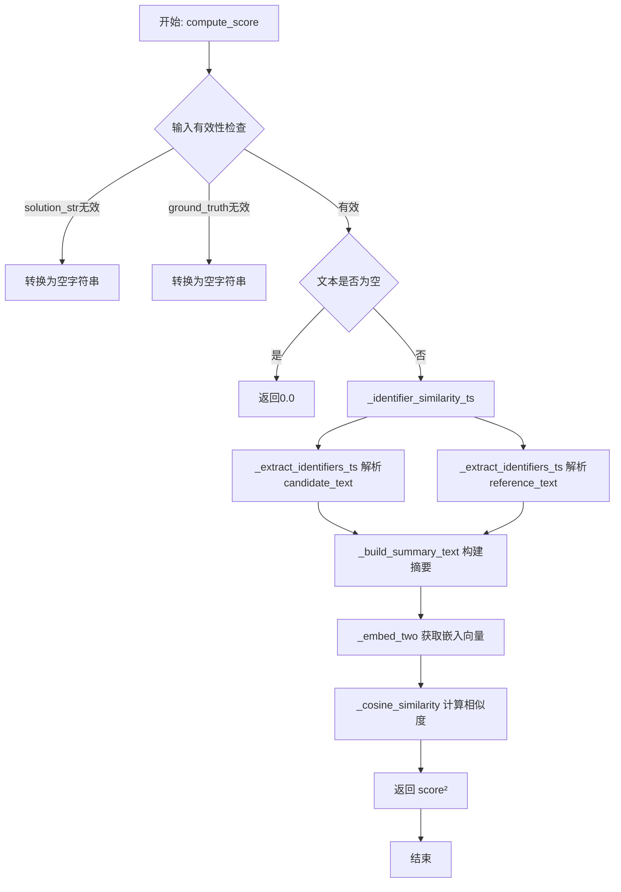
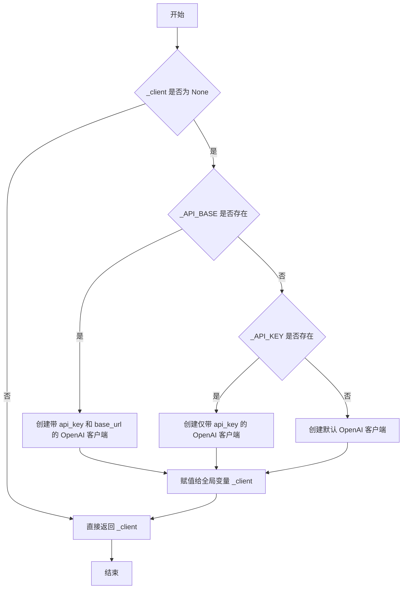
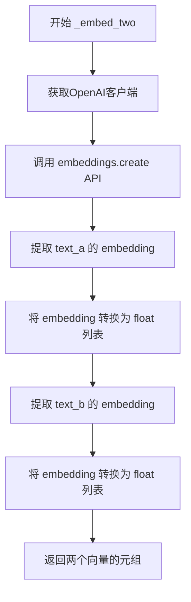
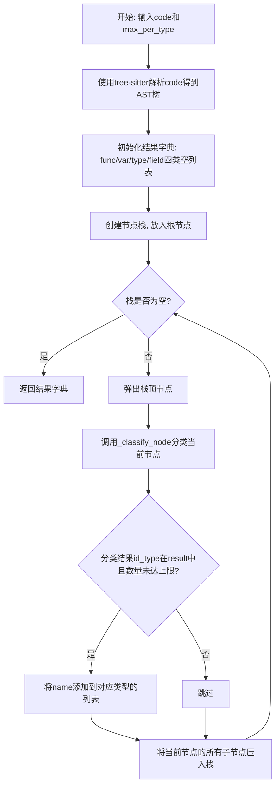
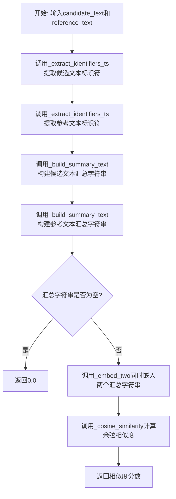
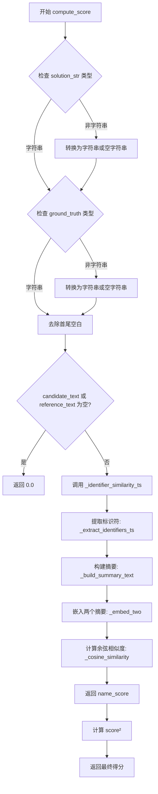

# `LLM4Decompile\sk2decompile\verl\SK2DECOMPILE\reward_functions\embedding_qwen3.py` 详细设计文档

这是一个基于Qwen3嵌入的标识符相似度奖励函数实现，用于评估反编译C代码的质量。代码通过tree-sitter解析C代码提取标识符（函数/变量/类型/字段），构建命名摘要，然后计算Qwen3嵌入向量之间的余弦相似度，并将结果平方以增强奖励信号。

## 整体流程



## 类结构

```
该文件为扁平化模块结构，无类定义
所有功能通过模块级函数实现
模块初始化时创建tree-sitter解析器全局实例
```

## 全局变量及字段


### `_MODEL_NAME`
    
环境变量配置 - Qwen3嵌入模型路径

类型：`str`
    


### `_API_KEY`
    
环境变量配置 - API密钥

类型：`str`
    


### `_API_BASE`
    
环境变量配置 - API基础URL

类型：`str`
    


### `_client`
    
OpenAI客户端单例 - 用于API调用

类型：`Optional[OpenAI]`
    


### `C_LANG`
    
tree-sitter C语言对象 - 解析器语言配置

类型：`Language`
    


### `_TS_PARSER`
    
tree-sitter解析器实例 - AST解析

类型：`Parser`
    


    

## 全局函数及方法


### `_get_client`

获取或创建OpenAI客户端单例，确保全局只存在一个OpenAI客户端实例，并根据环境变量配置API密钥和基础URL。

参数：  
无

返回值：`OpenAI`，返回全局单例的OpenAI客户端实例

#### 流程图



#### 带注释源码

```python
def _get_client() -> OpenAI:
    """
    获取或创建OpenAI客户端单例。
    
    逻辑：
    1. 检查全局变量 _client 是否已存在
    2. 如果不存在，根据环境变量配置创建客户端
    3. 返回全局单例客户端
    """
    global _client  # 声明使用全局变量 _client
    if _client is None:  # 如果客户端尚未初始化
        if _API_BASE:  # 如果配置了 API 基础 URL
            # 使用自定义 API 端点和密钥创建客户端（适用于 vLLM 等兼容服务）
            _client = OpenAI(api_key=_API_KEY, base_url=_API_BASE)
        elif _API_KEY:  # 否则如果配置了 API 密钥
            # 使用官方 OpenAI API 创建客户端
            _client = OpenAI(api_key=_API_KEY)
        else:  # 两者都未配置
            # 使用默认配置创建客户端（适用于本地开发或模拟环境）
            _client = OpenAI()
    return _client  # 返回单例客户端实例
```

#### 相关全局变量

- `_client`：`Optional[OpenAI]`，全局客户端单例，初始为None
- `_MODEL_NAME`：`str`，Qwen3嵌入模型名称，从环境变量`QWEN3_EMBEDDING_MODEL_PATH`获取，默认"Qwen3-Embedding-0.6B"
- `_API_KEY`：`str`，API密钥，从环境变量`QWEN3_EMBEDDING_API_KEY`或`OPENAI_API_KEY`获取，默认"none"
- `_API_BASE`：`str`，API基础URL，从环境变量`QWEN3_EMBEDDING_API_BASE`获取，默认"http://127.0.0.1:8000/v1"


### `_embed_two`

调用嵌入API获取两个文本的向量表示，通过单次API请求返回两个文本的嵌入向量。

参数：

- `text_a`：`str`，第一个文本，用于生成嵌入向量
- `text_b`：`str`，第二个文本，用于生成嵌入向量

返回值：`Tuple[List[float], List[float]]`，返回两个文本的嵌入向量元组，第一个元素是text_a的向量，第二个元素是text_b的向量

#### 流程图



#### 带注释源码

```python
def _embed_two(text_a: str, text_b: str) -> Tuple[List[float], List[float]]:
    """
    Embed two texts in a single API call, return their embedding vectors.
    
    通过单次API调用获取两个文本的嵌入向量，使用Qwen3嵌入模型。
    这比分别调用两次API更高效，减少了网络往返延迟。
    
    参数:
        text_a: 第一个输入文本
        text_b: 第二个输入文本
    
    返回:
        包含两个嵌入向量的元组 (emb_a, emb_b)，每个向量都是 float 列表
    """
    # 获取或初始化OpenAI客户端（单例模式）
    client = _get_client()
    
    # 调用嵌入API，使用Qwen3嵌入模型，输入为两个文本的列表
    # API会在单次请求中处理两个文本，提高效率
    resp = client.embeddings.create(model=_MODEL_NAME, input=[text_a, text_b])
    
    # 从API响应中提取第一个文本（text_a）的嵌入向量
    # 并将numpy数组或原始数值类型转换为Python float列表
    emb_a = [float(x) for x in resp.data[0].embedding]
    
    # 从API响应中提取第二个文本（text_b）的嵌入向量
    # 同样转换为Python float列表以确保兼容性
    emb_b = [float(x) for x in resp.data[1].embedding]
    
    # 返回两个嵌入向量作为元组
    return emb_a, emb_b
```


### `_cosine_similarity`

该函数为内部辅助函数，用于计算两个浮点数序列（向量）之间的余弦相似度。它首先计算向量的点积和各向量的欧几里得范数，若任一范数为零则直接返回 0.0，否则返回点积除以两范数乘积的比值。

参数：

-  `vec_a`：`Sequence[float]`，输入的第一个向量
-  `vec_b`：`Sequence[float]`，输入的第二个向量

返回值：`float`，返回两个输入向量的余弦相似度值，范围通常在 -1 到 1 之间（对于非负向量通常为 0 到 1），若任一向量为零向量则返回 0.0

#### 流程图

```mermaid
graph TD
    A[开始] --> B[计算点积 dot_product]
    B --> C[计算 vec_a 的范数 norm_a]
    C --> D[计算 vec_b 的范数 norm_b]
    D --> E{检查 norm_a == 0 或 norm_b == 0?}
    E -- 是 --> F[返回 0.0]
    E -- 否 --> G[计算相似度: dot / (norm_a * norm_b)]
    F --> H[结束]
    G --> H
```

#### 带注释源码

```python
def _cosine_similarity(vec_a: Sequence[float], vec_b: Sequence[float]) -> float:
    """
    计算两个向量的余弦相似度。

    参数:
        vec_a: 第一个向量 (浮点数序列)。
        vec_b: 第二个向量 (浮点数序列)。

    返回:
        float: 两个向量的余弦相似度。如果任一向量的范数为 0，则返回 0.0。
    """
    # 步骤 1: 计算两个向量的点积 (Dot Product)
    # sum(a * b for a, b in zip(vec_a, vec_b)) 遍历两个向量对应位置的元素相乘并求和
    dot = sum(a * b for a, b in zip(vec_a, vec_b))
    
    # 步骤 2: 计算第一个向量的欧几里得范数 (L2 Norm)
    # norm_a = sqrt(sum(a^2 for a in vec_a))
    norm_a = math.sqrt(sum(a * a for a in vec_a))
    
    # 步骤 3: 计算第二个向量的欧几里得范数
    # norm_b = sqrt(sum(b^2 for b in vec_b))
    norm_b = math.sqrt(sum(b * b for b in vec_b))
    
    # 步骤 4: 检查边界情况
    # 如果任一向量是零向量，其范数为 0，除法会导致除零错误，因此直接返回 0.0
    if norm_a == 0 or norm_b == 0:
        return 0.0
    
    # 步骤 5: 计算并返回余弦相似度
    # Cosine Similarity = (A . B) / (||A|| * ||B||)
    return dot / (norm_a * norm_b)
```


### `_classify_node`

该函数是树节点分类器的核心实现，负责将 tree-sitter 解析出的 C 代码节点识别并分类为四种标识符类型：函数名（func）、变量名（var）、类型名（type）和结构体字段名（field）。通过分析节点本身的类型及其父节点的上下文关系，实现对代码中各类标识符的精准识别，为后续的嵌入相似度计算提供结构化的命名特征。

参数：

- `node`：`tree_sitter.Node`，tree-sitter 解析树中的节点对象，包含节点类型和文本信息

返回值：`Tuple[Optional[str], Optional[str]]`，返回二元组 (id_type, name)：id_type 为分类标识（"func"/"var"/"type"/"field"），name 为解码后的标识符名称；无法分类时返回 (None, None)

#### 流程图

```mermaid
flowchart TD
    A[开始: node] --> B[获取节点类型 node_type]
    B --> C[获取节点文本 name = node.text.decode utf8]
    C --> D{node_type == type_identifier?}
    D -->|Yes| E[返回 ("type", name)]
    D -->|No| F{node_type == field_identifier?}
    F -->|Yes| G[返回 ("field", name)]
    F -->|No| H{node_type == identifier?}
    H -->|No| I[返回 (None, None)]
    H -->|Yes| J[获取父节点 parent]
    J --> K{parent 存在?}
    K -->|No| L[返回 ("var", name)]
    K -->|Yes| M[获取父节点类型 parent_type]
    M --> N{parent_type == function_declarator<br/>且 node 是 declarator 子节点?}
    N -->|Yes| O[返回 ("func", name)]
    N -->|No| P{parent_type == call_expression<br/>且 node 是 function 子节点?}
    P -->|Yes| Q[返回 ("func", name)]
    P -->|No| R{parent_type in<br/>init_declarator<br/>parameter_declaration<br/>declaration<br/>pointer_declarator?}
    R -->|Yes| S[返回 ("var", name)]
    R -->|No| T[返回 ("var", name)]
```

#### 带注释源码

```python
def _classify_node(node):
    """
    Classify a tree-sitter node into identifier categories:
    - func: function names (definitions + calls)
    - var: variable names (parameters / local / global)
    - type: type names
    - field: struct field names
    
    参数:
        node: tree_sitter 节点对象
        
    返回:
        Tuple[Optional[str], Optional[str]]: (id_type, name) 元组
            - id_type: 分类标识 "func"/"var"/"type"/"field"
            - name: 解码后的标识符名称
            - 无法分类时返回 (None, None)
    """
    # 步骤1: 获取节点类型和文本内容
    node_type = node.type  # 例如 "identifier", "type_identifier", "field_identifier" 等
    name = node.text.decode("utf8")  # 将字节串解码为字符串

    # 步骤2: 直接通过节点类型判断 type 和 field
    # type_identifier 节点直接表示类型名称
    if node_type == "type_identifier":
        return "type", name
    
    # field_identifier 节点表示结构体/联合体的字段名
    if node_type == "field_identifier":
        return "field", name
    
    # 非 identifier 类型的节点不表示标识符，返回 None
    if node_type != "identifier":
        return None, None

    # 步骤3: 对于 identifier 类型，需要通过父节点上下文判断是 func 还是 var
    parent = node.parent  # 获取父节点
    if parent:
        parent_type = parent.type  # 父节点类型
        
        # 函数定义: parent 是 function_declarator，且当前节点是 declarator 字段
        if parent_type == "function_declarator" and parent.child_by_field_name("declarator") == node:
            return "func", name
        
        # 函数调用: parent 是 call_expression，且当前节点是 function 字段
        if parent_type == "call_expression" and parent.child_by_field_name("function") == node:
            return "func", name
        
        # 变量声明: 父节点为初始化声明、参数声明、普通声明或指针声明
        if parent_type in ("init_declarator", "parameter_declaration", "declaration", "pointer_declarator"):
            return "var", name

    # 步骤4: 默认情况，标识符未匹配到上述规则，视为变量
    return "var", name
```


### `_extract_identifiers_ts`

使用 tree-sitter 解析器从 C 代码中提取各类标识符（函数名、变量名、类型名、字段名），并按类型分类返回。

参数：

- `code`：`str`，输入的 C 代码字符串
- `max_per_type`：`int`，每种标识符类型最多提取的数量，默认为 64

返回值：`Dict[str, List[str]]`，返回包含四类标识符的字典，键为 `"func"`（函数）、`"var"`（变量）、`"type"`（类型）、`"field"`（字段），值为对应类型的标识符名称列表

#### 流程图



#### 带注释源码

```python
def _extract_identifiers_ts(code: str, max_per_type: int = 64) -> Dict[str, List[str]]:
    """Extract identifiers from C code using tree-sitter, classified by type.
    
    使用 tree-sitter 解析 C 代码的抽象语法树(AST)，遍历所有节点，
    通过 _classify_node 函数识别节点类型（函数/变量/类型/字段），
    将标识符按类型分类收集到字典中返回。
    
    参数:
        code: 输入的 C 代码字符串
        max_per_type: 每种标识符类型最多提取的数量，防止返回过多数据
    
    返回:
        包含四类标识符的字典: func(函数名), var(变量名), type(类型名), field(字段名)
    """
    # 使用预置的 tree-sitter C 语言解析器解析代码，得到 AST 语法树
    tree = _TS_PARSER.parse(code.encode("utf8"))
    
    # 初始化结果字典，四种类型的标识符列表
    result: Dict[str, List[str]] = {"func": [], "var": [], "type": [], "field": []}

    # 使用栈进行深度优先搜索(DFS)遍历 AST 所有节点
    stack = [tree.root_node]
    while stack:
        # 弹出当前处理节点
        node = stack.pop()
        
        # 对节点进行分类识别，获取标识符类型和名称
        id_type, name = _classify_node(node)
        
        # 如果分类成功且该类型未达上限，则添加到结果中
        if id_type in result and len(result[id_type]) < max_per_type:
            result[id_type].append(name)
        
        # 将当前节点的所有子节点加入栈，继续遍历
        stack.extend(node.children)

    return result
```


### `_build_summary_text`

将分类后的标识符字典构建为格式化的命名摘要字符串，按照 func、type、field、var 的顺序组织，每个类别用冒号分隔，不同类别之间用 " || " 连接。

参数：

- `identifiers`：`Dict[str, List[str]]`，分类后的标识符字典，键为类别（func/type/field/var），值为该类别下的标识符名称列表
- `max_per_type`：`int`，每个类别最多保留的标识符数量，默认值为 64

返回值：`str`，格式化后的命名摘要字符串，格式如 `"func: foo bar || type: my_type || field: field1 field2 || var: i j k"`

#### 流程图

```mermaid
flowchart TD
    A[开始] --> B[初始化空列表 parts]
    B --> C{遍历 kinds = ['func', 'type', 'field', 'var']}
    C --> D[获取当前 kind 的 names 列表]
    D --> E{names 是否为空?}
    E -->|是| C
    E -->|否| F[截取前 max_per_type 个名称]
    F --> G[拼接 segment = 'kind: ' + ' '.join(names[:max_per_type])]
    G --> H[将 segment 添加到 parts]
    H --> C
    C --> I[遍历完成?]
    I -->|否| C
    I -->|是| J[用 ' || ' 连接 parts 中的所有 segment]
    J --> K[返回最终字符串]
```

#### 带注释源码

```python
def _build_summary_text(identifiers: Dict[str, List[str]], max_per_type: int = 64) -> str:
    """
    Build a naming summary string from classified identifiers.
    Example: "func: foo bar || type: my_type || field: field1 field2 || var: i j k"
    """
    # 用于存储各个类别格式化后的片段
    parts: List[str] = []
    # 按照固定顺序遍历：函数名 -> 类型名 -> 字段名 -> 变量名
    for kind in ("func", "type", "field", "var"):
        # 从标识符字典中获取当前类别的名称列表
        names = identifiers.get(kind, [])
        # 如果该类别没有标识符，则跳过
        if not names:
            continue
        # 截取不超过 max_per_type 数量的名称
        # 防止单个类别过长导致摘要字符串过于冗长
        segment = f"{kind}: " + " ".join(names[:max_per_type])
        # 将格式化后的片段添加到结果列表
        parts.append(segment)
    # 使用 " || " 作为分隔符，将所有片段连接成最终字符串
    return " || ".join(parts)
```


### `_identifier_similarity_ts`

计算两个文本的标识符级相似度，通过tree-sitter解析C代码提取标识符（函数名、变量名、类型名、字段名），构建命名汇总字符串，使用Qwen3嵌入模型生成向量并计算余弦相似度。

参数：

- `candidate_text`：`str`，候选文本（反编译的C代码）
- `reference_text`：`str`，参考文本（原始C代码或标准答案）

返回值：`float`，标识符级相似度分数，范围[0, 1]

#### 流程图



#### 带注释源码

```python
def _identifier_similarity_ts(candidate_text: str, reference_text: str):
    """
    Compute identifier-level similarity using embedding cosine similarity.

    Steps:
    1. Extract identifiers from both texts using tree-sitter
    2. Build naming summary strings
    3. Embed both summaries in a single API call
    4. Return cosine similarity as name_score

    Returns:
        name_score: float in [0, 1]
    """
    # 步骤1: 使用tree-sitter从候选文本中提取标识符
    cand_ids = _extract_identifiers_ts(candidate_text)
    
    # 步骤1: 使用tree-sitter从参考文本中提取标识符
    ref_ids = _extract_identifiers_ts(reference_text)

    # 步骤2: 将提取的标识符构建为命名汇总字符串
    # 格式示例: "func: foo bar || type: my_type || field: field1 field2 || var: i j k"
    cand_summary = _build_summary_text(cand_ids)
    ref_summary = _build_summary_text(ref_ids)

    # 检查汇总字符串是否为空，若为空则返回0.0
    if not cand_summary or not ref_summary:
        return 0.0

    # 步骤3: 一次性调用API嵌入两个汇总字符串
    emb_cand, emb_ref = _embed_two(cand_summary, ref_summary)
    
    # 步骤4: 计算并返回余弦相似度
    return _cosine_similarity(emb_cand, emb_ref)
```

---

## 完整设计文档

### 一、核心功能概述

该代码实现了一个基于Qwen3嵌入模型的标识符级代码相似度评估奖励函数（Identifier Naming Reward），用于评估反编译C代码与原始代码之间的命名相似性，通过tree-sitter解析提取标识符并利用嵌入向量余弦相似度计算得分。

### 二、文件整体运行流程

```
compute_score(solution_str, ground_truth)
    │
    ├── 输入验证与字符串处理
    │
    ├── 调用 _identifier_similarity_ts(candidate_text, reference_text)
    │       │
    │       ├── 1. _extract_identifiers_ts() 解析候选代码 → 标识符字典
    │       ├── 2. _extract_identifiers_ts() 解析参考代码 → 标识符字典
    │       ├── 3. _build_summary_text() 构建汇总字符串
    │       ├── 4. _embed_two() 调用API获取嵌入向量
    │       └── 5. _cosine_similarity() 计算余弦相似度
    │
    └── 返回 similarity_score²
```

### 三、全局变量与全局函数详情

#### 全局变量

| 名称 | 类型 | 描述 |
|------|------|------|
| `_MODEL_NAME` | `str` | Qwen3嵌入模型名称，从环境变量获取，默认"Qwen3-Embedding-0.6B" |
| `_API_KEY` | `str` | API密钥，从环境变量QWEN3_EMBEDDING_API_KEY或OPENAI_API_KEY获取 |
| `_API_BASE` | `str` | API基础URL，从环境变量获取，默认"http://127.0.0.1:8000/v1" |
| `_client` | `Optional[OpenAI]` | OpenAI客户端单例，用于API调用 |
| `C_LANG` | `Language` | tree-sitter C语言语法定义 |
| `_TS_PARSER` | `Parser` | tree-sitter解析器实例 |

#### 全局函数

| 函数名 | 参数 | 返回值 | 描述 |
|--------|------|--------|------|
| `_get_client()` | 无 | `OpenAI` | 获取或创建OpenAI客户端单例 |
| `_embed_two(text_a, text_b)` | `text_a: str`, `text_b: str` | `Tuple[List[float], List[float]]` | 一次性调用API嵌入两个文本 |
| `_cosine_similarity(vec_a, vec_b)` | `vec_a: Sequence[float]`, `vec_b: Sequence[float]` | `float` | 计算两个向量的余弦相似度 |
| `_classify_node(node)` | `node: Node` | `Tuple[Optional[str], Optional[str]]` | 分类tree-sitter节点为标识符类型 |
| `_extract_identifiers_ts(code, max_per_type)` | `code: str`, `max_per_type: int` | `Dict[str, List[str]]` | 从C代码中提取分类标识符 |
| `_build_summary_text(identifiers, max_per_type)` | `identifiers: Dict[str, List[str]]`, `max_per_type: int` | `str` | 构建命名汇总字符串 |
| `_identifier_similarity_ts(candidate_text, reference_text)` | `candidate_text: str`, `reference_text: str` | `float` | 计算标识符级相似度 |
| `compute_score(solution_str, ground_truth, extra_info)` | `solution_str`, `ground_truth`, `extra_info` | `float` | 主奖励函数，返回分数平方 |

### 四、关键组件信息

| 组件名称 | 描述 |
|----------|------|
| **OpenAI Embedding Client** | 负责与vLLM部署的Qwen3嵌入服务器通信，获取文本嵌入向量 |
| **Tree-sitter C Parser** | 使用tree-sitter-c库解析C代码，提取AST节点 |
| **标识符分类器** | 将AST节点分类为func/var/type/field四种标识符类型 |
| **汇总文本构建器** | 将分类后的标识符格式化为统一的汇总字符串 |
| **余弦相似度计算器** | 数学计算模块，用于比较嵌入向量 |

### 五、潜在技术债务与优化空间

1. **API调用失败处理**：嵌入API调用缺乏重试机制和超时控制
2. **错误传播**：`compute_score`中若`_identifier_similarity_ts`抛出异常会导致整个评分失败
3. **性能瓶颈**：每次评分都需解析两段代码，可考虑缓存解析结果
4. **硬编码限制**：标识符提取的`max_per_type=64`为硬编码，应考虑配置化
5. **相似度计算**：`name_score * name_score`操作会进一步放大误差

### 六、其它项目

#### 设计目标与约束
- **目标**：评估反编译代码与原始代码的命名相似性
- **约束**：依赖运行中的OpenAI兼容嵌入服务器和tree-sitter-c库
- **输入限制**：仅支持有效C代码字符串

#### 错误处理与异常设计
- 空字符串输入返回0.0
- 标识符为空时返回0.0
- API调用异常需上层调用方处理

#### 数据流与状态机
- 字符串输入 → 标识符提取 → 汇总构建 → 嵌入获取 → 相似度计算 → 分数平方 → 返回

#### 外部依赖与接口契约
- **环境变量**：`QWEN3_EMBEDDING_MODEL_PATH`, `QWEN3_EMBEDDING_API_KEY`/`OPENAI_API_KEY`, `QWEN3_EMBEDDING_API_BASE`
- **Python包**：`openai`, `tree_sitter`, `tree_sitter_c`
- **外部服务**：兼容OpenAI API的嵌入服务器（如vLLM+ Qwen3-Embedding-0.6B）


### `compute_score`

该函数是主奖励函数，用于基于 Qwen3 嵌入的标识符命名相似性计算最终得分。它接受待评估的反编译代码和参考代码，提取 C 代码中的标识符（函数名、变量名、类型名、字段名），构建命名摘要，然后计算 Qwen3 嵌入向量之间的余弦相似度，并将相似度平方以增强奖励信号。

参数：

- `solution_str`：`str`，待评估的反编译 C 代码字符串
- `ground_truth`：`str`，参考/期望的 C 代码字符串
- `extra_info`：`Optional[Any]`，可选的额外信息（当前未使用）

返回值：`float`，返回标识符命名相似度的平方值，范围在 [0, 1] 之间

#### 流程图



#### 带注释源码

```python
def compute_score(solution_str, ground_truth, extra_info=None):
    """
    Compute reward based on identifier naming similarity using Qwen3 embeddings.
    Returns score^2 to sharpen the reward signal.
    
    参数:
        solution_str: 待评估的反编译 C 代码
        ground_truth: 参考/期望的 C 代码
        extra_info: 可选的额外信息（当前未使用）
    
    返回:
        float: 标识符命名相似度的平方值，范围 [0, 1]
    """
    # 类型检查与规范化：确保 solution_str 是字符串
    if not isinstance(solution_str, str):
        # 如果是 None 则转为空字符串，否则转为字符串类型
        solution_str = "" if solution_str is None else str(solution_str)
    
    # 类型检查与规范化：确保 ground_truth 是字符串
    if not isinstance(ground_truth, str):
        ground_truth = "" if ground_truth is None else str(ground_truth)

    # 去除首尾空白字符
    candidate_text = solution_str.strip()
    reference_text = ground_truth.strip()

    # 空文本检查：如果任一文本为空，直接返回 0.0
    if not candidate_text or not reference_text:
        return 0.0

    # 调用标识符相似度计算函数，获取余弦相似度
    name_score = _identifier_similarity_ts(candidate_text, reference_text)
    
    # 返回相似度的平方，以增强奖励信号
    return name_score * name_score
```

## 关键组件


### OpenAI嵌入客户端

负责与Qwen3嵌入模型API交互，包括客户端初始化、文本嵌入和相似度计算。

### Tree-sitter C解析器

使用tree-sitter库解析C代码，构建抽象语法树（AST），为后续标识符提取提供基础。

### 标识符分类器

将tree-sitter节点分类为四种标识符类型：函数名(func)、变量名(var)、类型名(type)、字段名(field)。

### 标识符提取器

从C代码的AST中递归提取所有标识符，按类型分组存储，支持每种类型的数量限制。

### 摘要构建器

将分类的标识符转换为结构化文本摘要，格式为"func: name1 name2 || type: type1 || field: field1 || var: var1 var2"。

### 嵌入向量生成器

调用Qwen3嵌入API，将两个文本摘要转换为向量表示，支持单次API调用处理两个文本。

### 余弦相似度计算器

计算两个嵌入向量之间的余弦相似度，处理零向量情况，返回0.0以避免除零错误。

### 主奖励函数

整合以上组件，计算最终的奖励分数。对相似度进行平方处理以增强奖励信号。

### 全局配置参数

通过环境变量配置模型路径、API密钥和API基础URL，支持灵活的部署配置。


## 问题及建议


### 已知问题

-   **全局状态与线程安全**：`_client`和`_TS_PARSER`作为全局变量，在多线程环境下可能导致竞态条件，且难以进行单元测试mock
-   **API错误处理缺失**：`_embed_two`函数未处理网络异常、超时、API返回错误等情况，嵌入请求失败时会导致整个奖励计算崩溃
-   **嵌入结果无缓存**：相同代码的嵌入每次都会重新计算，造成重复的API调用开销，尤其在批量评估场景中性能低下
-   **tree-sitter解析错误无回退**：当C代码解析失败时，程序直接返回空结果而非抛出有意义的错误信息
-   **类型检查与参数验证不足**：`compute_score`函数未对`extra_info`参数进行任何处理，且`max_per_type`等参数缺少负值和零值校验
-   **解码错误未处理**：`node.text.decode("utf8")`在遇到非UTF8编码时可能抛出异常
-   **魔法数字分散**：`max_per_type=64`在多处硬编码，缺乏统一常量定义，修改时容易遗漏
-   **环境变量配置不灵活**：模型路径、API密钥等硬编码默认值，生产环境部署时缺乏配置验证机制
-   **计算效率可优化**：`_cosine_similarity`函数对向量多次遍历，可合并以减少迭代开销

### 优化建议

-   **引入依赖注入与缓存机制**：将`_client`和`_TS_PARSER`通过参数传入或使用工厂模式，并实现嵌入结果缓存（如LRU缓存基于代码hash）
-   **完善错误处理与重试逻辑**：为API调用添加超时配置、重试机制和降级策略，解析失败时返回合理的错误码而非静默失败
-   **添加参数校验与类型提示**：在函数入口处校验参数有效性，增强类型注解的完整性
-   **统一配置管理**：定义常量类或配置文件集中管理魔法数字和环境变量默认值，增加配置校验逻辑
-   **性能优化**：合并`_cosine_similarity`中的向量遍历为单次计算，考虑使用numpy等向量化库加速
-   **日志与监控**：添加日志记录关键操作和错误信息，便于问题排查和性能监控

## 其它


### 设计目标与约束

本代码的设计目标是实现基于Qwen3嵌入模型的标识符命名相似度奖励函数，用于评估反编译代码与参考代码在标识符命名上的相似程度。核心约束包括：1）依赖OpenAI兼容的嵌入API服务器（如vLLM服务Qwen3-Embedding-0.6B）；2）需要tree-sitter和tree-sitter-c进行C代码解析；3）仅支持C语言的标识符提取；4）通过平方相似度分数来增强奖励信号；5）需要在单次API调用中嵌入两个文本以提高效率。

### 错误处理与异常设计

代码采用多层错误处理机制：1）API客户端初始化时检查环境变量_QWEN3_EMBEDDING_API_BASE和_QWEN3_EMBEDDING_API_KEY，提供默认值；2）嵌入向量计算前检查文本空值，返回0.0；3）余弦相似度计算时处理零向量情况，返回0.0避免除零错误；4）标识符提取限制每类型最大数量（默认64），防止内存溢出；5）tree-sitter解析使用UTF-8编码，确保中文字符正确处理；6）类型检查确保输入为字符串，非字符串类型转换为字符串或空字符串。

### 数据流与状态机

数据流主要分为三个阶段：第一阶段为标识符提取阶段，调用_TS_PARSER.parse()解析C代码，通过深度优先遍历AST树，使用_classify_node()将节点分类为func/var/type/field四类；第二阶段为摘要构建阶段，调用_build_summary_text()将分类后的标识符格式化为"func: name1 name2 || type: type1 || ..."的字符串形式；第三阶段为相似度计算阶段，调用_embed_two()获取两个摘要的嵌入向量，计算余弦相似度并平方作为最终分数。状态机包含初始化状态（加载tree-sitter C语言库）、就绪状态（等待输入）、处理状态（执行三个阶段）、完成状态（返回分数）。

### 外部依赖与接口契约

核心外部依赖包括：1）openai包（版本兼容OpenAI Python SDK），用于调用嵌入API；2）tree-sitter包（版本≥0.20.0），用于AST解析；3）tree_sitter_c包，提供C语言语法定义；4）math标准库，用于向量范数计算；5）os和random标准库，用于环境变量读取和随机数生成。接口契约方面：compute_score()函数接受solution_str和ground_truth两个字符串参数，可选extra_info参数，返回浮点数分数（范围0.0-1.0）；环境变量QWEN3_EMBEDDING_MODEL_PATH指定模型名称，QWEN3_EMBEDDING_API_KEY或OPENAI_API_KEY指定认证密钥，QWEN3_EMBEDDING_API_BASE指定API端点。

### 性能考虑与优化空间

当前实现存在以下性能优化空间：1）_TS_PARSER作为全局单例避免重复初始化，但_embedded_client未设置连接池大小，高并发场景下可能成为瓶颈；2）标识符提取使用显式栈遍历而非递归，可能影响深度较大的AST树性能；3）每次调用compute_score都会创建新的嵌入请求，未实现请求缓存机制，重复计算相同文本时会浪费API调用；4）未实现批处理能力，单次仅处理一对文本；5）_cosine_similarity使用纯Python实现，未利用NumPy向量化计算，大维度向量时性能较低；6）未实现重试机制，API调用失败时直接抛异常。

### 安全考量

代码安全考量包括：1）API密钥通过环境变量传入，避免硬编码在源代码中；2）默认API_KEY为"none"，生产环境需配置有效密钥；3）未实现请求超时配置，长时间无响应可能导致调用阻塞；4）未实现输入长度限制，超长代码可能触发API拒绝请求；5）tree-sitter解析使用code.encode("utf8")，确保字节流编码正确；6）节点文本使用.decode("utf8")还原，防止编码问题导致的乱码。

### 配置管理

代码采用环境变量配置方式，主要配置项包括：1）QWEN3_EMBEDDING_MODEL_PATH：嵌入模型路径/名称，默认"Qwen3-Embedding-0.6B"；2）QWEN3_EMBEDDING_API_KEY：API认证密钥，优先级高于OPENAI_API_KEY；3）OPENAI_API_KEY：备选API认证密钥；4）QWEN3_EMBEDDING_API_BASE：API基础URL，默认"http://127.0.0.1:8000/v1"。此外，代码内嵌默认配置值，支持最小化配置即可运行，但生产环境建议显式配置所有环境变量以确保可预测性。

### 资源管理与生命周期

资源管理方面：1）OpenAI客户端使用全局单例_client，通过_get_client()延迟初始化，避免重复创建连接；2）tree-sitter解析器_TS_PARSER和语言对象C_LANG作为模块级全局变量，在模块导入时初始化，整个进程生命周期复用；3）标识符提取限制每类型最大数量（max_per_type=64），防止内存无限增长；4）嵌入向量返回后立即转换为Python原生float列表，未持有外部引用。生命周期管理采用惰性初始化模式，模块导入时仅初始化静态解析器，客户端在首次调用时按需创建。

### 测试策略建议

当前代码缺少测试覆盖，建议补充以下测试：1）单元测试：_classify_node()的节点分类逻辑，覆盖function_declarator、call_expression、init_declarator、parameter_declaration等父子节点组合；2）_cosine_similarity()的边界测试，包括零向量、负值向量、维度不匹配等；3）集成测试：mock OpenAI API响应，验证完整流程；4）标识符提取测试：使用已知C代码样例，验证提取结果的准确性和完整性；5）性能基准测试：测量大文件处理时间和内存占用；6）错误注入测试：模拟API超时、网络错误、服务端错误等异常场景。

    