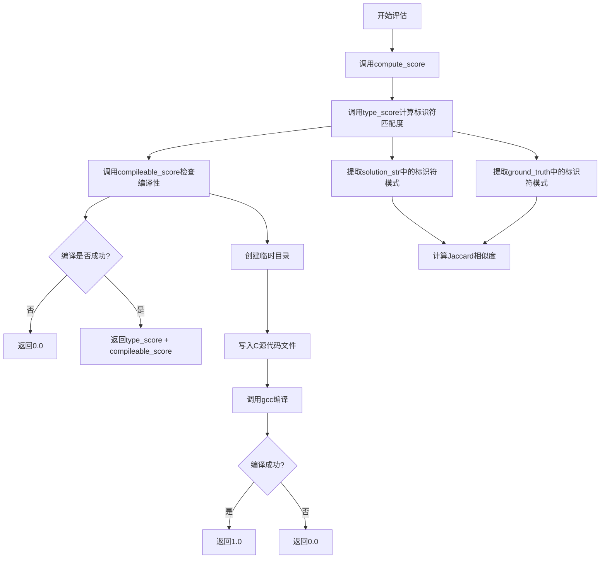
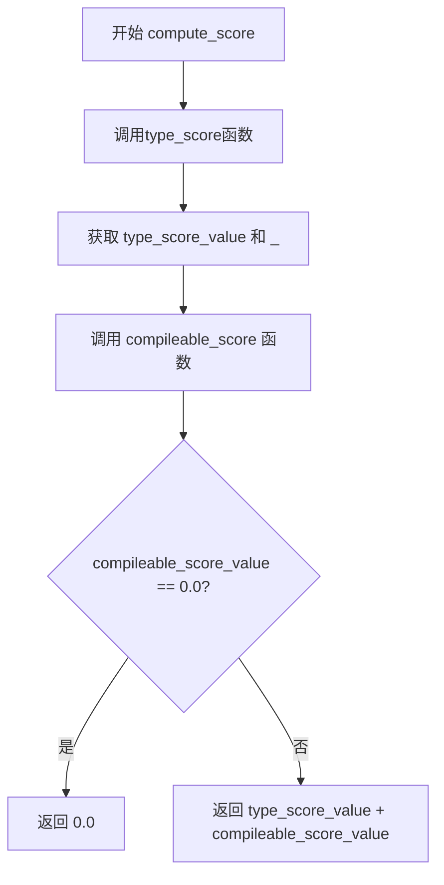
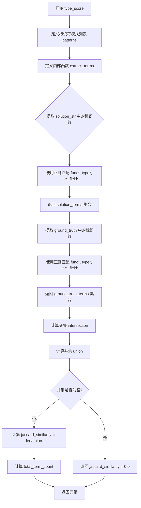
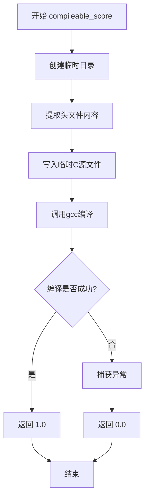
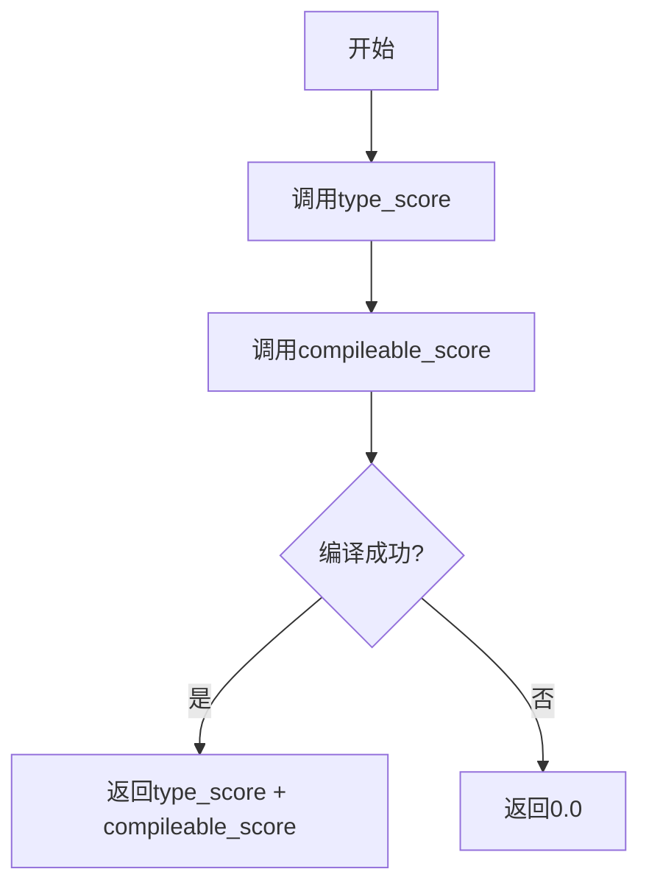
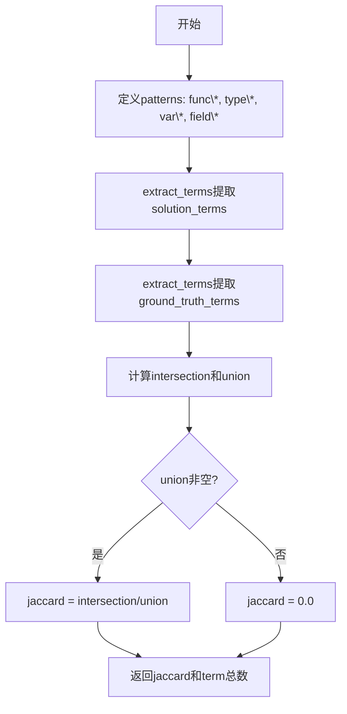
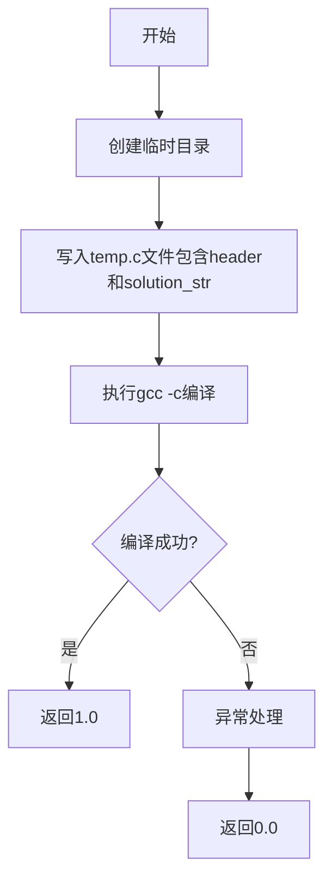

# `LLM4Decompile\sk2decompile\verl\SK2DECOMPILE\reward_functions\exe_type.py` 详细设计文档

这是一个用于评估反编译C代码质量的奖励函数，通过计算代码的可编译性（gcc编译是否成功）和占位符标识符匹配度（Jaccard相似度）来综合评分，旨在衡量反编译器生成的代码与真实代码的结构相似性。

## 整体流程



## 类结构

```
模块文件 (无类定义)
├── compute_score (主评分函数)
├── type_score (标识符匹配评分)
└── compileable_score (编译性评分)
```

## 全局变量及字段


### `patterns`
    
用于匹配C语言中占位符标识符的正则表达式模式列表，包含func*、type*、var*、field*四种模式

类型：`list[str]`
    


    

## 全局函数及方法


### `compute_score`

该函数是SK2Decompile论文中参考奖励函数的核心实现，用于评估解构代码的质量。它首先计算候选代码与真实代码之间的标识符Jaccard相似度（类型得分），然后检查候选代码是否可编译（编译得分），最终返回两者之和（若不可编译则返回0）。

参数：

- `solution_str`：`str`，候选的解构代码字符串
- `ground_truth`：`str`，真实/标准答案的代码字符串
- `extra_info`：`Optional[dict]`，可选字典，可包含'header'键用于C头文件声明

返回值：`float`，若代码可编译则返回类型得分与编译得分之和，否则返回0.0

#### 流程图



#### 带注释源码

```python
def compute_score(solution_str, ground_truth, extra_info=None):
    """
    计算解构代码的总得分。
    
    该函数结合了标识符匹配得分（type_score）和代码可编译性得分（compileable_score）。
    只有当代码能够成功编译时，才会返回非零分数。
    
    参数:
        solution_str: 候选的解构代码字符串
        ground_truth: 真实/标准答案的代码字符串
        extra_info: 可选字典，可包含'header'键用于C头文件声明
    
    返回:
        float: 若可编译返回type_score + compileable_score，否则返回0.0
    """
    # 调用type_score函数计算标识符Jaccard相似度
    # 返回两个值：jaccard_similarity和total_term_count，这里只需要第一个
    type_score_value, _ = type_score(solution_str, ground_truth, extra_info)
    
    # 调用compileable_score函数检查代码是否可编译
    compileable_score_value = compileable_score(solution_str, ground_truth, extra_info)

    # 如果代码不可编译，直接返回0.0
    if compileable_score_value == 0.0:
        return 0.0

    # 否则返回类型得分与编译得分之和
    return type_score_value + compileable_score_value
```


### `type_score`

计算候选代码与标准答案代码之间关于占位符标识符模式（func*、type*、var*、field*）的Jaccard相似度，用于评估去编译后代码中类型相关标识符的匹配程度。

参数：

- `solution_str`：`str`，待评估的去编译候选代码字符串
- `ground_truth`：`str`，标准答案/真实代码字符串
- `extra_info`：`dict | None`，可选的额外信息字典（当前函数未使用，保留接口一致性）

返回值：`tuple[float, int]`，返回元组包含Jaccard相似度（0.0到1.0之间的浮点数）和总的标识符计数（整数）

#### 流程图



#### 带注释源码

```python
def type_score(solution_str, ground_truth, extra_info=None):
    """
    Compute Jaccard similarity over identifier patterns (func*, type*, var*, field*)
    between candidate and ground truth code.

    Returns:
        (jaccard_similarity, total_term_count)
    """
    # 定义正则表达式模式列表，匹配以 func/type/var/field 开头的单词边界
    # \b 表示单词边界，\w* 表示零个或多个字母数字下划线字符
    patterns = [r'\bfunc\w*\b', r'\btype\w*\b', r'\bvar\w*\b', r'\bfield\w*\b']

    def extract_terms(text):
        """
        从给定文本中提取所有匹配标识符模式的术语
        
        参数:
            text: 待分析的文本字符串
        返回:
            包含所有匹配术语的集合（去重）
        """
        terms = set()  # 使用集合存储以自动去重
        for pattern in patterns:
            # 使用正则表达式查找所有匹配的术语并添加到集合
            terms.update(re.findall(pattern, text))
        return terms

    # 从候选解决方案中提取标识符集合
    solution_terms = extract_terms(solution_str)
    # 从标准答案中提取标识符集合
    ground_truth_terms = extract_terms(ground_truth)

    # 计算两个集合的交集：共同拥有的标识符
    intersection = solution_terms.intersection(ground_truth_terms)
    # 计算两个集合的并集：所有出现的标识符
    union = solution_terms.union(ground_truth_terms)

    # 计算Jaccard相似度：交集大小 / 并集大小
    # 如果并集为空（无任何标识符），则返回0.0避免除零错误
    jaccard_similarity = len(intersection) / len(union) if union else 0.0
    
    # 返回Jaccard相似度和总标识符计数（两个集合大小之和）
    return jaccard_similarity, len(solution_terms) + len(ground_truth_terms)
```


### `compileable_score`

该函数用于评估候选C代码是否能够通过gcc编译器成功编译，返回编译成功标志（1.0表示可编译，0.0表示不可编译）。函数通过创建临时文件并调用gcc编译器进行编译测试，同时支持可选的头文件声明输入。

参数：

- `solution_str`：`str`，待测试编译的候选C代码字符串
- `ground_truth`：`str`，ground truth代码字符串（在此函数中未直接使用，保留参数一致性）
- `extra_info`：`dict` 或 `None`，可选字典，可包含'header'键用于传递C头文件声明内容

返回值：`float`，返回1.0表示代码可编译，返回0.0表示编译失败或发生异常

#### 流程图



#### 带注释源码

```python
def compileable_score(solution_str, ground_truth, extra_info=None):
    """
    Check if the candidate C code compiles with gcc.

    Args:
        solution_str: Candidate C code to test for compilability.
        ground_truth: Ground truth code (unused in this function, kept for API consistency).
        extra_info: Optional dict with 'header' key containing C header declarations.

    Returns:
        1.0 if compilable, 0.0 otherwise.
    """
    # 使用临时目录上下文管理器，自动清理临时文件
    with tempfile.TemporaryDirectory() as tmpdir:
        try:
            # 构建临时源文件和目标文件的路径
            source_file = os.path.join(tmpdir, "temp.c")
            object_file = os.path.join(tmpdir, "temp.o")
            
            # 从extra_info中提取header内容，若不存在则为空字符串
            header = extra_info.get('header', '') if extra_info else ''

            # 将header和solution_str写入临时C源文件
            with open(source_file, 'w') as f:
                f.write(f'{header}\n\n{solution_str}')

            # 使用subprocess运行gcc编译器进行编译测试
            # -c: 只编译不链接
            # -o: 指定输出文件
            # stdout/stderr: 捕获输出避免打印
            # timeout: 5秒超时防止长时间挂起
            # check=True: 若返回码非0则抛出异常
            proc = subprocess.run(
                ['gcc', '-c', source_file, '-o', object_file],
                stdout=subprocess.PIPE,
                stderr=subprocess.PIPE,
                timeout=5,
                check=True
            )
            # 根据进程返回码判断编译是否成功
            return 1.0 if proc.returncode == 0 else 0.0
        except Exception:
            # 捕获所有异常（编译错误、超时、文件IO错误等）并返回0.0
            return 0.0
```

## 关键组件


### 代码核心功能概述

该代码实现了一个用于评估反编译C代码质量的奖励函数，通过结合代码可编译性检查（使用gcc编译）和占位符标识符匹配（Jaccard相似度计算func*、type*、var*、field*模式）来生成最终评分。

### 文件整体运行流程

1. 入口函数`compute_score()`接收候选代码solution_str和真值代码ground_truth
2. 分别调用`type_score()`计算标识符相似度和`compileable_score()`计算可编译性得分
3. 若编译得分为0则直接返回0，否则返回两者之和
4. `type_score()`使用正则表达式从两段代码中提取标识符集合，计算Jaccard相似度
5. `compileable_score()`创建临时目录写入C源文件，调用gcc编译并返回结果

### 全局函数详细信息

#### compute_score

- **参数**：
  - `solution_str` (str): 候选反编译代码
  - `ground_truth` (str): 真值标准答案代码
  - `extra_info` (dict, optional): 额外信息，可包含header字段
- **返回值**：float - 最终奖励分数
- **mermaid流程图**：

- **源码**：
```python
def compute_score(solution_str, ground_truth, extra_info=None):
    type_score_value, _ = type_score(solution_str, ground_truth, extra_info)
    compileable_score_value = compileable_score(solution_str, ground_truth, extra_info)

    if compileable_score_value == 0.0:
        return 0.0

    return type_score_value + compileable_score_value
```

#### type_score

- **参数**：
  - `solution_str` (str): 候选代码
  - `ground_truth` (str): 真值代码
  - `extra_info` (dict, optional): 额外信息
- **返回值**：tuple - (jaccard_similarity, total_term_count)
- **mermaid流程图**：

- **源码**：
```python
def type_score(solution_str, ground_truth, extra_info=None):
    """
    Compute Jaccard similarity over identifier patterns (func*, type*, var*, field*)
    between candidate and ground truth code.

    Returns:
        (jaccard_similarity, total_term_count)
    """
    patterns = [r'\bfunc\w*\b', r'\btype\w*\b', r'\bvar\w*\b', r'\bfield\w*\b']

    def extract_terms(text):
        terms = set()
        for pattern in patterns:
            terms.update(re.findall(pattern, text))
        return terms

    solution_terms = extract_terms(solution_str)
    ground_truth_terms = extract_terms(ground_truth)

    intersection = solution_terms.intersection(ground_truth_terms)
    union = solution_terms.union(ground_truth_terms)

    jaccard_similarity = len(intersection) / len(union) if union else 0.0
    return jaccard_similarity, len(solution_terms) + len(ground_truth_terms)
```

#### compileable_score

- **参数**：
  - `solution_str` (str): 候选C代码
  - `ground_truth` (str): 真值代码
  - `extra_info` (dict, optional): 可包含'header'键提供C头声明
- **返回值**：float - 1.0表示可编译，0.0表示不可编译
- **mermaid流程图**：

- **源码**：
```python
def compileable_score(solution_str, ground_truth, extra_info=None):
    """
    Check if the candidate C code compiles with gcc.

    Args:
        extra_info: Optional dict with 'header' key containing C header declarations.

    Returns:
        1.0 if compilable, 0.0 otherwise.
    """
    with tempfile.TemporaryDirectory() as tmpdir:
        try:
            source_file = os.path.join(tmpdir, "temp.c")
            object_file = os.path.join(tmpdir, "temp.o")
            header = extra_info.get('header', '') if extra_info else ''

            with open(source_file, 'w') as f:
                f.write(f'{header}\n\n{solution_str}')

            proc = subprocess.run(
                ['gcc', '-c', source_file, '-o', object_file],
                stdout=subprocess.PIPE,
                stderr=subprocess.PIPE,
                timeout=5,
                check=True
            )
            return 1.0 if proc.returncode == 0 else 0.0
        except Exception:
            return 0.0
```

### 关键组件信息

#### 标识符模式匹配器

使用正则表达式\bfunc\w*\b、\btype\w*\b、\bvar\w*\b、\bfield\w*\b从代码中提取占位符标识符，用于计算Jaccard相似度

#### 临时文件编译器

利用tempfile.TemporaryDirectory创建隔离的编译环境，执行gcc -c命令验证代码可编译性

#### Jaccard相似度计算器

计算候选代码与真值代码在标识符集合上的交集与并集比值，衡量结构恢复质量

### 潜在技术债务与优化空间

1. **硬编码的正则模式**：标识符模式固定为func/type/var/field，建议改为可配置或支持自定义模式
2. **异常处理过于宽泛**：catch Exception返回0.0丢失了具体错误信息，建议分层处理不同异常类型
3. **编译超时固定5秒**：对于大型代码可能不足，建议可配置超时时间
4. **未使用ground_truth参数**：compileable_score函数接收ground_truth但实际未使用，存在设计冗余
5. **缺少日志记录**：编译失败时无详细日志，不利于调试和问题追踪

### 其他项目信息

#### 设计目标与约束

- 目标：评估反编译代码的结构恢复质量，结合语法正确性（可编译性）和语义相似度（标识符匹配）
- 约束：依赖gcc编译器、仅支持C语言、临时文件自动清理

#### 错误处理与异常设计

- 编译超时：5秒超时限制
- 异常捕获：统一返回0.0表示不可用
- 文件操作：使用上下文管理器自动关闭文件

#### 外部依赖与接口契约

- 依赖：os、re、subprocess、tempfile标准库
- 接口：compute_score(solution_str, ground_truth, extra_info=None)返回float分数


## 问题及建议


### 已知问题

- **异常处理过于宽泛**：捕获所有 `Exception` 并返回 0.0，隐藏了真实的编译错误信息，导致难以调试和定位问题
- **gcc 依赖无检查**：代码假设 `gcc` 必定存在，若系统中未安装 gcc 会导致意外失败
- **编译超时设置过短**：`timeout=5` 秒可能无法完成大型或复杂 C 代码的编译
- **header 参数获取方式脆弱**：`extra_info.get('header', '')` 依赖于调用方正确传入字典，若传入 `None` 或非字典类型会导致 `AttributeError`
- **正则表达式重复编译**：每次调用 `type_score` 都重新编译四个正则表达式模式，性能低下
- **Jaccard 相似度边界情况**：`union` 为空时返回 0.0，但当 solution 和 ground_truth 都为空时应返回特定值（如 1.0 表示完全匹配）
- **临时文件权限未设置**：生成的临时 C 源文件未设置安全的文件权限，可能存在竞态条件风险
- **缺少日志记录**：编译失败时无任何错误日志，无法追踪失败原因
- **返回值未充分利用**：`type_score` 返回的 `total_term_count` 在 `compute_score` 中被忽略
- **编译产物未清理**：虽然使用 `TemporaryDirectory`，但 `-c` 编译产生的 `.o` 文件未显式清理

### 优化建议

- **细化异常处理**：分别为不同异常类型（如 `FileNotFoundError`、`subprocess.TimeoutExpired`）设计处理逻辑，记录具体错误信息
- **添加 gcc 可用性检查**：在调用前检查 `gcc` 是否存在，如通过 `shutil.which('gcc')` 验证
- **增加编译超时**：根据实际编译需求调整 timeout 值，或将其设为可配置参数
- **强化参数校验**：在函数入口添加 `extra_info` 类型检查，确保其为字典类型
- **预编译正则表达式**：将 patterns 提升为模块级常量，使用 `re.compile()` 预编译
- **优化 Jaccard 计算逻辑**：明确处理空集合的边界情况，添加合理的返回值语义
- **设置安全文件权限**：使用 `os.chmod` 为临时文件设置最小权限（如 0o600）
- **引入日志框架**：使用 `logging` 模块记录编译过程的详细信息
- **清理编译产物**：显式删除 `.o` 文件或使用更细粒度的临时文件管理
- **添加单元测试**：为各种边界情况（如空输入、无效输入）编写测试用例

## 其它


### 设计目标与约束

本模块的设计目标是实现SK2Decompile论文中描述的Structure Recovery奖励函数，用于评估反编译代码的质量。核心约束包括：1) 仅支持C语言代码评估；2) 依赖gcc编译器进行编译检查；3) 超时限制为5秒防止编译挂起；4) 使用临时目录隔离编译环境。

### 错误处理与异常设计

主要异常处理场景包括：1) gcc命令不存在或未安装；2) 编译超时；3) 临时目录创建失败；4) 文件写入异常。所有异常均返回0.0分，确保评估过程的健壮性。异常信息通过subprocess的stderr捕获但不向用户暴露细节。

### 数据流与状态机

数据流为：输入solution_str和ground_truth → extract_terms提取标识符 → 计算Jaccard相似度 → 尝试编译solution_str → 组合得分。没有复杂状态机，仅有编译成功/失败两种状态。

### 外部依赖与接口契约

外部依赖：1) gcc编译器必须安装且可执行；2) Python标准库（os, re, subprocess, tempfile）。接口契约：compute_score/solution_str和ground_truth参数为字符串，extra_info为可选字典，函数返回浮点数得分。

### 性能考虑

性能瓶颈在编译检查环节，已通过5秒超时和临时目录自动清理缓解。标识符提取使用正则表达式，复杂度为O(n)线性。

### 安全性考虑

1) 使用tempfile.TemporaryDirectory()确保临时文件自动清理；2) 编译过程受限在临时目录，无法访问外部文件系统；3) 未执行生成的代码，仅编译检查。

### 测试策略

建议测试用例：1) 完全匹配的理想代码（得分2.0）；2) 可编译但标识符不匹配（得分1.0）；3) 不可编译代码（得分0.0）；4) 空代码处理；5) gcc不存在时的降级处理。

### 使用示例

```python
solution = "int func1() { var1 x; }"
ground_truth = "int func1() { var1 y; }"
score = compute_score(solution, ground_truth)
# 编译成功 + 标识符匹配 = 2.0
```

### 限制与假设

假设：1) 输入为有效的C代码字符串；2) 系统已安装gcc。限制：不支持多文件编译、不支持链接其他库、不评估运行时行为。

    