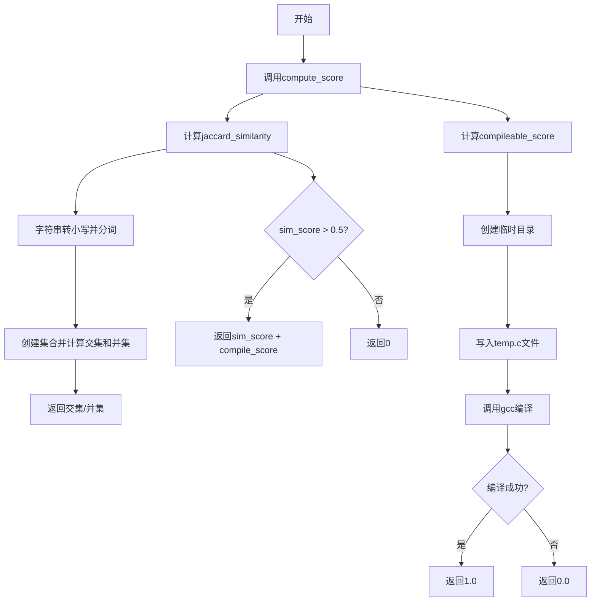
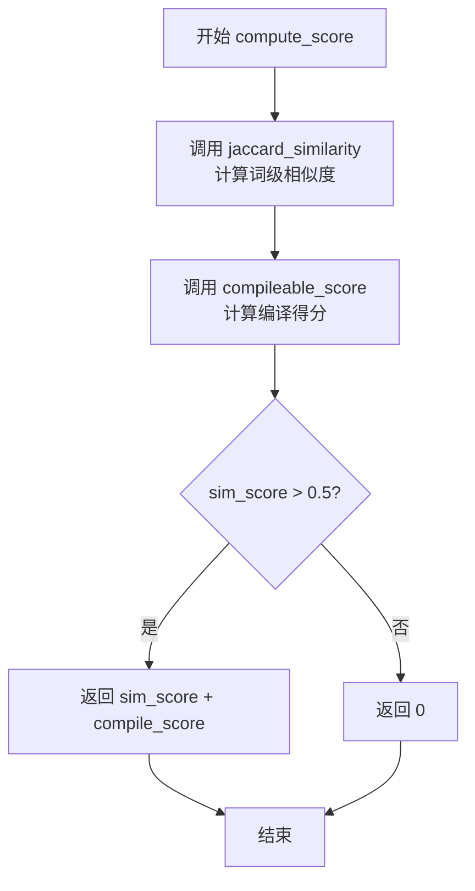
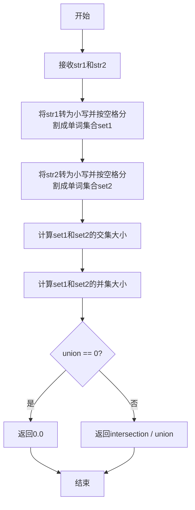
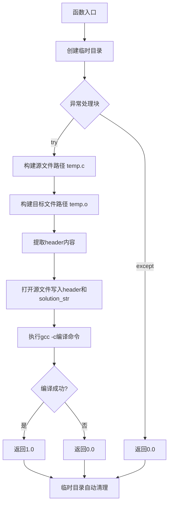

# `LLM4Decompile\sk2decompile\verl\SK2DECOMPILE\reward_functions\sim_exe.py` 详细设计文档

这是一个用于评估反编译代码质量的奖励函数，通过计算候选代码与真实代码之间的词级Jaccard相似度，并检查代码是否可编译来综合评分，最终得分仅在相似度大于0.5时才累加编译得分。

## 整体流程



## 类结构

```
模块级函数 (无类)
├── compute_score (主评分函数)
├── jaccard_similarity (相似度计算)
└── compileable_score (编译检查)
```

## 全局变量及字段


    

## 全局函数及方法


### `compute_score`

该函数是SK2Decompile RL训练 pipeline 的参考奖励函数核心实现，通过计算候选解与真实代码之间的词级Jaccard相似度以及C代码可编译性得分，在相似度超过0.5阈值时将两者相加作为最终奖励，否则返回0，从而同时驱动代码语义相似性和语法正确性的优化。

参数：

- `solution_str`：`str`，候选的反编译代码字符串
- `ground_truth`：`str`，地面真实（参考）C代码字符串
- `extra_info`：`dict | None`，可选的额外信息字典，目前支持 `'header'` 键用于提供C头文件声明

返回值：`float`，最终奖励分数（当相似度>0.5时为两者之和，否则为0）

#### 流程图



#### 带注释源码

```python
def compute_score(solution_str, ground_truth, extra_info=None):
    """
    计算SK2Decompile奖励函数的总得分。
    
    奖励由两部分组成：
    1. 词级Jaccard相似度 (0~1)
    2. 编译得分 (0或1)
    
    只有当相似度超过0.5阈值时，编译得分才会被计入最终奖励。
    这确保了模型同时优化语义相似性和语法正确性。
    
    Args:
        solution_str: 候选反编译代码
        ground_truth: 参考真实代码
        extra_info: 可选，包含'header'键的字典用于编译时的头文件
    
    Returns:
        float: 最终奖励分数
    """
    # 第一步：计算词级Jaccard相似度
    sim_score = jaccard_similarity(solution_str, ground_truth)
    
    # 第二步：计算代码可编译性得分
    compile_score = compileable_score(solution_str, ground_truth, extra_info)

    # 只有当相似度超过阈值时才计入编译奖励
    if sim_score > 0.5:
        return sim_score + compile_score
    return 0
```


### `jaccard_similarity`

该函数用于计算两个字符串之间的词级Jaccard相似度，通过将字符串转换为小写单词集合，然后计算集合的交集与并集之比来评估文本相似程度。

参数：

- `str1`：`str`，第一个用于比较的字符串
- `str2`：`str`，第二个用于比较的字符串

返回值：`float`，返回Jaccard相似度分数，范围为0.0到1.0之间，其中1.0表示两个字符串的词集合完全相同

#### 流程图



#### 带注释源码

```python
def jaccard_similarity(str1, str2):
    """Compute word-level Jaccard similarity between two strings."""
    # 将第一个字符串转为小写并按空格分割成单词集合
    set1 = set(str1.lower().split())
    # 将第二个字符串转为小写并按空格分割成单词集合
    set2 = set(str2.lower().split())

    # 计算两个集合的交集元素数量
    intersection = len(set1.intersection(set2))
    # 计算两个集合的并集元素数量
    union = len(set1.union(set2))

    # 如果并集为空（两个字符串都为空或只有空格），返回0.0
    if union == 0:
        return 0.0
    # 否则返回交集与并集的比值，即Jaccard相似度
    return intersection / union
```


### `compileable_score`

该函数用于检查候选的C代码是否能够通过gcc编译器成功编译，通过创建临时源文件并调用gcc的-c选项进行编译检查，返回1.0表示可编译，0.0表示不可编译。

参数：

- `solution_str`：`str`，候选的C代码字符串
- `ground_truth`：`str`，真实代码字符串（当前版本中未使用，保留用于接口一致性）
- `extra_info`：`Optional[dict]`，可选字典，可包含'header'键，其值为C头文件声明内容

返回值：`float`，1.0表示代码可成功编译，0.0表示编译失败或发生异常

#### 流程图



#### 带注释源码

```python
def compileable_score(solution_str, ground_truth, extra_info=None):
    """
    Check if the candidate C code compiles with gcc.

    Args:
        solution_str: The candidate C code string to check for compilability.
        ground_truth: The ground truth C code string (unused in current implementation).
        extra_info: Optional dict with 'header' key containing C header declarations.

    Returns:
        1.0 if compilable, 0.0 otherwise.
    """
    # 使用上下文管理器创建临时目录，函数结束时自动清理
    with tempfile.TemporaryDirectory() as tmpdir:
        try:
            # 构建临时源文件和目标文件的完整路径
            source_file = os.path.join(tmpdir, "temp.c")
            object_file = os.path.join(tmpdir, "temp.o")
            
            # 从extra_info中提取header内容，若不存在则为空字符串
            header = extra_info.get('header', '') if extra_info else ''

            # 将header和solution_str写入临时源文件
            with open(source_file, 'w') as f:
                f.write(f'{header}\n\n{solution_str}')

            # 使用subprocess运行gcc编译命令
            # -c: 只编译不链接
            # -o: 指定输出文件
            # timeout=5: 设置5秒超时防止挂起
            proc = subprocess.run(
                ['gcc', '-c', source_file, '-o', object_file],
                stdout=subprocess.PIPE,
                stderr=subprocess.PIPE,
                timeout=5,
                check=True
            )
            
            # 根据返回码判断编译是否成功，成功返回1.0
            return 1.0 if proc.returncode == 0 else 0.0
        
        # 捕获任何异常（超时、文件IO错误、编译错误等）并返回0.0
        except Exception:
            return 0.0
```

## 关键组件


### compute_score

主评分函数，综合Jaccard相似度和编译可行性评分计算最终得分。仅当相似度大于0.5时才加入编译评分，否则返回0。

### jaccard_similarity

词级Jaccard相似度计算函数，通过将字符串转为小写并按空格分割为词集合，然后计算集合的交集与并集比值。

### compileable_score

编译可行性检查函数，使用gcc编译器尝试编译C代码片段，通过临时文件执行编译并返回是否成功的二进制评分。

### extra_info参数

可选的额外信息字典，可包含'header'键用于提供C头文件声明，使待编译代码能够正确引用外部函数和类型。

### 编译超时机制

使用subprocess.run的5秒超时限制，防止恶意或无限循环的代码导致评估流程阻塞。


## 问题及建议


### 已知问题

-   **异常处理过于宽泛**：`compileable_score`函数捕获所有异常并静默返回0.0，无法区分编译失败、进程超时、系统错误等不同情况，掩盖了真正的错误原因
-   **硬编码阈值缺乏灵活性**：`sim_score > 0.5`阈值和`timeout=5`超时值硬编码在代码中，无法通过参数配置调整
-   **函数命名拼写错误**：`compileable_score`应为`compilable_score`（缺少字母'l'），影响代码可读性
-   **缺少参数验证**：`compute_score`、`jaccard_similarity`和`compileable_score`函数均未对输入参数进行有效性校验，可能导致运行时错误
-   **重复编译开销**：对于相同的代码片段，每次调用都会重新创建临时目录、写入文件并调用gcc编译，缺乏缓存机制
-   **临时文件资源未显式清理**：虽然使用`tempfile.TemporaryDirectory()`上下文管理器，但如果编译过程被中断，可能存在资源残留风险
-   **subprocess安全风险**：直接执行gcc命令且无资源限制，`solution_str`内容未经安全检查直接写入文件，存在潜在的代码注入风险
-   **返回值类型不一致风险**：`compileable_score`在异常时返回0.0（浮点数），但代码结构暗示可能期望整数类型

### 优化建议

-   **引入配置类或参数**：将阈值、超时时间等配置项提取为函数参数或配置对象，提高可测试性和可维护性
-   **改进错误处理策略**：区分不同异常类型，使用日志记录具体错误信息，必要时重新抛出特定异常而非静默吞噬
-   **添加输入验证**：在函数入口处验证参数类型和非空性，使用类型注解增强代码可读性
-   **实现编译结果缓存**：对于相同的代码字符串，可使用哈希映射缓存编译结果，避免重复编译开销
-   **限制gcc编译选项**：仅启用必要的编译警告和检查，禁用可能导致安全问题的优化选项
-   **修复拼写错误**：将`compileable`更正为`compilable`以保持代码一致性
-   **统一返回值类型**：明确`compileable_score`的返回类型为浮点数（0.0或1.0）并添加文档说明

## 其它


### 设计目标与约束

本模块作为SK2Decompile强化学习训练管道的奖励函数，旨在评估反编译C代码的质量。核心目标是结合词级语义相似度（jaccard_similarity）和可编译性（compilability）两个维度来综合评分，激励模型生成既语义接近原始代码又可编译的反编译结果。设计约束包括：相似度阈值0.5作为启动条件（仅当相似度>0.5时才计入编译分数）、超时机制（gcc编译限制5秒）、临时文件自动清理。

### 错误处理与异常设计

代码采用"安静失败"（fail-safe）策略：所有异常均返回0分。`compute_score`函数本身未显式捕获异常，依赖调用方处理；`jaccard_similarity`通过空集合检查避免除零错误；`compileable_score`使用try-except捕获所有异常（包括subprocess超时、文件IO错误、gcc未安装等），确保进程异常时不中断主训练流程。异常处理粒度较粗，缺少细粒度的错误分类和日志记录。

### 数据流与状态机

数据流为：输入（solution_str, ground_truth, extra_info） → Jaccard相似度计算 → 编译检查 → 分数合成。无复杂状态机，流程为线性管道。输入验证隐式进行（空字符串返回0相似度）。临时文件生命周期仅存在于`compileable_score`函数的作用域内，函数结束后自动清理。

### 外部依赖与接口契约

外部依赖：1）`gcc`编译器（必须安装且在PATH中）；2）Python标准库（os, subprocess, tempfile）。接口契约：`compute_score(solution_str, ground_truth, extra_info=None)`接受字符串和可选字典，`jaccard_similarity(str1, str2)`接受任意字符串，`compileable_score`内部处理临时文件但不暴露给调用方。`extra_info`字典的`header`键用于传递C头文件声明，确保编译环境完整。

### 性能特征与资源需求

时间复杂度：Jaccard相似度为O(n+m)（集合操作），编译检查为O(gcc执行时间)，主要瓶颈在gcc编译（受代码复杂度影响）。空间复杂度：O(n+m)用于存储词集合。编译超时硬限制5秒，防止恶意代码或无限循环导致进程挂起。临时目录使用`tempfile.TemporaryDirectory()`，进程异常退出时由操作系统清理。

### 安全性考量与潜在风险

1）命令注入风险：`gcc`命令参数来自可信输入（模型生成的代码），但若攻击者控制`extra_info['header']`可注入恶意gcc参数；2）资源耗尽：未限制输入代码大小，可能导致内存或临时磁盘空间耗尽；3）符号链接攻击：临时文件路径固定，可能被符号链接攻击（低风险，因使用`tempfile`）；4）超时保护：5秒超时可防止无限编译，但无法防止编译恶意代码生成的后门。

### 配置管理与扩展性

当前设计为硬编码，配置（如gcc路径、编译超时、相似度阈值）未参数化。扩展方向：1）支持自定义编译器（clang, icc）；2）支持多种相似度算法（BLEU, METEOR）；3）支持编译警告作为细粒度评分；4）支持缓存编译结果以加速训练。模块化程度较高，函数间耦合低，易于扩展。

### 使用示例与调用约定

典型调用场景：
```python
# 基础调用
score = compute_score(candidate_code, ground_truth_code)

# 带头文件的编译检查
score = compute_score(candidate_code, ground_truth_code, extra_info={'header': 'int func(int x);'})
```
调用方需确保：1）`solution_str`和`ground_truth`为有效字符串；2）`extra_info`为字典或None；3）gcc可用。返回值范围：[0, 2]，其中[0,1.5]为常见区间。


    