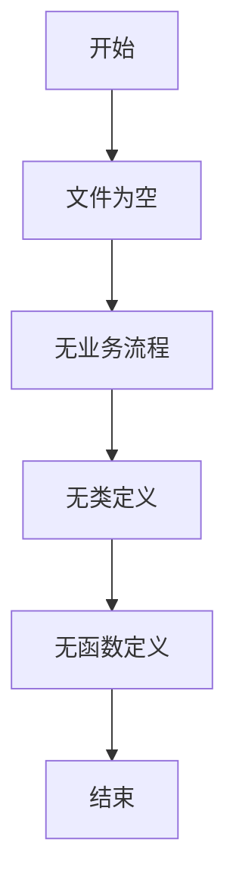

# `LLM4Decompile\train\colossalai_llm4decompile\colossal_llama\__init__.py` 详细设计文档

该文件仅包含Python脚本的标准头部声明（shebang和编码声明），未包含任何实际的业务逻辑代码，因此无法进行详细的功能分析。

## 整体流程



## 类结构

```
无类层次结构（代码为空）
```

## 全局变量及字段


    

## 全局函数及方法


## 关键组件


无关键组件可识别。该代码文件仅包含Python脚本的标准头部声明（shebang和编码声明），未包含任何实际功能代码、类定义或函数实现，因此无法提取张量索引、反量化、量化策略等关键组件信息。


## 问题及建议


### 已知问题

-   **空代码文件**：当前代码仅包含Python文件头声明，没有任何实际功能逻辑、类、函数或变量定义
-   **缺少文档字符串**：文件级别缺少模块级文档字符串（docstring）
-   **缺少程序入口**：没有`if __name__ == "__main__":`入口点
-   **功能完全缺失**：无法进行任何逻辑分析，因为不存在可分析的业务代码

### 优化建议

-   **补充功能代码**：根据业务需求添加实际的类、函数和逻辑实现
-   **添加文档字符串**：在文件开头添加模块级文档说明，描述该文件的用途和功能
-   **定义主入口**：添加`if __name__ == "__main__":`块以支持直接运行脚本
-   **代码组织**：建议按照功能模块划分，可考虑拆分为多个类或函数
-   **错误处理**：实现适当的异常处理机制
-   **类型注解**：为函数参数和返回值添加类型提示，提高代码可维护性


## 其它


### 设计目标与约束

由于提供的代码仅为空的Python文件模板，无实际功能实现，因此无法确定具体的设计目标与约束。

### 错误处理与异常设计

由于代码为空，暂无错误处理与异常设计相关内容。

### 数据流与状态机

由于代码为空，暂无数据流与状态机相关内容。

### 外部依赖与接口契约

由于代码为空，暂无外部依赖与接口契约相关内容。

### 性能要求与指标

由于代码为空，暂无性能要求与指标相关内容。

### 安全考虑

由于代码为空，暂无安全考虑相关内容。

### 配置管理

由于代码为空，暂无配置管理相关内容。

### 测试策略

由于代码为空，暂无测试策略相关内容。

### 部署相关

由于代码为空，暂无部署相关内容。

### 版本兼容性

由于代码为空，暂无版本兼容性要求。

### 备注

当前提供的代码文件仅包含Python脚本的标准头部声明（shebang和编码声明），没有任何实际功能逻辑实现。上述各项内容均无法基于空代码进行详细描述。如需生成完整的详细设计文档，请提供具有实际业务逻辑的代码。


    