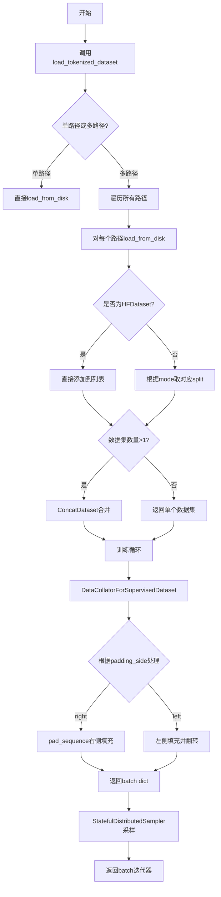
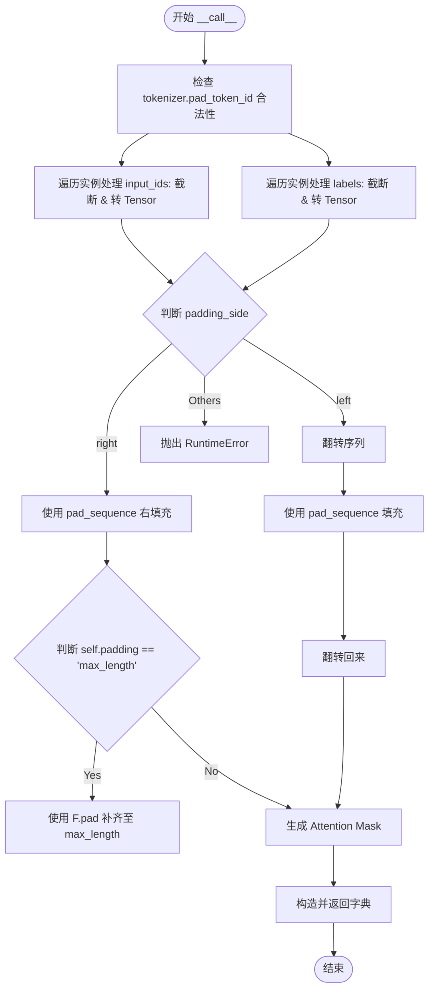
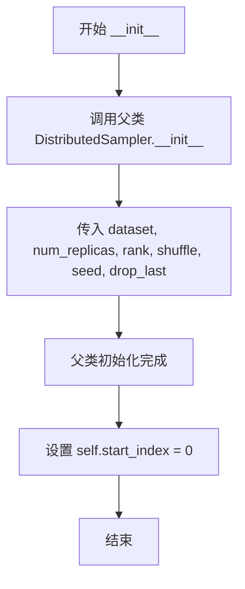
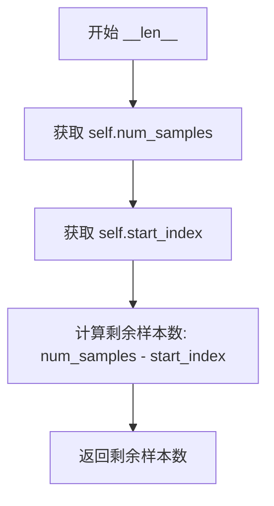
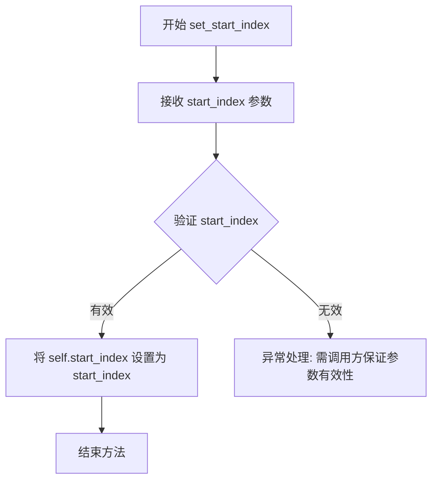

# `LLM4Decompile\train\colossalai_llm4decompile\colossal_llama\dataset\loader.py` 详细设计文档

该模块提供数据加载和批处理功能，支持从磁盘加载预tokenized的数据集，对批次样本进行填充对齐处理，并提供有状态的分发采样器以支持多阶段训练场景。

## 整体流程



## 类结构

```
Global Types
├── DatasetType (Union type alias)
└── PathType (Union type alias)
Global Functions
└── load_tokenized_dataset
DataCollatorForSupervisedDataset (dataclass)
└── __call__ (collate instances)
StatefulDistributedSampler (extends DistributedSampler)
├── __init__
├── __iter__
├── __len__
└── set_start_index
```

## 全局变量及字段


### `DatasetType`
    
数据集类型联合别名，支持单数据集、concat数据集和HuggingFace数据集字典

类型：`Union[Dataset, ConcatDataset, dataset_dict.Dataset]`
    


### `PathType`
    
路径类型联合别名，支持字符串和PathLike对象

类型：`Union[str, os.PathLike]`
    


### `mode_map`
    
模式映射字典 {'train': 'train', 'dev': 'validation', 'test': 'test'}

类型：`Dict[str, str]`
    


### `datasets`
    
临时数据集列表变量，用于存放加载的数据集对象

类型：`List[datasets.dataset_dict.Dataset]`
    


### `DataCollatorForSupervisedDataset.tokenizer`
    
分词器实例，用于pad和token处理

类型：`PreTrainedTokenizer`
    


### `DataCollatorForSupervisedDataset.max_length`
    
输入序列最大长度，默认4096

类型：`int`
    


### `DataCollatorForSupervisedDataset.ignore_index`
    
标签中忽略位置的填充值，默认-100

类型：`int`
    


### `DataCollatorForSupervisedDataset.padding`
    
填充策略，默认max_length

类型：`str`
    


### `StatefulDistributedSampler.start_index`
    
采样起始索引，支持多阶段训练恢复

类型：`int`
    
    

## 全局函数及方法


### `load_tokenized_dataset`

该函数用于加载预tokenized数据集，支持单个或多个路径作为输入，根据mode参数（train/dev/test）从磁盘加载HuggingFace格式的数据集，并返回单个Dataset或多个Dataset合并后的ConcatDataset。

参数：

- `dataset_paths`：`Union[PathType, List[PathType]]`，数据集路径，可以是单个路径（str或os.PathLike）或多个路径的列表
- `mode`：`str`，数据集加载模式，默认为"train"，可选值为"train"、"dev"、"test"

返回值：`Optional[DatasetType]`，返回类型为`Dataset`、`ConcatDataset`或`dataset_dict.Dataset`之一，若加载失败则返回`None`

#### 流程图

```mermaid
flowchart TD
    A[开始] --> B{检查 mode 参数}
    B -->|mode 不在 [train, dev, test]| C[抛出 AssertionError]
    B -->|mode 有效| D{判断 dataset_paths 类型}
    D -->|str 或 PathLike| E[转换为列表: dataset_paths = [dataset_paths]]
    D -->|List| F[保持列表不变]
    E --> G[初始化空列表: datasets = []]
    F --> G
    G --> H{遍历 dataset_paths}
    H -->|遍历每个 ds_path| I[获取绝对路径: ds_path = os.path.abspath]
    I --> J{检查路径是否存在}
    J -->|不存在| K[抛出 AssertionError]
    J -->|存在| L[调用 load_from_disk 加载数据集]
    L --> M{判断 ds_dict 类型}
    M -->|HFDataset| N[直接添加到 datasets]
    M -->|dataset_dict| O{检查 mode_map[mode] 是否存在]
    O -->|存在| P[添加 ds_dict[mode_map[mode]] 到 datasets]
    O -->|不存在| Q[跳过该数据集]
    N --> R[检查 datasets 长度]
    P --> R
    Q --> R
    R -->|长度为 0| S[返回 None]
    R -->|长度为 1| T[pop 并返回单个数据集]
    R -->|长度大于 1| U[返回 ConcatDataset(datasets)]
    H -->|遍历完成| R
    U --> V[结束]
    T --> V
    S --> V
```

#### 带注释源码

```python
def load_tokenized_dataset(
    dataset_paths: Union[PathType, List[PathType]], mode: str = "train"
) -> Optional[DatasetType]:
    """
    Load pre-tokenized dataset.
    Each instance of dataset is a dictionary with
    `{'input_ids': List[int], 'labels': List[int], sequence: str}` format.
    
    参数:
        dataset_paths: 数据集路径，支持单个路径或路径列表
        mode: 数据集模式，默认为训练模式
    
    返回:
        预tokenized的数据集对象，或None（当没有加载到任何数据集时）
    """
    # 定义mode到数据集key的映射关系
    # train对应train, dev对应validation, test对应test
    mode_map = {"train": "train", "dev": "validation", "test": "test"}
    
    # 断言验证mode必须在mode_map的key中
    assert mode in tuple(mode_map), f"Unsupported mode {mode}, it must be in {tuple(mode_map)}"

    # 如果是单个路径，转换为列表以统一处理
    if isinstance(dataset_paths, (str, os.PathLike)):
        dataset_paths = [dataset_paths]

    # 用于存储加载的数据集列表
    datasets = []  # `List[datasets.dataset_dict.Dataset]`
    
    # 遍历每个数据集路径
    for ds_path in dataset_paths:
        # 将路径转换为绝对路径
        ds_path = os.path.abspath(ds_path)
        
        # 断言检查路径是否存在
        assert os.path.exists(ds_path), f"Not existed file path {ds_path}"
        
        # 从磁盘加载预tokenized的数据集
        # keep_in_memory=False 表示不强制将整个数据集加载到内存
        ds_dict = load_from_disk(dataset_path=ds_path, keep_in_memory=False)
        
        # 判断加载结果的类型
        if isinstance(ds_dict, HFDataset):
            # 如果是单个HFDataset，直接添加
            datasets.append(ds_dict)
        else:
            # 如果是dataset_dict，根据mode选择对应的子集
            if mode_map[mode] in ds_dict:
                datasets.append(ds_dict[mode_map[mode]])
    
    # 根据加载结果数量返回不同的数据类型
    if len(datasets) == 0:
        return None  # 没有加载到任何数据集
    if len(datasets) == 1:
        return datasets.pop()  # 返回单个数据集
    # 多个数据集使用ConcatDataset进行合并
    return ConcatDataset(datasets=datasets)
```


### `DataCollatorForSupervisedDataset.__call__`

该方法为监督学习任务提供自定义的数据整理（Collate）逻辑。它接收一个批次的样本列表，根据配置的最大长度截断序列，处理左侧或右侧填充（Padding），并生成对应的注意力掩码（Attention Mask），最终返回包含 `input_ids`、`labels` 和 `attention_mask` 的 PyTorch Tensor 字典。

参数：
- `self`: 隐式参数，指向 `DataCollatorForSupervisedDataset` 实例本身，包含 `tokenizer`, `max_length`, `ignore_index`, `padding` 等配置。
- `instances`：`Sequence[Dict[str, List[int]]]`，批次（Batch）样本列表。每个样本是一个字典，通常包含 `input_ids` (List[int]) 和 `labels` (List[int])。

返回值：`Dict[str, torch.Tensor]`，返回一个包含以下键值的字典：
- `input_ids`：`torch.Tensor`，形状为 (bsz, max_len)，填充后的输入序列ID。
- `attention_mask`：`torch.BoolTensor`，形状为 (bsz, max_len)，标识有效Token的掩码（1表示有效，0表示padding）。
- `labels`：`torch.Tensor`，形状为 (bsz, max_len)，用于计算损失的标签，其中Padding区域使用 `ignore_index` 填充。

#### 流程图



#### 带注释源码

```python
def __call__(self, instances: Sequence[Dict[str, List[int]]]) -> Dict[str, torch.Tensor]:
    """
    对批次样本进行 collate 处理。

    Args:
        instances (Sequence[Dict[str, List[int]]]):
            Mini-batch 样本列表，每个样本存储在独立的字典中。

    Returns:
        (Dict[str, torch.Tensor]): 包含以下 torch.Tensor 的字典:
            input_ids: shape (bsz, max_len);
            attention_mask: shape (bsz, max_len) 的 BoolTensor;
            labels: shape (bsz, max_len), 包含 IGNORE_INDEX。
    """
    # 1. 安全检查：确保 tokenizer 设置了有效的 pad_token_id
    assert isinstance(self.tokenizer.pad_token_id, int) and self.tokenizer.pad_token_id >= 0, (
        f"`{self.tokenizer.__class__.__name__}.pad_token_id` 必须是有效的非负整数, "
        f"但当前值为 `{self.tokenizer.pad_token_id}`"
    )

    # 2. 处理输入序列 input_ids：截断至最大长度并转为 Tensor
    batch_input_ids = [
        (
            torch.LongTensor(instance["input_ids"][: self.max_length])
            if len(instance["input_ids"]) > self.max_length
            else torch.LongTensor(instance["input_ids"])
        )
        for instance in instances
    ]
    
    # 3. 处理标签 labels：截断至最大长度并转为 Tensor
    batch_labels = [
        (
            torch.LongTensor(instance["labels"][: self.max_length])
            if len(instance["labels"]) > self.max_length
            else torch.LongTensor(instance["labels"])
        )
        for instance in instances
    ]

    # 4. 根据 padding_side 分支处理填充逻辑
    if self.tokenizer.padding_side == "right":
        # 右侧填充：直接使用 pad_sequence
        input_ids = torch.nn.utils.rnn.pad_sequence(
            sequences=batch_input_ids,
            batch_first=True,
            padding_value=self.tokenizer.pad_token_id,
        )  # (bsz, max_len)
        labels = torch.nn.utils.rnn.pad_sequence(
            sequences=batch_labels,
            batch_first=True,
            padding_value=self.ignore_index,
        )  # (bsz, max_len)
        
        # 如果配置要求填充到最大长度，进行额外补齐
        if self.padding == "max_length":
            to_pad = self.max_length - input_ids.size(1)
            input_ids = F.pad(input_ids, (0, to_pad), value=self.tokenizer.pad_token_id)
            labels = F.pad(labels, (0, to_pad), value=self.ignore_index)
            
    elif self.tokenizer.padding_side == "left":
        # 左侧填充：先翻转序列 -> pad -> 再翻转回来
        # 这样做是为了让 pad 动作发生在序列的“前端”（原始序列的末端）
        reversed_input_ids = [seq.flip(dims=(0,)) for seq in batch_input_ids]
        reversed_input_ids = torch.nn.utils.rnn.pad_sequence(
            sequences=reversed_input_ids,
            batch_first=True,
            padding_value=self.tokenizer.pad_token_id,
        )  # (bsz, max_len)
        input_ids = torch.flip(reversed_input_ids, dims=(1,))  # (bsz, max_len)
        
        reversed_labels = [seq.flip(dims=(0,)) for seq in batch_labels]
        reversed_labels = torch.nn.utils.rnn.pad_sequence(
            sequences=reversed_labels,
            batch_first=True,
            padding_value=self.ignore_index,
        )  # (bsz, max_len)
        labels = torch.flip(reversed_labels, dims=(1,))  # (bsz, max_len)
    else:
        # 非法配置处理
        raise RuntimeError(
            f"`{self.tokenizer.__class__.__name__}.padding_side` 只能是 'left' 或 'right', "
            f"但当前为 `{self.tokenizer.padding_side}`"
        )

    # 5. 生成注意力掩码：input_ids 中不等于 pad_token_id 的位置为 True
    attention_mask = input_ids.ne(self.tokenizer.pad_token_id)  # torch.BoolTensor, (bsz, max_len)

    # 6. 返回结果字典
    return dict(input_ids=input_ids, attention_mask=attention_mask, labels=labels)
```


### `StatefulDistributedSampler.__init__`

初始化分布式采样器参数，设置数据集、副本数、排名、随机种子等分布式训练相关参数，并将起始索引初始化为0。

参数：

- `self`：`StatefulDistributedSampler` 实例本身
- `dataset`：`DatasetType`，要采样的数据集，支持 Dataset、ConcatDataset 或 dataset_dict.Dataset 类型
- `num_replicas`：`Optional[int]`，分布式训练中的进程数量，默认为 None（自动从环境变量获取）
- `rank`：`Optional[int]`，当前进程的排名，默认为 None（自动从环境变量获取）
- `shuffle`：`bool`，是否在每个 epoch 开始时打乱数据顺序，默认为 True
- `seed`：`int`，用于打乱数据的随机种子，默认为 0
- `drop_last`：`bool`，是否丢弃最后一个不完整的 batch，默认为 False

返回值：`None`，构造函数无返回值

#### 流程图



#### 带注释源码

```python
def __init__(
    self,
    dataset: DatasetType,
    num_replicas: Optional[int] = None,
    rank: Optional[int] = None,
    shuffle: bool = True,
    seed: int = 0,
    drop_last: bool = False,
) -> None:
    """
    初始化分布式采样器。
    
    参数:
        dataset: 要采样的数据集
        num_replicas: 分布式进程总数
        rank: 当前进程排名
        shuffle: 是否打乱数据
        seed: 随机种子
        drop_last: 是否丢弃最后不完整batch
    """
    # 调用父类 DistributedSampler 的初始化方法
    # 父类会设置 num_replicas, rank, epoch, shuffle, seed, drop_last 等属性
    super().__init__(
        dataset=dataset,
        num_replicas=num_replicas,
        rank=rank,
        shuffle=shuffle,
        seed=seed,
        drop_last=drop_last,
    )
    # 初始化起始索引为0，用于支持多阶段训练中从指定位置恢复
    self.start_index = 0
```


### `StatefulDistributedSampler.__iter__`

返回从 `start_index` 开始的迭代器，使得分布式训练在多阶段训练过程中能够从指定位置恢复迭代，实现状态保留的采样功能。

参数： 无

返回值：`Iterator`，返回从 `start_index` 开始的数据索引迭代器，用于后续的数据加载。

#### 流程图

```mermaid
flowchart TD
    A[开始 __iter__] --> B[调用父类 super().__iter__ 获取原始迭代器]
    B --> C[将迭代器转换为列表 indices]
    C --> D{start_index 是否大于 0?}
    D -->|是| E[切片: indices = indices[start_index:]]
    D -->|否| F[不切片, 保留全部]
    E --> G[返回 iter(indices) 迭代器]
    F --> G
```

#### 带注释源码

```python
def __iter__(self) -> Iterator:
    """
    返回从 start_index 开始的迭代器。
    
    该方法重写了 DistributedSampler 的 __iter__，使得在多阶段训练中
    可以从指定的起始索引位置继续迭代，实现状态保存和恢复的功能。
    
    Returns:
        Iterator: 从 start_index 开始的数据索引迭代器
    """
    # 调用父类 DistributedSampler 的 __iter__ 方法
    # 获取原始的、经过 shuffle 和分片的数据索引迭代器
    iterator = super().__iter__()
    
    # 将迭代器转换为列表，以便进行索引操作
    # 这里会触发父类迭代器的完整迭代，构建完整的索引列表
    indices = list(iterator)
    
    # 从 start_index 位置开始切片，实现从指定位置恢复迭代
    # start_index 由 set_start_index 方法设置，用于支持多阶段训练
    indices = indices[self.start_index :]
    
    # 将切片后的列表转换为迭代器返回
    # 返回的迭代器只包含从 start_index 开始的数据索引
    return iter(indices)
```


### `StatefulDistributedSampler.__len__`

该方法用于返回分布式采样器中剩余可用的样本数量。通过从总样本数（`num_samples`）中减去起始索引（`start_index`），实现支持多阶段训练的状态化采样功能。

参数：

- 无（仅包含隐式参数 `self`）

返回值：`int`，返回当前采样器剩余可用的样本数量

#### 流程图



#### 带注释源码

```python
def __len__(self) -> int:
    """
    返回剩余可用样本数。
    
    该方法计算从 start_index 位置开始到数据集末尾的剩余样本数量，
    支持在多阶段训练中从指定位置恢复采样。
    
    Returns:
        int: 剩余可用的样本数量，等于总样本数减去起始索引。
    """
    # num_samples 继承自 DistributedSampler，表示当前进程分配到的样本总数
    # start_index 由 set_start_index 方法设置，表示当前采样的起始位置
    # 二者相减得到剩余未采样的样本数量
    return self.num_samples - self.start_index
```


### `StatefulDistributedSampler.set_start_index`

设置分布式采样器的起始索引位置，用于控制从数据集的哪个位置开始采样。

参数：

- `start_index`：`int`，要设置的采样起始位置索引

返回值：`None`，该方法无返回值，仅更新实例状态

#### 流程图



#### 带注释源码

```python
def set_start_index(self, start_index: int) -> None:
    """
    设置分布式采样器的起始索引位置。
    
    该方法用于在多阶段训练过程中恢复采样状态，
    使得采样器能够从指定的位置继续迭代，而不是从头开始。
    
    Args:
        start_index (int): 采样的起始位置索引，必须在有效范围内
                         [0, 总样本数)，超出范围时__len__会返回负值
                         但不会在此方法中进行检查
    """
    # 将传入的起始索引赋值给实例变量
    # 该值会在 __iter__ 方法中使用，以跳过前面的样本
    # 也会在 __len__ 方法中使用，以计算剩余可迭代的样本数
    self.start_index = start_index
```

## 关键组件


### 数据加载模块 (load_tokenized_dataset)

从磁盘加载预分词数据集，支持单路径或多路径加载，处理HFDataset和DatasetDict格式，支持train/dev/test模式切换，返回单个Dataset或ConcatDataset。

### 批处理整理器 (DataCollatorForSupervisedDataset)

负责将多个样本整理为batch，支持左右padding策略，截断超长序列，处理input_ids和labels的padding_value差异化设置，生成attention_mask。

### 状态分布式采样器 (StatefulDistributedSampler)

继承DistributedSampler实现有状态的多阶段训练采样，支持设置起始索引实现断点续训，维护epoch间的采样状态。

### 数据集路径处理

处理绝对路径转换、路径存在性校验、单路径转列表统一处理逻辑。

### Padding侧处理逻辑

支持tokenizer的padding_side为left或right两种模式，左padding时需反转序列后pad再翻转回来。


## 问题及建议


### 已知问题

-   **过度使用assert进行错误处理**：在`load_tokenized_dataset`和`DataCollatorForSupervisedDataset.__call__`中大量使用assert进行参数验证，这在生产环境中不够健壮，assert可以被python解释器优化掉（使用-O参数），应使用raise抛出具体异常。
-   **DataCollator中代码重复**：`batch_input_ids`和`batch_labels`的处理逻辑几乎完全相同，存在重复代码，违反DRY原则。
-   **DataCollator中手动截断数据可能丢失重要信息**：使用简单的切片`[:self.max_length]`截断数据，没有考虑是否应该对长文本进行特殊处理（如分段或警告）。
-   **StatefulDistributedSampler的迭代器实现存在缺陷**：重写的`__iter__`方法每次调用都会调用父类的`__iter__`并转换为list，效率较低，且`start_index`可能超出实际索引范围。
-   **缺少对load_from_disk异常的捕获**：没有处理数据集加载可能失败的情况（如文件损坏、权限问题等）。
-   **路径验证与加载的原子性问题**：先检查路径存在，再调用`load_from_disk`，中间存在竞态条件窗口。
-   **DataCollator的padding_side="left"处理逻辑过于复杂**：通过flip实现左侧padding，逻辑不直观且增加了不必要的计算。

### 优化建议

-   **将assert替换为自定义异常或参数验证**：使用`ValueError`、`FileNotFoundError`等具体异常类型替代assert。
-   **提取DataCollator中的公共逻辑**：将input_ids和labels的处理合并为一个函数，接受不同参数返回对应的batch tensor。
-   **增加数据集截断的警告机制**：当样本长度超过max_length时，可考虑记录警告日志或使用其他策略（如滑动窗口）而非直接截断。
-   **优化StatefulDistributedSampler**：缓存父类迭代器的结果，或在初始化时预先计算索引，避免每次迭代都重复计算。
-   **增加try-except包裹load_from_disk调用**：捕获可能的异常并提供有意义的错误信息。
-   **考虑使用tokenizer的padding功能**：当前的padding逻辑较为复杂，可考虑直接利用tokenizer的`pad()`方法简化代码。
-   **增加类型注解完整性**：为部分变量添加更精确的类型注解，提高代码可读性和可维护性。

## 其它


### 设计目标与约束

本模块的设计目标是为大语言模型（LLM）监督微调（SFT）提供高效、可扩展的数据加载能力。具体约束包括：1）支持单卡或多卡分布式训练场景下的数据并行；2）支持多种数据格式（单个Dataset或DatasetDict）；3）支持不同的padding策略（左侧或右侧填充）；4）确保数据集加载过程中的内存效率，使用`keep_in_memory=False`避免一次性加载全部数据到内存；5）最大序列长度限制为4096个token。

### 错误处理与异常设计

代码中的错误处理主要采用断言（assert）机制，具体包括：1）`load_tokenized_dataset`函数对`mode`参数进行校验，必须为"train"、"dev"或"test"；2）对数据集路径存在性进行校验；3）`DataCollatorForSupervisedDataset.__call__`方法对`pad_token_id`的有效性进行校验；4）对`padding_side`参数进行校验，只支持"left"或"right"。潜在改进空间：可考虑将断言替换为更友好的异常抛出，并添加具体的错误码和错误建议。

### 数据流与状态机

数据加载流程如下：1）调用`load_tokenized_dataset`加载原始tokenized数据集；2）通过`DataCollatorForSupervisedDataset`将多个样本合并为mini-batch；3）对于分布式训练，使用`StatefulDistributedSampler`实现有状态的数据采样。`StatefulDistributedSampler`维护`start_index`状态，支持在多阶段训练（如课程学习）中动态调整采样起始位置，实现断点续训功能。

### 外部依赖与接口契约

主要外部依赖包括：1）`torch`及`torch.nn.functional`用于张量操作；2）`datasets`库（HF datasets）用于加载和处理数据集；3）`transformers`库的`PreTrainedTokenizer`接口。接口契约：`load_tokenized_dataset`接受`dataset_paths`（单路径或路径列表）和`mode`参数，返回`DatasetType`（Dataset、ConcatDataset或DatasetDict中的单个split）；`DataCollatorForSupervisedDataset`接受tokenizer和实例序列，返回包含`input_ids`、`attention_mask`和`labels`的字典。

### 性能考虑与优化空间

当前实现存在以下性能优化空间：1）`DataCollatorForSupervisedDataset`中每次调用都会创建新的`torch.LongTensor`，可在初始化时预分配张量；2）序列截断采用Python列表推导式，可考虑使用向量化操作；3）对于大规模数据集，建议使用`IterableDataset`替代`Dataset`以实现流式加载；4）可添加数据预取（prefetch）机制以充分利用GPU计算与数据加载的并行性。

### 安全性与合规性

代码本身不涉及敏感数据处理，主要关注点包括：1）数据集路径使用`os.path.abspath`进行绝对路径转换，防止路径注入攻击；2）使用`assert`进行参数校验，确保输入符合预期格式；3）数据集加载时设置`keep_in_memory=False`，避免敏感数据长时间驻留内存。

### 测试策略

建议的测试用例包括：1）单元测试：验证`load_tokenizer_dataset`对不同mode和路径格式的处理；2）集成测试：验证`DataCollatorForSupervisedDataset`对不同padding_side的输出正确性；3）分布式测试：验证`StatefulDistributedSampler`在多进程环境下的采样正确性和状态恢复能力；4）边界测试：验证空数据集、单样本数据集、超过max_length的样本等边界情况。

### 部署与运维注意事项

部署时需注意：1）确保`datasets`库版本与代码兼容；2）分布式训练时需正确设置`RANK`、`WORLD_SIZE`等环境变量；3）对于大规模训练，建议配合使用`IterableDataset`和流式加载以控制内存使用；4）状态恢复时需持久化`StatefulDistributedSampler`的`start_index`状态。

    