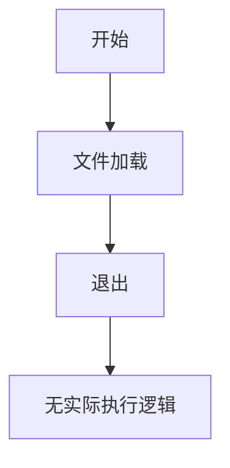

# `LLM4Decompile\train\colossalai_llm4decompile\colossal_llama\utils\__init__.py` 详细设计文档

该文件为一个空的Python脚本文件，仅包含Python解释器声明和编码声明，无实际业务代码逻辑。

## 整体流程



## 类结构

```
该文件为空白文件，无类层次结构
```

## 全局变量及字段


    

## 全局函数及方法


## 关键组件


该脚本仅包含Python解释器声明和编码声明，未实现任何实际功能，无可分析的核心逻辑、类、函数或组件。


## 问题及建议


### 已知问题

- 代码文件仅包含脚本声明和编码声明，无实际功能代码实现，无法进行有效的技术债务分析
- 缺少具体的业务逻辑、类定义、函数实现等可分析内容

### 优化建议

- 提供完整的代码实现以便进行详细的技术债务和优化空间分析
- 建议包含具体的业务逻辑代码、异常处理机制、数据流处理等核心功能模块


## 其它


### 一段话描述

提供的代码文件是一个空的Python脚本模板，仅包含标准的shebang声明和UTF-8编码声明，未实现任何实际功能，无核心功能描述。

### 文件的整体运行流程

该脚本作为一个空模板文件，不包含任何可执行代码逻辑，因此不存在运行流程。

### 类详细信息

由于代码文件中未定义任何类，该部分不适用。

### 全局变量与全局函数

代码中未定义任何全局变量或全局函数，该部分不适用。

### 关键组件信息

代码中不包含任何组件，该部分不适用。

### 设计目标与约束

由于代码为空，无法确定设计目标与约束。通常在此部分应描述：
- 业务目标：系统需要实现的核心功能
- 技术约束：使用的编程语言版本、框架要求、性能指标等
- 架构约束：设计模式选择、分层架构要求等

### 错误处理与异常设计

由于代码为空，无法提供具体的异常处理设计。通常应包含：
- 异常类型定义：业务异常与技术异常的分类
- 异常传播机制：异常捕获与抛出的策略
- 错误码与错误信息：统一的错误响应格式

### 数据流与状态机

由于代码为空，无法描述数据流与状态机。通常应包含：
- 数据输入：外部数据的来源与格式
- 数据处理：数据转换与业务逻辑流程
- 数据输出：结果数据的输出方式与格式
- 状态转换：对象或系统的状态变化流程

### 外部依赖与接口契约

由于代码为空，无法列出外部依赖与接口契约。通常应包含：
- 第三方库依赖：使用的外部包及其版本要求
- 内部模块接口：模块间的调用约定
- 外部系统接口：与外部系统交互的API定义

### 潜在的技术债务或优化空间

由于代码为空，无技术债务可评估。在实际项目中，该部分应包含：
- 代码质量问题：重复代码、硬编码、缺乏注释等
- 架构问题：耦合度过高、单一职责违反等
- 性能问题：算法复杂度、数据库查询优化等
- 测试覆盖：单元测试、集成测试的覆盖情况

### 配置文件与参数说明

由于代码为空，无配置参数。通常应包含：
- 配置文件格式：YAML、JSON、INI等
- 配置项说明：每个配置参数的用途与取值范围
- 环境差异：不同环境的配置差异

### 安全性考虑

由于代码为空，无法进行安全评估。通常应包含：
- 身份认证：用户身份验证机制
- 授权控制：权限管理策略
- 数据安全：敏感数据加密、传输安全
- 输入验证：用户输入的安全校验

### 性能与扩展性

由于代码为空，无法评估性能与扩展性。通常应包含：
- 性能指标：响应时间、吞吐量、并发数
- 扩展策略：水平扩展、垂直扩展方案
- 缓存策略：缓存使用场景与实现方式

### 测试策略

由于代码为空，无测试用例。通常应包含：
- 单元测试：函数与方法的测试
- 集成测试：模块间协作的测试
- 端到端测试：完整业务流程的测试


    