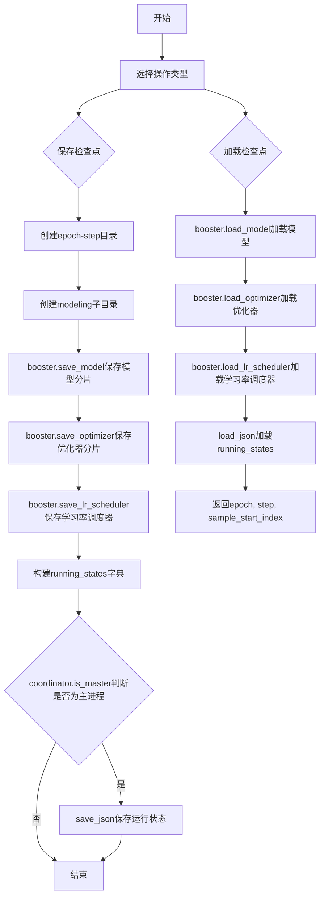
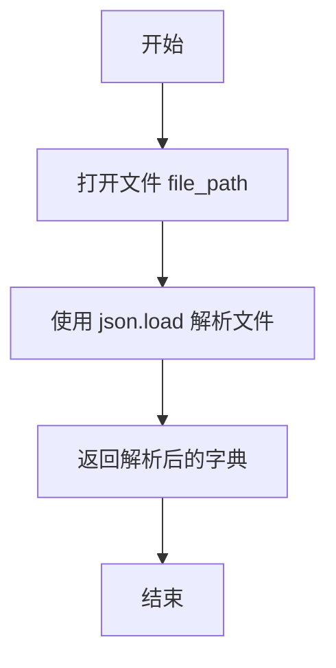
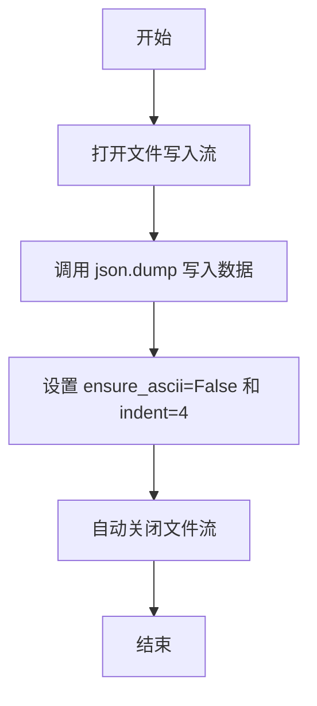
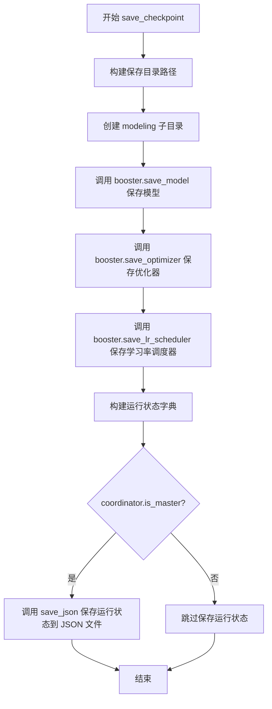

# `LLM4Decompile\train\colossalai_llm4decompile\colossal_llama\utils\ckpt_io.py` 详细设计文档

该代码文件提供了一系列用于深度学习模型检查点保存与加载的IO辅助函数，包括JSON文件的读写操作，以及使用ColossalAI框架的Booster和DistCoordinator来保存和恢复模型、优化器、学习率调度器及训练运行状态的功能。

## 整体流程



## 类结构

```
无类层次结构 (该文件仅包含全局函数)
```

## 全局变量及字段


### `json`
    
用于JSON数据的编码和解码

类型：`module (标准库)`
    


### `os`
    
提供操作系统相关的功能，如文件路径操作和目录创建

类型：`module (标准库)`
    


### `torch`
    
PyTorch深度学习库，用于张量计算和神经网络构建

类型：`module (第三方库)`
    


### `_LRScheduler`
    
PyTorch学习率调度器的基类，用于动态调整训练过程中的学习率

类型：`class (torch.optim.lr_scheduler)`
    


### `Optimizer`
    
PyTorch优化器的基类，定义了优化算法的接口

类型：`class (torch.optim.optimizer)`
    


### `Booster`
    
ColossalAI的Booster组件，提供分布式训练的高级抽象，用于保存和加载模型、优化器、学习率调度器等检查点

类型：`class (colossalai.booster)`
    


### `DistCoordinator`
    
ColossalAI的分布式协调器，用于管理分布式训练过程中的进程通信和协调

类型：`class (colossalai.cluster)`
    


    

## 全局函数及方法


### `load_json`

加载 JSON 格式的文件并返回解析后的字典数据。

**参数：**

- `file_path`：`Union[str, os.PathLike]`，要加载的 JSON 文件路径

**返回值：** `Dict[str, Any]`，解析后的 JSON 数据，以字典形式返回

#### 流程图



#### 带注释源码

```python
def load_json(file_path: Union[str, os.PathLike]) -> Dict[str, Any]:
    """
    Load file in JSON format
    """
    # 以只读模式打开文件，指定 UTF-8 编码
    with open(file=file_path, mode="r", encoding="utf-8") as fp:
        # 读取并解析 JSON 文件，返回字典对象
        return json.load(fp)
```


### `save_json`

将 Python 字典数据保存为 JSON 格式的文件。

参数：

- `data`：`Dict[str, Any]`，需要保存的字典数据
- `file_path`：`Union[str, os.PathLike]`，目标文件路径

返回值：`None`，无返回值，仅执行文件写入操作

#### 流程图



#### 带注释源码

```python
def save_json(data: Dict[str, Any], file_path: Union[str, os.PathLike]) -> None:
    """
    Save as JSON format
    """
    # 以写入模式打开文件，使用 UTF-8 编码
    with open(file=file_path, mode="w", encoding="utf-8") as fp:
        # 将 Python 字典序列化为 JSON 格式并写入文件
        # ensure_ascii=False: 允许非 ASCII 字符（如中文）直接保存
        # indent=4: 使用 4 空格缩进，使输出格式美观易读
        json.dump(data, fp=fp, ensure_ascii=False, indent=4)
```


### `save_checkpoint`

保存模型检查点、优化器、学习率调度器以及中间运行状态到指定目录。

参数：

-  `save_dir`：`Union[str, os.PathLike]`，保存检查点的根目录
-  `booster`：`Booster`，ColossalAI的Booster对象，用于执行模型、优化器和调度器的保存操作
-  `model`：`torch.nn.Module`，待保存的PyTorch模型
-  `optimizer`：`Optimizer`，待保存的PyTorch优化器
-  `lr_scheduler`：`_LRScheduler`，待保存的学习率调度器
-  `epoch`：`int`，当前训练的epoch数
-  `step`：`int`，当前训练的step数
-  `batch_size`：`int`，训练批次大小，用于计算样本起始索引
-  `coordinator`：`DistCoordinator`，分布式训练协调器，用于判断是否为master节点

返回值：`None`，该函数无返回值，仅执行保存操作

#### 流程图



#### 带注释源码

```python
def save_checkpoint(
    save_dir: Union[str, os.PathLike],  # 保存检查点的根目录路径
    booster: Booster,                    # ColossalAI的Booster对象
    model: torch.nn.Module,              # 要保存的模型
    optimizer: Optimizer,                # 要保存的优化器
    lr_scheduler: _LRScheduler,         # 要保存的学习率调度器
    epoch: int,                          # 当前训练的epoch数
    step: int,                           # 当前训练的step数
    batch_size: int,                    # 训练批次大小
    coordinator: DistCoordinator,       # 分布式协调器，判断是否为master节点
) -> None:
    """
    Save model checkpoint, optimizer, LR scheduler and intermedidate running states.
    """

    # 根据epoch和step构建子目录路径，如 epoch-1_step-100
    save_dir = os.path.join(save_dir, f"epoch-{epoch}_step-{step}")
    
    # 创建modeling子目录，用于存放模型文件
    os.makedirs(os.path.join(save_dir, "modeling"), exist_ok=True)

    # 使用Booster保存模型，shard=True表示分片保存（适用于分布式训练场景）
    booster.save_model(model, os.path.join(save_dir, "modeling"), shard=True)

    # 使用Booster保存优化器，shard=True表示分片保存
    booster.save_optimizer(optimizer, os.path.join(save_dir, "optimizer"), shard=True)
    
    # 使用Booster保存学习率调度器
    booster.save_lr_scheduler(lr_scheduler, os.path.join(save_dir, "lr_scheduler"))
    
    # 构建运行状态字典，记录训练进度信息
    running_states = {
        "epoch": epoch,
        "step": step,
        "sample_start_index": step * batch_size,  # 计算样本起始索引
    }
    
    # 仅在master节点保存运行状态，避免重复写入
    if coordinator.is_master():
        save_json(running_states, os.path.join(save_dir, "running_states.json"))
```


### `load_checkpoint`

该函数负责从指定目录加载模型检查点、优化器状态、学习率调度器状态以及运行中间状态（如epoch、step等），并返回训练恢复所需的元数据信息。

参数：

- `load_dir`：`Union[str, os.PathLike]`，检查点文件的根目录路径
- `booster`：`Booster`，ColossalAI框架的Booster实例，用于管理模型、优化器和调度器的加载
- `model`：`torch.nn.Module`，待加载状态的PyTorch模型对象
- `optimizer`：`Optimizer`，待加载状态的PyTorch优化器对象
- `lr_scheduler`：`_LRScheduler`，待加载状态的PyTorch学习率调度器对象

返回值：`Tuple[int, int, int]`，返回三个整数分别表示epoch、step和sample_start_index，用于恢复训练状态

#### 流程图

```mermaid
flowchart TD
    A[开始 load_checkpoint] --> B[调用 booster.load_model 加载模型权重]
    B --> C[调用 booster.load_optimizer 加载优化器状态]
    C --> D[调用 booster.load_lr_scheduler 加载学习率调度器状态]
    D --> E[调用 load_json 加载 running_states.json]
    E --> F{加载成功?}
    F -->|是| G[解析 epoch, step, sample_start_index]
    G --> H[返回 Tuple[int, int, int]]
    F -->|否| I[抛出异常]
```

#### 带注释源码

```python
def load_checkpoint(
    load_dir: Union[str, os.PathLike],
    booster: Booster,
    model: torch.nn.Module,
    optimizer: Optimizer,
    lr_scheduler: _LRScheduler,
) -> Tuple[int, int, int]:
    """
    Load model checkpoint, optimizer, LR scheduler and intermedidate running states.
    """

    # 调用 Booster 的 load_model 方法从 modeling 子目录加载模型权重
    # 参数 shard=True 表示以分片方式加载（适用于大模型）
    booster.load_model(model=model, checkpoint=os.path.join(load_dir, "modeling"))

    # 调用 Booster 的 load_optimizer 方法从 optimizer 子目录加载优化器状态
    # 参数 shard=True 表示以分片方式加载
    booster.load_optimizer(optimizer=optimizer, checkpoint=os.path.join(load_dir, "optimizer"))

    # 调用 Booster 的 load_lr_scheduler 方法从 lr_scheduler 子目录加载调度器状态
    booster.load_lr_scheduler(lr_scheduler=lr_scheduler, checkpoint=os.path.join(load_dir, "lr_scheduler"))

    # 从 running_states.json 文件加载训练中间状态（epoch, step, sample_start_index）
    running_states = load_json(file_path=os.path.join(load_dir, "running_states.json"))

    # 返回三个关键状态值用于恢复训练
    return (
        running_states["epoch"],        # 当前训练的轮次
        running_states["step"],         # 当前训练的步数
        running_states["sample_start_index"],  # 样本起始索引
    )
```

## 关键组件


### JSON 文件读写模块

负责将字典数据持久化为JSON文件以及从JSON文件加载数据，支持UTF-8编码和格式化输出。

### 检查点保存模块 (save_checkpoint)

将模型、优化器、学习率调度器以及训练中间状态（epoch、step、batch_size）保存到磁盘，使用Booster进行分片存储，仅在主节点写入运行状态文件。

### 检查点加载模块 (load_checkpoint)

从磁盘恢复模型参数、优化器状态、学习率调度器状态以及训练中间状态，返回epoch、step和sample_start_index供训练恢复使用。

### Booster 抽象层

ColossalAI的Booster组件，提供了统一的模型、优化器和学习率调度器的保存/加载接口，支持分布式训练下的分片存储能力。

### DistCoordinator 协调器

分布式协调器，用于判断当前进程是否为主节点（master），确保只有主节点执行特定的IO操作（如写入running_states.json）。


## 问题及建议


### 已知问题

-   **分布式一致性问题**：`save_checkpoint` 中仅在 `coordinator.is_master()` 为真时保存 `running_states.json`，但 `load_checkpoint` 在所有节点上运行，可能导致其他节点加载时找不到该文件。
-   **缺少错误处理**：文件IO操作（如打开、写入）缺少异常捕获，可能在文件不存在、权限不足或磁盘空间不足时直接崩溃。
-   **参数验证不足**：`save_checkpoint` 中的 `batch_size` 参数未验证是否为正数，`epoch` 和 `step` 也未验证非负，可能导致逻辑错误。
-   **目录创建失败风险**：`os.makedirs` 未显式处理异常，且未检查目录是否成功创建。
-   **类型注解缺失**：`save_checkpoint` 和 `load_checkpoint` 函数的返回值类型未在函数签名中声明（尽管在文档字符串中提到了Tuple）。
-   **冗余计算**：`save_checkpoint` 中计算 `sample_start_index` 为 `step * batch_size`，而 `load_checkpoint` 直接返回保存的值，两者依赖不同的逻辑，可能不一致。
-   **文件覆盖风险**：`save_json` 和 `save_checkpoint` 直接覆盖文件，没有确认或备份机制。
-   **依赖特定库**：代码紧密依赖 `colossalai` 的 `Booster` 和 `DistCoordinator`，降低了可移植性和可测试性。

### 优化建议

-   **添加分布式同步**：在 `save_checkpoint` 中，所有节点应执行保存操作，但仅在 master 节点保存 `running_states.json`，或者在所有节点保存（如果后续加载需要）。同时，在 `load_checkpoint` 开始时添加障碍（barrier）以确保所有节点就绪。
-   **完善错误处理**：使用 `try-except` 块捕获文件IO异常，并提供有意义的错误信息。例如，检查文件是否存在后再读取，捕获 `OSError` 或 `IOError`。
-   **参数验证**：在函数入口添加参数检查，如 `batch_size > 0`，`epoch >= 0` 等，并提前返回或抛出 `ValueError`。
-   **增强目录创建**：使用 `os.makedirs(..., exist_ok=True)` 并添加异常处理，确保目录创建成功。
-   **明确类型注解**：在函数签名中添加返回类型，如 `-> Tuple[int, int, int]` for `load_checkpoint`。
-   **日志记录**：引入日志（如 `logging` 模块）记录检查点保存和加载的关键信息，便于调试和监控。
-   **考虑原子性写入**：对于重要文件（如 `running_states.json`），可以先写入临时文件再重命名，避免在写入过程中损坏。
-   **解耦依赖**：将 `colossalai` 特定接口抽象为更通用的接口，提高代码的可测试性和模块化。

## 其它


### 设计目标与约束

本模块的设计目标是提供统一的IO辅助功能，用于模型的检查点保存与加载，支持分布式训练环境下的断点续训。约束条件包括：1) 必须与colossalai框架的Booster组件配合使用；2) 仅在主节点（master）写入running_states.json以避免并发冲突；3) 检查点目录遵循固定的命名规范（epoch-{epoch}_step-{step}）。

### 错误处理与异常设计

文件操作可能抛出IOError或OSError（如权限不足、磁盘空间不足）；JSON解析可能抛出JSONDecodeError；Booster相关操作可能抛出RuntimeError。函数内部未进行显式的异常捕获与处理，建议调用方进行try-except包装。load_checkpoint函数假设load_dir路径下必然存在running_states.json文件，否则会导致KeyError或FileNotFoundError。

### 数据流与状态机

数据流向分为两条路径：1) 模型数据流：model -> booster.save_model() -> modeling/目录；2) 优化器与调度器流：optimizer/lr_scheduler -> booster.save_optimizer()/booster.save_lr_scheduler() -> 对应目录；3) 运行状态流：epoch/step/batch_size -> save_json() -> running_states.json。加载时逆向执行上述流程。状态机体现在训练过程中的断点续训，通过epoch和step标识当前训练进度。

### 外部依赖与接口契约

本模块依赖以下外部包：1) torch和torch.optim模块（模型与优化器抽象）；2) colossalai.booster.Booster（模型/优化器/调度器的保存与加载接口）；3) colossalai.cluster.DistCoordinator（分布式协调，判断主节点）；4) json和os标准库（文件操作）。接口契约方面，save_checkpoint要求coordinator.is_master()为True时才写入running_states.json；load_checkpoint返回元组(epoch, step, sample_start_index)用于恢复训练状态。

### 性能考虑与优化空间

当前实现每次保存都会创建新的目录和文件，对于大规模分布式训练可能造成IO瓶颈。优化方向包括：1) 支持增量保存，仅保存变更的参数；2) 支持异步IO操作，避免阻塞训练流程；3) 考虑使用共享文件系统或分布式文件系统优化检查点写入；4) 可添加检查点完整性校验机制（如checksum）。

### 安全性与权限管理

当前实现未对文件路径进行安全校验（如路径遍历攻击防御），建议添加路径规范化处理。文件写入依赖操作系统权限，需确保运行用户对save_dir具有写入权限。在多进程环境下，应注意文件覆盖冲突问题。

### 可测试性与验证

建议添加单元测试覆盖：1) JSON文件的正确读写；2) 检查点目录结构的正确性验证；3) 模拟分布式环境下的主节点判断逻辑；4) 错误场景测试（文件不存在、权限不足等）。

### 部署与运行环境要求

运行时需要Python 3.6+，PyTorch环境，以及colossalai框架正确安装。分布式环境下需要配置正确的进程组通信（ NCCL/Gloo）。保存检查点时需要确保文件系统支持原子写入或做好异常恢复机制。


    