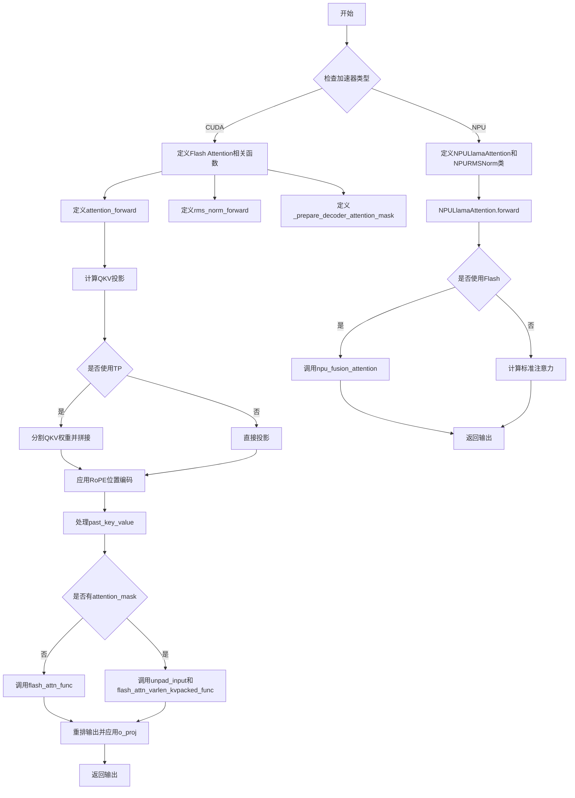
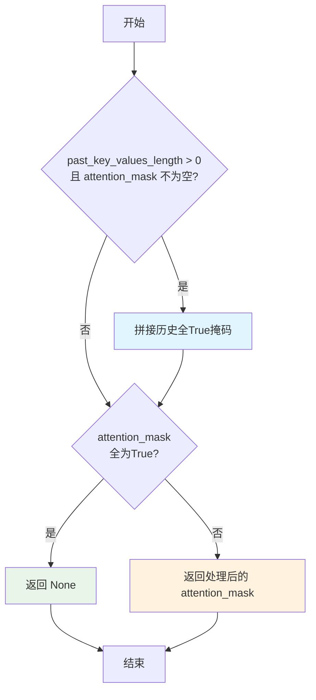
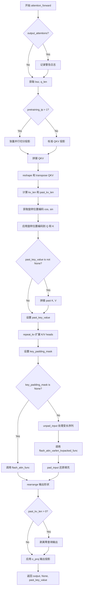
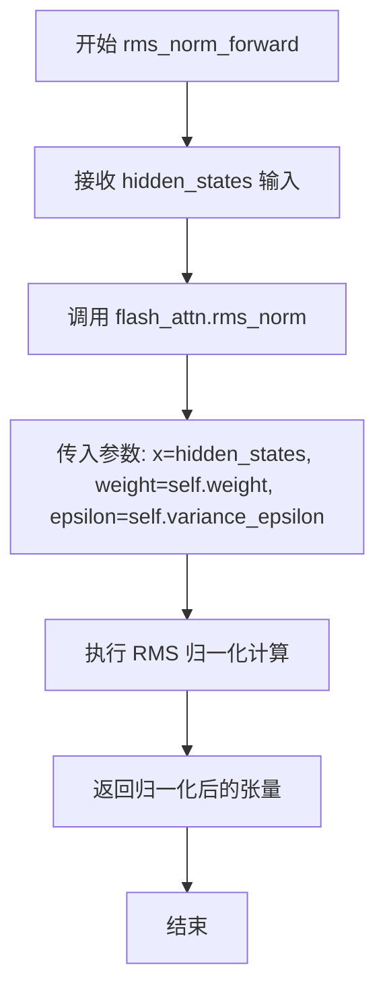
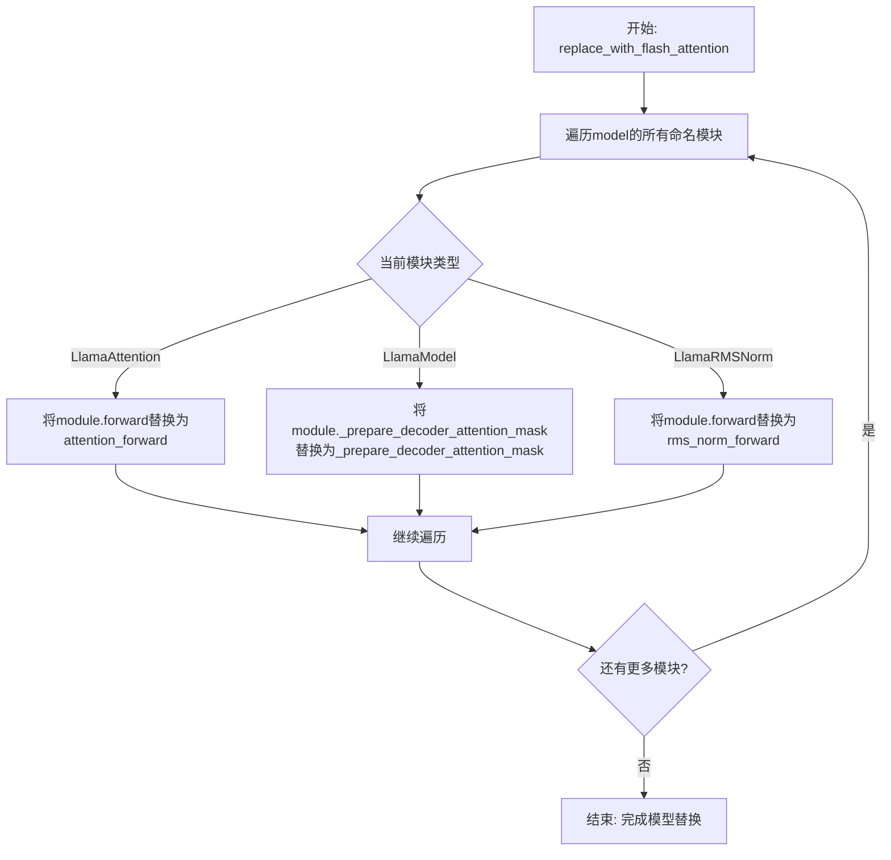
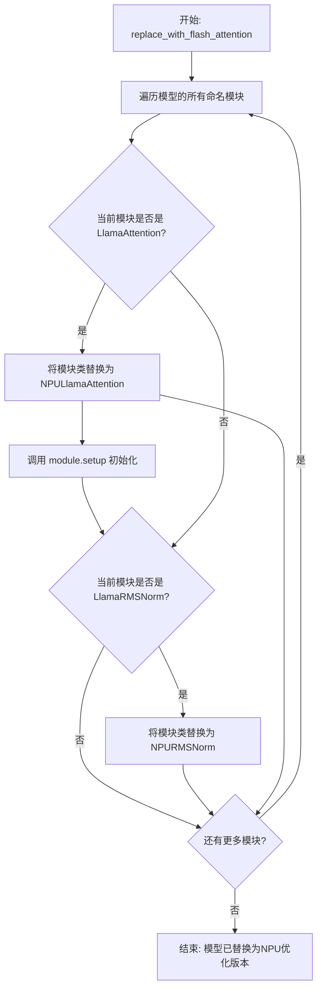
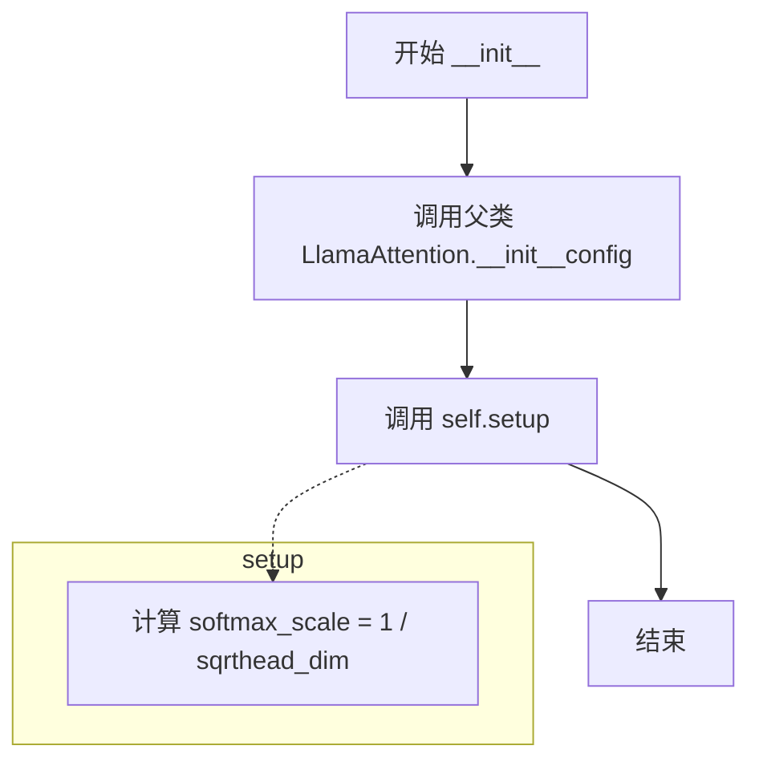
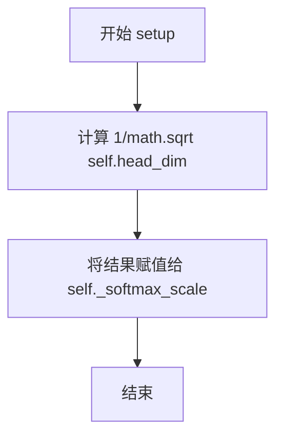
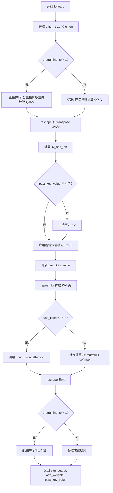
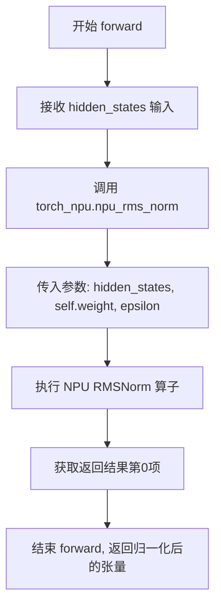

# `LLM4Decompile\train\colossalai_llm4decompile\colossal_llama\utils\flash_attention_patch.py` 详细设计文档

该代码为LLaMA模型提供硬件加速的注意力机制实现，支持CUDA（Flash Attention）和NPU（华为昇腾）两种加速器，通过重写注意力前向传播和RMS归一化来提升推理性能，同时支持张量并行（TP）配置。

## 整体流程



## 类结构

```
全局函数与变量
├── logger (分布式日志)
├── _prepare_decoder_attention_mask (CUDA)
├── attention_forward (CUDA)
├── rms_norm_forward (CUDA)
└── replace_with_flash_attention (CUDA)
NPU模块
├── NPULlamaAttention
└── NPURMSNorm
```

## 全局变量及字段


### `logger`
    
分布式日志记录器，用于记录分布式训练过程中的日志信息

类型：`Logger`
    


### `NPULlamaAttention.use_flash`
    
是否使用Flash Attention加速注意力计算

类型：`bool`
    


### `NPULlamaAttention._softmax_scale`
    
Softmax缩放因子，用于调整注意力分数的缩放比例

类型：`float`
    
    

## 全局函数及方法


### `_prepare_decoder_attention_mask`

该函数是 LLaMA 模型的解码器注意力掩码准备函数，主要用于在自回归解码过程中处理注意力掩码。当存在过去的 key-value 缓存时，函数会将历史注意力掩码与当前掩码进行拼接；同时如果检测到注意力掩码全为 True（表示完全注意），则返回 None 以启用 Flash Attention 的优化路径，从而提升推理效率。

参数：

- `self`：`LlamaModel`，LLaMA 模型实例，用于访问模型配置和状态
- `attention_mask`：`torch.BoolTensor`，原始注意力掩码，用于控制每个位置的注意力范围
- `input_shape`：`torch.Size`，输入张量的形状，通常为 (batch_size, seq_len)
- `inputs_embeds`：`torch.Tensor`，输入嵌入张量，当前未使用此参数
- `past_key_values_length`：`int`，过去 key-value 缓存的长度，用于确定需要拼接的历史长度

返回值：`Optional[torch.Tensor]`，返回处理后的注意力掩码张量；如果所有位置都允许完全注意力（mask 全为 True），则返回 None 以启用 Flash Attention 的优化路径

#### 流程图



#### 带注释源码

```python
def _prepare_decoder_attention_mask(
    self: LlamaModel,
    attention_mask: torch.BoolTensor,
    input_shape: torch.Size,
    inputs_embeds: torch.Tensor,
    past_key_values_length: int,
) -> Optional[torch.Tensor]:
    """
    Decoder attetion mask
    """
    # 如果存在过去的 key-value 缓存，需要将历史注意力掩码与当前掩码拼接
    # 过去的历史部分应该是全 True（允许注意力），因为是已生成的历史token
    if past_key_values_length > 0 and attention_mask is not None:
        attention_mask = torch.cat(
            tensors=(
                torch.full(
                    size=(input_shape[0], past_key_values_length),
                    fill_value=True,  # 填充全True，表示历史token位置完全可见
                    dtype=attention_mask.dtype,
                    device=attention_mask.device,
                ),
                attention_mask,  # 拼接当前序列的注意力掩码
            ),
            dim=-1,
        )  # (bsz, past_key_values_length + q_len)
    
    # 优化路径：如果注意力掩码全为True，说明所有位置都可以互相看到
    # 返回None可以让Flash Attention使用更高效的计算路径
    if attention_mask is not None and torch.all(attention_mask):
        return None  # Faster
    
    # 返回处理后的注意力掩码
    return attention_mask
```


### attention_forward

该函数是 LLaMA-2 模型中 `LlamaAttention` 的前向传播方法的重新定义实现，通过集成 Flash Attention 机制来加速注意力计算，支持张量并行、KV 缓存、旋转位置编码等优化特性。

参数：

- `self`：`LlamaAttention`，LLaMA 注意力模块的实例
- `hidden_states`：`torch.Tensor`，输入的隐藏状态张量，形状为 (bsz, q_len, hidden_size)
- `attention_mask`：`Optional[torch.Tensor]`，注意力掩码，用于控制注意力范围
- `position_ids`：`Optional[torch.LongTensor]`，位置编码的 IDs，用于旋转位置编码
- `past_key_value`：`Optional[Tuple[torch.Tensor]]`，过去的 key-value 对，用于 KV 缓存加速解码
- `output_attentions`：`bool`，是否返回注意力权重
- `use_cache`：`bool`，是否使用缓存保存 key-value
- `**kwargs`：其他关键字参数

返回值：`Tuple[torch.Tensor, Optional[torch.Tensor], Optional[Tuple[torch.Tensor]]]`，包含：

- 第一个元素：输出隐藏状态，形状为 (bsz, q_len, hidden_size)
- 第二个元素：注意力权重（若 output_attentions 为 True 则返回 None）
- 第三个元素：更新后的 past_key_value 元组（若 use_cache 为 True 则返回）

#### 流程图



#### 带注释源码

```python
def attention_forward(
    self: LlamaAttention,
    hidden_states: torch.Tensor,
    attention_mask: Optional[torch.Tensor] = None,
    position_ids: Optional[torch.LongTensor] = None,
    past_key_value: Optional[Tuple[torch.Tensor]] = None,
    output_attentions: bool = False,
    use_cache: bool = False,
    **kwargs,
) -> Tuple[torch.Tensor, Optional[torch.Tensor], Optional[Tuple[torch.Tensor]]]:
    """
    Re-define LLaMA-2 `LlamaAttention` forward method using flash-attention.
    """
    # 如果需要输出注意力权重，记录警告（Flash Attention 不支持）
    if output_attentions:
        logger.warning(
            "Argument `output_attentions` is not supported for flash-attention patched `LlamaAttention`, "
            "return `None` instead."
        )

    # 获取批次大小和序列长度
    bsz, q_len, _ = hidden_states.size()

    # 处理张量并行情况下的 QKV 投影切分
    if self.config.pretraining_tp > 1:
        # 计算每个 GPU 负责的维度大小
        q_slicing, kv_slicing = (
            dim // self.config.pretraining_tp
            for dim in (
                self.num_heads * self.head_dim,
                self.num_key_value_heads * self.head_dim,
            )
        )  # `Tuple[int, int]`
        
        # 对 QKV 投影权重进行切分
        q_slices, k_slices, v_slices = (
            proj.weight.split(slicing, dim=0)
            for proj, slicing in (
                (self.q_proj, q_slicing),
                (self.k_proj, kv_slicing),
                (self.v_proj, kv_slicing),
            )
        )  # Tuple[Tuple[torch.Tensor], Tuple[torch.Tensor], Tuple[torch.Tensor]]
        
        # 对每个切分进行线性变换并拼接
        q, k, v = (
            torch.cat(
                [F.linear(hidden_states, slices[i]) for i in range(self.config.pretraining_tp)],
                dim=-1,
            )
            for slices in (q_slices, k_slices, v_slices)
        )
    else:
        # 标准 QKV 投影（无需切分）
        q, k, v = (proj(hidden_states) for proj in (self.q_proj, self.k_proj, self.v_proj))

    # 将 QKV 从 (bsz, q_len, num_heads/num_kv_heads, head_dim) 转换为 (bsz, num_heads/num_kv_heads, q_len, head_dim)
    q, k, v = (
        states.view(bsz, q_len, num_heads, self.head_dim).transpose(1, 2)
        for states, num_heads in (
            (q, self.num_heads),
            (k, self.num_key_value_heads),
            (v, self.num_key_value_heads),
        )
    )
    
    # 计算 KV 序列长度
    kv_len = k.shape[-2]  # initially, `kv_len` == `q_len`
    past_kv_len = 0
    if past_key_value is not None:
        # 如果有历史 KV，则增加长度
        past_kv_len = past_key_value[0].shape[-2]
        kv_len += past_kv_len

    # 获取旋转位置编码
    # two `torch.Tensor` objs of shape (1, 1, kv_len, head_dim)
    cos, sin = self.rotary_emb(v, seq_len=kv_len)
    
    # 应用旋转位置编码到 Q 和 K
    # (bsz, num_heads, q_len, head_dim), (bsz, num_key_value_heads, q_len, head_dim)
    q, k = apply_rotary_pos_emb(q=q, k=k, cos=cos, sin=sin, position_ids=position_ids)
    
    # 如果有历史 K/V，则拼接
    if past_key_value is not None:
        # reuse k, v, self_attention
        k = torch.cat([past_key_value[0], k], dim=2)
        v = torch.cat([past_key_value[1], v], dim=2)

    # 更新 past_key_value（用于缓存）
    past_key_value = (k, v) if use_cache else None

    # 重复 K/V heads 以匹配 Q 的 head 数量（当 n_kv_heads < n_heads 时）
    k = repeat_kv(hidden_states=k, n_rep=self.num_key_value_groups)
    # (bsz, num_key_value_heads, q_len, head_dim) -> (bsz, num_heads, q_len, head_dim)
    v = repeat_kv(hidden_states=v, n_rep=self.num_key_value_groups)
    # (bsz, num_key_value_heads, q_len, head_dim) -> (bsz, num_heads, q_len, head_dim)

    # 设置 key padding mask
    key_padding_mask = attention_mask
    
    # 转换维度顺序以便 Flash Attention 处理
    # (bsz, num_heads, q_len, head_dim) -> (bsz, q_len, num_heads, head_dim)
    q, k, v = (states.transpose(1, 2) for states in (q, k, v))

    # 如果有历史 KV，在前面填充零查询
    if past_kv_len > 0:
        q = torch.cat(
            tensors=(
                torch.full(
                    size=(bsz, past_kv_len, self.num_heads, self.head_dim),
                    fill_value=0.0,
                    dtype=q.dtype,
                    device=q.device,
                ),
                q,
            ),
            dim=1,
        )  # (bsz, past_kv_len + q_len, num_heads, head_dim)

    # 根据是否有 padding mask 选择不同的 Flash Attention 路径
    if key_padding_mask is None:
        # 无 padding mask 的情况：使用标准 flash_attn_func
        # (bsz, past_kv_len + q_len, num_heads, head_dim)
        output = flash_attn_func(q=q, k=k, v=v, dropout_p=0.0, softmax_scale=None, causal=True)  # (bsz, )
        
        # 重新排列输出形状
        output = rearrange(
            output, pattern="... h d -> ... (h d)"
        )  # (bsz, past_kv_len + q_len, num_heads * head_dim)
    else:
        # 有 padding mask 的情况：使用变长版本的 flash_attn_varlen_kvpacked_func
        # 对 Q 和 KV 分别进行 unpad 处理
        q, indices, cu_q_lens, max_q_len = unpad_input(hidden_states=q, attention_mask=key_padding_mask)
        kv, _, cu_kv_lens, max_kv_len = unpad_input(
            hidden_states=torch.stack(tensors=(k, v), dim=2),
            attention_mask=key_padding_mask,
        )
        
        # 调用变长 Flash Attention 函数
        output_unpad = flash_attn_varlen_kvpacked_func(
            q=q,
            kv=kv,
            cu_seqlens_q=cu_q_lens,
            cu_seqlens_k=cu_kv_lens,
            max_seqlen_q=max_q_len,
            max_seqlen_k=max_kv_len,
            dropout_p=0.0,
            softmax_scale=None,
            causal=True,
        )
        
        # 还原填充后的输出
        output = pad_input(
            hidden_states=rearrange(output_unpad, pattern="nnz h d -> nnz (h d)"),
            indices=indices,
            batch=bsz,
            seqlen=past_kv_len + q_len,
        )  # (bsz, past_kv_len + q_len, num_heads * head_dim)

    # 如果有历史 KV，剥离零查询输出部分
    if past_kv_len > 0:
        # Strip off the zero query outputs.
        output = output[:, past_kv_len:, ...]  # (bsz, q_len, num_heads * head_dim)
    
    # 应用输出投影层
    output = self.o_proj(output)  # (bsz, q_len, hidden_size)
    
    # 返回：输出、注意力权重（始终为 None）、past_key_value
    return output, None, past_key_value
```


### `rms_norm_forward`

该函数是 LLaMA 模型中 RMS Normalization（均方根归一化）层的前向传播方法，基于 `flash_attn` 库的优化实现，通过计算输入张量的 RMS 并利用 Flash Attention 的 `rms_norm` 算子进行高效归一化，显著提升推理性能。

参数：

- `self`：`LlamaRMSNorm`，RMS 归一化层实例，包含权重 `weight` 和方差epsilon `variance_epsilon`
- `hidden_states`：`torch.Tensor`，输入的隐藏状态张量，形状为 `(batch_size, seq_len, hidden_size)`

返回值：`torch.Tensor`，归一化后的隐藏状态张量，形状与输入相同

#### 流程图



#### 带注释源码

```python
def rms_norm_forward(self: LlamaRMSNorm, hidden_states: torch.Tensor) -> torch.Tensor:
    """
    Formard function for RMS Norm
    """
    # 调用 flash_attn 库中的 rms_norm 算子进行归一化
    # x: 输入张量 hidden_states
    # weight: 可学习的缩放参数（从 LlamaRMSNorm 继承）
    # epsilon: 方差epsilon，用于数值稳定性（从 LlamaRMSNorm 继承，对应 config 中的 rms_norm_eps）
    return rms_norm(x=hidden_states, weight=self.weight, epsilon=self.variance_epsilon)
```


### `replace_with_flash_attention` (CUDA版本)

该函数用于将LLaMA模型中的标准注意力机制替换为基于CUDA的Flash Attention，以提升推理性能。它通过遍历模型的所有模块，将`LlamaAttention`、`LlamaModel`和`LlamaRMSNorm`类的原始forward方法分别替换为自定义的flash attention前向传播、注意力掩码准备和RMS归一化实现。

参数：

- `model`：`LlamaForCausalLM`，需要被替换为flash attention的LLaMA因果语言模型实例

返回值：`None`，该函数直接修改传入模型的内部方法，不返回任何值

#### 流程图



#### 带注释源码

```python
def replace_with_flash_attention(model: LlamaForCausalLM) -> None:
    """
    将LLaMA模型中的标准注意力机制替换为Flash Attention
    
    该函数遍历模型的所有子模块，将以下组件替换为CUDA优化的版本:
    - LlamaAttention: 使用flash_attn_func或flash_attn_varlen_kvpacked_func
    - LlamaModel: 使用自定义的_prepare_decoder_attention_mask
    - LlamaRMSNorm: 使用rms_norm进行加速
    
    Args:
        model: LlamaForCausalLM模型实例，将被原地修改
        
    Returns:
        None: 直接修改传入的模型对象，不返回新对象
    """
    # 遍历模型中的所有命名模块（包含名称和模块本身的元组）
    for name, module in model.named_modules():
        # 检查当前模块是否为LlamaAttention类或其子类
        if isinstance(module, LlamaAttention):
            # 使用MethodType将自定义的attention_forward绑定到module的forward方法
            # 这样在模型前向传播时会自动调用flash attention实现
            module.forward = MethodType(attention_forward, module)
        
        # 检查当前模块是否为LlamaModel类
        if isinstance(module, LlamaModel):
            # 替换解码器的注意力掩码准备方法，支持更高效的flash attention处理
            module._prepare_decoder_attention_mask = MethodType(_prepare_decoder_attention_mask, module)
        
        # 检查当前模块是否为LlamaRMSNorm类
        if isinstance(module, LlamaRMSNorm):
            # 将RMS归一化替换为CUDA优化的rms_norm实现
            module.forward = MethodType(rms_norm_forward, module)
```

#### 关联方法详细信息

**辅助函数：`_prepare_decoder_attention_mask`**

用于准备解码器的注意力掩码，处理past_key_values_length和全True掩码的优化情况。

**辅助函数：`attention_forward`**

重新定义的LLaMA注意力前向方法，集成flash attention的核心实现，包含QKV投影、位置编码应用、KV缓存管理和多头处理等逻辑。

**辅助函数：`rms_norm_forward`**

使用CUDA优化的rms_norm函数执行RMS归一化，比PyTorch原生实现更高效。


### `replace_with_flash_attention`

该函数用于将 LLaMA 模型中的注意力机制和 RMSNorm 替换为 NPU 优化的版本，通过遍历模型的所有模块并将 `LlamaAttention` 替换为 `NPULlamaAttention`，将 `LlamaRMSNorm` 替换为 `NPURMSNorm`，从而利用华为昇腾 NPU 的融合算子 `npu_fusion_attention` 和 `npu_rms_norm` 加速推理。

参数：

- `model`：`LlamaForCausalLM`，需要被替换的 LLaMA 因果语言模型实例

返回值：`None`，该函数直接修改传入的模型对象，不返回任何内容

#### 流程图



#### 带注释源码

```python
def replace_with_flash_attention(model: LlamaForCausalLM) -> None:
    """
    将LLaMA模型中的注意力模块和RMSNorm替换为NPU优化版本
    
    参数:
        model: LlamaForCausalLM - 需要进行NPU优化的LLaMA模型
    
    返回:
        None - 直接修改原模型对象，不返回值
    """
    # 遍历模型中的所有模块（包括子模块）
    for name, module in model.named_modules():
        # 检查模块是否为LLaMA注意力层
        if isinstance(module, LlamaAttention):
            # 动态替换类的类型，将LlamaAttention替换为NPULlamaAttention
            # 这样可以利用NPU的融合算子进行加速
            module.__class__ = NPULlamaAttention
            # 调用setup方法初始化NPU特定的状态（如softmax缩放因子）
            module.setup()
        
        # 检查模块是否为LLaMA的RMS归一化层
        if isinstance(module, LlamaRMSNorm):
            # 动态替换为NPU优化的RMSNorm实现
            # NPU版本使用torch_npu.npu_rms_norm算子
            module.__class__ = NPURMSNorm
```


### `NPULlamaAttention.__init__`

这是 `NPULlamaAttention` 类的构造函数，负责初始化 NPU 优化的 LLaMA 注意力模块。该方法首先调用父类 `LlamaAttention` 的初始化逻辑，然后执行 `setup()` 方法来配置 NPU 特定的参数（如 softmax 缩放因子）。

参数：

- `config`：`LlamaConfig`，来自 Hugging Face Transformers 的 LLaMA 模型配置对象，包含模型架构参数（如头数、隐藏维度等）

返回值：`None`，无返回值（隐式返回 None）

#### 流程图



#### 带注释源码

```python
def __init__(self, config: LlamaConfig):
    """
    初始化 NPULlamaAttention 模块
    
    参数:
        config: LlamaConfig 对象，包含模型配置信息
    """
    # 调用父类 LlamaAttention 的初始化方法
    # 继承父类的所有属性，如 q_proj, k_proj, v_proj, o_proj 等线性层
    # 以及 config, num_heads, num_key_value_heads, head_dim 等配置属性
    super().__init__(config)
    
    # 调用 setup 方法进行 NPU 特定的初始化设置
    self.setup()
```

---

### 补充说明

#### 关键组件信息

| 名称 | 一句话描述 |
|------|-----------|
| `NPULlamaAttention` | 继承自 `LlamaAttention` 的 NPU 优化注意力模块，支持使用华为昇腾 NPU 进行加速推理 |
| `setup()` | 初始化 NPU 特定参数的内部方法，计算 softmax 缩放因子 |

#### 潜在技术债务与优化空间

1. **硬编码的 Flash Attention 开关**：`use_flash` 被硬编码为 `True`，建议改为可通过配置或构造函数参数灵活控制
2. **缺少错误处理**：构造函数未对无效的 `config` 参数进行校验
3. **NPU 设备检测**：当前代码假设环境为 NPU，但未在 `__init__` 中检测设备兼容性

#### 其它项目

- **设计目标**：在华为昇腾 NPU 上高效运行 LLaMA 模型的注意力机制，利用 `torch_npu.npu_fusion_attention` 算子加速
- **外部依赖**：依赖 `torch_npu`、`transformers` 和 `torch.nn.functional`
- **父类交互**：通过 `super().__init__(config)` 完全继承父类行为，仅在 `setup()` 中添加 NPU 特定逻辑，符合开闭原则


### `NPULlamaAttention.setup`

该方法用于初始化 NPULlamaAttention 类的 softmax 缩放因子，通过计算 `1/sqrt(head_dim)` 来设置 `self._softmax_scale`，以便在后续的注意力计算中使用。

参数：
- 无（仅包含隐式参数 `self`）

返回值：`None`，无返回值描述（该方法仅执行初始化操作，不返回任何值）

#### 流程图



#### 带注释源码

```python
def setup(self) -> None:
    """
    初始化 softmax 缩放因子
    
    该方法在 NPULlamaAttention 实例初始化时被调用，用于设置注意力机制中
    softmax 的缩放因子。缩放因子的计算公式为 1/sqrt(head_dim)，
    这是为了确保点积注意力的方差保持稳定。
    """
    # 计算 softmax 缩放因子：1 / sqrt(头维度)
    # 这是一种标准的缩放技术，用于控制注意力分数的尺度，防止softmax梯度消失
    self._softmax_scale = 1 / math.sqrt(self.head_dim)
```


### `NPULlamaAttention.forward`

该方法是 `NPULlamaAttention` 类的前向传播函数，专门为华为 NPU（神经网络处理单元）优化实现 LLaMA 模型的注意力机制。支持 tensor parallelism（pretraining_tp > 1）、KV 缓存、旋转位置编码（RoPE），并通过 `torch_npu.npu_fusion_attention` 调用 NPU 硬件加速的 Flash Attention，同时支持标准 PyTorch 实现作为回退方案。

参数：

- `self`：`NPULlamaAttention`，类实例本身，包含模型配置和投影层
- `hidden_states`：`torch.Tensor`，输入的隐藏状态，形状为 (batch_size, q_len, hidden_size)
- `attention_mask`：`Optional[torch.Tensor]`，注意力掩码，用于控制注意力分数，可为 None
- `position_ids`：`Optional[torch.LongTensor]`，位置 ID 序列，用于旋转位置编码，可为 None
- `past_key_value`：`Optional[Tuple[torch.Tensor]]`，历史键值对，用于 KV 缓存，格式为 (key_states, value_states)
- `output_attentions`：`bool`，是否返回注意力权重，默认为 False
- `use_cache`：`bool`，是否使用缓存返回 past_key_value，默认为 False

返回值：`Tuple[torch.Tensor, Optional[torch.Tensor], Optional[Tuple[torch.Tensor]]]`，包含：
- `attn_output`：注意力输出，形状为 (batch_size, q_len, hidden_size)
- `attn_weights`：注意力权重，若 output_attentions 为 False 则为 None
- `past_key_value`：更新后的键值对缓存，若 use_cache 为 False 则为 None

#### 流程图



#### 带注释源码

```python
def forward(
    self,
    hidden_states: torch.Tensor,
    attention_mask: Optional[torch.Tensor] = None,
    position_ids: Optional[torch.LongTensor] = None,
    past_key_value: Optional[Tuple[torch.Tensor]] = None,
    output_attentions: bool = False,
    use_cache: bool = False,
) -> Tuple[torch.Tensor, Optional[torch.Tensor], Optional[Tuple[torch.Tensor]]]:
    # 获取批次大小和查询长度，同时获取隐藏维度（通过下划线忽略）
    bsz, q_len, _ = hidden_states.size()

    # 处理张量并行情况 (pretraining_tp > 1)
    # 当使用张量并行时，需要分割投影权重并在多个设备上计算
    if self.config.pretraining_tp > 1:
        # 计算每个设备上的 key/value 维度
        key_value_slicing = (self.num_key_value_heads * self.head_dim) // self.config.pretraining_tp
        # 按维度 0 分割查询投影权重
        query_slices = self.q_proj.weight.split(
            (self.num_heads * self.head_dim) // self.config.pretraining_tp, dim=0
        )
        # 按维度 0 分割键和值投影权重
        key_slices = self.k_proj.weight.split(key_value_slicing, dim=0)
        value_slices = self.v_proj.weight.split(key_value_slicing, dim=0)

        # 对每个张量并行分区应用线性变换并拼接结果
        query_states = [F.linear(hidden_states, query_slices[i]) for i in range(self.config.pretraining_tp)]
        query_states = torch.cat(query_states, dim=-1)

        key_states = [F.linear(hidden_states, key_slices[i]) for i in range(self.config.pretraining_tp)]
        key_states = torch.cat(key_states, dim=-1)

        value_states = [F.linear(hidden_states, value_slices[i]) for i in range(self.config.pretraining_tp)]
        value_states = torch.cat(value_states, dim=-1)

    else:
        # 标准情况：直接使用投影层计算 Q、K、V
        query_states = self.q_proj(hidden_states)
        key_states = self.k_proj(hidden_states)
        value_states = self.v_proj(hidden_states)

    # 调整形状: (bsz, q_len, num_heads, head_dim) -> (bsz, num_heads, q_len, head_dim)
    # 这是一种内存布局优化，便于后续注意力计算
    query_states = query_states.view(bsz, q_len, self.num_heads, self.head_dim).transpose(1, 2)
    key_states = key_states.view(bsz, q_len, self.num_key_value_heads, self.head_dim).transpose(1, 2)
    value_states = value_states.view(bsz, q_len, self.num_key_value_groups, self.head_dim).transpose(1, 2)

    # 计算键值序列长度，考虑历史上下文
    kv_seq_len = key_states.shape[-2]
    if past_key_value is not None:
        # 加上历史键值对的长度
        kv_seq_len += past_key_value[0].shape[-2]
    
    # 应用旋转位置编码 (RoPE)
    cos, sin = self.rotary_emb(value_states, seq_len=kv_seq_len)
    query_states, key_states = apply_rotary_pos_emb(query_states, key_states, cos, sin, position_ids)

    # 处理 KV 缓存：如果有历史键值对，则拼接
    if past_key_value is not None:
        # reuse k, v, self_attention - 复用已有的键值对
        key_states = torch.cat([past_key_value[0], key_states], dim=2)
        value_states = torch.cat([past_key_value[1], value_states], dim=2)

    # 根据 use_cache 决定是否返回键值对用于缓存
    past_key_value = (key_states, value_states) if use_cache else None

    # 扩展键值头以匹配查询头数量 (当 n_kv_heads < n_heads 时)
    key_states = repeat_kv(key_states, self.num_key_value_groups)
    value_states = repeat_kv(value_states, self.num_key_value_groups)

    # 根据 use_flash 标志选择使用 Flash Attention 或标准注意力
    if not self.use_flash:
        # 标准注意力实现 (软件实现，作为回退方案)
        # 计算注意力分数: Q @ K^T / sqrt(head_dim)
        attn_weights = torch.matmul(query_states, key_states.transpose(2, 3)) / math.sqrt(self.head_dim)

        # 验证注意力权重形状
        if attn_weights.size() != (bsz, self.num_heads, q_len, kv_seq_len):
            raise ValueError(
                f"Attention weights should be of size {(bsz, self.num_heads, q_len, kv_seq_len)}, but is"
                f" {attn_weights.size()}"
            )

        # 应用注意力掩码
        if attention_mask is not None:
            if attention_mask.size() != (bsz, 1, q_len, kv_seq_len):
                raise ValueError(
                    f"Attention mask should be of size {(bsz, 1, q_len, kv_seq_len)}, but is {attention_mask.size()}"
                )
            attn_weights = attn_weights + attention_mask

        # 上转换为 float32 进行 softmax 以提高数值稳定性，然后转回原始数据类型
        attn_weights = nn.functional.softmax(attn_weights, dim=-1, dtype=torch.float32).to(query_states.dtype)
        # 计算注意力输出
        attn_output = torch.matmul(attn_weights, value_states)
    else:
        # 使用 NPU 硬件加速的 Flash Attention
        # 调用 npu_fusion_attention 算子进行高效注意力计算
        attn_output, *_ = torch_npu.npu_fusion_attention(
            query_states,
            key_states,
            value_states,
            self.num_heads,
            "BNSD",  # 输入格式: Batch, Num_heads, Seq_len, Dim
            atten_mask=attention_mask.bool(),
            scale=self._softmax_scale,
            padding_mask=None,
            pre_tockens=65535,  # 前向注意token数
            next_tockens=0,    # 后向注意token数
            keep_prob=1.0,     # dropout保持概率
            inner_precise=0,   # 内部精度模式
        )

    # 验证注意力输出形状
    if attn_output.size() != (bsz, self.num_heads, q_len, self.head_dim):
        raise ValueError(
            f"`attn_output` should be of size {(bsz, self.num_heads, q_len, self.head_dim)}, but is"
            f" attn_output.size()"
        )

    # 调整输出形状: (bsz, num_heads, q_len, head_dim) -> (bsz, q_len, num_heads, head_dim) -> (bsz, q_len, hidden_size)
    attn_output = attn_output.transpose(1, 2).contiguous()
    attn_output = attn_output.reshape(bsz, q_len, self.hidden_size)

    # 处理张量并行的输出投影
    if self.config.pretraining_tp > 1:
        # 分割输出并对每个部分应用线性变换，然后求和
        attn_output = attn_output.split(self.hidden_size // self.config.pretraining_tp, dim=2)
        o_proj_slices = self.o_proj.weight.split(self.hidden_size // self.config.pretraining_tp, dim=1)
        attn_output = sum(
            [F.linear(attn_output[i], o_proj_slices[i]) for i in range(self.config.pretraining_tp)]
        )
    else:
        # 标准输出投影
        attn_output = self.o_proj(attn_output)

    # 如果不需要输出注意力权重，则置为 None
    if not output_attentions:
        attn_weights = None

    # 返回注意力输出、注意力权重和键值缓存
    return attn_output, attn_weights, past_key_value
```


### NPURMSNorm.forward

该方法是 NPU 设备上 LLaMA 模型 RMSNorm（Root Mean Square Normalization）层的前向传播实现，利用华为 NPU 的 `torch_npu.npu_rms_norm` 原生算子进行高效的归一化计算，继承自 Hugging Face 的 `LlamaRMSNorm` 并重写了 forward 方法以适配 NPU 加速。

参数：

- `self`：NPURMSNorm 实例本身，包含继承自父类的权重参数
- `hidden_states`：`torch.Tensor`，输入的隐藏状态张量，形状为 (batch_size, seq_len, hidden_size)

返回值：`torch.Tensor`，返回 RMSNorm 归一化后的隐藏状态张量，形状与输入相同 (batch_size, seq_len, hidden_size)

#### 流程图



#### 带注释源码

```python
class NPURMSNorm(LlamaRMSNorm):
    """
    NPURMSNorm 类：继承自 Hugging Face 的 LlamaRMSNorm，用于在华为 NPU 设备上执行 RMSNorm 操作
    """
    
    def forward(self, hidden_states):
        """
        NPU 优化的 RMSNorm 前向传播方法
        
        参数:
            hidden_states (torch.Tensor): 输入的隐藏状态张量
                - 形状: (batch_size, seq_len, hidden_size)
                - 数据类型: 任意支持的张量类型
        
        返回值:
            torch.Tensor: RMSNorm 归一化后的隐藏状态张量
                - 形状: (batch_size, seq_len, hidden_size)
        """
        # 调用 NPU 原生 rms_norm 算子进行高效归一化计算
        # 参数说明:
        #   - hidden_states: 输入张量
        #   - self.weight: 可学习的缩放参数（继承自 LlamaRMSNorm）
        #   - self.variance_epsilon: 防止除零的小常数（方差 epsilon）
        # 返回值为元组，取第一个元素为归一化后的张量
        return torch_npu.npu_rms_norm(hidden_states, self.weight, epsilon=self.variance_epsilon)[0]
```

---

### NPURMSNorm 类的完整设计文档

#### 1. 核心功能概述

该类是 ColossalAI 框架为华为 NPU（昇腾芯片）加速器适配的 LLaMA 模型 RMSNorm 归一化层实现，通过调用 NPU 原生算子 `torch_npu.npu_rms_norm` 替代 Hugging Face 原版的 PyTorch 实现，以充分发挥 NPU 硬件的矩阵运算能力，提升推理性能。

#### 2. 整体运行流程

```
Llama 模型前向传播
    │
    ▼
replace_with_flash_attention(model)
    │
    ├── 遍历模型所有模块
    ├── 识别 LlamaRMSNorm 实例
    │
    ▼
替换为 NPURMSNorm 类
    │
    ▼
模型执行推理
    │
    ▼
NPURMSNorm.forward(hidden_states)
    │
    ├── 接收 hidden_states
    ├── 调用 torch_npu.npu_rms_norm
    │
    ▼
返回归一化后的张量
```

#### 3. 类的详细信息

##### 3.1 NPURMSNorm 类

**继承关系**: `NPURMSNorm` → `LlamaRMSNorm` (来自 transformers) → `nn.Module`

**类字段**:

| 字段名称 | 类型 | 描述 |
|---------|------|------|
| `weight` | `torch.nn.Parameter` | 继承自 LlamaRMSNorm，可学习的缩放参数，用于对归一化后的结果进行线性变换 |
| `variance_epsilon` | `float` | 继承自 LlamaRMSNorm，方差 epsilon 值，防止除零错误，默认为 1e-6 |

**类方法**:

| 方法名称 | 描述 |
|---------|------|
| `forward` | NPU 优化的 RMSNorm 前向传播实现 |

##### 3.2 父类 LlamaRMSNorm (来自 transformers)

| 字段/方法 | 类型 | 描述 |
|----------|------|------|
| `weight` | `nn.Parameter` | 可学习的仿射变换参数，形状为 (hidden_size,) |
| `variance_epsilon` | `float` | 归一化时的 epsilon 值，默认 1e-6 |

#### 4. 关键组件信息

| 组件名称 | 描述 |
|---------|------|
| `torch_npu.npu_rms_norm` | 华为 NPU 原生 RMSNorm 算子，底层调用 NPU 硬件指令实现高效矩阵归一化 |
| `LlamaRMSNorm` | Hugging Face LLaMA 模型的 RMSNorm 实现，作为 NPU 版本的基类 |
| `replace_with_flash_attention` | 模型替换函数，遍历模型并将标准 LLaMA 组件替换为 NPU 优化版本 |

#### 5. 潜在的技术债务或优化空间

1. **硬编码索引 [0]**：直接取 `npu_rms_norm` 返回值的第 0 项，假设返回元组长度固定，缺乏对返回值结构的显式校验
2. **缺少类型注解**：forward 方法的参数和返回值缺少 Python 类型注解（Type Hints），影响代码可读性和静态分析工具的支持
3. **未实现的配置选项**：与 CUDA 版本的 `rms_norm_forward` 相比，NPU 版本缺少对混合精度训练、动态 epsilon 等高级特性的封装
4. **无错误处理**：缺少对异常输入（如 NaN、Inf 值）的检测和边界情况处理
5. **文档缺失**：类和方法缺少完整的文档字符串（Docstring），特别是参数约束和异常情况的说明

#### 6. 其它项目

##### 6.1 设计目标与约束

- **设计目标**：在华为 NPU 硬件上实现与 CUDA/Flash Attention 类似的推理加速效果
- **硬件约束**：仅在 `get_accelerator().name == "npu"` 时启用该实现
- **模型兼容性**：仅适用于 LLaMA 系列模型（LlamaConfig）

##### 6.2 错误处理与异常设计

- 当前实现未对以下异常情况进行处理：
  - 输入张量包含 NaN 或 Inf 值
  - `self.weight` 与 `hidden_states` 维度不匹配
  - NPU 算子内部错误
- 建议增加输入验证和详细的错误信息

##### 6.3 数据流与状态机

- **输入**：hidden_states (batch, seq_len, hidden_size)
- **内部状态**：self.weight (hidden_size,), self.variance_epsilon (float)
- **输出**：normalized_hidden_states (batch, seq_len, hidden_size)
- **状态变更**：该层为无状态层（stateless），不保存跨批次的历史信息

##### 6.4 外部依赖与接口契约

- **依赖项**：
  - `torch_npu`: 华为 NPU PyTorch 扩展库
  - `transformers.models.llama.modeling_llama.LlamaRMSNorm`: 父类实现
- **接口兼容性**：与 Hugging Face 的 `LlamaRMSNorm` 接口完全兼容，可直接替换使用

## 关键组件


### CUDA Flash Attention 适配层

该模块在CUDA环境下重写了LLaMA模型的注意力机制，使用Flash Attention API进行加速，包括注意力掩码准备、前向传播和RMSNorm计算

### NPU (华为昇腾) 注意力实现

该模块为华为昇腾NPU设备提供了定制化的LlamaAttention和RMSNorm实现，支持融合注意力计算和非融合两种模式

### 张量索引与形状变换

代码中大量使用了einops的rearrange函数和PyTorch的view、transpose进行张量维度变换，将(bsz, q_len, hidden)转换为(bsz, num_heads, q_len, head_dim)的注意力计算格式

### 键值缓存与KV复用机制

通过past_key_value参数实现键值对的缓存和复用，支持增量推理时将历史KV与当前KV拼接

### 位置编码应用 (RoPE)

使用apply_rotary_pos_emb函数将旋转位置编码(RoPE)应用到查询和键张量，支持非连续的位置ID

### 头数扩展 (repeat_kv)

当num_key_value_heads < num_heads时，使用repeat_kv函数将KV头复制到与Q头数量一致

### 模型替换函数 (replace_with_flash_attention)

遍历LLaMA模型的所有模块，将标准的LlamaAttention替换为Flash Attention版本，将LlamaRMSNorm替换为优化版本

### 量化策略支持

代码通过pretraining_tp参数支持张量并行下的量化投影计算，对q_proj、k_proj、v_proj的权重进行分片处理后再拼接

### 潜在技术债务

1. CUDA和NPU两套实现存在大量重复逻辑，可抽象基类复用 2. flash_attn_func调用时dropout_p硬编码为0.0，缺少动态配置 3. attention_mask的bool类型转换在NPU版本中可能存在潜在问题 4. 缺少对不同精度(fp16/bf16)的显式处理


## 问题及建议


### 已知问题

- **条件定义导致运行时错误**：CUDA分支的`attention_forward`、`_prepare_decoder_attention_mask`、`rms_norm_forward`函数在非CUDA环境下未定义，但`replace_with_flash_attention`函数会无条件调用它们，可能导致运行时`NameError`。
- **重复的tensor变换**：在`attention_forward`中，q/k/v先被transpose(1,2)用于flash_attn计算，然后又对原始tensor进行transpose用于padding逻辑，造成冗余计算。
- **mask处理路径不一致**：CUDA使用`unpad_input`/`pad_input`处理mask，而NPU直接使用`attention_mask.bool()`，两套逻辑可能导致行为差异和维护困难。
- **硬编码的超参数**：NPU实现中`pre_tockens=65535`、`keep_prob=1.0`等值被硬编码，缺乏配置灵活性。
- **pretraining_tp路径的效率问题**：使用列表推导式逐个`F.linear`计算再`torch.cat`，相比融合后的矩阵乘法有额外开销。
- **类型注解缺失**：关键变量如`q_slicing`、`kv_slicing`、循环中的`slicing`等缺少类型注解，影响可读性和静态检查。
- **NPU分支缺少日志**：CUDA分支有`logger.warning`提示`output_attentions`不被支持，NPU分支完全缺失此类提示。
- **返回值处理冗余**：当`past_kv_len > 0`时先pad q然后在最后strip，这种先pad再strip的做法可以简化为直接处理。
- **未使用的参数**：`attention_forward`接收`**kwargs`但完全未使用，破坏了接口的纯粹性。

### 优化建议

- 将CUDA分支的函数定义移到条件块外部，使用`pass`或存根实现作为默认版本，或者在`replace_with_flash_attention`中添加环境检查。
- 重构attention_forward中的tensor变换逻辑，消除重复的transpose操作，统一使用varlen flash attention路径以简化代码分支。
- 将NPU中的硬编码超参数提取为`replace_with_flash_attention`的可选参数，或从config中读取。
- 补全所有关键变量的类型注解，特别是pretraining_tp分支中的tensor切片操作。
- 在NPU实现中添加与CUDA一致的日志提示，保持两分支的行为一致性。
- 移除`attention_forward`的`**kwargs`参数，或在文档中明确说明其用途。
- 将重复的position embedding、key/value repeat逻辑提取为共享的辅助函数，减少CUDA和NPU实现间的代码冗余。

## 其它


### 设计目标与约束

本代码的设计目标是为LLaMA系列模型提供硬件加速支持，通过替换原生attention和RMSNorm实现为基于Flash Attention（CUDA）和华为NPU优化版本，显著提升推理吞吐量。核心约束包括：仅支持LLaMAConfig配置模型、pretraining_tp（张量并行）需为1或大于1、CUDA后端需要flash-attn库支持、NPU后端需要torch_npu库支持。当硬件不匹配时，代码会自动回退到原始实现。

### 错误处理与异常设计

代码采用防御式编程风格，主要错误处理包括：1）LlamaAttention.forward中当output_attentions=True时打印警告并返回None；2）NPU后端在注意力计算前进行维度校验，attn_weights和attention_mask的shape必须匹配(bsz, num_heads, q_len, kv_seq_len)，否则抛出ValueError；3）attn_output输出维度校验，异常时抛出ValueError；4）CUDA后端通过try-except捕获import错误，确保非CUDA环境平稳运行。

### 数据流与状态机

数据流分为两条路径：CUDA路径和NPU路径。CUDA路径：hidden_states → QKV投影 → RoPE位置编码 → past_key_value拼接 → repeat_kv头扩展 → FlashAttention计算 → 输出重排 → o_proj投影。NPU路径：hidden_states → QKV投影 → RoPE位置编码 → past_key_value拼接 → repeat_kv头扩展 → 判断use_flash选择torch_npu.npu_fusion_attention或标准matmul计算 → 输出reshape → o_proj投影。状态转换主要体现在past_key_value的更新：初始为None，推理时持续累积KV缓存。

### 外部依赖与接口契约

核心依赖包括：transformers（提供LlamaConfig、LlamaAttention、LlamaForCausalLM等基础类）、flash-attn（CUDA后端提供flash_attn_func和flash_attn_varlen_kvpacked_func）、einops（张量重排）、colossalai（accelerator和logging）、torch_npu（NPU后端算子）。接口契约方面：replace_with_flash_attention函数接收LlamaForCausalLM模型对象并原地修改模块；attention_forward方法签名需保持与原始LlamaAttention.forward兼容；RMSNorm相关函数需保持与原始forward签名兼容。

### 性能考虑与优化点

性能优化策略包括：1）Flash Attention将O(N²)注意力计算降至O(N)；2）KV Cache机制避免重复计算历史token的K/V；3）unpad_input/pad_input实现变长序列高效处理；4）repeat_kv通过头扩展替代重复计算；5）NPU后端使用npu_fusion_attention融合算子减少内存访问；6）CUDA后端当attention_mask全为True时返回None跳过mask计算。内存优化方面：flash_attn_func使用varlen接口减少padding开销；output在past_kv_len>0时裁剪掉零填充部分。

### 配置参数说明

关键配置参数来自LlamaConfig：pretraining_tp控制张量并行维度，影响QKV投影切分策略；num_heads、num_key_value_heads、head_dim、hidden_size定义模型结构；rotary_emb定义旋转位置编码器。运行时参数：attention_mask控制注意力掩码；position_ids指定位置编码索引；past_key_value传递KV缓存；output_attentions决定是否输出注意力权重；use_cache决定是否返回KV缓存供后续推理使用。

### 兼容性说明

本代码兼容LLaMA-1和LLaMA-2系列模型，因两者均使用LlamaAttention和LlamaRMSNorm模块。CUDA后端要求compute capability>=7.0（Volta及更新架构）。NPU后端要求Ascend 910系列芯片。代码通过get_accelerator().name动态检测运行环境，支持无缝回退到非优化路径。pretraining_tp>1时采用权重切分策略，与Colossalai的张量并行方案兼容。

    