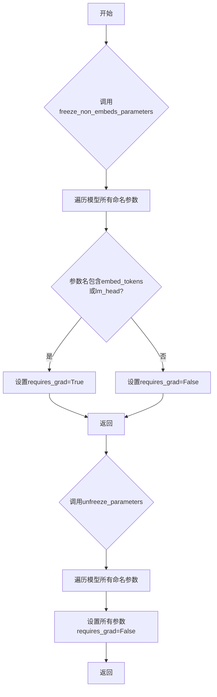
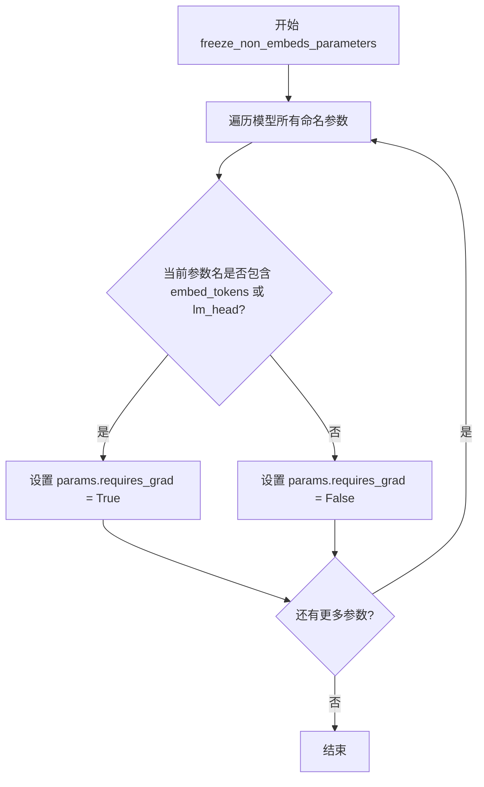
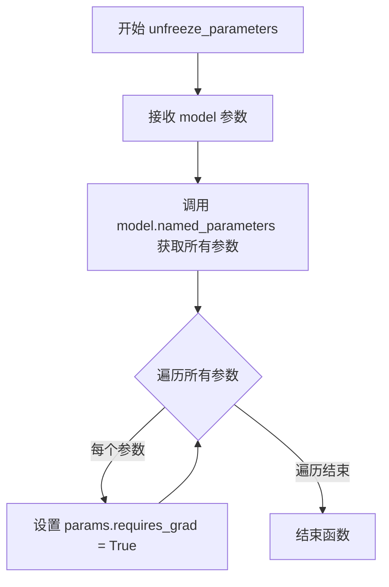

# `LLM4Decompile\train\colossalai_llm4decompile\colossal_llama\utils\froze.py` 详细设计文档

该脚本提供两个工具函数，用于控制LLaMA语言模型的参数冻结状态：freeze_non_embeds_parameters冻结除嵌入层和语言模型头部外的所有参数，unfreeze_parameters冻结模型的所有参数，常用于迁移学习场景下的模型微调。

## 整体流程



## 类结构

```
模块级函数 (无类层次结构)
├── freeze_non_embeds_parameters
└── unfreeze_parameters
```

## 全局变量及字段


    

## 全局函数及方法


### `freeze_non_embeds_parameters`

冻结 LLaMA 模型中除嵌入层（embed_tokens）和语言模型头（lm_head）之外的所有参数，使这些特定层可训练，其他层不可训练。

参数：

- `model`：`LlamaForCausalLM`，要冻结参数的 LLaMA 因果语言模型实例

返回值：`None`，无返回值，直接修改模型参数的 `requires_grad` 属性

#### 流程图



#### 带注释源码

```python
def freeze_non_embeds_parameters(model: LlamaForCausalLM) -> None:
    """Freeze all parameters except embeddings."""
    # 遍历模型的所有命名参数（name: 参数名, params: 参数张量）
    for name, params in model.named_parameters():
        # 如果参数名不包含 embed_tokens 且不包含 lm_head，则冻结该参数
        if "embed_tokens" not in name and "lm_head" not in name:
            # 设置为不可训练
            params.requires_grad = False
        else:
            # 否则保持可训练状态
            params.requires_grad = True
```


### `unfreeze_parameters`

将传入的 LlamaForCausalLM 模型的所有参数设置为可训练状态（requires_grad=True），使模型所有参数都可以被梯度更新。

参数：

- `model`：`LlamaForCausalLM`，需要解冻参数的 Llama 因果语言模型实例

返回值：`None`，此函数不返回任何值，直接修改模型参数的梯度需求属性

#### 流程图



#### 带注释源码

```python
def unfreeze_parameters(model: LlamaForCausalLM) -> None:
    """将模型所有参数设置为可训练状态（解冻所有参数）。
    
    该函数遍历传入的 LlamaForCausalLM 模型的所有参数，并将每个参数的
    requires_grad 属性设置为 True，使所有参数都可以参与梯度计算和更新。
    这在微调场景中常用作逆向操作，与 freeze_non_embeds_parameters 配合使用。
    
    Args:
        model: LlamaForCausalLM，需要解冻参数的模型实例
        
    Returns:
        None，函数直接修改模型参数的 requires_grad 属性，不返回任何值
    """
    # 遍历模型的所有命名参数，包括参数名称和参数张量本身
    for name, params in model.named_parameters():
        # 将每个参数的 requires_grad 设置为 True，解冻该参数
        # 使其在后续训练中可以计算梯度并进行参数更新
        params.requires_grad = True
```


## 关键组件


### freeze_non_embeds_parameters

冻结除嵌入层和语言模型头部外的所有模型参数，使这些参数在训练时不可训练

### unfreeze_parameters

将模型所有参数的梯度计算设置为 False，冻结整个模型的所有参数

### 模型参数管理模块

提供针对 LLaMA 因果语言模型的参数冻结和解冻功能，用于微调场景下的参数控制


## 问题及建议


### 已知问题

-   **函数命名与实现逻辑相悖**：`unfreeze_parameters` 函数名称意为"解冻参数"，但实际实现是将所有参数的 `requires_grad` 设置为 `False`（冻结），存在严重的语义歧义。
-   **参数校验缺失**：未对输入的 `model` 参数进行有效性检查（如 `None` 检查、类型验证），可能导致运行时错误信息不友好。
-   **硬编码层名称**：将 `"embed_tokens"` 和 `"lm_head"` 硬编码在函数中，泛用性差，不同版本或配置的 Llama 模型可能使用不同的参数名称（如 `model.embed_tokens` vs `embed_tokens`）。
-   **函数职责不单一**：`freeze_non_embeds_parameters` 同时处理冻结和解冻两种状态，违反了单一职责原则。
-   **性能优化缺失**：每次调用都完整遍历所有参数，对于大型模型开销较大，且未提供批量操作或缓存机制。
-   **可测试性不足**：缺少单元测试，且函数内部逻辑与外部状态耦合，难以独立验证。
-   **类型注解不完整**：仅标注了输入类型，未包含详细的参数说明和异常说明。

### 优化建议

-   **修正函数命名**：将 `unfreeze_parameters` 重命名为 `freeze_all_parameters` 或 `unfreeze_parameters`（如果意图真的是解冻，则需修改实现逻辑）。
-   **添加参数校验**：在函数入口处增加 `model is not None` 检查和类型验证，提升鲁棒性。
-   **参数化层过滤逻辑**：将需要保留可训练状态的层名称提取为配置参数或函数参数，提高函数的可配置性。
-   **拆分函数职责**：将冻结和解冻逻辑分离为独立函数，每个函数只负责一种状态变更。
-   **增加类型检查和文档**：补充完整的类型注解、参数说明、返回值说明和异常说明，提升代码可维护性。
-   **添加单元测试**：针对不同模型结构和参数配置编写测试用例，确保函数行为符合预期。

## 其它


### 设计目标与约束

本模块的设计目标是提供一种灵活的方式控制LLaMA模型参数的可训练性，支持在微调场景下仅训练 embeddings 和 lm_head 层，以减少训练参数量和计算资源消耗。约束条件包括：1) 仅支持 LlamaForCausalLM 模型架构；2) 函数直接修改模型参数的 requires_grad 属性，无返回值；3) 需要确保模型已正确加载到内存中。

### 错误处理与异常设计

当前代码未包含显式的错误处理机制。建议增加以下异常处理：1) 参数类型检查，当传入的 model 参数不是 LlamaForCausalLM 类型时抛出 TypeError；2) 空模型检查，当 model 参数为 None 时抛出 ValueError；3) 参数遍历异常捕获，处理 named_parameters 可能抛出的异常。

### 外部依赖与接口契约

外部依赖包括 transformers 库（版本需支持 LlamaForCausalLM 模型）。接口契约如下：freeze_non_embeds_parameters 接受 LlamaForCausalLM 类型参数，无返回值；unfreeze_parameters 同样接受 LlamaForCausalLM 类型参数，无返回值。调用方需确保模型已正确实例化且未处于训练状态。

### 使用场景与用例

典型使用场景包括：1) 参数高效微调（PEFT）中的部分层冻结；2) 迁移学习时仅训练顶层；3) 持续预训练中保持底层参数不变；4) 多任务学习中对不同任务使用不同的冻结策略。调用流程：加载预训练模型 → 调用 freeze_non_embeds_parameters 或 unfreeze_parameters → 进行模型训练。

### 性能考虑

当前实现性能开销极低，时间复杂度为 O(n)，其中 n 为模型参数数量。冻结操作仅修改 requires_grad 标记，不涉及实际数据拷贝。建议在多 GPU 环境下注意参数同步，确保各设备的梯度计算一致。

### 安全性考虑

代码本身不涉及敏感数据处理，但需要注意：1) 冻结错误层可能导致梯度无法正确传播；2) 在分布式训练中需确保冻结操作在所有进程间一致执行；3) 模型参数修改需在训练开始前完成，避免在训练过程中动态修改导致不确定行为。

### 兼容性考虑

当前代码仅兼容 transformers 库中的 LlamaForCausalLM 模型。如需支持其他模型架构（如 BERT、GPT 等），需要对 name 检查逻辑进行适配。建议使用抽象基类或接口模式提高代码的可扩展性。

### 测试策略

建议增加以下测试用例：1) 参数类型验证测试；2) 空模型输入测试；3) 冻结后参数 requires_grad 状态验证测试；4) 多次调用状态一致性测试；5) 与不同 LLaMA 模型变体（7B、13B、70B）的兼容性测试。

### 配置说明

本模块无外部配置参数，完全通过函数参数控制行为。模型层的识别依赖于参数名称中的 "embed_tokens" 和 "lm_head" 字符串匹配，需确保 transformers 库的参数命名约定未发生改变。

### 已知限制

1) 硬编码的参数名称匹配逻辑脆弱，易受 transformers 库版本更新影响；2) 不支持动态配置需要冻结的层名称；3) 未提供冻结状态的查询接口；4) 不支持部分冻结（如按比例冻结参数）；5) 缺少日志输出，无法追踪冻结操作的具体影响范围。


    