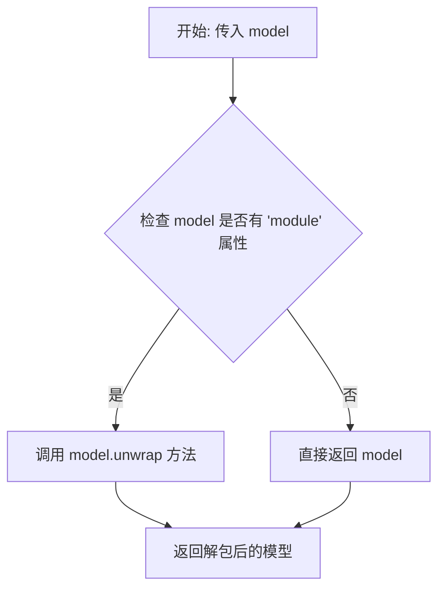
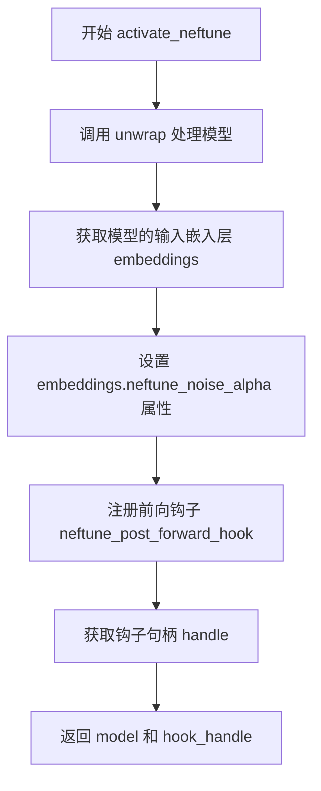

# `LLM4Decompile\train\colossalai_llm4decompile\colossal_llama\utils\neftune_patch.py` 详细设计文档

NEFTune实现代码，通过在模型嵌入层注册前向钩子注入噪声来增强语言模型微调效果，支持动态激活和停用

## 整体流程

```mermaid
graph TD
    A[开始] --> B[调用 activate_neftune]
    B --> C[unwrap model 获取原始模型]
    C --> D[获取输入嵌入层 get_input_embeddings]
    D --> E[设置 neftune_noise_alpha 参数到嵌入层]
    E --> F[注册前向传播钩子 neftune_post_forward_hook]
    F --> G[返回模型和钩子句柄]
    G --> H{模型训练时}
    H --> I[前向传播触发钩子]
    I --> J[计算噪声幅度 mag_norm = alpha / sqrt(dims)]
    J --> K[生成均匀分布噪声并添加到输出]
    K --> L[返回添加噪声后的嵌入]
    L --> M[调用 deactivate_neftune 停用]
    M --> N[移除钩子句柄]
    N --> O[删除 neftune_noise_alpha 属性]
```

## 类结构

```
无类定义，只有模块级函数
```

## 全局变量及字段


### `neftune_hook_handle`
    
存储NEFTune前向钩子的句柄，用于后续移除钩子

类型：`torch.utils.hooks.RemovableHandle`
    


    

## 全局函数及方法


### `unwrap`

该函数用于解包被 `torch.nn.DataParallel` 或 `torch.nn.parallel.DistributedDataParallel` 包装的模型，返回原始模型实例。在分布式训练场景中，模型通常会被包装以支持多 GPU 并行计算，该函数能够还原模型以便访问其原始属性和方法。

参数：

- `model`：`torch.nn.Module`，输入的模型对象，可能是原始模型或被 DataParallel/DistributedDataParallel 包装的模型

返回值：`torch.nn.Module`，返回解包装后的原始模型，如果模型未被包装则直接返回原模型

#### 流程图



#### 带注释源码

```python
def unwrap(model):
    """
    解包被 DataParallel 或 DistributedDataParallel 包装的模型。
    
    在 PyTorch 分布式训练中，模型经常被包装以支持多 GPU 计算。
    该函数检测模型是否有 'module' 属性来判断是否被包装，
    如果被包装则调用 unwrap() 方法获取原始模型。
    
    Args:
        model (torch.nn.Module): 需要解包的模型对象
        
    Returns:
        torch.nn.Module: 原始模型（未包装的模型）
    """
    # 检查模型是否具有 'module' 属性
    # DataParallel/DistributedDataParallel 包装的模型会有此属性
    if hasattr(model, "module"):
        # 调用模型的 unwrap() 方法获取原始模型
        return model.unwrap()
    else:
        # 模型未被包装，直接返回
        return model
```

#### 设计说明

该函数是 Hugging Face Transformers 库中用于处理分布式训练场景的核心工具函数。其设计遵循以下原则：

1. **简单直接**：通过属性检查而非复杂的类型判断，保持实现简洁
2. **兼容性强**：兼容 DataParallel 和 DistributedDataParallel 两种包装方式
3. **无副作用**：不修改原模型，仅返回引用

#### 潜在优化空间

- 可考虑添加类型提示（type hints）以提升代码可读性和 IDE 支持
- 可添加日志记录以便调试分布式训练中的模型包装问题
- 当前实现假设 `unwrap()` 方法存在，可增加异常处理以提高健壮性


### `neftune_post_forward_hook`

该函数是NEFTune（Noisy Embeddings Fine-Tuning）技术的核心实现，通过PyTorch前向钩子机制在模型嵌入层的输出张量中注入均匀分布噪声，以提升模型的泛化能力和训练稳定性。

参数：

- `module`：`torch.nn.Module`，执行钩子的嵌入模块（通常为 `nn.Embedding`），需预先设置 `module.neftune_noise_alpha` 属性来控制噪声强度
- `input`：`torch.Tensor`，传入模型的输入张量（此函数中未直接使用，仅作为钩子接口参数）
- `output`：`torch.Tensor`，嵌入层的输出张量，即经过嵌入查找后的词向量表示

返回值：`torch.Tensor`，经过噪声注入处理后的输出张量（若处于训练模式），或原始输出（若处于推理模式）

#### 流程图

```mermaid
flowchart TD
    A[函数调用: neftune_post_forward_hook] --> B{module.training == True?}
    B -- 否 --> C[直接返回原始 output]
    B -- 是 --> D[计算输出张量维度: dims = output.size(1) * output.size(2)]
    E[计算噪声幅度: mag_norm = neftune_noise_alpha / sqrt(dims)] --> F[生成均匀分布噪声张量]
    F --> G[将噪声添加到输出: output + uniform(-mag_norm, mag_norm)]
    G --> C
```

#### 带注释源码

```python
def neftune_post_forward_hook(module, input, output):
    """
    Implements the NEFTune forward pass for the model using forward hooks. Note this works only for torch.nn.Embedding
    layers. This method is slightly adapted from the original source code that can be found here:
    https://github.com/neelsjain/NEFTune Simply add it to your model as follows:
    ```python
    model = ...
    model.embed_tokens.neftune_noise_alpha = 0.1
    model.embed_tokens.register_forward_hook(neftune_post_forward_hook)
    ```
    Args:
        module (`torch.nn.Module`):
            The embedding module where the hook is attached. Note that you need to set `module.neftune_noise_alpha` to
            the desired noise alpha value.
        input (`torch.Tensor`):
            The input tensor to the model.
        output (`torch.Tensor`):
            The output tensor of the model (i.e. the embeddings).
    """
    # 仅在训练模式下注入噪声，推理时保持原始输出以保证确定性
    if module.training:
        # 计算嵌入向量总数（序列长度 × 嵌入维度），用于归一化噪声幅度
        dims = torch.tensor(output.size(1) * output.size(2))
        # 根据NEFTune论文公式计算噪声幅度：alpha / sqrt(d)
        # 其中d为嵌入维度，确保噪声方差与嵌入尺度相适应
        mag_norm = module.neftune_noise_alpha / torch.sqrt(dims)
        # 生成与输出张量形状相同的均匀分布噪声，并加到原始输出上
        # uniform_(-mag_norm, mag_norm) 为 inplace 操作（在零张量上）
        output = output + torch.zeros_like(output).uniform_(-mag_norm, mag_norm)
    return output
```


### `activate_neftune`

激活 NEFTune（Noisy Embedding Fine-Tuning）技术，通过在模型的嵌入层添加噪声来改进指令微调效果。

参数：

- `model`：`torch.nn.Module`，需要激活 neftune 的模型
- `neftune_noise_alpha`：`float`，噪声系数，控制添加到嵌入层的噪声幅度，默认值为 0.1

返回值：`tuple`，返回 (model, neftune_hook_handle) 元组，其中 model 是原始模型，neftune_hook_handle 是用于后续禁用 neftune 的钩子句柄

#### 流程图



#### 带注释源码

```python
def activate_neftune(model, neftune_noise_alpha=0.1):
    r"""
    激活 NEFTune (Noisy Embedding Fine-Tuning) 技术
    
    该实现基于论文: https://arxiv.org/abs/2310.05914
    代码仓库: https://github.com/neelsjain/NEFTune
    
    通过在模型的嵌入层输出中添加均匀分布的噪声来实现数据增强，
    从而提升指令微调的效果。
    
    Args:
        model (torch.nn.Module): 需要激活 neftune 的模型
        neftune_noise_alpha (float): 噪声系数，控制噪声的幅度。
            公式为: noise ~ Uniform(-α/√d, α/√d)，其中 d 是嵌入维度
    
    Returns:
        Tuple[torch.nn.Module, RemovableHandle]: 
            - model: 原始模型（保持不变）
            - neftune_hook_handle: 前向钩子句柄，用于后续调用 deactivate_neftune
    """
    # Step 1: 处理模型，解包可能的 DataParallel/DDP 包装
    # 如果模型被 DataParallel 包装，需要访问 .module 属性
    unwrapped_model = unwrap(model)
    
    # Step 2: 获取模型的输入嵌入层 (通常是 embed_tokens 或 embedding)
    embeddings = unwrapped_model.get_input_embeddings()
    
    # Step 3: 在嵌入层上设置噪声系数属性
    # neftune_post_forward_hook 会读取此属性来计算噪声幅度
    embeddings.neftune_noise_alpha = neftune_noise_alpha
    
    # Step 4: 注册前向钩子，在前向传播后添加噪声
    # hook 会在每次 forward 时被调用，添加噪声到嵌入输出
    hook_handle = embeddings.register_forward_hook(neftune_post_forward_hook)
    
    # Step 5: 保存钩子句柄的引用，用于后续禁用
    neftune_hook_handle = hook_handle
    
    # Step 6: 返回模型和钩子句柄
    # 返回原始 model 而不是 unwrapped_model，保持 API 一致性
    return model, neftune_hook_handle
```


### `deactivate_neftune`

该函数用于停用 NEFTune（Noisy Embedding Fine-Tuning）技术，通过移除前向传播钩子并清理嵌入层中添加的噪声alpha属性来恢复正常模型行为。

参数：

- `model`：`torch.nn.Module`，需要禁用neftune的模型对象
- `neftune_hook_handle`：`torch.utils.hooks.RemovableHandle`，激活neftune时注册的前向钩子句柄

返回值：`None`，无返回值，该函数直接修改模型状态

#### 流程图

```mermaid
flowchart TD
    A[开始 deactivate_neftune] --> B[获取模型输入嵌入层]
    B --> C[调用 unwrap(model).get_input_embeddings]
    C --> D[移除前向钩子]
    D --> E[调用 neftune_hook_handle.remove]
    E --> F[删除噪声alpha属性]
    F --> G[del embeddings.neftune_noise_alpha]
    G --> H[结束]
```

#### 带注释源码

```python
def deactivate_neftune(model, neftune_hook_handle):
    """
    Deactivates the neftune method. Make sure to call `activate_neftune` first.
    
    该函数用于停用NEFTune噪声嵌入微调技术，通过移除之前注册的前向钩子
    并删除嵌入层上的neftune_noise_alpha属性来恢复模型的正常行为。
    
    Args:
        model (torch.nn.Module): 需要禁用neftune的模型对象
        neftune_hook_handle (torch.utils.hooks.RemovableHandle): 
            激活neftune时通过register_forward_hook返回的钩子句柄
    
    Returns:
        None: 无返回值，直接修改模型内部状态
    """
    # 获取模型的输入嵌入层（通常是embedding层）
    # unwrap函数用于处理模型被DataParallel包装的情况
    embeddings = unwrap(model).get_input_embeddings()

    # 移除之前注册的前向传播钩子
    # 这会停止在forward过程中添加噪声的操作
    neftune_hook_handle.remove()

    # 删除嵌入层上的neftune_noise_alpha属性
    # 该属性在activate_neftune时设置，用于控制噪声强度
    del embeddings.neftune_noise_alpha
```

## 关键组件


### unwrap

辅助函数，用于解包模型。当模型被`nn.DataParallel`包装时，返回内部的原始模型；否则直接返回原模型。

### neftune_post_forward_hook

前向传播钩子函数， 实现NEFTune的核心逻辑。在模型训练时，对嵌入层的输出添加均匀分布的噪声，噪声幅度由`neftune_noise_alpha`参数控制，用于改进微调效果。

### activate_neFTune

激活NEFTune方法的函数。通过获取模型的输入嵌入层，设置噪声alpha值，并注册前向钩子来实现噪声注入功能。

### deactivate_neftune

停用NEFTune方法的函数。移除之前注册的前向钩子，并删除嵌入层上的噪声alpha属性。


## 问题及建议


### 已知问题

- **内存泄漏风险**：`deactivate_neftune`中直接删除`neftune_noise_alpha`属性，如果属性不存在会抛出`AttributeError`
- **类型注解缺失**：所有函数均无类型提示，不利于IDE支持和代码可维护性
- **错误处理不足**：未检查`model`是否有`embed_tokens`属性或`get_input_embeddings()`返回值是否为`None`
- **全局变量冗余**：`neftune_hook_handle = hook_handle`是冗余赋值，增加内存开销且无实际作用
- **临时张量低效**：使用`torch.zeros_like(output).uniform_()`创建临时张量，应使用`torch.empty_like(output).uniform_()`减少内存分配
- **重复计算**：`dims = torch.tensor(output.size(1) * output.size(2))`在每次前向传播都创建新张量，应预先计算
- **文档不完整**：`activate_neftune`返回值描述缺失，未说明返回的`hook_handle`用途
- **数值边界未校验**：未验证`neftune_noise_alpha`为正数或限制在合理范围内

### 优化建议

- 添加完整的类型注解（如`def activate_neftune(model: torch.nn.Module, neftune_noise_alpha: float) -> Tuple[torch.nn.Module, torch.utils.hooks.RemovableHandle]:`）
- 在`deactivate_neftune`中使用`hasattr`检查属性是否存在后再删除
- 添加模型嵌入层有效性检查，抛出有意义的自定义异常
- 使用`torch.empty_like`替代`torch.zeros_like`以减少不必要的内存初始化
- 预先计算噪声缩放因子`mag_norm`，避免每次前向传播重复计算
- 移除冗余的全局变量赋值，简化代码逻辑
- 添加`neftune_noise_alpha`参数的正数校验
- 补充完整的文档字符串，说明返回值和可能的异常

## 其它


### 设计目标与约束

本代码实现NEFTune（Noisy Embedding Fine-Tuning）技术，通过在训练过程中向词嵌入层添加噪声来改善语言模型的微调效果。核心约束包括：1）仅支持torch.nn.Embedding层；2）噪声仅在训练模式（training=True）下生效；3）需要模型有get_input_embeddings方法。

### 错误处理与异常设计

1. **unwrap函数**：如果model既没有module属性也没有unwrap方法，直接返回原model，不抛出异常
2. **activate_neftune**：假设model必有get_input_embeddings方法，若不存在会抛出AttributeError
3. **deactivate_neftune**：假设hook_handle有效，若已移除则调用remove()会失败
4. **参数验证**：neftune_noise_alpha需为正数，负值会导致uniform_产生反向噪声

### 数据流与状态机

**激活流程（activate_neftune）**：
1. unwrap模型获取原始模型
2. 获取输入嵌入层（embed_tokens）
3. 设置neftune_noise_alpha属性
4. 注册前向传播钩子
5. 返回模型和钩子句柄

**运行流程（训练时）**：
1. 输入token经过embedding层
2. neftune_post_forward_hook被触发
3. 计算噪声幅度：mag_norm = alpha / sqrt(dims)
4. 生成均匀分布噪声并添加到输出
5. 返回带噪声的嵌入

**停用流程（deactivate_neftune）**：
1. 移除前向钩子
2. 删除neftune_noise_alpha属性

### 外部依赖与接口契约

1. **PyTorch依赖**：需要torch>=1.0，主要使用torch.Tensor、torch.nn.Module、torch.zeros_like、torch.uniform_、torch.sqrt
2. **模型接口契约**：
   - 模型需有get_input_embeddings()方法返回nn.Embedding
   - 嵌入层需支持注册forward_hook
   - 模型需支持training属性
3. **返回值契约**：
   - activate_neftune返回(model, hook_handle)元组
   - hook_handle需有remove()方法

### 性能考量与优化空间

1. **性能开销**：每次前向传播都需生成随机噪声并执行加法，对于大batch有计算开销
2. **优化建议**：
   - 可预先创建噪声缓冲区复用
   - 可使用torch.no_grad()在推理时避免噪声添加
   - 考虑使用inplace操作减少内存分配
3. **内存占用**：torch.zeros_like(output)会分配与output相同大小的显存

### 安全性与边界情况

1. **边界情况**：output为空tensor时dims为0会导致除零错误
2. **安全性**：噪声添加后未做数值范围校验，可能导致NaN
3. **并发安全**：多线程同时调用activate/deactivate可能存在竞态条件

### 测试与验证建议

1. 验证训练模式下噪声确实被添加
2. 验证推理模式下输出与原始embedding一致
3. 验证不同alpha值对噪声幅度的影响
4. 验证多次activate/deactivate不会导致内存泄漏
5. 验证DataParallel模型能正确处理


    