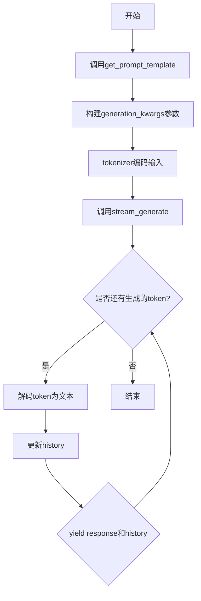
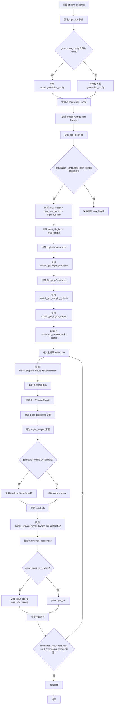

# `LLM4Decompile\train\colossalai_llm4decompile\colossal_llama\utils\stream_chat_patch.py` 详细设计文档

这是一个基于transformers库的流式聊天生成模块，提供对话历史管理、提示模板生成和流式token生成功能，支持多种生成参数配置（temperature、top_p、top_k等），可返回past_key_values用于增量解码，适用于大语言模型的交互式对话场景。

## 整体流程



## 类结构

```
模块文件 (无类层次结构)
└── 函数集合
    ├── get_prompt_template (提示模板生成)
    ├── streaming_chat (流式聊天主函数)
    └── stream_generate (核心流式生成器)
```

## 全局变量及字段


### `logger`
    
模块级日志记录器，用于记录代码运行过程中的日志信息

类型：`logging.Logger`
    


    

## 全局函数及方法


### `get_prompt_template`

该函数用于根据用户输入和对话历史生成聊天模型的提示模板，将历史对话和当前输入格式化为特定的模板字符串，支持系统、用户和助手角色的区分。

参数：

- `input_query`：`str`，用户当前输入的查询内容
- `history`：`List[Dict]`，可选参数，过去的对话列表，每个字典包含'role'和'message'键，默认为None
- `roles`：`list`，指定对话中的角色顺序，默认值为`["", "Human", "Assistant"]`，分别代表系统、用户、助手

返回值：`str`，格式化后的提示模板字符串，包含历史对话和当前输入

#### 流程图

```mermaid
flowchart TD
    A[开始 get_prompt_template] --> B{history是否为None}
    B -->|是| C[创建空列表 new_history]
    B -->|否| D[深拷贝 history 到 new_history]
    C --> E[追加当前用户输入到new_history]
    D --> E
    E --> F[追加助手角色空消息到new_history]
    F --> G[遍历 new_history 中的每个对话项]
    G --> H{当前项的role是否等于roles[0]}
    H -->|是| I[生成格式: &lt;s&gt;消息\n\n]
    H -->|否| J{消息是否存在}
    J -->|是| K[生成格式: role: &lt;s&gt;消息&lt;/s&gt;]
    J -->|否| L[生成格式: role: &lt;s&gt;]
    I --> M[拼接提示字符串]
    K --> M
    L --> M
    M --> N[返回最终提示模板]
```

#### 带注释源码

```python
def get_prompt_template(
    input_query: str,
    history: List[Dict] = None,
    roles: list = ["", "Human", "Assistant"],
) -> str:
    """
    Generates a prompt template for chat models based on input and history.

    Args:
        input_query (str): User's current input query.
        history (List[Dict], optional): List of past conversations, each a dict with 'role' and 'message'.
        roles (list): Specifies the roles in the conversation, defaults to ["", "Human", "Assistant"].

    Returns:
        str: A formatted prompt including the input query and history.
    """
    # 初始化空字符串用于存储生成的提示模板
    prompt = ""
    
    # 处理历史记录：如果为None则创建空列表，否则深拷贝历史记录避免修改原数据
    if history is None:
        new_history = []
    else:
        new_history = deepcopy(history)

    # 将当前用户输入追加到历史记录中，角色为用户角色（roles[1]即"Human"）
    new_history.append({"role": roles[1], "message": input_query.strip()})
    
    # 追加一个空的助手消息作为响应占位符，角色为助手角色（roles[2]即"Assistant"）
    new_history.append({"role": roles[2], "message": None})

    # 遍历所有对话历史项，生成格式化提示
    for _, item in enumerate(new_history):
        # 获取当前对话项的角色和消息内容
        role = item.get("role")
        message = item.get("message")
        
        # 根据角色类型生成不同的格式
        if role == roles[0]:
            # 系统角色（第一轮）：使用<s>前缀，不加</s>后缀
            prompt += f"<s>{message}\n\n"
        else:
            # 用户或助手角色
            if message:
                # 有消息内容：格式为"角色: <s>消息</s>"
                prompt += f"{role}: <s>{message}</s>"
            else:
                # 空消息（如助手占位符）：格式为"角色: <s>"
                prompt += f"{role}: <s>"
    
    # 返回最终生成的提示模板字符串
    return prompt
```


### `streaming_chat`

该函数是一个基于生成式模型的流式聊天响应生成函数，接收用户输入和历史对话上下文，通过分词器处理提示词，并调用内部流式生成器逐个 token 地产生回复，同时支持增量解码（返回 past_key_values）和历史记录的动态更新。

参数：

- `model`：`Any`，用于生成响应的语言模型
- `tokenizer`：`PreTrainedTokenizer`，与模型兼容的分词器，用于编码输入和解码响应
- `input_query`：`str`，用户当前输入的查询内容
- `history`：`List[Dict]`，可选参数，表示过去的对话列表，每个对话包含 'role' 和 'message' 键值对
- `roles`：`list`，对话中的角色定义，默认为 ["", "Human", "Assistant"]
- `past_key_values`：`Tuple[Tuple[torch.FloatTensor, Any], Any]`，可选参数，用于增量解码的过去键值
- `temperature`：`float`，token 采样温度值，默认为 0.8
- `top_p`：`float`，核采样概率阈值，默认为 0.95
- `top_k`：`int`，Top-K 过滤阈值，默认为 50
- `do_sample`：`bool`，是否进行采样生成，默认为 True
- `length_penalty`：`float`，响应长度惩罚系数，默认为 1.2
- `max_new_tokens`：`int`，生成的最大新 token 数量，默认为 512
- `logits_processor`：`LogitsProcessorList`，可选参数，自定义日志处理器，默认为 None
- `return_past_key_values`：`bool`，是否返回 past_key_values 以支持增量解码，默认为 False
- `**kwargs`：其他用于生成的关键字参数

返回值：`Generator[Tuple[str, List[Dict], Optional[Tuple[Tuple[torch.FloatTensor, Any], Any]]], None, None]`，生成器类型，每次 yield 返回一个元组，包含生成的响应字符串、更新后的历史记录，以及可选的更新后的 past_key_values（当 return_past_key_values 为 True 时）

#### 流程图

```mermaid
flowchart TD
    A[开始 streaming_chat] --> B{检查 tokenizer.padding_side == 'left'}
    B -->|否| C[断言错误: 只支持左填充]
    B -->|是| D{history is None}
    D -->|是| E[history = []]
    D -->|否| F[保持 history 不变]
    E --> G{logits_processor is None}
    F --> G
    G -->|是| H[logits_processor = LogitsProcessorList()]
    G -->|否| I[保持 logits_processor 不变]
    H --> J[构建 generation_kwargs 字典]
    J --> K[调用 get_prompt_template 生成提示词]
    K --> L[获取 eos_token_id]
    L --> M[tokenizer 编码提示词并移动到模型设备]
    M --> N[更新 history: 添加用户输入和占位 Assistant 消息]
    N --> O[进入 stream_generate 循环]
    O --> P{return_past_key_values?}
    P -->|是| Q[解包 outputs 和 past_key_values]
    P -->|否| R[只使用 outputs]
    Q --> S[提取新生成的 token IDs]
    R --> S
    S --> T[tokenizer.decode 解码为文本]
    T --> U[更新 history 中最后一条 Assistant 消息]
    U --> V{return_past_key_values?}
    V -->|是| W[yield response, history, past_key_values]
    V -->|否| X[yield response, history]
    W --> Y[继续循环或结束]
    X --> Y
```

#### 带注释源码

```python
@torch.inference_mode()
def streaming_chat(
    model: Any,
    tokenizer: PreTrainedTokenizer,
    input_query: str,
    history: List[Dict] = None,
    roles: list = ["", "Human", "Assistant"],
    past_key_values: Tuple[Tuple[torch.FloatTensor, Any], Any] = None,
    temperature: float = 0.8,
    top_p: float = 0.95,
    top_k: int = 50,
    do_sample: bool = True,
    length_penalty: float = 1.2,
    max_new_tokens: int = 512,
    logits_processor: LogitsProcessorList = None,
    return_past_key_values: bool = False,
    **kwargs,
):
    """
    Streaming chat responses generation with a given model and tokenizer.

    Args:
        model (Any): The language model to generate responses.
        tokenizer (PreTrainedTokenizer): Tokenizer compatible with the model, used for encoding inputs and decoding responses.
        input_query (str): The current user input to respond to.
        history (List[Dict], optional): A list of past conversations, where each conversation is a dictionary with keys 'role' and 'message'.
        roles (list): Roles involved in the conversation, defaults to ["", "Human", "Assistant"].
        past_key_values (Tuple[Tuple[torch.FloatTensor, Any], Any], optional): Past key values for incremental decoding.
        temperature (float): The temperature value for token sampling, defaults to 0.8.
        top_p (float): Nucleus sampling probability threshold, defaults to 0.95.
        top_k (int): Top-K filtering threshold, defaults to 50.
        do_sample (bool): Whether to sample responses, defaults to True.
        length_penalty (float): Penalty for response length, defaults to 1.2.
        max_new_tokens (int): Maximum number of new tokens to generate, defaults to 512.
        logits_processor (LogitsProcessorList, optional): Custom logits processors, defaults to None.
        return_past_key_values (bool): Whether to return past key values for further incremental decoding, defaults to False.
        **kwargs: Additional keyword arguments for generation.

    Yields:
        Tuple[str, List[Dict], Optional[Tuple[Tuple[torch.FloatTensor, Any], Any]]]: A tuple containing the generated response, updated history, and
        optionally the updated past key values if `return_past_key_values` is True.

    Ensures padding is on the left side for the tokenizer.
    """
    # 断言检查：当前生成模式仅支持左侧填充
    assert tokenizer.padding_side == "left", "Current generation only supports left padding."
    
    # 初始化 history 为空列表，防止 None 引用错误
    if history is None:
        history = []
    
    # 如果未提供 logits_processor，则创建默认的空处理器列表
    if logits_processor is None:
        logits_processor = LogitsProcessorList()

    # 构建生成参数字典，包含采样策略、长度限制等配置
    generation_kwargs = {
        "temperature": temperature,
        "top_p": top_p,
        "top_k": top_k,
        "do_sample": do_sample,
        "max_new_tokens": max_new_tokens,
        "length_penalty": length_penalty,
        "use_cache": True,  # 启用 KV 缓存以加速生成
        **kwargs,  # 允许覆盖默认参数
    }

    # 使用提示词模板函数将输入查询和历史记录格式化为模型可理解的字符串
    prompt_str = get_prompt_template(input_query, history=history, roles=roles)

    # 获取结束符 ID，用于标识生成终止
    eos_token_id = [tokenizer.eos_token_id]
    
    # 使用分词器将提示词转换为 PyTorch 张量，并移动到模型所在设备
    inputs = tokenizer(prompt_str, return_tensors="pt").to(model.device)
    
    # 更新历史记录：追加当前用户输入和空的助手回复占位符
    history.append({"role": roles[1], "message": input_query.strip()})
    history.append({"role": roles[2], "message": None})

    # 遍历流式生成器，每次迭代产生一个完整的输出序列
    for outputs in stream_generate(
        model,
        **inputs,
        past_key_values=past_key_values,
        eos_token_id=eos_token_id,
        return_past_key_values=return_past_key_values,
        **generation_kwargs,
    ):
        # 如果需要返回 past_key_values，则从输出中解包
        if return_past_key_values:
            outputs, past_key_values = outputs

        # 提取新生成的 token IDs（排除输入提示部分），并移除最后一个结束符
        outputs = outputs.tolist()[0][len(inputs["input_ids"][0]) : -1]
        
        # 将 token IDs 解码为人类可读的文本
        response = tokenizer.decode(outputs)

        # 更新历史记录中最后一条助手消息为实际生成的响应
        history[-1]["message"] = response.strip()
        
        # 根据配置决定是否同时返回 past_key_values
        if return_past_key_values:
            yield response, history, past_key_values
        else:
            yield response, history
```


### `stream_generate`

该函数是一个生成器函数，接收模型、输入序列和生成配置，使用多种采样策略（如temperature、top-p、top-k）逐步生成token id序列，支持增量解码和自定义logits处理与停止条件检查。

参数：

- `model`：`Any`，用于生成token id序列的语言模型
- `input_ids`：`torch.Tensor`，用作生成提示的序列或编码器输入
- `generation_config`：`Optional[GenerationConfig]`，生成配置的基础参数化，默认为None
- `logits_processor`：`Optional[LogitsProcessorList]`，自定义logits处理器，补充默认处理器，默认为None
- `stopping_criteria`：`Optional[StoppingCriteriaList]`，自定义停止标准，补充默认停止标准，默认为None
- `prefix_allowed_tokens_fn`：`Optional[Callable[[int, torch.Tensor], List[int]]]`，用于约束token生成的函数，默认为None
- `return_past_key_values`：`bool`，是否返回过去的key values以进行增量解码，默认为False
- `**kwargs`：其他传递给模型生成的额外关键字参数

返回值：`Generator[Union[torch.Tensor, Tuple[torch.Tensor, Tuple[Tuple[torch.FloatTensor, Any], Any]]], None, None]`，生成器，每次yield返回当前生成的token IDs， optionally包含past_key_values

#### 流程图



#### 带注释源码

```python
@torch.inference_mode()
def stream_generate(
    model: Any,
    input_ids: torch.Tensor,
    generation_config: Optional[GenerationConfig] = None,
    logits_processor: Optional[LogitsProcessorList] = None,
    stopping_criteria: Optional[StoppingCriteriaList] = None,
    prefix_allowed_tokens_fn: Optional[Callable[[int, torch.Tensor], List[int]]] = None,
    return_past_key_values: bool = False,
    **kwargs,
):
    """
    使用指定模型和生成参数生成token id序列。
    改编自 https://huggingface.co/THUDM/chatglm3-6b/blob/main/modeling_chatglm.py

    参数:
        model (Any): 用于生成token id序列的模型。
        input_ids (torch.Tensor): 用作提示的序列或编码器输入。
        generation_config (Optional[GenerationConfig]): 生成配置。
        logits_processor (Optional[LogitsProcessorList]): 自定义logits处理器。
        stopping_criteria (Optional[StoppingCriteriaList]): 自定义停止标准。
        prefix_allowed_tokens_fn (Optional[Callable[[int, torch.Tensor], List[int]]]): 约束token生成的函数。
        return_past_key_values (bool): 是否返回过去的key values，默认为False。
        **kwargs: 模型生成的其他参数。

    生成:
        torch.Tensor: 每次生成的token IDs。
        Optional[Tuple[Tuple[torch.FloatTensor, Any], Any]]: 如果return_past_key_values为True，则返回过去的key values。
    """
    # 获取输入序列的长度
    input_ids_len = input_ids.size(1)

    # 如果没有提供生成配置，则使用模型的默认配置
    if generation_config is None:
        generation_config = model.generation_config
    
    # 深拷贝配置以避免修改原始配置
    generation_config = deepcopy(generation_config)
    # 使用kwargs更新配置字典
    model_kwargs = generation_config.update(**kwargs)

    # 处理eos_token_id，确保它是列表形式
    eos_token_id = generation_config.eos_token_id
    if isinstance(eos_token_id, int):
        eos_token_id = [eos_token_id]
    # 将eos_token_id转换为tensor以便后续比较操作
    eos_token_id_tensor = torch.tensor(eos_token_id).to(input_ids.device) if eos_token_id is not None else None

    # 如果设置了max_new_tokens，则计算max_length
    if generation_config.max_new_tokens is not None:
        generation_config.max_length = generation_config.max_new_tokens + input_ids_len

    # 警告用户如果输入长度已经超过max_length
    if input_ids_len >= generation_config.max_length:
        input_ids_string = "decoder_input_ids" if model.config.is_encoder_decoder else "input_ids"
        logger.warning(
            f"Input length of {input_ids_string} is {input_ids_len}, but `max_length` is set to"
            f" {generation_config.max_length}. This can lead to unexpected behavior. You should consider"
            " increasing `max_new_tokens`."
        )
    
    # 初始化logits_processor列表
    logits_processor = logits_processor if logits_processor is not None else LogitsProcessorList()
    # 初始化stopping_criteria列表
    stopping_criteria = stopping_criteria if stopping_criteria is not None else StoppingCriteriaList()

    # 准备distribution预处理采样器 - 获取logits处理器
    logits_processor = model._get_logits_processor(
        generation_config=generation_config,
        input_ids_seq_length=input_ids_len,
        encoder_input_ids=input_ids,
        prefix_allowed_tokens_fn=prefix_allowed_tokens_fn,
        logits_processor=logits_processor,
    )

    # 准备停止条件
    stopping_criteria = model._get_stopping_criteria(
        generation_config=generation_config, stopping_criteria=stopping_criteria
    )

    # 获取logits warper（用于top-k、top-p等采样策略）
    logits_warper = model._get_logits_warper(generation_config)
    
    # 初始化未完成序列标记（全1表示所有序列都未完成）
    unfinished_sequences = input_ids.new(input_ids.shape[0]).fill_(1)
    # 初始化scores为None
    scores = None

    # 主生成循环
    while True:
        # 为生成准备模型输入
        model_inputs = model.prepare_inputs_for_generation(input_ids, **model_kwargs)
        
        # 前向传播获取下一个token
        outputs = model(
            **model_inputs,
            return_dict=True,
            output_attentions=False,
            output_hidden_states=False,
        )

        # 注意：以下逻辑仅在左填充模式下正确
        # 预处理分布 - 获取最后一个logits
        next_token_logits = outputs.logits[:, -1, :]
        # 通过logits处理器处理
        next_token_scores = logits_processor(input_ids, next_token_logits)
        # 通过logits warper处理（temperature、top-p等）
        next_token_scores = logits_warper(input_ids, next_token_scores)

        # 采样
        probs = nn.functional.softmax(next_token_scores, dim=-1)
        if generation_config.do_sample:
            # 使用multinomial采样（允许重复采样）
            next_tokens = torch.multinomial(probs, num_samples=1).squeeze(1)
        else:
            # 使用argmax（贪婪搜索）
            next_tokens = torch.argmax(probs, dim=-1)

        # 更新生成的ids、模型输入和下一步的长度
        input_ids = torch.cat([input_ids, next_tokens[:, None]], dim=-1)
        # 更新模型kwargs（past_key_values等）
        model_kwargs = model._update_model_kwargs_for_generation(
            outputs, model_kwargs, is_encoder_decoder=model.config.is_encoder_decoder
        )
        
        # 更新未完成序列 - 检查当前token是否为eos_token
        unfinished_sequences = unfinished_sequences.mul(
            next_tokens.tile(eos_token_id_tensor.shape[0], 1).ne(eos_token_id_tensor.unsqueeze(1)).prod(dim=0)
        )

        # 根据return_past_key_values决定yield内容
        if return_past_key_values:
            yield input_ids, outputs.past_key_values
        else:
            yield input_ids
        
        # 检查停止条件：当所有序列都完成或超过最大长度时停止
        if unfinished_sequences.max() == 0 or stopping_criteria(input_ids, scores):
            break
```

## 关键组件


### 提示词模板生成 (get_prompt_template)

根据输入查询和历史对话生成格式化提示词模板，支持多角色对话历史管理。

### 流式聊天入口 (streaming_chat)

封装完整的对话流程管理，整合提示词生成、tokenizer编码和流式生成调用，支持历史状态维护和增量解码。

### 流式生成核心 (stream_generate)

实现基于贪婪搜索和概率采样的token级流式生成，支持自定义logits处理器和停止条件，包含左填充对齐和增量键值缓存更新。

### 张量索引与增量解码

通过 `outputs.logits[:, -1, :]` 提取最新token预测分布，使用 `torch.cat` 拼接生成序列，配合 `past_key_values` 实现高效增量推理。

### 采样策略控制

集成temperature温度采样、top-p核采样、top-k阈值过滤和length_penalty长度惩罚，支持do_sample开关控制随机性。

### 推理模式优化

使用 `@torch.inference_mode()` 装饰器禁用梯度计算和自动求导，显著降低显存占用和推理延迟。

### 停止条件判定

基于EOS token匹配和自定义StoppingCriteriaList双重判定，支持多token结束标记和最大长度约束。

### 错误处理与警告机制

通过logger.warning提示输入长度与最大长度配置不匹配的情况，assert校验tokenizer左填充配置。


## 问题及建议


### 已知问题

- **history 直接修改问题**：`streaming_chat` 函数中直接对传入的 `history` 列表进行 `append` 操作，而不是使用深拷贝。这会导致调用者的原始 history 数据被意外修改，可能引发副作用。
- **参数覆盖风险**：`stream_generate` 中使用 `generation_config.update(**kwargs)` 直接更新配置，如果 `kwargs` 包含与 generation_config 冲突的键，可能导致意外行为。
- **设备一致性问题**：虽然代码中做了 `.to(model.device)`，但在 `stream_generate` 中创建 `eos_token_id_tensor` 时也显式调用了 `.to(input_ids.device)`，这是好的，但整体设备管理可以更统一。
- **EOS token 处理**：当 `eos_token_id` 为整数列表时，代码正确处理了，但假设了 `eos_token_id_tensor.shape[0]` 与批次大小匹配，未做显式验证。
- **缺乏输入验证**：函数参数缺乏充分的验证，例如 `temperature` 负值、`top_p` 超出 [0,1] 范围等情况未做检查。
- **硬编码假设**：代码中包含 `# NOTE: this is correct only in left padding mode` 注释，表明存在仅适用于特定场景的假设。

### 优化建议

- **使用深拷贝管理 history**：在 `streaming_chat` 函数开始时使用 `history = deepcopy(history) if history else []`，避免修改原始输入。
- **输入参数校验**：添加参数校验逻辑，例如验证 `temperature >= 0`、`0 < top_p <= 1`、`max_new_tokens > 0` 等。
- **统一配置合并方式**：使用更安全的方式合并 generation_config 和 kwargs，例如先复制再更新，或使用显式的参数覆盖逻辑。
- **设备管理抽象**：创建辅助函数处理设备转移，提高代码可读性和可维护性。
- **添加类型提示完善**：部分变量如 `eos_token_id_tensor` 缺少类型注解。
- **错误处理增强**：添加更多异常处理，例如模型返回为空、tokenizer 编码失败等情况。
- **日志优化**：在关键路径增加调试日志，帮助定位生成过程中的问题。


## 其它


### 设计目标与约束

本模块旨在为聊天模型提供流式响应生成能力，支持增量解码和多轮对话历史管理。核心约束包括：1) 仅支持左填充（left padding）的tokenizer；2) 依赖transformers库的GenerationConfig进行生成参数管理；3) 模型需实现prepare_inputs_for_generation、_get_logits_processor等标准方法；4) 最大生成长度受max_new_tokens和模型配置共同限制。

### 错误处理与异常设计

代码中的错误处理主要包括：1) 使用assert检查tokenizer的padding_side必须为"left"，否则抛出AssertionError；2) 当输入长度超过max_length时生成warning而非异常；3) 使用logger.warning记录潜在问题；4) 依赖transformers库内部的异常处理机制。潜在改进点：可增加对model类型、tokenizer兼容性的运行时检查，以及对无效generation_config的校验。

### 数据流与状态机

数据流如下：1) 用户输入经过get_prompt_template构建包含历史对话的prompt字符串；2) tokenizer将prompt编码为input_ids；3) stream_generate进入生成循环：模型前向传播→logits处理→采样→更新input_ids→yield当前生成的token；4) streaming_chat将token解码为文本并yield返回。状态变迁：初始状态→编码状态→生成中状态→完成状态（当unfinished_sequences全为0或满足stopping_criteria时退出）。

### 外部依赖与接口契约

核心依赖：1) torch - 张量计算和inference_mode；2) transformers.PreTrainedTokenizer - 分词器接口；3) transformers.generation.utils.GenerationConfig, LogitsProcessorList, StoppingCriteriaList - 生成配置和处理器；4) transformers.utils.logging - 日志记录。接口契约：model需实现generation_config属性及_get_logits_processor、_get_stopping_criteria、_get_logits_warper、prepare_inputs_for_generation、_update_model_kwargs_for_generation等方法。

### 性能考虑与优化空间

性能优化点：1) 使用@torch.inference_mode()减少梯度计算开销；2) use_cache=True启用KV缓存加速推理；3) 左填充减少无效token计算。潜在优化：可添加batch处理支持、实现早停机制、考虑使用vLLM等推理加速框架。当前实现为单序列生成，高并发场景需自行实现请求队列管理。

### 安全性考虑

当前代码未包含用户输入过滤或内容安全审核。生产环境建议：1) 对input_query进行恶意输入检测；2) 对生成的response进行后处理过滤；3) 添加超时机制防止无限生成；4) 考虑添加速率限制防止滥用。past_key_values的返回需注意敏感信息泄露风险。

### 使用示例与最佳实践

```python
# 基础使用
response, history = next(streaming_chat(model, tokenizer, "你好"))

# 带历史的多轮对话
history = []
for response, history in streaming_chat(model, tokenizer, "你好", history=history):
    print(response)

# 增量解码（保持上下文）
past_kv = None
for response, history, past_kv in streaming_chat(..., return_past_key_values=True, past_key_values=past_kv):
    # 下一轮继续使用past_kv
```

### 配置参数详解

| 参数 | 类型 | 默认值 | 说明 |
|------|------|--------|------|
| temperature | float | 0.8 | 控制采样随机性，值越大越随机 |
| top_p | float | 0.95 | 核采样阈值，累加概率超过此值时停止 |
| top_k | int | 50 | 限制采样候选词数量 |
| max_new_tokens | int | 512 | 最大生成token数 |
| length_penalty | float | 1.2 | 长度惩罚因子，大于1鼓励短文本 |
| do_sample | bool | True | 是否使用采样策略 |


    