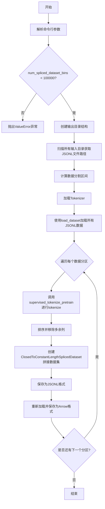

# `LLM4Decompile\train\colossalai_llm4decompile\prepare_pretrain_dataset.py` 详细设计文档

该脚本用于将多个JSONL数据文件进行分词、拼接和预处理，生成用于大语言模型持续预训练的数据集，支持JSONL和Arrow两种输出格式。

## 整体流程



## 类结构

```
Global
├── logger (全局日志对象)
└── main() (主函数)
External Dependencies
├── ClosedToConstantLengthSplicedDataset
│   └── from colossal_llama.dataset.spliced_and_tokenized_dataset
├── supervised_tokenize_pretrain
│   └── from colossal_llama.dataset.spliced_and_tokenized_dataset
├── dataset_dict.Dataset
│   └── from datasets
└── AutoTokenizer
    └── from transformers
```

## 全局变量及字段


### `logger`
    
ColossalAI框架提供的分布式日志记录器实例，用于在分布式训练环境中记录信息和调试消息

类型：`ColossalAILogger (分布式日志记录器对象)`
    


    

## 全局函数及方法


### `main`

该函数是持续预训练数据集准备脚本的入口点，负责加载JSONL格式的原始数据，使用指定分词器进行标记化处理，创建拼接数据集，并将处理后的数据以JSONL和Arrow格式保存到指定输出目录。

参数：该函数无直接参数，通过`argparse`从命令行接收以下参数

- `data_input_dirs`：`str`，逗号分隔的包含`.jsonl`数据文件的目录列表
- `tokenizer_dir`：`str`，分词器所在目录
- `data_output_dirs`：`str`，数据输出目录，默认为`data_output_dirs`
- `max_length`：`int`，每个拼接标记化序列的最大长度，默认为8192
- `num_spliced_dataset_bins`：`int`，拼接数据集分箱数量，默认为10

返回值：`None`，该函数无返回值，执行完成后直接退出

#### 流程图

```mermaid
flowchart TD
    A[开始] --> B[解析命令行参数]
    B --> C{验证num_spliced_dataset_bins < 100000}
    C -->|是| D[构建输出目录路径]
    C -->|否| Z[抛出ValueError异常]
    D --> E[创建cache/jsonl/arrow输出目录]
    E --> F[扫描输入目录获取所有.jsonl文件路径]
    F --> G[计算split_interval = ceil(100/num_spliced_dataset_bins)]
    G --> H[生成train splits列表]
    H --> I[加载分词器并配置pad_token]
    I --> J[使用load_dataset加载所有数据]
    J --> K{遍历每个数据集}
    K -->|循环体| L[对数据集进行tokenize处理]
    L --> M[移除不需要的列]
    M --> N[按seq_category和seq_length排序]
    N --> O[创建ClosedToConstantLengthSplicedDataset]
    O --> P[保存为JSONL格式]
    P --> Q[重新加载JSONL并保存为Arrow格式]
    Q --> K
    K -->|循环结束| R[结束]
    
    style Z fill:#ff9999
    style R fill:#99ff99
```

#### 带注释源码

```python
#!/usr/bin/env python3
# -*- coding: utf-8 -*-
"""
Prepare dataset for continual pre-training
用于持续预训练的数据集准备模块
"""

import argparse
import json
import math
import os
import time
from multiprocessing import cpu_count

# 从自定义模块导入数据集处理类和处理函数
from colossal_llama.dataset.spliced_and_tokenized_dataset import (
    ClosedToConstantLengthSplicedDataset,  # 闭合到常长度的拼接数据集类
    supervised_tokenize_pretrain,           # 监督预训练标记化处理函数
)
from datasets import dataset_dict, load_dataset  # HuggingFace数据集加载工具
from transformers import AutoTokenizer  # HuggingFace自动分词器

from colossalai.logging import get_dist_logger  # ColossalAI分布式日志记录器

logger = get_dist_logger()  # 初始化分布式日志记录器


def main():
    """
    主函数：执行持续预训练数据集的准备工作
    流程：参数解析 -> 目录创建 -> 数据加载 -> 标记化处理 -> 拼接数据集生成 -> 输出保存
    """
    # =============================================
    # 第一步：命令行参数解析
    # =============================================
    parser = argparse.ArgumentParser()
    parser.add_argument(
        "--data_input_dirs",
        type=str,
        required=True,
        default=None,
        help="Comma(i.e., ',') separated list of all data directories containing `.jsonl` data files.",
    )
    parser.add_argument(
        "--tokenizer_dir", type=str, required=True, default=None, help="A directory containing the tokenizer"
    )
    parser.add_argument("--data_output_dirs", type=str, default="data_output_dirs", help="Data output directory")
    parser.add_argument("--max_length", type=int, default=8192, help="Max length of each spliced tokenized sequence")
    parser.add_argument("--num_spliced_dataset_bins", type=int, default=10, help="Number of spliced dataset bins")
    args = parser.parse_args()

    # =============================================
    # 第二步：参数验证
    # =============================================
    # 验证拼接数据集分箱数量是否在合理范围内
    if args.num_spliced_dataset_bins >= 100000:
        raise ValueError("Too many spliced divisions, must be smaller than 100000")

    # =============================================
    # 第三步：构建输出目录结构
    # =============================================
    # 创建三级输出目录结构：cache/raw、jsonl、arrow
    args.data_cache_dir = os.path.join(args.data_output_dirs, "cache")
    args.data_jsonl_output_dir = os.path.join(args.data_output_dirs, "jsonl")
    args.data_arrow_output_dir = os.path.join(args.data_output_dirs, "arrow")

    # 确保输出目录存在，不存在则创建
    if not os.path.exists(args.data_cache_dir):
        os.makedirs(args.data_cache_dir)
    if not os.path.exists(args.data_jsonl_output_dir):
        os.makedirs(args.data_jsonl_output_dir)
    if not os.path.exists(args.data_arrow_output_dir):
        os.makedirs(args.data_arrow_output_dir)

    # =============================================
    # 第四步：扫描并收集所有输入数据文件路径
    # =============================================
    # Prepare to all input datasets
    input_data_paths = []
    input_data_dirs = args.data_input_dirs.split(",")  # 解析逗号分隔的输入目录
    for ds_dir in input_data_dirs:
        ds_dir = os.path.abspath(ds_dir)  # 转换为绝对路径
        # 验证目录存在
        assert os.path.exists(ds_dir), f"Not find data dir {ds_dir}"
        # 筛选所有.jsonl文件
        ds_files = [name for name in os.listdir(ds_dir) if name.endswith(".jsonl")]
        ds_paths = [os.path.join(ds_dir, name) for name in ds_files]
        input_data_paths.extend(ds_paths)

    # =============================================
    # 第五步：准备数据划分策略
    # =============================================
    # 将数据划分为多个训练切片，用于并行处理
    train_splits = []
    split_interval = math.ceil(100 / args.num_spliced_dataset_bins)  # 计算划分间隔
    for i in range(0, 100, split_interval):
        start = i
        end = i + split_interval
        if end > 100:
            end = 100
        train_splits.append(f"train[{start}%:{end}%]")

    # =============================================
    # 第六步：加载并配置分词器
    # =============================================
    # Prepare to the tokenizer.
    tokenizer = AutoTokenizer.from_pretrained(args.tokenizer_dir)
    tokenizer.add_bos_token = False  # 不自动添加BOS token
    tokenizer.add_eos_token = False  # 不自动添加EOS token
    # 确保pad_token存在，使用unk_token作为备选
    if tokenizer.pad_token is None:
        tokenizer.pad_token = tokenizer.unk_token

    # =============================================
    # 第七步：加载原始数据集并进行预处理
    # =============================================
    # 使用多进程并行加载所有jsonl文件
    list_dataset = load_dataset(
        path="json",
        data_files=input_data_paths,
        cache_dir=os.path.join(args.data_cache_dir, "raw"),
        keep_in_memory=False,
        split=train_splits,
        num_proc=cpu_count(),
    )
    
    # =============================================
    # 第八步：遍历处理每个数据切片
    # =============================================
    for index, dataset in enumerate(list_dataset):
        # 验证数据类型正确
        assert isinstance(dataset, dataset_dict.Dataset)
        logger.info(f"Start to process part-{index}/{len(list_dataset)} of all original datasets.")
        
        # 8.1 对数据集进行标记化处理
        dataset = dataset.map(
            function=supervised_tokenize_pretrain,
            fn_kwargs={"tokenizer": tokenizer, "max_length": args.max_length},
            keep_in_memory=False,
            num_proc=min(len(dataset), cpu_count()),
        )
        
        # 8.2 移除不需要的列
        dataset = dataset.remove_columns(column_names=["source", "target", "category"])
        
        # 8.3 按类别和长度排序
        dataset = dataset.sort(column_names=("seq_category", "seq_length"), reverse=False, keep_in_memory=False)
        
        # 8.4 移除排序辅助列
        dataset = dataset.remove_columns(column_names=["seq_category", "seq_length"])
        
        # 8.5 创建拼接数据集
        spliced_dataset = ClosedToConstantLengthSplicedDataset(
            dataset=dataset, tokenizer=tokenizer, max_length=args.max_length, error_strict=False
        )
        
        # =============================================
        // 第九步：保存JSONL格式输出
        // =============================================
        # 生成带补零序号的输出文件名
        output_index = "0" * (5 - len(str(index))) + str(index)
        output_name = f"part-{output_index}"
        output_jsonl_path = os.path.join(args.data_jsonl_output_dir, output_name + ".jsonl")
        
        st = time.time()  # 记录开始时间
        with open(file=output_jsonl_path, mode="w", encoding="utf-8") as fp_writer:
            spliced_count = 0
            # 遍历拼接数据集并写入JSONL文件
            for spliced_data_point in spliced_dataset:
                if spliced_count % 500 == 0:
                    logger.info(f"processing {spliced_count} spliced data points for {fp_writer.name}")
                spliced_count += 1
                fp_writer.write(json.dumps(spliced_data_point, ensure_ascii=False) + "\n")
        
        # 记录处理统计信息
        logger.info(
            f"Current file {fp_writer.name}; "
            f"Data size: {len(spliced_dataset)}; "
            f"Spliced data size: {spliced_dataset.current_size}; "
            f"Splicing compression rate: {round(spliced_dataset.current_size / len(spliced_dataset), 6)}; "
            f"Time cost: {round((time.time() - st) / 60, 6)} minutes."
        )

        # =============================================
        // 第十步：保存Arrow格式输出
        // =============================================
        # 重新加载JSONL并转换为Arrow格式进行高效存储
        output_arrow_path = os.path.join(args.data_arrow_output_dir, output_name)
        logger.info(f"Start to save {output_arrow_path}")
        spliced_dataset = load_dataset(
            path="json",
            data_files=[output_jsonl_path],
            cache_dir=os.path.join(args.data_cache_dir, "spliced_and_tokenized"),
            keep_in_memory=False,
            num_proc=cpu_count(),
            split="train",
        )
        # 使用多进程保存到磁盘
        spliced_dataset.save_to_disk(dataset_path=output_arrow_path, num_proc=min(len(spliced_dataset), cpu_count()))


if __name__ == "__main__":
    main()
```

## 关键组件


### 数据目录扫描与验证

扫描指定的数据输入目录，收集所有`.jsonl`格式的数据文件，并进行路径验证，确保数据源可用

### 数据集分割策略

将原始数据按百分比分割成多个训练集片段，用于后续的并行处理和拼接

### Tokenizer初始化与配置

加载预训练的tokenizer，并配置特殊token（bos_token和eos_token），确保pad_token正确设置

### 原始数据集加载

使用`load_dataset`从多个JSONL文件加载原始数据，支持多进程并行处理

### 数据集映射与预处理

对原始数据集应用`supervised_tokenize_pretrain`函数进行tokenize处理，控制最大序列长度

### 数据排序与列管理

根据`seq_category`和`seq_length`对数据集进行排序，移除不需要的列（source, target, category等）

### 拼接数据集构建

使用`ClosedToConstantLengthSplicedDataset`将处理后的数据按固定长度进行拼接和重组

### JSONL格式输出

将拼接后的数据集逐条写入JSONL文件，支持大文件流式写入

### Arrow格式转换与持久化

将JSONL数据重新加载为Arrow格式，并使用`save_to_disk`保存到磁盘，支持高效读取

### 日志记录系统

使用ColossalAI的分布式日志记录处理进度、数据大小、压缩率等信息

### 命令行参数解析

使用argparse定义和管理所有命令行参数，包括数据路径、tokenizer路径、输出目录和关键参数


## 问题及建议


### 已知问题

- **硬编码的数值（魔法数字）**: 代码中多处使用硬编码数值（如 `100`、`500`、`8192`、`100000`、`5`），缺乏有意义的常量定义，降低了可维护性和可读性。
- **参数定义矛盾**: `--data_input_dirs` 同时设置了 `required=True` 和 `default=None`，这两个配置互相矛盾，可能导致意外行为。
- **断言用于业务逻辑验证**: 使用 `assert` 语句验证数据目录存在性 (`assert os.path.exists(ds_dir)`) 和数据集类型 (`assert isinstance(dataset, dataset_dict.Dataset)`)，断言在 Python 中可被禁用，不适合用于生产环境的错误处理。
- **资源控制不足**: 使用 `cpu_count()` 进行多进程处理而未设置上限，可能导致 CPU 资源耗尽；在处理大型数据集时可能导致内存不足。
- **冗余的 I/O 操作**: 代码先将数据保存为 JSONL 格式，然后立即重新加载以转换为 Arrow 格式，这是多余的磁盘 I/O 操作，可以优化为直接转换。
- **不完整的 tokenizer 配置**: 直接设置 `tokenizer.add_bos_token = False` 和 `tokenizer.add_eos_token = False` 属性而非调用方法，且未验证 tokenizer 加载是否成功。
- **缺乏异常处理**: 整个数据处理流程缺少 try-except 块，任何文件读写、序列化或数据处理错误都可能导致程序崩溃且无法优雅恢复。
- **日志效率问题**: 使用字符串拼接构建日志消息（如 `f"processing {spliced_count} spliced data points for {fp_writer.name}"`），即使在日志级别不匹配时也会执行字符串格式化操作。
- **数据集长度计算不准确**: 在 `dataset.map()` 中使用 `num_proc=min(len(dataset), cpu_count())`，对于流式数据集 `len(dataset)` 可能不准确或触发不必要的数据加载。
- **缺乏类型提示**: 整个代码缺少函数参数和返回值的类型注解，不利于代码静态分析和 IDE 智能提示。

### 优化建议

- **提取常量**: 将所有魔法数字定义为模块级常量，并添加有意义的命名（如 `MAX_SPLICE_BINS = 100000`、`LOG_INTERVAL = 500` 等）。
- **修复参数定义**: 移除 `default=None` 或将 `required` 设为 `False`，确保参数定义一致。
- **使用异常处理替代断言**: 将断言替换为 `if...raise` 模式或自定义验证函数，确保关键错误在生产环境中被正确捕获和处理。
- **添加资源限制**: 引入配置参数控制最大并发进程数（如 `max_workers`），避免无条件占用所有 CPU 资源；考虑添加内存使用监控。
- **优化数据转换流程**: 移除中间 JSONL 文件保存步骤，直接使用 `datasets` 库的格式转换功能生成 Arrow 格式。
- **完善 tokenizer 配置**: 使用正确的方法配置 BOS/EOS token，并添加加载成功的验证逻辑。
- **添加完整异常处理**: 为文件操作、数据集加载、映射处理等关键步骤添加 try-except-finally 块，实现优雅的错误恢复和资源清理。
- **优化日志性能**: 使用日志格式化器或延迟求值，仅在日志级别匹配时执行字符串格式化操作。
- **改进数据集处理**: 在数据集映射前强制计算数据集长度，或使用 `num_proc` 参数的合理默认值（如 `os.cpu_count() // 2`）。
- **添加类型提示**: 为函数参数、返回值和变量添加类型注解，提升代码可读性和工具链支持。

## 其它


### 设计目标与约束

本脚本的设计目标是将多个JSONL格式的原始数据文件进行分词、处理和拼接，生成可用于大语言模型持续预训练的数据集。约束条件包括：输入数据必须为JSONL格式；输出数据支持JSONL和Arrow两种格式；最大分词长度默认为8192；拼接数据集的分箱数量必须小于100000。

### 错误处理与异常设计

代码中包含以下错误处理机制：1) 当num_spliced_dataset_bins >= 100000时抛出ValueError异常；2) 使用assert检查数据目录是否存在；3) 使用assert验证加载的数据集类型；4) 文件写入使用UTF-8编码防止中文乱码；5) 异常时通过logger记录详细错误信息。潜在的改进空间包括：添加文件读取失败的异常捕获、网络超时处理、磁盘空间不足检查等。

### 数据流与状态机

数据流处理流程：1) 读取阶段：加载JSONL原始数据到内存；2) 分词阶段：对每条数据进行tokenize预处理；3) 排序阶段：按seq_category和seq_length排序；4) 拼接阶段：使用ClosedToConstantLengthSplicedDataset进行定长拼接；5) 输出阶段：序列化为JSONL和Arrow格式保存。整个过程为单向流水线，无复杂状态机逻辑。

### 外部依赖与接口契约

主要依赖包括：colossal_llama.dataset.spliced_and_tokenized_dataset模块提供的ClosedToConstantLengthSplicedDataset和supervised_tokenize_pretrain；datasets库用于数据加载和处理；transformers库用于tokenizer加载。接口契约：输入为包含source、target、category字段的JSONL文件；输出为包含input_ids、attention_mask等标准NLP训练格式的JSONL和Arrow文件。

### 配置参数说明

关键配置参数包括：data_input_dirs（必需）- 逗号分隔的输入数据目录列表；tokenizer_dir（必需）- tokenizer模型目录；data_output_dirs - 输出根目录，默认为"data_output_dirs"；max_length - 最大序列长度，默认8192；num_spliced_dataset_bins - 拼接数据集分箱数，默认10。所有参数通过argparse解析。

### 性能考虑与优化建议

当前实现包含以下性能优化：1) 使用多进程cpu_count()并行处理数据；2) 使用keep_in_memory=False避免内存溢出；3) 每500条记录打印一次日志减少IO开销。优化建议：可考虑使用mmap加速大文件读取；可添加断点续传功能处理大规模数据；可实现增量处理避免重复计算；可添加数据验证阶段提前过滤无效数据。

### 安全性考虑

代码安全性措施：1) 使用os.path.abspath防止路径注入；2) 文件操作使用with语句确保资源释放；3) JSON序列化使用ensure_ascii=False支持中文。潜在安全风险：未对用户输入的路径进行严格校验；未对下载的tokenizer模型进行完整性验证；未对输出的jsonl文件大小进行限制。

### 使用示例

基本用法：python prepare_dataset.py --data_input_dirs /path/to/data1,/path/to/data2 --tokenizer_dir /path/to/tokenizer。完整示例：python prepare_dataset.py --data_input_dirs ./data/train --tokenizer_dir ./tokenizer --data_output_dirs ./output --max_length 4096 --num_spliced_dataset_bins 20。输出会在data_output_dirs下生成cache、jsonl、arrow三个子目录。

### 维护建议

代码维护建议：1) 将硬编码的数值（如500、100）提取为配置常量；2) 添加类型注解提高代码可读性；3) 将main函数中的逻辑拆分为独立的处理函数便于单元测试；4) 添加完整的docstring说明函数用途；5) 考虑使用dataclass或TypedDict定义数据结构；6) 添加版本号管理便于追踪变更。

    