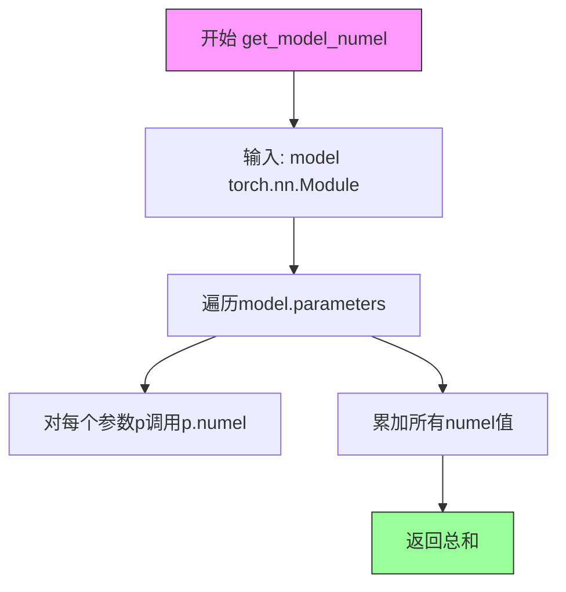
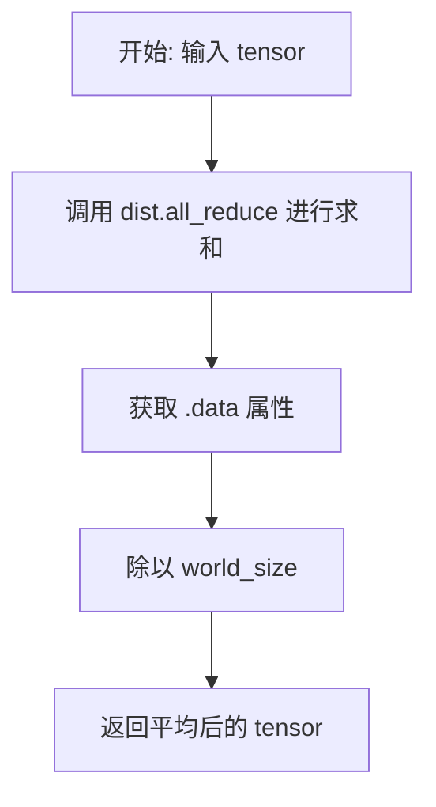
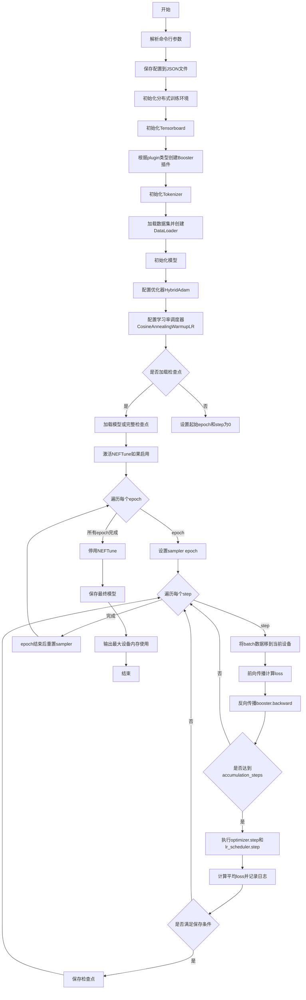

# `LLM4Decompile\train\colossalai_llm4decompile\train.py` 详细设计文档

这是一个用于 Colossal-LLaMA-2 模型的持续预训练/监督微调分布式训练脚本，支持多种训练插件（Gemini、Zero2、HybridParallel）、混合精度训练、梯度检查点、Flash Attention、NEFTune 等高级特性，并集成了检查点保存和 TensorBoard 日志记录功能。

## 整体流程

```mermaid
graph TD
A[开始] --> B[解析命令行参数]
B --> C[保存配置到 JSON 文件]
C --> D[启动分布式训练环境 colossalai.launch_from_torch]
D --> E[初始化 Accelerator 和 DistCoordinator]
E --> F{是否是 Master 节点?}
F -- 是 --> G[创建 TensorBoard SummaryWriter]
F -- 否 --> H[跳过 TensorBoard 初始化]
G --> I
H --> I[选择并初始化训练插件]
I --> J[初始化 Booster]
J --> K[加载 Tokenizer 并配置 pad_token]
K --> L[加载数据集 load_tokenized_dataset]
L --> M[创建 DataCollator 和 DataLoader]
M --> N[初始化模型 AutoModelForCausalLM]
N --> O{是否 freeze_non_embeds_params?}
O -- 是 --> P[调用 freeze_non_embeds_parameters]
O -- 否 --> Q[继续]
P --> Q
Q --> R[启用梯度检查点 use_grad_checkpoint]
R --> S[初始化优化器 HybridAdam]
S --> T[初始化学习率调度器 CosineAnnealingWarmupLR]
T --> U[调用 booster.boost 封装模型/优化器/数据加载器]
U --> V{是否需要加载检查点?}
V -- 是 --> W[load_checkpoint 恢复训练状态]
V -- 否 --> X[设置起始 epoch=0, step=0]
W --> Y
X --> Y[是否启用 NEFTune?]
Y -- 是 --> Z[activate_neftune 激活 NEFTune]
Y -- 否 --> AA[进入训练循环]
Z --> AA
AA --> AB[外层循环: 遍历每个 epoch]
AB --> AC[设置 sampler epoch]
AC --> AD[内层循环: 遍历每个 batch]
AD --> AE[将数据移动到当前设备]
AE --> AF[前向传播 model(**batch)]
AF --> AG[计算 loss 并进行梯度累积]
AG --> AH[booster.backward 反向传播]
AH --> AI{是否达到累积步数?}
AI -- 是 --> AJ[optimizer.step 优化器更新]
AI -- 否 --> AD
AJ --> AK[lr_scheduler.step 学习率更新]
AK --> AL[optimizer.zero_grad 梯度清零]
AL --> AM[all_reduce_mean 汇总 loss]
AM --> AN[更新 TensorBoard 日志]
AN --> AO{是否达到保存间隔?}
AO -- 是 --> AP[保存检查点 save_checkpoint]
AO -- 否 --> AQ[继续训练]
AP --> AQ
AQ --> AR{是否还有更多 batch?}
AR -- 是 --> AD
AR -- 否 --> AS[进入下一个 epoch]
AS --> AT{是否还有更多 epoch?}
AT -- 是 --> AB
AT -- 否 --> AU[训练结束]
AU --> AV[保存最终模型 booster.save_model]
```

## 类结构

```
无自定义类 - 纯过程式训练脚本
主要依赖第三方库:
├── transformers (AutoTokenizer, AutoModelForCausalLM)
├── colossalai (Booster, Plugin, LR Scheduler, Optimizer)
├── colossal_llama.dataset.loader (DataCollator, Sampler, load_tokenized_dataset)
├── colossal_llama.utils (ckpt_io, froze, neftune_patch)
└── torch, torch.distributed, tensorboard
```

## 全局变量及字段


### `args`
    
命令行参数集合，包含所有训练配置选项

类型：`argparse.Namespace`
    


### `accelerator`
    
ColossalAI 训练加速器实例，用于管理设备内存和计算

类型：`Accelerator`
    


### `coordinator`
    
分布式协调器，用于协调多进程训练和日志输出

类型：`DistCoordinator`
    


### `writer`
    
TensorBoard 写入器，用于记录训练指标

类型：`SummaryWriter`
    


### `plugin`
    
训练插件，支持 Gemini/Zero2/HybridParallel 策略

类型：`BoosterPlugin`
    


### `booster`
    
ColossalAI 训练加速器，管理模型、优化器和数据加载器的分布式训练

类型：`Booster`
    


### `tokenizer`
    
分词器，用于对文本进行 token 化处理

类型：`AutoTokenizer`
    


### `dataset`
    
训练数据集，加载后的 tokenized 数据集

类型：`Dataset`
    


### `data_collator`
    
数据整理器，用于批处理和填充序列

类型：`DataCollatorForSupervisedDataset`
    


### `dataloader`
    
数据加载器，按批次提供训练数据

类型：`DataLoader`
    


### `model`
    
因果语言模型，用于 next token prediction 训练

类型：`AutoModelForCausalLM`
    


### `optimizer`
    
混合 Adam 优化器，用于更新模型参数

类型：`HybridAdam`
    


### `lr_scheduler`
    
带 warmup 的余弦退火学习率调度器

类型：`CosineAnnealingWarmupLR`
    


### `num_steps_per_epoch`
    
每个 epoch 包含的训练步数

类型：`int`
    


### `start_epoch`
    
恢复训练时的起始 epoch 编号

类型：`int`
    


### `start_step`
    
恢复训练时的起始 step 编号

类型：`int`
    


### `sampler_start_idx`
    
分布式采样器的起始索引，用于断点续训

类型：`int`
    


### `total_loss`
    
累积的损失值，用于计算平均 loss 和日志记录

类型：`torch.Tensor`
    


    

## 全局函数及方法


### `get_model_numel`

计算PyTorch模型的参数总数，通过遍历模型的所有参数并对每个参数的元素数量求和得到。

参数：

- `model`：`torch.nn.Module`，待计算参数的PyTorch模型实例

返回值：`int`，模型中所有参数的总元素个数

#### 流程图



#### 带注释源码

```python
def get_model_numel(model: torch.nn.Module) -> int:
    """
    计算PyTorch模型的参数总数
    
    参数:
        model: torch.nn.Module - PyTorch模型实例
        
    返回值:
        int - 模型所有参数的元素个数总和
    """
    # 使用生成器表达式遍历模型的所有参数
    # model.parameters() 返回模型中所有可训练/不可训练参数的迭代器
    # p.numel() 返回参数p中元素的个数（等价于p.numel() = p.numel()）
    # sum() 对所有参数的numel进行求和
    return sum(p.numel() for p in model.parameters())
```


### `format_numel_str`

该函数用于将模型参数数量（整数）格式化为人类可读的字符串表示，根据数值大小自动选择合适的单位（十亿B、百万M、千K），便于在训练过程中直观展示模型规模。

参数：

- `numel`：`int`，表示模型参数的数量（Number of elements）

返回值：`str`，返回格式化后的参数字符串，例如 "1.25 B"、"256.00 M" 或 "1024.00 K"

#### 流程图

```mermaid
flowchart TD
    A[开始: 输入 numel] --> B{numel >= 1024³?}
    B -- 是 --> C[返回 f&quot;{numel / 1024³:.2f} B&quot;]
    B -- 否 --> D{numel >= 1024²?}
    D -- 是 --> E[返回 f&quot;{numel / 1024²:.2f} M&quot;]
    D -- 否 --> F{numel >= 1024?}
    F -- 是 --> G[返回 f&quot;{numel / 1024:.2f} K&quot;]
    F -- 否 --> H[返回 f&quot;{numel}&quot;]
    C --> I[结束]
    E --> I
    G --> I
    H --> I
```

#### 带注释源码

```python
def format_numel_str(numel: int) -> str:
    """
    将参数数量格式化为人类可读的字符串
    
    参数:
        numel: 模型参数数量
    
    返回:
        格式化后的字符串，自动选择合适的单位
    """
    # 定义二进制单位: B=GB, M=MB, K=KB
    B = 1024**3  # 1073741824, 十亿
    M = 1024**2  # 1048576, 百万
    K = 1024     # 1024, 千
    
    # 根据数量级选择合适的单位
    if numel >= B:
        # 超过十亿参数, 使用 B (Billion) 单位
        return f"{numel / B:.2f} B"
    elif numel >= M:
        # 超过百万参数, 使用 M (Million) 单位
        return f"{numel / M:.2f} M"
    elif numel >= K:
        # 超过千参数, 使用 K (Kilo) 单位
        return f"{numel / K:.2f} K"
    else:
        # 小于1024, 直接返回原始数字
        return f"{numel}"
```

---

### 关键组件信息

| 组件名称 | 一句话描述 |
|---------|-----------|
| `format_numel_str` | 将整数参数数量转换为人类可读字符串的格式化函数 |
| `get_model_numel` | 计算PyTorch模型总参数量（调用了此函数的上下文） |

---

### 潜在技术债务或优化空间

1. **硬编码的单位阈值**：当前使用固定的1024³、1024²、1024阈值，如果需要支持更大的数量级（如T级别）需要扩展
2. **精度固定为两位小数**：`.2f` 固定了两位小数，对于某些场景可能需要可配置的精度
3. **缺少国际化支持**：当前仅返回英文单位符号，未考虑其他语言环境
4. **未处理负数或零**：函数未对 `numel <= 0` 的边界情况进行特殊处理

---

### 其他项目

**设计目标与约束：**
- 目标：简化模型参数数量的可视化输出，便于人类阅读
- 约束：输入必须为非负整数，返回值格式必须包含单位后缀（B/M/K）或纯数字

**错误处理与异常设计：**
- 当前函数未进行输入校验，若传入负数会返回负数值的字符串表示
- 若传入非整数类型，可能触发异常或产生非预期结果

**数据流与状态机：**
- 此函数为纯函数，无状态，无副作用
- 数据流：`main()` → `get_model_numel(model)` → `format_numel_str(model_numel)` → 日志输出

**外部依赖与接口契约：**
- 依赖Python内置的幂运算符 `**` 和字符串格式化 f-string
- 被 `main()` 函数中用于打印模型参数量信息


### `all_reduce_mean`

该函数用于在分布式训练环境中对各个进程的 tensor 进行平均汇总。它首先通过 `all_reduce` 操作将所有进程的 tensor 求和，然后除以进程总数得到平均值，常用于跨进程的损失值同步。

参数：

- `tensor`：`torch.Tensor`，待平均的 tensor，通常是当前进程计算得到的损失值或其他需要同步的标量/张量

返回值：`torch.Tensor`，返回经过跨进程平均后的 tensor，其值代表所有进程上对应 tensor 的平均值

#### 流程图



#### 带注释源码

```python
def all_reduce_mean(tensor: torch.Tensor) -> torch.Tensor:
    """
    在分布式训练中对 tensor 进行平均汇总。
    
    该函数执行两步操作：
    1. 使用 all_reduce (SUM) 将所有进程的 tensor 求和
    2. 除以进程数量得到平均值
    
    参数:
        tensor: 需要跨进程平均的 tensor
        
    返回:
        平均后的 tensor
    """
    # 步骤1: 对所有进程中的 tensor 进行求和
    # all_reduce 会将每个进程的 tensor 相加，结果同步到所有进程
    dist.all_reduce(tensor=tensor, op=dist.ReduceOp.SUM)
    
    # 获取 tensor 的底层数据，忽略任何梯度或计算图
    tensor = tensor.data
    
    # 步骤2: 除以进程总数得到平均值
    tensor.div_(dist.get_world_size())
    
    # 返回平均后的 tensor
    return tensor
```


### `main`

这是 Colossal-LLaMA-2 模型的持续预训练/监督微调主函数，负责初始化分布式训练环境、加载数据集和模型、配置优化器和学习率调度器，并执行多轮训练循环，同时支持检查点保存和恢复。

参数：
- 无直接参数，通过 `argparse` 从命令行接收以下参数：
  - `pretrained`：预训练模型地址
  - `dataset`：数据集路径列表
  - `plugin`：插件类型（gemini/gemini_auto/zero2/zero2_cpu/3d）
  - `load_checkpoint`：检查点路径
  - `save_interval`：保存间隔
  - `save_dir`：保存目录
  - `tensorboard_dir`：日志目录
  - `config_file`：配置文件
  - `num_epochs`：训练轮数
  - `accumulation_steps`：梯度累积步数
  - `micro_batch_size`：微批次大小
  - `lr`：学习率
  - `max_length`：最大长度
  - `mixed_precision`：混合精度（fp16/bf16）
  - `grad_clip`：梯度裁剪值
  - `weight_decay`：权重衰减
  - `warmup_steps`：预热步数
  - `use_grad_checkpoint`：使用梯度检查点
  - `use_flash_attn`：使用Flash Attention
  - `use_neft`：使用NEFTune
  - `freeze_non_embeds_params`：冻结非嵌入参数
  - `tp`：张量并行度
  - `zero`：Zero优化器阶段
  - `pad_token`：填充token
  - `padding_mode`：填充模式

返回值：`None`，无返回值，执行训练流程后结束。

#### 流程图



#### 带注释源码

```python
def main() -> None:
    # ======================================================
    # 1. 解析命令行参数
    # ======================================================
    parser = argparse.ArgumentParser()
    # 添加各种训练参数：模型路径、数据集、插件类型、学习率等
    parser.add_argument("--pretrained", type=str, default=None, help="预训练模型地址")
    parser.add_argument("--dataset", nargs="+", default=[], help="数据集路径列表")
    parser.add_argument("--plugin", type=str, default="gemini", choices=["gemini", "gemini_auto", "zero2", "zero2_cpu", "3d"], help="选择使用的插件")
    parser.add_argument("--load_checkpoint", type=str, default=None, help="加载检查点路径")
    parser.add_argument("--save_interval", type=int, default=1000, help="保存间隔")
    parser.add_argument("--save_dir", type=str, default="checkpoint_dir", help="检查点保存目录")
    parser.add_argument("--tensorboard_dir", type=str, default="logs_dir", help="Tensorboard日志目录")
    parser.add_argument("--config_file", type=str, default="config_file", help="配置文件")
    parser.add_argument("--num_epochs", type=int, default=1, help="训练轮数")
    parser.add_argument("--accumulation_steps", type=int, default=1, help="梯度累积步数")
    parser.add_argument("--micro_batch_size", type=int, default=2, help="每个进程的批次大小")
    parser.add_argument("--lr", type=float, default=3e-4, help="学习率")
    parser.add_argument("--max_length", type=int, default=8192, help="模型最大长度")
    parser.add_argument("--mixed_precision", type=str, default="fp16", choices=["fp16", "bf16"], help="混合精度")
    parser.add_argument("--grad_clip", type=float, default=1.0, help="梯度裁剪值")
    parser.add_argument("--weight_decay", type=float, default=0.1, help="权重衰减")
    parser.add_argument("--warmup_steps", type=int, default=None, help="预热步数")
    parser.add_argument("--use_grad_checkpoint", action="store_true", default=False, help="使用梯度检查点")
    parser.add_argument("--use_flash_attn", action="store_true", default=False, help="使用flash-attention")
    parser.add_argument("--use_neft", action="store_true", default=False, help="使用NEFTune")
    parser.add_argument("--freeze_non_embeds_params", action="store_true", default=False, help="冻结非嵌入参数")
    parser.add_argument("--tp", type=int, default=1, help="张量并行度")
    parser.add_argument("--zero", type=int, default=1, help="Zero优化器阶段")
    parser.add_argument("--pad_token", choices=["eos", "unk"], default="eos", help="填充token")
    parser.add_argument("--padding_mode", choices=["max_length", "longest"], default="max_length", help="填充模式")
    args = parser.parse_args()

    # 将配置参数保存到JSON文件
    with open(args.config_file, "w") as f:
        json.dump(args.__dict__, f, indent=4)

    # ======================================================
    # 2. 初始化分布式训练环境
    # ======================================================
    # 使用Colossal-AI启动分布式训练
    colossalai.launch_from_torch(args.config_file)
    accelerator = get_accelerator()  # 获取加速器
    coordinator = DistCoordinator()  # 分布式协调器

    # ======================================================
    # 3. 初始化Tensorboard
    # ======================================================
    if coordinator.is_master():
        os.makedirs(args.tensorboard_dir, exist_ok=True)
        writer = SummaryWriter(args.tensorboard_dir)

    # ======================================================
    # 4. 初始化Booster插件
    # ======================================================
    # 根据plugin参数选择不同的插件类型
    if args.plugin == "gemini":
        plugin = GeminiPlugin(
            precision=args.mixed_precision,
            initial_scale=2**16,
            max_norm=args.grad_clip,
            enable_gradient_accumulation=(args.accumulation_steps > 1),
        )
    elif args.plugin == "gemini_auto":
        plugin = GeminiPlugin(
            precision=args.mixed_precision,
            placement_policy="auto",
            initial_scale=2**16,
            max_norm=args.grad_clip,
            enable_gradient_accumulation=(args.accumulation_steps > 1),
        )
    elif args.plugin == "zero2":
        plugin = LowLevelZeroPlugin(
            stage=2,
            precision=args.mixed_precision,
            initial_scale=2**16,
            max_norm=args.grad_clip,
        )
    elif args.plugin == "zero2_cpu":
        plugin = LowLevelZeroPlugin(
            stage=2,
            precision=args.mixed_precision,
            initial_scale=2**16,
            cpu_offload=True,
            max_norm=args.grad_clip,
        )
    elif args.plugin == "3d":
        plugin = HybridParallelPlugin(
            tp_size=args.tp,
            pp_size=1,
            zero_stage=args.zero,
            max_norm=args.grad_clip,
            precision=args.mixed_precision,
        )
    else:
        raise ValueError(f"Unknown plugin {args.plugin}")

    booster = Booster(plugin=plugin)

    # ======================================================
    # 5. 初始化Tokenizer、数据集、Collator和DataLoader
    # ======================================================
    # 加载预训练模型的tokenizer
    tokenizer = AutoTokenizer.from_pretrained(args.pretrained)
    # 设置pad_token
    if args.pad_token == "eos":
        tokenizer.pad_token = tokenizer.eos_token
    elif args.pad_token == "unk":
        tokenizer.pad_token = tokenizer.unk_token
    tokenizer.add_bos_token = False
    tokenizer.add_eos_token = False

    # 打印配置信息
    coordinator.print_on_master(f"Configuration file will be saved at: {args.config_file}")
    coordinator.print_on_master(f"Tensorboard logs will be saved at: {args.tensorboard_dir}")
    coordinator.print_on_master(f"Model checkpoint will be saved at: {args.save_dir}")
    coordinator.print_on_master(f"Load dataset: {args.dataset}")

    # 加载tokenized数据集
    dataset = load_tokenized_dataset(dataset_paths=args.dataset, mode="train")
    coordinator.print_on_master(f"Dataset loaded with {len(dataset)} samples")

    # 创建数据整理器
    data_collator = DataCollatorForSupervisedDataset(
        tokenizer=tokenizer, max_length=args.max_length, padding=args.padding_mode
    )
    # 准备DataLoader
    dataloader = plugin.prepare_dataloader(
        dataset=dataset,
        batch_size=args.micro_batch_size,
        shuffle=True,
        drop_last=True,
        collate_fn=data_collator,
        distributed_sampler_cls=StatefulDistributedSampler,
    )
    coordinator.print_on_master(
        f"Max device memory after data loader: {accelerator.max_memory_allocated() / 1024 ** 2:.2f} MB"
    )

    # ======================================================
    # 6. 初始化模型、目标函数、优化器和学习率调度器
    # ======================================================
    # 使用LazyInitContext进行延迟初始化（适用于Gemini和HybridParallel插件）
    init_ctx = (
        LazyInitContext(default_device=get_current_device())
        if isinstance(plugin, (GeminiPlugin, HybridParallelPlugin))
        else nullcontext()
    )
    with init_ctx:
        if args.use_flash_attn:
            # 使用Flash Attention加载模型
            model = AutoModelForCausalLM.from_pretrained(args.pretrained, attn_implementation="flash_attention_2")
        else:
            model = LlamaForCausalLM.from_pretrained(args.pretrained)
        # 如果启用，冻结非嵌入参数
        if args.freeze_non_embeds_params:
            freeze_non_embeds_parameters(model=model)
    # 设置模型为训练模式（关键步骤，否则梯度检查点不工作）
    model.train()

    # 启用梯度检查点
    if args.use_grad_checkpoint:
        model.gradient_checkpointing_enable()
        coordinator.print_on_master(msg="Gradient checkpointing enabled successfully")
    if args.use_flash_attn:
        coordinator.print_on_master(msg="Flash-attention enabled successfully")

    # 获取模型参数数量
    model_numel = get_model_numel(model)
    coordinator.print_on_master(f"Model params: {format_numel_str(model_numel)}")

    # 创建HybridAdam优化器
    optimizer = HybridAdam(
        model_params=(
            filter(lambda p: p.requires_grad, model.parameters())
            if args.freeze_non_embeds_params
            else model.parameters()
        ),
        lr=args.lr,
        betas=(0.9, 0.95),
        weight_decay=args.weight_decay,
        adamw_mode=True,
    )

    # 如果未指定warmup_steps，自动计算
    if args.warmup_steps is None:
        args.warmup_steps = int(args.num_epochs * 0.025 * (len(dataloader) // args.accumulation_steps))
        coordinator.print_on_master(f"Warmup steps is set to {args.warmup_steps}")

    # 创建余弦预热学习率调度器
    lr_scheduler = CosineAnnealingWarmupLR(
        optimizer=optimizer,
        total_steps=args.num_epochs * (len(dataloader) // args.accumulation_steps),
        warmup_steps=args.warmup_steps,
        eta_min=0.1 * args.lr,
    )

    # Flash attention不支持fp32，设置默认精度
    default_dtype = torch.float16 if args.mixed_precision == "fp16" else torch.bfloat16
    torch.set_default_dtype(default_dtype)
    # 使用Booster封装模型、优化器、数据加载器和调度器
    model, optimizer, _, dataloader, lr_scheduler = booster.boost(
        model=model,
        optimizer=optimizer,
        lr_scheduler=lr_scheduler,
        dataloader=dataloader,
    )

    torch.set_default_dtype(torch.float)

    coordinator.print_on_master(
        f"Booster init max device memory: {accelerator.max_memory_allocated() / 1024 ** 2:.2f} MB"
    )
    coordinator.print_on_master(
        f"Booster init max CPU memory: {resource.getrusage(resource.RUSAGE_SELF).ru_maxrss / 1024:.2f} MB"
    )

    # 初始化训练起始状态
    start_epoch = 0
    start_step = 0
    sampler_start_idx = 0
    
    # ======================================================
    # 7. 加载检查点（如有）
    # ======================================================
    if args.load_checkpoint is not None:
        if "modeling" in args.load_checkpoint:
            # 仅加载模型权重
            coordinator.print_on_master(f"Continued pretrain from checkpoint {args.load_checkpoint}")
            booster.load_model(model, args.load_checkpoint)
        else:
            # 加载完整检查点（模型+优化器+调度器+状态）
            coordinator.print_on_master(f"Load model checkpoint from {args.load_checkpoint}")
            start_epoch, start_step, sampler_start_idx = load_checkpoint(
                load_dir=args.load_checkpoint,
                booster=booster,
                model=model,
                optimizer=optimizer,
                lr_scheduler=lr_scheduler,
            )
            coordinator.print_on_master(
                f"Loaded checkpoint {args.load_checkpoint} at epoch {start_epoch} step {start_step}"
            )
            coordinator.print_on_master(f"Loaded sample at index {sampler_start_idx}")

        coordinator.print_on_master(
            f"Checkpoint loaded max device memory: {accelerator.max_memory_allocated() / 1024 ** 2:.2f} MB"
        )
        coordinator.print_on_master(
            f"Checkpoint loaded device memory: {accelerator.memory_allocated() / 1024 ** 2:.2f} MB"
        )
        coordinator.print_on_master(
            f"Checkpoint loaded max CPU memory: {resource.getrusage(resource.RUSAGE_SELF).ru_maxrss / 1024:.2f} MB"
        )

    # 激活NEFTune（如启用）
    if args.use_neft:
        coordinator.print_on_master("Activate NEFTune.")
        model, handle = activate_neftune(model)

    num_steps_per_epoch = len(dataloader) // args.accumulation_steps
    # 如果恢复训练，设置sampler的起始索引
    assert isinstance(dataloader.sampler, StatefulDistributedSampler)
    dataloader.sampler.set_start_index(start_index=sampler_start_idx)

    # ======================================================
    # 8. 训练循环
    # ======================================================
    for epoch in range(start_epoch, args.num_epochs):
        dataloader.sampler.set_epoch(epoch=epoch)
        # 创建进度条
        pbar = tqdm(
            desc=f"Epoch {epoch}",
            disable=not coordinator.is_master(),
            total=num_steps_per_epoch,
            initial=start_step // args.accumulation_steps,
        )
        total_loss = torch.tensor(0.0, device=get_current_device())
        
        # 遍历数据加载器
        for step, batch in enumerate(dataloader, start=start_step):
            # 将batch中的tensor移到当前设备
            batch = {k: v.to(get_current_device()) for k, v in batch.items() if isinstance(v, torch.Tensor)}

            # 前向传播
            batch_output = model(**batch)

            # 计算loss并除以累积步数
            loss = batch_output.loss / args.accumulation_steps
            total_loss.add_(loss.data)

            # 反向传播
            booster.backward(loss=loss, optimizer=optimizer)

            # 达到累积步数时执行优化器步骤
            if (step + 1) % args.accumulation_steps == 0:
                optimizer.step()
                lr_scheduler.step()
                optimizer.zero_grad()

                # 计算平均loss（跨进程）
                all_reduce_mean(tensor=total_loss)
                pbar.set_postfix({"Loss": f"{total_loss.item():.4f}"})
                
                # 主进程记录日志
                if coordinator.is_master():
                    global_step = (epoch * num_steps_per_epoch) + (step + 1) // args.accumulation_steps
                    writer.add_scalar(tag="Loss", scalar_value=total_loss.item(), global_step=global_step)
                    writer.add_scalar(
                        tag="Learning Rate",
                        scalar_value=lr_scheduler.get_last_lr()[0],
                        global_step=global_step,
                    )
                total_loss.fill_(0.0)
                pbar.update()
            
            # ======================================================
            # 9. 检查点保存
            # ======================================================
            if (args.save_interval > 0 and (step + 1) % (args.save_interval * args.accumulation_steps) == 0) or (
                step + 1
            ) == len(dataloader):
                coordinator.print_on_master("\nStart saving model checkpoint with running states")

                # 保存前停用NEFTune
                if args.use_neft:
                    coordinator.print_on_master("Deactivate NEFTune before saving model.")
                    deactivate_neftune(model, handle)

                # 清理缓存
                accelerator.empty_cache()
                # 保存检查点
                save_checkpoint(
                    save_dir=args.save_dir,
                    booster=booster,
                    model=model,
                    optimizer=optimizer,
                    lr_scheduler=lr_scheduler,
                    epoch=epoch,
                    step=step + 1,
                    batch_size=args.micro_batch_size,
                    coordinator=coordinator,
                )
                coordinator.print_on_master(
                    f"Saved checkpoint at epoch {epoch} step {step + 1} at folder {args.save_dir}"
                )

                # 保存后重新激活NEFTune
                if args.use_neft:
                    coordinator.print_on_master("Activate NEFTune.")
                    model, handle = activate_neftune(model)

            # 清理缓存
            accelerator.empty_cache()

        # 每个epoch结束后重置sampler起始索引和step
        dataloader.sampler.set_start_index(start_index=0)
        start_step = 0

    # 训练结束，停用NEFTune
    if args.use_neft:
        coordinator.print_on_master("Deactivate NEFTune.")
        deactivate_neftune(model, handle)

    # ======================================================
    # 10. 保存最终模型
    # ======================================================
    coordinator.print_on_master("Start saving final model checkpoint")
    booster.save_model(model, os.path.join(args.save_dir, "modeling"), shard=True)
    coordinator.print_on_master(f"Saved final model checkpoint at epoch {epoch} at folder {args.save_dir}")

    # 输出最大设备内存使用情况
    coordinator.print_on_master(f"Max device memory usage: {accelerator.max_memory_allocated()/1024**2:.2f} MB")
```

## 关键组件


### 张量索引与惰性加载

使用ColossalAI的LazyInitContext实现惰性初始化，避免在初始化阶段过度占用显存，特别适用于大规模模型的分布式训练场景。

### 反量化支持

通过混合精度训练（fp16/bf16）配置，配合ColossalAI的Booster和Plugin系统，实现模型参数的反量化处理，支持从高精度到低精度的动态转换。

### 量化策略

基于插件的混合精度策略，支持Gemini、Zero2、HybridParallel等多种分布式训练插件，每种插件可配置不同的精度（fp16/bf16）和优化策略。

### 分布式采样器

使用StatefulDistributedSampler实现可恢复的分布式数据采样，支持训练中断后的精确恢复，保持数据加载的一致性。

### 梯度检查点

通过model.gradient_checkpointing_enable()实现梯度检查点技术，以计算换显存，支持长序列模型的训练。

### NEFTune噪声嵌入微调

使用activate_neftune和deactivate_neftune函数实现NEFTune技术，在训练过程中注入噪声嵌入以提升模型性能。

### Flash Attention加速

通过attn_implementation="flash_attention_2"启用Flash Attention 2，大幅提升注意力计算效率，降低显存占用。

### 检查点管理

集成load_checkpoint和save_checkpoint函数，实现模型、优化器、学习率调度器等完整状态的保存与恢复，支持分布式训练环境下的检查点管理。


## 问题及建议


### 已知问题

-   **类型导入错误**：第206行使用了 `LlamaForCausalLM`，但第40行仅导入了 `AutoModelForCausalLM`，这会导致运行时错误，应统一使用 `AutoModelForCausalLM`。
-   **配置覆盖风险**：第123-124行在训练开始后打开 `config_file` 进行写入操作，可能覆盖原始配置文件，且 `args.config_file` 作为配置文件路径语义不清晰。
-   **缺少异常处理**：模型加载、数据集加载、checkpoint加载等关键操作均未进行异常捕获与处理，文件不存在或损坏时会导致程序直接崩溃。
-   **硬编码超参数**：第239行学习率beta参数 `(0.9, 0.95)` 和第245行最小学习率 `eta_min=0.1 * args.lr` 硬编码，缺乏灵活性。
-   **监控指标不足**：仅记录了 Loss 和 Learning Rate，缺少梯度范数、GPU内存使用率、训练速度等关键指标，不利于问题诊断和性能分析。
-   **分布式验证缺失**：没有实现分布式验证流程，无法在训练过程中评估模型在验证集上的性能。
-   **数据完整性未验证**：未对加载的数据集进行有效性检查（如空样本、异常token等），可能导致训练异常。
-   **资源清理不彻底**：虽然调用了 `accelerator.empty_cache()`，但未在关键阶段（如epoch结束）进行更彻底的内存释放。

### 优化建议

-   统一使用 `AutoModelForCausalLM.from_pretrained()` 替代 `LlamaForCausalLM`，或确保正确导入 `LlamaForCausalLM`。
-   将配置保存逻辑移至训练开始前，并使用独立的配置文件路径（如 `args.output_dir/config.json`），避免覆盖输入配置。
-   为关键操作（模型加载、数据集加载、checkpoint保存/加载）添加 try-except 异常处理，并提供有意义的错误信息。
-   将 beta 参数、最小学习率等超参数暴露为命令行选项，或使用配置文件管理。
-   增加更多监控指标：梯度范数（`torch.nn.utils.clip_grad_norm_` 返回值）、GPU显存使用、训练样本/秒、数据加载时间等。
-   实现分布式验证流程，在训练过程中定期评估验证集性能，支持早停（Early Stopping）策略。
-   在数据加载后添加数据验证逻辑，检查样本数量、token长度分布等，并在异常时发出警告。
-   在每个 epoch 结束后和关键阶段增加更积极的内存清理策略，考虑使用 `torch.cuda.synchronize()` 确保GPU操作完成后再释放内存。

## 其它


### 设计目标与约束

本代码旨在实现Colossal-LLaMA-2大语言模型的持续预训练（Continual Pre-training）和监督微调（Supervised Fine-tuning）。核心设计目标包括：支持大规模分布式训练，提供多种训练策略插件（Gemini、Zero2、HybridParallel），支持梯度检查点、Flash Attention、NEFTune等高级优化技术，实现高效的检查点保存与恢复，以及支持断点续训功能。约束条件包括：需要Python 3.x环境，需安装colossalai、transformers、torch等依赖库，需支持分布式训练环境（多GPU或多节点）。

### 错误处理与异常设计

代码主要通过以下方式进行错误处理：插件选择使用`raise ValueError`处理未知插件类型；检查点加载使用条件判断处理不同类型的检查点（仅模型或完整检查点）；分布式训练协调使用`coordinator.is_master()`确保只在主节点执行特定操作；训练循环中使用`assert`确保数据采样器类型正确；异常情况下通过`try-except`（隐式）处理可能的CUDA内存溢出。此外，代码在关键操作（如保存模型、加载检查点）前后打印日志，便于追踪问题。

### 数据流与状态机

数据流主要经历以下阶段：首先通过`load_tokenized_dataset`加载并分词数据集，然后使用`DataCollatorForSupervisedDataset`进行数据整理和填充，接着通过`plugin.prepare_dataloader`创建分布式数据加载器，训练循环中从dataloader获取batch，模型执行前向传播计算loss，反向传播使用`booster.backward`，参数更新使用`optimizer.step`，学习率使用`lr_scheduler.step`调整。状态机主要体现在：训练状态（训练中/评估中）、检查点保存状态、NEFTune激活/停用状态、分布式采样器的epoch和start_index状态。

### 外部依赖与接口契约

主要外部依赖包括：`colossalai`框架（分布式训练核心）、`transformers`库（模型加载和tokenizer）、`torch`深度学习框架、`torch.distributed`分布式通信、`tensorboard`日志记录、`tqdm`进度条。关键接口契约：`main()`函数为入口点，接收命令行参数；`get_model_numel()`计算模型参数量；`format_numel_str()`格式化参数字符串；`all_reduce_mean()`分布式平均计算；`load_checkpoint()`和`save_checkpoint()`提供检查点管理；Booster接口提供模型优化器包装；Plugin接口提供分布式训练策略。

### 性能优化策略

代码包含多种性能优化策略：1) 混合精度训练（fp16/bf16）减少内存和加速计算；2) 梯度累积支持大batch训练；3) 梯度检查点（gradient checkpointing）减少显存占用；4) Flash Attention加速注意力计算；5) NEFTune技术提升模型性能；6) 多种插件策略（Gemini自动内存管理、Zero2分布式优化、3D并行）；7) 检查点保存间隔控制减少I/O开销；8) 使用`accelerator.empty_cache()`管理GPU内存；9) 分布式采样器支持高效数据分发。

### 资源管理

资源管理主要体现在：GPU内存管理使用`accelerator.empty_cache()`和`LazyInitContext`延迟初始化；CPU内存监控使用`resource.getrusage()`追踪最大RSS内存；显存分配监控使用`accelerator.max_memory_allocated()`；模型参数冻结通过`freeze_non_embeds_parameters`减少可训练参数；优化器使用`HybridAdam`支持混合精度；分布式环境下使用`DistCoordinator`协调多进程资源。

### 安全性考虑

安全性方面包括：配置文件写入使用`json.dump`确保配置可追溯；检查点目录创建使用`exist_ok=True`避免冲突；模型保存支持分片（shard=True）避免单文件过大；敏感操作（如模型保存）仅在主节点执行；命令行参数使用`argparse`进行输入验证；混合精度设置根据参数动态调整默认dtype。

### 监控与日志

监控与日志系统包括：TensorBoard日志记录loss和学习率；使用`tqdm`显示训练进度；主节点打印关键信息（如配置保存路径、数据集大小、模型参数量）；分布式协调使用`coordinator.print_on_master()`确保日志不重复；记录各阶段内存使用情况（设备内存、CPU内存）；记录检查点保存和加载详情；记录训练 epoch 和 step 信息。

### 配置管理

配置管理通过以下方式实现：命令行参数使用`argparse`定义，包含pretrained、dataset、plugin、save_dir、tensorboard_dir等30+参数；配置自动保存为JSON文件到config_file路径；插件参数通过命令行动态选择（gemini/gemini_auto/zero2/zero2_cpu/3d）；训练超参数（lr、batch_size、num_epochs等）可灵活配置；混合精度、梯度裁剪、学习率等均有独立参数控制；支持从检查点恢复训练的配置继承。

### 兼容性考虑

兼容性设计包括：Python版本兼容（#!/usr/bin/env python3）；编码声明（# -*- coding: utf-8 -*-）；多插件支持确保在不同硬件环境下可用；支持CPU offload（zero2_cpu插件）；Flash Attention可选启用，不强制要求；NEFTune可选激活；模型加载支持不同预训练路径；检查点格式兼容不同训练阶段；Tokenizer配置灵活（pad_token、padding_mode可调）；分布式后端兼容（launch_from_torch）。

    