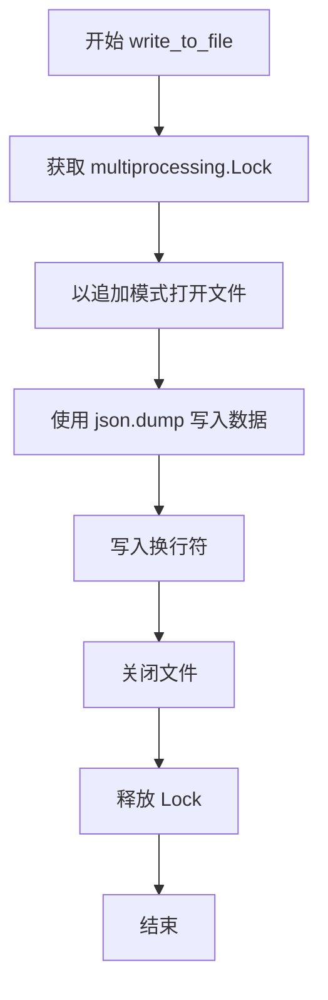
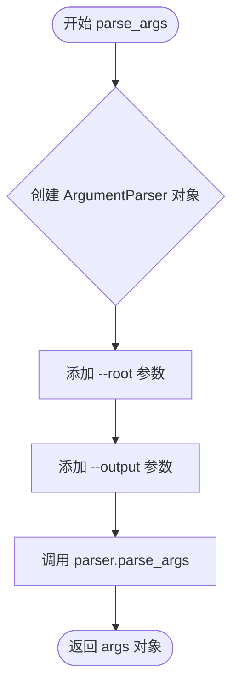
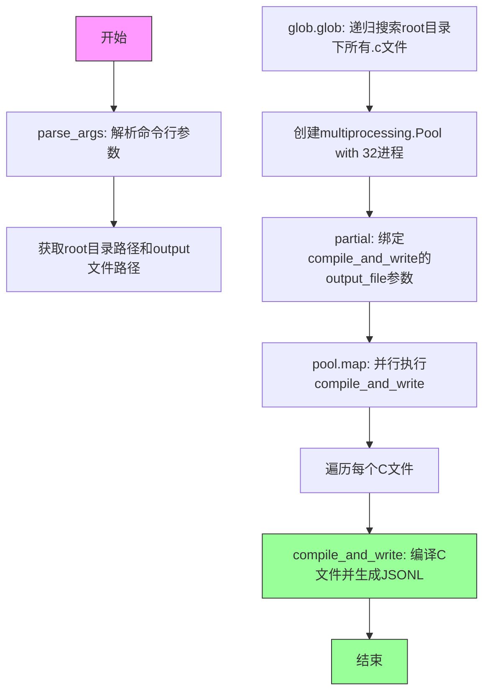

# `LLM4Decompile\train\compile.py` 详细设计文档

该代码是一个C语言编译器前端工具，用于批量编译C源文件并提取不同优化级别（O0-O3）下的汇编代码，通过多进程并行处理AnghaBench数据集中的C文件，生成包含原始代码和对应汇编的JSONL格式数据集。

## 整体流程

```mermaid
graph TD
    A[开始 main()] --> B[parse_args() 解析命令行参数]
B --> C[glob.glob 递归查找所有.c文件]
C --> D[创建32进程池 multiprocessing.Pool]
D --> E{遍历每个C文件}
E --> F[compile_and_write 单个文件处理]
F --> G[读取C源文件并预处理]
G --> H{遍历优化级别 O0/O1/O2/O3}
H --> I[gcc -c 编译为目标文件]
I --> J[objdump -d 反汇编生成汇编代码]
J --> K[清理汇编代码:去除二进制机器码和注释]
K --> L[正则去除前导零和属性标记]
L --> M[构建asm_all字典]
H --> N{优化级别循环结束}
M --> N
N --> O[删除临时.o和.s文件]
O --> P[构建sample字典包含name/input/input_ori/output]
P --> Q[write_to_file 写入JSONL]
E --> R{文件遍历结束}
Q --> R
R --> S[结束]
style A fill:#f9f,stroke:#333
style F fill:#ff9,stroke:#333
style Q fill:#9ff,stroke:#333
```

## 类结构

```
模块级结构 (无类)
├── 全局变量
│   ├── zeros_pattern (正则表达式)
│   └── OPT (优化级别列表)
└── 函数
    ├── compile_and_write() [核心编译函数]
    ├── write_to_file() [JSONL写入函数]
    ├── parse_args() [参数解析]
    └── main() [入口函数]
```

## 全局变量及字段


### `zeros_pattern`
    
匹配前导零的正则表达式pattern

类型：`str (regex pattern)`
    


### `OPT`
    
包含优化级别['O0', 'O1', 'O2', 'O3']的列表

类型：`list`
    


    

## 全局函数及方法


### `compile_and_write`

该函数是编译流程的核心函数，负责将单个C源文件通过GCC编译器在不同优化级别（O0、O1、O2、O3）下编译为目标文件，并使用objdump反汇编生成汇编代码，最后清理和格式化汇编内容，将包含原始输入和处理后输出的JSON对象写入JSONL格式的输出文件。

参数：

- `input_file`：`str`，输入的C源文件路径
- `output_file`：`str`，输出的JSONL文件路径，用于追加写入编译和反汇编结果

返回值：`None`，该函数无显式返回值，通过副作用（写入文件）完成处理

#### 流程图

```mermaid
flowchart TD
    A[开始 compile_and_write] --> B[提取基础输出文件名<br/>base_output_file = input_file.replace .c]
    B --> C[创建空字典 asm_all = {}]
    C --> D[打开并读取输入文件内容<br/>input_text = open input_file.read]
    D --> E{检查是否包含<br/>Variables and functions}
    E -->|是| F[分割文本<br/>保留函数部分]
    E -->|否| G[跳过处理]
    F --> H[移除 __attribute__ 标记]
    G --> I[开始遍历优化级别列表<br/>OPT = O0, O1, O2, O3]
    H --> I
    I --> J[构造目标文件路径<br/>obj_output = base_output_file + _ + opt_state + .o]
    J --> K[使用GCC编译C文件<br/>subprocess.run gcc -c -o obj_output input_file -opt_state]
    K --> L[使用objdump反汇编<br/>subprocess.run objdump -d obj_output > asm_output]
    L --> M[读取汇编文件并清理<br/>移除二进制码和注释]
    M --> N{判断汇编行数<br/>len lines < 4?}
    N -->|是| O[抛出ValueError<br/>compile fails]
    N -->|否| P[正则替换去除前导零<br/>re.sub zeros_pattern]
    P --> Q[移除__attribute__标记]
    Q --> R[保存到字典<br/>asm_all['opt-state-' + opt_state] = asm]
    R --> S[删除目标文件<br/>os.remove obj_output]
    S --> T{是否还有优化级别<br/>opt_state in OPT?}
    T -->|是| J
    T -->|否| U[异常处理块<br/>except Exception as e]
    U --> V{是否发生异常}
    V -->|是| W[打印错误信息并返回<br/>return]
    V -->|否| X[finally块: 删除汇编文件<br/>for opt_state in OPT: os.remove asm_output]
    X --> Y[构造样本数据字典<br/>sample = {name, input, input_ori, output}]
    Y --> Z[调用write_to_file函数<br/>write_to_file output_file sample]
    Z --> AA[结束]
    O --> W
```

#### 带注释源码

```python
def compile_and_write(input_file, output_file):
    # 1. 提取基础输出文件名（去掉.c后缀），用于构建后续临时文件名
    base_output_file = input_file.replace(".c", "")
    
    # 2. 初始化存储所有优化级别汇编结果的字典
    asm_all = {}
    
    # 3. 读取输入的C源文件全部内容
    input_text = open(input_file).read()  # Read input file
    
    # 4. 如果文件包含/* Variables and functions */注释标记，说明是自动生成的头文件
    #    需要提取函数部分，过滤掉宏定义和类型定义
    if "/* Variables and functions */" in input_text:
        # 从标记处分割，取后半部分（函数实现部分）
        input_text = input_text.split("/* Variables and functions */")[-1]
        # 再次分割后取第二段，去除变量声明部分（第一个\n\n之前是空的或变量）
        input_text = "\n\n".join(input_text.split("\n\n")[1:])  # Exclude variables
        
        ##### begin of remove __attribute__
        # 清理可能存在的__attribute__((used))属性标记
        input_text = input_text.replace("__attribute__((used)) ", "")
        ##### end of remove __attribute__
    
    # 5. 遍历所有优化级别进行编译和反汇编
    try:
        for opt_state in OPT:  # OPT = ["O0", "O1", "O2", "O3"]
            # 构造目标文件和汇编输出文件的完整路径
            obj_output = base_output_file + "_" + opt_state + ".o"
            asm_output = base_output_file + "_" + opt_state + ".s"

            # 6. 使用GCC编译器将C文件编译为目标文件（.o）
            #    -c 表示只编译不链接，-o 指定输出文件名，-O0/-O1/-O2/-O3 指定优化级别
            subprocess.run(
                ["gcc", "-c", "-o", obj_output, input_file, "-" + opt_state],
                check=True,
            )

            # 7. 使用objdump工具反汇编目标文件，生成汇编代码
            #    -d 参数表示反汇编可执行段
            subprocess.run(
                f"objdump -d {obj_output} > {asm_output}",
                shell=True,  # Use shell to handle redirection
                check=True,
            )

            # 8. 读取生成的汇编文件并进行清理
            with open(asm_output) as f:
                asm = f.read()
                
                ##### start of clean up
                asm_clean = ""
                # 从Disassembly of section .text: 后开始提取（去除文件头）
                asm = asm.split("Disassembly of section .text:")[-1].strip()
                
                # 逐行处理汇编代码
                for tmp in asm.split("\n"):
                    # 9. 移除每行的二进制机器码（tab后面的部分）
                    tmp_asm = tmp.split("\t")[-1]  # remove the binary code
                    # 10. 移除行内注释（#后面的部分）
                    tmp_asm = tmp_asm.split("#")[0].strip()  # remove the comments
                    asm_clean += tmp_asm + "\n"
                
                # 11. 验证：如果汇编代码少于4行，说明编译可能失败
                if len(asm_clean.split("\n")) < 4:
                    raise ValueError("compile fails")
                asm = asm_clean
                ##### end of clean up

                ##### start of filter digits and attribute
                # 12. 使用正则表达式去除前导零（形如 0000000000000... 的数字）
                asm = re.sub(zeros_pattern, "", asm)  # zeros_pattern = r"^0+\s"
                # 13. 再次清理__attribute__标记
                asm = asm.replace("__attribute__((used)) ", "")
                ##### end of filter digits

                # 14. 将该优化级别的汇编代码存入字典，键名为 opt-state-Ox
                asm_all["opt-state-" + opt_state] = asm

            # 15. 删除中间生成的目标文件，释放磁盘空间
            if os.path.exists(obj_output):
                os.remove(obj_output)

    # 16. 异常处理：捕获编译或反汇编过程中的错误
    except Exception as e:
        print(f"Error in file {input_file}: {e}")
        return  # 提前返回，不再继续处理
    finally:
        # 17. finally块：无论成功还是失败，都清理汇编输出文件
        for opt_state in OPT:
            asm_output = base_output_file + "_" + opt_state + ".s"
            if os.path.exists(asm_output):
                os.remove(asm_output)

    # 18. 构造最终的样本数据字典
    sample = {
        "name": input_file,
        "input": input_text,  # 使用处理后的输入文本（去除宏和类型）
        "input_ori": open(input_file).read(),  # 保留原始输入文本
        "output": asm_all,  # 包含四个优化级别的汇编代码
    }

    # 19. 调用write_to_file函数，将样本数据追加写入JSONL文件
    write_to_file(output_file, sample)
```

#### 关键组件信息

| 组件名称 | 描述 |
|---------|------|
| `OPT` | 全局常量列表，定义四个GCC优化级别：`["O0", "O1", "O2", "O3"]` |
| `zeros_pattern` | 正则表达式常量，用于匹配并去除汇编代码中的前导零：`r"^0+\s"` |
| `write_to_file` | 辅助函数，使用多进程锁安全地将JSON数据追加写入文件 |
| `subprocess.run` | 调用GCC编译器和objdump反汇编工具的子进程执行函数 |

#### 潜在技术债务与优化空间

1. **资源未正确关闭**：使用`open(input_file).read()`未显式关闭文件句柄，应使用`with`上下文管理器
2. **文件重复读取**：原始输入文件被读取两次（`input_text`和`input_ori`），可缓存一次
3. **Shell注入风险**：objdump命令使用`shell=True`存在潜在安全风险，建议改用列表参数形式
4. **临时文件清理粒度**：finally块清理汇编文件时，编译失败情况下base_output_file可能未定义导致异常
5. **缺乏日志记录**：仅使用print输出错误信息，缺乏结构化日志记录
6. **硬编码优化级别**：OPT列表硬编码，如需支持Os需修改代码

#### 其它设计说明

- **设计目标**：并行处理大量C源文件，提取不同优化级别的汇编代码用于后续分析（如编译器优化行为研究）
- **错误处理策略**：采用try-except-finally结构，确保临时文件在异常情况下也能清理；编译失败时通过汇编行数验证（<4行）主动抛出ValueError
- **并发安全**：依赖`multiprocessing.Pool`实现多进程并行，通过`multiprocessing.Lock()`保证JSONL文件写入的线程安全
- **外部依赖**：依赖系统安装的GCC编译器和GNU binutils中的objdump工具


### `write_to_file`

该函数是一个线程安全的全局函数，用于将数据以JSONL格式追加写入到指定文件。它使用 `multiprocessing.Lock()` 来确保在多进程环境下同一时刻只有一个进程能够写入文件，从而避免数据竞争和文件损坏。

参数：

- `file_path`：`str`，要写入的目标文件路径
- `data`：`dict`，要写入的JSON数据对象

返回值：`None`，该函数没有返回值

#### 流程图



#### 带注释源码

```python
def write_to_file(file_path, data):
    """
    线程安全地写入JSONL文件
    
    参数:
        file_path: str, 要写入的目标文件路径
        data: dict, 要写入的JSON数据对象
    
    返回:
        None
    """
    # 使用 multiprocessing.Lock() 确保多进程环境下的线程安全
    # 防止多个进程同时写入导致文件损坏或数据混乱
    with multiprocessing.Lock():
        # 以追加模式打开文件，如果文件不存在则创建
        with open(file_path, "a") as f:
            # 将字典对象序列化为JSON格式并写入文件
            json.dump(data, f)
            # 写入换行符，每条记录占一行，形成JSONL格式
            f.write("\n")
```

### 关键组件信息

| 组件名称 | 一句话描述 |
|---------|-----------|
| `multiprocessing.Lock()` | 用于保证多进程环境下文件写入互斥访问的锁机制 |
| `json.dump()` | 将Python字典对象序列化为JSON格式写入文件 |
| `"a"` 追加模式 | 以追加方式打开文件，支持多条JSON记录共存于同一文件 |

### 潜在的技术债务或优化空间

1. **锁的粒度过大**：整个文件写入操作都在锁内完成，高并发时可能成为性能瓶颈。可以考虑使用文件锁（`fcntl.flock`）替代全局进程锁，提高并发度。

2. **缺少异常处理**：没有对文件写入失败（如磁盘空间不足、权限问题）进行捕获和处理，可能导致数据丢失。

3. **Lock 对象重复创建**：每次调用都创建新的 `multiprocessing.Lock()` 实例，应该在函数外部创建单例锁或使用全局锁对象。

4. **文件路径未验证**：未检查 `file_path` 的有效性（如空路径、目录不存在等）。

5. **缺少编码指定**：未显式指定文件编码，默认依赖系统编码，可能导致跨平台兼容性问题。

### 其它项目

**设计目标与约束**：
- 目标：将数据结构化写入JSONL文件，支持多进程并发写入
- 约束：必须保证写入的线程/进程安全性

**错误处理与异常设计**：
- 当前无显式异常处理，异常会向上传播调用者
- 建议添加 `try-except` 捕获 IOError、OSError 等文件操作异常

**数据流与状态机**：
- 输入：字典对象 → JSON序列化 → 文件追加写入
- 输出：持久化的JSONL文件记录

**外部依赖与接口契约**：
- 依赖：`multiprocessing`（标准库）、`json`（标准库）
- 接口契约：调用方需保证 `data` 为可序列化对象，`file_path` 为有效文件路径


### `parse_args`

解析 `--root` 和 `--output` 命令行参数，并返回一个包含这些参数值的 `argparse.Namespace` 对象。

参数：
- 无

返回值：`argparse.Namespace`，包含 `root` (str) 和 `output` (str) 属性，分别对应命令行传入的根目录路径和输出文件路径。

#### 流程图



#### 带注释源码

```python
def parse_args():
    # 创建一个参数解析器，并设置描述信息
    parser = argparse.ArgumentParser(
        description="Compile C files and generate JSONL output."
    )
    
    # 添加必填参数 --root，用于指定 AnghaBench 文件所在的根目录
    parser.add_argument(
        "--root",
        required=True,
        help="Root directory where AnghaBench files are located.",
    )
    
    # 添加必填参数 --output，用于指定 JSONL 输出文件的路径
    parser.add_argument(
        "--output", 
        required=True, 
        help="Path to JSONL output file."
    )
    
    # 解析命令行参数
    args = parser.parse_args()
    
    # 返回解析后的命名空间对象，包含 root 和 output 属性
    return args
```


### `main()`

程序入口函数，协调整个流程，负责解析命令行参数、递归搜索指定根目录下的所有C文件，并使用多进程池并行编译每个C文件生成不同优化级别的汇编代码，最终将结果写入JSONL输出文件。

参数：无需显式参数（通过命令行参数系统传递）

返回值：`int`，返回程序执行状态（0表示正常结束）

#### 流程图



#### 带注释源码

```python
def main():
    """
    程序入口函数，协调整个编译流程
    
    流程说明：
    1. 解析命令行参数获取根目录和输出文件路径
    2. 使用glob递归搜索根目录下所有.c文件
    3. 创建32进程的进程池
    4. 为每个C文件分配一个进程执行compile_and_write
    5. 将编译结果追加写入JSONL文件
    """
    # Step 1: 解析命令行参数
    # 从命令行获取--root和--output参数
    args = parse_args()
    
    # Step 2: 提取路径参数
    root = args.root           # AnghaBench文件所在根目录
    jsonl_output_file = args.output  # JSONL输出文件路径
    
    # Step 3: 递归搜索所有C文件
    # 使用glob的recursive模式搜索所有.c文件
    # 返回文件路径列表
    files = glob.glob(f"{root}/**/*.c", recursive=True)
    
    # Step 4: 创建多进程池并执行任务
    # 使用32个进程的进程池进行并行处理
    # multiprocessing.Pool创建工作进程池
    with multiprocessing.Pool(32) as pool:
        # Step 5: 准备并行函数
        # 使用functools.partial绑定compile_and_write的output_file参数
        # 这样pool.map只需传入input_file参数
        from functools import partial
        
        # 创建偏函数：compile_and_write(input_file, output_file=jsonl_output_file)
        compile_write_func = partial(compile_and_write, output_file=jsonl_output_file)
        
        # Step 6: 并行映射执行
        # 将files列表中的每个文件分配给进程池中的工作进程
        # 每个进程执行compile_and_write函数
        pool.map(compile_write_func, files)
    
    # 进程池自动关闭并等待所有任务完成
    # 主进程继续执行并退出main函数
```

---

## 补充说明

### 设计目标与约束

- **目标**：将C源代码文件批量编译为不同优化级别（O0-O3）的汇编代码，并以JSONL格式输出
- **约束**：
  - 需要安装gcc编译器
  - 输出文件为JSONL格式（每行一个JSON对象）
  - 使用32进程并发处理

### 错误处理与异常设计

- `compile_and_write` 函数内部使用try-except捕获编译异常，异常时打印错误信息并返回
- `subprocess.run` 使用`check=True`确保编译失败时抛出异常
- `write_to_file` 使用`multiprocessing.Lock()`防止多进程并发写入冲突

### 潜在技术债务与优化空间

1. **资源清理时机**：使用`finally`块清理临时汇编文件，但异常时可能提前返回导致清理不彻底
2. **进程数硬编码**：32为硬编码值，可考虑根据CPU核心数动态调整
3. **文件读取冗余**：`input_file`被多次打开读取，可优化为单次读取
4. **缺少日志系统**：仅使用print输出，缺少结构化日志
5. **shell=True安全风险**：`subprocess.run`中使用`shell=True`存在注入风险

## 关键组件


### 编译与反汇编组件 (compile_and_write)

负责读取C源文件，使用GCC在不同优化级别(O0-O3)下编译，调用objdump生成汇编代码，并进行清理和提取。包含文件读取、编译执行、汇编处理等核心逻辑。

### 线程安全文件写入 (write_to_file)

使用multiprocessing.Lock()确保多进程并发写入JSONL文件时的数据一致性，避免文件损坏或数据竞争。

### 命令行参数解析 (parse_args)

使用argparse解析--root和--output两个必需参数，定义程序输入输出规范。

### 并行处理调度 (main)

使用multiprocessing.Pool(32)创建32进程池，递归扫描root目录下所有.c文件并分发任务，实现批量编译的并行化处理。

### 优化级别配置 (OPT)

定义O0、O1、O2、O3四种GCC优化级别，用于生成不同优化状态的汇编代码样本。

### 零值正则匹配 (zeros_pattern)

正则表达式r"^0+\s"用于过滤汇编代码中的零值前缀，实现汇编指令的清洗。

### 样本数据结构 (sample)

构建包含name、input、input_ori、output的字典结构，统一存储原始C代码、处理后代码及对应优化级别的汇编输出。


## 问题及建议


### 已知问题

-   **并发写入竞争条件**：`write_to_file` 使用 `multiprocessing.Lock()`，但该锁在主进程中创建后传递给子进程，在多进程环境下无法正确同步，可能导致 JSONL 格式损坏或数据丢失。
-   **Shell 注入风险**：使用 `shell=True` 执行 `objdump` 命令，存在潜在的安全风险。
-   **资源泄漏**：`open(input_file).read()` 未使用 `with` 语句，且在异常路径下可能未正确关闭文件句柄。
-   **硬编码并发数**：线程池大小固定为 32，未根据 CPU 核心数动态调整，缺乏灵活性。
-   **中间结果不可追溯**：`finally` 块会删除所有生成的汇编文件（.s），导致编译失败时无法进行调试和排查。
-   **重复读取文件**：输入文件被读取两次（一次检查内容，一次实际处理），效率低下。
-   **工具依赖未检查**：未检查 `gcc` 和 `objdump` 是否存在，运行时可能抛出难以定位的错误。
-   **错误处理过于简单**：捕获异常后仅打印错误信息即返回，缺乏详细的状态报告和错误分类。
-   **无输入验证**：未验证输入文件是否存在、是否为有效 C 文件或路径是否安全（路径遍历攻击风险）。

### 优化建议

-   **改进并发模型**：使用 `multiprocessing.Manager().Lock()` 或改用线程安全的队列写机制，或在主进程中汇总结果后统一写入。
-   **消除 Shell 执行**：将 `subprocess.run` 的 `shell=True` 改为参数列表形式，避免命令注入风险。
-   **使用上下文管理器**：所有文件操作均使用 `with open()` 确保资源正确释放。
-   **动态调整并发**：使用 `multiprocessing.cpu_count()` 或提供命令行参数控制并发数。
-   **增加调试选项**：添加 `--keep-asm` 参数，允许在调试时保留汇编文件。
-   **单次读取优化**：使用 `with` 读取一次文件内容，并在内存中完成所有检查和处理。
-   **依赖预检查**：在程序启动时检查 `gcc` 和 `objdump` 的可用性，不存在时给出明确提示。
-   **增强错误处理**：区分不同错误类型（编译错误、文件错误、系统错误），并记录更详细的错误上下文。
-   **输入验证**：验证 `--root` 和 `--output` 路径的有效性，防止路径遍历。

## 其它


### 设计目标与约束

本代码的设计目标是批量编译C语言源文件，生成不同优化级别（O0、O1、O2、O3）的汇编代码，并以JSONL格式输出结果。核心约束包括：1）需要预先安装gcc编译器工具链；2）处理文件数量受限于磁盘I/O和系统进程数；3）输出格式为JSONL，每行一个JSON对象；4）需要支持递归遍历目录下的所有.c文件。

### 错误处理与异常设计

代码采用多层错误处理机制：1）subprocess.run使用check=True进行自动检查，编译失败则抛出CalledProcessError；2）try-except捕获异常并打印错误信息后返回；3）finally块确保临时汇编文件被清理；4）自定义ValueError用于检测编译失败（生成的汇编少于4行）。当前不足：返回值为None表示失败，调用方无法区分具体错误类型；错误信息仅打印到stdout，未记录到日志文件。

### 数据流与状态机

数据流分为三个阶段：输入阶段（递归glob获取.c文件列表）→ 处理阶段（对每个文件进行编译-反汇编-清理）→ 输出阶段（JSONL写入）。状态机主要体现在compile_and_write函数中：初始状态（读取源文件）→ 预处理状态（提取代码部分）→ 编译状态（循环4个优化级别）→ 清理状态（删除临时文件）→ 结束状态（写入JSON）。处理流程为串行，但文件间为并行（32进程池）。

### 外部依赖与接口契约

外部依赖包括：1）gcc编译器（用于编译和objdump反汇编）；2）Python标准库（glob、json、subprocess、os、multiprocessing、re、argparse）；3）系统命令objdump。接口契约：输入为--root（包含.c文件的根目录）和--output（JSONL输出文件路径）；输出为JSONL格式，每行包含name（源文件路径）、input（处理后源码）、input_ori（原始源码）、output（4个优化级别的汇编结果）。

### 性能考虑与资源管理

性能设计：1）使用32进程的进程池实现文件级并行；2）使用multiprocessing.Lock()保护文件写入防止数据竞争；3）及时删除临时.o和.s文件避免磁盘空间耗尽。潜在性能问题：1）单文件串行处理4个优化级别，可考虑优化级别级并行；2）每次调用subprocess.run创建新进程，存在进程创建开销；3）glob递归遍历大目录可能较慢。

### 并发与同步机制

并发模型采用进程池（Pool）实现文件级并行，每个进程处理一个.c文件。同步机制：使用multiprocessing.Lock()确保多个进程写入同一JSONL文件时的数据一致性（虽然pool.map是顺序推送但仍需加锁保护）。当前设计在写入时加锁，读取文件时未加锁（open().read()在多进程下相对安全）。注意：Lock在创建Pool之后、map之前创建，确保所有子进程共享同一锁对象。

### 配置文件与参数设计

代码通过argparse模块接收命令行参数：--root（必需，指定源文件根目录）和--output（必需，指定JSONL输出路径）。无独立配置文件，参数在运行时动态传入。OPT列表定义了优化级别，可通过修改代码扩展。zeros_pattern正则表达式定义了前导零清理规则，当前为"^0+\s"。

### 安全考虑

安全风险包括：1）使用shell=True执行objdump命令，存在命令注入风险（obj_output和asm_output来自输入文件名）；2）未对输入路径进行安全验证，恶意路径可能导致目录遍历；3）文件写入模式为追加，可能导致文件过大。建议：1）验证输入路径在允许的目录范围内；2）使用shlex.quote()或列表形式传参避免shell注入；3）添加输入文件大小限制。

### 测试策略

测试场景应包括：1）正常编译单文件和批量编译多文件；2）处理空文件、仅有宏定义文件、无效C语法文件；3）测试编译失败场景（如语法错误）；4）测试临时文件清理是否完整；5）测试多进程并发写入的线程安全性；6）测试不同优化级别的输出差异。可通过创建简单C程序样本进行功能测试，验证JSONL输出格式正确性。

### 部署与运维

部署要求：1）系统需安装gcc和objdump工具；2）Python版本建议3.6+；3）确保有足够磁盘空间存储临时文件和输出文件。运维建议：1）添加日志记录功能替代print；2）增加进度条显示处理进度；3）添加--workers参数可配置进程数；4）增加断点续传功能（跳过已处理文件）；5）监控临时目录空间使用情况。

### 代码质量与可维护性

代码可改进点：1）compile_and_write函数职责过多，可拆分为compile、disassemble、clean、write等独立函数；2）硬编码了32进程数和4个优化级别，应提取为配置常量或参数；3）异常处理过于宽泛，应区分不同错误类型进行针对性处理；4）缺少类型注解和文档字符串；5）正则表达式zeros_pattern应添加到函数参数或配置文件；6）文件路径拼接使用字符串replace不够健壮，应使用pathlib。


    