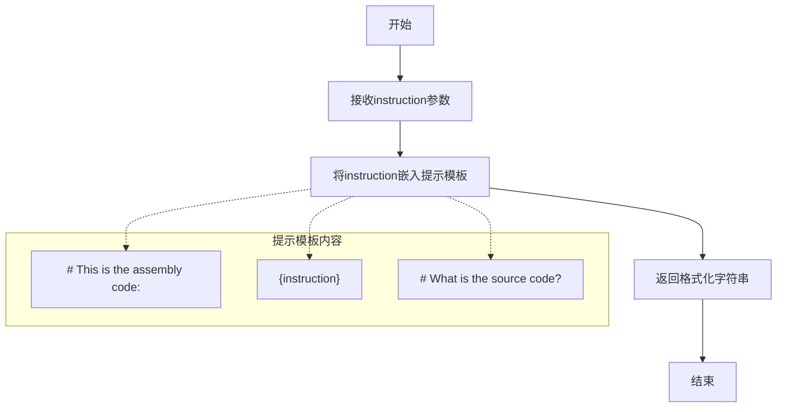
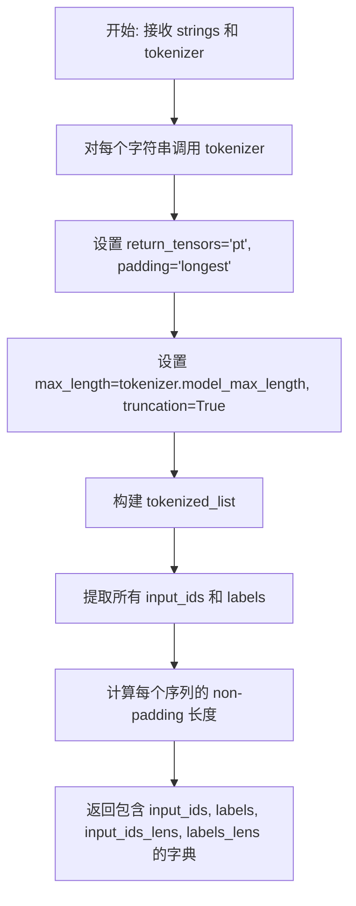
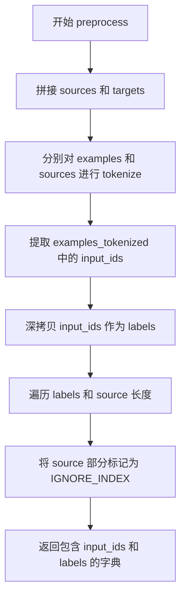
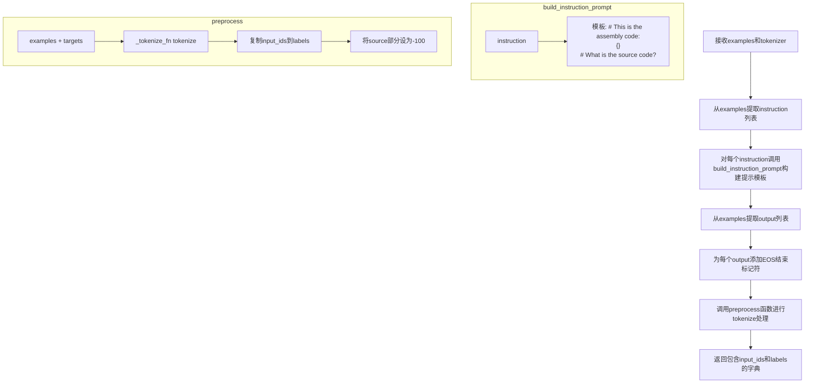
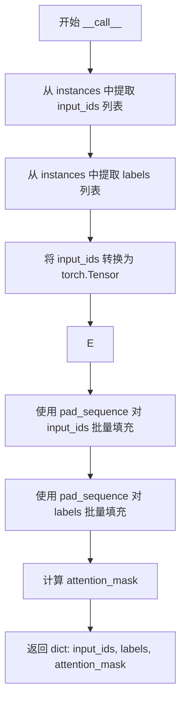

```mermaid
flowchart TD
    A[开始 train 函数] --> B[解析命令行参数]
    B --> C{local_rank == 0?}
    C -->|是| D[打印训练参数]
    C -->|否| E[跳过打印]
    D --> E
    E --> F[加载分词器]
    F --> G{分词器pad_token是否存在?}
    G -->|否| H[设置pad_token为eos_token]
    G -->|是| I[继续]
    H --> I
    I --> J[打印分词器特殊Token信息]
    J --> K{local_rank == 0?}
    K -->|是| L[打印模型加载信息]
    K -->|否| M[跳过打印]
    L --> M
    M --> N[构建模型参数字典]
    N --> O{use_flash_attention?}
    O -->|是| P[添加flash_attention_2参数]
    O -->|否| Q[保持空字典]
    P --> Q
    Q --> R[加载预训练模型]
    R --> S{local_rank == 0?}
    S -->|是| T[打印模型加载完成信息]
    S -->|否| U[跳过打印]
    T --> U
    U --> V[从JSON加载原始训练数据集]
    V --> W{local_rank > 0?}
    W -->|是| X[分布式屏障同步]
    W -->|否| Y[跳过屏障]
    X --> Z
    Y --> Z
    Z --> AA[对数据集进行tokenize处理]
    AA --> AB{local_rank == 0?}
    AB --> AC[分布式屏障同步]
    AB --> AD[跳过屏障]
    AC --> AD
    AD --> AE[打印数据集样本信息]
    AE --> AF[创建数据整理器]
    AF --> AG[构建data_module字典]
    AG --> AH[创建Trainer实例]
    AH --> AI[执行trainer.train训练]
    AI --> AJ[保存模型和训练状态]
    AJ --> AK[结束]
```

# `LLM4Decompile\train\finetune.py` 详细设计文档

这是一个用于微调大型语言模型（特别是代码生成模型，如 DeepSeek Coder）的训练脚本，它集成了 Hugging Face Transformers 和 Datasets 库，完成从数据加载、tokenization、模型配置到监督微调（Supervised Fine-tuning）的完整流程。

## 整体流程

```mermaid
graph TD
    Start([开始]) --> ParseArgs[解析命令行参数]
    ParseArgs --> LoadToken[加载 Tokenizer]
    LoadToken --> LoadModel[加载预训练模型 (AutoModel)]
    LoadModel --> LoadData[加载数据集 (JSON)]
    LoadData --> Tokenize[数据预处理: map tokenize]
    Tokenize --> Collate[创建 DataCollator]
    Collate --> InitTrainer[初始化 Trainer]
    InitTrainer --> Train[执行 trainer.train()]
    Train --> Save[保存模型和状态]
```

## 类结构

```
Global Variables & Functions
├── IGNORE_INDEX (全局变量)
├── build_instruction_prompt (全局函数)
├── _tokenize_fn (全局函数)
├── preprocess (全局函数)
├── train_tokenize_function (全局函数)
└── train (主函数)
DataClasses (配置类)
├── ModelArguments (模型配置)
├── DataArguments (数据配置)
└── TrainingArguments (训练配置)
DataCollatorForSupervisedDataset (数据处理类)
```

## 全局变量及字段


### `IGNORE_INDEX`
    
用于在标签中标记需要忽略的索引，值为-100，常用于语言模型的损失计算中忽略特定位置的损失

类型：`int`
    


### `ModelArguments.model_name_or_path`
    
模型名称或路径，默认为 deepseek-ai/deepseek-coder-1.3b-base，用于指定要加载的预训练模型

类型：`Optional[str]`
    


### `ModelArguments.use_flash_attention`
    
是否使用 Flash Attention，默认为 False，用于加速模型推理的注意力机制

类型：`bool`
    


### `DataArguments.data_path`
    
训练数据文件的路径，默认为 None，指向包含训练样本的 JSON 文件

类型：`str`
    


### `TrainingArguments.cache_dir`
    
缓存目录，用于存储下载的模型和数据集缓存文件

类型：`Optional[str]`
    


### `TrainingArguments.optim`
    
优化器类型，默认为 adamw_torch，指定训练过程中使用的优化算法

类型：`str`
    


### `TrainingArguments.model_max_length`
    
最大序列长度，默认为 512，用于控制输入序列的最大token数并进行截断

类型：`int`
    


### `DataCollatorForSupervisedDataset.tokenizer`
    
用于 padding 的 tokenizer，负责对输入序列进行分词和填充处理

类型：`transformers.PreTrainedTokenizer`
    
    

## 全局函数及方法


### `build_instruction_prompt`

该函数用于构建指令提示模板，将输入的汇编代码格式化到一个提示字符串中，用于指导模型将汇编代码转换为源代码。

参数：

- `instruction`：`str`，输入的指令内容，通常为汇编代码

返回值：`str`，格式化后的指令提示字符串，包含汇编代码和询问源代码的问题

#### 流程图



#### 带注释源码

```python
def build_instruction_prompt(instruction: str):
    """
    构建指令提示模板
    
    该函数将输入的汇编代码包装成一个提示字符串，
    用于指导模型执行代码翻译任务（汇编代码转源代码）。
    
    参数:
        instruction: str, 输入的指令内容，通常是汇编代码字符串
        
    返回:
        str: 格式化后的提示字符串，包含汇编代码和任务问题
    """
    return """# This is the assembly code:
{}
# What is the source code?
""".format(
        instruction
    )
```


### `_tokenize_fn`

该函数负责将字符串列表转换为模型可处理的张量格式，包括input_ids、labels以及它们的长度信息。

参数：

- `strings`：`Sequence[str]`，要进行分词的字符串列表
- `tokenizer`：`transformers.PreTrainedTokenizer`，用于分词的预训练分词器实例

返回值：`Dict`，包含以下键的字典：
- `input_ids`：分词后的输入ID列表
- `labels`：标签列表（与input_ids相同）
- `input_ids_lens`：每个输入的长度列表
- `labels_lens`：每个标签的长度列表

#### 流程图



#### 带注释源码

```python
def _tokenize_fn(
    strings: Sequence[str], tokenizer: transformers.PreTrainedTokenizer
) -> Dict:
    """Tokenize a list of strings."""
    # 对每个字符串进行分词，返回包含 input_ids, attention_mask 等的字典列表
    tokenized_list = [
        tokenizer(
            text,                           # 待分词的文本
            return_tensors="pt",            # 返回 PyTorch 张量
            padding="longest",              # 填充到批次中最长的序列
            max_length=tokenizer.model_max_length,  # 最大序列长度
            truncation=True,                # 超过最大长度时截断
        )
        for text in strings                 # 遍历所有输入字符串
    ]

    # 从每个分词结果中提取 input_ids，作为模型的输入和标签
    input_ids = labels = [tokenized.input_ids[0] for tokenized in tokenized_list]
    
    # 计算每个序列的有效长度（排除 padding token）
    input_ids_lens = labels_lens = [
        tokenized.input_ids.ne(tokenizer.pad_token_id).sum().item()
        for tokenized in tokenized_list
    ]

    # 返回包含分词结果和长度的字典
    return dict(
        input_ids=input_ids,              # 分词后的输入ID列表
        labels=labels,                    # 标签列表（用于训练）
        input_ids_lens=input_ids_lens,    # 输入序列的有效长度
        labels_lens=labels_lens,          # 标签序列的有效长度
    )
```


### `preprocess`

该函数用于将源代码（source）和目标代码（target）进行拼接后统一进行tokenize处理，并通过将source部分在labels中标记为IGNORE_INDEX（-100），确保模型在训练时仅学习预测target部分，从而实现指令微调场景下的有监督学习。

参数：

- `sources`：`Sequence[str]`，原始输入的指令序列列表，通常为带有指令前缀的提示文本
- `targets`：`Sequence[str]`，期望模型生成的目标输出序列列表，通常为对应的源代码
- `tokenizer`：`transformers.PreTrainedTokenizer`，Hugging Face的分词器实例，用于将文本转换为token ID

返回值：`Dict`，包含`input_ids`和`labels`两个键的字典，分别对应模型输入的token序列和用于计算loss的标签序列

#### 流程图



#### 带注释源码

```python
def preprocess(
    sources: Sequence[str],
    targets: Sequence[str],
    tokenizer: transformers.PreTrainedTokenizer,
) -> Dict:
    """Preprocess the data by tokenizing."""
    # Step 1: 将每个source与其对应的target拼接成完整的训练样本
    # 例如: source="帮我写一个加法函数" + target="def add(a,b): return a+b"
    examples = [s + t for s, t in zip(sources, targets)]
    
    # Step 2: 同时对拼接后的样本列表和原始source列表进行tokenize
    # - examples_tokenized: 包含完整输入的tokenized结果（用于input_ids）
    # - sources_tokenized: 仅包含source部分的tokenized结果（用于确定mask范围）
    examples_tokenized, sources_tokenized = [
        _tokenize_fn(strings, tokenizer) for strings in (examples, sources)
    ]
    
    # Step 3: 从tokenize结果中提取input_ids（模型实际看到的输入）
    input_ids = examples_tokenized["input_ids"]
    
    # Step 4: 深拷贝input_ids作为labels（用于计算loss）
    # 为什么要深拷贝？因为labels和input_ids共享相同的tensor结构，但需要修改部分值
    labels = copy.deepcopy(input_ids)
    
    # Step 5: 将source部分在labels中标记为IGNORE_INDEX（-100）
    # 这样在计算交叉熵损失时，模型不会学习预测source部分（指令部分）
    # 只学习预测target部分（期望的输出）
    for label, source_len in zip(labels, sources_tokenized["input_ids_lens"]):
        label[:source_len] = IGNORE_INDEX
    
    # Step 6: 返回处理后的数据字典
    # - input_ids: 模型输入的token序列
    # - labels: 带mask的标签序列，source部分为-100，target部分为实际token id
    return dict(input_ids=input_ids, labels=labels)
```


### `train_tokenize_function`

该函数是训练数据的tokenization回调函数，用于将原始的训练数据（包含instruction和output字段）转换为模型可训练的格式。它首先将instruction构建为特定的提示模板，然后为output添加结束标记符，最后通过preprocess函数进行tokenize处理，返回包含input_ids和labels的字典供模型训练使用。

参数：

- `examples`：`Dict`，原始训练数据字典，包含"instruction"（指令列表）和"output"（输出列表）字段
- `tokenizer`：`transformers.PreTrainedTokenizer`，Hugging Face的预训练分词器，用于对文本进行tokenize

返回值：`Dict`，返回包含"input_ids"和"labels"的字典，其中labels已将source部分设置为IGNORE_INDEX（-100），只计算loss的output部分

#### 流程图



#### 带注释源码

```python
def train_tokenize_function(examples, tokenizer):
    """
    训练数据的tokenization回调函数，用于HuggingFace Trainer的map方法。
    
    参数:
        examples: 原始数据批次，包含'instruction'和'output'字段的字典
        tokenizer: 预训练分词器对象
    
    返回:
        包含input_ids和labels的字典，用于模型训练
    """
    # 从输入数据中提取instruction字段，遍历每个instruction构建提示模板
    sources = [
        build_instruction_prompt(instruction) for instruction in examples["instruction"]
    ]
    # 获取tokenizer的EOS结束标记符
    eos_token = tokenizer.eos_token
    # 为每个output添加EOS标记和换行符，形成完整的目标序列
    targets = [f"{output}\n{eos_token}" for output in examples["output"]]
    # 调用preprocess函数进行tokenize处理和标签构建
    # preprocess会将source部分在labels中设为IGNORE_INDEX(-100)
    data_dict = preprocess(sources, targets, tokenizer)
    # 返回处理后的字典，包含input_ids和labels
    return data_dict
```


### `train`

这是代码的核心入口函数，负责加载分词器、模型和数据集，配置训练参数，并启动监督微调流程。

#### 参数

该函数没有显式参数，参数通过命令行解析获取：

- 无显式参数（参数通过`transformers.HfArgumentParser`从命令行解析）

#### 返回值

- `None`，该函数执行训练流程但不返回任何值

#### 流程图



#### 带注释源码

```python
def train():
    """
    主训练函数，负责整个监督微调流程的 orchestrate。
    包括参数解析、模型加载、数据处理、训练执行和模型保存。
    """
    # 1. 使用 HuggingFace 参数解析器解析命令行参数
    # 支持 ModelArguments, DataArguments, TrainingArguments 三类参数
    parser = transformers.HfArgumentParser(
        (ModelArguments, DataArguments, TrainingArguments)
    )
    # 将解析后的参数分别存入对应的数据类中
    model_args, data_args, training_args = parser.parse_args_into_dataclasses()

    # 2. 仅在主进程(local_rank=0)中打印训练参数信息
    # 用于确认参数配置正确
    if training_args.local_rank == 0:
        print("=" * 100)
        print(training_args)

    # 3. 加载预训练分词器
    # model_max_length: 控制序列最大长度
    # padding_side="right": 填充在序列右侧
    # use_fast=True: 使用快速分词器
    # trust_remote_code=True: 允许执行远程代码(某些模型需要)
    tokenizer = transformers.AutoTokenizer.from_pretrained(
        model_args.model_name_or_path,
        model_max_length=training_args.model_max_length,
        padding_side="right",
        use_fast=True,
        trust_remote_code=True,
    )

    # 4. 处理分词器的 pad_token
    # 如果没有设置 pad_token，则使用 eos_token 作为 pad_token
    # 这是 Causal LM 常用的做法
    if tokenizer.pad_token is None:
        tokenizer.pad_token = tokenizer.eos_token
        tokenizer.pad_token_id = tokenizer.eos_token_id

    # 5. 打印分词器的特殊 Token 信息
    # 便于调试和确认分词器配置
    print("PAD Token:", tokenizer.pad_token, tokenizer.pad_token_id)
    print("BOS Token", tokenizer.bos_token, tokenizer.bos_token_id)
    print("EOS Token", tokenizer.eos_token, tokenizer.eos_token_id)

    # 6. 仅在主进程打印分词器加载完成信息
    if training_args.local_rank == 0:
        print("Load tokenizer from {} over.".format(model_args.model_name_or_path))

    # 7. 构建模型加载参数字典
    model_kwargs = {}
    # 如果启用 flash attention，使用更高效的注意力实现
    if model_args.use_flash_attention:
        model_kwargs["attn_implementation"] = "flash_attention_2"

    # 8. 加载预训练因果语言模型
    # torch_dtype=torch.bfloat16: 使用半精度浮点数减少显存占用
    # **model_kwargs: 传入其他模型参数(如 attn_implementation)
    model = transformers.AutoModelForCausalLM.from_pretrained(
        model_args.model_name_or_path, torch_dtype=torch.bfloat16, **model_kwargs
    )

    # 9. 仅在主进程打印模型加载完成信息
    if training_args.local_rank == 0:
        print("Load model from {} over.".format(model_args.model_name_or_path))

    # 10. 从 JSON 文件加载原始训练数据集
    # 使用 load_dataset 的 json 加载器
    raw_train_datasets = load_dataset(
        "json",
        data_files=data_args.data_path,
        split="train",
        cache_dir=training_args.cache_dir,
    )

    # 11. 分布式训练同步屏障
    # 确保所有进程都加载完数据后再继续
    if training_args.local_rank > 0:
        torch.distributed.barrier()

    # 12. 对原始数据集进行 tokenize 处理
    # batched=True: 批量处理
    # batch_size=3000: 每批处理 3000 个样本
    # num_proc=32: 使用 32 个进程并行处理
    # remove_columns: 移除原始列，只保留处理后的数据
    # load_from_cache_file: 使用缓存文件避免重复处理
    train_dataset = raw_train_datasets.map(
        train_tokenize_function,
        batched=True,
        batch_size=3000,
        num_proc=32,
        remove_columns=raw_train_datasets.column_names,
        load_from_cache_file=True,  # not args.overwrite_cache
        desc="Running Encoding",
        fn_kwargs={"tokenizer": tokenizer},
    )

    # 13. 再次使用分布式屏障同步
    if training_args.local_rank == 0:
        torch.distributed.barrier()

    # 14. 打印训练数据集样本信息(仅主进程)
    # 随机选择 3 个样本进行展示，用于验证数据处理正确性
    if training_args.local_rank == 0:
        print("Training dataset samples:", len(train_dataset))
        for index in random.sample(range(len(train_dataset)), 3):
            print(
                f"Sample {index} of the training set: {train_dataset[index]['input_ids']}, {train_dataset[index]['labels']}."
            )
            print(
                f"Sample {index} of the training set: {tokenizer.decode(list(train_dataset[index]['input_ids']))}."
            )

    # 15. 创建数据整理器(DataCollator)
    # 用于将多个样本整理成一个 batch
    data_collator = DataCollatorForSupervisedDataset(tokenizer=tokenizer)

    # 16. 构建数据模块字典
    # 包含训练数据集、评估数据集(这里为 None)和数据整理器
    data_module = dict(
        train_dataset=train_dataset, eval_dataset=None, data_collator=data_collator
    )

    # 17. 创建 HuggingFace Trainer 实例
    # 封装了训练循环、评估、日志记录等功能
    trainer = Trainer(
        model=model, tokenizer=tokenizer, args=training_args, **data_module
    )

    # 18. 开始训练
    trainer.train()

    # 19. 保存模型权重和训练状态
    trainer.save_model()
    trainer.save_state()
```


### `DataCollatorForSupervisedDataset.__call__`

动态批处理函数，用于将多个监督学习样本（包含 input_ids 和 labels）合并为一个批次，并进行统一长度的 padding 处理，同时生成注意力掩码，以适配深度学习框架对批量输入的要求。

参数：

- `self`：`DataCollatorForSupervisedDataset` 实例本身，包含 tokenizer 用于获取 pad_token_id
- `instances`：`Sequence[Dict]` ，待批处理的样本列表，每个字典必须包含 "input_ids" 和 "labels" 两个键，分别对应 tokenized 的输入序列和标签序列

返回值：`Dict[str, torch.Tensor]` ，返回包含三个键的字典：
  - `input_ids`：`torch.Tensor`，形状为 (batch_size, max_length)，右 padded 的输入 token ID 序列
  - `labels`：`torch.Tensor`，形状为 (batch_size, max_length)，右 padded 的标签序列，未匹配部分用 IGNORE_INDEX (-100) 填充
  - `attention_mask`：`torch.Tensor`，形状为 (batch_size, max_length)，指示有效 token 位置的布尔掩码

#### 流程图



#### 带注释源码

```python
def __call__(self, instances: Sequence[Dict]) -> Dict[str, torch.Tensor]:
    """
    动态批处理函数，将多个样本合并为一个批次并进行 padding。
    
    参数:
        instances: 样本列表，每个样本包含 input_ids 和 labels
        
    返回:
        包含 input_ids, labels, attention_mask 的字典
    """
    # Step 1: 从 instances 列表中分别提取所有 input_ids 和 labels
    # 这里使用元组解包，同时遍历 "input_ids" 和 "labels" 两个键
    input_ids, labels = tuple(
        [instance[key] for instance in instances] for key in ("input_ids", "labels")
    )
    
    # Step 2: 将 input_ids 列表中的每个元素转换为 torch.Tensor
    # 输入是 Python 列表，转换为张量以便后续处理
    input_ids = [torch.tensor(x) for x in input_ids]
    
    # Step 3: 使用 pad_sequence 对 input_ids 进行批处理填充
    # batch_first=True: 返回的张量形状为 (batch_size, seq_len)
    # padding_value: 使用 tokenizer 的 pad_token_id 作为填充值
    input_ids = torch.nn.utils.rnn.pad_sequence(
        input_ids, batch_first=True, padding_value=self.tokenizer.pad_token_id
    )
    
    # Step 4: 将 labels 列表中的每个元素转换为 torch.Tensor
    labels = [torch.tensor(x) for x in labels]
    
    # Step 5: 使用 pad_sequence 对 labels 进行批处理填充
    # padding_value=IGNORE_INDEX: 填充部分不参与损失计算（通常为 -100）
    labels = torch.nn.utils.rnn.pad_sequence(
        labels, batch_first=True, padding_value=IGNORE_INDEX
    )
    
    # Step 6: 生成 attention_mask
    # 通过比较 input_ids 与 pad_token_id 是否不等来创建掩码
    # True 表示有效 token，False 表示 padding token
    return dict(
        input_ids=input_ids,
        labels=labels,
        attention_mask=input_ids.ne(self.tokenizer.pad_token_id),
    )
```

## 关键组件


### 模型配置与加载 (ModelArguments)

ModelArguments 数据类用于配置模型相关参数，包括模型路径和 Flash Attention 支持。在 train() 函数中，使用 Hugging Face 的 AutoModelForCausalLM.from_pretrained() 加载预训练模型，并支持通过 attn_implementation="flash_attention_2" 启用 Flash Attention 2 加速。

### 数据加载与配置 (DataArguments)

DataArguments 数据类用于指定训练数据路径。数据通过 load_dataset() 函数从 JSON 文件加载，支持分布式训练中的缓存共享和屏障同步。

### 训练参数配置 (TrainingArguments)

继承自 transformers.TrainingArguments 的数据类，配置训练相关参数如优化器 (adamw_torch)、最大序列长度 (512)、缓存目录等。

### 文本标记化 (_tokenize_fn)

_tokenize_fn() 函数负责将字符串列表转换为 PyTorch 张量，支持填充到最大长度和截断。返回包含 input_ids、labels、input_ids_lens 和 labels_lens 的字典。

### 数据预处理 (preprocess)

preprocess() 函数将源文本和目标文本拼接后进行标记化，通过设置 IGNORE_INDEX (-100) 标记源文本部分，使其在训练时不被计算损失，实现因果语言模型的指令微调。

### 数据整理器 (DataCollatorForSupervisedDataset)

DataCollatorForSupervisedDataset 数据类实现 __call__ 方法，负责将多个样本批次整理为批量张量。使用 pad_sequence 对 input_ids 和 labels 进行填充，并生成 attention_mask。

### 指令提示构建 (build_instruction_prompt)

build_instruction_prompt() 函数将指令文本格式化为指定的提示模板，用于构建模型输入。

### 训练数据标记化 (train_tokenize_function)

train_tokenize_function() 函数对数据集的每个样本进行处理，构建指令提示并添加结束符，然后调用 preprocess() 进行标记化处理。

### 主训练流程 (train)

train() 函数是主入口，负责：解析参数、加载 tokenizer 和模型、加载数据集、配置 Trainer、执行训练和模型保存。支持分布式训练的屏障同步和本地等级检查。

### 全局常量 (IGNORE_INDEX)

IGNORE_INDEX = -100 用于在标签中标记需要忽略的位置，通常用于因果语言模型中掩盖指令部分，只计算答案部分的损失。


## 问题及建议


### 已知问题

- **随机种子未设置**：代码中使用了 `random.sample()` 进行采样，但未设置随机种子，导致结果不可复现。
- **分布式屏障使用不一致**：`torch.distributed.barrier()` 在 `local_rank == 0` 和 `local_rank > 0` 两种情况下被调用，逻辑混乱，可能导致死锁或不同步。
- **硬编码配置值**：`batch_size=3000`、`num_proc=32`、`model_max_length=512` 等参数硬编码在代码中，缺乏灵活性。
- **缺少错误处理**：模型加载、tokenizer加载、数据集加载等关键操作均无 try-except 异常处理。
- **数据预处理内存效率低**：使用 `copy.deepcopy` 复制整个 input_ids 数组作为 labels，对于大规模数据集会造成显著的内存开销。
- **DataCollator 重复创建 tensor**：先创建 list 再转为 tensor，然后 pad_sequence，造成不必要的中间对象。
- **无评估数据集**：eval_dataset 固定为 None，无法在训练过程中监控模型性能。
- **训练配置不完整**：缺少 `evaluation_strategy`、`save_strategy`、`logging_steps` 等关键训练参数配置。
- **类型提示不完整**：`train()` 函数缺少返回类型注解，部分参数和变量缺少类型注解。
- **模型加载默认精度问题**：使用 `torch.bfloat16` 但未检查当前设备是否支持该精度。

### 优化建议

- **设置随机种子**：在训练开始前设置 `random.seed()`、`torch.manual_seed()`、`numpy.random.seed()` 以确保可复现性。
- **修复分布式同步逻辑**：统一 `torch.distributed.barrier()` 的调用条件，通常只在非主进程调用或使用适当的条件判断。
- **配置化硬编码值**：将 batch_size、num_proc、model_max_length 等参数移至 TrainingArguments 或命令行参数。
- **添加异常处理**：为模型加载、数据集加载、tokenizer加载等关键操作添加 try-except 块，并进行优雅的错误报告。
- **优化数据预处理**：使用 tensor 切片操作替代 copy.deepcopy，或直接在 GPU 上进行标签掩码处理。
- **优化 DataCollator**：直接使用 pad_sequence 处理原始数据，避免中间 list 转换。
- **添加评估配置**：支持配置评估数据集和评估策略，以便监控训练过程中的模型性能。
- **完善训练参数**：添加合理的 logging_steps、save_strategy、evaluation_strategy 配置。
- **添加类型注解**：为 `train()` 函数添加返回类型注解，完善其他函数的类型提示。
- **添加精度检查**：在加载模型前检查设备支持的张量精度，不支持时降级到 fp32 或 fp16。

## 其它


### 设计目标与约束

本代码旨在实现一个针对代码理解任务的语言模型微调流程，核心目标是将汇编代码转换为高级语言源代码。设计约束包括：模型最大长度限制为512个token，支持分布式训练环境，默认使用deepseek-coder-1.3b-base基础模型，训练数据通过JSON格式加载，数据预处理采用多进程并行化处理。

### 错误处理与异常设计

代码在错误处理方面存在以下设计：tokenizer加载时设置trust_remote_code=True允许执行远程代码；数据加载使用load_from_cache_file=True优先使用缓存；分布式训练中使用torch.distributed.barrier()同步各进程；对于tokenizer的pad_token为None的情况，代码主动将其设置为eos_token以避免训练时出现空填充问题。但整体错误处理较为基础，缺乏对模型加载失败、数据文件不存在、显存不足等情况的显式异常捕获和处理机制。

### 数据流与状态机

数据流遵循以下路径：原始JSON数据 → load_dataset加载 → train_tokenize_function分词预处理 → preprocess函数合并source和target并生成labels → DataCollatorForSupervisedDataset批量整理 → Trainer进行训练。状态转换包括：数据加载阶段、分词阶段、模型初始化阶段、训练准备阶段、训练执行阶段。关键状态变量包括training_args.local_rank用于区分主从进程，train_dataset存储预处理后的训练数据。

### 外部依赖与接口契约

核心依赖包括：transformers>=4.30.0提供模型和tokenizer支持，torch>=2.0.0用于深度学习计算，datasets库用于数据加载，torch.distributed支持分布式训练。外部接口契约包括：数据文件需为JSON格式且包含instruction和output字段；模型需为Hugging Face Hub上支持的CausalLM模型；训练参数通过HfArgumentParser解析ModelArguments、DataArguments、TrainingArguments三个 dataclass传递。

### 性能考虑与优化空间

当前实现存在以下性能优化空间：数据预处理使用batch_size=3000和num_proc=32进行多进程处理，但未根据实际内存调整；模型加载使用bfloat16精度但未启用gradient checkpointing节省显存；tokenize时padding设置为longest可能造成计算浪费；分布式训练仅在local_rank==0时打印信息，存在日志冗余；未使用DeepSpeed或FSDP等先进分布式训练框架。推荐优化方向包括：添加混合精度训练的更细粒度控制、实现数据预处理的内存监控、考虑使用accelerate库简化分布式训练配置。

### 安全性考虑

代码存在以下安全风险：使用trust_remote_code=True允许tokenizer加载并执行自定义代码；模型名称通过命令行参数传入未做白名单校验；数据路径直接传入load_dataset未做路径遍历防护；未设置数据加载的并行线程数限制可能引发资源耗尽。建议增加模型名称校验、路径安全检查、敏感信息过滤等安全措施。

### 配置管理与持久化

配置通过命令行参数传递，由HfArgumentParser解析为dataclass对象。模型和tokenizer保存使用trainer.save_model()和trainer.save_state()，但缺乏独立的配置文件（如config.json）生成；训练参数通过TrainingArguments统一管理但未实现配置的序列化与反序列化；数据预处理缓存依赖datasets库的默认机制，缺乏显式的缓存管理策略。

### 可维护性与扩展性

代码结构较为清晰但扩展性有限：数据处理流程硬编码在train_tokenize_function中，若需支持多任务需要重构；模型架构假设为CausalLM，未考虑Encoder-Decoder架构；评估数据集始终为None，缺少评估流程；缺乏回调机制用于自定义训练行为。建议采用策略模式重构数据处理、添加评估器接口、实现训练回调系统以提升可维护性。

### 测试策略建议

当前代码缺乏测试覆盖，建议补充以下测试用例：单元测试验证_tokenize_fn和preprocess函数的输出格式正确性；集成测试验证数据加载→预处理→训练的全流程；性能测试监控不同数据规模下的显存占用和训练速度；Mock测试使用小模型和少量数据验证训练循环正确性；分布式环境测试验证多GPU训练的功能正确性。

### 资源要求与部署建议

运行要求包括：GPU显存建议16GB以上（使用bfloat16），CPU多核用于数据预处理，磁盘空间用于模型缓存和数据集存储。部署建议：生产环境应添加环境变量检查和参数校验；建议将硬编码的默认值（如model_max_length=512、batch_size=3000）提取为配置文件；推荐使用docker容器化部署确保环境一致性；应添加日志轮转和监控指标收集机制。


    