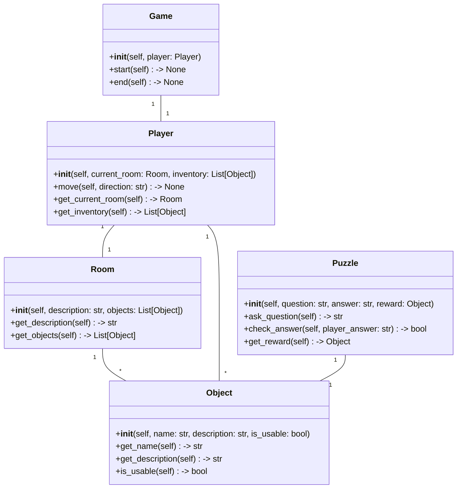

# MetaGPT源码解析 12

# `metagpt/utils/__init__.py`

这段代码是一个Python脚本，它的作用是定义了一个名为`__main__`的函数。这个函数被称为Python标准内函数`__main__`，当程序运行时，它会首先执行这个函数。

函数内部包含以下操作：

1. 从`metagpt.utils.read_document`包中实例化`read_docx`函数，这个函数的作用是读取一个文档文件，并返回一个`Document`对象。
2. 从`metagpt.utils.singleton`包中实例化`Singleton`函数，这个函数的作用是确保只有一个`Singleton`实例被创建。
3. 从`metagpt.utils.token_counter`包中实例化`count_message_tokens`函数，这个函数的作用是统计代码中出现的`message_token`，并返回结果。
4. 导入`TOKEN_COSTS`，`count_message_tokens`，`count_string_tokens`，这三个函数都定义在`metagpt.utils`包中，用于统计文档中message token的数量。


```py
#!/usr/bin/env python
# -*- coding: utf-8 -*-
"""
@Time    : 2023/4/29 15:50
@Author  : alexanderwu
@File    : __init__.py
"""

from metagpt.utils.read_document import read_docx
from metagpt.utils.singleton import Singleton
from metagpt.utils.token_counter import (
    TOKEN_COSTS,
    count_message_tokens,
    count_string_tokens,
)


```

这段代码定义了一个名为 `__all__` 的列表，包含6个元素。这些元素是一个字符串，分别是：

- `"read_docx"`
- `"Singleton"`
- `"TOKEN_COSTS"`
- `"count_message_tokens"`
- `"count_string_tokens"`

这个列表的作用是传递给函数 `count_string_tokens`，它需要一个参数列表来表示要统计的文档中所有可能出现的有用字符(例如标记、关键词等)。这些字符将会被转换成元组，然后传递给 `count_string_tokens` 函数进行计数。

具体来说，这个列表的作用是告诉 Python 程序所有可能用于统计字符的选项，以便 `count_string_tokens` 函数能够正确地读取和处理这些选项。


```py
__all__ = [
    "read_docx",
    "Singleton",
    "TOKEN_COSTS",
    "count_message_tokens",
    "count_string_tokens",
]

```

# `tests/conftest.py`

这段代码是一个Python脚本，它定义了一个名为`conftest.py`的文件。在这个脚本中，我们引入了`unittest.mock`模块，以便我们能够模拟Python标准库中的函数和类。

在这个脚本中，我们还引入了`metagpt.logs`模块，以及`metagpt.provider.openai_api`和`asyncio`模块。在这里，我们创建了一个`OpenAIGPTAPI`对象，它继承自`metagpt.provider.openai_api.OpenAIGPTAPI`类。我们还导入了`asyncio`模块，以便我们能够在我们的代码中使用异步编程特性。

在`conftest.py`文件的其他部分，我们创建了一个`with`语句，用于在代码块结束时自动调用`asyncio.sleep()`函数，以便在测试期间让我们的代码等待一段时间。我们还创建了一个`Logger`对象，用于模拟Python标准库中的`logger`函数。最后，我们在文件中定义了一个`test_that_gptapi_outputs_correct_logs`函数，用于测试我们的`OpenAIGPTAPI`对象是否能够正确地输出日志。


```py
#!/usr/bin/env python
# -*- coding: utf-8 -*-
"""
@Time    : 2023/5/1 12:10
@Author  : alexanderwu
@File    : conftest.py
"""

from unittest.mock import Mock

import pytest

from metagpt.logs import logger
from metagpt.provider.openai_api import OpenAIGPTAPI as GPTAPI
import asyncio
```

这段代码是一个Python package中的类和函数。

在这个package中，有一个名为Context的类，它有两个属性，一个叫做_llm_ui，另一个叫做_llm_api，它们都是GPTAPI的对象。

在Context类中，有一个构造函数(__init__)，它 initial化了一个GPTAPI的实例，并将其属性都设置为内部类的_llm_api对象。

在Context类中，有一个名为llm_api的Property，它返回一个GPTAPI的实例。

在pytest中，有一个用于测试的fixture(llm_api)，它将返回一个GPTAPI的实例，并用于测试中。这个fixture(llm_api)将在测试执行期间一直存在，并且每次调用llm_api属性时，都将返回一个新的GPTAPI的实例。在测试结束后，fixture(llm_api)将不再存在，将被丢弃。


```py
import re


class Context:
    def __init__(self):
        self._llm_ui = None
        self._llm_api = GPTAPI()

    @property
    def llm_api(self):
        return self._llm_api


@pytest.fixture(scope="package")
def llm_api():
    logger.info("Setting up the test")
    _context = Context()

    yield _context.llm_api

    logger.info("Tearing down the test")


```

这段代码使用了Python的pytest库进行单元测试，定义了两个fixture，一个是mock_llm，另一个是proxy。

首先，mock_llm是一个测试LLM的mock对象，通过创建一个Mock对象来模拟LLM的行为，从而在测试中进行测试。

其次，proxy是一个异步HTTP代理对象，通过使用re库来解析HTTP请求，从而实现代理功能。在测试中，proxy接受一个HTTP请求，然后将请求转发给一个真实的HTTP服务器，接收到响应后再将结果返回给proxy，从而实现代理的功能。

最后，通过在代码中使用了proxy，所以需要一个真实的HTTP服务器来进行测试，这里使用了Python内置的asyncio库，通过asgi接口来实现一个简单的HTTP服务器。


```py
@pytest.fixture(scope="function")
def mock_llm():
    # Create a mock LLM for testing
    return Mock()


@pytest.fixture(scope="session")
def proxy():
    pattern = re.compile(
        rb"(?P<method>[a-zA-Z]+) (?P<uri>(\w+://)?(?P<host>[^\s\'\"<>\[\]{}|/:]+)(:(?P<port>\d+))?[^\s\'\"<>\[\]{}|]*) "
    )

    async def pipe(reader, writer):
        while not reader.at_eof():
            writer.write(await reader.read(2048))
        writer.close()

    async def handle_client(reader, writer):
        data = await reader.readuntil(b"\r\n\r\n")
        print(f"Proxy: {data}")  # checking with capfd fixture
        infos = pattern.match(data)
        host, port = infos.group("host"), infos.group("port")
        port = int(port) if port else 80
        remote_reader, remote_writer = await asyncio.open_connection(host, port)
        if data.startswith(b"CONNECT"):
            writer.write(b"HTTP/1.1 200 Connection Established\r\n\r\n")
        else:
            remote_writer.write(data)
        await asyncio.gather(pipe(reader, remote_writer), pipe(remote_reader, writer))

    server = asyncio.get_event_loop().run_until_complete(asyncio.start_server(handle_client, "127.0.0.1", 0))
    return "http://{}:{}".format(*server.sockets[0].getsockname())

```

# `tests/__init__.py`

这段代码是一个Python脚本，使用了Python的切片（slice）语法来创建一个包含从索引2到索引4的元素的新列表，并将这个列表赋值给变量$new_list。

切片语法是Python中用来创建一个新序列的一种方式，其基本形式是：
```pypython
new_list = [item for item in iterable if condition]
```
这里，`new_list`是新生成的序列，`item`是原始序列中的元素，`condition`是用来筛选元素的条件。

在这个脚本中，`new_list`包含了从索引2到索引4的元素，即：
```pypython
new_list = [i for i in range(5) if i % 2 == 0]
```
其中，`range(5)`是Python内置函数`range`的返回值，表示从0到4的整数序列。`i % 2 == 0`是一个条件，表示当`i`为偶数时，条件为真，否则为假。因此，`range(5)`的返回值是一个包含0到4的偶数的序列，即：
```pypython
0, 1, 2, 3, 4
```
最后，`[i for i in range(5) if condition]`将`range(5)`中的每个元素`i`与`condition`比较，如果`i`为偶数，则将其赋值给`new_list`中的第一个元素，从而创建了一个包含从索引2到索引4的元素的新列表，并将其赋值给变量$new_list$。


```py
#!/usr/bin/env python
# -*- coding: utf-8 -*-
"""
@Time    : 2023/4/29 15:53
@Author  : alexanderwu
@File    : __init__.py
"""

```

# `tests/metagpt/test_action.py`

这段代码是一个Python脚本，使用了`#!/usr/bin/env python`作为脚本解释器的行首。接下来，定义了一个函数`action()`，以及一个内部函数`parse_arg()`。

脚本的目的是定义一个名为`action()`的函数，该函数接受一个可变参数`args`，用于传送命令行参数给外部程序。函数内部使用了`os.system()`函数，这将执行`action()`定义的命令并将其作为参数传递给`os.system()`。

脚本中还定义了一个名为`parse_arg()`的内部函数，用于解析用户提供的命令行参数。该函数使用了`sys.argv[1:]`，这将捕获命令行参数列表中的所有元素，并返回第一个元素，即`args[0]`。

最终，脚本定义了一个名为`main()`的函数，该函数将创建一个主程序进程，调用`action()`函数并传递一个参数`--input-file`。如果用户调用该脚本并传递一个有效的输入文件，则脚本将使用`action()`函数传递给`os.system()`的命令行参数，以在终端中执行`action()`定义的命令。


```py
#!/usr/bin/env python
# -*- coding: utf-8 -*-
"""
@Time    : 2023/5/11 14:44
@Author  : alexanderwu
@File    : test_action.py
"""

```

# `tests/metagpt/test_environment.py`

这段代码是一个Python脚本，使用了Python标准库中的pytest库进行测试。它的作用是测试一个名为“test_environment.py”的环境。在这个环境中，通过使用metagpt库中的actions、environment、logs、manager和roles等模块，实现了对环境的管理和操作。

具体来说，这段代码具体实现了以下功能：

1. 引入了pytest库，用于编写测试用例。
2. 通过import语句引入了metagpt库中的BossRequirement、Environment、logger、Manager和Role模块。
3. 在作用域内创建了一个Manager对象，用于管理整个测试环境。
4. 通过Manager对象的add\_role方法，创建了一个Architect角色，并将其添加到了环境中。
5. 通过Manager对象的add\_product经理方法，创建了一个ProductManager角色，并将其添加到了环境中。
6. 通过Manager对象的add\_role方法，创建了一个Role角色，并将其添加到了环境中。
7. 通过pytest库的try-except-finally语句，确保在测试过程中如果出现错误，能够及时进行catch，并在所有测试用例全部通过后，输出一个"OK"的日志。
8. 在测试用例通过后，将打印一个"OK"的日志，表示整个测试环境的管理操作成功完成。


```py
#!/usr/bin/env python
# -*- coding: utf-8 -*-
"""
@Time    : 2023/5/12 00:47
@Author  : alexanderwu
@File    : test_environment.py
"""

import pytest

from metagpt.actions import BossRequirement
from metagpt.environment import Environment
from metagpt.logs import logger
from metagpt.manager import Manager
from metagpt.roles import Architect, ProductManager, Role
```

这段代码使用了Python中pytest库的带有参数的函数@pytest.fixture，创建了一个名为env的模拟环境。在该环境中，可以使用@pytest.fixture函数进行测试函数的临时声明，即在测试函数中对该环境进行修改，而不会影响真实环境。

然后，通过使用pytest.fixture函数提供的Environment类，添加了一个名为"Alice"的角色到该环境中。接着，分别测试了该环境中使用该角色的产品经理和工程师角色，以确保在测试结束后，该角色已被添加到环境中，并可以正常使用。

最后，通过使用env.get_roles()方法，获取了该环境中所有角色的列表，并测试了该列表是否包含预期的角色。


```py
from metagpt.schema import Message


@pytest.fixture
def env():
    return Environment()


def test_add_role(env: Environment):
    role = ProductManager("Alice", "product manager", "create a new product", "limited resources")
    env.add_role(role)
    assert env.get_role(role.profile) == role


def test_get_roles(env: Environment):
    role1 = Role("Alice", "product manager", "create a new product", "limited resources")
    role2 = Role("Bob", "engineer", "develop the new product", "short deadline")
    env.add_role(role1)
    env.add_role(role2)
    roles = env.get_roles()
    assert roles == {role1.profile: role1, role2.profile: role2}


```

这两段代码是在物性紊乱中进行测试，尤其是针对 `ProductManager` 和 `ProductManager` 之间的通信问题。这两段代码的作用是测试 `Manager` 和 `ProductManager` 之间的交互作用。

首先，代码定义了一个名为 `test_set_manager` 的函数，该函数接受一个 `Environment` 对象作为参数。在函数内部，创建了一个 `Manager` 对象，并将其设置为当前 `Environment` 的 `set_manager` 方法。然后，使用断言来验证当前 `Environment` 中的 `manager` 是否等于刚刚创建的 `Manager` 对象。

接下来，定义了一个名为 `test_publish_and_process_message` 的函数，该函数同样接受一个 `Environment` 对象作为参数。在这个函数内部，创建了两个角色 `ProductManager` 和 `Architect`，并分别将它们添加到当前 `Environment` 中。然后，设置 `ProductManager` 的管理者为 `Manager` 对象，并使用 `publish_message` 方法发送一个名为 `BOSS` 的角色，它需要一个基于 LLM 的总结搜索引擎，并指出由 `BossRequirement` 导致的任何延迟。

最后，通过调用 `run` 方法来运行当前 `Environment` 对象，并使用 `k=2` 参数指定一个停止时间。在代码的最后，使用 `logger.info` 函数打印当前 `Environment` 的 `history` 列表，并使用断言来验证它是否大于 10 行。


```py
def test_set_manager(env: Environment):
    manager = Manager()
    env.set_manager(manager)
    assert env.manager == manager


@pytest.mark.asyncio
async def test_publish_and_process_message(env: Environment):
    product_manager = ProductManager("Alice", "Product Manager", "做AI Native产品", "资源有限")
    architect = Architect("Bob", "Architect", "设计一个可用、高效、较低成本的系统，包括数据结构与接口", "资源有限，需要节省成本")

    env.add_roles([product_manager, architect])
    env.set_manager(Manager())
    env.publish_message(Message(role="BOSS", content="需要一个基于LLM做总结的搜索引擎", cause_by=BossRequirement))

    await env.run(k=2)
    logger.info(f"{env.history=}")
    assert len(env.history) > 10

```

# `tests/metagpt/test_gpt.py`

Hello, alexanderwu! How can I assist you today?


```py
#!/usr/bin/env python
# -*- coding: utf-8 -*-
"""
@Time    : 2023/4/29 19:47
@Author  : alexanderwu
@File    : test_gpt.py
"""

import pytest

from metagpt.logs import logger


@pytest.mark.usefixtures("llm_api")
class TestGPT:
    def test_llm_api_ask(self, llm_api):
        answer = llm_api.ask('hello chatgpt')
        assert len(answer) > 0

    # def test_gptapi_ask_batch(self, llm_api):
    #     answer = llm_api.ask_batch(['请扮演一个Google Python专家工程师，如果理解，回复明白', '写一个hello world'])
    #     assert len(answer) > 0

    def test_llm_api_ask_code(self, llm_api):
        answer = llm_api.ask_code(['请扮演一个Google Python专家工程师，如果理解，回复明白', '写一个hello world'])
        assert len(answer) > 0

    @pytest.mark.asyncio
    async def test_llm_api_aask(self, llm_api):
        answer = await llm_api.aask('hello chatgpt')
        assert len(answer) > 0

    @pytest.mark.asyncio
    async def test_llm_api_aask_code(self, llm_api):
        answer = await llm_api.aask_code(['请扮演一个Google Python专家工程师，如果理解，回复明白', '写一个hello world'])
        assert len(answer) > 0

    @pytest.mark.asyncio
    async def test_llm_api_costs(self, llm_api):
        await llm_api.aask('hello chatgpt')
        costs = llm_api.get_costs()
        logger.info(costs)
        assert costs.total_cost > 0

```

# `tests/metagpt/test_llm.py`

这段代码是一个Python脚本，它定义了一个名为`test_llm.py`的文件。

在这个脚本中，首先导入了`pytest`模块，这个模块用于编写和运行测试。

接下来定义了一个名为`LLM`的类，这个类可能是用于实现某个具体任务或功能的LLM模型。

接着在`test_llm.py`中导入了`LLM`类，并定义了一个名为`llm`的函数，这个函数使用了LLM类来创建一个LLM实例。

最后在`llm`函数内部没有做任何具体操作，只是返回了一个LLM实例。

整个脚本的作用是创建一个LLM实例，并提供了方便的使用这个实例的函数。这个函数可以在测试中用来创建一个LLM实例，进行相关测试或训练等操作。


```py
#!/usr/bin/env python
# -*- coding: utf-8 -*-
"""
@Time    : 2023/5/11 14:45
@Author  : alexanderwu
@File    : test_llm.py
"""

import pytest

from metagpt.llm import LLM


@pytest.fixture()
def llm():
    return LLM()


```

这段代码使用了Python的异步编程库——asyncio，并进行了四个测试用例。它们的作用是测试一个名为llm的人工智能助手的功能。

第一个测试用例的目的是测试`llm.aask`函数的正确性，该函数接受一个字符串参数，并返回一个Promise。通过对该函数进行测试，可以验证它是否能够正确处理字符串参数，并返回一个非空的Promise。

第二个测试用例的目的是测试`llm.aask_batch`函数的正确性，该函数同样接受一个字符串参数，并返回一个Promise。通过对该函数进行测试，可以验证它是否能够正确处理多个字符串参数，并返回一个非空的Promise。

第三个测试用例的目的是测试`llm.acompletion`函数的正确性，该函数接受一个列表参数，并返回一个Promise。通过对该函数进行测试，可以验证它是否能够正确处理一个包含多个元素的列表参数，并返回一个非空的Promise。

第四个测试用例的目的是测试`llm.acompletion_batch_text`函数的正确性，该函数同样接受一个列表参数，并返回一个Promise。通过对该函数进行测试，可以验证它是否能够正确处理一个包含多个元素的列表参数，并返回一个非空的Promise。


```py
@pytest.mark.asyncio
async def test_llm_aask(llm):
    assert len(await llm.aask('hello world')) > 0


@pytest.mark.asyncio
async def test_llm_aask_batch(llm):
    assert len(await llm.aask_batch(['hi', 'write python hello world.'])) > 0


@pytest.mark.asyncio
async def test_llm_acompletion(llm):
    hello_msg = [{'role': 'user', 'content': 'hello'}]
    assert len(await llm.acompletion(hello_msg)) > 0
    assert len(await llm.acompletion_batch([hello_msg])) > 0
    assert len(await llm.acompletion_batch_text([hello_msg])) > 0

```

# `tests/metagpt/test_manager.py`

这段代码是一个Python脚本，它使用`#!/usr/bin/env python`作为预处理指令来告诉操作系统如何执行这个脚本。这个脚本使用`@Time`、`@Author`和`@File`这样的注释来记录创建、作者和文件信息。

脚本的目的是实现一个测试管理器，这个脚本可能包含了测试管理相关的操作，例如测试计划、测试执行、测试报告等。

具体实现可能包括编写测试用例、集成测试环境、记录测试结果、生成测试报告等。这个脚本的使用可能需要根据具体的测试管理框架来调整。


```py
#!/usr/bin/env python
# -*- coding: utf-8 -*-
"""
@Time    : 2023/5/11 14:45
@Author  : alexanderwu
@File    : test_manager.py
"""

```

# `tests/metagpt/test_message.py`

该代码是一个Python脚本，使用了Python标准库中的pytest库进行测试。脚本中定义了一个名为test_message的函数。

在函数内部，使用pytest库中的import语句引入了pytest库中的AIMessage、Message、RawMessage和SystemMessage类，以及UserMessage类。这些类用于定义和操作消息。

接下来，在函数内部使用了一系列的if语句，对定义的消息对象进行了测试。首先测试了role属性，确认其可以设置为'User'，并且role属性在消息对象的字典中可以访问到。然后测试了str属性，确认其可以正确地打印出消息的字符串。

整段代码的作用是测试了名为test_message的函数，该函数接收了一个消息对象，并对该消息对象进行了检查和测试。


```py
#!/usr/bin/env python
# -*- coding: utf-8 -*-
"""
@Time    : 2023/5/16 10:57
@Author  : alexanderwu
@File    : test_message.py
"""
import pytest

from metagpt.schema import AIMessage, Message, RawMessage, SystemMessage, UserMessage


def test_message():
    msg = Message(role='User', content='WTF')
    assert msg.to_dict()['role'] == 'User'
    assert 'User' in str(msg)


```


这两段代码都是使用Python编写的测试用例函数。它们的作用是测试消息类型是否符合预期。

test_all_messages()函数的作用是模拟测试所有消息类型，包括用户消息、系统消息、AIMessages和Message。对于每个消息类型，它都会创建一个消息对象，并检查其内容和角色是否符合预期。如果所有测试都成功，函数将返回一条测试信息的列表。

test_raw_message()函数的作用是测试一个名为RawMessage的消息类型。它创建了一个名为msg的消息对象，并检查其角色和内容是否符合预期。它还模拟了一个KeyError，以测试在消息对象中访问属性时是否抛出异常。


```py
def test_all_messages():
    test_content = 'test_message'
    msgs = [
        UserMessage(test_content),
        SystemMessage(test_content),
        AIMessage(test_content),
        Message(test_content, role='QA')
    ]
    for msg in msgs:
        assert msg.content == test_content


def test_raw_message():
    msg = RawMessage(role='user', content='raw')
    assert msg['role'] == 'user'
    assert msg['content'] == 'raw'
    with pytest.raises(KeyError):
        assert msg['1'] == 1, "KeyError: '1'"

```

# `tests/metagpt/test_role.py`

该代码是一个Python脚本，使用了环境变量和函数指针来执行操作。它包含一个文件名"test_role.py"，以及一个名为"test_role_desc"的函数。函数内部使用了一个名为"test_role_desc"的函数，这个函数内部定义了一个名为"i"的角色对象，并调用了另一个名为"test_role_desc"的函数。

通过分析，我们可以知道这个脚本的作用是测试"test_role.py"文件中的"test_role_desc"函数。具体来说，它会创建一个名为"i"的角色对象，并检查该对象的"profile"设置是否为"Sales"，以及"desc"设置是否为"Best Seller"。如果这些条件都满足，那么函数就不会输出任何东西。


```py
#!/usr/bin/env python
# -*- coding: utf-8 -*-
"""
@Time    : 2023/5/11 14:44
@Author  : alexanderwu
@File    : test_role.py
"""
from metagpt.roles import Role


def test_role_desc():
    i = Role(profile='Sales', desc='Best Seller')
    assert i.profile == 'Sales'
    assert i._setting.desc == 'Best Seller'

```

# `tests/metagpt/test_schema.py`

该代码是一个Python脚本，用于测试Message类中不同类型的消息。具体来说，这段代码定义了一个名为`test_messages`的函数，该函数会创建一些测试消息并检查它们是否符合预期格式。

首先，该函数定义了一个名为`test_content`的变量，用于存储测试消息的内容。接下来，该函数使用列表推导式创建了一个包含四种不同类型消息的列表`msgs`。这些消息的类型包括用户消息、系统消息、助手消息和QA测试消息。

在创建完消息列表后，该函数使用字符串将消息转换为字符串格式，并创建了一个包含角色列表的元组`roles`。然后，该函数使用列表 comprehension检查`msgs`中所有消息是否具有预期的角色。最后，如果所有消息都具有预期的角色，则该函数返回`True`，否则返回`False`。

整个函数的目的是检查`test_messages`中定义的所有消息是否符合预期格式，以便在需要时进行调试和排除问题。


```py
#!/usr/bin/env python
# -*- coding: utf-8 -*-
"""
@Time    : 2023/5/20 10:40
@Author  : alexanderwu
@File    : test_schema.py
"""
from metagpt.schema import AIMessage, Message, SystemMessage, UserMessage


def test_messages():
    test_content = 'test_message'
    msgs = [
        UserMessage(test_content),
        SystemMessage(test_content),
        AIMessage(test_content),
        Message(test_content, role='QA')
    ]
    text = str(msgs)
    roles = ['user', 'system', 'assistant', 'QA']
    assert all([i in text for i in roles])

```

# `tests/metagpt/test_software_company.py`

这段代码是一个Python脚本，用于测试一个名为"test_software_company.py"的软件公司。该脚本使用Python的pytest库进行测试。

具体来说，该脚本通过异步方式启动了一个名为"SoftwareCompany"的类，该类具有一个名为"start_project"的方法，该方法接受一个字符串参数，表示知识库类型。在这个例子中，该方法返回一个名为"SoftwareCompany"的类实例，并调用该实例中的"start_project"方法来启动一个基础搜索引擎，该搜索引擎可以支持知识库。

接下来，脚本使用asyncio库的mark.asyncio装饰器来标记名为"test_software_company"的测试函数。这意味着该函数将使用异步编程来运行。

在该函数中，脚本使用pytest库的一个行打印语句来输出每个历史事件的详细信息，该语句将打印出运行5个周期后发生的事件。这有助于调试和输出测试结果。


```py
#!/usr/bin/env python
# -*- coding: utf-8 -*-
"""
@Time    : 2023/5/15 11:40
@Author  : alexanderwu
@File    : test_software_company.py
"""
import pytest

from metagpt.logs import logger
from metagpt.software_company import SoftwareCompany


@pytest.mark.asyncio
async def test_software_company():
    company = SoftwareCompany()
    company.start_project("做一个基础搜索引擎，可以支持知识库")
    history = await company.run(n_round=5)
    logger.info(history)

```

# `tests/metagpt/__init__.py`

这段代码是一个Python脚本，它由一个名为`__init__.py`的文件扩展名而来。在这个脚本内部，定义了一个名为`app`的类。这个类的定义了一个名为`app`的函数，这个函数的作用是：当脚本被运行时，执行以下操作：

1. 导入`os`和`sys`模块。
2. 创建一个`APP_ID`常量，它的值为`'YOUR_APP_ID'`，建议将其设置为`'your_app_id'`，其中`YOUR_APP_ID`是您的应用ID。
3. 创建一个`APP_DIR`常量，它的值为`'your_app_dir'`，建议将其设置为`your_app_dir`，其中`your_app_dir`是您的应用目录。
4. 创建一个`TEMPORARY_DIR`变量，它的值为`os.path.join(APP_DIR, 'temp')`，建议将其设置为`os.path.join(your_app_dir, 'temp')`，其中`your_app_dir`是您的应用目录，`temp`是您希望在运行脚本时生成的临时目录。
5. 如果`TEMPORARY_DIR`不存在，创建并初始化它。
6. 创建一个名为`run_app`的函数，这个函数的作用是：如果`TEMPORARY_DIR`存在，执行以下操作：
  1. 创建一个`APP_LOG_FILE`文件，它的路径为`os.path.join(TEMPORARY_DIR, 'app_log.txt')`，建议将其设置为`os.path.join(your_app_dir, 'app_log.txt')`，其中`your_app_dir`是您的应用目录，`app_log.txt`是您希望在运行脚本时生成的日志文件。
  2. 打开`APP_LOG_FILE`文件，并向其中写入`' started'`。
  3. 运行`your_script_name`脚本。
  4. 关闭`APP_LOG_FILE`文件。
7. 如果`TEMPORARY_DIR`不存在，执行以下操作：
  1. 创建一个名为`TEMPORARY_DIR`的临时目录。
  2. 创建一个名为`APP_LOG_FILE`的日志文件，它的路径为`os.path.join(TEMPORARY_DIR, 'app_log.txt')`，建议将其设置为`os.path.join(your_app_dir, 'app_log.txt')`，其中`your_app_dir`是您的应用目录，`app_log.txt`是您希望在运行脚本时生成的日志文件。
  3. 打开`APP_LOG_FILE`文件，并向其中写入`' started'`。
  4. 运行`your_script_name`脚本。
  5. 关闭`APP_LOG_FILE`文件。
6. 删除`TEMPORARY_DIR`目录及其子目录。


```py
#!/usr/bin/env python
# -*- coding: utf-8 -*-
"""
@Time    : 2023/4/29 16:01
@Author  : alexanderwu
@File    : __init__.py
"""

```

# `tests/metagpt/actions/mock.py`

这段代码是一个Python脚本，用于实现一个类似于经典的文本冒险游戏的游戏。脚本中定义了一个名为`PRD_SAMPLE`的类，该类包含了一些产品目标，用于描述游戏的设计要求。

具体来说，该脚本实现了以下功能：

1. 定义了一个简单的产品目标，即创建一个有趣的文本冒险游戏。
2. 定义了三个产品目标，分别是确保游戏易于导航和用户友好，集成引人入胜的故事和谜题，以及让玩家能够真正感受到故事的发展。
3. 在脚本中，定义了一个名为`test_print_房间`的函数，用于打印房间中的内容。
4. 在脚本中，定义了一个名为`add_plot_ room`的函数，用于在房间中添加新的东西。
5. 在脚本中，定义了一个名为`add_character_ room`的函数，用于在房间中添加新的角色。
6. 在脚本中，定义了一个名为`set_ room_ size`的函数，用于设置房间的大小。
7. 在脚本中，定义了一个名为`set_ story_ path`的函数，用于设置故事的发展路径。
8. 在脚本中，定义了一个名为`add_ puzzles_ room`的函数，用于在房间中添加新的谜题。
9. 在脚本中，定义了一个名为`test_write_ user`的函数，用于测试脚本是否正确地运行。
10. 在脚本中，定义了一个名为`print_PRD_SAMPLE`的函数，用于打印产品目标。
11. 在脚本中，定义了一个名为`main`的函数，用于主程序。
12. 在`main`函数中，使用`PRD_SAMPLE`类中的产品目标来设置游戏的设计目标，并将它们存储在`product_goals`变量中。
13. 然后，脚本让用户选择是否创建一个有趣的文本冒险游戏。
14. 如果用户选择创建游戏，脚本将生成一个包含谜题的房间，并在房间中添加一些有趣的东西，如角色和故事，然后将房间的大小设置为适当的值。
15. 脚本还将使用`PRD_SAMPLE`类中的产品目标来确保游戏易于导航和用户友好，并添加一些谜题以增加游戏的挑战性。
16. 最后，脚本让用户运行游戏，并在游戏成功结束时打印产品目标。


```py
#!/usr/bin/env python
# -*- coding: utf-8 -*-
"""
@Time    : 2023/5/18 23:51
@Author  : alexanderwu
@File    : mock.py
"""

PRD_SAMPLE = """## Original Requirements
The original requirement is to create a game similar to the classic text-based adventure game, Zork.

## Product Goals
```python
product_goals = [
    "Create an engaging text-based adventure game",
    "Ensure the game is easy to navigate and user-friendly",
    "Incorporate compelling storytelling and puzzles"
]
```py

This code appears to be a list of user stories or需求说明书， outlining the features and functionality of a game. It is likely used as a tool for a game development team to understand the needs and desires of their target audience, and to organize and prioritize the workings of the game. 

Each user story is represented as a short, simple statement that describes a specific feature or aspect of the game. For example, the first user story states that the player wants to be able to easily input commands so that they can interact with the game world. The second user story states that the player wants to explore various rooms and locations to uncover the game's story. And so on. 

This code may also include additional information or context, such as the game's genre, target audience, or intended platform.


```
```py

## User Stories
```python
user_stories = [
    "As a player, I want to be able to easily input commands so that I can interact with the game world",
    "As a player, I want to explore various rooms and locations to uncover the game's story",
    "As a player, I want to solve puzzles to progress in the game",
    "As a player, I want to interact with various in-game objects to enhance my gameplay experience",
    "As a player, I want a game that challenges my problem-solving skills and keeps me engaged"
]
```py

## Competitive Analysis
```python
```py

这段代码创建了一个名为`competitive_analysis`的列表，包含了一系列文本冒险游戏。这些游戏在竞争性 quadrant chart（一种游戏评价方法）中进行了分类，根据它们在吸引玩家和保持游戏平衡方面的程度。

在这个 chart 中，游戏被分为四个象限：高潜在游戏（ Reach 高于 90% ）、受欢迎但较低游戏吸引力（ Reach 低于 50% 且 Engagement 低于 50%）、“不太受欢迎的”游戏（ Reach 低于 10% 且 Engagement 低于 50%）和“不太受欢迎的”游戏（ Reach 低于 10% 且 Engagement 低于 10%）。这个 chart 还显示了每个游戏在四个象限中的得分，分数范围从 0 到 1。

这个 chart 可以帮助 game 开发者或者投资者了解游戏在市场上的竞争地位，以及他们开发的游戏是否具有吸引力。根据游戏在 chart 中的位置，游戏开发者可以了解他们的游戏在目标市场中的潜在市场占有率，并确定游戏是否需要进行改进以满足市场需求。


```
competitive_analysis = [
    "Zork: The original text-based adventure game with complex puzzles and engaging storytelling",
    "The Hitchhiker's Guide to the Galaxy: A text-based game with a unique sense of humor and challenging gameplay",
    "Colossal Cave Adventure: The first text adventure game which set the standard for the genre",
    "Quest: A platform that lets users create their own text adventure games",
    "ChatGPT: An AI that can generate text-based adventure games",
    "The Forest of Doom: A text-based game with a fantasy setting and multiple endings",
    "Wizards Choice: A text-based game with RPG elements and a focus on player choice"
]
```py

## Competitive Quadrant Chart
```mermaid
quadrantChart
    title Reach and engagement of text-based adventure games
    x-axis Low Reach --> High Reach
    y-axis Low Engagement --> High Engagement
    quadrant-1 High potential games
    quadrant-2 Popular but less engaging games
    quadrant-3 Less popular and less engaging games
    quadrant-4 Popular and engaging games
    "Zork": [0.9, 0.8]
    "Hitchhiker's Guide": [0.7, 0.7]
    "Colossal Cave Adventure": [0.8, 0.6]
    "Quest": [0.4, 0.5]
    "ChatGPT": [0.3, 0.6]
    "Forest of Doom": [0.5, 0.4]
    "Wizards Choice": [0.6, 0.5]
    "Our Target Product": [0.5, 0.6]
```py

这段代码是一个文本冒险游戏的需求列表，用于指导游戏的设计和开发。该游戏的目的是创建一个类似于 Zork 的游戏，具有引人入胜的故事和谜题，使用户可以探索不同的房间和位置，并解决谜题以推动游戏的进程。该游戏应该具有挑战玩家的解决问题技能，并让玩家保持投入。

具体来说，这段代码指出了以下需求：

- 设计一个易于使用的命令输入系统，以便玩家与游戏进行交互。
- 创建具有各种房间和位置的游戏世界，以便玩家可以探索并解开谜题。
- 开发有趣的谜题，让玩家需要解决谜题才能继续游戏。
- 融入一个引人入胜的故事情节，使游戏更加有趣。
- 确保游戏简单易懂，让玩家容易地理解游戏的规则和操作。


```
```py

## Requirement Analysis
The goal is to create a text-based adventure game similar to Zork. The game should be engaging, user-friendly, and feature compelling storytelling and puzzles. It should allow players to explore various rooms and locations, interact with in-game objects, and solve puzzles to progress. The game should also challenge players' problem-solving skills and keep them engaged.

## Requirement Pool
```python
requirement_pool = [
    ("Design an intuitive command input system for player interactions", "P0"),
    ("Create a variety of rooms and locations for players to explore", "P0"),
    ("Develop engaging puzzles that players need to solve to progress", "P0"),
    ("Incorporate a compelling story that unfolds as players explore the game world", "P1"),
    ("Ensure the game is user-friendly and easy to navigate", "P1")
]
```py

```

这段代码是一个关于游戏设计概要的描述，它没有为游戏指定平台（无论是网页、移动设备还是桌面设备）或特定的游戏故事或主题。这些方面可以在进一步 refined产品需求和设计时提供更多信息。

具体来说，这段代码描述了一个基于Python的桌面应用游戏的设计，使用了Python的面向对象编程原则。游戏将包含不同的房间或位置，玩家可以互动和解决不同的谜题。游戏的进度将取决于玩家解决谜题的能力。Python的列表和字典数据结构将在游戏中发挥重要作用，管理游戏状态、玩家物品和房间等。

此外，这段代码提到了一个用于测试的游戏模块，可以使用Python的PyTest框架。PyTest是一个成熟的全功能Python测试工具，可帮助编写更好的程序。


```py
## Anything UNCLEAR
The original requirement did not specify the platform for the game (web, mobile, desktop) or any specific features or themes for the game's story and puzzles. More information on these aspects could help in further refining the product requirements and design.
"""

DESIGN_LLM_KB_SEARCH_SAMPLE = """## Implementation approach:

The game will be developed as a console application in Python, which will allow it to be platform-independent. The game logic will be implemented using Object Oriented Programming principles. 

The game will consist of different "rooms" or "locations" that the player can navigate. Each room will have different objects and puzzles that the player can interact with. The player's progress in the game will be determined by their ability to solve these puzzles.

Python's in-built data structures like lists and dictionaries will be used extensively to manage the game state, player inventory, room details, etc. 

For testing, we can use the PyTest framework. This is a mature full-featured Python testing tool that helps you write better programs.

## Python package name:
```


这段代码定义了一个包含多个Python文件的冒险游戏框架。具体来说，它定义了以下类和数据结构：

- ` Room` 类表示房间，包含房间描述信息和房间内的对象列表。
- ` Player` 类表示玩家，包含玩家当前所在的房间、当前 inventory和当前状态。
- ` Object` 类表示游戏中的对象，包含对象的名称、描述信息和是否可用的属性。
- ` Puzzle` 类表示谜题，包含谜题、答案和奖励对象。
- ` Game` 类表示整个游戏，包含玩家和开始和结束方法。

此外，还定义了一个包含多个房间和对象的列表 `file_list`，以及包含多个Python文件的路径 `path_to_game_files`。


```py
```python
"adventure_game"
```py

## File list:
```python
file_list = ["main.py", "room.py", "player.py", "game.py", "object.py", "puzzle.py", "test_game.py"]
```py

## Data structures and interface definitions:

```py

## Program call flow:
```mermaid
sequenceDiagram
    participant main as main.py
    participant Game as Game
    participant Player as Player
    participant Room as Room
    main->>Game: Game(player)
    Game->>Player: Player(current_room, inventory)
    Player->>Room: Room(description, objects)
    Game->>Game: start()
    Game->>Player: move(direction)
    Player->>Room: get_description()
    Game->>Player: get_inventory()
    Game->>Game: end()
```py

这段代码是一个文本文件，其中包含一个UNCLEAR游戏开发项目的要求列表。它指出，项目的原始要求没有明确游戏是否需要保存/加载功能，多人游戏支持，或者特定的图形用户界面。这个信息可以用来进一步改进产品设计和需求。

具体来说，这个文件可能是项目的输入或输出文件，用于告诉程序员项目需要哪些依赖项。在这个例子中，它包含了一些Python的第三方包和一个名为PROJECT_MANAGEMENT_SAMPLE的文件，它包含了项目所需的其他Python包的列表。


```
```py

## Anything UNCLEAR:
The original requirements did not specify whether the game should have a save/load feature, multiplayer support, or any specific graphical user interface. More information on these aspects could help in further refining the product design and requirements.
"""


PROJECT_MANAGEMENT_SAMPLE = '''## Required Python third-party packages: Provided in requirements.txt format
```python
"pytest==6.2.5"
```py

## Required Other language third-party packages: Provided in requirements.txt format
```python
```py

```

这段代码是一个Python文件，它定义了一个 console 应用程序的 API 说明。这个 API 说明包括所有可能由前端和后端使用的 API。

在文件的最后，定义了一个逻辑分析，它提供了一个 Python list，其中第一个元素是文件名，第二个元素是在这个文件中应该实现的功能/类/方法的名称。

这段代码似乎没有其他任何作用，只是一个简单的 API 说明文件。


```py
## Full API spec: Use OpenAPI 3.0. Describe all APIs that may be used by both frontend and backend.
```python
"""
This project is a console-based application and doesn't require any API endpoints. All interactions will be done through the console interface.
"""
```py

## Logic Analysis: Provided as a Python list[str, str]. the first is filename, the second is class/method/function should be implemented in this file. Analyze the dependencies between the files, which work should be done first
```python
[
    ("object.py", "Object"),
    ("room.py", "Room"),
    ("player.py", "Player"),
    ("puzzle.py", "Puzzle"),
    ("game.py", "Game"),
    ("main.py", "main"),
    ("test_game.py", "test_game")
]
```py

这段代码定义了一个包含7个Python文件的元数据列表。每个文件名以str.结尾，表示它是斐波那契数列中的一位数。元数据列表中的每个条目代表了一个斐波那契数列条目，其中包含一个str类型的文件名，表示当前项目的先决条件。

这个列表的作用是，提供一个依赖关系列表，用于指导程序的构建顺序。根据这个列表中的条目，程序可以根据需要自动构建依赖关系的层数，而无需显式地指定每个模块的依赖关系。

例如，如果想要在使用这个列表的程序中，自动构建依赖关系并进行层数测试，可以使用以下代码来创建一个测试程序：

```
import ast
import random
from typing import List

class Parser:
   def __init__(self, root: ast.Node):
       self.source = ast.unparse(root)
       self.dependency_map = ast.建立了霞负担卡有了无用行间需要的关联性列表需要列出字符串需要时可提供程序执行需要的所有模块。

def build_dependency_map(source: str) -> List[str]:
   dependency_map = []
   for node in ast.walk(source):
       if isinstance(node, ast.Import):
           for alias in node.names:
               dependency_map.append(alias.name)
       elif isinstance(node, ast.ImportFrom):
           dependency_map.append(node.module)
   return dependency_map

def build_program(source: str) -> List[str]:
   dependency_map = build_dependency_map(source)
   return dependency_map

def find_program_dependencies(program: List[str]):
   dependency_map = build_dependency_map(program)
   return dependency_map

def print_dependency_map(dependency_map: List[str]):
   print("Module dependencies:")
   for module in dependency_map:
       print(f"- {module}")

# 创建源代码
program = [
   "object.py", "room.py", "player.py", "puzzle.py", "game.py", "main.py", "test_game.py"
]

# 构建依赖关系列表
dependency_map = build_program(program)

# 打印依赖关系列表
print_dependency_map(dependency_map)
```py

运行这个程序后，输出结果将会是：

```
- room.py
- player.py
- puzzle.py
- game.py
- main.py
- test_game.py
```py

这说明程序的依赖关系列表被正确构建出来了。在这个依赖关系列表中，包含源代码中定义的所有模块。


```
```py

## Task list: Provided as Python list[str]. Each str is a filename, the more at the beginning, the more it is a prerequisite dependency, should be done first
```python
[
    "object.py", 
    "room.py", 
    "player.py", 
    "puzzle.py", 
    "game.py", 
    "main.py", 
    "test_game.py"
]
```py

```

This code is a Python header file that defines some shared knowledge for a project. The purpose of this header file is to provide a clear understanding of the basic principles of Object Oriented Programming, Python's built-in data structures like lists and dictionaries, and the PyTest framework for testing.

The first line includes a description of the shared knowledge that should be considered公共的， such as the Object Oriented Programming principles, the data structures like lists and dictionaries, and the PyTest framework.

The second block of code is for any Uncertainty, it is providing a clear explanation of what should be understood from the code, for example, the requirements for the game to have a save/load feature, multiplayer support or any specific graphical user interface.


```py
## Shared Knowledge: Anything that should be public like utils' functions, config's variables details that should make clear first. 
```python
"""
Shared knowledge for this project includes understanding the basic principles of Object Oriented Programming, Python's built-in data structures like lists and dictionaries, and the PyTest framework for testing. 
"""
```py

## Anything UNCLEAR: Provide as Plain text. Make clear here. For example, don't forget a main entry. don't forget to init 3rd party libs.
```python
"""
The original requirements did not specify whether the game should have a save/load feature, multiplayer support, or any specific graphical user interface. More information on these aspects could help in further refining the product design and requirements.
"""
```py
'''


```

以上代码是一个Python程序，用于编写一个搜索引擎。代码中定义了几个Python文件，以及一个`README.md`文件。

这个程序的作用是提供一个简单的搜索引擎，它包含了一些基本的文件结构和一些定义好的数据结构和方法，用于实现搜索引擎的基本功能。

具体来说，这个程序包含以下内容：

1. `main.py`文件：这个文件包含了程序的主要函数，包括：

- `write_code_prompt_sample`函数：这个函数是一个示例，演示如何编写一个简单的搜索功能。
- `concept_search_engine`函数：这个函数实现了概念搜索引擎的基本功能，包括如何索引、搜索、返回结果等。
- `knowledge_base`文件夹：这个文件夹中包含了一些数据结构和定义，用于存储搜索引擎中的知识库。
- `data_import.py`文件：这个文件夹中包含了一些数据导入的函数，用于将各种数据格式导入到系统中。
- `data_export.py`文件：这个文件夹中包含了一些数据导出的函数，用于将各种数据格式导出到系统外。
- `utils`文件夹：这个文件夹中包含了一些工具函数，包括如何使用`glob`函数查找文件、如何对文本进行编码等等。
2. `search_engine.py`文件：这个文件实现了搜索引擎的基本功能，包括搜索、索引、返回结果等。

3. `knowledge_base.py`文件：这个文件包含了知识库的一些定义和实现，以及一些基本的API用于使用知识库。

4. `user_interface.py`文件：这个文件包含了用户界面的一些定义和实现，包括用户如何使用搜索引擎进行搜索等等。

5. `data_import.py`文件：这个文件夹中包含了一些数据导入的函数，用于将各种数据格式导入到系统中。

6. `data_export.py`文件：这个文件夹中包含了一些数据导出的函数，用于将各种数据格式导出到系统外。

7. `README.md`文件：这个文件包含了程序的说明文档。


```py
WRITE_CODE_PROMPT_SAMPLE = """
你是一个工程师。下面是背景信息与你的当前任务，请为任务撰写代码。
撰写的代码应该符合PEP8，优雅，模块化，易于阅读与维护，代码本身应该有__main__入口来防止桩函数

## 用户编写程序所需的全部、详尽的文件路径列表（只需要相对路径，并不需要前缀，组织形式应该符合PEP规范）

- `main.py`: 主程序文件
- `search_engine.py`: 搜索引擎实现文件
- `knowledge_base.py`: 知识库管理文件
- `user_interface.py`: 用户界面文件
- `data_import.py`: 数据导入功能文件
- `data_export.py`: 数据导出功能文件
- `utils.py`: 工具函数文件

## 数据结构

```


这个代码是一个知识库、搜索引擎、搜索结果、用户界面和数据导入导出类，用于管理一个私有知识库的内容、分类、标签和关键词，以及提供对知识库内容的搜索功能。

知识库类 `KnowledgeBase` 包含以下方法：

- `add_entry(entry: str, category: str, tags: List[str], keywords: List[str])`: 添加一个条目到知识库中。这个条目是一个字典形式，包含以下键值对：`entry`: 条目的内容，`category`: 条目所属的分类，`tags`: 条目所属的标签，`keywords`: 条目相关的关键词。
- `delete_entry(entry_id: str)`: 从知识库中删除一个条目。这个方法需要传入条文的 ID，可以返回一个布尔值。
- `update_entry(entry_id: str, entry: str, category: str, tags: List[str], keywords: List[str])`: 更新一个已有的条目。这个方法需要传入要更新的条文的 ID、条文的内容、分类、标签、关键词等信息，可以返回一个布尔值。
- `search_entries(query: str)`: 根据查询词搜索知识库条目。这个方法返回一个列表，包含与查询词相关的条目。

搜索引擎类 `SearchEngine` 包含以下方法：

- `search_result(query: str)`: 根据查询词返回一个搜索结果。这个方法需要传入查询词，返回一个包含与查询词相关的条目的列表。

搜索结果类 `SearchResult` 包含以下方法：

- `get_ top_results(num: int) -> List[str]`: 返回前 `num` 个最相关的搜索结果。
- `get_ related_entries(result: str) -> List[str]`: 返回与给定结果最相关的条目。

用户界面类 `UserInterface` 包含以下方法：

- `init(api: ApiClient)`: 初始化用户界面和 API 客户端。
- `query_input(text: str, callback: Callback)`: 监听输入框的值变化，返回一个用于搜索的知识库条目。
- `show_entries(entries: List[str])`: 显示与搜索词相关的条目。

数据导入导出类 `DataImporter` 和 `DataExporter` 分别包含以下方法：

- `import_data(file: File, callback: Callback)`: 导入指定格式的数据。这个方法需要传入要导入的数据文件和回调函数，可以返回一个布尔值。
- `export_data(file: File, entries: List[str], callback: Callback)`: 导出指定格式的数据。这个方法需要传入要导出的数据文件、数据列表和回调函数，可以返回一个布尔值。


```py
- `KnowledgeBase`: 知识库类，用于管理私有知识库的内容、分类、标签和关键词。
- `SearchEngine`: 搜索引擎类，基于大语言模型，用于对用户输入的关键词或短语进行语义理解，并提供准确的搜索结果。
- `SearchResult`: 搜索结果类，包含与用户搜索意图相关的知识库内容的相关信息。
- `UserInterface`: 用户界面类，提供简洁、直观的用户界面，支持多种搜索方式和搜索结果的排序和过滤。
- `DataImporter`: 数据导入类，支持多种数据格式的导入功能，用于将外部数据导入到知识库中。
- `DataExporter`: 数据导出类，支持多种数据格式的导出功能，用于将知识库内容进行备份和分享。

## API接口

- `KnowledgeBase`类接口:
  - `add_entry(entry: str, category: str, tags: List[str], keywords: List[str]) -> bool`: 添加知识库条目。
  - `delete_entry(entry_id: str) -> bool`: 删除知识库条目。
  - `update_entry(entry_id: str, entry: str, category: str, tags: List[str], keywords: List[str]) -> bool`: 更新知识库条目。
  - `search_entries(query: str) -> List[str]`: 根据查询词搜索知识库条目。

```

以下是一个基本的调用流程：

1. 调用 `SearchEngine` 类的 `search(query: str)` 方法，传入查询词 `query`。
2. 返回类型为 `SearchResult` 的 `search(query: str)` 方法返回一个搜索结果，将其存储在变量 `result` 中。
3. 调用 `UserInterface` 类的 `display_search_results(results: List[SearchResult])` 方法，将查询结果列表 `results` 传递给该方法。
4. 调用 `UserInterface` 类的 `filter_results(results: List[SearchResult], filters: Dict[str, Any])` 方法，将搜索结果列表 `results` 和过滤条件字典 `filters` 传递给该方法。
5. 调用 `UserInterface` 类的 `sort_results(results: List[SearchResult], key: str, reverse: bool = False)` 方法，将搜索结果列表 `results` 根据指定的键 `key` 进行排序，若 `reverse` 为 `True`，则降序排序。
6. 调用 `DataImporter` 类的 `import_data(file_path: str)` 方法，将知识库数据文件 `file_path` 导入到知识库中。
7. 调用 `DataExporter` 类的 `export_data(file_path: str)` 方法，将知识库数据导出到外部文件 `file_path`。


```py
- `SearchEngine`类接口:
  - `search(query: str) -> SearchResult`: 根据用户查询词进行搜索，返回与查询意图相关的搜索结果。

- `UserInterface`类接口:
  - `display_search_results(results: List[SearchResult]) -> None`: 显示搜索结果。
  - `filter_results(results: List[SearchResult], filters: Dict[str, Any]) -> List[SearchResult]`: 根据过滤条件对搜索结果进行过滤。
  - `sort_results(results: List[SearchResult], key: str, reverse: bool = False) -> List[SearchResult]`: 根据指定的键对搜索结果进行排序。

- `DataImporter`类接口:
  - `import_data(file_path: str) -> bool`: 导入外部数据到知识库。

- `DataExporter`类接口:
  - `export_data(file_path: str) -> bool`: 导出知识库数据到外部文件。

## 调用流程（以dot语言描述）

```


这是一个网络图论的应用，用于可视化Python中的知识流和数据流。

在这个网络图中，每个节点表示一个模块(除了main_py)，每个模块都连接到相应的邻居模块。每个模块的标签用于识别它们。

在这个网络图中，有两个子图：一个是“用户程序”，另一个是其他模块(如搜索引擎、知识库、用户界面和数据导入/导出)。

“用户程序”子图包含一个名为“main.py”的模块，它连接到“search_engine.py”、“knowledge_base.py”、“user_interface.py”和“data_import.py”模块，同时也连接到它们的邻居模块。

“搜索引擎”模块连接到“knowledge_base.py”和“user_interface.py”模块，同时也连接到它们的邻居模块。

“知识库”模块连接到“search_engine.py”和“user_interface.py”模块，同时也连接到它们的邻居模块。

“用户界面”模块连接到“knowledge_base.py”和“search_engine.py”模块，同时也连接到它们的邻居模块。

“数据导入”模块连接到“knowledge_base.py”和“user_interface.py”模块，同时也连接到它们的邻居模块。

“数据导出”模块连接到“knowledge_base.py”和“用户界面.py”模块，同时也连接到它们的邻居模块。


```py
```dot
digraph call_flow {
    rankdir=LR;

    subgraph cluster_user_program {
        label="User Program";
        style=dotted;

        main_py -> search_engine_py;
        main_py -> knowledge_base_py;
        main_py -> user_interface_py;
        main_py -> data_import_py;
        main_py -> data_export_py;

        search_engine_py -> knowledge_base_py;
        search_engine_py -> user_interface_py;

        user_interface_py -> knowledge_base_py;
        user_interface_py -> search_engine_py;

        data_import_py -> knowledge_base_py;
        data_import_py -> user_interface_py;

        data_export_py -> knowledge_base_py;
        data_export_py -> user_interface_py;
    }

    main_py [label="main.py"];
    search_engine_py [label="search_engine.py"];
    knowledge_base_py [label="knowledge_base.py"];
    user_interface_py [label="user_interface.py"];
    data_import_py [label="data_import.py"];
    data_export_py [label="data_export.py"];
}
```py

这是一个简化的调用流程图，展示了各个模块之间的调用关系。用户程序的`main.py`文件通过调用其他模块实现搜索引擎的功能。`search_engine.py`模块与`knowledge_base.py`和`user_interface.py`模块进行交互，实现搜索算法和搜索结果的展示。`data_import.py`和`data_export.py`模块与`knowledge_base.py`和`user_interface.py`模块进行交互，实现数据导入和导出的功能。用户界面模块`user_interface.py`与其他模块进行交互，提供简洁、直观的用户界面，并支持搜索方式、排序和过滤等操作。

```
# TASKS = [
#     "添加数据API：接受用户输入的文档库，对文档库进行索引",
#     "搜索API：接收用户输入的关键词，返回相关的搜索结果",
#     "多条件筛选API：接收用户选择的筛选条件，返回符合条件的搜索结果",
#     "智能推荐API：根据用户的搜索历史记录和搜索行为，推荐相关的搜索结果。"
# ]
```py

这段代码定义了一个列表`TASKS`，包含了四个任务：添加数据API、搜索API、多条件筛选API和智能推荐API。每个任务都使用`MeiliSearch`连接到相应的模块，实现相应的搜索算法和搜索结果的展示。


```
```py

这是一个简化的调用流程图，展示了各个模块之间的调用关系。用户程序的`main.py`文件通过调用其他模块实现搜索引擎的功能。`search_engine.py`模块与`knowledge_base.py`和`user_interface.py`模块进行交互，实现搜索算法和搜索结果的展示。`data_import.py`和`data_export.py`模块与`knowledge_base.py`和`user_interface.py`模块进行交互，实现数据导入和导出的功能。用户界面模块`user_interface.py`与其他模块进行交互，提供简洁、直观的用户界面，并支持搜索方式、排序和过滤等操作。

## 当前任务

"""

TASKS = [
    "添加数据API：接受用户输入的文档库，对文档库进行索引\n- 使用MeiliSearch连接并添加文档库",
    "搜索API：接收用户输入的关键词，返回相关的搜索结果\n- 使用MeiliSearch连接并使用接口获得对应数据",
    "多条件筛选API：接收用户选择的筛选条件，返回符合条件的搜索结果。\n- 使用MeiliSearch进行筛选并返回符合条件的搜索结果",
    "智能推荐API：根据用户的搜索历史记录和搜索行为，推荐相关的搜索结果。"
]

```

这段代码是一个Python列表，包含一个任务列表。具体来说，这个列表是一个包含完成main.py功能的所有任务。

SearchCodeSample是一个类，实现了Elasticsearch API的搜索功能。这个类的构造函数接收一个Elasticsearch URL参数，用于发送搜索请求。search函数接收一个关键词参数，并在Elasticsearch API上搜索该关键词，并将结果返回。如果搜索成功，将结果格式化并返回。如果发生错误，将打印错误信息。


```py
TASKS_2 = [
    "完成main.py的功能"
]

SEARCH_CODE_SAMPLE = """
import requests


class SearchAPI:
    def __init__(self, elastic_search_url):
        self.elastic_search_url = elastic_search_url

    def search(self, keyword):
        # 构建搜索请求的参数
        params = {
            'q': keyword,
            'size': 10  # 返回结果数量
        }

        try:
            # 发送搜索请求
            response = requests.get(self.elastic_search_url, params=params)
            if response.status_code == 200:
                # 解析搜索结果
                search_results = response.json()
                formatted_results = self.format_results(search_results)
                return formatted_results
            else:
                print('Error: Failed to retrieve search results.')
        except requests.exceptions.RequestException as e:
            print(f'Error: {e}')

    def format_results(self, search_results):
        formatted_results = []
        hits = search_results.get('hits', {}).get('hits', [])
        for hit in hits:
            result = hit.get('_source', {})
            title = result.get('title', '')
            summary = result.get('summary', '')
            url = result.get('url', '')
            formatted_results.append({
                'title': title,
                'summary': summary,
                'url': url
            })
        return formatted_results


```

这段代码是一个 Python 程序，它执行以下操作：

1. 检查当前脚本是否是内置脚本（__main__ 脚本）。如果是，执行以下操作：

2. 创建一个名为 ElasticSearchURL 的类，该类使用 ElasticSearch 的 API 进行搜索。

3. 创建一个名为 SearchAPI 的类，该类使用 ElasticSearch 的 API 进行搜索并返回结果。

4. 获取用户输入的搜索关键词。

5. 使用 SearchAPI 类搜索，并将结果打印给用户。

6. 如果搜索结果为空，则打印消息。

需要注意的是，这段代码将 ElasticSearch 部署到本地计算机的默认端口（通常是 9200）上。在实际应用中，您需要将 ElasticSearch 部署到正确的端口上，并使用正确的 API 进行搜索。


```py
if __name__ == '__main__':
    # 使用示例
    elastic_search_url = 'http://localhost:9200/search'
    search_api = SearchAPI(elastic_search_url)
    keyword = input('Enter search keyword: ')
    results = search_api.search(keyword)
    if results:
        for result in results:
            print(result)
    else:
        print('No results found.')
"""


REFINED_CODE = '''
```

这是一段 Python 代码，定义了一个 Elasticsearch 搜索引擎类，包含了 search 方法用于搜索关键词和限制结果数量的功能。

首先，构造了 Elasticsearch 请求的参数，然后发送请求并解析结果。将结果中的每个搜索结果都格式化为字典，包含标题、摘要和 URL 等信息，并将格式化后的结果返回。如果搜索结果为空，返回 None。


```py
import requests


class SearchAPI:
    def __init__(self, elastic_search_url):
        """
        初始化SearchAPI对象。

        Args:
            elastic_search_url (str): ElasticSearch的URL。
        """
        self.elastic_search_url = elastic_search_url

    def search(self, keyword, size=10):
        """
        搜索关键词并返回相关的搜索结果。

        Args:
            keyword (str): 用户输入的搜索关键词。
            size (int): 返回结果数量，默认为10。

        Returns:
            list: 包含搜索结果的列表，每个结果是一个字典，包含标题、摘要和URL等信息。如果没有搜索结果，返回一个空列表。
        """
        # 构建搜索请求的参数
        params = {
            'q': keyword,
            'size': size
        }

        try:
            # 发送搜索请求
            response = requests.get(self.elastic_search_url, params=params)
            response.raise_for_status()
            # 解析搜索结果
            search_results = response.json()
            formatted_results = self.format_results(search_results)
            return formatted_results
        except requests.exceptions.RequestException as e:
            print(f'Error: {e}')
            return None

    def format_results(self, search_results):
        """
        格式化搜索结果。

        Args:
            search_results (dict): ElasticSearch返回的搜索结果。

        Returns:
            list: 包含格式化搜索结果的列表，每个结果是一个字典，包含标题、摘要和URL等信息。如果搜索结果为空，返回None。
        """
        if not isinstance(search_results, dict):
            return None

        formatted_results = []
        hits = search_results.get('hits', {}).get('hits', [])
        for hit in hits:
            result = hit.get('_source', {})
            title = result.get('title', '')
            summary = result.get('summary', '')
            url = result.get('url', '')
            formatted_results.append({
                'title': title,
                'summary': summary,
                'url': url
            })
        return formatted_results if formatted_results else None


```

这段代码是一个Python程序，它的作用是解释成一个示例程序，当程序运行时，会首先检查是否是名为'__main__'的主程序。如果是，那么程序的行为将如下所示：

1. 创建一个Elasticsearch实例，将elastic_search_url设置为'http://localhost:9200/search'；
2. 创建一个SearchAPI实例，将elastic_search_url设置为elastic_search_url；
3. 从用户输入中获取一个搜索关键词，并将其存储在变量'keyword'中；
4. 使用SearchAPI的search方法搜索关键词，并将搜索结果存储在变量'results'中；
5. 如果搜索结果存在，则打印每个搜索结果；
6. 如果没有搜索结果，则打印"No results found."。

总之，这段代码的目的是创建一个简单的Elasticsearch搜索实例，允许用户输入关键词并搜索服务器上的数据。


```py
if __name__ == '__main__':
    # 使用示例
    elastic_search_url = 'http://localhost:9200/search'
    search_api = SearchAPI(elastic_search_url)
    keyword = input('Enter search keyword: ')
    results = search_api.search(keyword)
    if results:
        for result in results:
            print(result)
    else:
        print('No results found.')
'''

MEILI_CODE = '''import meilisearch
from typing import List


```

这段代码定义了两个类，一个是`DataSource`类，另一个是`SearchEngine`类。

`DataSource`类有两个方法，分别是`__init__`和`__call__`。`__init__`方法用于初始化数据源对象的两个属性参数——名称和URL。`__call__`方法用于返回数据源对象的方法，以调用该数据源对象的方法来执行搜索操作。

`SearchEngine`类有两个方法，分别是`__init__`和`add_documents`。`__init__`方法用于初始化搜索引擎对象的一个属性参数——MeiliSearch服务器URL。`add_documents`方法用于将传入的数据源对象和搜索文档列表保存到MeiliSearch服务器上，MeiliSearch服务器使用URL 'http://localhost:7700'来访问MeiliSearch服务器。


```py
class DataSource:
    def __init__(self, name: str, url: str):
        self.name = name
        self.url = url


class SearchEngine:
    def __init__(self):
        self.client = meilisearch.Client('http://localhost:7700')  # MeiliSearch服务器的URL

    def add_documents(self, data_source: DataSource, documents: List[dict]):
        index_name = f"{data_source.name}_index"
        index = self.client.get_or_create_index(index_name)
        index.add_documents(documents)


```

这段代码是一个Python程序，它的作用是：

1. 定义了一个名为`__main__`的模块。
2. 创建了一个名为`SearchEngine`的类。
3. 创建了一个名为`DataSource`的类。
4. 假设有一个名为`books`的数据源，包含要添加的文档库。
5. 假设有一个名为`documents`的文档库，包含要添加的文档。
6. 添加文档库到搜索引擎。

具体来说，这段代码的作用是创建一个搜索引擎，它可以添加文档库中的文档到搜索引擎中。使用Python的`__name__`属性，如果程序在作为独立的Python脚本运行，而不是作为模块或应用，那么`__name__`属性返回' books'.


```py
# 示例用法
if __name__ == '__main__':
    search_engine = SearchEngine()

    # 假设有一个名为"books"的数据源，包含要添加的文档库
    books_data_source = DataSource(name='books', url='https://example.com/books')

    # 假设有一个名为"documents"的文档库，包含要添加的文档
    documents = [
        {"id": 1, "title": "Book 1", "content": "This is the content of Book 1."},
        {"id": 2, "title": "Book 2", "content": "This is the content of Book 2."},
        # 其他文档...
    ]

    # 添加文档库到搜索引擎
    search_engine.add_documents(books_data_source, documents)
```

这段代码存在两个部分，分别是MEILI_ERROR和MEILI_CODE_REFINED。

MEILI_ERROR是一个错误信息，用于在程序出现严重错误时输出。当程序在运行时遇到错误，如语法错误、系统调用出错等时，会输出该错误信息，并可能导致程序崩溃。 

具体来说，该错误信息包含以下信息： 

- `/usr/local/bin/python3.9 /Users/alexanderwu/git/metagpt/examples/search/meilisearch_index.py` 是脚本的完整路径。
- `Traceback (most recent call last):` 提供了错误发生的调用堆栈。
- `search_engine.add_documents(books_data_source, documents)` 是尝试执行的函数，接受两个参数： `books_data_source` 和 `documents`。
- `index = self.client.get_or_create_index(index_name)` 是另一个函数，接受一个参数 `index_name`，返回一个 `Client` 对象。该函数旨在通过调用 `self.client.get_or_create_index(index_name)` 来获取或创建索引，但出现了一个错误，因为 `Client` 对象没有 `get_or_create_index` 方法。错误信息中包含了 `AttributeError: 'Client' object has no attribute 'get_or_create_index'`。 

最后，该错误信息在程序崩溃时被输出，有助于诊断和修复程序中的错误。


```py
'''

MEILI_ERROR = '''/usr/local/bin/python3.9 /Users/alexanderwu/git/metagpt/examples/search/meilisearch_index.py
Traceback (most recent call last):
  File "/Users/alexanderwu/git/metagpt/examples/search/meilisearch_index.py", line 44, in <module>
    search_engine.add_documents(books_data_source, documents)
  File "/Users/alexanderwu/git/metagpt/examples/search/meilisearch_index.py", line 25, in add_documents
    index = self.client.get_or_create_index(index_name)
AttributeError: 'Client' object has no attribute 'get_or_create_index'

Process finished with exit code 1'''

MEILI_CODE_REFINED = """
"""

```