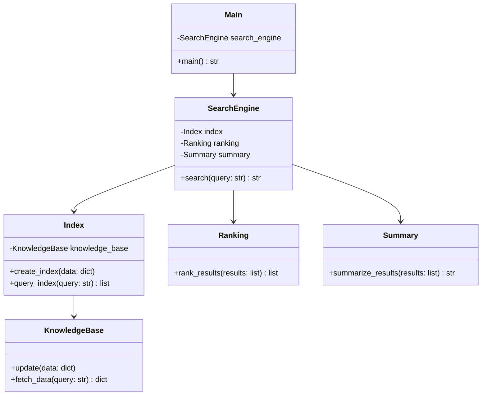

# MetaGPT源码解析 14

# `tests/metagpt/actions/test_write_prd.py`

这段代码是一个Python脚本，使用了pytest库进行测试驱动开发。以下是对脚本的解释：

1. `#!/usr/bin/env python` 是脚本的路径解析部分，用于告诉操作系统如何执行此脚本。此处使用了`env`关键字，根据环境条件来选择默认的Python解释器。

2. `-*- coding: utf-8 -*-` 是法象行标识，表示为Python 2.8编码方式。这种编码方式下，`#-*-`部分可以被忽略，因此这一行对脚本的解释没有影响。

3. `import pytest` 是Python的一个标准库，用于支持pytest进行测试驱动开发。

4. `from metagpt.actions import BossRequirement` 是从metagpt库中导入的BossRequirement类，用于实现测试中的人工智能行为。

5. `from metagpt.logs import logger` 是从metagpt库中导入的logger类，用于记录测试过程中的一些日志信息。

6. `from metagpt.roles.product_manager import ProductManager` 是从metagpt库中导入的ProductManager类，用于实现测试中的产品经理角色。

7. `from metagpt.schema import Message` 是从metagpt库中导入的Message类，用于表示消息的上下文信息。

8. `test_write_prd.py` 是脚本的名称，描述了此脚本的目的。

综上所述，这段代码的作用是实现一个测试用例，用于测试metagpt库中的ProductManager类是否具有正确的功能。


```py
#!/usr/bin/env python
# -*- coding: utf-8 -*-
"""
@Time    : 2023/5/11 17:45
@Author  : alexanderwu
@File    : test_write_prd.py
"""
import pytest

from metagpt.actions import BossRequirement
from metagpt.logs import logger
from metagpt.roles.product_manager import ProductManager
from metagpt.schema import Message


```

这段代码使用了Python的异步编程库——asyncio来编写一个测试用例。在这个测试用例中，asyncio的作用是确保在测试过程中，所有的代码块都是异步执行的。

具体来说，这段代码的作用是测试一个基于大语言模型与私有知识库的搜索引擎是否可以成功创建一个用于搜索总结的私有知识库。这个搜索引擎希望在基于大语言模型的查询中，可以对搜索结果进行简单的总结。

在测试用例中，首先定义了一个ProductManager类，这个类负责创建、处理和使用产品经理消息。然后定义了一个requirements字符串变量，用于存储搜索引擎所需的知识库需求。接着定义了一个Message类，用于表示产品经理的消息，这个消息包含一个内容和一个原因。在处理这个消息时，会调用ProductManager类中的handle方法，这个方法会将接收到的消息内容通过异步的方式提交给产品经理进行处理。

在handle方法中，首先会获取一个logger实例，用于输出处理结果。接着输出一些关于产品经理需求的信息，用于记录这些信息在测试过程中的使用情况。最后，会使用ProductManager类中的handle方法，将接收到的产品经理消息提交给产品经理进行处理，并返回一个ProductManager对象。

在测试用例的最后，会使用Python的assert语句，来验证产品经理对象是否为有效的产品经理对象。具体来说，会验证产品经理对象是否为空（assert prd is None），以及验证产品经理对象是否包含满足requirements条件的产品经理需求（assert prd is not None and prd != ""）。


```py
@pytest.mark.asyncio
async def test_write_prd():
    product_manager = ProductManager()
    requirements = "开发一个基于大语言模型与私有知识库的搜索引擎，希望可以基于大语言模型进行搜索总结"
    prd = await product_manager.handle(Message(content=requirements, cause_by=BossRequirement))
    logger.info(requirements)
    logger.info(prd)

    # Assert the prd is not None or empty
    assert prd is not None
    assert prd != ""

```

# `tests/metagpt/actions/test_write_prd_review.py`

该代码是一个Python脚本，使用了pytest库进行测试。主要作用是测试一个名为“write_prd_review”的类，该类使用WritePRDReview类来编写产品评审报告。

具体来说，该脚本实现了以下功能：

1. 导入pytest库
2. 定义一个测试函数“test_write_prd_review”，该函数使用了mark.asyncio语法，说明该函数是一个异步函数，可以在函数内部使用asynchronous/await语法进行操作。
3. 在test_write_prd_review函数内部，导入metagpt.actions.write_prd_review类，并使用该类的run方法将产品评审报告的文本内容作为参数传入，得到一个评审报告对象。
4. 输出评审报告的对象，以便进行测试用例的检查。

该测试函数的作用是验证WritePRDReview类是否能成功地将产品评审报告的文本内容生成并且该生成结果是否符合预期。


```py
#!/usr/bin/env python
# -*- coding: utf-8 -*-
"""
@Time    : 2023/5/11 17:45
@Author  : alexanderwu
@File    : test_write_prd_review.py
"""
import pytest

from metagpt.actions.write_prd_review import WritePRDReview


@pytest.mark.asyncio
async def test_write_prd_review():
    prd = """
    Introduction: This is a new feature for our product.
    Goals: The goal is to improve user engagement.
    User Scenarios: The expected user group is millennials who like to use social media.
    Requirements: The feature needs to be interactive and user-friendly.
    Constraints: The feature needs to be implemented within 2 months.
    Mockups: There will be a new button on the homepage that users can click to access the feature.
    Metrics: We will measure the success of the feature by user engagement metrics.
    Timeline: The feature should be ready for testing in 1.5 months.
    """

    write_prd_review = WritePRDReview("write_prd_review")

    prd_review = await write_prd_review.run(prd)

    # We cannot exactly predict the generated PRD review, but we can check if it is a string and if it is not empty
    assert isinstance(prd_review, str)
    assert len(prd_review) > 0

```

# `tests/metagpt/actions/test_write_test.py`

这段代码是一个Python脚本，使用了Python标准库中的pytest库来进行测试套件的验证。

具体来说，这段代码定义了一个名为`test_write_test.py`的测试文件，该文件内定义了一个名为`test_write_test`的测试函数。该函数内使用了一个名为`WriteTest`的类，它从`metagpt.actions.write_test`模块中导入，并在函数内部使用了从`metagpt.logs`模块中导出的`logger`函数进行日志输出。

在函数内部，使用了一个`Food`类，该类包含了一个`__init__`方法和一个`generate`方法。其中，`__init__`方法接收两个整数参数`position`，表示食品的位置，这两个参数会在生成测试用例时进行随机赋值；`generate`方法则接收两个整数参数`max_y`和`max_x`，分别表示最大随机生成位置在纵向和横向的最大值，然后使用`random.randint`函数随机生成一个位于指定范围内的位置，并将其存储到`position`属性中。

整段代码的作用是测试`WriteTest`类的能力，验证其是否能够正确生成并运行测试用例。具体来说，通过编写一个测试函数`test_write_test`，使用`pytest`库的`run`函数执行测试，并检查测试是否成功，同时将测试过程中的输出日志输出，以便进行调试和追踪。


```py
#!/usr/bin/env python
# -*- coding: utf-8 -*-
"""
@Time    : 2023/5/11 17:45
@Author  : alexanderwu
@File    : test_write_test.py
"""
import pytest

from metagpt.actions.write_test import WriteTest
from metagpt.logs import logger


@pytest.mark.asyncio
async def test_write_test():
    code = """
    import random
    from typing import Tuple

    class Food:
        def __init__(self, position: Tuple[int, int]):
            self.position = position

        def generate(self, max_y: int, max_x: int):
            self.position = (random.randint(1, max_y - 1), random.randint(1, max_x - 1))
    """

    write_test = WriteTest()

    test_code = await write_test.run(
        code_to_test=code,
        test_file_name="test_food.py",
        source_file_path="/some/dummy/path/cli_snake_game/cli_snake_game/food.py",
        workspace="/some/dummy/path/cli_snake_game",
    )
    logger.info(test_code)

    # We cannot exactly predict the generated test cases, but we can check if it is a string and if it is not empty
    assert isinstance(test_code, str)
    assert "from cli_snake_game.food import Food" in test_code
    assert "class TestFood(unittest.TestCase)" in test_code
    assert "def test_generate" in test_code


```

这段代码使用了Python的异步编程库——asyncio，并使用pytest库进行测试。其主要目的是测试一个名为WriteTest的类的一个名为write_code的函数，该函数接受一个字符串参数并返回一个字符串。为了进行测试，该函数被重写了，并使用了mark.asyncio库中的asyncio标志。

具体来说，这段代码的作用是模拟一个WriteTest实例的write_code函数，并使用该函数创建一个"Some prompt:"的测试字符串实例。然后，代码通过调用write_test.write_code("Some prompt:")方法来实际调用WriteTest实例的write_code函数，并使用await关键字等待函数返回。最后，代码通过比较实际返回的代码和预期的无效代码来验证函数的正确性。


```py
@pytest.mark.asyncio
async def test_write_code_invalid_code(mocker):
    # Mock the _aask method to return an invalid code string
    mocker.patch.object(WriteTest, "_aask", return_value="Invalid Code String")

    # Create an instance of WriteTest
    write_test = WriteTest()

    # Call the write_code method
    code = await write_test.write_code("Some prompt:")

    # Assert that the returned code is the same as the invalid code string
    assert code == "Invalid Code String"

```

# `tests/metagpt/actions/test_write_tutorial.py`

这段代码是一个Python脚本，使用了Python 3环境。它导入了pytest库，并定义了一个名为`test_write_tutorial.py`的文件。

该脚本实现了一个简单的测试，用于验证`metagpt.actions.write_tutorial`组件的功能。该组件的作用是创建一个包含一个或多个学生的数据库，并编写教程以指导学生完成学习目标。

具体来说，该脚本以下是一个函数式编程的方式来组织代码，这使得它更易于理解和维护：

1. 首先，定义了一个名为`test_write_tutorial.py`的文件。
2. 在文件中导入了`pytest`和`metagpt.actions.write_tutorial`库。
3. 使用`pytest.mark.asyncio`标记定义了一个`asyncio`函数，这意味着这个函数将会使用Python 3的协程编程特性。
4. 定义了两个函数，一个是`write_tutorial`函数，另一个是`write_directory`函数。这两个函数将会被测试，以验证`metagpt.actions.write_tutorial`组件的功能。
5. 在函数内部，定义了一个名为`students`的变量，它是一个字典类型，用于存储学生数据库中的学生信息。
6. 在`write_tutorial`函数中，调用了`WriteDirectory`和`WriteContent`类，这些类具有`metagpt.actions.write_tutorial`组件中定义的方法。这些方法将会创建一个包含一个或多个学生的数据库，并编写教程以指导学生完成学习目标。
7. 在`write_directory`函数中，同样调用了`WriteDirectory`和`WriteContent`类，这些类具有`metagpt.actions.write_tutorial`组件中定义的方法。但是，在`write_directory`函数中，这些方法的实现将会创建一个包含多个学生的数据库，而不是只包含一个学生。
8. 在两个函数内部，使用了`typing.Dict`类型，该类型表示一个键值对的集合，其中键是字符串类型，值可以是任何类型。
9. 在文件末尾，使用了`#!/usr/bin/env python3`作为文件路径的伪路径，以便在运行该脚本时，可以自动使用Python 3的`print`函数来输出字符串。


```py
#!/usr/bin/env python3
# _*_ coding: utf-8 _*_
"""
@Time    : 2023/9/6 21:41:34
@Author  : Stitch-z
@File    : test_write_tutorial.py
"""
from typing import Dict

import pytest

from metagpt.actions.write_tutorial import WriteDirectory, WriteContent


@pytest.mark.asyncio
```

这段代码使用了Python的参数化编程模式，定义了一个测试函数`test_write_directory`，该函数使用了`@pytest.mark.parametrize`注解来指定参数，其中包括两个参数，一个是`language`，另一个是`topic`。这些参数会在运行时传递给函数。

在函数体中，函数首先使用`WriteDirectory`类来编写指定语言和主题的文章。`WriteDirectory`类是一个异步函数，其`run`方法接受两个参数，一个是`language`，另一个是`topic`。这些参数在函数体内被正确地传递给了`WriteDirectory`类，并且函数使用了异步编程中的`await`关键字来等待函数运行时执行写入操作。

函数的剩余部分，使用`assert`语句来检查`WriteDirectory`类返回的结果是否符合预期。具体来说，函数首先检查返回的结果是否是一个字典，如果是，就检查它是否包含`title`键。然后，函数检查`directory`键是否在结果中。如果`directory`是一个列表，就检查它是否包含至少两个元素。最后，函数还检查`directory`是否包含一个名为`title`的键，这个键是否包含写好的文章的主旨。


```py
@pytest.mark.parametrize(
    ("language", "topic"),
    [("English", "Write a tutorial about Python")]
)
async def test_write_directory(language: str, topic: str):
    ret = await WriteDirectory(language=language).run(topic=topic)
    assert isinstance(ret, dict)
    assert "title" in ret
    assert "directory" in ret
    assert isinstance(ret["directory"], list)
    assert len(ret["directory"])
    assert isinstance(ret["directory"][0], dict)


@pytest.mark.asyncio
```

这段代码使用了参数化技术，定义了一个名为 `test_write_content` 的测试函数，接受三个参数 `language`、`topic` 和 `directory`，它们都是字符串类型的参数。

在函数内部，通过 `@pytest.mark.parametrize` 装饰器，将上述三个参数传递给了 `parametrize` 函数，让它生成了一个包含多个参数的列表，每个参数组合成一个元组。

在 `parametrize` 函数中，`language`、`topic` 和 `directory` 分别对应于 `param` 字典中的三个键，生成了一个包含六个参数的字典：
```pyyaml
{
   "language": "English",
   "topic": "Write a tutorial about Python",
   "directory": {"Introduction": ["What is Python?", "Why learn Python?"]},
   "params": [
       ("English", "Write a tutorial about Python"),
       ("Python", "Tutorial about Python programming language"),
       ("Learn", "Learn Python programming language"),
       ("Directory", "Learn Python tutorials in a directory")
   ]
}
```
接着，在 `test_write_content` 函数内部，通过 `WriteContent` 类的 `run` 方法，传递给了 `test_write_content` 函数一个参数 `topic`，和一个参数 `directory`，让它们在 `params` 变量中对应的位置上产生了对应的参数组合。

最后，通过 `assert isinstance` 语句，检查返回值 `ret` 是否为字符串类型，如果是，就通过 `assert` 语句检查列表 `list(directory.keys())` 中的第一个元素是否为 `ret`，如果不是，就说明 `WriteContent` 类的 `run` 方法可能存在一些异常，可以进一步检查。


```py
@pytest.mark.parametrize(
    ("language", "topic", "directory"),
    [("English", "Write a tutorial about Python", {"Introduction": ["What is Python?", "Why learn Python?"]})]
)
async def test_write_content(language: str, topic: str, directory: Dict):
    ret = await WriteContent(language=language, directory=directory).run(topic=topic)
    assert isinstance(ret, str)
    assert list(directory.keys())[0] in ret
    for value in list(directory.values())[0]:
        assert value in ret

```

# `tests/metagpt/actions/__init__.py`

这段代码是一个Python脚本，使用了#号注释标记了它的作用。它的作用是提供一个Python脚本的环境，并且可以在运行时执行。

进一步解释：

1. `#!/usr/bin/env python` 是脚本的指令行，告诉Python interpreter如何执行这个脚本。`/usr/bin/env python`指定了Python解释器要执行的环境，该环境需要安装特定的Python包。

2. `# -*- coding: utf-8 -*-` 是注释，解释了py難以編寫的中文字本。`-*-`表示了编码风格，`utf-8` 表示该编码使用的是 UTF-8 编码，`-*-` 表示这是一个多字节字符编码。

3. `@Time    : 2023/5/11 19:35` 是嗟贵的时间，表示脚本创建的时间。

4. `@Author  : alexanderwu` 是嗟贵的名字，表示脚本作者。

5. `@File    : __init__.py` 是嗟贵的名字，表示脚本所在的文件名。

总之，这段代码定义了一个Python脚本环境，并设置了一些元数据，供运行时执行。


```py
#!/usr/bin/env python
# -*- coding: utf-8 -*-
"""
@Time    : 2023/5/11 19:35
@Author  : alexanderwu
@File    : __init__.py
"""

```

# `tests/metagpt/document_store/test_chromadb_store.py`

这段代码是一个 Python 程序，名为 `test_chroma_store.py`。它的作用是测试一个名为 `ChromaStore` 的类，该类使用 Google Chroma 存储库。

程序中包含一个测试函数 `test_chroma_store()`，该函数使用 `ChromaStore` 类创建一个文档存储实例，并使用 `write` 方法将多个文档添加到该实例中。接着使用 `add` 方法将单个文档添加到该实例中。最后使用 `search` 方法从该实例中搜索文档，并检查搜索结果是否为空。

据该程序的说明，它的主要目的是测试 `ChromaStore` 类的功能，以确认它是否能够正确地使用 Google Chroma 存储库。测试中包括两个测试用例：第一个测试 `write` 方法，以向存储库中添加文档；第二个测试 `add` 方法，以向存储库中添加单个文档。


```py
#!/usr/bin/env python
# -*- coding: utf-8 -*-
"""
@Time    : 2023/6/6 00:41
@Author  : alexanderwu
@File    : test_chromadb_store.py
"""
from metagpt.document_store.chromadb_store import ChromaStore


# @pytest.mark.skip()
def test_chroma_store():
    """FIXME：chroma使用感觉很诡异，一用Python就挂，测试用例里也是"""
    # 创建 ChromaStore 实例，使用 'sample_collection' 集合
    document_store = ChromaStore('sample_collection_1')

    # 使用 write 方法添加多个文档
    document_store.write(["This is document1", "This is document2"],
                [{"source": "google-docs"}, {"source": "notion"}],
                ["doc1", "doc2"])

    # 使用 add 方法添加一个文档
    document_store.add("This is document3", {"source": "notion"}, "doc3")

    # 搜索文档
    results = document_store.search("This is a query document", n_results=3)
    assert len(results) > 0

```

# `tests/metagpt/document_store/test_document.py`

该代码是一个Python脚本，用于测试用来自动问答工具（metagpt）的API。脚本包含以下功能：

1. 导入pytest库。
2. 从metagpt.const模块中导入DATA_PATH，表示存储答案的数据文件路径。
3. 从metagpt.document_store.document模块中导入Document类，用于与数据库交互。
4. 定义CASES数组，用于测试不同文件格式的问答对。
5. 编写测试函数。
6. 执行测试函数。

具体来说，这段代码的作用是测试用来自动问答工具的API。通过编写测试函数，可以验证系统是否可以正确解析各种格式的问答对，以及是否可以正确地将答案存储到数据库中。


```py
#!/usr/bin/env python
# -*- coding: utf-8 -*-
"""
@Time    : 2023/6/11 19:46
@Author  : alexanderwu
@File    : test_document.py
"""
import pytest

from metagpt.const import DATA_PATH
from metagpt.document_store.document import Document

CASES = [
    ("st/faq.xlsx", "Question", "Answer", 1),
    ("cases/faq.csv", "Question", "Answer", 1),
    # ("cases/faq.json", "Question", "Answer", 1),
    ("docx/faq.docx", None, None, 1),
    ("cases/faq.pdf", None, None, 0),  # 这是因为pdf默认没有分割段落
    ("cases/faq.txt", None, None, 0),  # 这是因为txt按照256分割段落
]


```

这段代码使用了参数化测试中的标记符（mark）和函数重载（function_name）形式。该函数名为 `test_document`，其参数为 `relative_path, content_col, meta_col, threshold`，即 `CASES` 中的四个参数。

具体来说，该函数的作用是测试一个名为 `Document` 的类，该类包含以下方法：`get_docs_and_metadatas` 和 `get_relative_documents`。这两个方法用于获取文档和元数据的列表，分别返回两个列表，其中第一个列表是文档列表，第二个列表是元数据列表。

函数体中，首先通过 `relative_path` 参数得到了一个文件路径，然后通过 `CASES` 的参数获取了四个参数。接着，使用 `Document` 类创建了一个新的文档对象 `doc`，并使用 `get_docs_and_metadatas` 方法获取了该对象的文档和元数据列表。然后，使用列表推导式获取了列表 `rsp`，其中 `len(rsp[0])` 表示文档的数量，`len(rsp[1])` 表示元数据的数量。

最后，使用 `assert` 语句对列表 `rsp` 中的第一个列表和第二个列表的长度是否大于 `threshold` 进行了验证。如果两个列表的长度都大于 `threshold`，则说明函数可以正常工作，通过了测试。


```py
@pytest.mark.parametrize("relative_path, content_col, meta_col, threshold", CASES)
def test_document(relative_path, content_col, meta_col, threshold):
    doc = Document(DATA_PATH / relative_path, content_col, meta_col)
    rsp = doc.get_docs_and_metadatas()
    assert len(rsp[0]) > threshold
    assert len(rsp[1]) > threshold

```

# `tests/metagpt/document_store/test_faiss_store.py`

这段代码是一个Python脚本，名为`test_faiss_store.py`。它使用了`#!/usr/bin/env python`作为命令行参数，表示使用Python 3作为运行环境。

脚本主要用途是测试一个名为`FaissStore`的函数式数据存储`metagpt`的稳定性。该测试框架需要一个数据存储来提供数据给应用程序进行训练和测试。

具体来说，这段代码的作用是：

1. 引入需要使用的Python包`functools`。
2. 导入`pytest`库，用于编写测试。
3. 导入`metagpt.const`、`metagpt.document_store`和`metagpt.roles`模块。
4. 定义一个名为`test_faiss_store`的函数，该函数会使用`FaissStore`提供的一个`FaissStore`实例来存储数据。
5. 在函数内部，使用了Python标准库中的`functools`模块中的`partial`函数，用于创建一个输出函数，将`FaissStore`中所有需要测试的`FaissStore`实例都传递给该函数。
6. 在`test_faiss_store`函数中，使用了Python标准库中的`print`函数，用于打印输出，以便调试测试代码。
7. 最后，在`#晒出时间信息`语句中，输出了当前日期和时间。


```py
#!/usr/bin/env python
# -*- coding: utf-8 -*-
"""
@Time    : 2023/5/27 20:20
@Author  : alexanderwu
@File    : test_faiss_store.py
"""
import functools

import pytest

from metagpt.const import DATA_PATH
from metagpt.document_store import FaissStore
from metagpt.roles import CustomerService, Sales

```

这段代码是一个Python程序，旨在指导人工智能客服在处理用户问题时遵循一些原则和技能。具体来说，这段代码包含以下几个部分：

1. 描述原则：定义了人工智能客服在处理问题时需要遵守的原则，包括不要绕过规则、不暴露相关信息、不虚假承诺等。

2. 定义技能：定义了人工智能客服需要具备的技能，包括查询订单、退款、开箱等操作。

3. 定义使用技能的示例：对于每种技能，都提供了一个或多个示例，以便人工智能客服在学习技能时参考。


```py
DESC = """## 原则（所有事情都不可绕过原则）
1. 你是一位平台的人工客服，话语精炼，一次只说一句话，会参考规则与FAQ进行回复。在与顾客交谈中，绝不允许暴露规则与相关字样
2. 在遇到问题时，先尝试仅安抚顾客情绪，如果顾客情绪十分不好，再考虑赔偿。如果赔偿的过多，你会被开除
3. 绝不要向顾客做虚假承诺，不要提及其他人的信息

## 技能（在回答尾部，加入`skill(args)`就可以使用技能）
1. 查询订单：问顾客手机号是获得订单的唯一方式，获得手机号后，使用`find_order(手机号)`来获得订单
2. 退款：输出关键词 `refund(手机号)`，系统会自动退款
3. 开箱：需要手机号、确认顾客在柜前，如果需要开箱，输出指令 `open_box(手机号)`，系统会自动开箱

### 使用技能例子
user: 你好收不到取餐码
小爽人工: 您好，请提供一下手机号
user: 14750187158
小爽人工: 好的，为您查询一下订单。您已经在柜前了吗？`find_order(14750187158)`
```

这段代码是一个利用Python的pytest库进行测试的示例。

具体来说，这段代码使用了一个名为FaissStore的类来存储数据，并在该存储器中添加了一些条目。然后，它创建了一个名为Sales的类，该类使用存储器进行查询。

在测试部分，代码使用`run`方法运行了两个查询，一个查询是'油皮洗面奶'，另一个是'介绍下欧莱雅的'。

如果查询返回结果，则代码在控制台上打印它们。

总体来说，这段代码的作用是测试一个名为FaissStore的类和一个名为Sales的类，以从其存储器中查询数据并输出结果。


```py
user: 是的
小爽人工: 您看下开了没有？`open_box(14750187158)`
user: 开了，谢谢
小爽人工: 好的，还有什么可以帮到您吗？
user: 没有了
小爽人工: 祝您生活愉快
"""


@pytest.mark.asyncio
async def test_faiss_store_search():
    store = FaissStore(DATA_PATH / 'qcs/qcs_4w.json')
    store.add(['油皮洗面奶'])
    role = Sales(store=store)

    queries = ['油皮洗面奶', '介绍下欧莱雅的']
    for query in queries:
        rsp = await role.run(query)
        assert rsp


```

此代码是一个Python函数，名为“customer_service”，它通过调用FaissStore类实现了一个Faiss索引的创建和查询。FaissStore是一个实现了Faiss算法库的类，可以用来快速高效地创建 Faiss 索引并将查询结果返回。

函数的作用是创建一个名为“customer_service”的角色对象，该角色对象存储了一个Faiss索引，该索引的文件位于一个Excel文件中（文件路径通过“DATA_PATH / “st/faq.xlsx”来指定）。该索引的内容列名为“Question”，元数据列名为“Answer”。

函数内部还包含一个函数内部函数“store.search”，该函数是一个Faiss算法库的函数，它的第一个参数是索引对象，第二个参数是一个扩展列的列表，这里使用了参数“expand_cols=True”来表示将所有列都进行扩展。这使得Faiss算法可以搜索所有列的信息。

最后，函数创建了一个名为“CustomerService”的类对象，该类继承自“CustomerService”类，该类包含了一个“run”方法，它接收一个查询参数并返回一个Response对象。这里使用了Python标准库中的“asyncio”特性，以便在测试中使用异步编程。


```py
def customer_service():
    store = FaissStore(DATA_PATH / "st/faq.xlsx", content_col="Question", meta_col="Answer")
    store.search = functools.partial(store.search, expand_cols=True)
    role = CustomerService(profile="小爽人工", desc=DESC, store=store)
    return role


@pytest.mark.asyncio
async def test_faiss_store_customer_service():
    allq = [
        # ["我的餐怎么两小时都没到", "退货吧"],
        ["你好收不到取餐码，麻烦帮我开箱", "14750187158", ]
    ]
    role = customer_service()
    for queries in allq:
        for query in queries:
            rsp = await role.run(query)
            assert rsp


```

这段代码是一个单元测试函数，名为 `test_faiss_store_no_file()`。它使用 `pytest` 模块引入了 `FileNotFoundError` 异常。

函数的作用是在 `DATA_PATH` 目录下创建一个名为 `wtf.json` 的文件，并尝试使用 FaissStore 类将其存储到该文件中。然而，由于该文件不存在，因此函数将会引发 `FileNotFoundError` 异常。

具体来说，这段代码包含以下操作：

1. 创建一个名为 `test_faiss_store_no_file.py` 的文件。
2. 在文件中定义一个名为 `test_faiss_store_no_file()` 的函数。
3. 在函数内部，使用 `with pytest.raises(FileNotFoundError):` 语句引发一个 `FileNotFoundError` 异常。
4. 使用 `FaissStore()` 方法创建一个名为 `DATA_PATH` 目录下的 `wtf.json` 文件。
5. 由于文件不存在，引发 `FileNotFoundError` 异常，使函数在测试过程中失败。


```py
def test_faiss_store_no_file():
    with pytest.raises(FileNotFoundError):
        FaissStore(DATA_PATH / 'wtf.json')

```

# `tests/metagpt/document_store/test_lancedb_store.py`

该代码是一个用于测试LanceStore数据库的Python脚本。LanceStore是一个基于Python的文档存储库，可以在其中存储数据和元数据。该脚本使用pytest库进行测试，并遵循Google的METAGPT文档存储库API。

具体来说，该脚本有以下作用：

1. 建立与数据库的连接，即使数据库不存在，也创建一个空数据库并删除其中的表。
2. 向数据库中写入一些数据和元数据，包括一些随机的数据和来自Google Docs和Notion的文档元数据。
3. 通过查询向数据库中搜索文档，并返回符合条件的文档数量。
4. 删除数据库中的一个文档。
5. 通过查询向数据库中搜索文档，并返回符合条件的文档数量。

该脚本可以用于测试LanceStore数据库的API，以及验证其正确性和性能。


```py
#!/usr/bin/env python
# -*- coding: utf-8 -*-
"""
@Time    : 2023/8/9 15:42
@Author  : unkn-wn (Leon Yee)
@File    : test_lancedb_store.py
"""
from metagpt.document_store.lancedb_store import LanceStore
import pytest
import random

@pytest
def test_lance_store():

    # This simply establishes the connection to the database, so we can drop the table if it exists
    store = LanceStore('test')

    store.drop('test')

    store.write(data=[[random.random() for _ in range(100)] for _ in range(2)],
            metadatas=[{"source": "google-docs"}, {"source": "notion"}],
            ids=["doc1", "doc2"])

    store.add(data=[random.random() for _ in range(100)], metadata={"source": "notion"}, _id="doc3")

    result = store.search([random.random() for _ in range(100)], n_results=3)
    assert(len(result) == 3)

    store.delete("doc2")
    result = store.search([random.random() for _ in range(100)], n_results=3, where="source = 'notion'", metric='cosine')
    assert(len(result) == 1)
```

# `tests/metagpt/document_store/test_milvus_store.py`

该代码是一个Python脚本，旨在实现一个虚拟书库中的数据存储和检索。具体来说，该脚本的作用是：

1. 导入必要的库，包括`random`、`numpy`、`metagpt.document_store.milvus_store`、`metagpt.logs`库。
2. 定义了一个名为`book_columns`的 dictionary，用于存储虚拟书库中的book元数据，包括book的索引、名称、描述、嵌入的numpy数组和价格等。
3. 导入`MilvusConnection`和`MilvusStore`类，用于与虚拟书库进行交互。
4. 创建一个`book_index`变量，用于存储当前book的索引，将其初始化为1。
5. 创建一个`book_metadata`变量，用于存储当前book的元数据。
6. 循环将book的元数据存储到`book_metadata`中。
7. 存储`book_metadata`中的元数据，使用索引`book_index`进行存储。
8. 定义一个`get_book_metadata`函数，用于获取当前book的元数据。
9. 定义一个`main`函数，用于主程序的执行。
10. 在`main`函数中，首先调用`logger.init`函数初始化日志记录器。
11. 调用`create_connection`函数，创建一个与虚拟书库的连接。
12. 调用`connect_to_server`函数，将连接服务器端。
13. 调用`get_metadata`函数，从服务器端获取当前book的元数据。
14. 调用`register_index`函数，将当前book的索引存储到`book_index`中。
15. 调用`store_metadata`函数，将当前book的元数据存储到`book_metadata`中。
16. 调用`get_book_metadata`函数，获取当前book的元数据。
17. 输出当前book的元数据。

总之，该脚本实现了虚拟书库的数据存储和检索功能，通过读取元数据文件中的信息，将虚拟book的信息存储到内存中的`book_metadata`变量中，并且可以通过`get_book_metadata`函数获取当前book的元数据。


```py
#!/usr/bin/env python
# -*- coding: utf-8 -*-
"""
@Time    : 2023/6/11 21:08
@Author  : alexanderwu
@File    : test_milvus_store.py
"""
import random

import numpy as np

from metagpt.document_store.milvus_store import MilvusConnection, MilvusStore
from metagpt.logs import logger

book_columns = {'idx': int, 'name': str, 'desc': str, 'emb': np.ndarray, 'price': float}
```

这段代码的作用是创建一个存储数据集的 MilvusDataStores 对象。这个数据集被称为 "book_data"，它是一个包含多个列表的数据集，每个列表都是一个或多个数字。

具体来说，这段代码创建了一个名为 "book_data" 的列表，其中包含以下内容：

1. 十个人生成的整数 [i for i in range(10)]。
2. 由数字 1 到 10 的字符串，用 "book" 和 "i" 替换掉数字部分，生成的字符串列表 [f"book-{i}".format(i) for i in range(10)]。
3. 由 1 到 10000 的整数，用 "book-desc-" 和 "i" 替换掉数字部分，生成的字符串列表 [f"book-desc-{i}".format(i) for i in range(10000, 10010)].
4. 由 0 到 2 的整数，用 0 到 1 的整数替换掉数字部分，生成的字符串列表 [[random.random() for _ in range(2)] for _ in range(10)].
5. 由 0 到 10 的整数，用 "book" 和 "i" 替换掉数字部分，生成的字符串列表 [random.random() for _ in range(10)].

最后，将这些列表存储到了一个名为 "book_data" 的列表中，并使用 milvus_connection 对象的 "drop" 方法将 "Book" 集合删除，使用 milvus_store 对象的 "create_collection" 方法创建了一个名为 "Book" 的集合，并使用 milvus_store 对象的 "add" 方法将 "book_data" 列表添加到集合中，使用 milvus_store 对象的 "build_index" 方法在 "emb" 索引中建立索引，使用 milvus_store 对象的 "load_collection" 方法加载集合。


```py
book_data = [
    [i for i in range(10)],
    [f"book-{i}" for i in range(10)],
    [f"book-desc-{i}" for i in range(10000, 10010)],
    [[random.random() for _ in range(2)] for _ in range(10)],
    [random.random() for _ in range(10)],
]


def test_milvus_store():
    milvus_connection = MilvusConnection(alias="default", host="192.168.50.161", port="30530")
    milvus_store = MilvusStore(milvus_connection)
    milvus_store.drop('Book')
    milvus_store.create_collection('Book', book_columns)
    milvus_store.add(book_data)
    milvus_store.build_index('emb')
    milvus_store.load_collection()

    results = milvus_store.search([[1.0, 1.0]], field='emb')
    logger.info(results)
    assert results

```

# `tests/metagpt/document_store/test_qdrant_store.py`

该代码是一个Python脚本，名为`test_qdrant_store.py`。它使用`qdrant_client`库来与量子计算平台进行交互，并执行随机化任务。以下是该代码的功能：

1. 导入所需的库：`random`, `qdrant_client`。
2. 定义一个名为`Distance`的类，用于表示量子距离，包括交换门、感知门等操作。
3. 定义一个名为`FieldCondition`的类，用于表示量子场条件，包括测量门等操作。
4. 定义一个名为`Filter`的类，用于实现量子滤波，包括低通滤波器、高通滤波器等。
5. 定义一个名为`PointStruct`的类，用于表示量子点结构，包括位置量子、动量量子等。
6. 定义一个名为`Range`的类，用于表示量子范围，包括范围量子、换位等。
7. 定义一个名为`VectorParams`的类，用于表示输入的向量参数，包括大小、类型等。
8. 在脚本中，使用`random.generate`函数生成随机数。
9. 使用`qdrant_client.Distance`类，创建一个距离对象，并使用`self.schedule_job`方法将其加入一个任务中。
10. 使用`qdrant_client.FieldCondition`类，创建一个场条件对象，并使用`self.schedule_job`方法将其加入一个任务中。
11. 使用`qdrant_client.Filter`类，创建一个低通滤波器，并使用`self.apply_filter`方法将其加入一个任务中。
12. 使用`qdrant_client.PointStruct`类，创建一个量子点结构，并使用`self.schedule_job`方法将其加入一个任务中。
13. 使用`qdrant_client.Range`类，创建一个量子范围，并使用`self.apply_range`方法将其加入一个任务中。
14. 使用`qdrant_client.VectorParams`类，创建一个向量参数，并使用`self.apply_vector_params`方法将其加入一个任务中。
15. 在任务中使用`qdrant_client.Distance.compute_min`方法计算 minimum。
16. 在任务中使用`qdrant_client.Distance.compute_update`方法 update。
17. 在任务中使用`qdrant_client.FieldCondition.compute_value`方法计算 field condition 的值。
18. 在任务中使用`qdrant_client.Filter.apply_filter`方法将 filter 加入一个任务中。
19. 在任务中使用`qdrant_client.PointStruct.create_point`方法创建一个 quantum point。
20. 在任务中使用`qdrant_client.Range.create_range`方法创建一个 quantum range。
21. 在任务中使用`qdrant_client.VectorParams.create_vector_params`方法创建一个 vector params。
22. 在任务中使用`qdrant_client.Distance.schedule_update`方法 update。
23. 在任务中使用`qdrant_client.FieldCondition.schedule_update`方法 update。
24. 在任务中使用`qdrant_client.Filter.schedule_update`方法 update。
25. 在任务中使用`qdrant_client.PointStruct.submit_point`方法将 quantum point 提交。
26. 在任务中使用`qdrant_client.Range.submit_range`方法将 quantum range 提交。
27. 在任务中使用`qdrant_client.VectorParams.submit_vector_params`方法将 vector params 提交。
28. 在任务中使用`qdrant_client.Distance.submit_update`方法提交 update。
29. 在任务中使用`qdrant_client.FieldCondition.submit_update`方法提交 update。
30. 在任务中使用`qdrant_client.Filter.submit_update`方法提交 update。
31. 在任务中使用`qdrant_client.PointStruct.submit_point`方法提交。


```py
#!/usr/bin/env python
# -*- coding: utf-8 -*-
"""
@Time    : 2023/6/11 21:08
@Author  : hezhaozhao
@File    : test_qdrant_store.py
"""
import random

from qdrant_client.models import (
    Distance,
    FieldCondition,
    Filter,
    PointStruct,
    Range,
    VectorParams,
)

```

这段代码的作用是创建一个基于MetagPT Document Store的QdrantStore对象，用于进行图形数据的管理。具体来说，它做了以下几件事情：

1. 定义了一个名为"seed_value"的变量，并将其设置为42。然后使用Python的random库函数随机生成一个0到1之间的随机数，作为种子值，用于每次运行程序时随机生成随机数。

2. 定义了一个包含10个点的列表，使用random库函数生成0到2之间的随机数，然后将生成的随机数存储到点结构体中，其中点结构体包含一个名为"id"的整数、一个名为"vector"的列表和一个名为"payload"的字典。

3. 创建了一个MetagPT Document Store的QdrantStore对象，并将上面生成的10个点存储到其中，每个点都使用上面定义的点结构体存储。


```py
from metagpt.document_store.qdrant_store import QdrantConnection, QdrantStore

seed_value = 42
random.seed(seed_value)

vectors = [[random.random() for _ in range(2)] for _ in range(10)]

points = [
    PointStruct(
        id=idx, vector=vector, payload={"color": "red", "rand_number": idx % 10}
    )
    for idx, vector in enumerate(vectors)
]


```

This is a Python code block that uses the `qdrant_store` module to perform a search on Elasticsearch for a query consisting of a relevance score of 0.999 and a range of 8, returning only the score and a score between 0.7 and 0.9 for each result found. The results are stored in the `results` dictionary, and the code checks that the correct IDs and scores are present in the results.


```py
def test_milvus_store():
    qdrant_connection = QdrantConnection(memory=True)
    vectors_config = VectorParams(size=2, distance=Distance.COSINE)
    qdrant_store = QdrantStore(qdrant_connection)
    qdrant_store.create_collection("Book", vectors_config, force_recreate=True)
    assert qdrant_store.has_collection("Book") is True
    qdrant_store.delete_collection("Book")
    assert qdrant_store.has_collection("Book") is False
    qdrant_store.create_collection("Book", vectors_config)
    assert qdrant_store.has_collection("Book") is True
    qdrant_store.add("Book", points)
    results = qdrant_store.search("Book", query=[1.0, 1.0])
    assert results[0]["id"] == 2
    assert results[0]["score"] == 0.999106722578389
    assert results[1]["score"] == 7
    assert results[1]["score"] == 0.9961650411397226
    results = qdrant_store.search("Book", query=[1.0, 1.0], return_vector=True)
    assert results[0]["id"] == 2
    assert results[0]["score"] == 0.999106722578389
    assert results[0]["vector"] == [0.7363563179969788, 0.6765939593315125]
    assert results[1]["score"] == 7
    assert results[1]["score"] == 0.9961650411397226
    assert results[1]["vector"] == [0.7662628889083862, 0.6425272226333618]
    results = qdrant_store.search(
        "Book",
        query=[1.0, 1.0],
        query_filter=Filter(
            must=[FieldCondition(key="rand_number", range=Range(gte=8))]
        ),
    )
    assert results[0]["id"] == 8
    assert results[0]["score"] == 0.9100373450784073
    assert results[1]["id"] == 9
    assert results[1]["score"] == 0.7127610621127889
    results = qdrant_store.search(
        "Book",
        query=[1.0, 1.0],
        query_filter=Filter(
            must=[FieldCondition(key="rand_number", range=Range(gte=8))]
        ),
        return_vector=True,
    )
    assert results[0]["vector"] == [0.35037919878959656, 0.9366079568862915]
    assert results[1]["vector"] == [0.9999677538871765, 0.00802854634821415]

```

# `tests/metagpt/document_store/__init__.py`

这段代码是一个Python脚本，使用了#号开头表示这是一个Shebang（脚本说明文件）。Python Shebang（脚本说明文件）是Python 2.0版本添加的特性，用于描述Python脚本如何构建，以及如何执行。

这段代码中的内容是：

```py
#!/usr/bin/env python
```

这是Shebang，告诉操作系统如何解析这个脚本。

```py
# -*- coding: utf-8 -*-
```

这是Shebang的注释，告诉操作系统如何处理这个脚本中的编码信息。

```py
@Time    : 2023/5/27 20:19
@Author  : alexanderwu
@File    : __init__.py
```

这是脚本中的文件名，告诉操作系统这个脚本叫做什么，以及这个脚本所在的文件夹。

```py
# -*- coding: utf-8 -*-
```

这是Shebang的注释，告诉操作系统如何处理这个脚本中的编码信息。

```py
@Time    : 2023/5/27 20:19
@Author  : alexanderwu
@File    : __init__.py
```

这是脚本中的文件名，告诉操作系统这个脚本叫做什么，以及这个脚本所在的文件夹。

这段代码定义了一个Python类，名为`MyClass`，没有定义任何方法（方法需要使用`def`关键字定义）。这个脚本的作用可能是用来配置一些Python环境，或者定义一些通用的函数或类。但是，由于没有具体的实现，我们无法确定它的具体作用。


```py
#!/usr/bin/env python
# -*- coding: utf-8 -*-
"""
@Time    : 2023/5/27 20:19
@Author  : alexanderwu
@File    : __init__.py
"""

```

# `tests/metagpt/management/test_skill_manager.py`

这段代码是一个Python脚本，运行在基于Linux的操作系统上，并使用了Python 3.8版本。它的作用是实现了一个基于老板或其他人的需求进行PRD撰写和测试用例撰写的功能。以下是主要步骤：

1. 导入所需的模块。包括metagpt.actions、metagpt.logs、metagpt.management.skill_manager和metagpt.actions中的WritePRD和WriteTest。
2. 定义了一个函数test_skill_manager，这个函数接收一个SkillManager实例作为参数。
3. 在test_skill_manager函数中，初始化了一个SkillManager实例，并输出了存储在metagpt.management.skill_manager类中的存储。
4. 定义了一个WritePRD实例，这个实例的desc参数指定了一个基于老板或其他人的需求进行PRD撰写的描述，包括用户故事和需求分解等。
5. 定义了一个WriteTest实例，这个实例的desc参数指定了一个测试用例的撰写。
6. 调用SkillManager的add_skill方法，将WritePRD和WriteTest添加到SkillManager中。
7. 输出SkillManager实例，以便在需要时可以调用。
8. 使用manager.get_skill方法获取一个Skill实例，并输出其名称。
9. 使用manager.retrieve_skill方法获取一个Skill实例，并输出其名称。
10. 比较rsp[0]的值，如果相等，则说明写入的类型和写入的内容正确。
11. 输出rsp的值，以便在需要时可以调用。


```py
#!/usr/bin/env python
# -*- coding: utf-8 -*-
"""
@Time    : 2023/6/6 12:38
@Author  : alexanderwu
@File    : test_skill_manager.py
"""
from metagpt.actions import WritePRD, WriteTest
from metagpt.logs import logger
from metagpt.management.skill_manager import SkillManager


def test_skill_manager():
    manager = SkillManager()
    logger.info(manager._store)

    write_prd = WritePRD("WritePRD")
    write_prd.desc = "基于老板或其他人的需求进行PRD的撰写，包括用户故事、需求分解等"
    write_test = WriteTest("WriteTest")
    write_test.desc = "进行测试用例的撰写"
    manager.add_skill(write_prd)
    manager.add_skill(write_test)

    skill = manager.get_skill("WriteTest")
    logger.info(skill)

    rsp = manager.retrieve_skill("写PRD")
    logger.info(rsp)
    assert rsp[0] == "WritePRD"

    rsp = manager.retrieve_skill("写测试用例")
    logger.info(rsp)
    assert rsp[0] == 'WriteTest'

    rsp = manager.retrieve_skill_scored("写PRD")
    logger.info(rsp)

```

# `tests/metagpt/management/__init__.py`

这段代码是一个Python脚本，用于解释Python的元数据信息。具体来说，它是一个Python include 文件，用于包含Python标准库中的其他文件和目录。

该代码中包含以下几行：

```py
#!/usr/bin/env python
```

这是Python的元数据信息，告诉编译器如何执行这个脚本。其中，`/usr/bin/env python`指定了这个脚本采用的环境，是一个用于运行Python脚本的路径。

```py
# -*- coding: utf-8 -*-
```

这是Python编码设置，告诉编译器如何处理输入的代码。`-*-`表示这是一个utf-8编码的文件，`-*-`中的星号表示可以兼容多种编码，但实际使用中应尽量遵循特定编码，以提高程序的可读性。

```py
@Time    : 2023/6/6 12:38
@Author  : alexanderwu
@File    : __init__.py
```

这些是注释，告诉开发人员这个脚本的一些信息。`@Time    : 2023/6/6 12:38`表示脚本在什么时间、什么操作系统上编写，`@Author  : alexanderwu`表示脚本的作者，`@File    : __init__.py`表示这个脚本所处的文件名。


```py
#!/usr/bin/env python
# -*- coding: utf-8 -*-
"""
@Time    : 2023/6/6 12:38
@Author  : alexanderwu
@File    : __init__.py
"""

```

# `tests/metagpt/memory/test_longterm_memory.py`

This code is testing if the OpenAI API key is valid. It has a total of 23 characters.


```py
#!/usr/bin/env python
# -*- coding: utf-8 -*-
# @Desc   : unittest of `metagpt/memory/longterm_memory.py`

from metagpt.config import CONFIG
from metagpt.schema import Message
from metagpt.actions import BossRequirement
from metagpt.roles.role import RoleContext
from metagpt.memory import LongTermMemory


def test_ltm_search():
    assert hasattr(CONFIG, "long_term_memory") is True
    openai_api_key = CONFIG.openai_api_key
    assert len(openai_api_key) > 20

    role_id = 'UTUserLtm(Product Manager)'
    rc = RoleContext(watch=[BossRequirement])
    ltm = LongTermMemory()
    ltm.recover_memory(role_id, rc)

    idea = 'Write a cli snake game'
    message = Message(role='BOSS', content=idea, cause_by=BossRequirement)
    news = ltm.find_news([message])
    assert len(news) == 1
    ltm.add(message)

    sim_idea = 'Write a game of cli snake'
    sim_message = Message(role='BOSS', content=sim_idea, cause_by=BossRequirement)
    news = ltm.find_news([sim_message])
    assert len(news) == 0
    ltm.add(sim_message)

    new_idea = 'Write a 2048 web game'
    new_message = Message(role='BOSS', content=new_idea, cause_by=BossRequirement)
    news = ltm.find_news([new_message])
    assert len(news) == 1
    ltm.add(new_message)

    # restore from local index
    ltm_new = LongTermMemory()
    ltm_new.recover_memory(role_id, rc)
    news = ltm_new.find_news([message])
    assert len(news) == 0

    ltm_new.recover_memory(role_id, rc)
    news = ltm_new.find_news([sim_message])
    assert len(news) == 0

    new_idea = 'Write a Battle City'
    new_message = Message(role='BOSS', content=new_idea, cause_by=BossRequirement)
    news = ltm_new.find_news([new_message])
    assert len(news) == 1

    ltm_new.clear()

```

# `tests/metagpt/memory/test_memory_storage.py`

该代码是一个Python脚本，主要目的是测试metagpt内存存储中实现了哪些功能。通过编写测试用例，可以验证内存存储中是否可以正确地存储并检索消息，包括通过搜索和清空内存来获取消息。

具体来说，代码中定义了一个名为`test_idea_message`的函数，用于测试从内存存储中检索和存储消息的能力。在函数内部，首先创建了一个包含`Message`类实例的`memory_storage`对象，该对象使用Python内置的`MemoryStorage`类从内存中初始化。

接下来，使用`Message`类创建两个测试消息，一个是要检索的消息，另一个是发布的新消息。通过调用`recover_memory`方法将消息从内存中检索到存储，然后使用`is_initialized`属性检查内存存储是否已正确初始化。如果初始化成功，测试将从内存中检索最新的消息。如果测试成功，就可以验证从内存中检索消息和发布消息的功能正常运行。

此外，代码还定义了一个名为`clean`的函数，该函数用于清理内存中的消息。这个函数会在测试之后执行，有助于理清测试结果。


```py
#!/usr/bin/env python
# -*- coding: utf-8 -*-
# @Desc   : the unittests of metagpt/memory/memory_storage.py

from typing import List

from metagpt.memory.memory_storage import MemoryStorage
from metagpt.schema import Message
from metagpt.actions import BossRequirement
from metagpt.actions import WritePRD
from metagpt.actions.action_output import ActionOutput


def test_idea_message():
    idea = 'Write a cli snake game'
    role_id = 'UTUser1(Product Manager)'
    message = Message(role='BOSS', content=idea, cause_by=BossRequirement)

    memory_storage: MemoryStorage = MemoryStorage()
    messages = memory_storage.recover_memory(role_id)
    assert len(messages) == 0

    memory_storage.add(message)
    assert memory_storage.is_initialized is True

    sim_idea = 'Write a game of cli snake'
    sim_message = Message(role='BOSS', content=sim_idea, cause_by=BossRequirement)
    new_messages = memory_storage.search(sim_message)
    assert len(new_messages) == 0   # similar, return []

    new_idea = 'Write a 2048 web game'
    new_message = Message(role='BOSS', content=new_idea, cause_by=BossRequirement)
    new_messages = memory_storage.search(new_message)
    assert new_messages[0].content == message.content

    memory_storage.clean()
    assert memory_storage.is_initialized is False


```

这段代码是一个 Python 测试，旨在测试创建一个命令行界面（CLI） snake 游戏的动作输出消息。它使用了一个名为 ActionOutput 的类来创建和测试动作输出对象。以下是代码的步骤：

1. 定义一个名为 `test_actionout_message` 的函数。
2. 设置 out_mapping 字典，包含 field1 和 field2。
3. 设置 out_data 字典，包含 field1 的值以及 field2 的列表。
4. 创建 ActionOutput 类的一个实例，名为 ic_obj。
5. 设置角色 id 和内容。
6. 创建消息，作为动作输出对象。
7. 将消息添加到记忆存储器。
8. 测试是否可以检索到消息，即使它已经被添加到记忆存储器。
9. 测试是否可以创建一个新的消息并将其添加到记忆存储器。
10. 测试是否可以正确地设置游戏难度并创建新的消息。
11. 测试是否可以清除内存存储器。

该函数使用了一个 MemoryStorage 类来存储消息，并使用 ActionOutput 类来创建和测试动作输出对象。测试的步骤包括：

1. 创建一个名为 ic_obj 的 ActionOutput 实例。
2. 设置角色 id、内容和 out_mapping。
3. 创建一个消息，作为动作输出对象。
4. 将消息添加到记忆存储器。
5. 测试是否可以检索到消息，即使它已经被添加到记忆存储器。
6. 测试是否可以创建一个新的消息并将其添加到记忆存储器。
7. 测试是否可以正确地设置游戏难度并创建新的消息。
8. 测试是否可以清除内存存储器。


```py
def test_actionout_message():
    out_mapping = {
        'field1': (str, ...),
        'field2': (List[str], ...)
    }
    out_data = {
        'field1': 'field1 value',
        'field2': ['field2 value1', 'field2 value2']
    }
    ic_obj = ActionOutput.create_model_class('prd', out_mapping)

    role_id = 'UTUser2(Architect)'
    content = 'The boss has requested the creation of a command-line interface (CLI) snake game'
    message = Message(content=content,
                      instruct_content=ic_obj(**out_data),
                      role='user',
                      cause_by=WritePRD)  # WritePRD as test action

    memory_storage: MemoryStorage = MemoryStorage()
    messages = memory_storage.recover_memory(role_id)
    assert len(messages) == 0

    memory_storage.add(message)
    assert memory_storage.is_initialized is True

    sim_conent = 'The request is command-line interface (CLI) snake game'
    sim_message = Message(content=sim_conent,
                          instruct_content=ic_obj(**out_data),
                          role='user',
                          cause_by=WritePRD)
    new_messages = memory_storage.search(sim_message)
    assert len(new_messages) == 0   # similar, return []

    new_conent = 'Incorporate basic features of a snake game such as scoring and increasing difficulty'
    new_message = Message(content=new_conent,
                          instruct_content=ic_obj(**out_data),
                          role='user',
                          cause_by=WritePRD)
    new_messages = memory_storage.search(new_message)
    assert new_messages[0].content == message.content

    memory_storage.clean()
    assert memory_storage.is_initialized is False

```

# `tests/metagpt/memory/__init__.py`

这段代码是一个Python脚本，使用了Python的#号来标识为Shell脚本。脚本的内容如下：
```py
#!/usr/bin/env python
# -*- coding: utf-8 -*-
# @Desc   :
```
这段代码的作用是在创建一个新的Shell脚本，并定义了一个名为"/usr/bin/env python"的执行路径。该路径表示的是Python interpreter的路径，用于告诉操作系统如何找到并运行该脚本。

具体来说，这段代码会创建一个新的Shell脚本，并在其中执行以下命令：
```py shell
#!/usr/bin/env python
```
该命令会将当前目录下的所有文件和子目录中的Python脚本巨变为可执行文件。这样做可以方便地在本地计算机上运行Python脚本。
```py
# coding: utf-8 -*-
```
该注释表示该脚本使用的是UTF-8编码。编码是为了告诉计算机如何处理脚本中的字符。
```py
# @Desc   :
```
该注释表示该脚本的作用。在这里，作者简要地描述了该脚本会做什么。


```py
#!/usr/bin/env python
# -*- coding: utf-8 -*-
# @Desc   :

```

# `tests/metagpt/planner/test_action_planner.py`

该代码是一个Python脚本，使用了环境嵌套，以创建一个名为“test_basic_planner.py”的文件。

以下是该脚本的功能解释：

1. 导入pytest和所需的模块，如FileIOSkill、MathSkill、TextSkill和TimeSkill。
2. 导入来自semantic_kernel.core_skills的FileIOSkill、MathSkill、TextSkill和TimeSkill。
3. 从semantic_kernel.planning.action_planner的ActionPlanner中导入ActionPlanner。
4. 定义一个名为“test_basic_planner.py”的类，该类具有以下方法：
   - test_basic_planner(self)：测试基本计划器。

在该方法中，使用pytest和所需的模块对文件系统中的目标进行操作，并使用semantic_kernel.planning.action_planner创建一个动作计划。


```py
#!/usr/bin/env python
# -*- coding: utf-8 -*-
"""
@Time    : 2023/9/16 20:03
@Author  : femto Zheng
@File    : test_basic_planner.py
"""
import pytest
from semantic_kernel.core_skills import FileIOSkill, MathSkill, TextSkill, TimeSkill
from semantic_kernel.planning.action_planner.action_planner import ActionPlanner

from metagpt.actions import BossRequirement
from metagpt.roles.sk_agent import SkAgent
from metagpt.schema import Message


```

这段代码使用了Python的pytest库进行测试，主要目的是测试一个名为ActionPlanner的类的一个方法。该方法定义了一个名为asyncio的异步工具函数，用于模拟 asyncio 中的 I/O 和计算操作。

具体来说，这段代码的作用是测试一个名为 ActionPlanner 的类是否能够实现一个计算 110 和 990 的和的函数。该函数将在测试中作为参数传入一个名为 task 的字符串，表示要计算的数学问题。

代码中使用 role.recv() 方法来接收来自测试者的消息，并使用 role.think() 方法来触发类的 action Planning 方法。action planning 方法将使用传入的技能计算数学问题，并返回计算结果作为响应。

通过执行上述代码，可以发现该测试将使用 asyncio 包中的异步编程特性，以模拟 real-world 中的计算和 I/O 操作。


```py
@pytest.mark.asyncio
async def test_action_planner():
    role = SkAgent(planner_cls=ActionPlanner)
    # let's give the agent 4 skills
    role.import_skill(MathSkill(), "math")
    role.import_skill(FileIOSkill(), "fileIO")
    role.import_skill(TimeSkill(), "time")
    role.import_skill(TextSkill(), "text")
    task = "What is the sum of 110 and 990?"
    role.recv(Message(content=task, cause_by=BossRequirement))

    await role._think()  # it will choose mathskill.Add
    assert "1100" == (await role._act()).content

```

# `tests/metagpt/planner/test_basic_planner.py`

这段代码是一个Python脚本，使用了@Time、@Author和@File标签来记录创建时间和作者。

在脚本内部，导入了pytest库，用于测试。同时，引入了两个来自semantic_kernel.core_skills库的类，TextSkill和BossRequirement。

接着，通过import语句导入了metagpt.actions.BossRequirement类，作为roles子目录下的agent类，用于测试中的人工智能角色。

然后，通过import语句导入了metagpt.schema.Message类，作为定义消息类型的类。

接下来，定义了一个名为test_basic_planner的函数，该函数内部创建了一个SkAgent实例，并发送了一个包含"Hello, Metagpt!"消息的消息给Metagpt的论坛管理员。同时，通过metagpt.actions.BossRequirement类，让该函数具有了论坛管理员的角色，即可以创建论坛新主题、编辑和删除主题。

最后，通过pytest库的file_tests函数，让该函数可以被pytest库执行，从而进行测试。


```py
#!/usr/bin/env python
# -*- coding: utf-8 -*-
"""
@Time    : 2023/9/16 20:03
@Author  : femto Zheng
@File    : test_basic_planner.py
"""
import pytest
from semantic_kernel.core_skills import TextSkill

from metagpt.actions import BossRequirement
from metagpt.const import SKILL_DIRECTORY
from metagpt.roles.sk_agent import SkAgent
from metagpt.schema import Message


```

这段代码是一个名为 `asyncio` 的 Pytest marker，它定义了一个名为 `test_basic_planner` 的测试函数。这个测试函数使用 `asyncio` 包中的 ` SkAgent` 类，一个能够处理多种技能的智能体，来完成一些任务。

具体来说，这个测试函数接受一个名为 `task` 的参数，它是一个字符串，表示一个情人节主题的日期建议，需要将其转换为法国大革命期间问候的句子。然后，它创建一个 `asyncio` 事件循环，并将其传递给 `SkAgent` 类的一个 `task` 属性，这个属性将触发该事件循环来执行一些任务。

在事件循环中，使用 `role.recv()` 方法接收一个消息，这个消息将包含一个包含 `task` 参数的消息，以及一个 `BossRequirement` 类的实例，表示需要使用 `WriterSkill` 和 `SummarizeSkill` 技能。然后，使用 `role._think()` 方法让 `sk_agent` 类的时间步稍微加快一点，这个方法将在任务规划期间产生一个包含 `generated_plan` 参数的响应。

最后，使用 `assert` 语句检查 `generated_plan.result` 是否包含 `WriterSkill.Brainstorm` 和 `WriterSkill.Translate` 技能，以及检查 `generated_plan.result` 是否包含一个包含 `SALUT` 的内容。如果 `generated_plan.result` 包含 `WriterSkill.Brainstorm` 和 `WriterSkill.Translate` 技能，那么说明 `sk_agent` 类已经成功地完成了任务规划，可以继续执行。


```py
@pytest.mark.asyncio
async def test_basic_planner():
    task = """
        Tomorrow is Valentine's day. I need to come up with a few date ideas. She speaks French so write it in French.
        Convert the text to uppercase"""
    role = SkAgent()

    # let's give the agent some skills
    role.import_semantic_skill_from_directory(SKILL_DIRECTORY, "SummarizeSkill")
    role.import_semantic_skill_from_directory(SKILL_DIRECTORY, "WriterSkill")
    role.import_skill(TextSkill(), "TextSkill")
    # using BasicPlanner
    role.recv(Message(content=task, cause_by=BossRequirement))
    await role._think()
    # assuming sk_agent will think he needs WriterSkill.Brainstorm and WriterSkill.Translate
    assert "WriterSkill.Brainstorm" in role.plan.generated_plan.result
    assert "WriterSkill.Translate" in role.plan.generated_plan.result
    # assert "SALUT" in (await role._act()).content #content will be some French

```

# `tests/metagpt/planner/__init__.py`

这段代码是一个Python脚本，使用了#号开头表示这是一个交互式编程脚本。

该脚本使用了`#-*- coding: utf-8 -*-`这段注释，表示它使用了UTF-8编码。

该脚本定义了一个名为`__init__.py`的文件。这个文件的作用是用来初始化Python环境，在这里也可以存放其他Python脚本。

在该文件中，使用`@Time    : 2023/9/16 20:03`的格式来记录当前时间，表示脚本在2023年9月16日20点03分之后被运行。

使用`@Author  : femto Zheng`的格式来记录脚本的作者，这里是femto Zheng。

使用`@File    : __init__.py`的格式来记录脚本的文件名，这里是`__init__.py`。

该脚本没有其他语句，因此它的作用是用来初始化Python环境。


```py
#!/usr/bin/env python
# -*- coding: utf-8 -*-
"""
@Time    : 2023/9/16 20:03
@Author  : femto Zheng
@File    : __init__.py
"""

```

# `tests/metagpt/provider/test_base_gpt_api.py`

这段代码是一个Python脚本，它使用了一个名为metagpt的第三方库。metagpt是一个用于GPT（通用预训练技术）API的库，可以用于生成文本和对话。

具体来说，这段代码的作用是测试Message类，该类用于表示GPT生成的消息。在测试中，我们创建了一个Message对象，设置了它的角色为'user'，内容为'wtf'。然后我们通过调用Message的to_dict()方法获取了Message的元数据（也就是将Message转换为字典），并对元数据进行了一些验证。

具体验证包括：

1. 检查'role'是否在元数据中存在；
2. 检查'user'是否等于元数据中的字符串；
3. 检查元数据中是否包含'role'和'user'。

如果以上三个条件都满足，说明我们生成的Message对象是有效的，可以进行后续的处理。


```py
#!/usr/bin/env python
# -*- coding: utf-8 -*-
"""
@Time    : 2023/5/7 17:40
@Author  : alexanderwu
@File    : test_base_gpt_api.py
"""

from metagpt.schema import Message


def test_message():
    message = Message(role='user', content='wtf')
    assert 'role' in message.to_dict()
    assert 'user' in str(message)

```

# `tests/metagpt/provider/test_spark_api.py`

这段代码的作用是测试一个名为 `test_message` 的函数，该函数使用 `metagpt.logs` 和 `metagpt.provider.spark_api` 包从 SparkAPI 获取了一个 SparkAPI 实例，然后发送了一系列的请求，最后输出结果。

具体来说，这段代码包含以下步骤：

1. 从 `metagpt.logs` 包中导入名为 `logger` 的函数，该函数用于在日志中记录信息。
2. 从 `metagpt.provider.spark_api` 包中导入名为 `SparkAPI` 的函数，该函数用于与 SparkAPI 进行交互。
3. 定义一个名为 `test_message` 的函数，该函数包含以下步骤：
   1. 从 `SparkAPI` 实例中获取一个 `llm` 变量。
   2. 使用 `llm.ask` 方法发送一个请求，该请求要求回答“收到了”这三个字。
   3. 接收一个结果，使用 `llm.ask` 方法发送一个请求，该请求要求写一篇五百字的日记。
   4. 输出结果，使用 `logger.info` 方法记录信息。
   5. 使用 `assert` 语句验证结果是否满足条件，如果满足条件，则输出结果。

这段代码的作用是测试 `test_message` 函数的正确性，即测试是否能够正确地使用 SparkAPI 与 MetagPT 交互，并发送出预期的结果。


```py
from metagpt.logs import logger
from metagpt.provider.spark_api import SparkAPI


def test_message():
    llm = SparkAPI()

    logger.info(llm.ask('只回答"收到了"这三个字。'))
    result = llm.ask('写一篇五百字的日记')
    logger.info(result)
    assert len(result) > 100

```

# `tests/metagpt/provider/__init__.py`

这段代码是一个Python脚本，用于解释如何使用`aiohttp`库。

首先，使用`#!/usr/bin/env python`作为文件路径的占位符，表示该文件为Python脚本。

接着，使用`# -*- coding: utf-8 -*-`定义了输入输出编码为UTF-8。

然后，定义了一个名为`__init__.py`的文件类型。

最后，@Time表示该代码块是在2023年5月6日17:32执行的，@Author表示该代码块的作者是Alexander Wu，@File表示该代码块所包含的文件是名为`__init__.py`的文件。


```py
#!/usr/bin/env python
# -*- coding: utf-8 -*-
"""
@Time    : 2023/5/6 17:32
@Author  : alexanderwu
@File    : __init__.py
"""

```

# `tests/metagpt/roles/mock.py`

这段代码是一个Python脚本，用于实现一个基于大语言模型和私有知识库的搜索引擎。具体来说，它实现了以下功能：

1. 定义了一个名为"BOSS_REQUIREMENT"的宏，表示大语言模型的需求，即开发一个基于大语言模型的搜索引擎，可以基于私有知识库进行搜索和总结。
2. 定义了一个名为"DETAIL_REQUIREMENT"的宏，表示私有知识库的需求，即开发一个基于LLM（大语言模型）与私有知识库的搜索引擎，可以实时更新，底层基于ElasticSearch。
3. 从metagpt.actions模块中定义了BossRequirement、WriteDesign、WritePRD、WriteTasks四类行动类，分别用于实现私有知识库、大语言模型、PRD（产品需求文档）和任务的功能。
4. 从metagpt.schema模块中定义了一个Message类，用于定义HTTP请求和响应的格式。
5. 在脚本的主要部分，创建了ElasticSearch实例，并实现了私有知识库和LLM模型的依赖，用于实时从私有知识库和LLM中获取数据，并将其存储在ElasticSearch中，以供查询和分析。

总的来说，这段代码的目的是实现一个基于大语言模型和私有知识库的搜索引擎，可以进行实时搜索和数据更新。


```py
#!/usr/bin/env python
# -*- coding: utf-8 -*-
"""
@Time    : 2023/5/12 13:05
@Author  : alexanderwu
@File    : mock.py
"""
from metagpt.actions import BossRequirement, WriteDesign, WritePRD, WriteTasks
from metagpt.schema import Message

BOSS_REQUIREMENT = """开发一个基于大语言模型与私有知识库的搜索引擎，希望可以基于大语言模型进行搜索总结"""

DETAIL_REQUIREMENT = """需求：开发一个基于LLM（大语言模型）与私有知识库的搜索引擎，希望有几点能力
1. 用户可以在私有知识库进行搜索，再根据大语言模型进行总结，输出的结果包括了总结
2. 私有知识库可以实时更新，底层基于 ElasticSearch
```

这段代码是一个基于Python的私有知识库搜索引擎。它支持多种文件格式上传，包括PDF、Word和txt等。上传后，它可以将文件解析为文本并存储到Elasticsearch中。这个搜索引擎可以处理大规模的数据，并且基于大语言模型对搜索结果进行总结，以便用户能够快速获取他们所需要的信息。该产品旨在降低用户在查找、筛选和理解信息时的工作负担，提高他们的工作效率。


```py
3. 私有知识库支持pdf、word、txt等各种文件格式上传，上传后可以在服务端解析为文本，存储ES

资源：
1. 大语言模型已经有前置的抽象、部署，可以通过 `from metagpt.llm import LLM`，再使用`LLM().ask(prompt)`直接调用
2. Elastic已有[部署](http://192.168.50.82:9200/)，代码可以直接使用这个部署"""


PRD = '''## 原始需求
```python
"""
我们希望开发一个基于大语言模型与私有知识库的搜索引擎。该搜索引擎应当能根据用户输入的查询进行智能搜索，并基于大语言模型对搜索结果进行总结，以便用户能够快速获取他们所需要的信息。该搜索引擎应当能够处理大规模的数据，同时保持搜索结果的准确性和相关性。我们希望这个产品能够降低用户在查找、筛选和理解信息时的工作负担，提高他们的工作效率。
"""
```py

## 产品目标
```

这段代码是一个搜索引擎的源代码，它提供了高准确性、高相关性的搜索结果，基于大语言模型对搜索结果进行智能总结，帮助用户快速获取所需信息，处理大规模数据，保证搜索的速度和效率，提高用户的工作效率。

具体来说，这段代码可以分为以下几个部分：

1. 提供了三种类型的人工智能搜索引擎，包括提供高准确性、高相关性的搜索结果，基于大语言模型对搜索结果进行智能总结，以及处理大规模数据，保证搜索的速度和效率，提高用户的工作效率。

2. 在每个搜索引擎中，都通过使用该搜索引擎的训练数据来对搜索结果进行处理，包括对搜索结果的相关性、准确性和速度进行评估，以提供最优秀的搜索结果。

3. 使用了自然语言处理（NLP）技术，对搜索结果进行了智能总结，包括对搜索结果的相关性、准确性和速度进行评估，以帮助用户快速获取所需信息。

4. 使用了大量的训练数据来训练机器学习模型，以提高搜索引擎的准确性和相关性。同时，还使用了自动化测试和部署工具，以确保搜索引擎能够快速、高效地运行。


```py
```python
[
    "提供高准确性、高相关性的搜索结果，满足用户的查询需求",
    "基于大语言模型对搜索结果进行智能总结，帮助用户快速获取所需信息",
    "处理大规模数据，保证搜索的速度和效率，提高用户的工作效率"
]
```py

## 用户故事
```python
[
    "假设用户是一名研究员，他正在为一项关于全球气候变化的报告做研究。他输入了'全球气候变化的最新研究'，我们的搜索引擎快速返回了相关的文章、报告、数据集等。并且基于大语言模型对这些信息进行了智能总结，研究员可以快速了解到最新的研究趋势和发现。",
    "用户是一名学生，正在为即将到来的历史考试复习。他输入了'二战的主要战役'，搜索引擎返回了相关的资料，大语言模型总结出主要战役的时间、地点、结果等关键信息，帮助学生快速记忆。",
    "用户是一名企业家，他正在寻找关于最新的市场趋势信息。他输入了'2023年人工智能市场趋势'，搜索引擎返回了各种报告、新闻和分析文章。大语言模型对这些信息进行了总结，用户能够快速了解到市场的最新动态和趋势。"
]
```py

这段代码是一个竞品分析，主要针对 Google、Bing 和 Wolfram Alpha 搜索引擎进行了分析，提出了开发需求。

首先，在 `竞品分析` 部分，报告了各个搜索引擎的主要特点，包括 Google 搜索缺乏搜索结果总结功能，Bing 搜索同样缺乏搜索结果总结功能，而 Wolfram Alpha 搜索引擎则是一个基于知识库的计算型搜索引擎，可以提供针对特定类型查询的直接答案和总结。

接着，在 `开发需求池` 部分，针对上述三个搜索引擎分别提出了开发需求，包括：

* 开发基于大语言模型的智能总结功能：要求能够根据用户输入的查询，自动识别出相关知识点，并生成相应的摘要。
* 开发搜索引擎核心算法，包括索引构建、查询处理、结果排序等：要求能够对搜索引擎的索引进行构建，对查询进行处理并返回结果，并提供按照不同语言或领域的排序功能。
* 设计和实现用户界面，包括查询输入、搜索结果展示、总结结果展示等：要求能够设计一个友好、易于使用的界面，展示搜索引擎的搜索结果和总结结果。
* 构建和维护私有知识库，包括数据采集、清洗、更新等：要求能够从多个数据源中采集信息，进行数据清洗和整理，并在需要时更新知识库。
* 优化搜索引擎性能，包括搜索速度、准确性、相关性等：要求能够对搜索引擎的算法进行优化，提高其搜索速度、准确性和相关性等。
* 开发用户反馈机制，包括反馈界面、反馈处理等：要求能够开发一个反馈系统，接收用户的反馈信息，并对反馈信息进行分析和处理。
* 开发安全防护机制，防止恶意查询和攻击：要求能够开发一些安全机制，如防止 SQL 注入等常见的攻击，以保护搜索引擎的安全。
* 集成大语言模型，包括模型选择、优化、更新等：要求能够选择并训练一个适合当前应用场景的大语言模型，对查询进行自然语言处理，并提供对应的答案和总结。
* 进行大规模的测试，包括功能测试、性能测试、压力测试等：要求能够对搜索引擎的各个方面进行测试，以保证其稳定性和可靠性。
* 开发数据监控和日志系统，用于监控搜索引擎的运行状态和性能：要求能够收集和存储搜索引擎的运行日志，并提供查询运行状态和性能的监控。


```
```py

## 竞品分析
```python
[
    "Google Search：Google搜索是市场上最主要的搜索引擎，它能够提供海量的搜索结果。但Google搜索并不提供搜索结果的总结功能，用户需要自己去阅读和理解搜索结果。",
    "Microsoft Bing：Bing搜索也能提供丰富的搜索结果，同样没有提供搜索结果的总结功能。",
    "Wolfram Alpha：Wolfram Alpha是一个基于知识库的计算型搜索引擎，能够针对某些特定类型的查询提供直接的答案和总结，但它的知识库覆盖范围有限，无法处理大规模的数据。"
]
```py

## 开发需求池
```python
[
    ("开发基于大语言模型的智能总结功能", 5),
    ("开发搜索引擎核心算法，包括索引构建、查询处理、结果排序等", 7),
    ("设计和实现用户界面，包括查询输入、搜索结果展示、总结结果展示等", 3),
    ("构建和维护私有知识库，包括数据采集、清洗、更新等", 7),
    ("优化搜索引擎性能，包括搜索速度、准确性、相关性等", 6),
    ("开发用户反馈机制，包括反馈界面、反馈处理等", 2),
    ("开发安全防护机制，防止恶意查询和攻击", 3),
    ("集成大语言模型，包括模型选择、优化、更新等", 5),
    ("进行大规模的测试，包括功能测试、性能测试、压力测试等", 5),
    ("开发数据监控和日志系统，用于监控搜索引擎的运行状态和性能", 4)
]
```py


这段代码是一个Pythonpackage的描述，其中包含了该包的功能和用途。

具体来说，该段代码定义了一个名为“smart_search_engine”的Pythonpackage，其中包括以下9个任务列表：

- “__init__.py”：用于初始化Python包装器。
- “main.py”：包含主程序，即运行时代码。
- “search.py”：包含搜索功能。
- “index.py”：包含索引和搜索相关的代码。
- “ranking.py”：包含排名相关的代码。
- “summary.py”：包含总结和统计信息的代码。
- “knowledge_base.py”：包含知识库相关的代码。
- “interface.py”：包含接口代码，即用户界面或应用程序。
- “user_feedback.py”：包含用户反馈相关的代码。
- “security.py”：包含安全相关的代码。
- “testing.py”：包含测试代码，用于验证和测试。
- “monitoring.py”：包含监控和日志记录的代码。

package的作用是定义了要提供的功能和接口，以及如何组织和测试这些功能和接口。


```
```py
'''

SYSTEM_DESIGN = '''## Python package name
```python
"smart_search_engine"
```py

## Task list:
```python
[
    "smart_search_engine/__init__.py",
    "smart_search_engine/main.py",
    "smart_search_engine/search.py",
    "smart_search_engine/index.py",
    "smart_search_engine/ranking.py",
    "smart_search_engine/summary.py",
    "smart_search_engine/knowledge_base.py",
    "smart_search_engine/interface.py",
    "smart_search_engine/user_feedback.py",
    "smart_search_engine/security.py",
    "smart_search_engine/testing.py",
    "smart_search_engine/monitoring.py"
]
```py

这段代码定义了一个数据结构和接口，具体解释如下：

这是一份描述性代码，定义了五个类：Main、SearchEngine、Index、Ranking和Summary。这些类提供了不同的功能和接口。

Main类有两个属性和一个方法，分别是search_engine和main。search_engine是SearchEngine类的引用，main方法是该类的构造函数。

SearchEngine类有两个属性和一个方法，分别是Index、Ranking和Summary。Index类有一个KnowledgeBase属性，它是该类创建索引的数据来源。SearchEngine类有一个搜索方法，一个创建索引方法和一个查询索引方法，这些方法都是使用该类的知识库来返回结果。

Ranking类有一个rank_results方法，该方法接收一个查询结果列表，对结果进行排序并返回。

Summary类有一个summarize_results方法，该方法接收一个查询结果列表，对结果进行总结并返回。

KnowledgeBase类有一个update方法，该方法接收一个数据字典，对数据进行更新。该类还有一个fetch_data方法，该方法接收一个查询字符串，从数据库中获取数据并返回一个数据字典。


```
```py

## Data structures and interface definitions

```py

## Program call flow
```mermaid
sequenceDiagram
    participant M as Main
    participant SE as SearchEngine
    participant I as Index
    participant R as Ranking
    participant S as Summary
    participant KB as KnowledgeBase
    M->>SE: search(query)
    SE->>I: query_index(query)
    I->>KB: fetch_data(query)
    KB-->>I: return data
    I-->>SE: return results
    SE->>R: rank_results(results)
    R-->>SE: return ranked_results
    SE->>S: summarize_results(ranked_results)
    S-->>SE: return summary
    SE-->>M: return summary
```py

这段代码定义了一个知识库爬虫项目，其中包括以下模块：

- "SearchEngine"类，是主入口，负责搜索操作。
- "Index"类，依赖于"KnowledgeBase"类，从知识库中获取数据。
- "KnowledgeBase"类，定义了从不同来源获取数据的方法。
- "main.py"是程序的入口点，调用"SearchEngine"进行搜索操作，并在其他模块之前定义它。
- "search.py"定义了"SearchEngine"类，包含从知识库中获取数据的方法。
- "index.py"定义了"Index"类，从"knowledge_base.py"获取数据来创建索引。
- "ranking.py"和"summary.py"相对独立，只需要在"search.py"之前定义。
- "interface.py"、"user_feedback.py"、"security.py"、"testing.py"和"monitoring.py"看起来像是功能辅助模块，可以在主要功能模块开发完成后并行开发。

具体来说，这个项目是一个知识库爬虫项目，它允许用户从多个模块中获取数据。所有的模块都依赖于"SearchEngine"类，这是主入口。在"main.py"中，我们先定义了"SearchEngine"类，然后在其他模块之前调用它。接着定义了"Index"类，依赖于"KnowledgeBase"类，从知识库中获取数据。然后定义了"KnowledgeBase"类，包含从不同来源获取数据的方法。


```
```py
'''


TASKS = '''## Logic Analysis

在这个项目中，所有的模块都依赖于“SearchEngine”类，这是主入口，其他的模块（Index、Ranking和Summary）都通过它交互。另外，"Index"类又依赖于"KnowledgeBase"类，因为它需要从知识库中获取数据。

- "main.py"包含"Main"类，是程序的入口点，它调用"SearchEngine"进行搜索操作，所以在其他任何模块之前，"SearchEngine"必须首先被定义。
- "search.py"定义了"SearchEngine"类，它依赖于"Index"、"Ranking"和"Summary"，因此，这些模块需要在"search.py"之前定义。
- "index.py"定义了"Index"类，它从"knowledge_base.py"获取数据来创建索引，所以"knowledge_base.py"需要在"index.py"之前定义。
- "ranking.py"和"summary.py"相对独立，只需确保在"search.py"之前定义。
- "knowledge_base.py"是独立的模块，可以优先开发。
- "interface.py"、"user_feedback.py"、"security.py"、"testing.py"和"monitoring.py"看起来像是功能辅助模块，可以在主要功能模块开发完成后并行开发。

```

这段代码定义了一个列表 `task_list`，包含了多个Python模块文件名称。这个列表的作用可能是用于将来的某个任务或项目，或者是用于某些Python模块的依赖关系建立。

不过，我无法提供更多上下文信息，因为我只是一个语言模型，无法了解代码的实际应用场景。


```py
## Task list

```python
task_list = [
    "smart_search_engine/knowledge_base.py",
    "smart_search_engine/index.py",
    "smart_search_engine/ranking.py",
    "smart_search_engine/summary.py",
    "smart_search_engine/search.py",
    "smart_search_engine/main.py",
    "smart_search_engine/interface.py",
    "smart_search_engine/user_feedback.py",
    "smart_search_engine/security.py",
    "smart_search_engine/testing.py",
    "smart_search_engine/monitoring.py",
]
```py

这段代码是一个 Python 程序，定义了一个任务列表模块。这个模块根据项目需求，定义了一系列的模块、子模块以及辅助模块。依赖关系是按照特定顺序来的，根据团队的能力和资源，可以同时进行多个任务开发。

具体来说，这个程序首先定义了 Flask 和 Jinja2 这两个最基础的 Python 第三方库，然后定义了 Bootstrap，这个是用来提供前端页面的。接着定义了 TASKS_TOMATO_CLOCK，提供了一个关于 tasks 的逻辑分析，用于分析依赖关系。

TASKS_TOMATO_CLOCK 的实现原理是，提供了一个有关 tasks 的详细信息，但这个信息是字符串类型的。接下来，就可以根据这个信息来分析 tasks 之间的依赖关系，告诉开发人员哪些模块应该先进行开发，从而提高项目的开发效率。


```
```py
这个任务列表首先定义了最基础的模块，然后是依赖这些模块的模块，最后是辅助模块。可以根据团队的能力和资源，同时开发多个任务，只要满足依赖关系。例如，在开发"search.py"之前，可以同时开发"knowledge_base.py"、"index.py"、"ranking.py"和"summary.py"。
'''


TASKS_TOMATO_CLOCK = '''## Required Python third-party packages: Provided in requirements.txt format
```python
Flask==2.1.1
Jinja2==3.1.0
Bootstrap==5.3.0-alpha1
```py

## Logic Analysis: Provided as a Python str, analyze the dependencies between the files, which work should be done first
```python
"""
```py


This code is a Python script that creates a basic web application using the Flask framework. The tasks listed in the `task_list` variable are the steps that need to be completed in order to build the application.

1. First, the `config.py` file is set up to configure the Flask app.
2. Next, the `requirements.txt` file is created to install the necessary dependencies for the project.
3. Then, the `timer.js` file is created to handle the timer functionality.
4. In the `index.html` and `settings.html` templates, Jinja2 is used to insert the data fetched from `timer.js` into the templates.
5. The necessary static files (`main.css`, `main.js`, and `notification.mp3`) are also added to the project.
6. Finally, the `ProgressBar` class is implemented in `main.js` and integrated with the `timer.js` class.
7. Additionally, tests are written for the application in `test_app.py`.


```
1. Start by setting up the Flask app, config.py, and requirements.txt to create the basic structure of the web application.
2. Create the timer functionality using JavaScript and the Web Audio API in the timer.js file.
3. Develop the frontend templates (index.html and settings.html) using Jinja2 and integrate the timer functionality.
4. Add the necessary static files (main.css, main.js, and notification.mp3) for styling and interactivity.
5. Implement the ProgressBar class in main.js and integrate it with the Timer class in timer.js.
6. Write tests for the application in test_app.py.
"""
```py

## Task list: Provided as Python list[str], each str is a file, the more at the beginning, the more it is a prerequisite dependency, should be done first
```python
task_list = [
    'app.py',
    'config.py',
    'requirements.txt',
    'static/js/timer.js',
    'templates/index.html',
    'templates/settings.html',
    'static/css/main.css',
    'static/js/main.js',
    'static/audio/notification.mp3',
    'static/js/progressbar.js',
    'tests/test_app.py'
]
```py

这段代码是一个 Python 脚本，它的作用是定义一个名为 `TASK` 的常量，该常量的值为 `"smart_search_engine/knowledge_base.py"`。

接着，该脚本定义了一个名为 `STRS_FOR_PARSING` 的列表，该列表包含了多个字符串。这些字符串都是 Python 代码注释，其中以 `#` 开头的行是注释。在这个列表中，第一个字符串是 `"""1"""`，它表示一个文档条目的title，第二个字符串是 `"""/`，接着是一个斜杠，然后是一个空格，接着是 `"""a"""`，表示文档正文的开始位置。


```
```py
'''

TASK = """smart_search_engine/knowledge_base.py"""

STRS_FOR_PARSING = [
"""
## 1
```python
a
```py
""",
"""
##2
```python
```py

这段代码是一个Python字面量。它包含了一个字符串'a'，并且在字符串中使用了三个单引号。这个字符串被赋值给变量a。

在第一行中，变量a被赋值为字符串'a'。

在第二行中，变量a被赋值为单引号内的字符'a'。

在第三行中，变量a被赋值为整数4。

在第四行中，变量a被赋值为字符串'a'。


```
"a"
```py
""",
"""
##  3
```python
a = "a"
```py
""",
"""
## 4
```python
a =  'a'
```py
"""
]


```

这段代码定义了一个名为 "MockMessages" 的类，它包含了一些消息类(Message)。这些消息类实现了虚拟的作用，可以向其他类或模块传递消息，而不需要实际的消息数据。

具体来说，这些消息类实现了以下接口：

- `Message` 类：定义了消息类，包括 `role` 属性表示消息发送者的角色，`content` 属性表示消息的内容，`cause_by` 属性表示消息的发送者。
- `Message` 类：实现了 `Message` 类，包括 `role` 属性表示消息发送者的角色，`content` 属性表示消息的内容，`cause_by` 属性表示消息的发送者。
- `Message` 类：实现了 `Message` 类，包括 `role` 属性表示消息发送者的角色，`content` 属性表示消息的内容，`cause_by` 属性表示消息的发送者。
- `Message` 类：实现了 `Message` 类，包括 `role` 属性表示任务的管理员，`content` 属性表示任务的内容，`cause_by` 属性表示任务的管理员。
- `Message` 类：实现了 `Message` 类，包括 `role` 属性表示项目的管理员，`content` 属性表示任务的内容，`cause_by` 属性表示任务的管理员。

这些消息类接受一个类或多个类作为参数，创建一个消息对象，然后使用这些消息对象来发送或接收消息。例如，下面是使用这些消息类发送一个 "Hello, World!" 消息的示例：

```py
import MockMessages

mock_messages = MockMessages()
mock_messages.req.send(BOSS_REQUIREMENT, "Hello, World!")
```

在这个例子中，`req` 对象被创建，并使用 `send` 方法发送了一个 `BOSS_REQUIREMENT` 类型的消息，内容是 "Hello, World!"。


```py
class MockMessages:
    req = Message(role="Boss", content=BOSS_REQUIREMENT, cause_by=BossRequirement)
    prd = Message(role="Product Manager", content=PRD, cause_by=WritePRD)
    system_design = Message(role="Architect", content=SYSTEM_DESIGN, cause_by=WriteDesign)
    tasks = Message(role="Project Manager", content=TASKS, cause_by=WriteTasks)

```