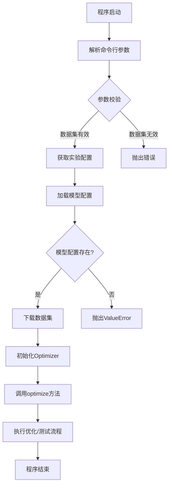
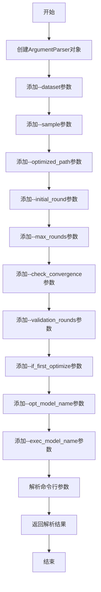
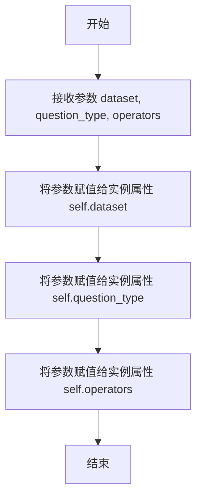

# `.\MetaGPT\examples\aflow\optimize.py` 详细设计文档

该代码是AFlow项目的入口脚本，其核心功能是解析命令行参数，根据指定的数据集配置实验参数，加载相应的模型配置，下载必要的数据，并初始化一个优化器（Optimizer）来对特定类型（如问答、数学、代码生成）的工作流进行优化或测试。

## 整体流程



## 类结构

```
ExperimentConfig (数据类)
├── dataset: str
├── question_type: str
└── operators: List[str]

Optimizer (外部导入类，负责核心优化逻辑)

ModelsConfig (外部导入类，负责模型配置管理)
```

## 全局变量及字段


### `EXPERIMENT_CONFIGS`
    
一个全局字典，用于存储不同数据集（如DROP、HotpotQA等）对应的实验配置信息，包括数据集名称、问题类型和可用的操作符列表。

类型：`Dict[str, ExperimentConfig]`
    


### `ExperimentConfig.dataset`
    
表示实验所使用的数据集名称，例如'DROP'或'GSM8K'。

类型：`str`
    


### `ExperimentConfig.question_type`
    
表示数据集对应的问题类型，例如'qa'（问答）、'math'（数学）或'code'（代码）。

类型：`str`
    


### `ExperimentConfig.operators`
    
一个字符串列表，定义了在该数据集和问题类型下可用的操作符或组件，用于构建和优化工作流。

类型：`List[str]`
    
    

## 全局函数及方法

### `parse_args`

该函数用于解析命令行参数，配置AFlow优化器的运行参数，包括数据集选择、采样数量、优化路径、迭代轮次、模型选择等。

参数：

- 无显式参数，但通过`argparse`模块从命令行接收参数

返回值：`argparse.Namespace`，包含所有解析后的命令行参数及其值的命名空间对象

#### 流程图



#### 带注释源码

```python
def parse_args():
    # 创建ArgumentParser对象，设置程序描述为"AFlow Optimizer"
    parser = argparse.ArgumentParser(description="AFlow Optimizer")
    
    # 添加--dataset参数：数据集类型，必须从预定义的EXPERIMENT_CONFIGS中选择
    parser.add_argument(
        "--dataset",
        type=str,
        choices=list(EXPERIMENT_CONFIGS.keys()),  # 可选值限制为EXPERIMENT_CONFIGS的键
        required=True,  # 该参数为必需参数
        help="Dataset type",  # 帮助信息
    )
    
    # 添加--sample参数：采样数量，默认值为4
    parser.add_argument("--sample", type=int, default=4, help="Sample count")
    
    # 添加--optimized_path参数：优化结果保存路径，默认值为"metagpt/ext/aflow/scripts/optimized"
    parser.add_argument(
        "--optimized_path",
        type=str,
        default="metagpt/ext/aflow/scripts/optimized",
        help="Optimized result save path",
    )
    
    # 添加--initial_round参数：初始轮次，默认值为1
    parser.add_argument("--initial_round", type=int, default=1, help="Initial round")
    
    # 添加--max_rounds参数：最大迭代轮次，默认值为20
    parser.add_argument("--max_rounds", type=int, default=20, help="Max iteration rounds")
    
    # 添加--check_convergence参数：是否启用早停机制，默认值为True
    parser.add_argument("--check_convergence", type=bool, default=True, help="Whether to enable early stop")
    
    # 添加--validation_rounds参数：验证轮次，默认值为5
    parser.add_argument("--validation_rounds", type=int, default=5, help="Validation rounds")
    
    # 添加--if_first_optimize参数：是否首次下载数据集，使用lambda函数将字符串转换为布尔值
    parser.add_argument(
        "--if_first_optimize",
        type=lambda x: x.lower() == "true",  # 将"true"（不区分大小写）转换为True，其他为False
        default=True,
        help="Whether to download dataset for the first time",
    )
    
    # 添加--opt_model_name参数：优化任务使用的模型名称，默认值为"claude-3-5-sonnet-20240620"
    parser.add_argument(
        "--opt_model_name",
        type=str,
        default="claude-3-5-sonnet-20240620",
        help="Specifies the name of the model used for optimization tasks.",
    )
    
    # 添加--exec_model_name参数：执行任务使用的模型名称，默认值为"gpt-4o-mini"
    parser.add_argument(
        "--exec_model_name",
        type=str,
        default="gpt-4o-mini",
        help="Specifies the name of the model used for execution tasks.",
    )
    
    # 解析命令行参数并返回结果
    return parser.parse_args()
```

### `ExperimentConfig.__init__`

初始化一个实验配置对象，用于存储特定数据集、问题类型和操作符列表的配置信息。

参数：

- `dataset`：`str`，数据集名称，例如 "DROP"、"HotpotQA" 等。
- `question_type`：`str`，问题类型，例如 "qa"、"math"、"code"。
- `operators`：`List[str]`，操作符列表，定义了在该实验配置下可用的操作符。

返回值：`None`，此方法为构造函数，不返回任何值。

#### 流程图



#### 带注释源码

```python
def __init__(self, dataset: str, question_type: str, operators: List[str]):
    # 将传入的数据集名称赋值给实例变量 self.dataset
    self.dataset = dataset
    # 将传入的问题类型赋值给实例变量 self.question_type
    self.question_type = question_type
    # 将传入的操作符列表赋值给实例变量 self.operators
    self.operators = operators
```

## 关键组件


### 实验配置管理器 (ExperimentConfig)

定义了不同数据集（DROP, HotpotQA, MATH, GSM8K, MBPP, HumanEval）对应的实验配置，包括数据集名称、问题类型（如问答、数学、代码）以及在该数据集上可用的操作符列表，用于指导优化器在不同任务上的行为。

### 命令行参数解析器 (parse_args)

解析用户通过命令行输入的参数，包括数据集选择、采样数量、优化结果保存路径、迭代轮次、收敛检查开关、模型选择等，为优化器的运行提供初始配置。

### 模型配置加载器 (ModelsConfig)

从系统配置中加载并管理不同大语言模型（如`claude-3-5-sonnet-20240620`, `gpt-4o-mini`）的配置信息，为优化器和执行器提供所需的模型参数。

### 数据下载器 (download)

根据参数决定是否首次下载实验所需的数据集和初始轮次数据，确保优化过程有可用的输入数据。

### 工作流优化器 (Optimizer)

核心优化组件，接收实验配置、模型配置、优化参数等，通过调用其`optimize`方法（支持`Graph`和`Test`模式）来执行工作流的优化、验证和测试流程。


## 问题及建议


### 已知问题

-   **硬编码的配置字典**：`EXPERIMENT_CONFIGS` 字典将数据集名称、问题类型和算子列表硬编码在代码中。这降低了代码的灵活性，增加新数据集或修改现有配置时需要直接修改源代码，违反了开闭原则。
-   **参数解析逻辑耦合**：`parse_args` 函数中的 `--dataset` 参数选项直接依赖于 `EXPERIMENT_CONFIGS` 字典的键。这种紧耦合意味着配置字典的任何更改都必须同步更新参数解析逻辑，增加了维护成本和出错风险。
-   **配置验证缺失**：代码在从 `EXPERIMENT_CONFIGS` 获取配置后，没有对配置对象 `ExperimentConfig` 的完整性或有效性进行任何验证。如果配置字典中存在错误（如缺少必要字段），程序可能在后续运行中才抛出难以追踪的异常。
-   **模型配置错误处理不充分**：当指定的 `--opt_model_name` 或 `--exec_model_name` 在 `ModelsConfig` 中找不到时，虽然会抛出 `ValueError`，但错误信息仅提示用户修改配置文件或命令行参数。对于自动化部署或缺乏直接配置文件访问权限的场景，这种处理方式不够友好，缺乏备选方案或更详细的指引。
-   **主流程缺乏异常处理与资源管理**：`__main__` 块中的核心执行流程（如下载数据、初始化 `Optimizer`、调用 `optimize` 方法）没有包裹在 `try-except` 块中。这可能导致程序因未处理的异常（如网络错误、文件权限问题、`Optimizer` 内部错误）而崩溃，且无法进行优雅的退出或资源清理（如关闭可能打开的模型连接、文件句柄）。

### 优化建议

-   **外部化配置管理**：将 `EXPERIMENT_CONFIGS` 中的实验配置移出代码，改为使用配置文件（如 JSON、YAML）或环境变量进行管理。可以创建一个专门的配置加载模块，负责读取和验证配置。这提高了配置的灵活性和可维护性，支持动态加载和热更新。
-   **解耦参数解析与配置逻辑**：重构 `parse_args` 函数，使其不直接依赖 `EXPERIMENT_CONFIGS`。例如，`--dataset` 的参数 `choices` 可以从外部配置文件动态加载，或者设计为接受任意字符串，然后在主逻辑中通过配置加载器来验证和获取对应的配置。这降低了模块间的耦合度。
-   **增强配置验证**：在从配置源（无论是代码内字典还是外部文件）加载 `ExperimentConfig` 后，应添加验证步骤。验证内容可包括：必需字段是否存在、字段类型是否正确、算子列表是否有效等。验证失败应提供清晰、具体的错误信息，便于快速定位问题。
-   **改进模型配置错误恢复机制**：当请求的模型配置不存在时，除了抛出错误，可以提供更健壮的处理方式。例如：1) 记录警告并使用一个预定义的、已知可用的默认模型配置继续执行；2) 提供模型别名映射或回退链；3) 在错误信息中直接列出当前配置文件中所有可用的模型名称，方便用户参考。
-   **增强主流程的健壮性**：在 `__main__` 块中，使用 `try-except-finally` 结构包裹核心业务逻辑。捕获可能发生的异常（如 `ValueError`, `KeyError`, `IOError`, `ConnectionError` 等），记录详细的错误日志，并根据异常类型尝试恢复或给出明确的退出状态码。在 `finally` 块中确保资源（如 `Optimizer` 实例可能持有的资源）被正确释放。这能提升程序的稳定性和可运维性。


## 其它


### 设计目标与约束

本代码模块是AFlow优化器的入口脚本，其核心设计目标是提供一个可配置、可扩展的框架，用于对不同类型（问答、数学、代码）的数据集进行工作流（Workflow）的自动化优化。主要约束包括：1) 依赖外部命令行参数进行运行时配置；2) 依赖预定义的实验配置字典 `EXPERIMENT_CONFIGS` 来映射数据集与对应的处理逻辑（问题类型、操作符列表）；3) 强依赖于 `metagpt` 框架下的 `ModelsConfig` 来获取和管理大语言模型（LLM）的配置；4) 优化过程需要预先下载数据集和初始轮次数据。

### 错误处理与异常设计

代码中显式的错误处理主要集中在对模型配置的验证上。在从 `ModelsConfig` 获取优化模型（`opt_llm_config`）和执行模型（`exec_llm_config`）的配置时，如果指定的模型名称在配置中不存在，会抛出 `ValueError` 异常，并给出清晰的错误提示，指导用户检查配置文件或命令行参数。对于其他潜在错误（如文件下载失败、`Optimizer` 初始化或运行异常），代码目前依赖于 `metagpt` 框架内部或标准Python的异常传播机制，未在入口脚本层面进行捕获和处理。

### 数据流与状态机

1.  **数据流**：
    *   **输入**：通过命令行参数传入，包括数据集选择、采样数、路径、轮次参数、模型选择等。
    *   **配置加载**：根据 `--dataset` 参数从 `EXPERIMENT_CONFIGS` 字典中获取对应的 `ExperimentConfig` 对象。根据 `--opt_model_name` 和 `--exec_model_name` 参数从 `ModelsConfig` 加载对应的LLM配置。
    *   **数据准备**：调用 `download` 函数，根据 `--if_first_optimize` 参数决定是否下载“datasets”和“initial_rounds”数据。
    *   **核心处理**：使用加载的配置初始化 `Optimizer` 对象，并调用其 `optimize` 方法，传入模式参数（当前为“Graph”）启动优化流程。`Optimizer` 内部将负责读取数据、调用LLM、执行操作符、评估结果并迭代优化。
    *   **输出**：优化结果保存到 `--optimized_path` 指定的目录中。

2.  **状态机**：
    入口脚本本身没有复杂的状态机。主要的状态转移发生在 `Optimizer` 内部，其 `optimize` 方法可能控制着不同的运行模式（如“Graph”用于优化，“Test”用于测试，当前测试行被注释）。`Optimizer` 内部可能维护着优化轮次、收敛状态、最佳工作流等状态，并根据这些状态决定是否继续迭代或提前停止（受 `--check_convergence` 和 `--validation_rounds` 参数影响）。

### 外部依赖与接口契约

1.  **外部依赖**：
    *   `argparse`：用于解析命令行参数。
    *   `metagpt.configs.models_config.ModelsConfig`：用于获取LLM的配置信息（如API密钥、base_url等）。依赖其 `default()` 和 `get(name)` 方法。
    *   `metagpt.ext.aflow.data.download_data.download`：用于下载必要的数据文件。依赖其函数签名 `download(items: List[str], if_first_download: bool)`。
    *   `metagpt.ext.aflow.scripts.optimizer.Optimizer`：核心优化器类。依赖其构造函数和 `optimize(mode: str)` 方法。

2.  **接口契约**：
    *   与 `ModelsConfig` 的契约：假设 `models.yaml`（或等效配置文件）已正确配置，且包含通过 `--opt_model_name` 和 `--exec_model_name` 指定的模型条目。
    *   与 `download` 函数的契约：假设“datasets”和“initial_rounds”是有效的下载项标识符，且函数能正确处理 `if_first_download` 逻辑。
    *   与 `Optimizer` 类的契约：假设其构造函数接受代码中列出的所有参数，并且 `optimize("Graph")` 方法能触发完整的工作流优化过程。`Optimizer` 内部对数据集格式、操作符实现等有特定要求。
    *   与用户的契约：用户必须通过命令行提供有效的 `--dataset` 值（在 `EXPERIMENT_CONFIGS` 的键中），并可选择性地调整其他参数以控制优化行为。

    