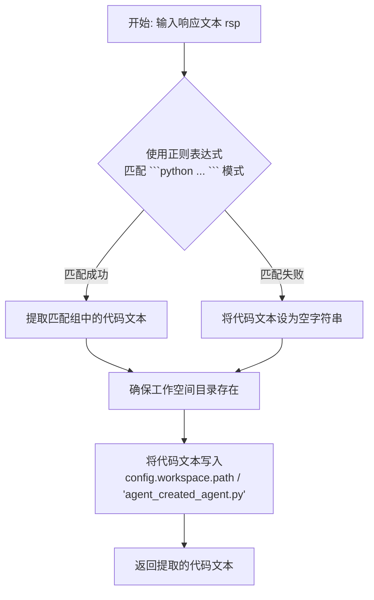
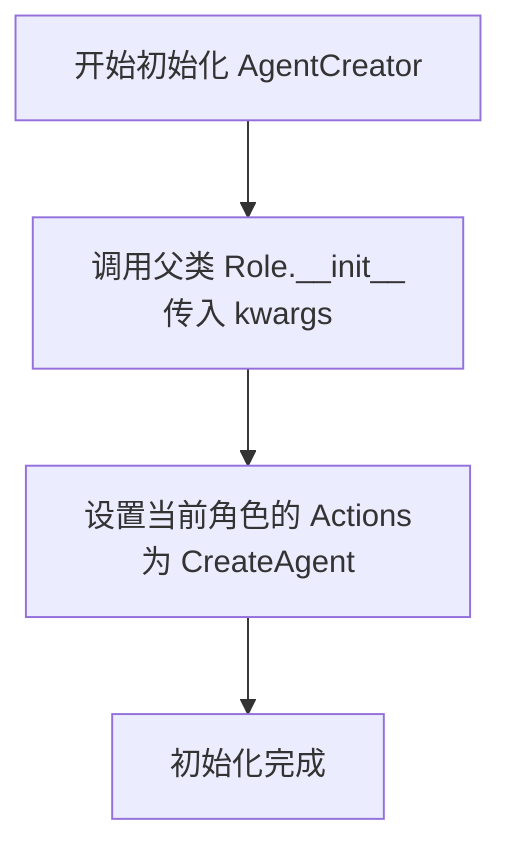
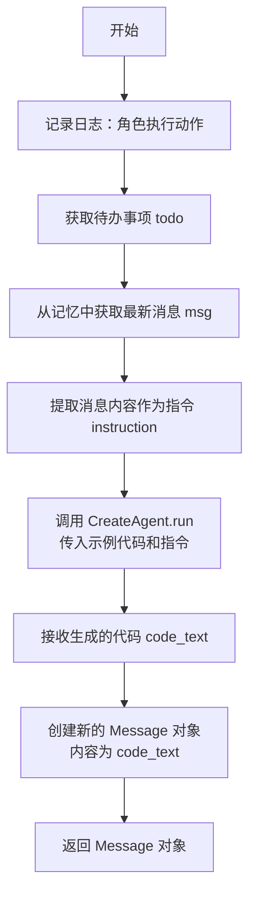

# `.\MetaGPT\examples\agent_creator.py` 详细设计文档

该代码实现了一个基于MetaGPT框架的智能体创建器（AgentCreator），它能够根据用户提供的自然语言指令，自动生成并保存一个具备特定功能（例如代码测试）的定制化智能体（Agent）的Python源代码文件。核心流程是：用户输入指令 -> AgentCreator角色调用CreateAgent动作 -> CreateAgent动作利用大语言模型（通过_aask方法）生成代码 -> 解析并保存生成的代码。

## 整体流程

```mermaid
graph TD
    A[用户运行脚本，提供指令] --> B[创建AgentCreator角色实例]
    B --> C[调用creator.run(msg)]
    C --> D[AgentCreator._act方法被触发]
    D --> E[从内存获取用户指令]
    E --> F[实例化并运行CreateAgent动作]
    F --> G[CreateAgent.run: 组装提示词]
    G --> H[CreateAgent.run: 调用_aask与LLM交互]
    H --> I[CreateAgent.run: 解析LLM返回的代码块]
    I --> J[CreateAgent.run: 将代码写入文件]
    J --> K[CreateAgent.run: 返回生成的代码文本]
    K --> L[AgentCreator._act: 包装代码文本为Message]
    L --> M[流程结束，生成agent_created_agent.py文件]
```

## 类结构

```
Action (MetaGPT框架基类)
└── CreateAgent (自定义动作类)
Role (MetaGPT框架基类)
└── AgentCreator (自定义角色类)
```

## 全局变量及字段


### `EXAMPLE_CODE_FILE`
    
指向示例代码文件 'examples/build_customized_agent.py' 的路径对象，用于读取多动作智能体代码模板。

类型：`pathlib.Path`
    


### `MULTI_ACTION_AGENT_CODE_EXAMPLE`
    
从 EXAMPLE_CODE_FILE 文件中读取的字符串内容，作为创建新智能体时的代码示例模板。

类型：`str`
    


### `CreateAgent.PROMPT_TEMPLATE`
    
一个用于生成代码生成指令的字符串模板，包含背景、示例、任务和指令等部分，指导大语言模型生成符合要求的智能体代码。

类型：`str`
    


### `AgentCreator.name`
    
智能体角色的名称，在此类中被固定为 'Matrix'，用于标识该智能体创建者的身份。

类型：`str`
    


### `AgentCreator.profile`
    
智能体角色的简介或头衔，在此类中被固定为 'AgentCreator'，描述其核心职能是创建其他智能体。

类型：`str`
    


### `AgentCreator.agent_template`
    
存储用于指导大语言模型生成新智能体代码的示例模板字符串，通常初始化为 MULTI_ACTION_AGENT_CODE_EXAMPLE。

类型：`str`
    
    

## 全局函数及方法


### `main`

`main` 函数是 `agent_creator.py` 脚本的异步入口点。它创建了一个 `AgentCreator` 角色实例，并向其发送一条指令，要求创建一个名为 `SimpleTester` 的智能体。该智能体的功能是接收任意代码片段，为其生成测试代码（使用 `pytest` 框架），保存测试文件，并运行这些测试。函数通过异步方式启动并运行整个智能体创建流程。

参数：

-  `无`：`无`，该函数不接受任何参数。

返回值：`None`，该函数不返回任何值。

#### 流程图

```mermaid
flowchart TD
    A[开始: main函数] --> B[定义异步函数 main]
    B --> C[读取示例代码模板<br>MULTI_ACTION_AGENT_CODE_EXAMPLE]
    C --> D[创建AgentCreator实例<br>传入agent_template]
    D --> E[定义指令msg<br>要求创建SimpleTester智能体]
    E --> F[异步调用creator.run(msg)]
    F --> G[结束]
```

#### 带注释源码

```
if __name__ == "__main__":
    import asyncio

    # 定义异步主函数，作为程序的入口点
    async def main():
        # 读取预定义的智能体代码示例模板
        agent_template = MULTI_ACTION_AGENT_CODE_EXAMPLE

        # 实例化一个AgentCreator角色，并传入代码模板
        creator = AgentCreator(agent_template=agent_template)

        # 定义创建智能体的具体指令
        msg = """
        Write an agent called SimpleTester that will take any code snippet (str) and do the following:
        1. write a testing code (str) for testing the given code snippet, save the testing code as a .py file in the current working directory;
        2. run the testing code.
        You can use pytest as the testing framework.
        """
        # 异步运行AgentCreator，让它根据指令创建新的智能体
        await creator.run(msg)

    # 运行异步主函数
    asyncio.run(main())
```


### `CreateAgent.run`

`CreateAgent.run` 是 `CreateAgent` 动作类的核心执行方法。它接收一个示例代码字符串和一条创建指令，通过格式化提示词模板调用大语言模型（LLM）生成符合要求的智能体（Agent）代码，然后解析并保存生成的代码，最后返回代码文本。

参数：

-  `example`：`str`，用于指导LLM生成代码的示例代码模板。
-  `instruction`：`str`，用户提供的、描述所需智能体具体功能的自然语言指令。

返回值：`str`，解析自LLM响应后得到的、符合要求的Python代码文本。

#### 流程图

```mermaid
flowchart TD
    A[开始运行 run(example, instruction)] --> B[格式化提示词模板<br>将example和instruction填入PROMPT_TEMPLATE]
    B --> C[调用LLM生成代码<br>执行 self._aask(prompt)]
    C --> D[解析LLM响应<br>调用静态方法 parse_code(rsp)]
    D --> E[保存代码文件<br>将解析出的代码写入<br>config.workspace.path / 'agent_created_agent.py']
    E --> F[返回代码文本]
    F --> G[结束]
```

#### 带注释源码

```python
async def run(self, example: str, instruction: str):
    # 1. 格式化提示词：将传入的示例代码和用户指令填充到预定义的模板中，生成完整的提示词。
    prompt = self.PROMPT_TEMPLATE.format(example=example, instruction=instruction)
    # logger.info(prompt) # 可选的日志记录，用于调试

    # 2. 调用大语言模型：使用父类Action提供的_aask方法，将格式化后的提示词发送给LLM，并获取其文本响应。
    rsp = await self._aask(prompt)

    # 3. 解析代码：调用静态方法`parse_code`，从LLM的响应文本中提取被```python ... ```包裹的代码块。
    code_text = CreateAgent.parse_code(rsp)

    # 4. 返回结果：将解析出的纯代码文本返回给调用者。
    return code_text
```


### `CreateAgent.parse_code`

这是一个静态方法，用于从大语言模型（LLM）的响应文本中提取被标记为Python代码块的内容，并将提取出的代码保存到工作空间的一个指定文件中。

参数：
- `rsp`：`str`，包含可能被标记的Python代码块的文本响应。

返回值：`str`，从响应中提取出的纯Python代码文本。如果未找到代码块，则返回空字符串。

#### 流程图



#### 带注释源码

```python
@staticmethod
def parse_code(rsp):
    # 定义正则表达式模式，用于匹配被 ```python 和 ``` 包裹的代码块。
    # re.DOTALL 标志使 '.' 匹配包括换行符在内的所有字符。
    pattern = r"```python(.*)```"
    # 在响应文本 rsp 中搜索该模式
    match = re.search(pattern, rsp, re.DOTALL)
    # 如果找到匹配项，则提取第一个捕获组（即代码内容），否则返回空字符串
    code_text = match.group(1) if match else ""
    # 确保配置中指定的工作空间路径存在，如果不存在则创建它（包括父目录）
    config.workspace.path.mkdir(parents=True, exist_ok=True)
    # 在工作空间路径下定义目标文件名为 'agent_created_agent.py'
    new_file = config.workspace.path / "agent_created_agent.py"
    # 将提取出的代码文本写入该文件
    new_file.write_text(code_text)
    # 返回提取出的代码文本
    return code_text
```

### `AgentCreator.__init__`

`AgentCreator.__init__` 方法是 `AgentCreator` 类的构造函数。它负责初始化一个 `AgentCreator` 角色实例。该方法首先调用父类 `Role` 的构造函数以完成基础初始化，然后为该角色设置其默认的 `Action` 为 `CreateAgent`。这使得 `AgentCreator` 角色在运行时能够执行创建新代理的核心逻辑。

参数：

-  `kwargs`：`dict`，可变关键字参数，用于接收并传递给父类构造函数的初始化参数。

返回值：`None`，构造函数不返回值。

#### 流程图



#### 带注释源码

```python
def __init__(self, **kwargs):
    # 调用父类 Role 的构造函数，传入所有接收到的关键字参数，完成基础的角色属性初始化。
    super().__init__(**kwargs)
    # 为当前 AgentCreator 角色设置其可执行的动作（Action）列表。
    # 这里将其唯一动作设置为 CreateAgent，使其具备根据指令生成新代理代码的能力。
    self.set_actions([CreateAgent])
```

### `AgentCreator._act`

该方法是一个异步方法，是 `AgentCreator` 角色的核心执行逻辑。它从角色的上下文中获取待办事项（`todo`）和最新的消息，提取消息内容作为指令，然后调用 `CreateAgent` 动作来生成符合指令的代理代码。最后，它将生成的代码包装成一个新的 `Message` 对象并返回。

参数：
-  `self`：`AgentCreator` 实例，表示调用该方法的角色对象。

返回值：`Message`，返回一个包含新生成代理代码的 `Message` 对象，其发送者为 `AgentCreator`，触发动作为 `todo`。

#### 流程图



#### 带注释源码

```python
async def _act(self) -> Message:
    # 记录日志，显示当前角色正在执行哪个动作
    logger.info(f"{self._setting}: to do {self.rc.todo}({self.rc.todo.name})")
    # 从角色上下文（RoleContext）中获取当前待执行的动作
    todo = self.rc.todo
    # 从角色的记忆（Memory）中获取最新的一条消息
    msg = self.rc.memory.get()[-1]

    # 将最新消息的内容作为创建新代理的指令
    instruction = msg.content
    # 异步调用 CreateAgent 动作的 run 方法
    # 传入预定义的代理模板（self.agent_template）和用户指令
    code_text = await CreateAgent().run(example=self.agent_template, instruction=instruction)
    # 将生成的代码文本包装成一个新的 Message 对象
    # 内容为生成的代码，发送者为当前角色（AgentCreator），触发原因为当前执行的动作（todo）
    msg = Message(content=code_text, role=self.profile, cause_by=todo)

    # 返回这个包含新代理代码的 Message 对象
    return msg
```

## 关键组件


### CreateAgent 类

一个用于生成自定义智能体代码的 Action 类，它通过解析用户指令和参考示例，利用大语言模型生成符合要求的 Python 代码，并自动保存到工作区文件中。

### AgentCreator 类

一个 Role 类，专门负责创建其他智能体。它内部配置了 CreateAgent 作为其执行动作，接收用户关于创建智能体的自然语言指令，并驱动 CreateAgent 完成代码生成任务。

### 代码解析与文件写入

一个静态方法 `CreateAgent.parse_code`，负责从大语言模型的文本响应中提取被 ```python ... ``` 标记包裹的代码块，并将该代码块写入到工作区的指定文件中。

### 智能体创建流程

一个完整的异步工作流程，由 `AgentCreator` 角色接收指令，触发 `CreateAgent` 动作生成代码，最终将生成的代码作为消息返回，实现了从自然语言需求到可执行智能体代码的自动化转换。


## 问题及建议


### 已知问题

-   **硬编码的示例文件路径**：`EXAMPLE_CODE_FILE` 和 `MULTI_ACTION_AGENT_CODE_EXAMPLE` 直接指向 `MetaGPT/examples/build_customized_agent.py`。这降低了代码的灵活性，使得在其他项目或环境中复用 `AgentCreator` 角色变得困难，因为它依赖于特定的文件结构和内容。
-   **硬编码的输出文件路径**：在 `CreateAgent.parse_code` 方法中，生成的代码被强制写入 `config.workspace.path / "agent_created_agent.py"`。这缺乏配置性，可能导致文件覆盖或写入到不期望的目录。
-   **潜在的代码解析失败**：`CreateAgent.parse_code` 方法使用正则表达式 `r"```python(.*)```"` 来提取代码块。如果 AI 模型的响应格式不符合预期（例如，使用了不同的标记语言如 ` ``` `，或者没有包含代码块），此方法将无法正确提取代码，导致 `code_text` 为空字符串，且可能写入一个空文件。
-   **缺乏输入验证与错误处理**：代码中没有对输入参数（如 `instruction`）进行有效性验证。`CreateAgent.run` 方法直接使用 `self._aask(prompt)` 的结果，如果 AI 响应不符合预期或为空，后续处理可能出错。同时，文件写入操作 `new_file.write_text(code_text)` 也没有异常处理。
-   **AgentCreator 角色职责单一且固定**：`AgentCreator` 角色被硬编码为只执行 `CreateAgent` 这一个动作。虽然这符合当前设计，但限制了其扩展性。如果需要创建更复杂的、包含多个步骤的智能体生成流程，当前结构需要修改。
-   **示例代码作为类属性可能造成内存浪费**：`AgentCreator` 将 `MULTI_ACTION_AGENT_CODE_EXAMPLE`（一个可能很长的字符串）作为类属性 `agent_template` 的默认值。如果创建多个 `AgentCreator` 实例，每个实例都会引用同一个字符串对象，这通常没问题，但如果需要为不同实例动态设置不同的模板，当前设计不够直观。

### 优化建议

-   **使示例和输出路径可配置**：将示例代码文件的路径和生成代理代码的输出路径作为配置项或构造函数参数。例如，可以为 `AgentCreator` 和 `CreateAgent` 增加 `example_file_path` 和 `output_file_path` 参数，提高模块的灵活性和可测试性。
-   **增强代码解析的鲁棒性**：改进 `CreateAgent.parse_code` 方法，使其能够处理更多样化的响应格式。可以尝试多种正则表达式模式，或者在提取失败时提供更清晰的错误信息或回退方案（例如，尝试提取第一个代码块，或记录原始响应以供调试）。
-   **增加输入验证与全面的错误处理**：
    -   在 `CreateAgent.run` 中，验证 `instruction` 参数是否非空且为字符串。
    -   对 `self._aask(prompt)` 的响应进行检查，确保其非空。
    -   在 `parse_code` 方法中，如果正则匹配失败，应抛出明确的异常（如 `ValueError("未能从响应中解析出代码块")`），而不是静默返回空字符串。
    -   使用 `try-except` 块包裹文件写入操作，捕获并处理 `IOError` 等异常。
-   **重构角色以支持更复杂的动作序列**：考虑将 `AgentCreator` 的设计模式改为更通用。可以使其 `_act` 方法能够根据上下文或指令，动态决定执行哪个或哪些 `Action`，而不是在 `__init__` 中固定设置一个动作。这符合智能体根据目标规划行动的理念。
-   **优化模板数据的存储与传递**：对于 `agent_template`，如果不需要每个实例拥有独立副本，保持为类属性即可。如果需要动态设置，应将其作为实例属性，并在 `__init__` 中通过参数初始化。同时，考虑如果模板内容很大，是否可以从文件惰性加载，而不是在启动时就全部读入内存。
-   **改进日志记录**：当前代码中有一行注释掉的 `# logger.info(prompt)`。考虑在调试模式下或通过配置决定是否记录完整的提示词，因为这可能包含大量文本。同时，可以在关键步骤（如开始创建、解析成功/失败、文件保存成功）添加更详细的日志，便于监控和调试流程。
-   **考虑异步上下文管理**：如果 `CreateAgent` 或 `AgentCreator` 涉及资源管理（如网络连接、文件句柄），未来可以考虑实现异步上下文管理器（`__aenter__`, `__aexit__`）来确保资源的正确获取和释放。


## 其它


### 设计目标与约束

本模块的设计目标是提供一个基于MetaGPT框架的、能够根据自然语言指令动态生成特定功能Agent的自动化工具。核心约束包括：1) 必须严格遵循MetaGPT框架的`Role`和`Action`基类规范进行扩展；2) 生成的Agent代码必须符合提供的示例模板结构，确保其能在MetaGPT环境中正确运行；3) 输入为自然语言指令，输出必须是可直接执行的Python代码字符串，并自动保存为文件；4) 整个流程需在异步环境下运行，以兼容MetaGPT的异步架构。

### 错误处理与异常设计

当前代码的错误处理较为基础，主要集中在`CreateAgent.parse_code`方法中。当LLM的响应不符合预期的代码块格式（即未包含在` ```python ... ``` `标记中）时，`re.search`可能返回`None`，导致`match.group(1)`调用抛出`AttributeError`。代码通过条件判断`if match else ""`进行了规避，但未记录或上报此错误，可能导致生成空代码文件。在`run`方法中，依赖`self._aask`与LLM交互，但未处理网络超时、API调用失败或返回内容解析异常等情况。`AgentCreator._act`方法直接使用`await`调用`CreateAgent().run`，未对可能抛出的异常进行捕获和处理，异常会直接向上传播，导致整个`Role`运行中断。

### 数据流与状态机

1.  **初始化数据流**：`AgentCreator`实例化时，通过`__init__`设置其默认行动为`CreateAgent`。`agent_template`（示例代码）作为类属性或构造函数参数传入并存储。
2.  **指令处理数据流**：
    a. 外部通过`Role.run(msg)`方法传入一个包含指令的`Message`。
    b. `Role`的内部循环机制调用`_act`方法。`_act`从最近的内存(`self.rc.memory`)中获取指令消息。
    c. `_act`调用`CreateAgent().run(example=agent_template, instruction=instruction)`，将示例模板和用户指令组合成提示词，发送给LLM。
    d. LLM返回包含代码的响应文本。
    e. `CreateAgent.parse_code`方法使用正则表达式从响应中提取代码，并将其写入`config.workspace.path / "agent_created_agent.py"`文件。
    f. 提取的代码文本被包装成一个新的`Message`对象，作为`_act`方法的返回值，最终可能被存入`Role`的记忆或作为输出。
3.  **状态机**：本模块主要遵循`Role`基类的状态机。`AgentCreator`被激活(`run`)后，其`react`循环启动。在每一轮循环中，它根据内部状态（如`rc.todo`，此处固定为`CreateAgent`）决定执行哪个`Action`（`_act`）。执行完`CreateAgent`后，生成一个包含代码的`Message`。由于未设置新的`Action`或触发停止条件，根据基类逻辑，该`Role`的任务可能就此结束或进入等待新消息的状态。

### 外部依赖与接口契约

1.  **MetaGPT框架核心**：强依赖`metagpt.actions.Action`、`metagpt.roles.Role`、`metagpt.schema.Message`基类和接口。必须实现`Action.run`和`Role._act`异步方法。
2.  **大语言模型(LLM)服务**：通过继承的`self._aask(prompt)`方法（来自`Action`基类）与LLM交互。这隐式依赖`config`中配置的LLM类型（如OpenAI GPT）及其API密钥、端点等。接口契约是输入一个字符串提示词，异步返回一个字符串响应。
3.  **文件系统**：`CreateAgent.parse_code`方法依赖`config.workspace.path`配置来确定代码文件的保存位置，并执行文件写入操作。这依赖于`pathlib.Path`和系统文件IO。
4.  **示例代码文件**：在模块加载时，从固定路径`METAGPT_ROOT / "examples/build_customized_agent.py"`读取示例代码。这是一个硬编码的路径依赖，要求该文件必须存在且可读。
5.  **正则表达式模块**：依赖Python标准库的`re`模块来解析LLM响应中的代码块。
6.  **异步运行时**：依赖`asyncio`库来运行异步的main函数。

### 安全与合规考虑

1.  **代码注入**：本模块的核心功能是生成并执行代码。`CreateAgent.parse_code`方法将LLM返回的文本直接写入`.py`文件并返回。如果LLM被恶意诱导或指令本身要求生成危险代码（如删除文件、访问网络、执行系统命令），生成的Agent被`Role`或其他机制加载运行时，将造成安全风险。当前代码没有对生成代码的内容进行任何安全审查或沙箱隔离。
2.  **依赖管理**：生成的代码可能包含`import`语句，引入第三方库。框架没有机制检查或管理这些依赖，可能导致环境冲突或引入有安全漏洞的包。
3.  **提示词泄露**：`PROMPT_TEMPLATE`中可能包含框架的示例代码。虽然当前示例是公开的，但如果模板中包含敏感信息或内部知识，直接发送给第三方LLM API存在信息泄露风险。
4.  **资源消耗**：生成的Agent可能包含无限循环或高资源消耗操作，缺乏监控和限制机制。
5.  **合规性**：生成的代码内容不受控，可能产生不符合法律法规或公司政策的内容（如爬虫、文本生成等），需要上层应用进行管控。

### 配置管理

1.  **工作空间路径**：代码生成的目标目录由`config.workspace.path`控制。这是一个全局配置，影响所有通过此模块创建的Agent代码的保存位置。其默认值或设置方式在`metagpt.config2.config`中定义。
2.  **LLM配置**：`Action._aask`方法所使用的LLM模型、参数（如temperature, max_tokens）完全依赖于MetaGPT框架的全局配置（`config.llm`）。本模块没有提供覆盖这些配置的接口。
3.  **示例模板路径**：示例代码文件的路径通过`METAGPT_ROOT / "examples/build_customized_agent.py"`硬编码。这缺乏灵活性，如果示例文件移动或需要切换不同模板，必须修改源代码。
4.  **输出文件名**：生成的文件名固定为`"agent_created_agent.py"`。多次运行会覆盖该文件，且无法通过参数指定其他名称或位置。

### 测试策略建议

1.  **单元测试**：
    *   `CreateAgent.parse_code`：应测试正常代码块提取、无代码块情况（应返回空字符串）、代码块标记不完整、多代码块等情况。
    *   `CreateAgent.run`：可模拟`self._aask`返回固定响应，测试其组合提示词和调用解析逻辑的正确性。需要模拟（mock）`_aask`方法。
    *   `AgentCreator._act`：模拟`self.rc.memory.get()`返回指令消息，并模拟`CreateAgent().run`的返回，测试其是否正确构造了返回的`Message`对象。
2.  **集成测试**：
    *   使用一个固定的、简单的指令（如“生成一个打印Hello World的Agent”），运行完整的`AgentCreator.run`流程。验证：a) 是否正确调用了LLM（可mock LLM）；b) 是否在正确位置生成了文件；c) 生成的文件内容基本符合预期结构（可通过字符串匹配或尝试导入检查语法）。
    *   测试`AgentCreator`与一个真实的、但可控的LLM（如本地测试模型或深度mock）的集成。
3.  **端到端测试**：
    *   在接近真实的环境下，输入一个复杂的指令，运行整个脚本。检查生成的Agent代码文件是否能被MetaGPT框架成功加载并执行其预期功能（需在安全隔离环境中进行）。
4.  **负面测试**：
    *   测试当LLM返回非代码、错误代码、包含危险操作代码时，系统的行为（如是否抛出异常、文件内容是什么）。
    *   测试当`config.workspace.path`不可写时的错误处理。

    