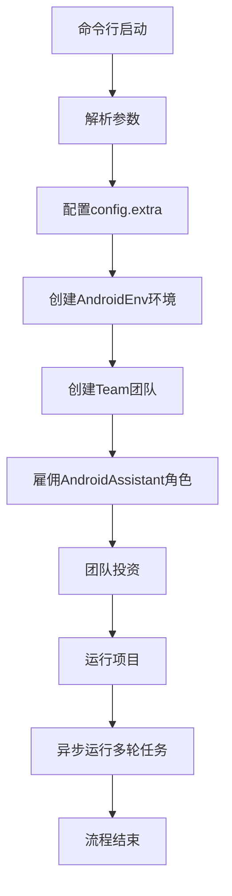
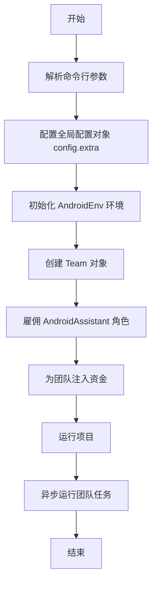
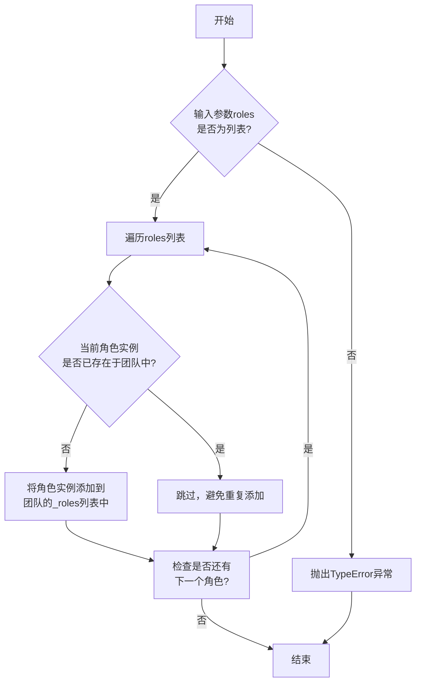
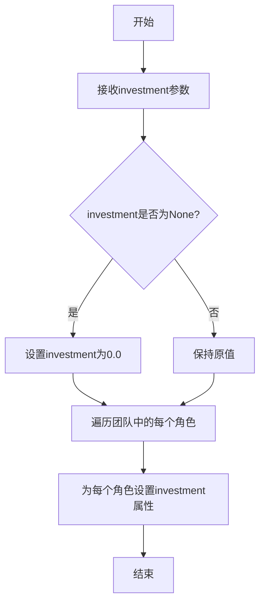
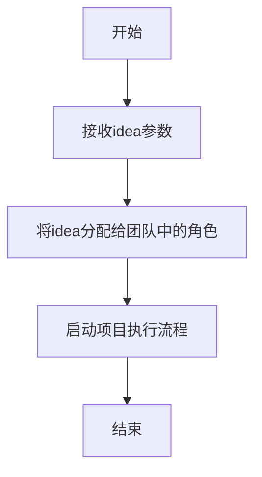
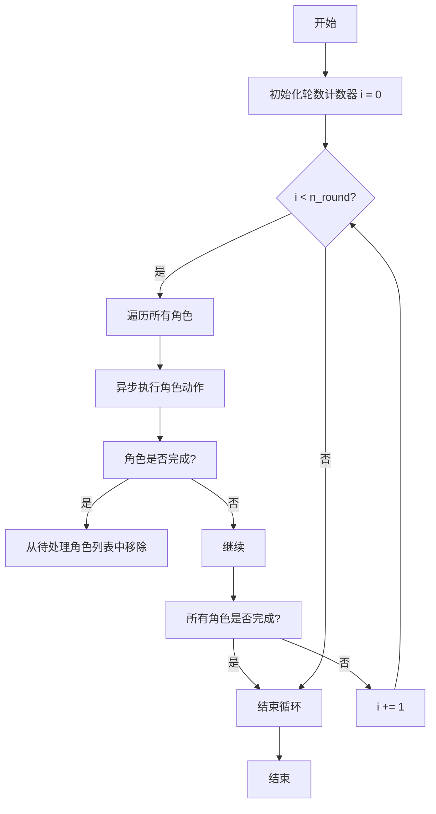

# `.\MetaGPT\examples\android_assistant\run_assistant.py` 详细设计文档

该文件是Android智能助手应用的命令行入口点，它通过配置环境、创建团队并雇佣AndroidAssistant角色，来执行在Android设备上学习或执行指定任务（如应用操作）的流程。

## 整体流程



## 类结构

```
Typer App (CLI框架)
├── startup (主命令函数)
├── Team (MetaGPT团队类)
│   ├── hire (雇佣角色)
│   ├── invest (投资)
│   ├── run_project (运行项目)
│   └── run (异步运行)
├── AndroidEnv (Android环境类)
└── AndroidAssistant (Android助手角色类)
```

## 全局变量及字段


### `app`
    
Typer应用实例，用于定义和运行命令行接口（CLI）命令。

类型：`typer.Typer`
    


### `config`
    
全局配置对象，用于存储和管理应用程序的配置信息。

类型：`metagpt.config2.config`
    


    

## 全局函数及方法

### `startup`

`startup` 函数是 Android Assistant 应用的命令行入口点，负责解析用户输入、配置环境、初始化团队并启动任务执行流程。

参数：

- `task_desc`：`str`，希望 Android Assistant 学习或执行的任务描述
- `n_round`：`int`，执行应用操作任务的最大轮数，默认为 20
- `stage`：`str`，运行阶段：`learn`（学习）或 `act`（执行），默认为 `learn`
- `mode`：`str`，模式：`auto`（自动）或 `manual`（手动），仅在 `stage=learn` 时有效，默认为 `auto`
- `app_name`：`str`，要运行的应用程序名称，默认为 `demo`
- `investment`：`float`，投资于 AI 公司的美元金额，默认为 5.0
- `refine_doc`：`bool`，如果为 `True`，则基于最新观察结果优化现有操作文档，默认为 `False`
- `min_dist`：`int`，标记过程中防止元素重叠的最小距离，默认为 30
- `android_screenshot_dir`：`str`，Android 设备上存储截图的路径，确保该路径存在，默认为 `/sdcard/Pictures/Screenshots`
- `android_xml_dir`：`str`，存储用于确定 UI 元素位置的 XML 文件的路径，确保该路径存在，默认为 `/sdcard`
- `device_id`：`str`，Android 设备 ID，默认为 `emulator-5554`

返回值：`None`，无返回值

#### 流程图



#### 带注释源码

```python
@app.command("", help="Run a Android Assistant")
def startup(
    task_desc: str = typer.Argument(help="the task description you want the android assistant to learn or act"),
    n_round: int = typer.Option(default=20, help="The max round to do an app operation task."),
    stage: str = typer.Option(default="learn", help="stage: learn / act"),
    mode: str = typer.Option(default="auto", help="mode: auto / manual , when state=learn"),
    app_name: str = typer.Option(default="demo", help="the name of app you want to run"),
    investment: float = typer.Option(default=5.0, help="Dollar amount to invest in the AI company."),
    refine_doc: bool = typer.Option(
        default=False, help="Refine existing operation docs based on the latest observation if True."
    ),
    min_dist: int = typer.Option(
        default=30, help="The minimum distance between elements to prevent overlapping during the labeling process."
    ),
    android_screenshot_dir: str = typer.Option(
        default="/sdcard/Pictures/Screenshots",
        help="The path to store screenshots on android device. Make sure it exists.",
    ),
    android_xml_dir: str = typer.Option(
        default="/sdcard",
        help="The path to store xml files for determining UI elements localtion. Make sure it exists.",
    ),
    device_id: str = typer.Option(default="emulator-5554", help="The Android device_id"),
):
    # 将命令行参数存储到全局配置对象的 extra 字段中，供后续组件使用
    config.extra = {
        "stage": stage,
        "mode": mode,
        "app_name": app_name,
        "task_desc": task_desc,
        "refine_doc": refine_doc,
        "min_dist": min_dist,
        "android_screenshot_dir": android_screenshot_dir,
        "android_xml_dir": android_xml_dir,
        "device_id": device_id,
    }

    # 初始化 Android 环境，连接到指定设备，并设置 XML 和截图存储路径
    team = Team(
        env=AndroidEnv(
            device_id=device_id,
            xml_dir=Path(android_xml_dir),
            screenshot_dir=Path(android_screenshot_dir),
        )
    )

    # 雇佣 AndroidAssistant 角色，该角色是执行具体任务的核心
    team.hire([AndroidAssistant(output_root_dir=Path(__file__).parent)])
    # 为团队注入资金，这可能影响资源分配或角色行为
    team.invest(investment)
    # 启动项目，传入任务描述作为项目核心理念
    team.run_project(idea=task_desc)
    # 异步运行团队任务，指定最大执行轮数
    asyncio.run(team.run(n_round=n_round))
```

### `Team.hire`

该方法用于向团队中雇佣（添加）一个或多个角色（Role）实例，使其成为团队的成员，参与后续的项目执行与协作。

参数：
- `roles`：`list[Role]`，一个包含要雇佣的`Role`类实例的列表。

返回值：`None`，无返回值。

#### 流程图



#### 带注释源码

```python
def hire(self, roles: list[Role]):
    """
    雇佣（添加）一个或多个角色到团队中。
    
    参数:
        roles (list[Role]): 要添加到团队的角色实例列表。
        
    异常:
        TypeError: 如果`roles`参数不是列表类型。
    """
    # 参数类型检查：确保输入是一个列表
    if not isinstance(roles, list):
        raise TypeError("Roles should be a list of Role instances.")
    
    # 遍历传入的角色列表
    for role in roles:
        # 检查当前角色是否已经存在于团队的成员列表中，避免重复添加
        if role not in self._roles:
            # 如果角色不存在，则将其添加到团队的_roles列表中
            self._roles.append(role)
```

### `Team.invest`

该方法用于为团队注入资金，设置每个角色的投资金额，从而影响其决策和行动。

参数：

- `investment`：`float`，要注入的资金金额（美元）

返回值：`None`，无返回值

#### 流程图



#### 带注释源码

```python
def invest(self, investment: float):
    """
    为团队注入资金，设置每个角色的投资金额。

    Args:
        investment (float): 要注入的资金金额（美元）
    """
    # 如果investment为None，则默认为0.0
    if investment is None:
        investment = 0.0
    
    # 遍历团队中的所有角色
    for role in self.roles:
        # 为每个角色设置investment属性
        role.investment = investment
```

### `Team.run_project`

该方法用于启动并运行一个项目，接收一个项目想法（idea）作为输入，将其分配给团队中的角色，并启动项目的执行流程。

参数：

- `idea`：`str`，项目的核心描述或目标，用于指导团队执行任务。

返回值：`None`，该方法不返回任何值。

#### 流程图



#### 带注释源码

```python
def run_project(self, idea: str):
    """
    启动并运行一个项目。

    该方法接收一个项目想法（idea），将其分配给团队中的角色，并启动项目的执行流程。

    Args:
        idea (str): 项目的核心描述或目标，用于指导团队执行任务。

    Returns:
        None: 该方法不返回任何值。
    """
    # 将项目想法分配给团队中的角色
    self.idea = idea
    # 启动项目执行流程
    self.start_project()
```

### `Team.run`

该方法用于启动团队中所有角色的异步执行流程，通过循环运行每个角色的动作，直到达到指定的最大轮数或所有角色完成其任务。

参数：

- `n_round`：`int`，指定团队运行的最大轮数，默认为10。

返回值：`None`，无返回值。

#### 流程图



#### 带注释源码

```python
async def run(self, n_round: int = 10):
    """
    运行团队中所有角色的异步执行流程。

    该方法通过循环执行每个角色的动作，直到达到指定的最大轮数或所有角色完成其任务。
    在每一轮中，它会遍历所有角色，并异步执行其动作。如果某个角色完成其任务，
    则将其从待处理角色列表中移除。当所有角色都完成或达到最大轮数时，循环结束。

    Args:
        n_round (int): 团队运行的最大轮数，默认为10。

    Returns:
        None: 无返回值。
    """
    for i in range(n_round):  # 循环执行指定轮数
        if not self.roles:  # 如果没有待处理的角色，则结束循环
            break
        for role in list(self.roles):  # 遍历所有角色（使用list复制以避免修改问题）
            await role.run()  # 异步执行角色的动作
            if role.rc.is_idle:  # 如果角色完成其任务（处于空闲状态）
                self.roles.remove(role)  # 从待处理角色列表中移除该角色
```

## 关键组件


### AndroidEnv

Android环境封装，负责与Android设备交互，包括获取屏幕截图和UI布局XML文件，为智能体提供操作环境。

### AndroidAssistant

Android智能体角色，负责在Android环境中执行学习或操作任务，根据任务描述生成操作指令并执行。

### Team

团队管理组件，负责组织和管理多个角色（如AndroidAssistant），协调任务执行流程，包括环境设置、角色雇佣、资金投入和项目运行。

### 配置管理

通过`config.extra`动态传递运行时参数（如阶段、模式、应用名称、任务描述等），实现灵活的任务配置和环境设置。

### 异步任务运行

使用`asyncio.run(team.run(n_round=n_round))`实现异步任务执行，支持多轮次操作，提高任务执行效率。

### 命令行接口

通过Typer库提供命令行接口，支持参数化启动Android智能体，包括任务描述、轮次、阶段、模式等选项。


## 问题及建议


### 已知问题

-   **异步运行模式不明确**：`team.run_project` 和 `asyncio.run(team.run(...))` 的调用顺序可能存在问题。`run_project` 可能是一个同步方法，而 `team.run` 是异步的。直接在主线程中混合调用可能引发事件循环问题，尤其是在脚本被多次导入或调用时。
-   **配置管理耦合度高**：所有运行时参数都通过 `config.extra` 字典注入全局配置对象。这种方式使得配置分散且难以追踪，破坏了配置的封装性，并增加了组件间的隐式耦合。
-   **错误处理与资源清理缺失**：代码中没有显式的异常处理逻辑（如 `try...except` 块）。如果 `AndroidEnv` 初始化失败、设备连接中断或团队运行过程中出现异常，程序会直接崩溃，且可能不会正确清理已占用的资源（如设备连接、临时文件）。
-   **路径验证缺失**：`android_screenshot_dir` 和 `android_xml_dir` 参数作为字符串传入，并直接转换为 `Path` 对象，但代码未验证这些路径在Android设备上是否真实存在或可访问。这可能导致后续操作因路径无效而失败。
-   **参数默认值可能不适用**：`device_id` 的默认值为 `"emulator-5554"`，这假设了特定的模拟器环境。在实际物理设备或多模拟器场景下，用户必须显式指定，否则会运行失败，但错误提示可能不够清晰。
-   **`refine_doc` 参数作用不清晰**：虽然 `refine_doc` 被传递到配置中，但在当前代码片段中，没有展示 `AndroidAssistant` 或其它组件如何具体使用这个标志位来“优化现有操作文档”。这可能导致功能未实现或行为不一致。

### 优化建议

-   **重构异步执行流程**：明确异步边界。建议将 `startup` 函数本身定义为 `async def startup_async`，并在其中使用 `await team.run(n_round=n_round)`。然后，通过 `asyncio.run(startup_async(...))` 或在 `app.command` 装饰的函数内封装异步调用逻辑，以确保事件循环的正确管理。
-   **引入配置对象**：创建一个专用的配置类（如 `AndroidAssistantConfig`），将 `stage`, `mode`, `app_name` 等参数作为其属性。在初始化 `Team` 和 `AndroidAssistant` 时，显式传递这个配置对象实例，替代对全局 `config.extra` 的依赖，提高代码的可测试性和可维护性。
-   **增强健壮性与可观测性**：
    -   在 `startup` 函数中添加 `try...except` 块，捕获关键步骤的异常，并打印或记录友好的错误信息。
    -   确保在 `finally` 块或使用上下文管理器进行资源清理（例如，确保 `AndroidEnv` 能正确断开设备连接）。
    -   添加参数验证逻辑，例如检查必要的目录路径是否被提供，并在可能时给出早期警告。
-   **提供更灵活的设备识别**：可以改进 `device_id` 的处理，例如支持通过环境变量读取，或者当使用默认值失败时，尝试列出当前连接的设备供用户选择，并提供更明确的错误指引。
-   **完善参数文档与默认值**：在Typer的Option帮助信息中，更详细地说明 `refine_doc` 参数的具体行为和前提条件。考虑将 `device_id` 的默认值设为 `None`，并在代码中实现更智能的默认设备选择逻辑或强制要求用户提供。
-   **代码结构优化**：考虑将团队初始化、角色雇佣、项目运行等逻辑封装到一个独立的函数或类方法中，使 `startup` 函数更专注于参数解析和流程调度，符合单一职责原则。


## 其它


### 设计目标与约束

本模块旨在构建一个Android自动化助手，能够根据自然语言任务描述，在指定的Android应用上执行学习或执行操作。核心设计目标包括：1) 提供统一的命令行入口，支持学习（记录操作）和执行（复现操作）两种模式；2) 与Android设备环境（通过`AndroidEnv`）进行交互，获取屏幕截图和UI布局信息；3) 利用智能体（`AndroidAssistant`）和团队协作（`Team`）框架来规划和执行复杂的多步骤任务。主要约束包括：依赖外部Android设备和ADB连接；操作执行受限于UI元素的识别精度和应用的响应状态；任务执行轮次和资源（投资额）有限制。

### 错误处理与异常设计

当前代码的显式错误处理较少，主要依赖底层框架（如`typer`, `asyncio`, `metagpt`）的异常传播。潜在错误点包括：1) 命令行参数验证：`typer`负责基础类型检查，但路径存在性、设备连接性等未验证；2) 环境初始化：`AndroidEnv`初始化时若设备连接失败或路径无效可能抛出异常；3) 异步执行：`asyncio.run(team.run(...))`中`Team`或`AndroidAssistant`运行时的异常可能导致整个程序崩溃。建议增加：1) 对关键输入参数（如设备ID、目录路径）进行前置验证；2) 使用`try-except`块捕获`AndroidEnv`初始化及团队运行过程中的特定异常，并提供友好的错误提示；3) 考虑在异步任务中实现更细粒度的错误恢复或重试逻辑。

### 数据流与状态机

1.  **数据流**：
    *   **输入流**：通过命令行参数注入，经`config.extra`字典传递给后续组件（`AndroidAssistant`）。
    *   **配置流**：`config.extra` 作为全局配置载体，将运行参数（如`stage`, `mode`, `app_name`）传递给角色和环境。
    *   **控制流**：`Team`对象协调`AndroidAssistant`与`AndroidEnv`的交互。`AndroidAssistant`根据`stage`决定行为模式（学习或执行），通过环境获取观察（截图、XML），决策并执行动作（点击、输入等）。
    *   **输出流**：操作记录、生成的文档或执行日志由`AndroidAssistant`输出到其`output_root_dir`。

2.  **状态机**（高层次）：
    程序主要状态由`stage`参数决定：
    *   **`learn`阶段**：助手观察用户演示或自主探索，记录UI操作序列，生成或优化操作文档。`mode`参数（auto/manual）进一步细分此阶段的行为。
    *   **`act`阶段**：助手读取已有的操作文档，解析任务描述，在应用上自动执行记录的操作序列以完成任务。
    `Team.run_project`和`team.run(n_round)`驱动多轮次的“观察-决策-行动”循环，直至任务完成或达到最大轮次。

### 外部依赖与接口契约

1.  **外部依赖**：
    *   **Typer**: 用于构建命令行接口，定义参数和帮助信息。
    *   **MetaGPT框架**: 依赖`Team`, `AndroidAssistant`（角色）, `AndroidEnv`（环境）等核心类，以及`config2.config`全局配置对象。
    *   **Android设备与ADB**: 核心依赖。`AndroidEnv`通过ADB与指定`device_id`的设备通信，执行截图、拉取UI XML、模拟点击等操作。假定设备已连接且授权，指定目录（`android_screenshot_dir`, `android_xml_dir`）在设备上存在且有写权限。
    *   **Asyncio**: 用于运行异步的团队协作流程。

2.  **接口契约**：
    *   **与`AndroidEnv`的契约**：`Team`初始化时传入一个配置好的`AndroidEnv`实例，该环境需提供Android设备交互的能力。
    *   **与`AndroidAssistant`的契约**：通过`output_root_dir`参数指定输出根目录。该角色需能理解`config.extra`中的配置（特别是`stage`, `mode`, `task_desc`），并与`AndroidEnv`交互以完成学习或执行任务。
    *   **命令行接口契约**：定义了启动程序所需的参数名称、类型、默认值及帮助说明，用户必须遵守此格式调用。

    