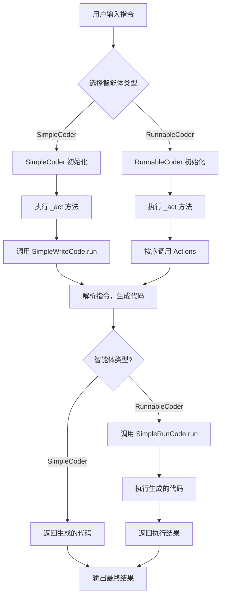
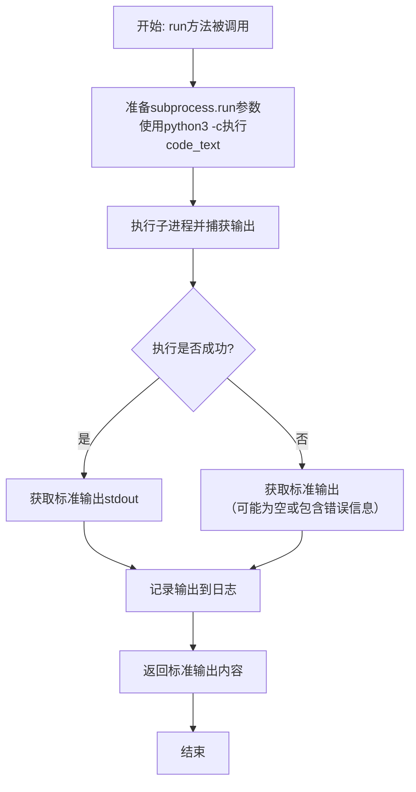
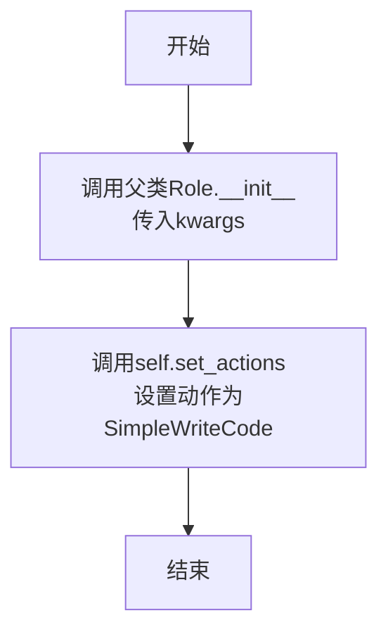
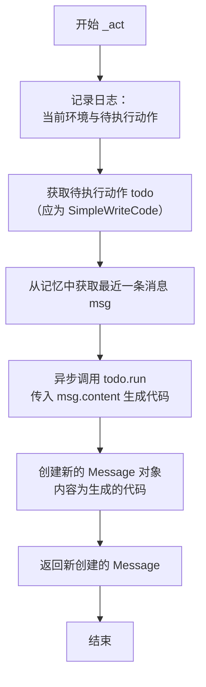
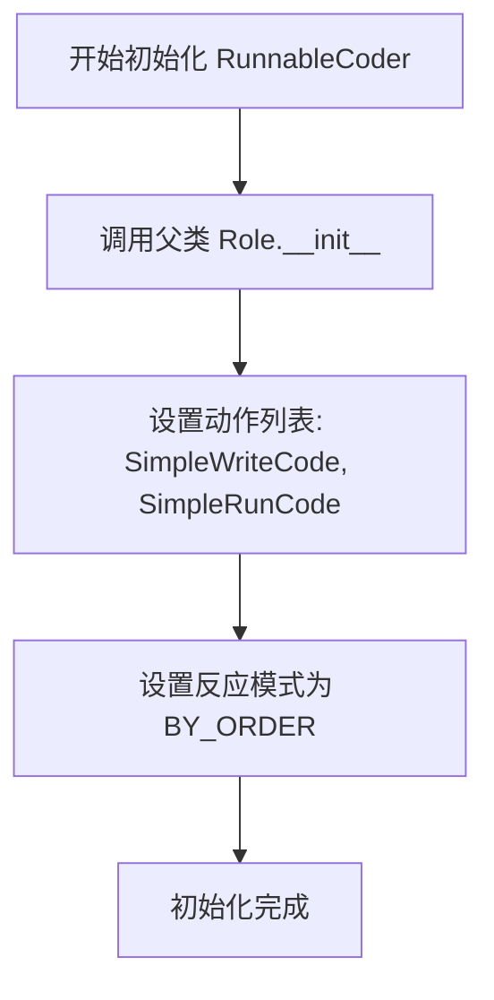
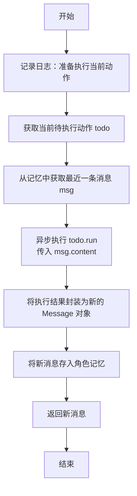

# `.\MetaGPT\examples\build_customized_agent.py` 详细设计文档

该代码演示了如何使用MetaGPT框架构建自定义的智能体（Agent），通过组合不同的动作（Action）来实现代码生成和执行的自动化工作流。核心功能是创建一个能够根据自然语言指令编写Python代码并自动运行测试的智能体。

## 整体流程



## 类结构

```
Action (基类)
├── SimpleWriteCode
└── SimpleRunCode
Role (基类)
├── SimpleCoder
└── RunnableCoder
```

## 全局变量及字段


### `SimpleWriteCode.PROMPT_TEMPLATE`
    
用于生成代码编写指令的模板字符串，包含占位符 {instruction}。

类型：`str`
    


### `SimpleWriteCode.name`
    
动作（Action）的名称，标识为 'SimpleWriteCode'。

类型：`str`
    


### `SimpleRunCode.name`
    
动作（Action）的名称，标识为 'SimpleRunCode'。

类型：`str`
    


### `SimpleCoder.name`
    
角色（Role）的名称，固定为 'Alice'。

类型：`str`
    


### `SimpleCoder.profile`
    
角色（Role）的简介，固定为 'SimpleCoder'。

类型：`str`
    


### `RunnableCoder.name`
    
角色（Role）的名称，固定为 'Alice'。

类型：`str`
    


### `RunnableCoder.profile`
    
角色（Role）的简介，固定为 'RunnableCoder'。

类型：`str`
    
    

## 全局函数及方法

### `main`

`main` 函数是程序的入口点，它负责初始化一个 `RunnableCoder` 角色，向其发送一个任务指令（例如“编写一个计算列表乘积的函数并运行它”），并异步执行该角色的 `run` 方法以获取并记录执行结果。

参数：

- `msg`：`str`，一个字符串，描述了要执行的任务指令。默认值为 `"write a function that calculates the product of a list and run it"`。

返回值：`None`，该函数没有返回值。

#### 流程图

```mermaid
flowchart TD
    A[开始] --> B[初始化 RunnableCoder 角色]
    B --> C[记录输入消息 msg]
    C --> D[异步执行 role.run(msg)]
    D --> E[获取并记录执行结果]
    E --> F[结束]
```

#### 带注释源码

```python
def main(msg="write a function that calculates the product of a list and run it"):
    # 初始化一个 RunnableCoder 角色实例
    # role = SimpleCoder()
    role = RunnableCoder()
    # 记录输入的任务指令
    logger.info(msg)
    # 异步执行角色的 run 方法，传入任务指令，并获取结果
    result = asyncio.run(role.run(msg))
    # 记录执行结果
    logger.info(result)
```

### `SimpleWriteCode.run`

该方法是一个异步方法，属于 `SimpleWriteCode` 类。它的核心功能是根据用户提供的自然语言指令，生成一个符合要求的 Python 函数代码片段，并从中提取出纯代码文本。

参数：
- `instruction`：`str`，用户提供的自然语言指令，描述需要生成的 Python 函数功能。

返回值：`str`，从大语言模型（LLM）的响应中解析出的纯 Python 代码文本。

#### 流程图

```mermaid
flowchart TD
    A[开始: run(instruction)] --> B[格式化提示词模板]
    B --> C[调用 _aask 获取 LLM 响应]
    C --> D[调用 parse_code 解析响应]
    D --> E[返回纯代码文本]
    E --> F[结束]
```

#### 带注释源码

```python
async def run(self, instruction: str):
    # 1. 使用用户指令（instruction）填充预定义的提示词模板（PROMPT_TEMPLATE），
    #    生成一个具体的、面向LLM的请求提示词（prompt）。
    prompt = self.PROMPT_TEMPLATE.format(instruction=instruction)

    # 2. 调用父类 Action 的 _aask 方法，将提示词发送给大语言模型（LLM），
    #    并异步等待其返回的响应文本（rsp）。
    rsp = await self._aask(prompt)

    # 3. 调用静态方法 parse_code，从 LLM 的响应文本（rsp）中，
    #    使用正则表达式提取被 ```python ... ``` 包裹的代码部分。
    #    如果未找到包裹标记，则返回整个响应文本。
    code_text = SimpleWriteCode.parse_code(rsp)

    # 4. 将提取出的纯代码文本（code_text）返回给调用者。
    return code_text
```

### `SimpleWriteCode.parse_code`

这是一个静态方法，用于从大语言模型（LLM）的响应文本中提取被包裹在 ````python` 和 ```` 标记中的 Python 代码块。如果未找到标记，则返回原始响应文本。

参数：
- `rsp`：`str`，大语言模型返回的响应字符串。

返回值：`str`，提取出的纯 Python 代码字符串。

#### 流程图

```mermaid
flowchart TD
    A[开始: 输入响应字符串 rsp] --> B{使用正则表达式搜索<br>```python(.*)``` 模式};
    B -- 匹配成功 --> C[提取匹配组 group(1) 的内容];
    B -- 匹配失败 --> D[将原始 rsp 作为代码文本];
    C --> E[返回提取的代码文本];
    D --> E;
    E[结束: 返回代码字符串] --> F;
```

#### 带注释源码

```python
@staticmethod
def parse_code(rsp):
    # 定义正则表达式模式，用于匹配被 ```python 和 ``` 包裹的代码块。
    # re.DOTALL 标志使 '.' 匹配包括换行符在内的所有字符。
    pattern = r"```python(.*)```"
    # 在响应字符串 rsp 中搜索该模式。
    match = re.search(pattern, rsp, re.DOTALL)
    # 如果找到匹配项，则提取第一个捕获组（即代码内容），否则返回原始响应。
    code_text = match.group(1) if match else rsp
    # 返回提取或原始的代码文本。
    return code_text
```

### `SimpleRunCode.run`

该方法用于异步执行给定的Python代码字符串，并返回其标准输出结果。它通过调用`subprocess.run`在子进程中运行代码，捕获输出和错误信息，并将标准输出记录到日志中后返回。

参数：

- `code_text`：`str`，需要执行的Python代码字符串

返回值：`str`，代码执行后的标准输出内容

#### 流程图



#### 带注释源码

```python
async def run(self, code_text: str):
    # 使用subprocess.run执行给定的Python代码字符串
    # - "python3": 指定使用Python3解释器
    # - "-c": 表示从命令行字符串执行代码
    # - code_text: 要执行的Python代码
    # - capture_output=True: 捕获标准输出和标准错误
    # - text=True: 以文本模式返回输出结果
    result = subprocess.run(["python3", "-c", code_text], capture_output=True, text=True)
    
    # 从执行结果中获取标准输出内容
    code_result = result.stdout
    
    # 使用logger记录代码执行结果，便于调试和监控
    logger.info(f"{code_result=}")
    
    # 返回代码执行的标准输出
    return code_result
```

### `SimpleCoder.__init__`

该方法用于初始化`SimpleCoder`角色实例。它首先调用父类`Role`的构造函数，然后为该角色设置一个默认的`Action`列表，其中只包含`SimpleWriteCode`动作。这使得`SimpleCoder`角色具备根据指令生成代码的能力。

参数：

-  `kwargs`：`dict`，用于接收传递给父类`Role`构造函数的任意关键字参数。

返回值：`None`，构造函数不返回任何值。

#### 流程图



#### 带注释源码

```python
def __init__(self, **kwargs):
    # 调用父类Role的构造函数，传入所有接收到的关键字参数
    super().__init__(**kwargs)
    # 为当前角色设置其可执行的动作列表，这里只设置了SimpleWriteCode动作
    self.set_actions([SimpleWriteCode])
```

### `SimpleCoder._act`

`SimpleCoder._act` 是 `SimpleCoder` 角色的核心行为方法。它负责执行角色当前待办的动作（Action），具体是调用 `SimpleWriteCode` 动作来根据接收到的消息内容生成代码，并将生成的代码包装成一个新的 `Message` 对象返回。

参数：
- `self`：`SimpleCoder` 实例，表示当前角色对象。

返回值：`Message`，返回一个包含生成的代码文本、发送者角色和触发动作类型的新消息对象。

#### 流程图



#### 带注释源码

```python
async def _act(self) -> Message:
    # 记录日志：输出当前角色的设定信息和即将执行的动作信息
    logger.info(f"{self._setting}: to do {self.rc.todo}({self.rc.todo.name})")
    # 从角色上下文（RoleContext）中获取当前待执行的动作
    # 在 SimpleCoder 初始化时，只设置了 SimpleWriteCode 动作，因此 todo 将是 SimpleWriteCode 的实例
    todo = self.rc.todo  # todo will be SimpleWriteCode()

    # 从角色的记忆（Memory）中获取最近的一条消息（k=1）
    # 这通常是用户或系统发给该角色的指令
    msg = self.get_memories(k=1)[0]  # find the most recent messages
    # 异步执行待办动作（SimpleWriteCode.run），传入上一步获取的消息内容
    # 该动作会根据指令生成代码文本
    code_text = await todo.run(msg.content)
    # 创建一个新的 Message 对象
    # content: 生成的代码文本
    # role: 发送者角色，这里使用当前角色的 profile（即 "SimpleCoder"）
    # cause_by: 触发此消息的动作类型，这里是 todo 的类型（SimpleWriteCode）
    msg = Message(content=code_text, role=self.profile, cause_by=type(todo))

    # 返回新创建的消息
    return msg
```

### `RunnableCoder.__init__`

该方法用于初始化 `RunnableCoder` 类的实例，继承自 `Role` 基类，并设置其特定的动作列表和反应模式。

参数：

-  `kwargs`：`dict`，可变关键字参数，用于传递给父类 `Role` 的初始化方法，以支持基类可能需要的任何配置。

返回值：`None`，此方法不返回任何值，仅用于初始化对象状态。

#### 流程图



#### 带注释源码

```python
def __init__(self, **kwargs):
    # 调用父类 Role 的初始化方法，传递所有关键字参数以支持继承的配置
    super().__init__(**kwargs)
    # 为当前角色设置其可执行的动作列表，包括 SimpleWriteCode 和 SimpleRunCode
    self.set_actions([SimpleWriteCode, SimpleRunCode])
    # 设置角色的反应模式为按顺序执行（BY_ORDER），即按列表顺序依次执行动作
    self._set_react_mode(react_mode=RoleReactMode.BY_ORDER.value)
```

### `RunnableCoder._act`

该方法是一个异步方法，是`RunnableCoder`角色的核心行为逻辑。它根据角色上下文（`rc`）中当前待执行的动作（`todo`），从记忆中获取最近的输入消息，执行该动作，并将执行结果封装为新的`Message`对象存入记忆，最后返回该消息。它实现了角色按预设顺序（`BY_ORDER`）执行动作（`SimpleWriteCode`和`SimpleRunCode`）的流程。

参数：
-  `self`：`RunnableCoder`，`RunnableCoder`类的实例。

返回值：`Message`，一个包含动作执行结果、发送者角色和触发动作类型的新消息对象。

#### 流程图



#### 带注释源码

```python
async def _act(self) -> Message:
    # 记录日志，显示角色设定和即将执行的动作信息
    logger.info(f"{self._setting}: to do {self.rc.todo}({self.rc.todo.name})")
    # 从角色上下文（RoleContext）中获取当前待执行的动作。
    # 由于该角色设置了 BY_ORDER 反应模式，todo 会按顺序依次为 SimpleWriteCode 和 SimpleRunCode
    todo = self.rc.todo

    # 从角色的记忆中获取最近的一条（k=1）消息作为当前动作的输入
    msg = self.get_memories(k=1)[0]  # find the most k recent messages
    # 异步执行当前动作（todo），传入上一步获取的消息内容作为参数
    result = await todo.run(msg.content)

    # 将动作的执行结果（result）封装成一个新的 Message 对象。
    # content: 存储执行结果。
    # role: 发送者角色，这里使用 self.profile（即 "RunnableCoder"）。
    # cause_by: 触发此消息的动作类型，即当前执行的 todo 的类型。
    msg = Message(content=result, role=self.profile, cause_by=type(todo))
    # 将新生成的消息添加到角色的记忆中，以便后续动作或循环可以参考
    self.rc.memory.add(msg)
    # 返回新生成的消息
    return msg
```

## 关键组件


### Action 基类

定义了所有动作（Action）的基类，提供了异步执行动作的框架，是MetaGPT中可执行任务的基本单元。

### SimpleWriteCode 动作

一个具体的动作类，用于根据用户指令生成Python代码，并通过正则表达式从模型响应中提取代码块。

### SimpleRunCode 动作

一个具体的动作类，用于执行给定的Python代码字符串，并捕获其标准输出和错误。

### Role 基类

定义了所有角色（Role）的基类，封装了角色的属性、记忆、行动决策逻辑以及与其他组件的交互方式。

### SimpleCoder 角色

一个具体的角色类，继承自Role，配置了SimpleWriteCode动作，能够根据接收到的消息生成代码。

### RunnableCoder 角色

一个具体的角色类，继承自Role，按顺序配置了SimpleWriteCode和SimpleRunCode动作，能够生成代码并立即执行。

### RoleReactMode 枚举

定义了角色对动作的响应模式，例如BY_ORDER表示按预设顺序执行动作列表中的动作。

### Message 数据结构

定义了在角色之间或动作之间传递的消息结构，包含内容、发送者角色和触发该消息的动作类型等信息。

### 记忆（Memory）系统

Role基类中管理的组件，用于存储和检索历史消息，支持基于最近k条消息的上下文获取。

### 反应上下文（Reaction Context）

Role基类中管理的运行时上下文，包含当前待执行的动作（todo）、记忆（memory）等，驱动角色的决策循环。


## 问题及建议


### 已知问题

-   **代码注入风险**：`SimpleRunCode` 类使用 `subprocess.run(["python3", "-c", code_text], ...)` 直接执行从 LLM 获取的代码字符串。如果 LLM 返回的代码包含恶意命令（如 `import os; os.system('rm -rf /')`），将直接执行，存在严重的安全漏洞。
-   **脆弱的代码解析**：`SimpleWriteCode.parse_code` 方法使用简单的正则表达式 `r"```python(.*)```"` 来提取代码块。如果 LLM 的响应格式稍有变化（例如使用 ` ```Python ` 或包含多个代码块），解析就会失败，导致返回非代码文本或部分代码。
-   **错误处理缺失**：`SimpleRunCode` 执行代码时，如果代码存在语法错误或运行时异常，`subprocess.run` 会捕获到 `stderr`，但当前逻辑仅记录了 `stdout`。调用者无法区分执行成功与失败，也无法获取具体的错误信息进行诊断。
-   **资源与副作用不可控**：执行的代码可能陷入死循环、占用大量内存/CPU，或产生文件读写、网络请求等副作用。当前架构没有对执行环境进行任何隔离、资源限制或副作用管理。
-   **角色初始化硬编码**：`SimpleCoder` 和 `RunnableCoder` 的 `name` 和 `profile` 属性在类定义中被硬编码为 `"Alice"` 和 `"SimpleCoder"`/`"RunnableCoder"`。这降低了角色的可复用性和灵活性，无法在运行时创建不同名称或配置的角色实例。
-   **测试用例执行逻辑缺失**：`SimpleWriteCode` 的提示词要求 LLM “提供两个可运行的测试用例”，但生成的代码被直接交给 `SimpleRunCode` 执行。如果 LLM 返回的代码包含函数定义和测试调用，执行测试是可行的；但如果 LLM 只返回了函数定义本身，`SimpleRunCode` 执行后将没有输出，导致流程不符合预期。

### 优化建议

-   **实施安全的代码执行沙箱**：建议使用 Docker 容器、`pysandbox`、`restrictedpython` 或云函数等隔离环境来执行生成的代码。至少应对代码进行静态安全检查（如禁止某些危险模块和关键字），并对子进程设置超时和资源限制（如 `timeout`, `preexec_fn` 配合 `resource` 模块）。
-   **增强代码解析的鲁棒性**：改进 `parse_code` 方法，使其能够处理更多 Markdown 代码块的变体（如不同的缩进、语言标识符大小写、多个反引号）。可以尝试先寻找 ` ``` ` 标记，再识别其后的语言标识，最后提取内容。或者，直接利用更成熟的 Markdown 解析库。
-   **完善错误处理与结果反馈**：修改 `SimpleRunCode.run` 方法，使其返回一个包含执行状态（成功/失败）、标准输出、标准错误、退出码等信息的结构化对象，而不仅仅是 `stdout`。这样，上游角色或动作可以根据执行结果决定后续步骤（例如，如果测试失败，则触发代码修复动作）。
-   **设计可配置的角色属性**：将 `SimpleCoder` 和 `RunnableCoder` 的 `name` 和 `profile` 改为 `__init__` 方法的参数，并传递给父类。这样可以在实例化时动态指定，提高代码的灵活性。例如：`def __init__(self, name="Alice", profile="SimpleCoder", **kwargs): super().__init__(name=name, profile=profile, **kwargs)`。
-   **明确职责分离与流程设计**：重新考虑 `SimpleWriteCode` 和 `SimpleRunCode` 的职责。可以创建一个新的 `SimpleWriteTest` 动作来专门生成测试，并设计一个工作流（例如通过 `RoleReactMode` 或自定义 `_act`）来协调“编写函数”、“编写测试”、“执行测试”的步骤。确保每个动作的输入输出契约清晰。
-   **增加代码验证环节**：在执行代码前，可以增加一个轻量级的语法验证步骤（例如使用 `ast.parse`），快速排除明显的语法错误，避免启动子进程的开销和潜在问题。
-   **优化提示词工程**：细化 `SimpleWriteCode.PROMPT_TEMPLATE` 的指令，明确要求 LLM 输出的代码必须是“一个完整的、可直接通过 `python3 -c` 执行并产生可见输出的脚本”，并指定好函数定义与测试调用的格式，以减少解析和执行的不确定性。


## 其它


### 设计目标与约束

本代码示例的核心设计目标是展示如何利用MetaGPT框架构建一个能够根据自然语言指令生成并执行Python代码的定制化智能体。主要约束包括：1) 保持示例的简洁性和可理解性，避免引入复杂的业务逻辑；2) 依赖MetaGPT框架提供的核心抽象（如`Role`, `Action`）和运行机制；3) 代码生成与执行的安全性未做深入考虑，例如执行任意代码的风险。

### 错误处理与异常设计

当前代码的错误处理较为基础。在`SimpleWriteCode.run`方法中，使用正则表达式解析大模型返回的代码块，如果匹配失败则返回原始响应，这可能导致后续执行错误。在`SimpleRunCode.run`方法中，使用`subprocess.run`执行代码，但仅捕获了标准输出，未处理标准错误流（`stderr`）和可能的非零退出码，错误信息可能丢失。整体缺乏对异步操作、网络请求（`_aask`）失败、或角色状态异常的处理逻辑。

### 数据流与状态机

1.  **数据流**：用户输入（指令字符串）作为初始`Message`存入`Role`的记忆（`memory`）。在`_act`循环中，`Role`从记忆取出消息，交给当前待执行的`Action`（`todo`）处理。`Action`处理后的结果被包装成新的`Message`，并可根据配置决定是否存回记忆。最终结果返回给用户。
2.  **状态机（`Role`内部）**：`Role`的行为由其`_react_mode`控制。`SimpleCoder`使用默认模式（推测为`REACT`），其`_think`方法决定下一步`Action`。`RunnableCoder`设置为`BY_ORDER`模式，严格按照`set_actions`时指定的顺序（`[SimpleWriteCode, SimpleRunCode]`）执行`Action`，构成一个简单的线性状态机：`WriteCode -> RunCode -> 结束`。

### 外部依赖与接口契约

1.  **外部依赖**：
    *   **MetaGPT框架**：强依赖`metagpt.actions.Action`, `metagpt.roles.role.Role`, `metagpt.schema.Message`等核心类。
    *   **大语言模型服务**：`Action._aask`方法内部依赖外部的LLM API（如OpenAI GPT）。
    *   **系统命令**：`SimpleRunCode`依赖系统安装的`python3`解释器来执行生成的代码。
    *   **Python库**：`fire`（CLI生成）、`asyncio`（异步运行时）、`re`（正则解析）、`subprocess`（子进程执行）。
2.  **接口契约**：
    *   `Action.run`方法：所有自定义`Action`必须实现此异步方法，其参数和返回值含义由具体`Action`定义。
    *   `Role._act`方法：所有自定义`Role`必须实现此异步方法，它应调用`self.rc.todo.run()`并返回一个`Message`对象。
    *   `Role.run`方法：是启动角色执行的公共接口，接受初始消息字符串。

### 安全与权限考虑

代码存在显著的安全风险：`SimpleRunCode`通过`subprocess.run(["python3", "-c", code_text], ...)`直接执行由LLM生成的、未经任何沙箱隔离或安全检查的代码（`code_text`）。这可能导致任意命令执行、文件系统破坏、资源耗尽等攻击。在生产环境中，这是不可接受的，必须引入严格的代码安全审查、沙箱执行环境（如Docker容器、`seccomp`）或仅限于执行白名单内的安全操作。

### 配置与可扩展性

1.  **配置**：角色的名称（`name`, `profile`）、行为模式（`react_mode`）以及动作序列（`set_actions`）均在类定义中硬编码，缺乏外部配置（如配置文件、环境变量）的灵活性。
2.  **可扩展性**：
    *   **新增`Action`**：通过继承`Action`类并实现`run`方法，可以轻松扩展新的能力（如代码审查、结果格式化）。
    *   **组合`Role`**：通过为`Role`的`set_actions`方法提供不同的`Action`列表，可以组合出具有不同技能的角色。
    *   **扩展局限**：修改`Role`的交互逻辑（如`_act`, `_think`）需要深入理解框架内部机制；`BY_ORDER`模式虽然简单，但缺乏基于条件的动态动作选择能力。

### 测试策略建议

1.  **单元测试**：应对`SimpleWriteCode.parse_code`和`SimpleRunCode.run`进行单元测试，覆盖正常解析、解析失败、执行成功、执行出错（标准错误输出）等场景。
2.  **集成测试**：测试`SimpleCoder`和`RunnableCoder`与模拟LLM响应和模拟代码执行环境的集成，验证完整的“指令->代码->结果”流程。
3.  **模拟（Mock）**：测试时应模拟`Action._aask`方法以避免调用真实LLM API，并模拟`subprocess.run`以安全地测试代码执行逻辑。
4.  **安全测试**：针对`SimpleRunCode`，应测试其对各种恶意代码输入的处理是否符合安全预期（在引入安全机制后）。

    