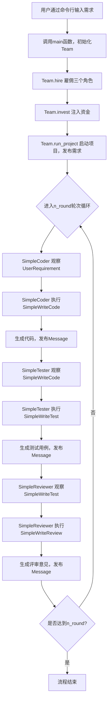
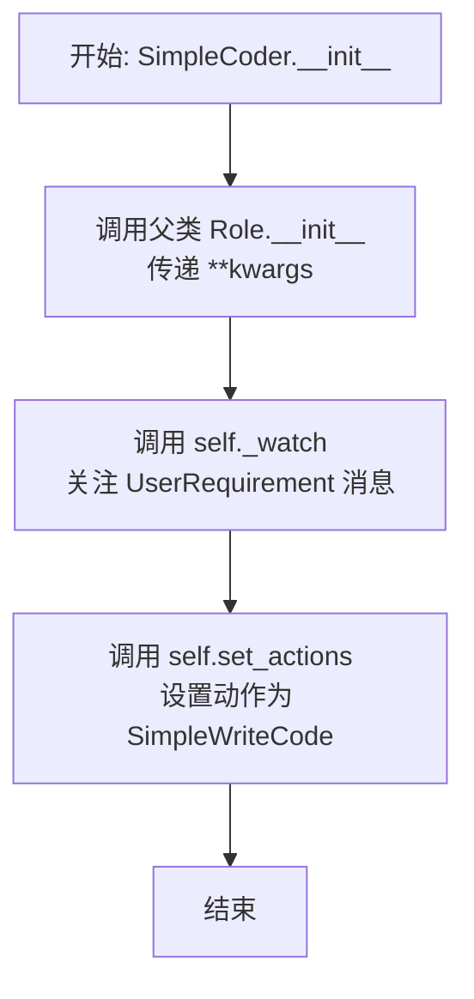
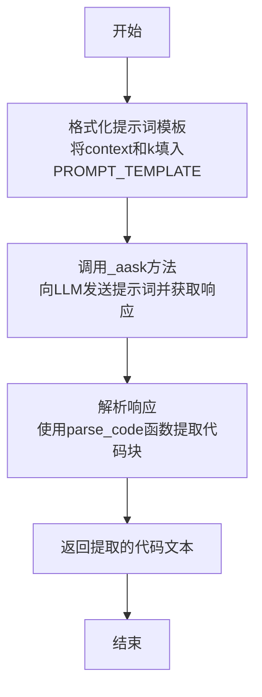

# `.\MetaGPT\examples\build_customized_multi_agents.py` 详细设计文档

该代码是一个基于MetaGPT框架构建的多智能体协作系统示例，核心功能是模拟一个软件开发团队（包含程序员、测试员和评审员）通过分工协作，根据用户需求自动生成Python代码、编写测试用例并进行代码评审的完整流程。

## 整体流程



## 类结构

```
Action (MetaGPT基类)
├── SimpleWriteCode
├── SimpleWriteTest
└── SimpleWriteReview
Role (MetaGPT基类)
├── SimpleCoder
├── SimpleTester
└── SimpleReviewer
```

## 全局变量及字段


### `SimpleWriteCode.PROMPT_TEMPLATE`
    
用于生成代码编写指令的提示词模板，包含占位符 {instruction}。

类型：`str`
    


### `SimpleWriteCode.name`
    
动作（Action）的名称，固定为 'SimpleWriteCode'。

类型：`str`
    


### `SimpleCoder.name`
    
角色（Role）的名称，固定为 'Alice'。

类型：`str`
    


### `SimpleCoder.profile`
    
角色的简介或职责描述，固定为 'SimpleCoder'。

类型：`str`
    


### `SimpleWriteTest.PROMPT_TEMPLATE`
    
用于生成单元测试代码的提示词模板，包含占位符 {context} 和 {k}。

类型：`str`
    


### `SimpleWriteTest.name`
    
动作（Action）的名称，固定为 'SimpleWriteTest'。

类型：`str`
    


### `SimpleTester.name`
    
角色（Role）的名称，固定为 'Bob'。

类型：`str`
    


### `SimpleTester.profile`
    
角色的简介或职责描述，固定为 'SimpleTester'。

类型：`str`
    


### `SimpleWriteReview.PROMPT_TEMPLATE`
    
用于生成代码审查意见的提示词模板，包含占位符 {context}。

类型：`str`
    


### `SimpleWriteReview.name`
    
动作（Action）的名称，固定为 'SimpleWriteReview'。

类型：`str`
    


### `SimpleReviewer.name`
    
角色（Role）的名称，固定为 'Charlie'。

类型：`str`
    


### `SimpleReviewer.profile`
    
角色的简介或职责描述，固定为 'SimpleReviewer'。

类型：`str`
    
    

## 全局函数及方法

### `parse_code`

该函数用于从包含代码块的字符串响应中提取Python代码。它使用正则表达式匹配被```python和```包裹的代码块，如果找到则返回该代码块内容，否则返回原始字符串。

参数：

- `rsp`：`str`，包含可能被```python和```包裹的代码块的字符串响应

返回值：`str`，提取出的纯Python代码字符串

#### 流程图

```mermaid
graph TD
    A[开始: 输入rsp字符串] --> B[定义正则表达式模式: ```python.*```]
    B --> C{使用re.search查找匹配}
    C -->|匹配成功| D[提取group(1)作为code_text]
    C -->|匹配失败| E[使用原始rsp作为code_text]
    D --> F[返回code_text]
    E --> F
    F --> G[结束]
```

#### 带注释源码

```python
def parse_code(rsp):
    # 定义正则表达式模式，匹配被```python和```包裹的内容
    # re.DOTALL标志使.匹配包括换行符在内的所有字符
    pattern = r"```python(.*)```"
    
    # 在rsp中搜索匹配pattern的内容
    match = re.search(pattern, rsp, re.DOTALL)
    
    # 如果找到匹配，提取第一个捕获组的内容（即代码部分）
    # 否则使用原始rsp字符串
    code_text = match.group(1) if match else rsp
    
    # 返回提取的代码文本
    return code_text
```

### `main`

该函数是程序的入口点，负责初始化一个由多个角色（SimpleCoder, SimpleTester, SimpleReviewer）组成的团队，并运行一个多轮次的协作项目，以根据给定的需求（idea）生成代码、测试和审查。

参数：

-  `idea`：`str`，一个描述项目需求的字符串，例如“编写一个计算列表乘积的函数”。默认值为 `"write a function that calculates the product of a list"`。
-  `investment`：`float`，分配给团队的虚拟预算，用于控制资源分配。默认值为 `3.0`。
-  `n_round`：`int`，团队协作的轮次。默认值为 `5`。
-  `add_human`：`bool`，一个标志，指示是否将 `SimpleReviewer` 角色设置为人类交互模式。默认值为 `False`。

返回值：`None`，该函数没有返回值。

#### 流程图

```mermaid
flowchart TD
    Start[“开始: main(idea, investment, n_round, add_human)”] --> Log[“记录 idea 到日志”]
    Log --> InitTeam[“初始化 Team 对象”]
    InitTeam --> Hire[“雇佣团队成员<br>SimpleCoder, SimpleTester, SimpleReviewer”]
    Hire --> Invest[“为团队注入预算 (investment)”]
    Invest --> RunProject[“启动项目 (team.run_project)<br>传入需求 (idea)”]
    RunProject --> RunTeam[“运行团队协作 (team.run)<br>指定轮次 (n_round)”]
    RunTeam --> End[“结束”]
```

#### 带注释源码

```python
async def main(
    # 参数：项目需求描述
    idea: str = "write a function that calculates the product of a list",
    # 参数：分配给团队的虚拟预算
    investment: float = 3.0,
    # 参数：团队协作的轮次
    n_round: int = 5,
    # 参数：是否将审查者角色设置为人类模式
    add_human: bool = False,
):
    # 将初始需求记录到日志中
    logger.info(idea)

    # 1. 初始化一个空的团队
    team = Team()
    # 2. 雇佣（添加）团队成员：代码编写者、测试编写者、审查者
    team.hire(
        [
            SimpleCoder(),
            SimpleTester(),
            # 根据 add_human 参数决定审查者是否为人类交互模式
            SimpleReviewer(is_human=add_human),
        ]
    )

    # 3. 为团队分配预算（影响内部资源调度）
    team.invest(investment=investment)
    # 4. 使用给定的 idea 启动一个项目
    team.run_project(idea)
    # 5. 运行团队协作流程，进行指定轮次（n_round）的交互
    await team.run(n_round=n_round)
    # 函数无返回值
```

### `SimpleWriteCode.run`

该方法是一个异步方法，属于 `SimpleWriteCode` 类。它的核心功能是根据用户提供的指令（`instruction`），使用预定义的提示词模板生成一个 Python 函数的代码。它会调用大语言模型（LLM）来生成代码，并从模型的响应中提取出被 ````python` 和 ```` 包裹的代码块。如果未找到代码块，则返回整个响应。

参数：

- `instruction`：`str`，描述需要生成的 Python 函数功能的指令文本。

返回值：`str`，从大语言模型响应中提取出的 Python 代码文本。

#### 流程图

```mermaid
graph TD
    A[开始: run(instruction)] --> B[使用instruction格式化提示词模板];
    B --> C[异步调用_aask方法获取LLM响应];
    C --> D[调用parse_code函数提取代码];
    D --> E{是否成功提取到代码块?};
    E -- 是 --> F[返回提取的代码文本];
    E -- 否 --> G[返回整个响应文本];
    F --> H[结束];
    G --> H;
```

#### 带注释源码

```python
async def run(self, instruction: str):
    # 1. 使用传入的指令（instruction）来填充类中定义的提示词模板（PROMPT_TEMPLATE）。
    prompt = self.PROMPT_TEMPLATE.format(instruction=instruction)

    # 2. 异步调用 `_aask` 方法（继承自父类 Action），将格式化后的提示词发送给大语言模型（LLM）并获取其文本响应（rsp）。
    rsp = await self._aask(prompt)

    # 3. 调用辅助函数 `parse_code`，尝试从 LLM 的响应文本（rsp）中提取被 ```python 和 ``` 包裹的代码部分。
    code_text = parse_code(rsp)

    # 4. 返回提取到的代码文本。如果 `parse_code` 未找到代码块，则返回原始的响应文本（rsp）。
    return code_text
```

### `SimpleCoder.__init__`

该方法用于初始化 `SimpleCoder` 角色实例。它首先调用父类 `Role` 的构造函数以完成基础初始化，然后为该角色设置其关注的动作类型（`UserRequirement`）和可执行的动作（`SimpleWriteCode`），从而定义了该角色在智能体团队中的基本行为模式。

参数：

- `**kwargs`：`dict`，可变关键字参数，用于传递给父类 `Role` 的构造函数，以支持父类所需的任何初始化配置。

返回值：`None`，构造函数不返回任何值。

#### 流程图



#### 带注释源码

```python
def __init__(self, **kwargs):
    # 调用父类 Role 的构造函数，确保 Role 的基础属性（如 name, profile）和内部状态（如 rc）被正确初始化。
    super().__init__(**kwargs)
    # 调用 _watch 方法，使此角色订阅（关注）类型为 UserRequirement 的消息。
    # 当团队中有 UserRequirement 消息发布时，此角色会被触发。
    self._watch([UserRequirement])
    # 调用 set_actions 方法，为此角色设置其可以执行的动作列表。
    # 这里只设置了一个动作 SimpleWriteCode，意味着此角色被触发后，会执行写代码的任务。
    self.set_actions([SimpleWriteCode])
```

### `SimpleWriteTest.run`

该方法根据给定的函数代码上下文，生成指定数量的 pytest 单元测试代码。

参数：
- `context`：`str`，包含待测试函数代码的上下文信息。
- `k`：`int`，可选参数，默认为3，指定要生成的单元测试数量。

返回值：`str`，返回生成的 pytest 单元测试代码字符串。

#### 流程图



#### 带注释源码

```python
async def run(self, context: str, k: int = 3):
    # 1. 格式化提示词：将传入的上下文(context)和测试数量(k)填入预定义的模板中。
    prompt = self.PROMPT_TEMPLATE.format(context=context, k=k)

    # 2. 调用大语言模型：通过_aask方法将格式化后的提示词发送给LLM，并异步等待其响应(rsp)。
    rsp = await self._aask(prompt)

    # 3. 解析响应：使用parse_code函数从LLM的响应中提取被```python ```包裹的代码块。
    #    如果未找到代码块，则返回整个响应内容。
    code_text = parse_code(rsp)

    # 4. 返回结果：将提取出的单元测试代码文本返回给调用者。
    return code_text
```

### `SimpleTester.__init__`

该方法用于初始化 `SimpleTester` 角色实例，设置其关注的动作列表，并调用父类的初始化方法。

参数：

-  `kwargs`：`dict`，可变关键字参数，用于传递给父类 `Role` 的初始化方法。

返回值：`None`，无返回值。

#### 流程图

```mermaid
flowchart TD
    A[开始] --> B[调用父类 Role.__init__ 方法]
    B --> C[设置关注的动作列表<br>self._watch([SimpleWriteCode, SimpleWriteReview])]
    C --> D[设置执行的动作列表<br>self.set_actions([SimpleWriteTest])]
    D --> E[结束]
```

#### 带注释源码

```python
def __init__(self, **kwargs):
    # 调用父类 Role 的初始化方法，传入所有关键字参数
    super().__init__(**kwargs)
    # 设置该角色（SimpleTester）可以执行的动作列表，这里只包含 SimpleWriteTest
    self.set_actions([SimpleWriteTest])
    # 设置该角色关注的动作列表。当这些动作产生消息时，会触发该角色的 _act 方法。
    # 这里关注 SimpleWriteCode 和 SimpleWriteReview 动作。
    # 注释中提到也可以尝试只关注 SimpleWriteCode。
    self._watch([SimpleWriteCode, SimpleWriteReview])  # feel free to try this too
```

### `SimpleTester._act`

`SimpleTester._act` 是 `SimpleTester` 角色的核心行动方法。它负责执行测试任务：从记忆中获取上下文信息，调用 `SimpleWriteTest` 动作来生成测试代码，并将生成的代码包装成一个 `Message` 对象返回，以便在团队协作流程中传递。

参数：
-  `self`：`SimpleTester` 实例，表示调用该方法的角色对象本身。

返回值：`Message`，一个包含生成的测试代码、发送者角色和触发原因的消息对象。

#### 流程图

```mermaid
flowchart TD
    A[开始 _act] --> B[记录日志<br>“{角色名}: to do {待办动作名}”]
    B --> C[获取待办动作<br>self.rc.todo]
    C --> D[获取所有记忆作为上下文<br>self.get_memories()]
    D --> E[异步执行待办动作<br>await todo.run(context, k=5)]
    E --> F[创建消息对象<br>Message(content=code_text, ...)]
    F --> G[返回消息对象]
```

#### 带注释源码

```python
async def _act(self) -> Message:
    # 记录日志，显示当前角色正在执行哪个动作
    logger.info(f"{self._setting}: to do {self.rc.todo}({self.rc.todo.name})")
    # 从角色上下文（RoleContext）中获取当前待执行的动作
    todo = self.rc.todo

    # 获取角色的所有记忆作为生成测试的上下文。
    # 注释中提供了另一种方案：仅使用最近的一条记忆 `self.get_memories(k=1)[0].content`
    context = self.get_memories()  # use all memories as context

    # 异步执行待办动作（SimpleWriteTest.run），传入上下文和参数 k=5，获取生成的测试代码
    code_text = await todo.run(context, k=5)  # specify arguments
    # 将生成的代码包装成 Message 对象。
    # content: 消息内容，即生成的测试代码。
    # role: 发送者角色，这里使用角色的 profile（“SimpleTester”）。
    # cause_by: 触发此消息的动作类型，这里是当前待办动作的类型。
    msg = Message(content=code_text, role=self.profile, cause_by=type(todo))

    # 返回创建的消息对象
    return msg
```

### `SimpleWriteReview.run`

该方法是一个异步方法，属于 `SimpleWriteReview` 类。它的核心功能是接收一个代码上下文（通常是测试用例），使用预设的提示词模板生成一个代码审查请求，然后调用大语言模型（LLM）获取审查意见，最后将审查意见作为字符串返回。

参数：

- `context`：`str`，需要被审查的代码或测试用例的上下文信息。

返回值：`str`，返回从大语言模型（LLM）获取到的、针对给定上下文的审查意见文本。

#### 流程图

```mermaid
flowchart TD
    A[开始: run(context)] --> B[格式化提示词 prompt]
    B --> C[调用 _aask(prompt) 获取 LLM 响应 rsp]
    C --> D[返回 rsp 字符串]
    D --> E[结束]
```

#### 带注释源码

```python
async def run(self, context: str):
    # 使用实例的 PROMPT_TEMPLATE 属性，将传入的 context 参数填充到模板中，生成最终的提示词。
    prompt = self.PROMPT_TEMPLATE.format(context=context)

    # 调用父类 Action 的 _aask 异步方法，将提示词发送给大语言模型（LLM）并等待其响应。
    rsp = await self._aask(prompt)

    # 直接将大语言模型返回的响应文本 rsp 作为审查结果返回。
    # 注意：与 SimpleWriteCode 和 SimpleWriteTest 不同，此方法没有调用 parse_code 来提取代码块。
    return rsp
```

### `SimpleReviewer.__init__`

该方法用于初始化`SimpleReviewer`角色实例，继承父类`Role`的初始化逻辑，并设置该角色的特定行为：将`SimpleWriteReview`动作设置为该角色的默认动作，并订阅（监听）来自`SimpleWriteTest`动作的消息。

参数：

-  `kwargs`：`dict`，可变关键字参数，用于传递给父类`Role.__init__`方法的初始化参数。

返回值：`None`，无返回值。

#### 流程图

```mermaid
flowchart TD
    A[开始 SimpleReviewer.__init__] --> B[调用父类 Role.__init__<br>传入 **kwargs]
    B --> C[设置角色动作为 SimpleWriteReview<br>self.set_actions([SimpleWriteReview])]
    C --> D[订阅 SimpleWriteTest 动作的消息<br>self._watch([SimpleWriteTest])]
    D --> E[结束]
```

#### 带注释源码

```python
def __init__(self, **kwargs):
    # 调用父类 Role 的初始化方法，传入所有关键字参数
    super().__init__(**kwargs)
    # 设置当前角色（SimpleReviewer）的默认动作为 SimpleWriteReview
    self.set_actions([SimpleWriteReview])
    # 设置当前角色监听（关注）来自 SimpleWriteTest 动作产生的消息
    # 当有此类消息时，角色可能会被触发执行其动作
    self._watch([SimpleWriteTest])
```

## 关键组件

### SimpleWriteCode

一个用于根据用户指令生成Python代码的Action类，它使用预定义的提示模板调用大语言模型，并解析返回的代码块。

### SimpleCoder

一个名为Alice的简单编码员角色，其职责是监听用户需求并执行SimpleWriteCode动作来生成代码。

### SimpleWriteTest

一个用于为给定代码上下文生成单元测试的Action类，它使用包含上下文和测试数量的提示模板调用大语言模型，并解析返回的测试代码块。

### SimpleTester

一个名为Bob的简单测试员角色，其职责是监听代码生成或代码审查动作，获取相关记忆作为上下文，并执行SimpleWriteTest动作来生成测试用例。

### SimpleWriteReview

一个用于对测试用例进行审查并提供关键意见的Action类，它使用包含测试上下文的提示模板调用大语言模型。

### SimpleReviewer

一个名为Charlie的简单审查员角色，其职责是监听测试生成动作，并执行SimpleWriteReview动作来审查测试用例。

### Team

一个用于管理多个角色（如Coder, Tester, Reviewer）、分配预算并运行多轮协作项目的团队管理组件。

### parse_code

一个全局工具函数，用于使用正则表达式从大语言模型的响应中提取被```python ... ```包裹的代码文本。

## 问题及建议


### 已知问题

-   **`parse_code` 函数健壮性不足**：该函数使用正则表达式 `r"```python(.*)```"` 从大语言模型（LLM）的响应中提取代码。如果 LLM 的响应格式不符合预期（例如，使用 ` ``` ` 而非 ` ```python `，或代码块跨越多行时格式有细微差异），此函数将无法正确提取代码，导致返回整个响应字符串，可能引发后续执行错误。
-   **`SimpleTester._act` 方法存在潜在的类型错误**：`SimpleTester` 的 `_act` 方法中，`context = self.get_memories()` 获取的是 `Message` 对象列表。然而，在调用 `todo.run(context, k=5)` 时，直接将此列表传递给了 `SimpleWriteTest.run` 方法，而该方法期望的 `context` 参数类型是 `str`。这会导致类型不匹配，除非 `SimpleWriteTest.run` 内部对列表进行了隐式转换（例如，调用 `str()`），但这种设计不清晰且容易出错。
-   **`SimpleTester` 的观察列表配置不一致**：代码中 `SimpleTester` 的 `__init__` 方法内，有一行被注释掉的 `# self._watch([SimpleWriteCode])`，同时有一行启用的 `self._watch([SimpleWriteCode, SimpleWriteReview])` 并附有注释“feel free to try this too”。这种并存的状态会造成混淆，不清楚设计意图是让测试员观察代码编写动作、测试审查动作，还是两者都观察。当前生效的配置是观察两者。
-   **团队执行流程缺乏明确的终止条件**：`main` 函数中通过 `n_round` 参数控制团队运行的轮次，这是一种基于固定迭代次数的停止条件。对于复杂的任务，这可能不是最优的，例如可能未完成任务就提前停止，或任务已完成却仍在空转。缺乏基于任务状态（如达成共识、产出合格）的动态终止逻辑。
-   **错误处理机制缺失**：代码中没有对潜在异常（如网络请求失败、LLM响应解析失败、生成的代码语法错误）进行捕获和处理。一旦出现异常，整个流程将中断，缺乏重试、降级或友好的错误报告机制。
-   **`investment` 参数的作用不清晰**：`team.invest(investment=investment)` 被调用，但 `investment` 参数（浮点数类型）在提供的代码片段中未明确其具体用途（例如，是预算、令牌数量还是其他资源限制），导致其设计意图模糊。

### 优化建议

-   **增强 `parse_code` 函数的鲁棒性**：改进正则表达式以匹配更广泛的代码块标记格式（例如，允许可选的语言标识符，处理标记前后可能的空白字符）。可以添加一个回退机制：如果正则匹配失败，尝试寻找第一个 ` ``` ` 和最后一个 ` ``` ` 之间的内容。同时，增加日志记录以帮助调试解析失败的情况。
-   **修正 `SimpleTester._act` 方法中的上下文传递**：明确 `SimpleWriteTest.run` 方法所需的 `context` 格式。如果它需要字符串，应在 `_act` 方法中将 `Message` 列表转换为一个连贯的字符串上下文（例如，连接所有消息的内容）。修改 `SimpleWriteTest.run` 方法的签名或文档，以明确其输入期望，避免隐式转换。
-   **清理并明确 `SimpleTester` 的观察配置**：根据设计意图，移除被注释的代码行，并明确 `_watch` 方法的调用。如果测试员需要基于代码和审查意见来编写测试，则当前配置是合理的，但应在注释中说明其设计理由。考虑是否需要根据不同的测试策略（如仅基于代码、或基于代码和审查反馈）提供可配置的选项。
-   **引入更智能的流程终止条件**：除了固定的 `n_round`，可以设计一个基于团队状态或消息传递的停止条件。例如，当连续若干轮没有产生新的、有价值的 `Message`（如代码、测试、审查意见），或当某个特定角色（如 `SimpleReviewer`）发布“批准”消息时，可以提前终止循环。实现一个可配置的停止策略。
-   **增加全面的错误处理与日志记录**：在关键步骤，特别是与 LLM 交互 (`_aask`)、代码解析 (`parse_code`)、以及可能执行生成代码的地方，使用 `try-except` 块捕获异常。记录详细的错误信息，并根据错误类型决定是重试、跳过当前步骤、还是终止流程。这能大大提高系统的稳定性和可维护性。
-   **明确 `investment` 参数的含义并善加利用**：查阅框架文档或代码，明确 `Team.invest` 方法的作用。如果它代表某种资源（如成本、令牌数），考虑在 `main` 函数或角色行动中，根据此预算进行资源分配或限制，例如限制调用 LLM 的总次数或总令牌消耗，并在日志中报告资源使用情况。如果当前未使用，考虑其必要性或添加相关逻辑。
-   **考虑测试与代码的集成验证**：当前流程生成了代码和测试，但并未自动执行测试来验证代码的正确性。作为一个优化，可以在 `SimpleTester` 或一个新增的 `SimpleRunner` 角色中，添加执行生成的 pytest 测试并检查结果的逻辑，将测试通过与否作为流程状态的一部分，甚至用于决定是否需要进行下一轮代码修改。
-   **提升提示词（Prompt）的模板化与可配置性**：将 `SimpleWriteCode`、`SimpleWriteTest`、`SimpleWriteReview` 中的 `PROMPT_TEMPLATE` 提取到配置文件或允许外部传入，使得无需修改代码即可调整提示词，便于优化和实验不同的指令风格。


## 其它


### 设计目标与约束

本代码示例的核心设计目标是展示如何利用MetaGPT框架快速构建一个由多个具备不同职责的智能体（角色）组成的协作团队，以完成一个简单的软件开发任务（编写函数、测试、评审）。其核心约束包括：1) 作为示例，功能简化，仅演示核心流程；2) 智能体间的交互基于预定义的观察（`_watch`）和行动（`Action`）机制；3) 使用异步编程模型（`async/await`）来处理可能耗时的LLM调用；4) 通过`fire`库提供简单的命令行接口。

### 错误处理与异常设计

当前代码中的错误处理较为基础。主要潜在风险点及处理方式包括：
1.  **正则表达式解析失败**：在`parse_code`函数和各个`Action.run`方法中，使用`re.search`提取代码块。如果匹配失败，`match`可能为`None`，此时`code_text = match.group(1) if match else rsp`会回退到使用原始响应`rsp`。这可能导致返回的内容包含非代码文本，影响后续步骤。
2.  **LLM API调用异常**：对`self._aask(prompt)`的调用（继承自`Action`基类）可能因网络问题、API配额不足或模型服务异常而失败。当前代码未显式捕获此类异常，异常会向上层（如`Team.run`）传播，可能导致整个流程中断。
3.  **角色行动逻辑异常**：在`SimpleTester._act`方法中，从记忆（`self.get_memories()`）中获取上下文。如果记忆为空，可能导致传递给`SimpleWriteTest.run`的上下文不符合预期。
4.  **团队运行控制**：`Team`类的`invest`和`run`方法可能涉及资源分配和状态管理，其内部错误（如投资金额不足、角色配置冲突）未在示例中展示处理。

### 数据流与状态机

1.  **数据流**：
    *   **初始输入**：用户需求（`idea`）作为字符串传入`main`函数。
    *   **消息传递**：数据在智能体间以`Message`对象的形式流动。`Message`包含`content`（如生成的代码、测试或评审意见）、`role`（发送者身份）和`cause_by`（触发此消息的Action类型）。
    *   **处理流程**：`UserRequirement` -> `SimpleCoder` (生成代码) -> `SimpleTester` (生成测试，观察代码和评审) -> `SimpleReviewer` (生成评审，观察测试) -> ... 形成潜在的循环或链式反应。
    *   **记忆存储**：每个`Role`实例内部维护一个记忆（`Memory`）列表，存储其观察到的`Message`，作为后续行动的上下文。
2.  **状态机（角色行为）**：
    *   每个`Role`的行为由其内部状态（`RoleContext`, `rc`）驱动，特别是`rc.todo`（下一个待执行的`Action`）。
    *   状态转换由`_watch`和`_react`机制触发。当角色观察到其关注的`Action`类型产生的`Message`时，会根据`set_actions`设置的行动列表和内部策略（如`SimpleTester`重写了`_act`）来决定下一个`todo`，并执行它，产生新的`Message`，从而可能触发其他角色的状态转换。
    *   `Team`对象协调多个角色的状态转换，通过`run`方法推进多轮交互。

### 外部依赖与接口契约

1.  **外部依赖库**：
    *   `fire`：用于将`main`函数自动转换为命令行工具，定义了程序对外的命令行接口契约（参数`idea`, `investment`, `n_round`, `add_human`）。
    *   `re`：用于解析LLM返回文本中的代码块。
    *   `metagpt`：核心框架依赖，包括`Action`, `Role`, `Message`, `Team`等基类和组件。代码严格遵循框架定义的继承和组合关系（如`Action`子类必须实现`async run`方法，`Role`子类需在`__init__`中配置`_watch`和`set_actions`）。
2.  **隐式依赖**：
    *   **大语言模型（LLM）服务**：`Action._aask`方法是对底层LLM API的封装。本示例代码的运行依赖于一个已配置并可用的LLM后端（如OpenAI API、本地模型等），这是最核心的外部依赖。
    *   **异步运行时环境**：代码大量使用`async/await`，需要在一个异步事件循环（如`asyncio.run`）中执行。`fire.Fire(main)`能够正确处理异步函数，但这依赖于`fire`库和Python异步环境的支持。
3.  **接口契约**：
    *   `SimpleWriteCode.run(instruction: str) -> str`：契约是接收指令字符串，返回纯代码字符串。
    *   `SimpleWriteTest.run(context: str, k: int = 3) -> str`：契约是接收上下文字符串和测试数量，返回测试代码字符串。
    *   `SimpleWriteReview.run(context: str) -> str`：契约是接收上下文字符串，返回评审意见字符串。
    *   这些契约由提示词模板（`PROMPT_TEMPLATE`）和`parse_code`函数共同定义和约束。

    