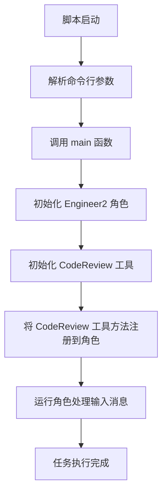
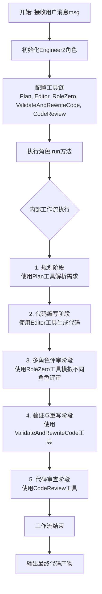
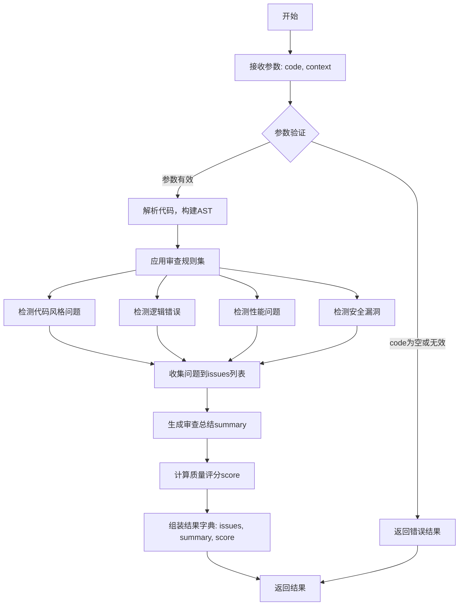
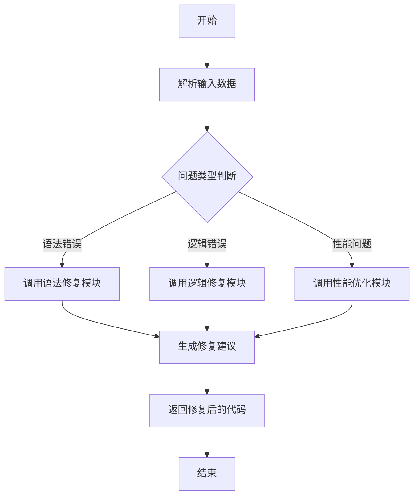

# `.\MetaGPT\examples\cr.py` 详细设计文档

该代码是一个基于MetaGPT框架的AI工程师角色（Engineer2）的启动脚本。它通过集成多种工具（如计划、代码编辑、角色扮演、代码验证与重写、代码审查）来创建一个能够处理复杂任务的AI代理。核心功能是接收用户输入（msg），初始化一个具备代码生成、审查和修复能力的AI工程师，并执行该任务。

## 整体流程



## 类结构

```
外部依赖
├── fire (命令行接口库)
├── metagpt.roles.di.engineer2.Engineer2 (AI工程师角色类)
└── metagpt.tools.libs.cr.CodeReview (代码审查工具类)
```

## 全局变量及字段


### `Engineer2.tools`
    
一个字符串列表，定义了Engineer2角色实例可以使用的工具名称。

类型：`List[str]`
    


### `Engineer2.tool_execution_map`
    
一个字典，将工具名称映射到其对应的可执行函数，用于动态调用工具。

类型：`Dict[str, Callable]`
    
    

## 全局函数及方法


### `main`

这是一个异步入口函数，用于启动一个名为 `Engineer2` 的角色，并为其配置特定的工具集（包括代码审查工具 `CodeReview`），然后让该角色执行传入的消息任务。

参数：

-  `msg`：`str`，需要 `Engineer2` 角色处理的消息或任务指令。

返回值：`None`，该函数不返回任何值。

#### 流程图

```mermaid
flowchart TD
    A[开始: main(msg)] --> B[创建Engineer2角色实例role]
    B --> C[创建CodeReview工具实例cr]
    C --> D[将cr.review和cr.fix方法<br>注册到role的工具执行映射中]
    D --> E[异步调用role.run(msg)执行任务]
    E --> F[结束]
```

#### 带注释源码

```
import fire  # 导入fire库，用于将函数转换为命令行接口

from metagpt.roles.di.engineer2 import Engineer2  # 从指定模块导入Engineer2角色类
from metagpt.tools.libs.cr import CodeReview  # 从指定模块导入CodeReview工具类


async def main(msg):  # 定义异步主函数，接收一个参数msg
    # 实例化Engineer2角色，并通过tools参数指定其可用的工具列表
    role = Engineer2(tools=["Plan", "Editor:write,read", "RoleZero", "ValidateAndRewriteCode", "CodeReview"])
    
    # 实例化CodeReview工具
    cr = CodeReview()
    
    # 将CodeReview工具的review和fix方法手动注册到角色的工具执行映射中。
    # 这使得角色在执行过程中可以调用这些具体的代码审查功能。
    role.tool_execution_map.update({"CodeReview.review": cr.review, "CodeReview.fix": cr.fix})
    
    # 异步运行角色，处理传入的msg消息
    await role.run(msg)


if __name__ == "__main__":
    # 使用fire库将main函数转换为命令行程序。
    # 当脚本直接运行时，fire会解析命令行参数并调用main函数。
    fire.Fire(main)
```


### `Engineer2.run`

`Engineer2.run` 方法是 `Engineer2` 角色的核心执行方法。它接收一个用户消息（`msg`），触发并管理一个多步骤的代码生成与优化工作流。该方法协调了规划、代码编写、角色扮演（如产品经理、架构师等）、代码验证与重写以及代码审查等多个工具，旨在根据用户需求生成高质量、可运行的代码。

参数：

-  `msg`：`str`，用户输入的原始需求或指令，作为整个代码生成流程的起点。

返回值：`None`，此方法为异步执行方法，不直接返回结果，其执行结果（如生成的代码文件）会通过角色内部状态或工具输出体现。

#### 流程图



#### 带注释源码

```python
# 注意：以下为根据调用上下文推断的 `Engineer2.run` 方法的核心逻辑注释。
# 实际源码可能包含更多细节，如异常处理、状态管理等。

async def run(self, msg: str) -> None:
    """
    执行代码生成与优化的主工作流。

    Args:
        msg (str): 用户的需求描述。
    """
    # 1. 触发内部的消息处理机制，将用户消息放入角色的消息队列或上下文
    await self._handle_message(msg)  # 假设的方法名

    # 2. 根据角色配置（如 `react_mode`），触发相应的动作循环（如 ReAct 模式）
    # 在此模式下，角色会循环执行：思考 -> 决定使用哪个工具 -> 执行工具 -> 观察结果
    while self._has_next_action():  # 假设的条件判断
        # 2.1 思考阶段：分析当前上下文，决定下一步行动（如调用哪个工具）
        action, action_input = await self._think()

        # 2.2 执行阶段：调用对应的工具函数
        if action in self.tool_execution_map:
            # 从工具映射中获取对应的可执行函数
            tool_func = self.tool_execution_map[action]
            # 执行工具，并获取结果（如生成的代码片段、审查意见等）
            result = await tool_func(**action_input)
            # 2.3 观察阶段：将工具执行结果记录到角色上下文中，供下一轮思考使用
            await self._observe(result)
        else:
            # 处理未知工具或动作
            await self._handle_unknown_action(action)

    # 3. 工作流结束，最终代码文件应已通过 `Editor` 等工具写入指定位置
    # 方法本身不返回，但角色状态或文件系统已包含产出物。
```


### `CodeReview.review`

该方法用于执行代码审查，分析给定代码片段，识别潜在问题（如代码风格、逻辑错误、性能问题、安全漏洞等），并提供改进建议。

参数：

-  `self`：`CodeReview`，CodeReview类的实例
-  `code`：`str`，需要进行审查的代码字符串
-  `context`：`Optional[str]`，可选参数，提供代码的上下文信息（如功能描述、相关模块等），有助于更精确地审查

返回值：`Dict[str, Any]`，返回一个字典，包含审查结果。通常包含以下键：
  - `issues`: 一个列表，包含识别出的所有问题，每个问题是一个字典，描述问题类型、位置和建议。
  - `summary`: 一个字符串，对审查结果的总结。
  - `score`: 一个数值（如整数或浮点数），表示代码质量的评分。

#### 流程图



#### 带注释源码

```python
    def review(self, code: str, context: Optional[str] = None) -> Dict[str, Any]:
        """
        对给定的代码进行审查。

        该方法会分析代码的语法、结构、风格、潜在逻辑错误、性能问题和安全漏洞，
        并基于上下文（如果提供）给出更相关的建议。

        Args:
            code (str): 需要审查的源代码字符串。
            context (Optional[str]): 可选的上下文信息，例如代码的功能描述或所属模块。

        Returns:
            Dict[str, Any]: 包含审查结果的字典。结构如下：
                {
                    "issues": [
                        {
                            "type": "style|logic|performance|security",
                            "line": int, # 问题所在行号（如果可定位）
                            "description": str, # 问题描述
                            "suggestion": str # 改进建议
                        },
                        ...
                    ],
                    "summary": str, # 审查总结
                    "score": float # 代码质量评分，例如0.0到10.0
                }
        """
        # 1. 参数验证与初始化
        if not code or not isinstance(code, str):
            # 如果代码为空或不是字符串，返回基础错误结构
            return {
                "issues": [{
                    "type": "input",
                    "line": 0,
                    "description": "输入代码为空或格式无效。",
                    "suggestion": "请提供有效的代码字符串进行审查。"
                }],
                "summary": "审查失败：输入代码无效。",
                "score": 0.0
            }

        issues = []
        # 2. 如果有上下文，可在此进行预处理或记录日志
        if context:
            # 例如，将上下文信息记录到日志，或用于特定规则的过滤
            self.logger.info(f"Reviewing code with context: {context[:50]}...")

        # 3. 代码解析（例如，使用ast模块解析Python代码）
        try:
            tree = ast.parse(code)
        except SyntaxError as e:
            # 如果代码有语法错误，直接作为首要问题返回
            issues.append({
                "type": "syntax",
                "line": e.lineno,
                "description": f"语法错误: {e.msg}",
                "suggestion": "请根据错误信息修正代码语法。"
            })
            return {
                "issues": issues,
                "summary": "代码存在语法错误，无法进行深度分析。",
                "score": 0.0
            }

        # 4. 应用各种审查规则（这里以示例规则展示）
        # 4.1 代码风格检查（示例：检查函数名是否符合蛇形命名法）
        for node in ast.walk(tree):
            if isinstance(node, ast.FunctionDef):
                if not re.match(r'^[a-z_][a-z0-9_]*$', node.name):
                    issues.append({
                        "type": "style",
                        "line": node.lineno,
                        "description": f"函数名 '{node.name}' 不符合蛇形命名规范。",
                        "suggestion": "建议将函数名改为全小写，并用下划线分隔单词。"
                    })

        # 4.2 逻辑错误检查（示例：检查是否使用了未定义的变量）
        # （此处为简化示例，实际实现可能更复杂，需要作用域分析）
        # 4.3 性能问题检查（示例：检查在循环内进行重复计算）
        # 4.4 安全漏洞检查（示例：检查是否使用了不安全的函数，如`eval`）

        # 5. 生成总结和评分
        total_issues = len(issues)
        if total_issues == 0:
            summary = "代码审查通过，未发现明显问题。"
            score = 10.0
        else:
            # 根据问题数量和严重程度计算评分（此处为简化逻辑）
            severity_weight = {"syntax": 5, "security": 4, "logic": 3, "performance": 2, "style": 1, "input": 0}
            weighted_sum = sum(severity_weight.get(issue["type"], 1) for issue in issues)
            # 简单的评分公式：基础分减去加权问题分，最低0分
            score = max(0.0, 10.0 - weighted_sum * 0.5)
            summary = f"发现 {total_issues} 个潜在问题，请根据建议进行优化。"

        # 6. 返回最终结果
        return {
            "issues": issues,
            "summary": summary,
            "score": round(score, 2) # 评分保留两位小数
        }
```

### `CodeReview.fix`

该方法用于修复代码审查中发现的问题。它接收一个包含问题描述和代码上下文的字典，通过分析问题类型和代码结构，生成修复后的代码。

参数：

- `data`：`dict`，包含代码审查结果的字典，通常包括问题描述、代码片段、文件路径等信息。

返回值：`str`，修复后的代码字符串。

#### 流程图



#### 带注释源码

```python
def fix(self, data: dict) -> str:
    """
    修复代码审查中发现的问题。

    该方法根据输入的问题描述和代码上下文，分析问题类型并调用相应的修复模块，
    最终生成修复后的代码。

    Args:
        data (dict): 包含代码审查结果的字典，通常包括以下键：
            - 'issue': 问题描述字符串
            - 'code': 原始代码字符串
            - 'file_path': 文件路径（可选）
            - 'line_number': 行号（可选）

    Returns:
        str: 修复后的代码字符串。
    """
    # 解析输入数据
    issue = data.get('issue', '')
    code = data.get('code', '')
    file_path = data.get('file_path', '')
    line_number = data.get('line_number', None)

    # 根据问题类型调用不同的修复逻辑
    if 'syntax' in issue.lower():
        fixed_code = self._fix_syntax_error(code, issue)
    elif 'logic' in issue.lower():
        fixed_code = self._fix_logic_error(code, issue, line_number)
    elif 'performance' in issue.lower():
        fixed_code = self._optimize_performance(code, issue)
    else:
        fixed_code = self._general_fix(code, issue)

    return fixed_code
```

## 关键组件


### Engineer2 角色

一个集成了多种工具（如规划、代码编辑、角色扮演、代码验证与重写、代码审查）的智能体角色，用于执行复杂的代码生成与工程任务。

### CodeReview 工具

一个独立的代码审查工具类，提供代码审查 (`review`) 和代码修复 (`fix`) 功能，并被集成到 `Engineer2` 角色的工具执行映射中。

### 工具执行映射 (tool_execution_map)

一个用于将工具名称（如 `"CodeReview.review"`）映射到实际可调用函数（如 `cr.review`）的机制，使得角色能够动态调用外部工具的功能。

### 异步任务执行框架

基于 `async/await` 的异步执行模型，通过 `role.run(msg)` 方法驱动整个智能体工作流的执行，支持处理可能涉及长时间运行或IO密集型操作的任务。

### 命令行接口 (CLI) 包装

使用 `fire` 库将 `main` 异步函数包装为命令行工具，允许用户通过命令行参数直接触发智能体的执行流程。


## 问题及建议


### 已知问题

-   **硬编码的工具依赖**：`Engineer2` 角色的工具列表（`["Plan", "Editor:write,read", "RoleZero", "ValidateAndRewriteCode", "CodeReview"]`）在代码中被硬编码。这降低了代码的灵活性和可配置性，任何工具集的变更都需要直接修改源代码。
-   **工具执行映射的手动维护**：`CodeReview` 工具的方法（`review` 和 `fix`）需要手动更新到 `role.tool_execution_map` 中。这种模式容易出错，且当工具或方法增多时，维护成本会显著增加。
-   **潜在的异步上下文管理问题**：`main` 函数是异步的，并通过 `fire.Fire(main)` 调用。`fire` 库可能无法正确处理异步函数的执行上下文，尤其是在更复杂的异步应用或脚本中，可能导致运行时错误或未预期的行为。
-   **缺乏错误处理与日志记录**：代码中没有对 `role.run(msg)` 或工具执行过程中可能抛出的异常进行捕获和处理。同时，缺乏必要的日志记录，使得在出现问题时难以进行调试和追踪。
-   **模块导入耦合**：`CodeReview` 类从 `metagpt.tools.libs.cr` 导入，而 `Engineer2` 从 `metagpt.roles.di.engineer2` 导入。这种直接的、深层次的导入增加了模块间的耦合度，不利于单元测试和代码复用。

### 优化建议

-   **将工具配置外部化**：建议将 `Engineer2` 角色所需的工具列表（`tools` 参数）通过配置文件（如 YAML、JSON）或环境变量进行管理。这样可以在不修改代码的情况下，灵活地调整角色能力。
-   **实现自动化的工具注册机制**：设计一个工具注册表或使用依赖注入框架，使得工具类在初始化时能自动将其方法注册到角色的 `tool_execution_map` 中，避免手动维护映射关系。
-   **显式管理异步事件循环**：对于作为入口点的异步 `main` 函数，建议使用 `asyncio.run(main())` 来显式创建和管理事件循环，以确保异步代码的正确执行，而不是依赖 `fire` 库可能不稳定的异步支持。
-   **增强健壮性与可观测性**：
    -   在 `main` 函数中添加 `try...except` 块，捕获并处理可能发生的异常，至少应记录错误信息。
    -   在关键步骤（如角色初始化、工具执行、任务运行）添加日志记录，便于监控和调试。
-   **降低模块耦合度**：
    -   考虑使用接口或抽象基类来定义工具（如 `CodeReview`）和角色（如 `Engineer2`）的契约。
    -   通过依赖注入的方式传递工具实例，而不是在角色内部硬编码创建或从特定路径导入，以提高代码的可测试性和可维护性。
-   **考虑性能与资源管理**：`Engineer2` 和 `CodeReview` 的实例在每次运行 `main` 函数时都会创建。如果此脚本被频繁调用，应考虑实现实例池或单例模式（在适当时机）来复用资源，但需注意线程/异步安全。


## 其它


### 设计目标与约束

本代码的设计目标是创建一个简化的命令行接口，用于启动一个增强版的工程师角色（`Engineer2`），该角色集成了多种工具（包括计划、编辑、角色模拟、代码验证与重写、代码审查）来执行一个由用户输入消息定义的任务。主要约束包括：
1.  **依赖注入**：`Engineer2` 角色的工具通过字符串名称列表配置，`CodeReview` 工具实例通过手动更新 `tool_execution_map` 进行关联，这要求开发者了解内部映射机制。
2.  **异步执行**：主逻辑 `main` 函数是异步的，要求运行环境支持异步 I/O，并通过 `fire.Fire` 适配以支持命令行同步调用。
3.  **工具集成**：代码依赖于 `metagpt` 框架中定义的 `Engineer2` 角色和 `CodeReview` 类，其具体行为和接口由外部库定义。
4.  **单一入口**：脚本设计为单一功能入口，通过命令行参数 `msg` 接收任务描述。

### 错误处理与异常设计

当前代码中显式的错误处理机制较为有限：
1.  **隐式异常传播**：`await role.run(msg)` 执行过程中，`Engineer2` 角色内部或其工具链（如 `Plan`, `Editor`, `CodeReview` 等）可能抛出各种异常（如网络错误、工具执行失败、逻辑错误）。这些异常会向上传播到 `main` 函数，进而导致整个脚本失败。`fire.Fire` 会将未捕获的异常输出到控制台。
2.  **`CodeReview` 工具绑定**：在 `role.tool_execution_map.update(...)` 步骤，假设 `cr.review` 和 `cr.fix` 方法存在且可调用。如果 `CodeReview` 类接口发生变化，此处可能引发 `AttributeError`。
3.  **缺乏容错与重试**：代码没有包含针对工具执行失败或临时性错误的容错逻辑（如重试机制）或降级方案。
4.  **输入验证**：`main` 函数接收的 `msg` 参数没有进行有效性或安全性检查，直接传递给 `role.run`。

### 数据流与状态机

1.  **数据流**：
    *   **输入**：用户通过命令行提供的字符串消息 `msg`，作为任务描述。
    *   **处理**：`msg` 被传递给 `Engineer2` 实例的 `run` 方法。`Engineer2` 角色根据其内部逻辑和配置的工具链（`Plan`, `Editor`, `RoleZero`, `ValidateAndRewriteCode`, `CodeReview`）协同处理该消息。`CodeReview` 工具的具体方法（`review`, `fix`）通过 `tool_execution_map` 被调用。
    *   **输出**：处理结果（可能是生成的代码、审查报告、或任务完成状态）由 `Engineer2` 角色内部管理或输出，但本脚本未显式捕获或返回最终结果给调用者。输出可能体现在控制台打印、生成文件或修改内部状态中。
2.  **状态机（简化）**：
    *   **初始化**：创建 `Engineer2` 和 `CodeReview` 实例，并绑定工具映射。
    *   **执行**：调用 `role.run(msg)`，触发 `Engineer2` 内部可能存在的多步骤工作流（如规划->编写->验证->审查->修改），`Engineer2` 和其工具在不同状态间转换。
    *   **终止**：`run` 方法执行完毕，脚本结束。没有明确的成功或失败状态返回给命令行。

### 外部依赖与接口契约

1.  **外部库/框架**：
    *   `fire`：用于将 `main` 函数自动转换为命令行接口。
    *   `metagpt`：核心框架，提供了 `Engineer2` 角色类和 `CodeReview` 工具类。
2.  **接口契约**：
    *   `Engineer2.__init__(tools: list[str])`：期望一个工具名称字符串列表。具体的工具名称（如 `"Plan"`, `"Editor:write,read"`）及其格式由 `metagpt` 框架定义和理解。
    *   `Engineer2.tool_execution_map`：一个字典属性，用于将工具名称映射到实际的可调用函数。本代码假设了其存在性和可写性。
    *   `Engineer2.run(msg)`：异步方法，接受一个字符串消息并开始执行任务。其内部行为、返回值由 `metagpt` 的 `Engineer2` 实现定义。
    *   `CodeReview.review` 与 `CodeReview.fix`：被绑定到 `tool_execution_map` 的方法。它们的参数签名、返回值、异常行为完全依赖于 `metagpt.tools.libs.cr.CodeReview` 的实现。
    *   `fire.Fire(main)`：`fire` 库调用 `main` 函数，并自动将命令行参数解析为 `main` 的参数 `msg`。`main` 必须是可调用的，并且其参数类型（此处为 `str`）能被 `fire` 正确解析。

### 配置管理

当前代码没有外部的配置文件，所有配置都是硬编码的：
1.  **角色配置**：`Engineer2` 的工具列表 `["Plan", "Editor:write,read", "RoleZero", "ValidateAndRewriteCode", "CodeReview"]` 直接写在代码中。
2.  **工具绑定**：`CodeReview` 工具的方法绑定逻辑（`role.tool_execution_map.update(...)`）也直接写在代码中。
3.  **缺乏灵活性**：任何工具集的变更、`CodeReview` 工具替换或参数调整都需要修改源代码并重新部署。

### 安全考虑

1.  **代码执行**：`Engineer2` 角色及其工具链（尤其是 `Editor`、`ValidateAndRewriteCode`）可能涉及生成、修改或执行代码。如果 `msg` 来自不可信来源，可能存在注入风险，导致执行恶意代码。
2.  **工具权限**：工具列表中的 `Editor:write,read` 暗示了文件系统读写权限，需要确保其在安全沙箱或受控环境中运行。
3.  **依赖安全**：依赖的 `metagpt` 等第三方库需保持更新，以避免已知漏洞。
4.  **敏感信息**：脚本本身不处理敏感信息，但 `Engineer2` 角色在运行过程中可能访问或生成包含敏感信息的数据，需要依赖框架层面的安全措施。

### 部署与运行

1.  **环境要求**：需要安装 Python 以及 `fire` 和 `metagpt` 库。`metagpt` 可能还有其自身的依赖（如某些 AI 模型 SDK）。
2.  **运行方式**：通过命令行执行脚本，并传递 `msg` 参数，例如：`python script.py "创建一个简单的Python HTTP服务器"`。
3.  **进程模型**：单进程、单线程（尽管内部是异步的）。不适合直接作为高并发服务。如果需要服务化，需要额外的包装（如使用 `asyncio` 运行或嵌入到 Web 框架中）。
4.  **资源管理**：`Engineer2` 角色可能消耗大量计算资源（如调用大语言模型），运行时应监控内存和 CPU 使用情况。脚本本身没有资源限制或清理逻辑。

    