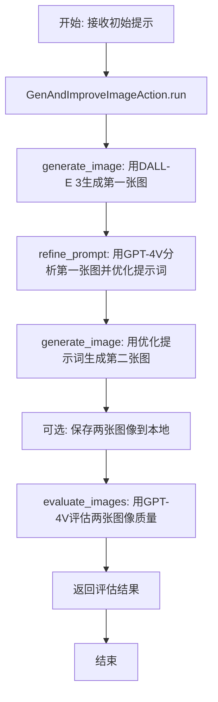
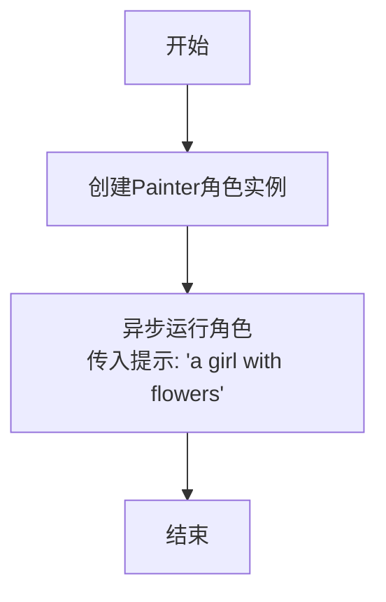
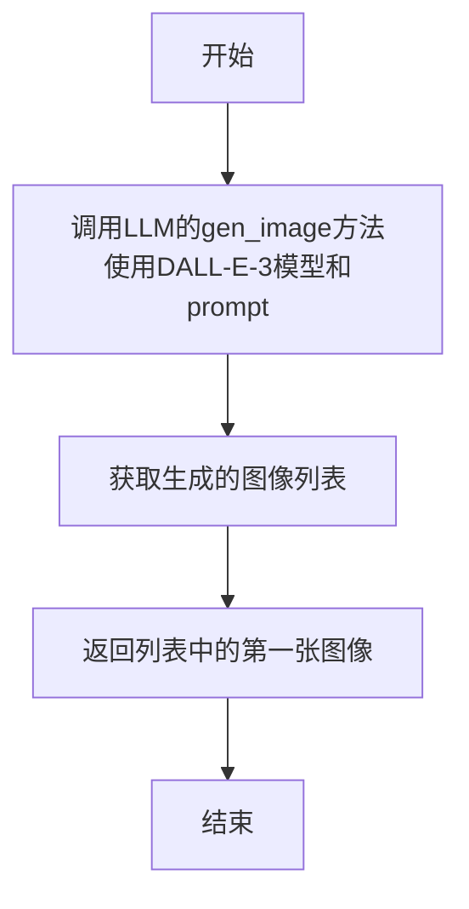
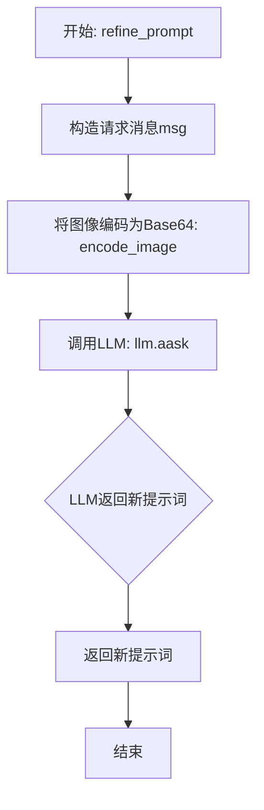
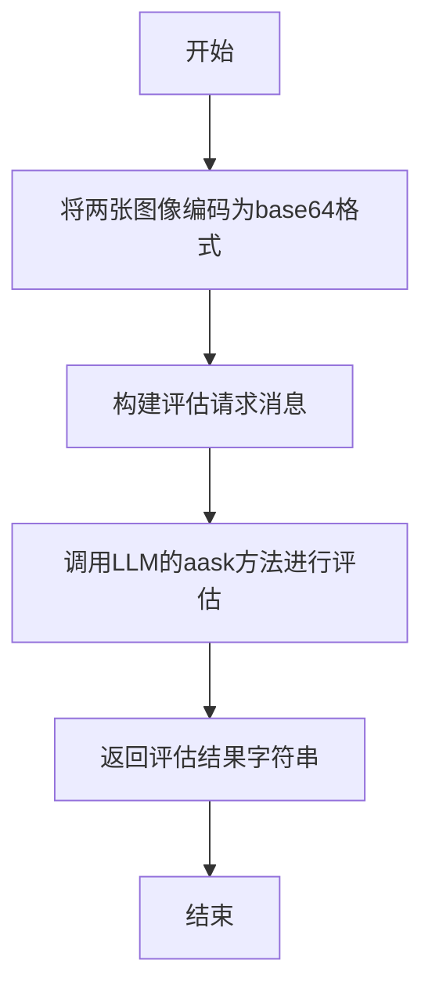
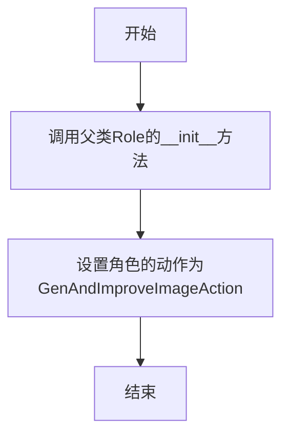

# `.\MetaGPT\examples\dalle_gpt4v_agent.py` 详细设计文档

该代码实现了一个基于GPT-4V和DALL-E 3的绘画角色系统，核心功能是通过迭代优化提示词来生成和改进图像。系统首先根据初始提示生成第一张图像，然后使用GPT-4V分析该图像并优化提示词，再用优化后的提示词生成第二张图像，最后评估两张图像的质量差异。

## 整体流程



## 类结构

```
Action (基类)
└── GenAndImproveImageAction
Role (基类)
└── Painter
```

## 全局变量及字段


### `GenAndImproveImageAction.save_image`
    
控制是否将生成的图像保存到本地文件的标志。

类型：`bool`
    


### `Painter.name`
    
角色的名称，用于标识该角色实例。

类型：`str`
    


### `Painter.profile`
    
角色的简介或描述，说明角色的身份或专长。

类型：`str`
    


### `Painter.goal`
    
角色的目标，定义了该角色需要完成的核心任务。

类型：`str`
    
    

## 全局函数及方法


### `main`

`main` 函数是程序的入口点，它创建了一个 `Painter` 角色实例，并异步运行该角色，传入初始提示信息 "a girl with flowers"，以启动图像生成与优化的流程。

参数：

-  `无参数`

返回值：`None`，该函数不返回任何值，其主要作用是启动异步任务。

#### 流程图



#### 带注释源码

```python
async def main():
    # 创建一个Painter角色实例，该角色名为"MaLiang"，目标是生成精美的画作。
    role = Painter()
    # 异步运行角色的run方法，传入初始提示信息"a girl with flowers"。
    # 这将触发角色内部的GenAndImproveImageAction，执行图像生成、提示优化和图像评估的完整流程。
    await role.run(with_message="a girl with flowers")
```


### `GenAndImproveImageAction.generate_image`

该方法使用 DALL-E-3 模型根据给定的文本提示生成一张图像。

参数：
- `prompt`：`str`，描述要生成图像的文本提示。

返回值：`Image`，返回生成的图像对象。

#### 流程图



#### 带注释源码

```python
async def generate_image(self, prompt: str) -> Image:
    # 调用大语言模型（LLM）的图像生成接口，指定使用 DALL-E-3 模型和传入的提示词
    imgs = await self.llm.gen_image(model="dall-e-3", prompt=prompt)
    # 返回生成的图像列表中的第一张图像
    return imgs[0]
```

### `GenAndImproveImageAction.refine_prompt`

该方法使用 GPT-4V 模型，基于给定的原始提示词和生成的图像，生成一个更精细、更优化的新提示词。它通过将图像编码为 Base64 格式，并结合文本指令，请求大语言模型进行提示词优化。

参数：

- `old_prompt`：`str`，原始的图像生成提示词。
- `image`：`PIL.Image.Image`，根据原始提示词生成的图像对象。

返回值：`str`，由 GPT-4V 模型生成的、优化后的新提示词。

#### 流程图



#### 带注释源码

```python
async def refine_prompt(self, old_prompt: str, image: Image) -> str:
    # 构造发送给大语言模型的指令消息。
    # 消息中指定了AI的角色（创意画家），并提供了原始提示词和任务要求（优化提示词并输出新提示词）。
    msg = (
        f"You are a creative painter, with the given generated image and old prompt: {old_prompt}, "
        f"please refine the prompt and generate new one. Just output the new prompt."
    )
    # 将PIL Image对象编码为Base64字符串，以便通过API发送给支持图像输入的模型（如GPT-4V）。
    b64_img = encode_image(image)
    # 异步调用大语言模型（LLM）的aask方法，发送文本消息和编码后的图像。
    # 模型将基于视觉和文本信息生成新的、优化后的提示词。
    new_prompt = await self.llm.aask(msg=msg, images=[b64_img])
    # 返回模型生成的新提示词。
    return new_prompt
```

### `GenAndImproveImageAction.evaluate_images`

该方法使用 GPT-4V 模型，基于给定的提示词和两张生成的图像，判断第二张图像是否比第一张图像更好。它通过将图像编码为 base64 格式，并发送给大语言模型进行评估，最终返回模型的判断结果（"True" 或 "False"）。

参数：

- `old_prompt`：`str`，原始的图像生成提示词。
- `images`：`list[Image]`，包含两张 PIL Image 对象的列表，第一张是旧提示词生成的图像，第二张是新提示词生成的图像。

返回值：`str`，返回大语言模型的评估结果，通常为字符串 "True" 或 "False"。

#### 流程图



#### 带注释源码

```python
async def evaluate_images(self, old_prompt: str, images: list[Image]) -> str:
    # 构建发送给大语言模型的评估请求消息
    msg = (
        "With the prompt and two generated image, to judge if the second one is better than the first one. "
        "If so, just output True else output False"
    )
    # 将列表中的每张 PIL Image 对象编码为 base64 字符串
    b64_imgs = [encode_image(img) for img in images]
    # 异步调用大语言模型的 aask 方法，传入文本消息和图像列表，获取评估结果
    res = await self.llm.aask(msg=msg, images=b64_imgs)
    # 返回大语言模型输出的评估结果（字符串）
    return res
```

### `GenAndImproveImageAction.run`

该方法是一个异步操作，负责执行图像生成与优化的完整流程。它接收一个消息列表，从中提取最后一个消息的内容作为初始提示词，然后依次执行以下步骤：1) 使用初始提示词通过DALL-E-3生成第一张图像；2) 将第一张图像和初始提示词提交给GPT-4V模型，以获取一个优化后的新提示词；3) 使用新提示词生成第二张图像；4) 将两张图像和初始提示词提交给GPT-4V模型，评估第二张图像是否优于第一张；5) 根据配置决定是否将两张图像保存到本地；6) 最终返回一个包含评估结果的字符串。

参数：
- `messages`：`list[Message]`，一个包含`Message`对象的列表，通常来自对话历史。方法会使用列表中最后一个消息的`content`字段作为初始图像生成提示词。

返回值：`str`，一个字符串，包含了GPT-4V模型对两张生成图像的比较评估结果，格式为`"The second generated image is better than the first one: {True/False}"`。

#### 流程图

```mermaid
flowchart TD
    A[开始: run(messages)] --> B[从messages中提取最后一个消息内容作为prompt]
    B --> C[调用generate_image(prompt)生成old_img]
    C --> D[调用refine_prompt(prompt, old_img)获取new_prompt]
    D --> E[调用generate_image(new_prompt)生成new_img]
    E --> F{self.save_image为True?}
    F -- 是 --> G[保存old_img和new_img到本地]
    F -- 否 --> H[跳过保存]
    G --> I
    H --> I[调用evaluate_images(prompt, [old_img, new_img])获取评估结果res]
    I --> J[构造并返回评估意见字符串]
    J --> K[结束]
```

#### 带注释源码

```python
async def run(self, messages: list[Message]) -> str:
    # 1. 从输入的消息列表中获取最后一个消息的内容作为初始图像生成提示词。
    prompt = messages[-1].content

    # 2. 使用初始提示词调用DALL-E-3生成第一张图像（old_img）。
    old_img: Image = await self.generate_image(prompt)
    # 3. 将第一张图像和初始提示词提交给GPT-4V，让其优化并返回一个新的提示词（new_prompt）。
    new_prompt = await self.refine_prompt(old_prompt=prompt, image=old_img)
    # 记录原始和优化后的提示词，便于调试和追踪。
    logger.info(f"original prompt: {prompt}")
    logger.info(f"refined prompt: {new_prompt}")

    # 4. 使用优化后的新提示词再次调用DALL-E-3生成第二张图像（new_img）。
    new_img: Image = await self.generate_image(new_prompt)

    # 5. 如果类属性save_image为True，则将生成的两张图像保存到本地文件。
    if self.save_image:
        old_img.save("./img_by-dall-e_old.png")
        new_img.save("./img_by-dall-e_new.png")

    # 6. 将两张图像和初始提示词提交给GPT-4V，让其判断第二张图像是否优于第一张，并返回评估结果（True/False）。
    res = await self.evaluate_images(old_prompt=prompt, images=[old_img, new_img])

    # 7. 将评估结果构造成一个完整的意见字符串。
    opinion = f"The second generated image is better than the first one: {res}"
    # 记录评估意见。
    logger.info(f"evaluate opinion: {opinion}")

    # 8. 返回最终的评估意见字符串。
    return opinion
```

### `Painter.__init__`

该方法用于初始化`Painter`角色实例，继承父类`Role`的初始化逻辑，并设置该角色的默认动作为`GenAndImproveImageAction`。

参数：

- `**data`：`dict`，用于接收传递给`Painter`类的任意关键字参数，这些参数将传递给父类`Role`的构造函数。

返回值：`None`，该方法不返回任何值。

#### 流程图



#### 带注释源码

```python
def __init__(self, **data):
    super().__init__(**data)  # 调用父类Role的构造函数，传递所有接收到的关键字参数

    self.set_actions([GenAndImproveImageAction])  # 设置当前角色的默认动作为GenAndImproveImageAction
```

## 关键组件


### 张量索引与惰性加载

本代码未涉及张量操作，因此不包含张量索引与惰性加载组件。

### 反量化支持

本代码未涉及量化模型或量化数据，因此不包含反量化支持组件。

### 量化策略

本代码未涉及模型或数据的量化过程，因此不包含量化策略组件。

### 图像生成与提示词优化

通过调用DALL-E-3模型生成图像，并利用GPT-4-Vision模型分析生成的图像以优化原始提示词，实现迭代式的图像质量改进流程。

### 角色-动作框架

基于`Role`和`Action`类的框架设计，`Painter`角色封装了特定的目标与能力，并通过`GenAndImproveImageAction`动作类执行具体的图像生成、提示词优化和图像评估任务。


## 问题及建议


### 已知问题

-   **图像评估逻辑过于简单且不可靠**：`evaluate_images` 方法依赖 LLM 进行简单的 `True`/`False` 判断，缺乏客观、可量化的评估标准（如美学评分、与提示的语义一致性等）。LLM 的判断可能不稳定、主观，且无法处理复杂或细微的改进。
-   **缺乏迭代优化机制**：当前流程仅执行一次“生成-改进-再生成-评估”，如果评估结果为 `False`（新图不如旧图），流程即终止，没有回退到更优结果或进行多轮迭代优化的机制。
-   **错误处理机制缺失**：代码中没有对关键操作（如调用 `llm.gen_image`, `llm.aask`）进行异常捕获和处理。网络问题、API 限制、无效响应等都可能导致程序崩溃。
-   **硬编码的配置和路径**：`save_image` 逻辑中，图像保存路径（`"./img_by-dall-e_old.png"`）是硬编码的，缺乏灵活性。`model="dall-e-3"` 也硬编码在 `generate_image` 方法中。
-   **资源使用效率低**：`refine_prompt` 和 `evaluate_images` 方法都需要将 `PIL.Image` 对象编码为 Base64 字符串，这个过程如果图像较大或频繁调用，会产生不必要的内存和 CPU 开销。
-   **代码结构可扩展性不足**：`GenAndImproveImageAction` 的 `run` 方法将“生成-改进-评估”的固定流程写死。如果想调整步骤（例如，先评估再决定是否改进），或引入不同的评估策略，需要修改 `run` 方法，违反了开闭原则。

### 优化建议

-   **引入更健壮的图像评估体系**：
    -   设计一个 `ImageEvaluator` 类或一组评估函数，结合多种指标：使用专门的视觉-语言模型（如 CLIP）计算图像与提示的相似度；引入图像质量评估（IQA）算法；甚至可以考虑集成用户反馈机制。
    -   将评估结果从简单的布尔值改为分数或结构化数据，以便更精细地比较和决策。
-   **实现迭代优化循环**：
    -   修改 `run` 方法或 `Painter` 角色的运行逻辑，使其能够根据评估结果进行多轮“生成-评估-改进”循环。可以设置最大迭代次数、分数阈值等作为终止条件。
    -   实现一个历史记录机制，保存每一轮的最佳提示和对应图像，最终返回历史最优结果。
-   **增强错误处理与重试机制**：
    -   在 `llm.gen_image` 和 `llm.aask` 调用周围添加 `try-except` 块，捕获可能出现的异常（如 `APITimeoutError`, `RateLimitError`, `InvalidResponseError`）。
    -   对于可重试的错误（如网络超时、速率限制），实现指数退避的重试逻辑。
    -   提供有意义的错误日志和（在必要时）优雅的降级处理。
-   **将配置参数化**：
    -   将 DALL-E 模型名称、图像保存路径/格式、是否保存图像等配置项移出硬编码，改为通过 `__init__` 参数、配置文件或环境变量传入 `GenAndImproveImageAction`。
    -   例如：`def __init__(self, save_path: str = "./outputs", model: str = "dall-e-3", save_image: bool = True):`
-   **优化图像处理流程**：
    -   考虑缓存 Base64 编码结果，如果同一张图片在短时间内被多次使用（虽然在当前流程中不常见，但未来扩展后可能）。
    -   确保在不再需要 `PIL.Image` 对象时及时释放资源，特别是在循环迭代中。
-   **重构以提升可扩展性和可测试性**：
    -   将 `GenAndImproveImageAction` 中的三个核心步骤（`generate_image`, `refine_prompt`, `evaluate_images`）进一步抽象为独立的组件（策略模式）。这样可以在不修改主流程的情况下，轻松替换不同的图像生成器、提示优化器或评估器。
    -   为 `Action` 和其组件编写单元测试和集成测试，模拟 LLM 和图像生成 API 的响应，确保逻辑正确性。
-   **添加更详细的日志和监控**：
    -   在关键步骤记录更丰富的信息，如提示词演变过程、每轮评估的详细分数、API 调用耗时等。这有助于调试和后期分析优化效果。
    -   可以考虑添加简单的性能监控，跟踪每次运行的成本（Token 消耗、图片生成数量）和时间。


## 其它


### 设计目标与约束

本代码模块的核心设计目标是利用GPT-4V的多模态能力，通过迭代优化提示词（Prompt）来提升DALL-E 3生成的图像质量。其核心约束包括：1）依赖外部大语言模型（LLM）服务（GPT-4V和DALL-E 3）的可用性与API调用成本；2）图像处理与Base64编码的性能开销；3）异步编程模型要求，以确保在等待LLM响应时的高效性。

### 错误处理与异常设计

当前代码中缺乏显式的错误处理机制。潜在的风险点包括：1）`llm.gen_image`或`llm.aask` API调用失败（如网络错误、配额不足、模型不可用）；2）图像编码或保存过程中的I/O错误；3）LLM返回的响应不符合预期格式（例如，`evaluate_images`方法期望返回“True”或“False”，但模型可能返回其他内容）。建议增加`try...except`块来捕获`asyncio.TimeoutError`、`aiohttp.ClientError`以及自定义的业务逻辑异常，并进行相应的日志记录、重试或优雅降级处理。

### 数据流与状态机

该模块的数据流遵循一个清晰的“生成-优化-评估”单次迭代流程：
1.  **输入**：用户提供的初始文本提示（`prompt`）。
2.  **状态1 - 初始生成**：`GenAndImproveImageAction.run`调用`generate_image`，使用初始提示通过DALL-E 3生成第一张图像（`old_img`）。
3.  **状态2 - 提示词优化**：将`old_img`和初始提示输入`refine_prompt`方法，由GPT-4V分析并生成一个优化后的新提示（`new_prompt`）。
4.  **状态3 - 优化生成**：使用`new_prompt`再次调用`generate_image`，生成第二张图像（`new_img`）。
5.  **状态4 - 评估比较**：将初始提示和两张图像（`old_img`, `new_img`）输入`evaluate_images`方法，由GPT-4V判断第二张图是否优于第一张，并返回布尔值结果。
6.  **输出/结束**：将评估意见（`opinion`）作为动作的最终结果返回，并可选地保存两张图像到本地。这是一个线性流程，不构成循环状态机。

### 外部依赖与接口契约

1.  **LLM服务接口**：依赖`self.llm`对象，该对象需实现`gen_image(model: str, prompt: str)`和`aask(msg: str, images: list[str])`异步方法。前者调用DALL-E 3生成图像，后者调用GPT-4V进行多模态对话。
2.  **图像处理库**：依赖`PIL.Image`进行图像的打开、保存等基础操作。
3.  **基础框架**：依赖`metagpt`框架提供的`Action`、`Role`、`Message`等基类和工具函数（如`encode_image`）。这要求运行环境正确安装并配置了`metagpt`。
4.  **异步运行时**：依赖Python的`asyncio`库来执行异步函数。

### 配置与部署要求

1.  **模型配置**：必须在`config2.yaml`配置文件中将模型设置为`"gpt-4-vision-preview"`，以确保`llm.aask`能调用正确的多模态模型。
2.  **API密钥与环境**：需要正确设置OpenAI API密钥或相应LLM服务提供商的有效凭证。
3.  **文件系统权限**：当`GenAndImproveImageAction.save_image`为`True`时，程序需要有在当前目录（或指定路径）的写入权限，以保存生成的PNG图像。
4.  **Python环境**：需要安装`metagpt`、`Pillow`（PIL）等依赖包。

### 安全与合规考虑

1.  **内容安全**：生成的图像和优化的提示词可能包含不可预测的内容。在面向用户的产品中，应考虑对输入提示和输出图像增加内容安全过滤层，以防止生成不当、有害或侵犯版权的材料。
2.  **数据隐私**：本代码将图像编码为Base64后发送给外部LLM服务。需确保此操作符合用户数据隐私政策及相关法规（如GDPR），并评估服务提供商的数据处理条款。
3.  **资源消耗**：DALL-E 3和GPT-4V API调用成本较高，且可能有限速。在部署时需实施调用频率限制和成本监控，防止意外超额使用。

    