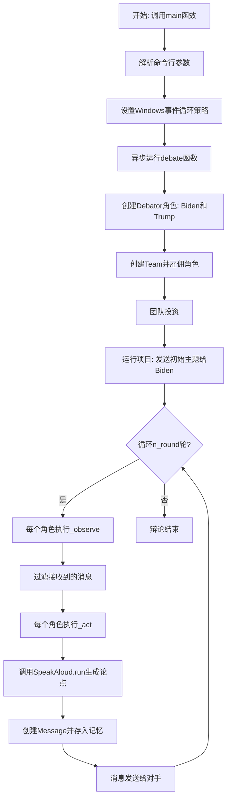
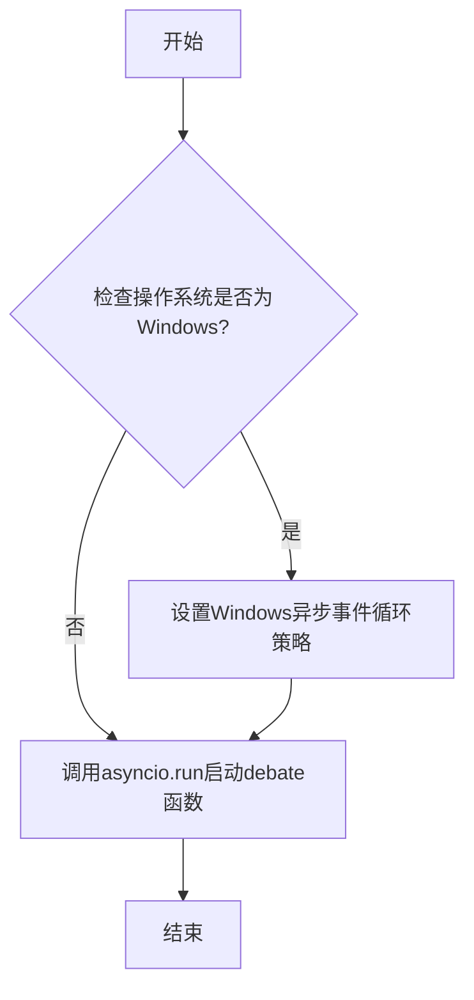
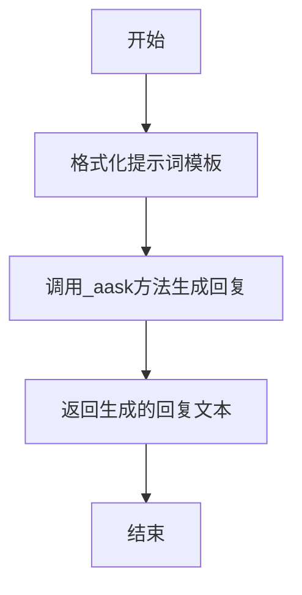
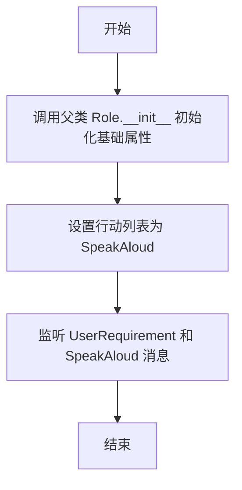

# `.\MetaGPT\examples\debate.py` 详细设计文档

该代码实现了一个基于MetaGPT框架的模拟辩论系统。系统创建了两个代表不同立场的辩论者角色（如拜登和特朗普），通过异步消息传递机制，让双方围绕给定主题进行多轮辩论。每个角色根据辩论历史和对手的论点，使用大语言模型生成具有情感和修辞色彩的回应，模拟了人类辩论的互动过程。

## 整体流程



## 类结构

```
Action (MetaGPT基类)
└── SpeakAloud (辩论发言动作)
Role (MetaGPT基类)
└── Debator (辩论者角色)
```

## 全局变量及字段


### `SpeakAloud.PROMPT_TEMPLATE`
    
用于生成辩论发言提示的模板字符串，包含背景、历史记录和当前回合的占位符。

类型：`str`
    


### `SpeakAloud.name`
    
动作的名称，固定为'SpeakAloud'，标识这是一个发言动作。

类型：`str`
    


### `Debator.name`
    
辩论者的名字，用于标识角色身份，如'Biden'或'Trump'。

类型：`str`
    


### `Debator.profile`
    
辩论者的身份或立场描述，如'Democrat'或'Republican'。

类型：`str`
    


### `Debator.opponent_name`
    
对手的名字，用于确定消息发送的目标和辩论的上下文。

类型：`str`
    
    

## 全局函数及方法

### `debate`

该函数是辩论模拟程序的主入口，负责初始化辩论角色（拜登和特朗普）、组建团队、注入资金并启动多轮辩论流程。

参数：

- `idea`：`str`，辩论主题，例如："Topic: The U.S. should commit more in climate change fighting"
- `investment`：`float`，投入的虚拟资金金额，用于控制团队运行资源，默认值为3.0
- `n_round`：`int`，辩论的最大轮次数，默认值为5

返回值：`None`，该函数为异步执行入口，不直接返回结果，而是通过异步事件循环运行整个辩论流程。

#### 流程图

```mermaid
flowchart TD
    A[开始: debate(idea, investment, n_round)] --> B[创建角色 Biden 和 Trump]
    B --> C[组建 Team 并雇佣角色]
    C --> D[为 Team 注入资金 investment]
    D --> E[运行项目<br>发送主题 idea 给 Biden]
    E --> F{循环 n_round 次?}
    F -- 是 --> G[执行 Team.run<br>（驱动角色观察与行动）]
    G --> F
    F -- 否 --> H[结束]
```

#### 带注释源码

```python
async def debate(idea: str, investment: float = 3.0, n_round: int = 5):
    """Run a team of presidents and watch they quarrel. :)"""
    # 1. 实例化两个辩论者角色：拜登（民主党）和特朗普（共和党），并互为对手。
    Biden = Debator(name="Biden", profile="Democrat", opponent_name="Trump")
    Trump = Debator(name="Trump", profile="Republican", opponent_name="Biden")
    # 2. 创建一个团队。
    team = Team()
    # 3. 将两个角色雇佣到团队中。
    team.hire([Biden, Trump])
    # 4. 为团队运行注入虚拟资金，这可能影响资源分配或运行能力。
    team.invest(investment)
    # 5. 启动项目：将辩论主题（idea）发送给拜登（Biden），让他首先发言，从而开始辩论。
    team.run_project(idea, send_to="Biden")
    # 6. 运行团队，进行指定轮数（n_round）的辩论。此方法将驱动角色进行多轮的观察（接收消息）和行动（发言）。
    await team.run(n_round=n_round)
```

### `main`

`main` 函数是辩论模拟程序的入口点，负责初始化异步事件循环并启动辩论流程。它接收辩论主题、投资金额和辩论轮数作为参数，并确保在 Windows 系统上正确配置异步事件循环策略。

参数：

- `idea`：`str`，辩论主题，例如 "Topic: The U.S. should commit more in climate change fighting" 或 "Trump: Climate change is a hoax"
- `investment`：`float`，贡献的美元金额以观看辩论，默认值为 3.0
- `n_round`：`int`，辩论的最大轮数，默认值为 10

返回值：`None`，无返回值

#### 流程图



#### 带注释源码

```python
def main(idea: str, investment: float = 3.0, n_round: int = 10):
    """
    :param idea: Debate topic, such as "Topic: The U.S. should commit more in climate change fighting"
                 or "Trump: Climate change is a hoax"
    :param investment: contribute a certain dollar amount to watch the debate
    :param n_round: maximum rounds of the debate
    :return:
    """
    # 检查当前操作系统是否为Windows，如果是，则设置Windows特定的异步事件循环策略
    if platform.system() == "Windows":
        asyncio.set_event_loop_policy(asyncio.WindowsSelectorEventLoopPolicy())
    # 使用asyncio.run启动异步函数debate，传入辩论主题、投资金额和轮数参数
    asyncio.run(debate(idea, investment, n_round))
```

### `SpeakAloud.run`

该方法根据给定的辩论历史、自身角色名和对手角色名，生成一个符合角色立场和修辞风格的、带有情感色彩的辩论回应。

参数：

- `context`：`str`，辩论历史，包含之前回合的辩论内容。
- `name`：`str`，当前发言角色的名字。
- `opponent_name`：`str`，对手角色的名字。

返回值：`str`，生成的辩论回应文本。

#### 流程图



#### 带注释源码

```python
async def run(self, context: str, name: str, opponent_name: str):
    # 使用类中定义的PROMPT_TEMPLATE模板，将传入的context、name和opponent_name参数填充到模板中，生成最终的提示词。
    prompt = self.PROMPT_TEMPLATE.format(context=context, name=name, opponent_name=opponent_name)
    # logger.info(prompt) # 此行被注释掉，用于调试时打印生成的提示词。

    # 调用父类Action的_aask异步方法，将生成的提示词发送给大语言模型（LLM）并获取其生成的文本回复。
    rsp = await self._aask(prompt)

    # 将LLM生成的回复文本返回给调用者。
    return rsp
```

### `Debator.__init__`

Debator 类的构造函数，用于初始化辩论者角色。它继承自 Role 基类，并通过调用父类的构造函数完成基础初始化，然后设置辩论者的行动为 SpeakAloud，并监听 UserRequirement 和 SpeakAloud 消息。

参数：

- `**data`：`Any`，关键字参数字典，用于传递初始化 Debator 实例所需的属性值，如 name、profile、opponent_name 等。

返回值：`None`，构造函数不返回任何值。

#### 流程图



#### 带注释源码

```python
def __init__(self, **data: Any):
    # 调用父类 Role 的构造函数，传入关键字参数字典 data 以初始化继承的属性
    super().__init__(**data)
    # 设置当前角色的行动列表，这里只包含 SpeakAloud 行动
    self.set_actions([SpeakAloud])
    # 设置当前角色监听的消息类型，包括 UserRequirement 和 SpeakAloud
    self._watch([UserRequirement, SpeakAloud])
```

### `Debator._observe`

该方法用于观察并处理角色接收到的消息。它首先调用父类的 `_observe` 方法获取所有新消息，然后过滤出那些发送给当前角色的消息，忽略自己上一轮发送的消息，最后返回过滤后新消息的数量。

参数：

-  `self`：`Debator` 实例，表示当前辩论者角色。

返回值：`int`，表示过滤后新消息的数量。

#### 流程图

```mermaid
flowchart TD
    A[开始] --> B[调用父类 Role._observe 方法]
    B --> C[获取 self.rc.news 中的所有新消息]
    C --> D[过滤消息: send_to == self.name]
    D --> E[更新 self.rc.news 为过滤后的列表]
    E --> F[返回新消息数量 len(self.rc.news)]
    F --> G[结束]
```

#### 带注释源码

```python
async def _observe(self) -> int:
    # 调用父类 Role 的 _observe 方法，获取环境中的新消息并存入 self.rc.news
    await super()._observe()
    # 过滤消息：只保留发送给当前角色（self.name）的消息，忽略自己上一轮发送的消息
    self.rc.news = [msg for msg in self.rc.news if msg.send_to == {self.name}]
    # 返回过滤后新消息的数量
    return len(self.rc.news)
```

### `Debator._act`

`Debator._act` 方法是 `Debator` 角色的核心行为方法。它负责在辩论的每一轮中，根据当前的辩论历史和对手信息，执行 `SpeakAloud` 动作来生成并发送一条新的辩论消息。该方法会收集记忆中的历史消息作为上下文，调用 `SpeakAloud` 动作生成回应，然后将回应封装成 `Message` 对象，存入记忆并返回，从而完成一轮发言。

参数：

-  `self`：`Debator` 实例，表示当前执行动作的辩论者角色。

返回值：`Message`，返回一个包含生成的辩论内容、发送者、接收者等信息的消息对象。

#### 流程图

```mermaid
flowchart TD
    A[开始 _act 方法] --> B[记录日志<br>“{self._setting}: to do {self.rc.todo}”]
    B --> C[获取待执行动作<br>todo = self.rc.todo]
    C --> D[获取记忆中的消息<br>memories = self.get_memories()]
    D --> E[构建上下文字符串<br>context = 连接所有消息的“发送者: 内容”]
    E --> F[异步执行动作<br>rsp = await todo.run(context, self.name, self.opponent_name)]
    F --> G[创建新的 Message 对象<br>包含内容、角色、触发动作、发送者、接收者]
    G --> H[将新消息添加到记忆<br>self.rc.memory.add(msg)]
    H --> I[返回新创建的 Message 对象]
    I --> J[结束]
```

#### 带注释源码

```python
async def _act(self) -> Message:
    # 记录日志，显示当前角色设置和将要执行的动作
    logger.info(f"{self._setting}: to do {self.rc.todo}({self.rc.todo.name})")
    # 从角色上下文（RoleContext）中获取待执行的动作，这里是一个 SpeakAloud 实例
    todo = self.rc.todo  # An instance of SpeakAloud

    # 获取该角色的记忆（即之前轮次的辩论消息）
    memories = self.get_memories()
    # 将记忆中的消息格式化为字符串，作为生成新回应的上下文。
    # 格式为：“发送者姓名: 消息内容”
    context = "\n".join(f"{msg.sent_from}: {msg.content}" for msg in memories)
    # print(context) # 调试用，可打印上下文

    # 异步执行 SpeakAloud 动作的 run 方法，传入上下文、自身姓名和对手姓名，获取生成的辩论回应文本
    rsp = await todo.run(context=context, name=self.name, opponent_name=self.opponent_name)

    # 将生成的回应文本封装成一个新的 Message 对象。
    # content: 生成的辩论内容
    # role: 角色的身份（如 Democrat, Republican）
    # cause_by: 触发此消息的动作类型（SpeakAloud）
    # sent_from: 发送者姓名（当前角色名）
    # send_to: 接收者姓名（对手姓名）
    msg = Message(
        content=rsp,
        role=self.profile,
        cause_by=type(todo),
        sent_from=self.name,
        send_to=self.opponent_name,
    )
    # 将新生成的消息添加到角色的记忆（Memory）中，以供后续轮次参考
    self.rc.memory.add(msg)

    # 返回新创建的消息对象，通常由调用方（如 Team）处理消息的广播或传递
    return msg
```

## 关键组件


### SpeakAloud Action

一个用于在辩论中生成发言内容的动作类，它根据给定的背景、辩论历史和角色信息，使用预定义的提示词模板调用语言模型生成具有情感和修辞色彩的回应。

### Debator Role

一个代表辩论参与者的角色类，它通过观察消息、执行SpeakAloud动作来生成辩论发言，并管理自己的记忆（对话历史），其核心行为是回应对手并推进辩论回合。

### Team

一个管理多个角色（如Biden和Trump）并协调他们执行项目的团队类，它负责分配资源、初始化项目运行环境并控制辩论的总轮次。

### Message

用于在角色之间传递信息的核心数据结构，包含内容、发送者、接收者、触发动作类型等元数据，是角色间通信和记忆存储的基本单元。

### 异步事件循环与任务调度

通过`asyncio`库管理异步操作，支持在Windows等不同平台上运行，协调多个角色的并发`_act`和`_observe`行为，实现模拟的实时辩论流程。


## 问题及建议


### 已知问题

-   **角色观察逻辑存在缺陷**：在 `Debator._observe` 方法中，筛选消息的条件 `msg.send_to == {self.name}` 使用了集合语法，意图可能是检查消息是否发送给自己，但实际创建了一个包含单个元素（角色名）的集合，导致条件永远为 `False`，使得角色无法正确接收对手的消息。这破坏了辩论的核心交互逻辑。
-   **硬编码的角色与流程**：`debate` 函数中直接实例化了名为 “Biden” 和 “Trump” 的特定角色，并将初始消息固定发送给 “Biden”。这使得代码复用性差，无法轻松配置其他辩手或改变初始发言者。
-   **缺乏明确的终止条件**：当前辩论仅依靠固定的轮次 (`n_round`) 终止，没有根据辩论内容（如达成共识、一方无话可说等）设计动态的、基于内容的终止判断逻辑。
-   **消息历史构建可能包含无关内容**：`Debator._act` 方法中，通过 `self.get_memories()` 获取所有记忆来构建上下文。这可能会包含非 `SpeakAloud` 动作产生的消息（例如初始的 `UserRequirement`），导致传递给 LLM 的提示包含可能干扰辩论的无关历史信息。
-   **投资参数未实际使用**：`Team.invest(investment)` 被调用，但在提供的代码片段中，`investment` 参数如何影响团队运行或辩论过程并未体现，可能是一个未实现或与当前示例无关的功能，容易造成混淆。

### 优化建议

-   **修复消息过滤逻辑**：将 `Debator._observe` 方法中的条件 `msg.send_to == {self.name}` 修改为 `msg.send_to == self.name`，以正确匹配字符串，确保角色能接收到发送给自己的消息。
-   **提高代码可配置性与复用性**：
    -   将 `debate` 函数重构为接受角色列表或配置字典作为参数，允许动态指定辩手数量、名称、立场和初始发言者。
    -   考虑将角色初始化（如 `Biden` 和 `Trump` 的创建）提取到函数外部或通过配置文件驱动。
-   **引入智能终止机制**：在 `Team.run` 循环或 `Debator._act` 方法中，可以加入对消息内容的分析（例如，检测是否出现重复论点、是否双方均表示妥协或无法反驳），实现基于辩论状态的提前终止，使模拟更真实。
-   **精确化上下文构建**：在 `Debator._act` 方法中构建 `context` 时，可以过滤 `memories`，只选择由 `SpeakAloud` 动作（或来自对手）产生的消息，确保上下文纯粹由辩论历史组成。
-   **明确或移除未使用的参数**：审查 `investment` 参数在 `Team` 类中的作用。如果在此辩论场景中确实无用，应考虑从 `debate` 和 `main` 函数签名中移除，或添加注释说明其预留用途，避免使用者误解。
-   **增强异常处理与日志**：在异步操作（如 `_aask`）和关键流程点增加更细致的异常捕获和日志记录，便于调试在复杂交互中可能出现的问题。
-   **考虑性能优化**：如果辩论轮次 (`n_round`) 很大，需注意 `self.rc.memory` 的增长。可以评估是否需要对记忆进行摘要或滚动窗口限制，以防止上下文过长影响 LLM 性能或增加 token 消耗。


## 其它


### 设计目标与约束

本代码实现了一个基于角色的异步辩论模拟系统。其核心设计目标是：1) 模拟两个角色（如拜登和特朗普）围绕给定主题进行多轮辩论；2) 通过异步架构支持高并发和响应式交互；3) 利用预定义的动作模板和角色观察-行动循环来生成符合角色设定的辩论内容。主要约束包括：1) 依赖 `asyncio` 进行异步操作，在 Windows 系统上需要特殊的事件循环策略；2) 辩论逻辑和内容生成依赖于 `metagpt` 框架提供的基类（`Role`, `Action`, `Team`）和消息传递机制；3) 辩论轮次和初始资金（`investment`）作为外部参数控制模拟的深度和资源消耗。

### 错误处理与异常设计

当前代码中的错误处理较为有限。主要依赖于 Python 和 `asyncio` 的默认异常传播机制。`debate` 和 `main` 函数没有显式的 `try-catch` 块来捕获和处理可能发生的异常，例如网络请求失败（如果 `_aask` 方法涉及）、参数无效或异步任务取消。`Role._observe` 方法中的消息过滤逻辑（`msg.send_to == {self.name}`）存在潜在问题：它试图将 `send_to` 字段与一个包含 `self.name` 的集合进行相等比较，这很可能是一个笔误，本意应为成员关系检查 `msg.send_to == self.name` 或 `msg.send_to in {self.name}`，这可能导致过滤失效或引发错误。整体缺乏对边界条件（如空消息列表、无效的角色名）的鲁棒性处理。

### 数据流与状态机

系统的核心数据流围绕 `Message` 对象在角色（`Debator`）和团队（`Team`）之间的传递。1) **初始化**：`main` -> `debate` -> 创建 `Biden` 和 `Trump` 角色并组建 `Team`。2) **启动**：`team.run_project(idea, send_to="Biden")` 创建一个初始 `UserRequirement` 消息发送给拜登，触发辩论。3) **循环（每轮）**：每个 `Debator` 实例遵循 `_observe` -> `_act` 循环。a) `_observe`: 从团队广播中过滤出发送给自己的消息（对手的发言），存入 `self.rc.news`。b) `_act`: 从记忆（`memories`）中构建辩论历史上下文，调用 `SpeakAloud.run` 生成新的发言内容，封装成 `Message`（指定 `sent_from` 为自己，`send_to` 为对手）并存入自身记忆，同时该消息会被提交到团队用于下一轮广播。4) **状态**：辩论历史状态分散保存在每个 `Debator` 的 `self.rc.memory` 中。团队通过 `n_round` 参数控制循环轮次，构成一个简单的有限轮次状态机。

### 外部依赖与接口契约

1.  **框架依赖**：强依赖 `metagpt` 框架，具体包括：
    *   `metagpt.actions.Action`, `UserRequirement`: `SpeakAloud` 和角色观察列表的基础。
    *   `metagpt.roles.Role`: `Debator` 的基类，提供了 `_observe`, `_act`, `set_actions`, `_watch`, `rc` 等核心机制。
    *   `metagpt.schema.Message`: 定义了消息的数据结构（`content`, `role`, `cause_by`, `sent_from`, `send_to`），是组件间通信的契约。
    *   `metagpt.team.Team`: 提供了角色管理、资金（计算资源）分配和项目运行的高级抽象。
2.  **第三方库**：
    *   `asyncio`: 用于实现异步执行。
    *   `fire`: 用于将 `main` 函数快速转换为命令行接口。
    *   `platform`: 用于检测操作系统以适配 Windows 的 `asyncio` 策略。
3.  **隐式契约**：
    *   `SpeakAloud._aask` 方法：继承自 `Action` 类，预期与某个大语言模型（LLM）或文本生成服务进行异步交互，返回生成的文本字符串。其具体的实现和配置不在本代码段中。
    *   `Team.invest` 和 `team.run`：涉及框架内部的计算资源管理和调度逻辑，本代码视其为黑盒。

    