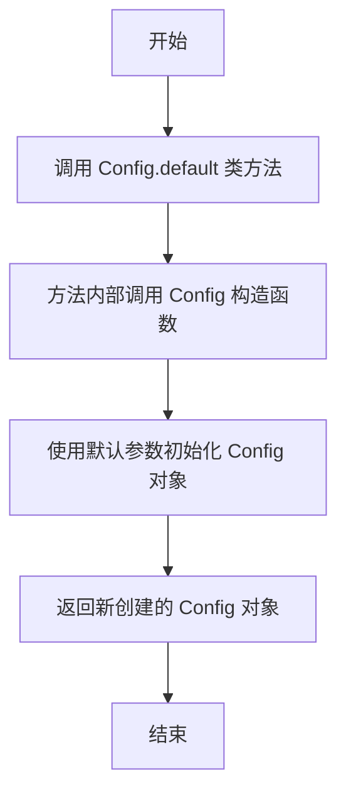
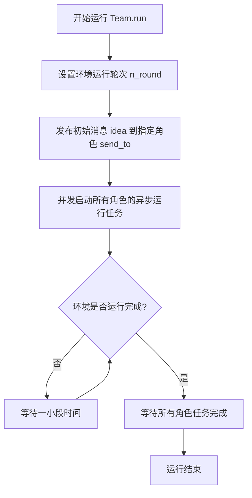

# `.\MetaGPT\examples\debate_simple.py` 详细设计文档

该代码使用MetaGPT框架模拟了一场美国总统选举辩论。它创建了两个分别代表民主党和共和党候选人的智能体（Alex和Bob），每个智能体配置了不同的LLM模型（GPT-4和GPT-3.5）和行动指令。代码通过一个团队环境组织这两个角色进行多轮对话，围绕‘气候变化’主题展开辩论，目标是赢得选举。

## 整体流程

```mermaid
graph TD
    A[开始] --> B[初始化配置: gpt35, gpt4]
    B --> C[创建Action: action1(GPT-4), action2(GPT-3.5)]
    C --> D[创建Role: Alex(民主党), Bob(共和党)]
    D --> E[创建Environment: 美国选举直播]
    E --> F[创建Team: 包含Alex, Bob和环境]
    F --> G[异步运行team.run]
    G --> H{是否达到n_round轮?}
    H -- 否 --> I[当前发言者执行Action]
    I --> J[环境更新，消息传递给watch列表中的角色]
    J --> K[切换发言者]
    K --> H
    H -- 是 --> L[结束]
```

## 类结构

```
MetaGPT Framework
├── Config (配置类)
├── Action (动作类)
├── Role (角色类)
├── Environment (环境类)
└── Team (团队类)
```

## 全局变量及字段


### `gpt35`
    
配置对象，使用GPT-3.5 Turbo模型

类型：`Config`
    


### `gpt4`
    
配置对象，使用GPT-4 Turbo模型

类型：`Config`
    


### `action1`
    
Alex使用的动作，配置为GPT-4，指令为带情感表达观点且不重复

类型：`Action`
    


### `action2`
    
Bob使用的动作，配置为GPT-3.5，指令为带情感表达观点且不重复

类型：`Action`
    


### `alex`
    
民主党候选人角色，目标是赢得选举，执行action1，关注action2

类型：`Role`
    


### `bob`
    
共和党候选人角色，目标是赢得选举，执行action2，关注action1

类型：`Role`
    


### `env`
    
环境对象，描述为美国选举直播

类型：`Environment`
    


### `team`
    
团队对象，包含投资额、环境和角色列表

类型：`Team`
    


### `Config.llm`
    
语言模型配置对象，包含模型名称等参数

类型：`LLMConfig`
    


### `Action.config`
    
动作的配置对象，决定使用哪个LLM模型

类型：`Config`
    


### `Action.name`
    
动作的名称，用于标识动作

类型：`str`
    


### `Action.instruction`
    
动作的指令，描述动作执行的具体要求

类型：`str`
    


### `Role.name`
    
角色的名称，用于标识角色

类型：`str`
    


### `Role.profile`
    
角色的简介，描述角色的背景或身份

类型：`str`
    


### `Role.goal`
    
角色的目标，描述角色要达成的目的

类型：`str`
    


### `Role.actions`
    
角色可执行的动作列表

类型：`List[Action]`
    


### `Role.watch`
    
角色关注的动作列表，用于触发反应

类型：`List[Action]`
    


### `Environment.desc`
    
环境的描述，说明环境的场景或背景

类型：`str`
    


### `Team.investment`
    
团队的投资额，可能用于资源分配或成本控制

类型：`float`
    


### `Team.env`
    
团队所在的环境对象

类型：`Environment`
    


### `Team.roles`
    
团队中的角色列表

类型：`List[Role]`
    
    

## 全局函数及方法

### `Config.default`

`Config.default` 是一个类方法，用于创建并返回一个默认的 `Config` 实例。它通过调用 `Config` 类的构造函数并传入默认参数来初始化配置对象。

参数：
- 无显式参数。它是一个类方法，通过 `cls` 参数隐式接收类本身。

返回值：`Config`，返回一个使用默认值初始化的 `Config` 对象实例。

#### 流程图



#### 带注释源码

```python
    @classmethod
    def default(cls) -> "Config":
        """
        类方法，用于创建并返回一个默认的 Config 实例。
        它通过调用 Config 类的构造函数并传入默认参数来初始化配置对象。
        
        Returns:
            Config: 一个使用默认值初始化的 Config 对象实例。
        """
        # 调用 Config 类的构造函数，使用默认参数创建一个新的 Config 实例。
        # 这里的 cls 指向 Config 类本身。
        return cls()
```


### `Team.run`

该方法启动并运行一个多智能体团队，通过环境进行多轮交互，以完成特定任务或讨论。它负责初始化环境、启动所有角色的异步运行任务，并协调它们之间的交互，直到达到指定的轮次或满足停止条件。

参数：

-  `idea`：`str`，启动讨论或任务的核心主题或初始想法，作为团队行动的输入。
-  `send_to`：`str`，指定初始消息发送给哪个角色（通过角色名称），以启动交互流程。
-  `n_round`：`int`，指定团队运行的最大交互轮次。

返回值：`None`，该方法不返回任何值，其作用在于执行团队运行过程。

#### 流程图



#### 带注释源码

```python
    async def run(self, idea: str, send_to: str = "", n_round: int = 10):
        """
        运行团队，启动所有角色，并让它们通过环境进行交互。
        :param idea: 初始想法或主题，用于启动讨论或任务。
        :param send_to: 指定将初始消息发送给哪个角色（通过名称）。如果为空，则可能发送给所有角色或默认角色。
        :param n_round: 最大运行轮次。
        """
        # 1. 设置环境的最大运行轮次
        self.env.set_n_round(n_round)
        
        # 2. 发布初始消息到环境，以启动交互流程
        #    消息内容为 idea，发送给指定的角色 send_to
        self.env.publish_message(Message(role="User", content=idea, cause_by=UserRequirement, send_to=send_to))
        
        # 3. 并发启动所有角色的运行任务
        #    每个角色的 run 方法将作为异步任务启动
        tasks = [asyncio.create_task(r.run()) for r in self.roles]
        
        # 4. 等待环境运行完成（例如，达到 n_round 轮次）
        #    这里通过检查环境状态来判断是否完成
        while not self.env.is_idle:
            # 在等待期间，短暂休眠以避免忙等待，让出控制权给其他异步任务
            await asyncio.sleep(1)
        
        # 5. 等待所有角色的任务完成
        #    确保所有角色都处理完消息并进入空闲状态
        await asyncio.gather(*tasks)
        
        # 方法执行完毕，无返回值
```


## 关键组件


### 角色（Role）

定义了参与辩论的个体，包含其身份、目标、可执行的动作以及关注的其他角色的动作。

### 动作（Action）

定义了角色可以执行的具体行为，包含其配置、名称以及执行指令。

### 环境（Environment）

定义了角色进行交互的上下文或场景。

### 团队（Team）

组织多个角色在一个特定环境中进行多轮交互，并管理整个运行流程。

### 异步运行器（asyncio.run）

作为程序的入口点，启动并运行整个异步团队协作流程。


## 问题及建议


### 已知问题

-   **硬编码的配置与角色定义**：代码中直接实例化了 `Config`、`Action`、`Role`、`Environment` 和 `Team` 对象，并将所有配置参数（如模型名称、指令、角色属性）硬编码在脚本中。这使得代码难以复用、测试和适应不同的辩论场景或配置。
-   **缺乏模块化和配置化**：整个应用流程（从组件创建到运行）都写在一个脚本中，没有分离配置、角色定义和主执行逻辑。增加新角色或修改辩论主题需要直接修改源代码。
-   **潜在的性能与成本问题**：代码中为两个角色分别配置了不同的LLM模型（GPT-4和GPT-3.5）。GPT-4的成本远高于GPT-3.5，在需要多轮对话且投资（`investment`）预算有限的情况下，可能因GPT-4的高消耗而提前耗尽预算，导致辩论提前终止或无法充分利用。
-   **错误处理机制缺失**：`asyncio.run(team.run(...))` 是主执行入口，但代码中没有对可能发生的异常（如网络错误、API调用失败、预算超支等）进行捕获和处理，这可能导致程序意外崩溃。
-   **代码可读性与维护性**：虽然当前代码简短，但随着功能扩展（例如增加更多角色、更复杂的行动逻辑），所有逻辑堆积在一个文件中会降低可读性和可维护性。

### 优化建议

-   **引入配置文件**：将模型配置、角色定义（名称、画像、目标）、行动指令以及团队参数（如投资额、辩论轮数）抽取到外部配置文件（如YAML或JSON）中。通过配置文件驱动应用，提高灵活性和可维护性。
-   **封装角色与团队创建逻辑**：创建专门的工厂函数或类来根据配置生成 `Role`、`Action` 和 `Team` 实例。这可以将构造逻辑与主执行流程分离，使代码结构更清晰。
-   **优化模型使用策略**：评估是否所有角色都需要使用GPT-4。可以考虑让所有角色使用相同的、性价比较高的模型（如GPT-3.5-turbo），或者实现更精细的预算分配策略，根据角色重要性分配不同的模型或token预算。
-   **增强异常处理与日志记录**：在主执行逻辑中添加 `try-except` 块，捕获并处理可能出现的异常，至少应记录错误信息并优雅地退出。同时，增加日志记录功能，输出关键步骤的信息（如每轮辩论的开始、行动执行结果、预算消耗情况），便于调试和监控。
-   **模块化与代码组织**：将代码拆分为多个模块，例如：`config.py`（配置加载）、`models.py`（领域模型定义）、`debate_factory.py`（角色与团队工厂）、`main.py`（主程序入口）。这符合软件工程的最佳实践，有利于长期维护和功能扩展。
-   **考虑异步任务的管理**：虽然当前使用了 `asyncio.run`，但如果未来需要更复杂的并发控制或任务管理，可以考虑引入更高级的异步模式或任务管理组件。


## 其它


### 设计目标与约束

本代码的设计目标是构建一个基于大语言模型（LLM）的、支持多角色异步交互的简单辩论模拟系统。其核心约束包括：1. 使用MetaGPT框架提供的`Role`、`Action`、`Environment`、`Team`等基础组件进行快速原型构建；2. 通过配置不同的LLM模型（GPT-3.5与GPT-4）来区分辩论角色的能力差异；3. 实现一个有限回合（n_round=5）的、围绕给定主题的循环发言流程；4. 整个系统运行在单进程的异步事件循环中。

### 错误处理与异常设计

当前代码缺乏显式的错误处理机制。主要的潜在异常点包括：1. 异步任务执行过程中可能出现的`asyncio`相关异常；2. `team.run`方法内部在调用LLM、处理消息时可能发生的网络超时、API调用失败或响应解析错误；3. 角色行动（`Action`）执行失败。当前设计依赖于Python的默认异常传播，任何未捕获的异常都将导致整个程序崩溃。建议增加`try-except`块来捕获`asyncio.run`层面的异常，并在`Team`或`Role`层级实现更细粒度的错误处理与重试逻辑，例如对失败的API调用进行有限次重试。

### 数据流与状态机

系统的核心数据流是围绕`Message`对象在`Environment`中的传递。1. **初始化**：`Team.run`被调用，传入初始`idea`消息并指定首发角色（`send_to="Alex"`）。2. **循环发言**：环境将消息路由给目标角色（如Alex），该角色执行其`Action`（AlexSay），生成新的消息并发布回环境。3. **触发观察**：新消息的发布会触发其观察者（`watch=[action2]`的Bob）做出反应，执行其`Action`（BobSay）并发布消息，从而触发Alex的观察。4. **状态推进**：此“执行-发布-观察”循环构成一个辩论回合，由`n_round`参数控制总循环次数。系统状态隐含在环境的消息历史中，没有显式的状态机定义。

### 外部依赖与接口契约

1.  **框架依赖**：强依赖`metagpt`框架的`Role`、`Action`、`Environment`、`Team`等核心类及其内部交互接口（如`Role`的`_act`、`_observe`方法，`Environment`的`publish_message`方法）。
2.  **服务依赖**：通过`Config`配置依赖OpenAI的API服务（`gpt-3.5-turbo`和`gpt-4-turbo`）。代码的成功运行需要有效的API密钥和网络连通性。
3.  **接口契约**：`Action`类的`run`方法需要接收特定格式的上下文信息并返回字符串或`Message`对象。`Team.run`方法期望接收`idea`（初始主题）、`send_to`（初始发言人）和`n_round`（回合数）参数。这些契约由MetaGPT框架定义，本代码必须遵守。

### 并发与异步模型

系统采用单线程异步并发模型（`asyncio`）。`Team.run`方法内部通过异步机制管理多个`Role`的并发执行与消息响应。当环境发布一条消息时，所有观察该消息的`Role`会并发地触发其`_observe`和后续的`_react`流程。这种设计允许角色在等待LLM响应（I/O密集型操作）时让出控制权，提高整体效率。然而，当前辩论场景中角色是交替发言，并发主要体现在单个角色内部可能的多步骤处理上。

### 配置管理与灵活性

配置管理通过`Config`对象实现，允许为不同角色指定不同的LLM模型和参数（本例中Alex使用GPT-4，Bob使用GPT-3.5）。这提供了区分角色能力的灵活性。但其他配置如`investment`（团队投资，可能影响资源分配）、环境描述`desc`、角色的`profile`和`goal`，以及`Action`的`instruction`都是硬编码在脚本中，缺乏外部化配置（如配置文件、环境变量），降低了部署和参数调整的灵活性。

### 可观测性与日志

当前代码没有集成任何日志系统。对于调试和运行监控，了解以下信息至关重要：1. 每个回合的开始与结束；2. 消息的发布者、接收者及内容；3. 每个`Action`执行前后的状态；4. LLM API调用的耗时与状态。建议集成结构化日志库（如`logging`模块），在关键节点（如`Environment.publish_message`、`Action.run`）记录信息，以便追踪辩论流程和分析性能。

### 安全与合规考虑

1.  **API密钥安全**：代码中未直接出现API密钥，假设通过`Config.default()`从安全的位置（如环境变量、配置文件）加载。必须确保该配置加载过程的安全性。
2.  **内容安全**：生成的辩论内容依赖于LLM的内容安全策略。代码本身没有对生成的内容进行额外的过滤或审查，存在产生不当或有害内容的风险，需依赖底层LLM服务的合规性保障。
3.  **资源使用**：通过`investment`和`n_round`参数对模拟的“成本”和运行时间进行了粗略限制，但缺乏更精细的资源监控与熔断机制。


    