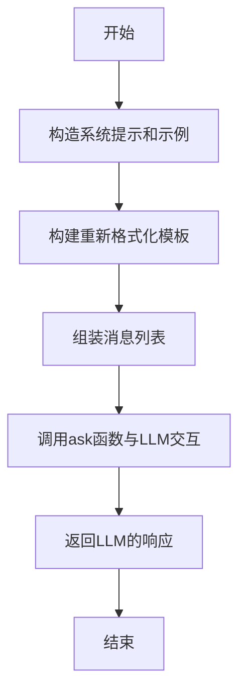
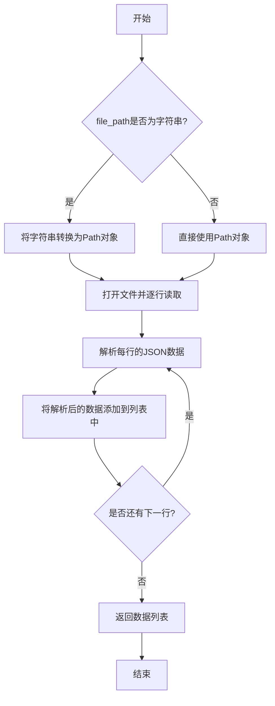
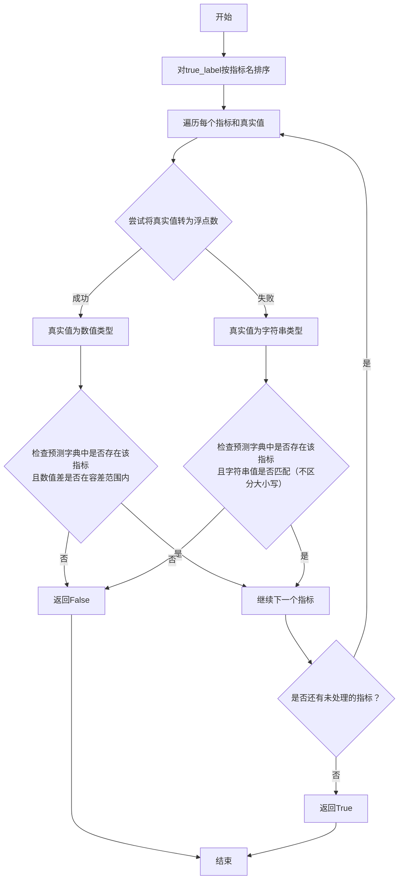
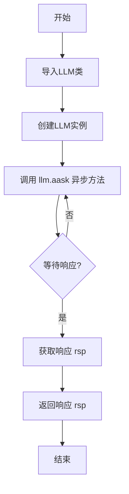
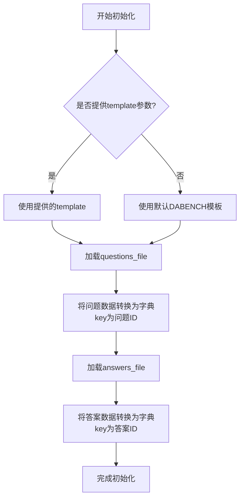
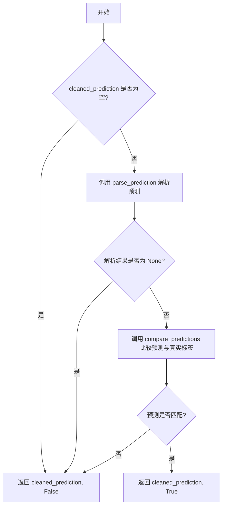
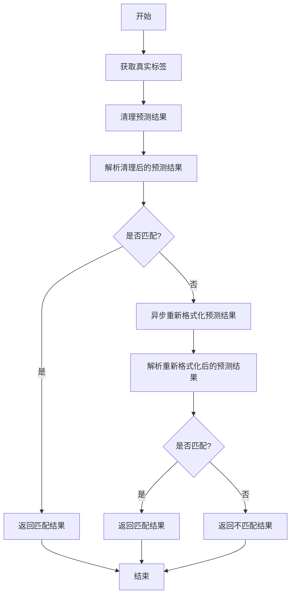
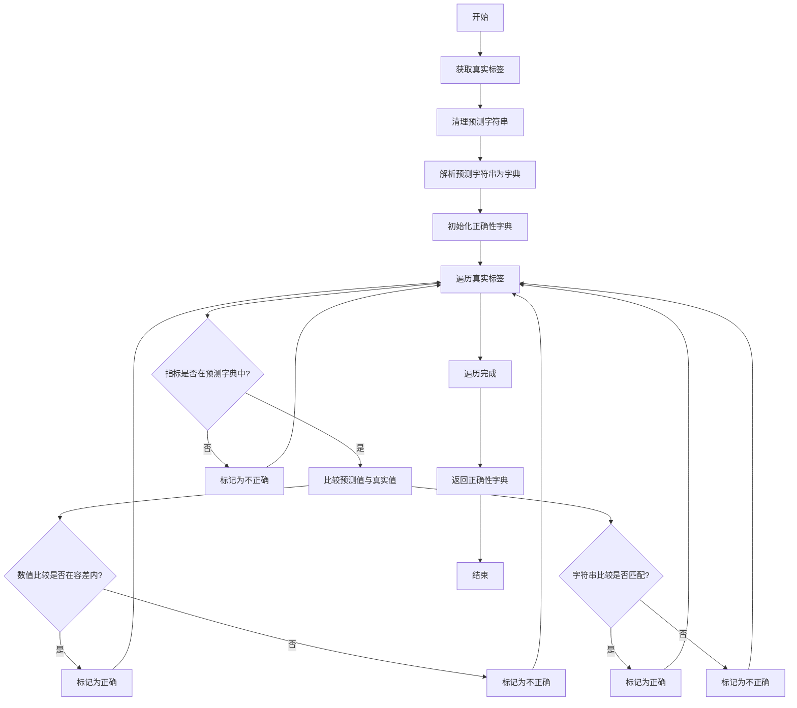
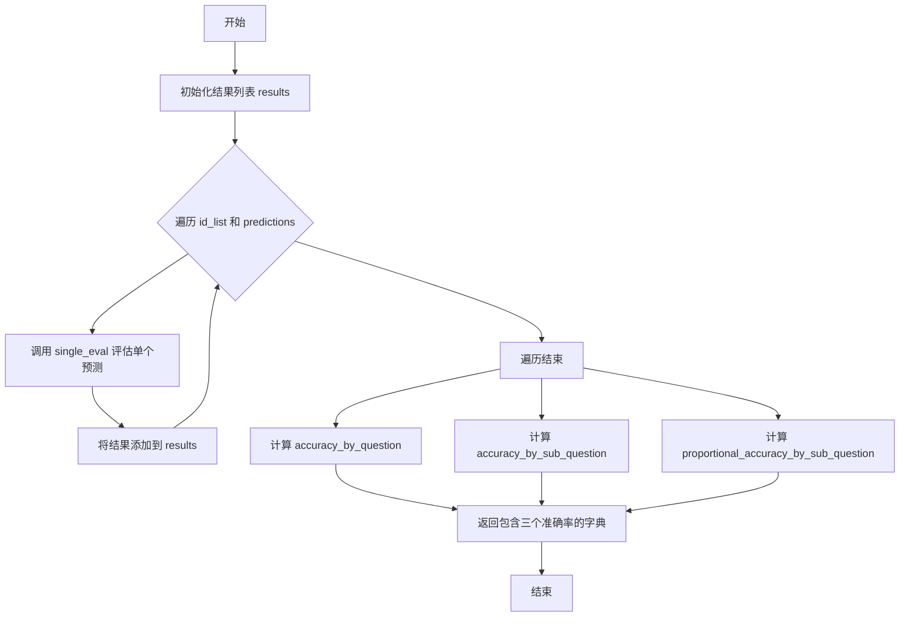

# `.\MetaGPT\examples\di\InfiAgent-DABench\DABench.py` 详细设计文档

该代码实现了一个用于评估大型语言模型（LLM）在数据分析（DA）任务上性能的基准测试框架。它从JSONL文件加载问题和答案，生成格式化的提示，接收模型的预测结果，并通过多种指标（如按问题、按子问题、按比例调整的子问题）评估预测的准确性。核心功能包括预测解析、与真实标签的比较、异步结果重格式化以及综合评估报告生成。

## 整体流程

```mermaid
graph TD
    A[开始] --> B[加载DABench实例]
    B --> C{调用评估方法}
    C -- eval --> D[获取真实标签]
    D --> E[清理预测字符串]
    E --> F[解析预测]
    F --> G{预测是否匹配?}
    G -- 是 --> H[返回(预测, True)]
    G -- 否 --> I[异步重格式化预测]
    I --> J[解析新预测]
    J --> K{新预测是否匹配?}
    K -- 是 --> L[返回(新预测, True)]
    K -- 否 --> M[返回(预测, False)]
    C -- eval_all --> N[遍历ID和预测列表]
    N --> O[对每个预测调用single_eval]
    O --> P[计算三种准确率]
    P --> Q[返回准确率字典]
```

## 类结构

```
DABench (主评估类)
├── __init__ (构造函数)
├── get_question (获取问题)
├── generate_formatted_prompt (生成提示)
├── get_answer (获取答案)
├── parse_cleaned_prediction (解析清理后的预测)
├── async_reformat_prediction (异步重格式化预测)
├── eval (评估单个预测)
├── single_eval (内部评估单个预测)
└── eval_all (批量评估预测)
```

## 全局变量及字段


### `DABench.questions`
    
存储从JSONL文件加载的问题数据，键为问题ID，值为包含问题详细信息的字典。

类型：`Dict[int, Dict[str, Any]]`
    


### `DABench.answers`
    
存储从JSONL文件加载的答案数据，键为问题ID，值为包含答案详细信息的字典。

类型：`Dict[int, Dict[str, Any]]`
    


### `DABench.template`
    
用于格式化提示词的模板字符串，如果未提供则使用默认模板。

类型：`str`
    
    

## 全局函数及方法

### `evaluate_accuracy_by_question`

该函数用于计算基于每个问题完全正确性的结果准确率。它检查每个结果是否完全正确，即该结果中的所有子问题都被正确回答。通过将完全正确的结果数量除以结果总数来计算正确结果的比例。

参数：
- `results`：`dict`，一个结果集合，其中每个结果可能包含一个 `'correctness'` 字段。

返回值：`float`，正确结果的比例，四舍五入到四位小数。如果没有结果，则返回0。

#### 流程图

```mermaid
flowchart TD
    A[开始] --> B[初始化 correct=0, total=len(results)]
    B --> C{遍历 results}
    C --> D{result 包含 'correctness' 字段?}
    D -- 是 --> E{all(result['correctness'].values()) 为 True?}
    E -- 是 --> F[correct += 1]
    F --> C
    E -- 否 --> C
    D -- 否 --> C
    C --> G[total > 0?]
    G -- 是 --> H[return round(correct / total, 4)]
    G -- 否 --> I[return 0]
```

#### 带注释源码

```python
def evaluate_accuracy_by_question(results: dict) -> float:
    """
    Calculate the accuracy of results based on complete correctness of each question.
    This function is referenced from https://github.com/InfiAgent/InfiAgent/blob/main/examples/DA-Agent/eval_closed_form.py
    This function checks whether each result is entirely correct, meaning all sub-questions
    within that result are answered correctly. It computes the proportion of correct results
    by dividing the number of fully correct results by the total number of results.

    Args:
        results (dict): A collection of results where each result may contain a 'correctness' field.

    Returns:
        float: The proportion of correct results, rounded to four decimal places.
               Returns 0 if there are no results.
    """
    # 计算完全正确的结果数量：遍历results，如果result包含'correctness'字段且其所有值都为True，则计数加1
    correct = sum("correctness" in result and all(result["correctness"].values()) for result in results)
    # 获取结果总数
    total = len(results)
    # 如果总数大于0，返回正确比例（四舍五入到4位小数），否则返回0
    return round(correct / total, 4) if total > 0 else 0
```

### `evaluate_accuracy_by_sub_question`

该函数用于评估所有结果中所有子问题的正确性。它计算所有结果中正确子问题的总数与子问题总数的比率，并返回该比率，四舍五入到四位小数。如果不存在子问题，则返回0。

参数：
- `results`：`dict`，一个结果集合，其中每个结果可能包含一个 `'correctness'` 字段。

返回值：`float`，正确子问题的比率，四舍五入到四位小数。如果没有子问题，则返回0。

#### 流程图

```mermaid
flowchart TD
    A[开始] --> B[初始化 correct = 0, total = 0]
    B --> C{遍历 results 中的每个 result}
    C --> D{result 包含 'correctness' 字段?}
    D -- 是 --> E[计算 result['correctness'] 中 True 值的总和]
    E --> F[将总和累加到 correct]
    F --> G[将 result['correctness'] 的长度累加到 total]
    G --> C
    D -- 否 --> C
    C --> H[遍历结束]
    H --> I{total > 0?}
    I -- 是 --> J[计算 ratio = correct / total]
    J --> K[返回 round(ratio, 4)]
    I -- 否 --> L[返回 0]
```

#### 带注释源码

```python
def evaluate_accuracy_by_sub_question(results: dict) -> float:
    """
    Evaluate the correctness of all sub-questions across the results.
    This function is referenced from https://github.com/InfiAgent/InfiAgent/blob/main/examples/DA-Agent/eval_closed_form.py
    This function calculates the total number of correct sub-questions and the overall
    number of sub-questions present in all results. It returns the ratio of correct
    sub-questions to the total number of sub-questions.

    Args:
        results (dict): A collection of results where each result may contain a 'correctness' field.

    Returns:
        float: The ratio of correct sub-questions, rounded to four decimal places.
               Returns 0 if there are no sub-questions.
    """
    # 计算所有结果中正确子问题的总数
    correct = sum(sum(result["correctness"].values()) for result in results if "correctness" in result)
    # 计算所有结果中子问题的总数
    total = sum(len(result["correctness"]) for result in results if "correctness" in result)
    # 如果存在子问题，返回正确比率（四舍五入到四位小数），否则返回0
    return round(correct / total, 4) if total > 0 else 0
```

### `evaluate_accuracy_proportional_by_sub_question_adjusted`

该函数用于计算基于子问题数量调整后的比例准确率。它遍历每个结果，根据其包含的子问题数量为每个子问题分配一个分数（1/子问题总数），然后累加所有正确子问题的分数作为该问题的得分。最后，计算所有问题得分的平均值作为最终准确率。

参数：
- `results`：`dict`，一个结果集合，其中每个结果可能包含一个 `'correctness'` 字段，该字段是一个字典，键为子问题标识，值为布尔值表示该子问题是否正确。

返回值：`float`，所有结果的平均得分，四舍五入到四位小数。如果没有结果，则返回0。

#### 流程图

```mermaid
flowchart TD
    A[开始] --> B{results 是否为空?}
    B -- 是 --> C[返回 0]
    B -- 否 --> D[初始化 total_score = 0]
    D --> E[遍历 results 中的每个 result]
    E --> F{result 中是否包含 'correctness'?}
    F -- 否 --> G[跳过此 result]
    F -- 是 --> H[计算 sub_question_count = len(result['correctness'])]
    H --> I{sub_question_count > 0?}
    I -- 否 --> J[score_per_sub_question = 0]
    I -- 是 --> K[score_per_sub_question = 1 / sub_question_count]
    J --> L
    K --> L[计算 question_score = sum(result['correctness'].values()) * score_per_sub_question]
    L --> M[total_score += question_score]
    M --> N[继续遍历下一个 result]
    N --> E
    E -- 遍历结束 --> O[计算 average_score = total_score / len(results)]
    O --> P[返回 round(average_score, 4)]
```

#### 带注释源码

```python
def evaluate_accuracy_proportional_by_sub_question_adjusted(results: dict) -> float:
    """
    Adjust the score based on the number of sub-questions in each result.
    This function is referenced from https://github.com/InfiAgent/InfiAgent/blob/main/examples/DA-Agent/eval_closed_form.py
    This function calculates a score for each result by considering the number of sub-questions
    it contains. Each sub-question is assigned a score of 1 divided by the number of sub-questions.
    The total score for each result is computed as the sum of all correct sub-questions multiplied
    by the score per sub-question. Finally, it returns the average score across all results.

    Args:
        results (dict): A collection of results where each result may contain a 'correctness' field.

    Returns:
        float: The average score across all results, rounded to four decimal places.
               Returns 0 if there are no results.
    """
    # 初始化总分为0
    total_score = 0
    # 遍历结果列表中的每一个结果
    for result in results:
        # 检查当前结果是否包含'correctness'字段
        if "correctness" in result:
            # 计算当前结果中子问题的数量
            sub_question_count = len(result["correctness"])
            # 计算每个子问题的分数：如果子问题数量大于0，则分数为1/子问题数，否则为0
            score_per_sub_question = 1 / sub_question_count if sub_question_count > 0 else 0
            # 计算当前问题的得分：正确子问题的数量乘以每个子问题的分数
            question_score = sum(result["correctness"].values()) * score_per_sub_question
            # 将当前问题的得分累加到总分中
            total_score += question_score
    # 计算平均分：总分除以结果总数。如果结果列表为空，则返回0
    return round(total_score / len(results), 4) if results else 0
```

### `reformat`

异步地根据指定的格式要求重新格式化给定的响应。该函数构造一个提示，用于指导大型语言模型（LLM）按照指定的格式重新格式化提供的响应。它包含一个系统提示来指导LLM的行为，以及一个模板，概述了期望的输出结构。

参数：

- `question`：`str`，用户提出的原始问题。
- `format`：`str`，响应必须遵守的特定格式要求。
- `response`：`str`，需要重新格式化的LLM初始响应。

返回值：`str`，根据提供的问题和格式要求由LLM生成的重新格式化后的响应。

#### 流程图



#### 带注释源码

```python
async def reformat(question: str, format: str, response: str) -> str:
    """
    Asynchronously reformats a given response based on specified formatting requirements.
    This function is referenced from https://github.com/InfiAgent/InfiAgent/blob/main/examples/DA-Agent/reformat.py
    This function constructs a prompt for the LLM (Large Language Model) to reformat
    the provided response according to the specified format. It includes a system prompt
    to guide the LLM's behavior and a template that outlines the expected output structure.

    Args:
        question (str): The original question posed by the user.
        format (str): The specific formatting requirements that the response must adhere to.
        response (str): The initial response from the LLM that needs to be reformatted.

    Returns:
        str: The reformatted response generated by the LLM based on the provided question
             and formatting requirements.
    """
    # 系统提示，用于指导LLM的行为
    system_prompt = "You are a helpful assistant."
    
    # 示例部分，展示了期望的格式和答案结构
    demons = """\Format{{
        @shapiro_wilk_statistic[test_statistic]
        @shapiro_wilk_p_value[p_value]
        where "test_statistic" is a number between 0 and 1 representing the Shapiro-Wilk test statistic. Rounding off the answer to two decimal places.
        where "p_value" is a number between 0 and 1 representing the p-value from the Shapiro-Wilk test. Rounding off the answer to four decimal places.
        }}
        \Answer{{
        @shapiro_wilk_statistic[0.56]
        @shapiro_wilk_p_value[0.0002]   
        }}

        \Format{{
        @total_votes_outliers_num[outlier_num]
        where "outlier_num" is an integer representing the number of values considered outliers in the 'total_votes' column.
        }}
        \Answer{{
        @total_votes_outliers[10]   
        }}
        """
    
    # 重新格式化模板，指导LLM如何重新格式化响应
    reformat_template = """You should strictly follow the output requirements in the Format part. Here're some examples: {demons}. 
    Your answer should contain all the \"@answer_name[answer]\" in the order mentioned, each \"answer\" should be in the range of value as required. You need to keep the original numbers and text, just reformat without making any changes.
    The format requirements of this question is:
    {format}. You need to keep the original numbers and text, just reformat without making any changes. Please give your answer:"""
    
    # 组装消息列表，包含用户问题、助手初始响应和重新格式化提示
    messages = [
        {"role": "user", "content": question},
        {"role": "assistant", "content": response},
        {"role": "user", "content": reformat_template.format(demons=demons, format=format)},
    ]
    
    # 调用ask函数与LLM交互，获取重新格式化后的响应
    rsp = await ask(messages, system_prompt)
    
    # 返回LLM生成的重新格式化后的响应
    return rsp
```

### `load_jsonl`

该函数用于从JSONL文件中加载数据，并将其转换为字典列表。JSONL文件是一种每行包含一个JSON对象的文件格式，该函数逐行读取文件，解析每行的JSON内容，并返回一个包含所有解析后数据的列表。

参数：

- `file_path`：`Union[Path, str]`，JSONL文件的路径，可以是字符串或Path对象。

返回值：`List[Dict[str, Any]]`，包含从JSONL文件中解析出的所有数据的字典列表。

#### 流程图



#### 带注释源码

```python
def load_jsonl(file_path: Union[Path, str]) -> List[Dict[str, Any]]:
    """
    Load data from a JSONL file into a list of dictionaries.

    Args:
        file_path (Union[Path, str]): The path to the JSONL file to be loaded.

    Returns:
        List[Dict[str, Any]]: A list of dictionaries containing the data from the JSONL file.
    """
    # Convert file_path to Path if it's a string
    if isinstance(file_path, str):
        file_path = Path(file_path)

    data = []
    with open(file_path, "r", encoding="utf-8") as file:
        for line in file:
            data.append(json.loads(line))
    return data
```

### `compare_predictions`

该函数用于比较预测字典与真实标签列表，检查每个预测值是否与对应的真实值匹配。它支持数值比较（允许微小误差）和字符串比较（不区分大小写）。

参数：

- `pred_dict`：`dict`，包含预测指标及其值的字典。
- `true_label`：`list`，包含真实指标及其值的元组列表。

返回值：`bool`，如果所有预测均匹配真实标签则返回 `True`，否则返回 `False`。

#### 流程图



#### 带注释源码

```python
def compare_predictions(pred_dict: dict, true_label: list) -> bool:
    """
    Compares each prediction against the corresponding true label.

    This function checks whether the predicted values match the true values for each
    metric. It sorts the true labels to ensure the comparison is made in the correct
    order. The function returns True if all predictions are accurate within a small
    tolerance for numerical values, or if string values match case-insensitively.

    Args:
        pred_dict (dict): A dictionary of predicted metrics and their values.
        true_label (list): A list of tuples containing true metrics and their values.

    Returns:
        bool: True if all predictions match the true labels, False otherwise.
    """
    # 对真实标签列表按指标名称进行排序，确保比较顺序一致
    sorted_true_label = sorted(true_label, key=lambda x: x[0])

    # 遍历排序后的真实标签列表
    for metric, true_value in sorted_true_label:
        try:
            # 尝试将真实值转换为浮点数，用于数值比较
            true_value = float(true_value)
        except ValueError:
            # 如果转换失败（例如，值是字符串），则移除逗号以便后续处理
            true_value = true_value.replace(",", "")

        # 检查真实值是否为数值类型
        if isinstance(true_value, (int, float)) and (
            # 如果预测字典中不存在该指标，或者预测值与真实值的绝对差大于1e-6，则返回False
            metric not in pred_dict or abs(pred_dict[metric] - true_value) > 1e-6
        ):
            return False

        # 检查真实值是否为字符串类型
        if isinstance(true_value, str) and (
            # 如果预测字典中不存在该指标，或者预测值与真实值（转换为小写后）不相等，则返回False
            metric not in pred_dict or str(pred_dict[metric]).lower() != str(true_value).lower()
        ):
            return False

    # 如果所有指标的比较都通过，则返回True
    return True
```

### `ask`

异步发送问题给大语言模型（LLM）并获取其响应。该函数初始化一个LLM实例，使用给定的系统提示和问题来获取模型的回答。

参数：

- `question`：`str`，要询问LLM的问题内容。
- `system_prompt`：`str`，提供给LLM的系统提示，用于设定上下文或指令。

返回值：`str`，LLM根据提供的系统提示和问题生成的响应文本。

#### 流程图



#### 带注释源码

```python
async def ask(question: str, system_prompt: str) -> str:
    """
    Asynchronously sends a question to the LLM (Large Language Model) and retrieves the response.

    This function initializes an instance of the LLM and uses it to ask a question
    along with a system prompt. The response from the LLM is awaited and returned.

    Args:
        question (str): The question to be asked to the LLM.
        system_prompt (str): A prompt that provides context or instructions to the LLM.

    Returns:
        str: The response from the LLM based on the provided question and system prompt.
    """
    from metagpt.llm import LLM  # 从metagpt模块导入LLM类

    llm = LLM()  # 创建LLM类的一个实例
    rsp = await llm.aask(question, system_msgs=[system_prompt])  # 异步调用LLM的aask方法，传入问题和系统提示，并等待响应
    return rsp  # 返回LLM生成的响应
```

### `parse_prediction`

该函数用于解析预测字符串，将其转换为结构化的字典格式。它通过分割字符串提取指标名称和对应的值，并尝试将数值转换为浮点数类型。

参数：

- `prediction`：`str`，包含指标和值的格式化字符串，使用"@"符号分隔不同指标

返回值：`dict`，字典的键为指标名称，值为对应的数值（浮点数）或字符串

#### 流程图

```mermaid
flowchart TD
    A[开始: 输入prediction字符串] --> B[初始化空字典pred_dict]
    B --> C[按'@'分割字符串得到pred列表]
    C --> D[遍历pred列表中的每个元素]
    D --> E{当前元素是否为空?}
    E -->|是| F[跳过当前元素]
    E -->|否| G[使用正则表达式按'['和']'分割元素]
    G --> H[移除所有逗号并过滤空字符串]
    H --> I[提取指标名称并清理]
    I --> J[提取值并清理]
    J --> K{能否转换为浮点数?}
    K -->|是| L[将值转换为浮点数]
    K -->|否| M[保持值为字符串]
    L --> N[将指标-值对存入pred_dict]
    M --> N
    F --> D
    N --> O{是否还有未处理的元素?}
    O -->|是| D
    O -->|否| P[返回pred_dict]
```

#### 带注释源码

```python
def parse_prediction(prediction: str) -> dict:
    """
    Parses a prediction string into a dictionary of metric-value pairs.

    This function takes a formatted string containing metrics and their corresponding
    values, separated by the "@" symbol. Each metric may be enclosed in brackets and
    may include commas. The function processes the input to extract and clean the
    metrics and their values, returning them in a structured dictionary format.

    Args:
        prediction (str): A string representation of metrics and their values.

    Returns:
        dict: A dictionary where each key is a metric name and each value is the
              corresponding value, either as a float or a string.
    """
    pred_dict = {}  # 初始化空字典用于存储解析结果
    for pred in prediction.split("@"):  # 按"@"分割字符串，遍历每个部分
        if pred == "":  # 跳过空字符串（可能由开头或连续的"@"产生）
            continue
        temp = re.split(r"[\[\]]", pred.strip())  # 使用正则表达式按"["和"]"分割字符串
        temp = [s.replace(",", "") for s in temp]  # 移除所有逗号
        parts = [s for s in temp if s]  # 过滤掉空字符串
        metric = parts[0].strip().replace(",", "")  # 提取指标名称并清理
        value = parts[-1].replace(",", "").replace(":", "")  # 提取值并清理

        try:
            value = float(value)  # 尝试将值转换为浮点数
        except ValueError:
            pass  # 如果转换失败，保持值为字符串

        pred_dict[metric] = value  # 将指标-值对存入字典
    return pred_dict  # 返回解析后的字典
```

### `DABench.__init__`

该方法用于初始化DABench类的实例，加载指定的问题文件和答案文件，并设置格式化模板。

参数：

- `questions_file`：`Path`，包含问题的JSONL文件路径，默认为`DABENCH_PATH/da-dev-questions.jsonl`
- `answers_file`：`Path`，包含答案的JSONL文件路径，默认为`DABENCH_PATH/da-dev-labels.jsonl`
- `template`：`str`，用于格式化提示的模板字符串，默认为空字符串

返回值：`None`，无返回值

#### 流程图



#### 带注释源码

```python
def __init__(
    self,
    questions_file: Path = Path(DABENCH_PATH) / "da-dev-questions.jsonl",  # 问题文件路径，默认为DABENCH_PATH下的da-dev-questions.jsonl
    answers_file: Path = Path(DABENCH_PATH) / "da-dev-labels.jsonl",       # 答案文件路径，默认为DABENCH_PATH下的da-dev-labels.jsonl
    template: str = "",                                                    # 格式化模板字符串，默认为空
):
    """
    Initializes the DABench instance with questions and answers.

    This constructor loads questions and answers from specified JSONL files.
    It also sets a template for formatting prompts. If no template is provided,
    a default template is used.

    Args:
        questions_file (Path): The path to the JSONL file containing questions.
        answers_file (Path): The path to the JSONL file containing answers.
        template (str): A string template for formatting prompts.
    """

    self.questions = {
        int(line["id"]): line for line in load_jsonl(questions_file)  # 加载问题文件，将每行的id转换为整数作为key
    }  
    self.answers = {
        int(line["id"]): line for line in load_jsonl(answers_file)    # 加载答案文件，将每行的id转换为整数作为key
    }  
    self.template = template if template else DABENCH  # 设置模板：如果提供了template参数则使用，否则使用默认的DABENCH模板
```

### `DABench.get_question`

该方法用于根据给定的问题ID，从已加载的问题数据集中检索对应的问题信息。如果找到该ID，则返回包含问题详细信息的字典；否则，返回一个提示信息字符串。

参数：
- `question_id`：`str`，要检索的问题的唯一标识符。

返回值：`dict`，如果找到对应ID的问题，则返回包含问题数据的字典；否则返回字符串 `"Question not found."`。

#### 流程图

```mermaid
flowchart TD
    A[开始: get_question(question_id)] --> B{检查question_id是否在self.questions中}
    B -- 是 --> C[返回 self.questions[question_id]]
    B -- 否 --> D[返回 "Question not found."]
    C --> E[结束]
    D --> E
```

#### 带注释源码

```python
def get_question(self, question_id: str) -> dict:
    """
    Retrieve the question associated with the given ID.

    This method looks up a question by its unique identifier. If the question
    is found, it returns the question data; otherwise, it returns a message
    indicating that the question was not found.

    Args:
        question_id (str): The unique identifier for the question.

    Returns:
        dict: The question data if found, otherwise a "Question not found." message.
    """
    # 使用字典的 get 方法，根据 question_id 查找问题。
    # 如果找到，返回对应的字典值（问题数据）。
    # 如果未找到，返回默认的字符串 "Question not found."。
    return self.questions.get(question_id, "Question not found.")
```

### `DABench.generate_formatted_prompt`

该方法根据给定的问题ID，从已加载的问题数据中检索对应的问题详情，并使用预设的模板将这些详情格式化为一个结构化的提示字符串。该提示字符串用于后续的模型推理或评估任务。

参数：

- `question_id`：`str`，问题的唯一标识符，用于从`self.questions`字典中查找对应的问题数据。

返回值：`str`，一个根据模板格式化后的提示字符串，包含了问题、约束条件、输出格式要求、相关数据文件路径和难度等级等信息。

#### 流程图

```mermaid
graph TD
    A[开始] --> B[调用 get_question 方法]；
    B --> C{问题ID是否存在？}；
    C -- 是 --> D[获取问题数据字典 temp]；
    C -- 否 --> E[返回 'Question not found.']；
    D --> F[使用 self.template 格式化]；
    F --> G[返回格式化后的提示字符串]；
    E --> H[结束]；
    G --> H；
```

#### 带注释源码

```python
def generate_formatted_prompt(self, question_id: str) -> str:
    """
    为指定的问题ID生成一个格式化的提示。

    此方法检索问题数据并使用指定的模板对其进行格式化。
    格式化后的提示包括问题、约束、格式、文件名和级别，以实现结构化输出。

    Args:
        question_id (str): 问题的唯一标识符。

    Returns:
        str: 基于问题数据格式化后的提示字符串。
    """
    # 1. 根据ID获取问题数据。如果ID不存在，temp将是字符串'Question not found.'。
    temp = self.get_question(question_id)

    # 2. 使用实例的模板（self.template）对获取的数据进行格式化。
    #    模板是一个字符串，其中包含如 {question}、{constraints} 等占位符。
    #    format() 方法会用 temp 字典中对应的值替换这些占位符。
    #    特别地，文件路径通过拼接 DABENCH_PATH 常量、子目录和文件名来构建。
    return self.template.format(
        question=temp["question"],          # 替换模板中的 {question} 占位符
        constraints=temp["constraints"],    # 替换模板中的 {constraints} 占位符
        format=temp["format"],              # 替换模板中的 {format} 占位符
        file_name=str(DABENCH_PATH) + "/da-dev-tables/" + temp["file_name"], # 构建完整文件路径并替换 {file_name}
        level=temp["level"],                # 替换模板中的 {level} 占位符
    )
```

### `DABench.get_answer`

该方法用于根据给定的答案ID从已加载的答案数据中检索对应的答案列表。如果找到匹配的ID，则返回该答案数据；否则返回一个提示信息。

参数：

- `answer_id`：`str`，要查找的答案的唯一标识符。

返回值：`list`，如果找到匹配的ID，则返回对应的答案数据（一个列表）；否则返回字符串"Answer not found."。

#### 流程图

```mermaid
flowchart TD
    A[开始: get_answer(answer_id)] --> B{检查self.answers中<br>是否存在answer_id键}
    B -- 存在 --> C[返回self.answers[answer_id]]
    B -- 不存在 --> D[返回字符串"Answer not found."]
    C --> E[结束]
    D --> E
```

#### 带注释源码

```python
def get_answer(self, answer_id: str) -> list:
    """
    Retrieve the answer list associated with the given ID.

    This method looks up an answer by its unique identifier. If the answer
    is found, it returns the answer data; otherwise, it returns a message
    indicating that the answer was not found.

    Args:
        answer_id (str): The unique identifier for the answer.

    Returns:
        list: The answer data if found, otherwise an "Answer not found." message.
    """
    # 使用字典的get方法，根据answer_id查找对应的值。
    # 如果找到，返回该值（应为列表类型）；如果未找到，返回默认字符串"Answer not found."。
    return self.answers.get(answer_id, "Answer not found.")
```

### `DABench.parse_cleaned_prediction`

该方法用于解析清理后的预测字符串，并将其与真实标签进行比较，以判断预测是否正确。

参数：

- `cleaned_prediction`：`str`，经过清理的预测字符串，通常包含以特定格式（如`@metric[value]`）表示的预测结果。
- `true_label`：`Any`，真实标签，通常是一个列表或字典，包含每个指标的真实值。

返回值：`Tuple[str, bool]`，返回一个元组，第一个元素是清理后的预测字符串，第二个元素是一个布尔值，表示预测是否与真实标签匹配。

#### 流程图



#### 带注释源码

```python
@handle_exception(exception_msg="Error parsing cleaned prediction", default_return=(None, False))
def parse_cleaned_prediction(self, cleaned_prediction: str, true_label: Any) -> Tuple[str, bool]:
    """
    Parse the cleaned prediction and compare it with the true label.

    Args:
        cleaned_prediction (str): The cleaned prediction string.
        true_label (Any): The true label to compare against.

    Returns:
        Tuple[str, bool]: A tuple containing the cleaned prediction and a boolean indicating
                          whether it matches the true label.
    """
    if cleaned_prediction:  # 检查清理后的预测是否为空
        pred_dict = parse_prediction(cleaned_prediction)  # 解析预测字符串为字典
        if pred_dict is not None and compare_predictions(pred_dict, true_label):
            return cleaned_prediction, True  # 如果预测匹配真实标签，返回 True
    return cleaned_prediction, False  # 否则返回 False
```

### `DABench.async_reformat_prediction`

该方法用于异步地重新格式化一个给定的预测结果字符串，使其符合特定问题的格式要求。它首先根据问题ID获取原始问题和格式规范，然后调用异步的`reformat`函数来生成一个格式化的响应。最后，它尝试从格式化后的响应中提取答案部分，如果提取失败，则返回整个格式化后的响应。

参数：

- `id`：`str`，问题的唯一标识符，用于从`self.questions`字典中检索对应的问题和格式信息。
- `result`：`str`，原始的预测结果字符串，需要被重新格式化。

返回值：`str`，返回重新格式化后的预测字符串。如果成功从格式化响应中提取出答案部分，则返回该部分；否则，返回整个格式化后的响应。

#### 流程图

```mermaid
graph TD
    A[开始: async_reformat_prediction] --> B[根据id获取question和format]
    B --> C[调用asyncio.run(reformat)异步格式化]
    C --> D{格式化响应中是否包含'Answer{{'?}
    D -- 是 --> E[提取'Answer{{'后的内容]
    E --> F[返回提取的答案部分]
    D -- 否 --> G[返回整个格式化响应]
    F --> H[结束]
    G --> H
```

#### 带注释源码

```python
    @handle_exception(exception_msg="Error during async reformat", default_return=(None, False))
    def async_reformat_prediction(self, id: str, result: str) -> str:
        """
        Reformat the prediction asynchronously and extract the answer.

        Args:
            id (str): The identifier for the question.
            result (str): The original prediction result.

        Returns:
            str: The reformatted prediction or the original prediction if extraction fails.
        """
        # 1. 根据问题ID获取原始问题和格式要求
        question = self.get_question(id)["question"]
        question_format = self.get_question(id)["format"]
        
        # 2. 异步调用reformat函数，传入问题、格式和原始结果，生成格式化响应
        prediction = asyncio.run(reformat(question, question_format, result))

        # 3. 尝试从格式化响应中提取答案部分
        # 查找"Answer{{"分隔符
        answer_part = prediction.split("Answer{{") if "Answer{{" in prediction else []
        if len(answer_part) > 1:
            # 如果找到，提取"Answer{{"和"}}"之间的内容并返回
            return answer_part[1].split("}}")[0].strip()

        # 4. 如果未找到答案部分，返回整个格式化后的响应
        return prediction
```

### `DABench.eval`

该方法用于评估给定预测结果与真实标签的匹配程度。它首先清理和解析预测结果，然后与真实标签进行比较。如果初始解析不匹配，会尝试异步重新格式化预测结果，并再次进行比较。最终返回清理后的预测结果和匹配状态。

参数：

- `id`：`str`，问题的唯一标识符。
- `result`：`str`，原始的预测结果字符串。

返回值：`Tuple[str, bool]`，返回一个元组，包含最终的预测结果字符串和一个布尔值，表示预测结果是否与真实标签匹配。

#### 流程图



#### 带注释源码

```python
def eval(self, id: str, result: str) -> Tuple[str, bool]:
    """
    评估预测结果与真实标签的匹配程度。

    Args:
        id (str): 问题的唯一标识符。
        result (str): 原始的预测结果字符串。

    Returns:
        Tuple[str, bool]: 返回一个元组，包含最终的预测结果字符串和一个布尔值，
                          表示预测结果是否与真实标签匹配。
    """
    # 获取真实标签
    true_label = self.get_answer(id)["common_answers"]
    # 应用嵌套异步支持
    nest_asyncio.apply()
    # 从结果中提取预测部分并清理
    result = json.loads(str(result).split("Current Plan")[1].split("## Current Task")[0])[-1]["result"].strip()
    cleaned_prediction = result.replace("{", "").replace("}", "").replace("'", "")

    # 解析清理后的预测结果
    parsed_result = self.parse_cleaned_prediction(cleaned_prediction, true_label)
    if parsed_result[1]:  # 如果匹配
        return parsed_result  # 返回匹配结果

    # 如果不匹配，尝试异步重新格式化预测结果
    prediction = self.async_reformat_prediction(id, result)

    # 解析重新格式化后的预测结果
    pred_dict = parse_prediction(prediction)
    if pred_dict is not None and compare_predictions(pred_dict, true_label):
        return prediction, True  # 返回匹配结果

    # 返回不匹配结果
    return prediction, False
```

### `DABench.single_eval`

该方法用于评估单个问题的预测结果。它接收一个问题ID和一个预测字符串，解析预测字符串并与该问题的真实标签进行比较，返回一个字典，其中键为指标名称，值为布尔值，表示该指标的预测是否正确。

参数：

- `id`：`str`，问题的唯一标识符。
- `prediction`：`str`，待评估的预测字符串。

返回值：`dict`，一个字典，键为指标名称，值为布尔值，表示该指标的预测是否正确。

#### 流程图



#### 带注释源码

```python
@handle_exception(exception_msg="Error evaluating single prediction", default_return={})
def single_eval(self, id: str, prediction: str) -> dict:
    """
    评估单个问题的预测结果。

    该方法首先获取指定问题的真实标签，然后清理并解析预测字符串。
    接着，它初始化一个正确性字典，其中每个指标初始值为False。
    然后，遍历真实标签中的每个指标，检查预测字典中是否存在该指标，
    并比较预测值与真实值是否匹配（数值比较在容差范围内，字符串比较忽略大小写）。
    最后，返回包含每个指标正确性判断的字典。

    Args:
        id (str): 问题的唯一标识符。
        prediction (str): 待评估的预测字符串。

    Returns:
        dict: 一个字典，键为指标名称，值为布尔值，表示该指标的预测是否正确。
    """
    true_label = self.get_answer(id)["common_answers"]  # 获取问题的真实标签
    prediction = prediction.replace("{", "").replace("}", "").replace("'", "")  # 清理预测字符串
    pred_dict = parse_prediction(prediction)  # 解析预测字符串为字典

    # 初始化正确性字典，所有指标初始值为False
    correctness = {metric: False for metric, _ in true_label}

    # 遍历真实标签中的每个指标
    for metric, true_value in true_label:
        try:
            true_value = float(true_value)  # 尝试将真实值转换为浮点数
        except ValueError:
            true_value = true_value.replace(",", "")  # 处理非数值类型的真实值

        if metric in pred_dict:
            # 数值比较：检查预测值是否在容差范围内
            if (
                isinstance(true_value, (int, float))
                and isinstance(pred_dict[metric], (int, float))
                and abs(pred_dict[metric] - true_value) < 1e-6
            ):
                correctness[metric] = True  # 标记为正确

            # 字符串比较：检查预测值是否与真实值匹配（忽略大小写）
            if isinstance(true_value, str) and (
                metric not in pred_dict or str(pred_dict[metric]).lower() != str(true_value).lower()
            ):
                correctness[metric] = True  # 标记为正确

    return correctness  # 返回正确性字典
```

### `DABench.eval_all`

该方法用于批量评估一组预测结果，计算三种不同的准确率指标：基于问题的准确率、基于子问题的准确率以及基于子问题的加权准确率。它遍历每个问题ID和对应的预测，调用`single_eval`方法评估每个预测的正确性，然后汇总所有结果并计算准确率。

参数：

- `id_list`：`list`，包含要评估的问题ID的列表。
- `predictions`：`list`，包含与`id_list`中每个问题ID对应的预测字符串的列表。

返回值：`dict`，包含三个键值对：`accuracy_by_question`（基于问题的准确率）、`accuracy_by_sub_question`（基于子问题的准确率）和`proportional_accuracy_by_sub_question`（基于子问题的加权准确率）。

#### 流程图



#### 带注释源码

```python
def eval_all(self, id_list: list, predictions: list) -> dict:
    """
    评估所有预测并计算准确率。

    该方法遍历每个问题ID和对应的预测，调用`single_eval`方法评估每个预测的正确性，
    然后汇总所有结果并计算三种准确率指标。

    Args:
        id_list (list): 包含要评估的问题ID的列表。
        predictions (list): 包含与`id_list`中每个问题ID对应的预测字符串的列表。

    Returns:
        dict: 包含三个键值对的字典：
            - "accuracy_by_question": 基于问题的准确率。
            - "accuracy_by_sub_question": 基于子问题的准确率。
            - "proportional_accuracy_by_sub_question": 基于子问题的加权准确率。
    """
    results = []  # 初始化结果列表，用于存储每个问题的评估结果

    # 遍历每个问题ID和对应的预测
    for id, prediction in zip(id_list, predictions):
        correct = self.single_eval(id, prediction)  # 评估单个预测的正确性
        results.append({"id": id, "correctness": correct})  # 将结果添加到列表中

    # 计算三种准确率指标
    accuracy_by_question = evaluate_accuracy_by_question(results)
    accuracy_by_sub_question = evaluate_accuracy_by_sub_question(results)
    proportional_accuracy_by_sub_question = evaluate_accuracy_proportional_by_sub_question_adjusted(results)

    # 返回包含准确率指标的字典
    return {
        "accuracy_by_question": accuracy_by_question,
        "accuracy_by_sub_question": accuracy_by_sub_question,
        "proportional_accuracy_by_sub_question": proportional_accuracy_by_sub_question,
    }
```

## 关键组件


### 评估函数组件

包含三个评估准确率的函数：`evaluate_accuracy_by_question`（基于整题完全正确）、`evaluate_accuracy_by_sub_question`（基于所有子问题正确率）和`evaluate_accuracy_proportional_by_sub_question_adjusted`（基于子问题数量调整的加权正确率），用于从不同维度计算模型预测结果的准确性。

### 预测解析与比较组件

包含`parse_prediction`函数（将模型输出的格式化字符串解析为字典）和`compare_predictions`函数（将解析后的预测字典与真实标签列表进行比较，支持数值容差和字符串大小写不敏感匹配），是评估流程中的核心数据处理环节。

### 异步响应格式化组件

包含`reformat`异步函数，通过构造特定提示词调用大语言模型（LLM），将模型生成的原始响应按照指定的格式要求进行重新格式化，以适配后续的解析和比较流程。

### DABench 评估类

作为代码的核心类，封装了数据加载（`__init__`）、问题/答案获取（`get_question`, `get_answer`）、提示生成（`generate_formatted_prompt`）、单次评估（`eval`, `single_eval`）和批量评估（`eval_all`）等功能，并集成了异常处理装饰器（`@handle_exception`）来增强鲁棒性，提供了一个完整的基准测试评估框架。

### 数据加载与工具函数组件

包含`load_jsonl`函数（从JSONL文件加载数据）和`ask`异步函数（封装与大语言模型的交互），为评估流程提供基础的数据输入输出支持。


## 问题及建议


### 已知问题

-   **硬编码的评估逻辑**：`eval` 方法中的 `result = json.loads(str(result).split("Current Plan")[1].split("## Current Task")[0])[-1]["result"].strip()` 这行代码假设输入结果具有特定的、固定的格式（包含“Current Plan”和“## Current Task”等标记）。这种强耦合使得代码极其脆弱，任何输入格式的微小变化都会导致解析失败，限制了代码的通用性和复用性。
-   **同步与异步混合的混乱调用**：`eval` 方法内部调用了 `nest_asyncio.apply()` 来允许在已运行的事件循环中再次运行事件循环。这通常是为了在同步上下文中（如 Jupyter Notebook）运行异步代码而采用的“补丁”方案，但它破坏了 asyncio 的正常执行模型，可能导致难以调试的并发问题，并且不是生产环境中的推荐做法。
-   **异常处理粒度不当**：`parse_cleaned_prediction` 和 `async_reformat_prediction` 方法使用了 `@handle_exception` 装饰器，但装饰器返回的默认值 `(None, False)` 可能掩盖了底层错误的真实原因，使得调试困难。同时，`eval` 方法本身没有类似的装饰器，可能导致未处理的异常向上层传播。
-   **字符串解析逻辑复杂且易错**：`parse_prediction` 函数使用正则表达式和字符串分割来解析预测结果，逻辑较为复杂。`async_reformat_prediction` 方法中通过 `split("Answer{{")` 来提取答案部分，同样依赖于固定的格式字符串，健壮性差。
-   **全局导入与循环依赖风险**：`ask` 函数内部动态导入了 `metagpt.llm.LLM`。这种延迟导入虽然可能解决了某些循环依赖问题，但破坏了代码的清晰度，使得依赖关系不明确，并可能影响 IDE 的智能提示和静态分析工具。
-   **硬编码的示例（Demons）**：`reformat` 函数中的 `demons` 变量是硬编码的示例字符串。这些示例可能不适用于所有需要重新格式化的场景，缺乏灵活性。
-   **数值比较容差不一致**：`compare_predictions` 函数使用 `1e-6` 的绝对容差进行浮点数比较，而 `single_eval` 方法也使用了 `1e-6`。虽然一致，但对于不同量级的数据（例如，0.000001 和 1000000），绝对容差可能不是最佳选择。同时，字符串比较使用 `.lower()` 进行大小写不敏感比较，但未处理空格或其他格式差异。
-   **`DABench` 初始化参数默认值**：`questions_file` 和 `answers_file` 的默认路径依赖于 `DABENCH_PATH` 常量。如果该常量未正确设置或环境变化，会导致文件加载失败。

### 优化建议

-   **解耦输入解析逻辑**：将 `eval` 方法中硬编码的字符串解析逻辑提取为一个独立的、可配置的解析函数或策略类。可以接受一个解析函数作为参数，或者定义更清晰的输入数据契约（例如，期望一个包含 `result` 字段的字典），从而提高代码的灵活性和可测试性。
-   **重构异步调用模式**：避免在同步方法中使用 `nest_asyncio`。建议将 `eval` 方法改为异步方法（`async def eval`），并在整个调用链中统一使用异步。如果必须在同步上下文中调用，应使用 `asyncio.run()` 来运行顶层的异步函数，而不是在内部打补丁。
-   **改进异常处理**：重新评估 `@handle_exception` 装饰器的使用场景。对于预期可能失败的操作（如网络请求、解析），可以捕获特定异常并记录详细日志，然后返回有意义的错误标识，而不是简单地吞掉异常。考虑在 `eval` 方法上也增加适当的异常处理或让调用者处理。
-   **简化并强化解析器**：考虑使用更健壮的解析方法，例如为预测结果定义一个小型的领域特定语言（DSL）并使用专门的解析库（如 `parsimonious`、`lark`）或更严谨的正则表达式。对于答案提取，可以尝试使用更通用的模式匹配或 JSON 解析（如果格式允许）。
-   **明确依赖关系**：将 `LLM` 的导入移到文件顶部，或通过依赖注入的方式将 `LLM` 实例作为参数传递给 `ask` 函数或 `DABench` 类的构造函数。这能明确依赖，便于测试（例如注入模拟对象）和代码理解。
-   **使示例可配置化**：将 `reformat` 函数中的 `demons` 示例作为可选参数传入，或者从配置文件、数据库中加载。这样可以根据不同的评估任务动态提供相关的格式化示例。
-   **优化比较策略**：对于浮点数比较，考虑使用相对容差或结合相对与绝对容差的比较方法（例如 `math.isclose`）。对于字符串比较，可以在比较前进行更彻底的规范化（如去除首尾空格、统一标点等）。
-   **增强配置化与错误处理**：在 `DABench` 的 `__init__` 方法中，增加对默认路径文件是否存在的检查，并提供更友好的错误信息。考虑使用 `pathlib` 的 `exists()` 方法进行验证。
-   **代码结构与测试**：考虑将评估指标计算函数（如 `evaluate_accuracy_by_question`）和工具函数（如 `parse_prediction`, `compare_predictions`）组织到单独的模块中，以提高代码的模块化。为关键函数和类编写单元测试，特别是针对各种边界情况和错误格式的输入。


## 其它


### 设计目标与约束

本模块的核心设计目标是提供一个用于评估大语言模型（LLM）在数据分析（DA）任务上表现的基准测试框架。其主要约束包括：1）必须能够处理结构化的、包含子问题的复杂问题；2）需要支持多种评估指标（按问题、按子问题、按比例加权）；3）需要具备对LLM原始输出进行清洗和格式化（Reformat）的能力，以适配严格的答案格式要求；4）性能上需要支持异步操作以提升与LLM交互的效率；5）代码需具备良好的异常处理机制，确保单点失败不影响整体评估流程。

### 错误处理与异常设计

模块采用了集中式的异常处理策略。关键方法（如 `parse_cleaned_prediction`, `async_reformat_prediction`, `single_eval`）使用了 `@handle_exception` 装饰器。该装饰器捕获方法执行过程中的任何异常，记录指定的错误信息（`exception_msg`），并返回一个安全的默认值（`default_return`），例如空字典或 `(None, False)`。这种设计确保了在解析失败、网络请求超时或数据格式异常时，评估流程能够继续运行，并将该样本标记为错误或失败，而不是导致整个评估进程崩溃。全局函数如 `load_jsonl` 使用基础的 `try-except` 进行文件读取和JSON解析错误的处理。

### 数据流与状态机

模块的数据流始于从JSONL文件加载问题集（`self.questions`）和答案集（`self.answers`）。评估时，对于单个问题（`eval`方法）：输入问题ID和LLM原始输出 -> 提取并清洗结果字符串 -> 尝试直接解析并与答案对比 -> 若失败，则通过异步调用 `reformat` 函数请求LLM重新格式化输出 -> 再次解析格式化后的输出进行对比 -> 返回（最终预测字符串， 布尔匹配结果）。对于批量评估（`eval_all`方法）：遍历ID和预测列表，对每个调用 `single_eval` 生成包含子问题正确性详情的字典，最后汇总计算三种准确率。整个流程是无状态的，每个问题的评估相互独立。

### 外部依赖与接口契约

1.  **内部依赖**:
    *   `metagpt.llm.LLM`: 用于执行 `ask` 和 `reformat` 函数中的LLM调用。契约要求其提供 `aask` 异步方法。
    *   `metagpt.utils.exceptions.handle_exception`: 提供异常处理装饰器。
    *   `metagpt.logs.logger`: 用于记录日志。
    *   `metagpt.const.DABENCH_PATH`: 提供基准测试数据集的默认路径。
    *   `examples.di.requirements_prompt.DABENCH`: 提供默认的提示词模板。

2.  **外部依赖**:
    *   `asyncio`: 用于异步操作。
    *   `nest_asyncio`: 解决在已有事件循环中（如Jupyter Notebook）运行异步代码的问题。
    *   `json`, `re`, `pathlib`: 用于数据解析、字符串处理和文件路径操作。

3.  **数据接口契约**:
    *   输入JSONL文件需包含特定字段（如 `id`, `question`, `format`, `common_answers` 等）。
    *   LLM的预测输出预期为包含 `@metric[value]` 格式的字符串。
    *   `reformat` 函数要求LLM遵循严格的输出格式要求。

### 配置与可扩展性

配置主要通过 `DABench` 类的构造函数实现：可以自定义问题文件路径（`questions_file`）、答案文件路径（`answers_file`）和提示词模板（`template`）。这允许用户轻松切换不同的数据集或评估提示词。模块的可扩展性体现在：1）评估逻辑（`evaluate_accuracy_by_*` 系列函数）与核心数据加载、解析逻辑分离，方便增加新的评估指标；2）`parse_prediction` 和 `compare_predictions` 函数作为独立的解析和比较单元，可以适配不同格式的预测输出；3）通过继承 `DABench` 类并重写 `eval` 或 `single_eval` 方法，可以支持新的评估范式或输出格式。

### 安全与合规考虑

1.  **数据安全**: 代码处理本地文件，未涉及网络传输敏感数据。但加载外部JSONL文件时，需防范路径遍历攻击，建议在调用前对输入路径进行验证。
2.  **模型交互**: `ask` 和 `reformat` 函数向外部LLM服务发送数据。需确保发送的内容不包含敏感信息，并遵守所用LLM服务提供商的内容政策。
3.  **代码引用**: 文档明确标注了 `evaluate_accuracy_by_question`、`evaluate_accuracy_by_sub_question`、`evaluate_accuracy_proportional_by_sub_question_adjusted` 和 `reformat` 函数参考自外部项目（InfiAgent），这符合开源代码的引用规范。
4.  **资源消耗**: 异步 `reformat` 操作会发起额外的LLM调用，可能增加计算成本和API调用次数，需在批量评估时注意。

    