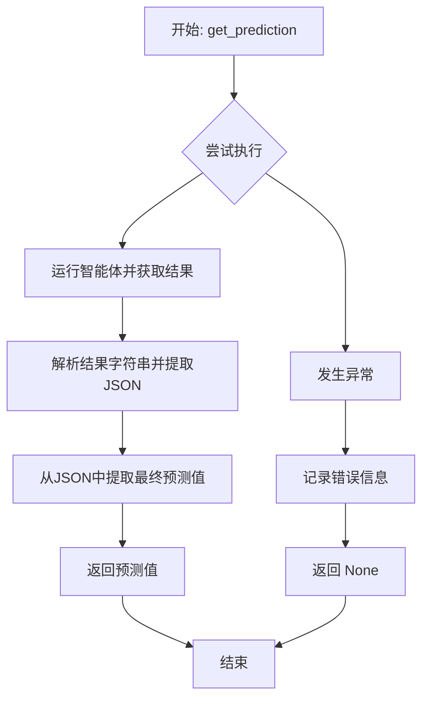
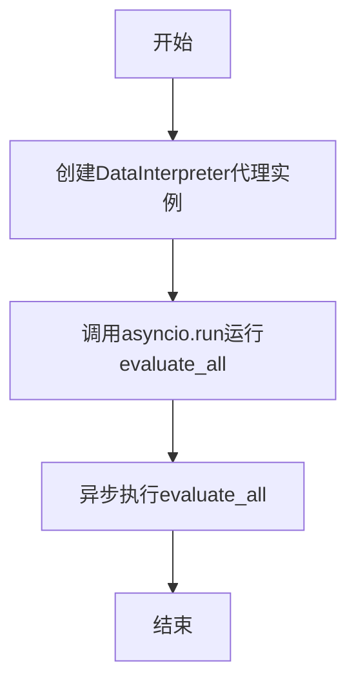
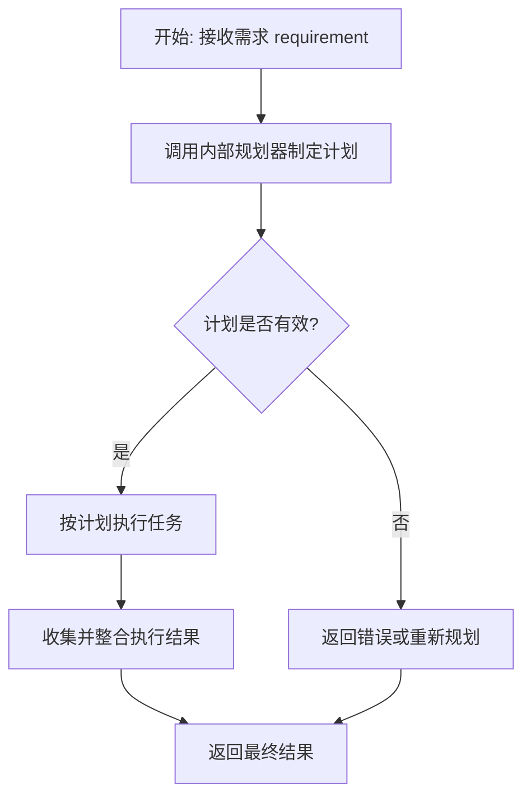

# `.\MetaGPT\examples\di\InfiAgent-DABench\run_InfiAgent-DABench.py` 详细设计文档

该代码是一个异步评估脚本，用于使用DataInterpreter代理对DABench基准测试中的所有任务进行批量预测和评估。它通过异步并发处理任务组来提高效率，从代理的响应中解析预测结果，并最终使用DABench的评估功能输出整体性能指标。

## 整体流程

```mermaid
graph TD
    A[开始: main(k)] --> B[创建DataInterpreter代理]
    B --> C[调用evaluate_all(agent, k)]
    C --> D[创建DABench实例]
    D --> E[遍历bench.answers]
    E --> F[为每个任务生成格式化提示]
    F --> G[创建异步预测任务get_prediction]
    G --> H[将任务ID加入id_list]
    H --> I{是否遍历完所有任务?}
    I -- 否 --> E
    I -- 是 --> J[按k大小分组并发执行任务]
    J --> K[调用asyncio.gather执行任务组]
    K --> L[调用get_prediction获取预测]
    L --> M[解析代理响应，提取result]
    M --> N{解析成功?}
    N -- 是 --> O[返回prediction]
    N -- 否 --> P[记录错误，返回None]
    O --> Q[过滤并收集非None预测结果]
    P --> Q
    Q --> R{是否处理完所有组?}
    R -- 否 --> J
    R -- 是 --> S[调用bench.eval_all评估结果]
    S --> T[记录评估结果]
    T --> U[结束]
```

## 类结构

```
Global Scope
├── Async Functions
│   ├── get_prediction
│   └── evaluate_all
└── Sync Functions
    └── main
```

## 全局变量及字段


### `logger`
    
用于记录程序运行日志的日志记录器实例，提供不同级别的日志输出功能。

类型：`metagpt.logs.Logger`
    


### `DABench.answers`
    
存储DABench基准测试中所有任务ID与对应标准答案的映射字典。

类型：`dict`
    
    

## 全局函数及方法

### `get_prediction`

这是一个辅助函数，用于从指定的智能体（agent）获取对给定需求（requirement）的预测结果。它异步地运行智能体，解析其返回的JSON格式结果，并提取最终的预测值。如果在处理过程中发生任何异常，函数会记录错误并返回 `None`。

参数：
- `agent`：`Any`，用于生成预测的智能体实例。
- `requirement`：`str`，需要智能体进行预测的输入需求描述。

返回值：`Any`，如果成功，返回从智能体响应中提取的预测结果；如果处理过程中发生异常，则返回 `None`。

#### 流程图



#### 带注释源码

```python
async def get_prediction(agent, requirement):
    """Helper function to obtain a prediction from a new instance of the agent.

    This function runs the agent with the provided requirement and extracts the prediction
    from the result. If an error occurs during processing, it logs the error and returns None.

    Args:
        agent: The agent instance used to generate predictions.
        requirement: The input requirement for which the prediction is to be made.

    Returns:
        The predicted result if successful, otherwise None.
    """
    try:
        # 使用给定的需求异步运行智能体并等待结果
        result = await agent.run(requirement)

        # 解析结果字符串：先按"Current Plan"分割，取第二部分，再按"## Current Task"分割，取第一部分，最后解析为JSON
        prediction_json = json.loads(str(result).split("Current Plan")[1].split("## Current Task")[0])
        # 从解析后的JSON列表中提取最后一个元素的"result"字段作为预测值
        prediction = prediction_json[-1]["result"]

        return prediction  # 返回提取的预测值
    except Exception as e:
        # 如果在处理过程中发生异常，记录错误信息
        logger.info(f"Error processing requirement: {requirement}. Error: {e}")
        return None  # 发生错误时返回 None
```

### `evaluate_all`

`evaluate_all` 函数是评估流程的核心协调器。它负责从 DABench 基准测试中加载所有任务，使用指定的智能体（`agent`）并行处理这些任务（分组大小为 `k`），收集所有预测结果，并最终调用基准测试的评估方法输出整体性能指标。

参数：
-  `agent`：`DataInterpreter`，用于执行任务并生成预测的智能体实例。
-  `k`：`int`，并发处理的任务组大小，用于控制并行度。

返回值：`None`，该函数不返回任何值，其执行结果通过日志输出。

#### 流程图

```mermaid
flowchart TD
    A[开始: evaluate_all(agent, k)] --> B[初始化: bench, id_list, predictions, tasks]
    B --> C{遍历bench.answers?}
    C -- 是 --> D[生成任务提示<br>requirement = bench.generate_formatted_prompt(key)]
    D --> E[创建异步预测任务<br>tasks.append(get_prediction(...))]
    E --> F[记录任务ID<br>id_list.append(key)]
    F --> C
    C -- 否 --> G[按组大小k分割任务列表]
    G --> H{遍历任务组?}
    H -- 是 --> I[并发执行当前组任务<br>group_predictions = await asyncio.gather(...)]
    I --> J[过滤并收集有效预测结果<br>predictions.extend(pred if pred is not None)]
    J --> H
    H -- 否 --> K[评估所有结果<br>bench.eval_all(id_list, predictions)]
    K --> L[记录评估结果<br>logger.info(...)]
    L --> M[结束]
```

#### 带注释源码

```python
async def evaluate_all(agent, k):
    """Evaluate all tasks in DABench using the specified baseline agent.

    Tasks are divided into groups of size k and processed in parallel.

    Args:
        agent: The baseline agent used for making predictions.
        k (int): The number of tasks to process in each group concurrently.
    """
    # 1. 初始化：创建基准测试实例，并准备存储任务ID、预测结果和异步任务的列表。
    bench = DABench()  # Create an instance of DABench to access its methods and data
    id_list, predictions = [], []  # Initialize lists to store IDs and predictions
    tasks = []  # Initialize a list to hold the tasks

    # 2. 任务生成：遍历基准测试中的所有答案，为每个任务生成格式化的提示，并创建对应的异步预测任务。
    for key, value in bench.answers.items():
        requirement = bench.generate_formatted_prompt(key)  # Generate a formatted prompt for the current key
        tasks.append(get_prediction(agent, requirement))  # Append the prediction task to the tasks list
        id_list.append(key)  # Append the current key to the ID list

    # 3. 并行执行：将任务列表按组大小k进行分割，并发执行每个组内的任务，收集预测结果。
    for i in range(0, len(tasks), k):
        # Get the current group of tasks
        current_group = tasks[i : i + k]
        # Execute the current group of tasks in parallel
        group_predictions = await asyncio.gather(*current_group)
        # Filter out any None values from the predictions and extend the predictions list
        predictions.extend(pred for pred in group_predictions if pred is not None)

    # 4. 结果评估：使用所有有效的预测结果和对应的任务ID，调用基准测试的评估方法，并记录评估结果。
    logger.info(bench.eval_all(id_list, predictions))
```

### `main`

主函数，用于启动评估流程。它创建一个DataInterpreter代理实例，并以异步方式运行`evaluate_all`函数来评估DABench中的所有任务。

参数：

- `k`：`int`，指定每个并发组中处理的任务数量，默认值为5。

返回值：`None`，该函数不返回任何值。

#### 流程图



#### 带注释源码

```python
def main(k=5):
    """Main function to run the evaluation process."""
    # 创建DataInterpreter代理实例
    agent = DataInterpreter()
    # 以异步方式运行evaluate_all函数，传入代理实例和并发组大小k
    asyncio.run(evaluate_all(agent, k))
```

### `DABench.generate_formatted_prompt`

该方法属于 `DABench` 类，用于根据给定的任务键（`key`）生成一个格式化的提示字符串。该提示字符串旨在作为输入传递给智能体（如 `DataInterpreter`），以指导其执行特定的数据分析任务。

参数：
- `key`：`str`，一个字符串，用于标识 `DABench` 中特定的任务或问题。

返回值：`str`，返回一个格式化的字符串，该字符串包含了任务描述、数据信息以及期望的输出格式，用于引导智能体完成任务。

#### 流程图

```mermaid
flowchart TD
    A[开始: generate_formatted_prompt(key)] --> B{key 是否有效?}
    B -- 是 --> C[从 bench.answers 获取任务信息]
    C --> D[从 bench.datasets 获取数据集信息]
    D --> E[从 bench.questions 获取问题描述]
    E --> F[组装所有信息为格式化字符串]
    F --> G[返回格式化后的提示字符串]
    B -- 否 --> H[返回空字符串或抛出异常]
    G --> I[结束]
    H --> I
```

#### 带注释源码

```python
def generate_formatted_prompt(self, key):
    """
    根据给定的任务键生成一个格式化的提示字符串。

    该方法从类内部的 `answers`、`datasets` 和 `questions` 字典中提取与 `key` 对应的信息，
    并将这些信息组合成一个结构化的字符串，作为智能体的输入指令。

    Args:
        key (str): 用于查找特定任务信息的键。

    Returns:
        str: 一个格式化的提示字符串，包含任务描述、数据信息和输出要求。
    """
    # 1. 从 answers 字典中获取该任务的标准答案或任务定义
    answer_info = self.answers.get(key, {})
    # 2. 从 datasets 字典中获取与该任务关联的数据集信息（如数据路径、描述）
    dataset_info = self.datasets.get(key, {})
    # 3. 从 questions 字典中获取具体的问题描述或任务要求
    question_info = self.questions.get(key, "")

    # 4. 将获取的信息组装成一个结构化的提示模板
    #    模板通常包含：任务概述、可用数据、具体问题、以及期望的输出格式。
    formatted_prompt = f"""
    Task: {key}
    Dataset: {dataset_info.get('description', 'N/A')}
    Data Path: {dataset_info.get('path', 'N/A')}
    Question: {question_info}
    Expected Output Format: {answer_info.get('format', 'N/A')}
    Please analyze the data and provide the result.
    """
    return formatted_prompt
```

**注意**：以上源码是基于提供的代码片段和 `DABench` 类的典型功能推断出的。实际实现可能因 `DABench` 类的具体定义而略有不同，但核心逻辑是：通过 `key` 索引多个内部字典，提取信息并格式化输出。

### `evaluate_all`

`evaluate_all` 函数是评估流程的核心协调器。它负责加载 DABench 基准测试中的所有任务，使用指定的智能体（`agent`）并行处理这些任务（分组大小为 `k`），收集预测结果，并最终调用基准测试的评估方法输出整体性能指标。

参数：
- `agent`：`DataInterpreter` 或兼容类型，用于执行任务并生成预测的智能体实例。
- `k`：`int`，控制并发度的参数，表示每次并行处理的任务组大小。

返回值：`None`，该函数不返回任何值，其核心作用是通过日志输出评估结果。

#### 流程图

```mermaid
flowchart TD
    A[开始: evaluate_all(agent, k)] --> B[初始化: bench, id_list, predictions, tasks]
    B --> C{遍历bench.answers?}
    C -- 是 --> D[生成任务: get_prediction(agent, requirement)]
    D --> E[记录任务ID]
    E --> C
    C -- 否 --> F{遍历tasks? i从0到len, 步长k}
    F -- 是 --> G[获取任务组: tasks[i:i+k]]
    G --> H[并行执行: asyncio.gather]
    H --> I[收集并过滤预测结果]
    I --> F
    F -- 否 --> J[评估结果: bench.eval_all]
    J --> K[日志输出评估结果]
    K --> L[结束]
```

#### 带注释源码

```python
async def evaluate_all(agent, k):
    """Evaluate all tasks in DABench using the specified baseline agent.

    Tasks are divided into groups of size k and processed in parallel.

    Args:
        agent: The baseline agent used for making predictions.
        k (int): The number of tasks to process in each group concurrently.
    """
    # 1. 初始化：创建基准测试实例和用于存储数据的数据结构
    bench = DABench()  # 创建 DABench 实例以访问其任务和评估方法
    id_list, predictions = [], []  # id_list 存储任务ID，predictions 存储成功的预测结果
    tasks = []  # 存储所有待执行的异步预测任务

    # 2. 任务准备阶段：遍历基准测试中的所有答案，为每个任务创建预测任务
    for key, value in bench.answers.items():
        # 根据任务ID生成格式化的提示词（问题）
        requirement = bench.generate_formatted_prompt(key)
        # 创建一个异步任务，该任务将调用智能体生成预测
        tasks.append(get_prediction(agent, requirement))
        # 记录当前任务的ID，用于后续评估时与预测结果对齐
        id_list.append(key)

    # 3. 任务执行阶段：按组（大小为k）并行执行所有预测任务
    for i in range(0, len(tasks), k):
        # 获取当前批次的任务组
        current_group = tasks[i : i + k]
        # 使用 asyncio.gather 并行执行当前组的所有任务，并等待结果
        group_predictions = await asyncio.gather(*current_group)
        # 过滤掉执行失败（返回None）的预测，将有效的预测结果添加到总列表中
        predictions.extend(pred for pred in group_predictions if pred is not None)

    # 4. 评估与输出阶段：使用所有有效的预测结果和对应的任务ID进行评估
    # 调用 DABench 的 eval_all 方法计算评估指标（如准确率等）
    logger.info(bench.eval_all(id_list, predictions))
```

### `DataInterpreter.run`

`DataInterpreter.run` 是 `DataInterpreter` 类的一个异步方法，其核心功能是接收一个用户需求（`requirement`），驱动智能体执行一个完整的任务处理流程。该方法会协调智能体的内部组件（如规划器、执行器等）来理解需求、制定计划、执行任务，并最终返回处理结果。它是智能体对外提供服务的核心入口。

参数：

- `requirement`：`str`，用户输入的任务描述或需求文本。

返回值：`Any`，任务执行完成后的最终结果，其具体类型取决于任务内容（例如，可能是字符串、字典或自定义对象）。

#### 流程图



#### 带注释源码

```python
async def run(self, requirement: Any) -> Any:
    """
    异步运行方法，处理用户需求并返回结果。
    
    这是智能体的主要执行入口。它接收一个需求，触发内部的工作流，
    包括需求分析、任务规划、代码执行和结果整合。
    
    Args:
        requirement (Any): 用户输入的需求描述。
        
    Returns:
        Any: 任务执行后的最终输出结果。
    """
    # 1. 初始化或重置智能体状态，准备处理新需求
    self._reset()
    
    # 2. 将用户需求设置给智能体，触发内部处理流程
    await self._observe(requirement)
    
    # 3. 核心循环：只要智能体认为还有待处理的任务，就持续执行
    while await self._act():
        # 4. 在每次行动后，更新内部状态和上下文
        await self._observe("")
        
    # 5. 所有任务执行完毕，返回最终整合的结果
    return self.result
```

**源码注释说明：**
1.  `self._reset()`: 通常用于清理上一次任务的状态，确保环境干净。
2.  `await self._observe(requirement)`: 观察阶段，智能体接收并解析用户需求，将其转化为内部表示。
3.  `while await self._act()`: 行动阶段的核心循环。`_act()` 方法内部可能包含任务规划、工具调用、代码执行等逻辑。循环持续直到所有计划任务完成。
4.  `await self._observe("")`: 在每次行动后，观察执行结果和环境变化，更新内部上下文，为下一次决策做准备。
5.  `return self.result`: 返回存储在 `self.result` 属性中的最终处理结果。

## 关键组件


### DABench 集成

DABench 是代码的核心评估框架，提供了任务数据集（`answers`）、格式化提示生成方法（`generate_formatted_prompt`）和评估方法（`eval_all`），用于系统性地测试和评估智能体（`DataInterpreter`）的性能。

### 异步任务处理与并发控制

代码实现了基于 `asyncio` 的异步任务处理机制，通过 `get_prediction` 函数封装单个预测任务，并在 `evaluate_all` 函数中按批次（`k`）并发执行，以提高整体评估效率。

### DataInterpreter 智能体

`DataInterpreter` 是执行核心预测任务的智能体，其 `run` 方法接收自然语言需求（`requirement`）并生成包含结构化结果的响应，是代码功能实现的核心依赖组件。

### 结果解析与提取

代码包含一个从智能体返回的复杂文本中提取结构化预测结果的逻辑，通过字符串分割和 JSON 解析（`json.loads`）来定位并获取最终的任务结果（`prediction_json[-1]["result"]`）。

### 错误处理与日志记录

集成了 `metagpt.logs.logger` 进行日志记录，并在 `get_prediction` 函数中实现了异常捕获机制，确保单个任务的失败不会导致整个评估流程中断，提高了系统的鲁棒性。


## 问题及建议


### 已知问题

-   **脆弱的字符串解析逻辑**：`get_prediction` 函数中，通过 `str(result).split("Current Plan")[1].split("## Current Task")[0]` 来提取 JSON 字符串。这种方法高度依赖于 `DataInterpreter` 输出的特定格式（如固定的标题文本“Current Plan”和“## Current Task”）。一旦 `DataInterpreter` 的输出格式发生细微变化（例如，标题名称、空格、换行符），解析就会失败，导致整个预测流程中断。
-   **错误处理粒度不足**：`get_prediction` 函数使用一个宽泛的 `except Exception` 来捕获所有异常，并将错误信息记录为 `logger.info`。这可能导致严重的运行时错误（如网络超时、内存不足）被淹没在普通信息日志中，不利于监控和调试。同时，函数在出错时静默返回 `None`，调用方无法区分不同类型的失败原因。
-   **资源管理与潜在内存泄漏**：代码为每个任务创建一个新的 `DataInterpreter` 代理实例（在 `get_prediction` 中通过 `agent.run` 调用）。虽然 `DataInterpreter` 的内部实现未知，但如果它持有大量资源（如数据库连接、大模型会话、文件句柄），频繁创建和销毁实例可能导致性能下降或资源泄漏。代码中没有显示显式的资源清理步骤。
-   **硬编码的并发组大小**：`main` 函数中 `k` 的默认值为 5，这是一个硬编码的魔法数字。对于不同的任务类型、系统负载或 `DataInterpreter` 的性能特性，最优的并发度可能不同。固定的并发度可能导致在某些场景下资源利用不足（`k` 太小）或系统过载（`k` 太大）。
-   **缺乏任务重试机制**：当 `get_prediction` 因临时性错误（如网络波动）失败时，任务会直接被丢弃（返回 `None`）。这可能导致评估结果不完整或偏差，因为部分任务没有获得预测。

### 优化建议

-   **强化结果解析的鲁棒性**：建议与 `DataInterpreter` 的开发者协商，定义并采用一个结构化的输出契约（例如，在 `result` 对象中提供一个专用的字段来存放预测结果或结构化数据）。如果无法改变输出格式，应使用更健壮的解析方法，如正则表达式，并增加对解析失败（如 `IndexError`, `json.JSONDecodeError`）的专门处理和更详细的错误日志。
-   **细化错误处理与日志**：将 `except Exception` 替换为捕获更具体的异常类型（如 `json.JSONDecodeError`, `KeyError`, `asyncio.TimeoutError` 等）。根据异常类型，使用不同级别的日志（如 `logger.error` 或 `logger.warning`）。考虑在 `get_prediction` 函数中返回一个包含结果状态（成功/失败）、数据和错误信息的元组或字典，而不是简单的 `None`，以便 `evaluate_all` 能进行更精细的处理。
-   **优化代理实例管理**：评估 `DataInterpreter` 是否为无状态或轻量级。如果是重量级或有状态的，考虑在 `evaluate_all` 函数中复用同一个代理实例，或者实现一个代理池来管理生命周期。确保在评估结束后，有明确的资源释放步骤（如果代理提供了相关方法）。
-   **使并发度可配置化**：将并发组大小 `k` 作为命令行参数或配置文件项暴露出来，允许用户根据运行环境进行调整。甚至可以引入简单的自适应逻辑，根据任务执行的平均时间来动态调整后续批次的并发度。
-   **引入任务重试逻辑**：在 `get_prediction` 函数或 `evaluate_all` 的循环中，为失败的任务（返回 `None` 或特定错误）添加重试逻辑。可以设置最大重试次数和退避策略（如指数退避），以避免对下游服务造成冲击。重试后仍失败的任务应被明确记录并排除在最终评估之外。
-   **增加进度反馈与监控**：在 `evaluate_all` 函数中处理每个任务组时，可以添加进度日志（例如，“Processing group X/Y”）。这有助于在长时间运行的评估中了解进度。同时，可以记录每个任务的耗时，用于后续的性能分析和瓶颈定位。


## 其它


### 设计目标与约束

本代码的设计目标是构建一个基于异步并发的自动化评估框架，用于对 `DataInterpreter` 智能体在 `DABench` 数据集上的表现进行批量、高效的性能评估。核心约束包括：1) 必须支持异步并发处理以提升评估效率；2) 需要具备健壮的错误处理机制，确保单个任务的失败不影响整体评估流程；3) 评估结果需要与 `DABench` 的评估接口兼容，并能正确输出。

### 错误处理与异常设计

代码的错误处理主要围绕 `get_prediction` 函数展开。该函数使用 `try-except` 块捕获 `agent.run` 执行、JSON 解析和结果提取过程中可能发生的任何异常。当异常发生时，函数会通过 `logger.info` 记录错误信息（包含原始需求和异常详情），并返回 `None`。在 `evaluate_all` 函数中，通过 `if pred is not None` 过滤掉这些失败的任务，确保只有成功的预测结果被传递给 `bench.eval_all` 进行最终评估。这种设计保证了评估过程的容错性和连续性。

### 数据流与状态机

1.  **初始化阶段**：`main` 函数创建 `DataInterpreter` 智能体实例。
2.  **任务生成阶段**：`evaluate_all` 函数遍历 `DABench.answers`，为每个任务生成格式化提示（`requirement`），并创建对应的异步任务（`get_prediction`）。任务ID和任务对象被分别存入 `id_list` 和 `tasks` 列表。
3.  **并发执行阶段**：`tasks` 列表被按批次大小 `k` 分组。每组任务通过 `asyncio.gather` 并发执行。`get_prediction` 函数调用智能体，解析返回结果，提取预测值。
4.  **结果收集与过滤阶段**：每批任务的预测结果被收集到 `group_predictions`，过滤掉 `None` 值后，合并到 `predictions` 列表。
5.  **评估与输出阶段**：所有有效的 `predictions` 与对应的 `id_list` 被传递给 `bench.eval_all` 方法进行性能评估，结果通过日志输出。

### 外部依赖与接口契约

1.  **DABench 类**：来自 `DABench` 模块。核心依赖接口包括：
    *   `answers` 属性：一个字典，键为任务ID，值为任务答案或相关信息。用于生成评估任务列表。
    *   `generate_formatted_prompt(key)` 方法：接收一个任务ID，返回一个格式化的提示字符串，作为智能体的输入。
    *   `eval_all(id_list, predictions)` 方法：接收任务ID列表和对应的预测结果列表，执行评估并返回评估结果。本代码假定其返回一个可被日志记录的对象。
2.  **DataInterpreter 类**：来自 `metagpt.roles.di.data_interpreter`。核心依赖接口为：
    *   `run(requirement)` 方法：一个异步方法，接收字符串格式的需求（`requirement`），执行推理并返回结果。本代码对其返回结果的格式有强假设（包含特定标记的JSON文本）。
3.  **asyncio**：Python标准库，用于实现异步任务创建（`asyncio.gather`）和事件循环运行（`asyncio.run`）。
4.  **json**：Python标准库，用于解析智能体返回结果中的JSON字符串。
5.  **metagpt.logs.logger**：用于记录信息性日志和错误日志。

### 并发与性能设计

代码采用基于 `asyncio` 的协程并发模型来提升性能。关键设计点：
*   **批量处理**：通过参数 `k` 控制并发度，将任务列表分组成大小为 `k` 的批次进行处理，避免一次性创建过多并发任务导致资源耗尽。
*   **异步I/O利用**：假设 `agent.run` 方法内部包含网络I/O（如调用LLM API）或磁盘I/O，使用 `async/await` 可以在此类I/O等待期间释放事件循环，从而在同一线程内高效处理多个任务。
*   **结果聚合**：使用 `asyncio.gather` 等待一个批次的所有任务完成，简化了并发结果收集的逻辑。

### 配置与参数化

代码的可配置性较弱，主要体现在：
*   **并发度参数 `k`**：作为 `main` 函数和 `evaluate_all` 函数的参数，允许调用者调整每批并发执行的任务数量，以平衡性能与系统负载。
*   **智能体实例化**：`DataInterpreter` 的实例化在 `main` 函数中硬编码，未提供配置选项（如模型参数、系统提示词等）。其配置依赖于外部环境或 `DataInterpreter` 类的默认设置。

    