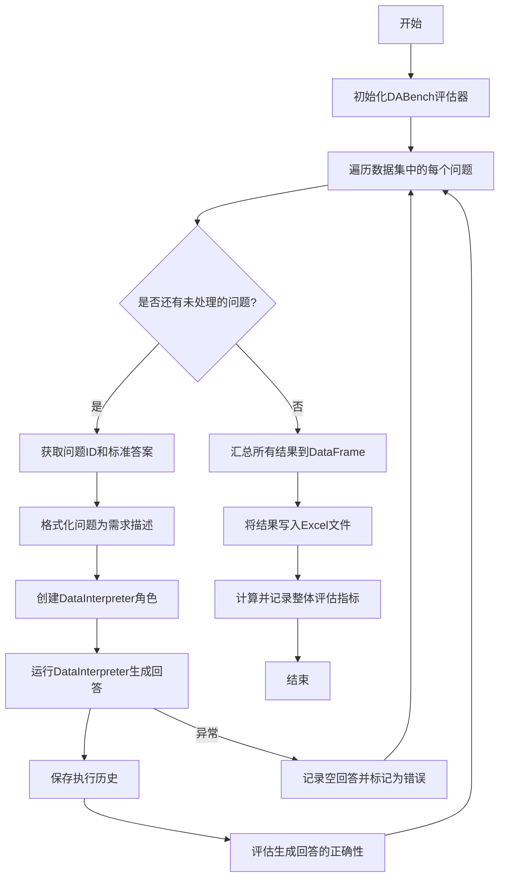
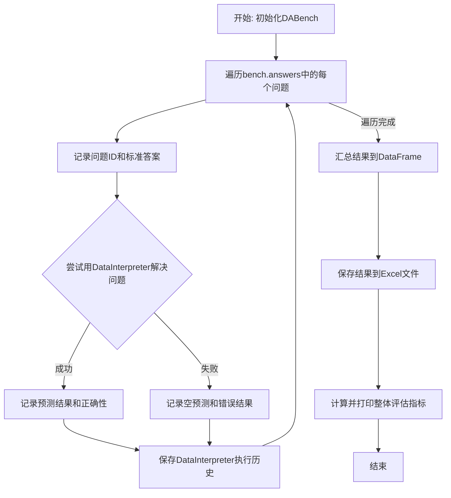
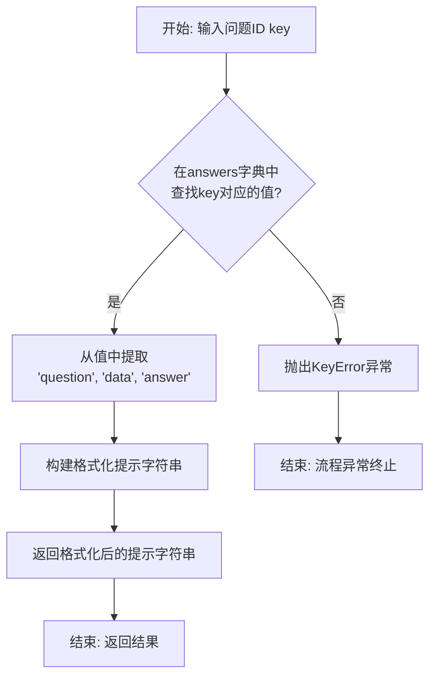
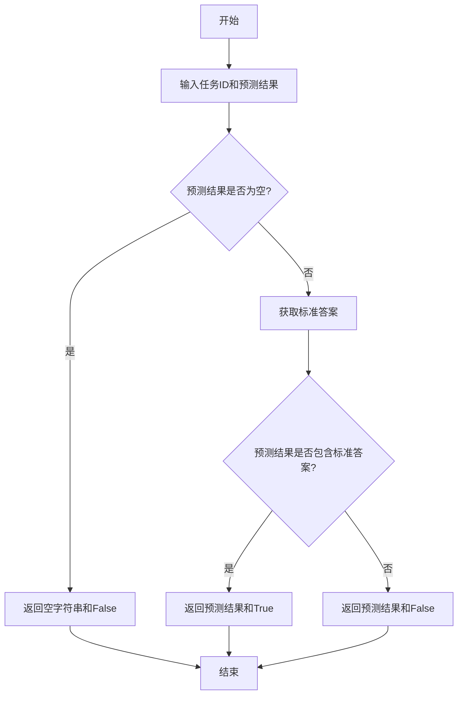
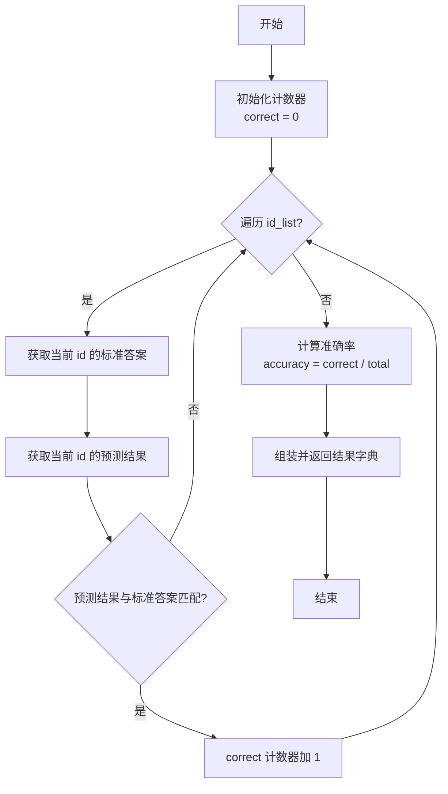

# `.\MetaGPT\examples\di\InfiAgent-DABench\run_InfiAgent-DABench_all.py` 详细设计文档

该代码是一个基于DABench数据集的自动化评估脚本，它通过MetaGPT框架中的DataInterpreter角色，对数据集中的每个问题生成回答，并与标准答案进行对比，最终将评估结果（包括预测值、真实标签和正确性判断）输出到Excel文件中。

## 整体流程



## 类结构

```
外部依赖/框架
├── fire (命令行接口)
├── pandas (数据处理)
├── DABench (评估数据集)
└── metagpt (智能体框架)
    ├── logs.logger (日志记录)
    ├── roles.di.data_interpreter.DataInterpreter (数据解释角色)
    └── utils.recovery_util.save_history (历史保存)
```

## 全局变量及字段


### `bench`
    
用于评估数据分析和代码生成能力的基准测试工具实例。

类型：`DABench`
    


### `id_list`
    
存储待评估问题ID的列表。

类型：`List[str]`
    


### `predictions`
    
存储DataInterpreter对每个问题生成的预测答案的列表。

类型：`List[str]`
    


### `labels`
    
存储每个问题标准答案的列表。

类型：`List[str]`
    


### `is_true`
    
存储每个预测答案是否正确（True/False）的列表。

类型：`List[str]`
    


### `df`
    
包含标签、预测和正确性评估结果的DataFrame，用于最终输出到Excel文件。

类型：`pandas.DataFrame`
    


### `DABench.answers`
    
存储问题ID到其答案的映射字典，是基准测试的数据源。

类型：`Dict[str, Any]`
    
    

## 全局函数及方法


### `main`

该函数是DABench评估脚本的异步主入口函数。它遍历DABench基准测试中的所有问题，使用DataInterpreter角色来尝试解决每个问题，并将预测结果与标准答案进行比较，最终将评估结果汇总并保存到Excel文件中。

参数：
-  无显式参数。函数通过`fire`库从命令行接收参数，但函数签名本身没有定义参数。

返回值：`None`，该函数不返回任何值，其主要作用是通过副作用（生成Excel文件、打印日志）完成任务。

#### 流程图



#### 带注释源码

```python
async def main():
    """Evaluate all"""
    # 1. 初始化DABench基准测试工具
    bench = DABench()
    # 2. 初始化用于存储结果的列表
    id_list, predictions, labels, is_true = [], [], [], []
    
    # 3. 遍历基准测试中的所有问题（key: 问题ID, value: 问题相关信息）
    for key, value in bench.answers.items():
        # 3.1 记录当前问题的ID
        id_list.append(key)
        # 3.2 获取并记录当前问题的标准答案
        labels.append(str(bench.get_answer(key)))
        
        try:
            # 3.3 根据问题ID生成格式化的提示词（需求）
            requirement = bench.generate_formatted_prompt(key)
            # 3.4 创建DataInterpreter角色实例
            di = DataInterpreter()
            # 3.5 运行DataInterpreter来解决该问题，并获取结果
            result = await di.run(requirement)
            logger.info(result)
            # 3.6 保存DataInterpreter的执行历史（用于调试或分析）
            save_history(role=di)
            # 3.7 评估预测结果：将DataInterpreter的输出与标准答案比较
            temp_prediction, temp_istrue = bench.eval(key, str(result))
            # 3.8 记录评估结果（正确性）和预测文本
            is_true.append(str(temp_istrue))
            predictions.append(str(temp_prediction))
        except:
            # 3.9 如果处理过程中出现任何异常（如DataInterpreter运行失败）
            #     则记录一个空的预测，并评估空字符串的答案
            is_true.append(str(bench.eval(key, "")))
            predictions.append(str(""))
    
    # 4. 将所有结果汇总到一个pandas DataFrame中
    df = pd.DataFrame({"Label": labels, "Prediction": predictions, "T/F": is_true})
    # 5. 将DataFrame保存到Excel文件
    df.to_excel("DABench_output.xlsx", index=False)
    # 6. 计算并打印整体评估指标（如准确率）
    logger.info(bench.eval_all(id_list, predictions))
```


### `DataInterpreter.run`

`DataInterpreter.run` 是 `DataInterpreter` 角色的核心执行方法。它接收一个用户需求（`requirement`），通过角色内部的规划和执行机制（例如，调用 `_think` 和 `_act` 方法）来生成满足该需求的最终结果。该方法是一个异步协程，旨在处理可能涉及多步思考和动作的复杂任务。

参数：

-  `requirement`：`str`，用户提出的任务需求或问题描述。

返回值：`str`，执行任务后得到的最终结果或答案。

#### 流程图

```mermaid
flowchart TD
    A[开始: run(requirement)] --> B[初始化内部状态]
    B --> C{循环条件: 是否需要继续思考?}
    C -- 是 --> D[执行 _think 方法<br>生成下一步动作或计划]
    D --> E[执行 _act 方法<br>执行生成的计划]
    E --> F[更新内部状态与记忆]
    F --> C
    C -- 否 --> G[返回最终结果]
    G --> H[结束]
```

#### 带注释源码

```python
async def run(self, requirement: str) -> str:
    """
    异步执行方法，是角色对外的主要接口。
    接收一个需求字符串，通过内部循环的思考和行动，最终返回处理结果。
    """
    # 1. 初始化：将用户需求设置为角色的当前上下文或目标。
    self._set_context(requirement)

    # 2. 主循环：持续进行“思考-行动”直到任务完成或达到停止条件。
    while True:
        # 2.1 思考阶段：分析当前状态和记忆，规划下一步行动。
        #     这可能涉及LLM调用，生成一个具体的动作指令或计划。
        await self._think()

        # 2.2 检查是否满足停止条件（例如，思考结果指示任务完成）。
        if self._is_stopped():
            break

        # 2.3 行动阶段：执行上一步思考产生的计划。
        #     这可能包括运行代码、调用工具、生成中间结果等。
        await self._act()

    # 3. 收尾与返回：从角色的状态中提取最终的输出结果。
    result = self._get_result()
    return result
```


### `DABench.generate_formatted_prompt`

该方法根据给定的问题ID，从DABench数据集中检索对应的问题描述、数据文件路径和答案，并生成一个格式化的、结构清晰的提示字符串，用于驱动数据智能体（DataInterpreter）执行数据分析任务。

参数：

-  `key`：`str`，表示DABench数据集中特定问题的唯一标识符（ID）。

返回值：`str`，返回一个格式化后的字符串，该字符串包含了任务描述、数据文件路径、期望的答案格式以及具体的任务要求。

#### 流程图



#### 带注释源码

```python
def generate_formatted_prompt(self, key: str) -> str:
    """
    根据给定的问题ID生成格式化的提示。

    参数:
        key (str): 问题的唯一标识符。

    返回:
        str: 格式化的提示字符串，包含任务描述、数据路径和答案格式。
    """
    # 1. 根据key从self.answers字典中获取对应的问题信息字典
    #    该字典应包含'question', 'data', 'answer'等键
    value = self.answers[key]

    # 2. 从获取的字典中提取具体的任务描述、数据文件路径和答案
    question = value["question"]
    data = value["data"]
    answer = value["answer"]

    # 3. 构建并返回一个结构化的提示字符串。
    #    该字符串明确说明了任务目标、可用数据位置、期望的输出格式以及具体的分析要求。
    return f"""
    ### Task Description
    {question}

    ### Data
    The data file is located at: {data}

    ### Answer Format
    Please provide the answer in the following format:
    Answer: <Your answer here>

    ### Requirement
    Please analyze the data and provide the answer.
    """
```


### `DABench.get_answer`

该方法用于根据给定的问题ID，从DABench实例的答案库中检索并返回对应的标准答案。

参数：

-  `key`：`str`，表示问题的唯一标识符，用于在答案字典中查找对应的答案。

返回值：`Any`，返回与给定问题ID关联的标准答案。具体类型取决于答案库中存储的数据类型。

#### 流程图

```mermaid
flowchart TD
    A[开始] --> B[接收参数 key]
    B --> C{key 是否在<br>answers 字典中?}
    C -- 是 --> D[返回 answers[key]]
    C -- 否 --> E[抛出 KeyError 异常]
    D --> F[结束]
    E --> F
```

#### 带注释源码

```python
def get_answer(self, key: str):
    """
    根据问题ID获取标准答案。

    Args:
        key (str): 问题的唯一标识符。

    Returns:
        Any: 与给定key关联的答案。
    """
    # 从实例的answers字典中，使用key作为键来检索对应的值（即答案）
    return self.answers[key]
```


### `DABench.eval`

该方法用于评估给定任务ID的预测结果与标准答案的匹配情况，并返回预测值和布尔判断。

参数：
- `key`：`str`，任务ID，用于标识特定的评估任务
- `prediction`：`str`，模型生成的预测结果字符串

返回值：`tuple`，包含两个元素的元组：(预测值字符串, 布尔判断结果)

#### 流程图



#### 带注释源码

```python
def eval(self, key: str, prediction: str):
    """
    评估给定任务ID的预测结果
    
    Args:
        key: 任务ID，用于获取对应的标准答案
        prediction: 模型生成的预测结果
    
    Returns:
        tuple: (预测值, 是否匹配的布尔值)
    """
    # 获取该任务的标准答案
    answer = self.get_answer(key)
    
    # 如果预测结果为空，直接返回False
    if not prediction:
        return "", False
    
    # 检查预测结果中是否包含标准答案
    # 如果包含则返回True，否则返回False
    if answer in prediction:
        return prediction, True
    else:
        return prediction, False
```


### `DABench.eval_all`

该方法用于批量评估一组预测结果与标准答案的匹配情况，计算并返回整体评估指标。

参数：

-  `id_list`：`list`，包含待评估样本唯一标识符的列表。
-  `predictions`：`list`，包含与`id_list`顺序对应的预测结果字符串的列表。

返回值：`dict`，一个包含评估指标的字典，例如准确率（accuracy）等。

#### 流程图



#### 带注释源码

```python
def eval_all(self, id_list, predictions):
    """
    批量评估预测结果。

    参数:
        id_list (list): 样本ID列表。
        predictions (list): 对应的预测结果列表。

    返回:
        dict: 包含评估指标（如准确率）的字典。
    """
    correct = 0  # 初始化正确预测计数器
    total = len(id_list)  # 计算总样本数

    # 遍历所有待评估的样本ID
    for idx, id_ in enumerate(id_list):
        # 获取当前样本的标准答案
        answer = self.get_answer(id_)
        # 获取当前样本的预测结果
        prediction = predictions[idx]

        # 判断预测结果是否与标准答案匹配
        if self.eval(id_, prediction):
            correct += 1  # 若匹配，则正确计数器加1

    # 计算准确率
    accuracy = correct / total if total > 0 else 0

    # 返回包含评估指标的字典
    return {"accuracy": accuracy}
```


## 关键组件


### DABench

一个用于评估数据分析和处理能力的基准测试框架，负责生成测试问题、提供标准答案以及评估模型预测结果。

### DataInterpreter

一个数据解释器角色，负责接收自然语言需求，通过规划和执行代码来完成任务，并返回结果。

### 异步任务执行

通过异步编程模型（async/await）实现并发执行，提高任务处理效率，特别是在处理多个基准测试案例时。

### 结果持久化

通过save_history函数将DataInterpreter的执行历史保存下来，便于后续分析和调试。

### 结果评估与汇总

通过bench.eval方法对单个任务结果进行评估，并通过bench.eval_all方法对所有任务结果进行汇总统计，最终将详细结果输出到Excel文件。


## 问题及建议


### 已知问题

-   **异常处理过于宽泛**：代码中使用了一个空的 `except:` 语句来捕获所有异常。这会掩盖程序运行中的具体错误（如网络问题、数据格式错误、逻辑错误等），使得调试和问题定位变得极其困难，并且可能在不应该继续执行的情况下让程序继续运行，导致后续结果不可靠。
-   **资源管理不当**：在循环中为每个任务都创建了一个新的 `DataInterpreter` 实例 (`di = DataInterpreter()`)。如果 `DataInterpreter` 的初始化成本较高（如加载大模型、建立连接等），这种做法会导致严重的性能开销和资源浪费。
-   **潜在的阻塞风险**：主函数 `main` 被标记为 `async`，但在调用 `fire.Fire(main)` 时，可能没有在异步上下文中运行。这可能导致 `await di.run(requirement)` 调用失败或行为异常，除非运行环境（如 `__main__` 所在的脚本）显式地启动了事件循环。
-   **结果记录不精确**：当任务执行失败时，代码将预测结果记录为空字符串 `""`，并使用 `bench.eval(key, "")` 进行评估。这可能无法准确反映任务失败的原因，并且评估结果可能没有意义，混淆了“模型预测错误”和“任务执行失败”两种情况。
-   **缺乏执行状态与进度反馈**：代码在处理 `bench.answers` 中的所有项目时，没有提供任何进度指示（如当前处理到第几个、总共有多少个）。对于长时间运行的任务，这不利于用户了解执行状态。

### 优化建议

-   **细化异常处理**：将空的 `except:` 替换为捕获特定的、预期的异常类型（例如 `Exception`）。至少，应该在捕获异常后记录详细的错误信息（包括任务ID和异常详情），以便于问题追踪和修复。可以考虑实现重试机制或更优雅的降级策略。
-   **复用关键对象**：将 `DataInterpreter` 实例的创建移到循环外部。如果 `DataInterpreter` 是无状态的或可以安全地在多个任务间复用，则只需初始化一次。如果必须有状态，也应评估是否可以通过重置状态来复用，而不是反复创建。
-   **确保异步环境正确**：修改 `if __name__ == "__main__":` 下的代码，使用 `asyncio.run(main())` 来正确启动和运行异步函数 `main`。确保整个执行流程在异步上下文中进行。
-   **改进失败处理与记录**：当任务执行失败时，除了记录空预测，更应记录失败原因（例如，捕获的异常信息）。可以考虑在结果DataFrame中增加一列“Error”或“Status”来记录每个任务是成功、失败及失败原因。评估逻辑也应能区分“失败”和“预测为空”。
-   **添加进度提示**：在循环内部添加进度日志，例如使用 `enumerate` 或计算并打印当前进度百分比。这可以极大地改善用户体验，尤其是在处理大量任务时。
-   **考虑并发执行**：由于每个任务（`di.run(requirement)`）是独立的异步操作，可以考虑使用 `asyncio.gather` 等机制并发执行多个任务，以充分利用I/O等待时间（例如，如果 `DataInterpreter` 涉及网络请求），从而显著提高总体执行效率。需要注意并发度控制，避免过度消耗资源。


## 其它


### 设计目标与约束

本代码的设计目标是构建一个自动化评估框架，用于对`DataInterpreter`（数据解释器）角色在`DABench`（数据科学基准测试集）上的性能进行批量测试。核心约束包括：1) 必须异步执行以适应`DataInterpreter.run`方法的异步特性；2) 需要处理单次任务执行中可能出现的异常，确保评估流程不会中断；3) 最终结果需以结构化的Excel格式输出，便于后续分析。

### 错误处理与异常设计

代码采用简单的`try...except`块进行错误处理。当`DataInterpreter`处理某个基准任务失败时，`except`块会捕获所有异常，并为该任务记录一个空的预测结果(`""`)，同时调用`bench.eval(key, "")`来生成对应的真值判断（通常为`False`）。这种设计保证了评估流程的健壮性，但存在不足：1) 异常被完全吞没，无法记录具体的错误类型和原因，不利于调试和问题定位；2) 统一的空字符串处理可能掩盖了不同类型的失败模式。

### 数据流与状态机

1.  **初始化流**：程序启动，创建`DABench`实例，初始化用于存储结果的列表。
2.  **任务循环流**：遍历`bench.answers`中的每个任务。
    *   **状态 - 处理中**：对每个任务，生成格式化提示(`requirement`)，创建新的`DataInterpreter`实例(`di`)。
    *   **状态 - 执行**：异步调用`di.run(requirement)`执行任务。
    *   **状态 - 成功**：执行成功，保存历史记录，调用`bench.eval`评估结果，将预测和评估结果存入列表。
    *   **状态 - 失败**：执行抛出异常，进入`except`块，记录空预测并进行评估，将结果存入列表。
3.  **汇总输出流**：所有任务处理完毕后，将列表数据转换为`pandas DataFrame`，输出到Excel文件，并调用`bench.eval_all`计算整体评估指标并日志记录。
整个流程是线性的，没有复杂的状态跳转，核心状态由“任务循环”中的成功/失败分支决定。

### 外部依赖与接口契约

1.  **`fire`库**：用于将`main`函数快速转换为命令行接口，约定`main`函数为入口点。
2.  **`pandas`库**：用于创建`DataFrame`和输出Excel文件，依赖其`DataFrame`结构和`to_excel`方法。
3.  **`DABench`类 (来自`DABench`模块)**：
    *   `answers`属性：约定为一个可迭代的字典，键为任务ID，值为答案或相关数据。
    *   `generate_formatted_prompt(key)`方法：约定接收一个任务ID，返回一个字符串格式的任务需求。
    *   `get_answer(key)`方法：约定接收任务ID，返回该任务的标准答案。
    *   `eval(key, prediction)`方法：约定接收任务ID和预测结果字符串，返回一个元组`(formatted_prediction, is_correct)`。
    *   `eval_all(id_list, prediction_list)`方法：约定接收任务ID列表和预测结果列表，返回整体评估结果的字符串表示。
4.  **`DataInterpreter`类 (来自`metagpt.roles.di.data_interpreter`)**：
    *   `__init__()`：约定初始化一个可执行任务的角色实例。
    *   `run(requirement)`方法：约定接收一个字符串需求，异步执行并返回一个结果字符串。
5.  **`save_history`函数 (来自`metagpt.utils.recovery_util`)**：约定接收一个`role`参数（此处为`DataInterpreter`实例），保存其执行历史。
6.  **`logger` (来自`metagpt.logs`)**：约定提供`info`等方法用于记录日志。
代码的成功运行严重依赖于这些外部组件的行为符合上述隐含契约。

    