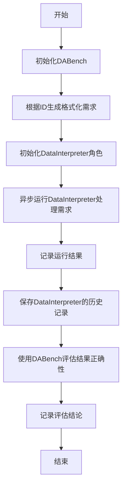
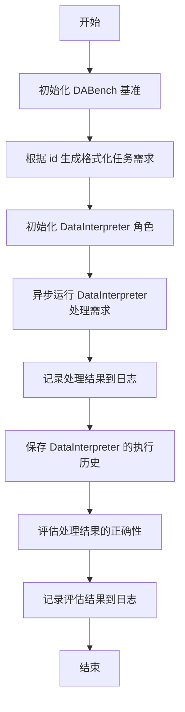

# `.\MetaGPT\examples\di\InfiAgent-DABench\run_InfiAgent-DABench_single.py` 详细设计文档

该代码是一个用于评估数据解释器（Data Interpreter）在特定任务上性能的脚本。它通过DABench生成一个格式化的问题提示，交由DataInterpreter角色处理，执行后保存其历史记录，并最终使用DABench评估执行结果的正确性。

## 整体流程



## 类结构

```
外部依赖
├── fire (命令行接口)
├── DABench (评估基准)
├── metagpt.logs.logger (日志记录)
├── metagpt.roles.di.data_interpreter.DataInterpreter (数据解释器角色)
└── metagpt.utils.recovery_util.save_history (历史记录保存)
```

## 全局变量及字段


### `logger`
    
用于记录日志的全局日志记录器实例。

类型：`Logger`
    


### `fire`
    
用于将Python程序转换为命令行接口（CLI）的库。

类型：`Module`
    


### `DABench`
    
用于生成和评估数据科学任务的基准测试类。

类型：`Class`
    


### `DataInterpreter`
    
执行数据解释和处理任务的角色类。

类型：`Class`
    


### `save_history`
    
用于保存角色历史记录的工具函数。

类型：`Function`
    


    

## 全局函数及方法

### `main`

`main` 函数是 Data Interpreter 评估任务的入口点。它负责初始化评估基准，生成任务需求，运行 Data Interpreter 来处理该需求，记录并保存执行历史，最后评估处理结果的正确性。

参数：

- `id`：`int`，可选参数，默认为 0。指定要评估的任务在基准中的索引或标识符。

返回值：`None`，此函数不返回任何值，其主要作用在于执行流程和输出日志。

#### 流程图



#### 带注释源码

```python
async def main(id=0):
    """Evaluate one task"""
    # 1. 初始化 DABench 评估基准对象
    bench = DABench()
    # 2. 根据传入的 id，从基准中获取对应任务的格式化需求描述
    requirement = bench.generate_formatted_prompt(id)
    # 3. 创建一个 DataInterpreter 角色实例
    di = DataInterpreter()
    # 4. 异步运行 DataInterpreter 来处理上一步获得的任务需求
    result = await di.run(requirement)
    # 5. 将 DataInterpreter 的处理结果记录到日志中
    logger.info(result)
    # 6. 将 DataInterpreter 角色的执行历史保存到持久化存储中
    save_history(role=di)
    # 7. 使用基准的评估方法，判断处理结果是否正确
    _, is_correct = bench.eval(id, str(result))
    # 8. 将评估结果（正确/错误）记录到日志中
    logger.info(f"Prediction is {'correct' if is_correct else 'incorrect'}.")
```

### `DataInterpreter.run`

该方法是一个异步方法，是DataInterpreter角色的核心执行入口。它接收一个用户需求（requirement），通过规划、执行和反思的循环过程，调用代码解释器（Code Interpreter）来生成、执行代码并处理结果，最终返回一个满足需求的解决方案或结论。

参数：
- `requirement`：`str`，用户提出的具体任务或问题描述。

返回值：`str`，执行完成后生成的最终结果或解决方案的字符串表示。

#### 流程图

```mermaid
flowchart TD
    A[开始: run(requirement)] --> B[初始化: 设置状态与消息历史]
    B --> C{规划阶段: 生成计划}
    C --> D[执行阶段: 循环执行计划中的每个动作]
    D --> E[调用Code Interpreter<br>生成并执行代码]
    E --> F{执行成功?}
    F -- 是 --> G[收集结果与反思]
    F -- 否 --> H[处理异常<br>更新状态]
    H --> D
    G --> I{所有动作完成?}
    I -- 否 --> D
    I -- 是 --> J[反思阶段: 评估整体结果]
    J --> K[生成最终响应消息]
    K --> L[返回最终结果内容]
    L --> M[结束]
```

#### 带注释源码

```python
async def run(self, requirement: str) -> str:
    """
    异步运行方法，处理用户需求。
    这是角色的主要行为入口。
    Args:
        requirement: 用户需求描述。
    Returns:
        执行后的最终结果字符串。
    """
    # 初始化：将用户需求设置为初始消息，并初始化内部状态（如计划、代码执行器等）
    await super().run(requirement)
    
    # 核心循环：在状态机驱动下，循环进行规划、执行和反思
    while not self._is_idle:
        # 1. 规划阶段：根据当前上下文（消息历史）生成后续行动计划
        await self._plan()
        
        # 2. 执行阶段：遍历并执行计划中的每个动作（Action）
        #    每个动作通常对应一次代码生成与执行
        rsp = await self._act()
        
        # 3. 反思阶段：根据执行结果（rsp）更新上下文，评估是否达到目标
        #    可能触发新一轮的规划或结束循环
        await self._reflect(rsp)
    
    # 循环结束，从最新的消息中提取并返回最终的结果内容
    return self.rc.memory.get()[-1].content
```

## 关键组件


### DABench

用于生成和评估数据解释任务的基准测试框架，提供任务提示生成和结果评估功能。

### DataInterpreter

数据解释角色，负责接收任务需求并执行相应的数据解释操作，生成结果。

### fire

命令行接口库，用于将Python函数快速转换为命令行工具，简化参数解析和调用。

### metagpt.logs.logger

日志记录工具，提供统一的日志输出接口，用于记录程序运行过程中的关键信息。

### metagpt.utils.recovery_util.save_history

历史记录保存工具，用于将角色的运行历史保存到持久化存储中，便于后续分析和恢复。


## 问题及建议


### 已知问题

-   **异步函数同步调用**：主入口使用 `fire.Fire(main)` 调用异步函数 `main`，这可能导致在异步上下文之外运行异步代码，引发运行时错误或未定义行为。
-   **硬编码的任务ID**：`main` 函数的参数 `id` 默认值为 0，限制了脚本的灵活性，无法方便地评估多个任务或指定特定任务。
-   **结果评估的健壮性**：`bench.eval(id, str(result))` 将 `result` 对象强制转换为字符串进行评估。如果 `result` 的结构复杂或包含非字符串类型，这种转换可能丢失关键信息，导致评估不准确。
-   **错误处理缺失**：代码中没有对 `bench.generate_formatted_prompt`、`di.run` 或 `bench.eval` 等关键操作进行异常捕获和处理。任何步骤的失败（如任务ID无效、网络问题、模型错误）都会导致整个程序崩溃。
-   **历史保存的潜在问题**：`save_history(role=di)` 函数可能依赖于 `di` 对象的内部状态。如果在 `di.run` 过程中对象状态发生意外改变，保存的历史可能不完整或不一致。

### 优化建议

-   **使用异步兼容的入口**：将主入口点改为异步函数，并使用 `asyncio.run()` 来启动异步主函数。例如，将 `if __name__ == "__main__":` 块改为 `asyncio.run(main())` 或类似结构，确保异步代码在正确的上下文中执行。
-   **参数化任务选择**：移除 `id` 参数的默认值，或通过命令行参数、配置文件等方式动态指定要评估的任务ID，使脚本能够灵活处理多个任务。
-   **改进结果传递与评估**：重新设计 `DataInterpreter.run` 方法的返回值或 `bench.eval` 方法的输入接口，使其能够接收结构化的结果对象（如字典、数据类实例），而不是依赖字符串转换，以确保评估的准确性。
-   **增加全面的错误处理**：在 `main` 函数中使用 `try-except` 块包裹核心逻辑，捕获可能发生的异常（如 `ValueError`, `KeyError`, `ConnectionError` 等），并记录详细的错误日志，使程序在部分失败时仍能提供有用的诊断信息。
-   **明确历史保存时机与内容**：审查 `save_history` 函数的实现，确保它在所有关键操作完成后被调用，并且保存的数据是完整且一致的。考虑在 `DataInterpreter` 类内部实现历史记录的逻辑，以更好地封装状态管理。
-   **添加日志与监控**：在关键步骤（如任务开始、模型调用、评估完成）增加更细粒度的日志记录，便于调试和性能分析。考虑添加执行时间的测量，以监控性能。
-   **考虑配置化**：将 `DABench` 的初始化参数、`DataInterpreter` 的配置等提取到配置文件或环境变量中，提高代码的可配置性和可维护性。


## 其它


### 设计目标与约束

本代码的设计目标是作为一个轻量级的任务执行入口，用于评估`DataInterpreter`智能体在`DABench`基准测试中单个任务上的表现。其核心约束包括：
1.  **单一职责**：代码仅负责单个任务的加载、执行、结果评估与历史记录保存，不处理批量任务或复杂调度。
2.  **异步执行**：为适配`DataInterpreter.run`方法的异步特性，主执行流程采用异步模式。
3.  **命令行接口**：通过`fire`库提供简单的命令行参数（任务ID）接口，便于脚本化调用。
4.  **最小化依赖**：除必要的`MetaGPT`框架组件和`DABench`基准库外，不引入其他业务逻辑。

### 错误处理与异常设计

当前代码的错误处理较为基础，主要依赖Python的默认异常传播机制和`fire`库的包装。
1.  **隐式异常传播**：`await di.run(requirement)`、`bench.eval`等操作中发生的任何异常都会向上抛出，导致脚本执行终止，并由`fire`库或控制台输出错误信息。
2.  **缺乏细粒度捕获**：代码未对可能发生的特定异常（如任务ID无效、`DABench`初始化失败、`DataInterpreter`执行超时或内部错误、文件保存失败等）进行捕获和处理，也未提供重试、降级或更友好的错误提示。
3.  **日志记录**：仅使用`logger.info`记录成功运行的结果和评估结论，未使用`logger.error`或`logger.exception`记录错误上下文，不利于问题排查。
4.  **资源清理**：代码未显式处理执行过程中可能打开的资源（如网络连接、文件句柄等）的清理工作。

### 数据流与状态机

本脚本的数据流是线性的，不涉及复杂的状态转换。
1.  **数据流**：
    *   **输入**：通过命令行参数`id`（整数，默认0）指定要评估的任务ID。
    *   **处理**：
        1.  `DABench`实例根据`id`生成格式化的任务提示（`requirement`）。
        2.  `DataInterpreter`实例接收`requirement`并异步执行，生成结果（`result`）。
        3.  结果被记录到日志，同时`DataInterpreter`的执行历史被保存。
        4.  `DABench`实例根据`id`和`result`进行评估，返回评估详情和正确性布尔值。
    *   **输出**：将`result`内容、评估是否正确的结论输出到日志。评估的详细结果（`_`）当前未被使用或输出。
2.  **状态机**：脚本本身无状态。`DataInterpreter`和`DABench`实例内部可能有其各自的状态（如对话历史、任务缓存），但这些状态由各自类管理，不构成脚本级别的状态机。

### 外部依赖与接口契约

1.  **外部库/框架**：
    *   `fire`：用于生成命令行接口。契约：`fire.Fire(main)`期望`main`函数能被其解析和调用。
    *   `DABench`（来自`DABench`包）：基准测试库。契约：提供`generate_formatted_prompt(id)`方法获取任务，以及`eval(id, result)`方法进行评估。
    *   `metagpt`：智能体框架。契约：提供`DataInterpreter`角色类、`logger`日志对象、`save_history`工具函数。
2.  **接口契约**：
    *   `main(id=0)`: 异步函数，接受一个可选整数参数`id`，无返回值。
    *   `DataInterpreter.run(requirement)`: 异步方法，接受字符串`requirement`，返回执行结果（类型取决于实现，代码中假设可被`str()`转换和`logger.info`记录）。
    *   `save_history(role=di)`: 函数，接受一个角色实例，将其历史保存到文件（具体路径和格式由函数实现决定）。
    *   `bench.eval(id, str(result))`: 方法，接受任务ID和结果字符串，返回一个元组（评估详情，正确性布尔值）。代码中仅使用了布尔值部分。

    