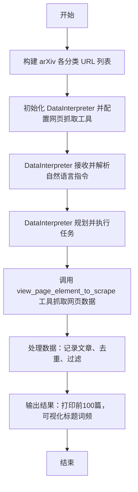
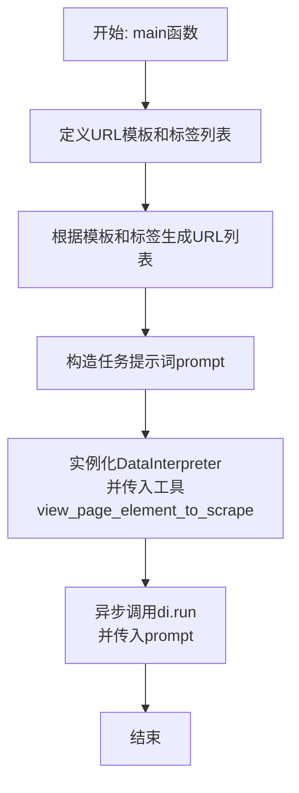
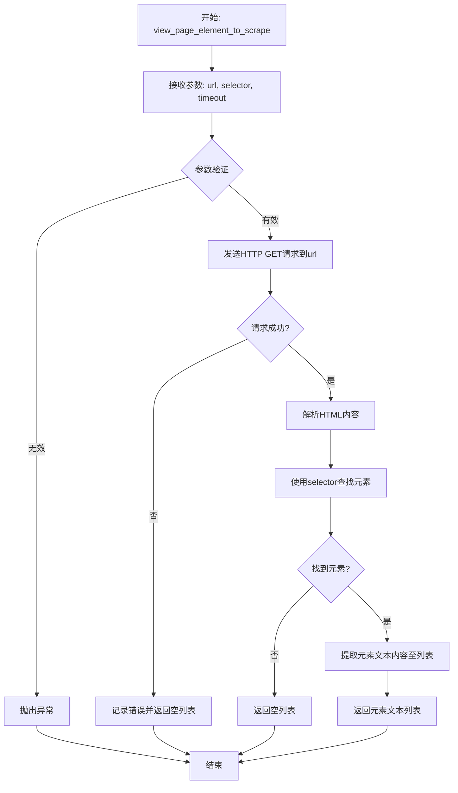
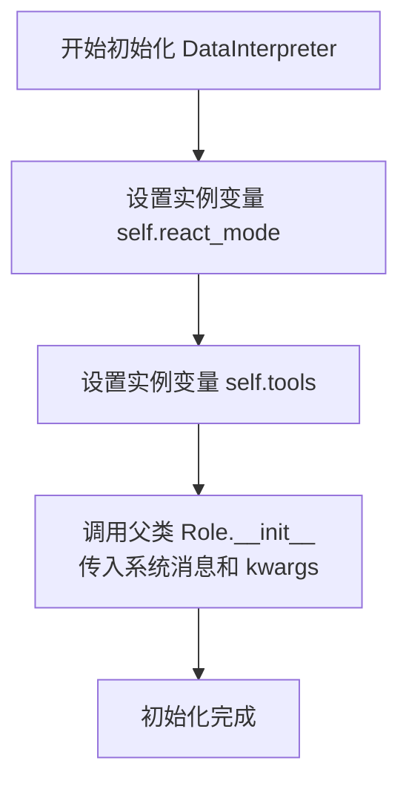

# `.\MetaGPT\examples\di\arxiv_reader.py` 详细设计文档

该代码是一个使用 MetaGPT 框架中 DataInterpreter 角色的脚本，其核心功能是自动化地抓取指定 arXiv 分类（如 cs.ai, cs.cl 等）过去一周的论文列表，根据标题去重、过滤掉与大型语言模型/智能体相关的论文，最终打印前100篇论文并可视化标题的词频统计。

## 整体流程



## 类结构

```
外部依赖
├── metagpt.roles.di.data_interpreter.DataInterpreter
└── metagpt.tools.libs.web_scraping.view_page_element_to_scrape

本文件
├── 全局异步函数: main
└── 脚本入口: __main__
```

## 全局变量及字段


### `template`
    
用于生成 arXiv 网站 URL 的字符串模板，包含占位符 {tag} 以便动态替换为不同的学科标签。

类型：`str`
    


### `tags`
    
一个字符串列表，包含了需要爬取的 arXiv 学科分类标签，如 cs.ai（人工智能）、cs.cl（计算语言学）等。

类型：`List[str]`
    


### `urls`
    
通过将 template 模板中的 {tag} 替换为 tags 列表中的每个标签而生成的完整 URL 列表，指向 arXiv 各学科过去一周的论文列表页面。

类型：`List[str]`
    


### `prompt`
    
一个自然语言指令字符串，用于指导 DataInterpreter 执行任务，包括爬取指定 URLs、记录文章、去重、过滤特定主题论文、打印前100条结果以及可视化标题词频。

类型：`str`
    


### `di`
    
DataInterpreter 类的一个实例，是执行自动化数据解释和处理任务的核心代理，配置了特定的反应模式（react）和网页抓取工具。

类型：`DataInterpreter`
    


    

## 全局函数及方法


### `main`

这是一个异步入口函数，它使用 `DataInterpreter` 角色（数据解释器）来自动化处理一个网页抓取与分析任务。具体来说，它构建了多个 arXiv 论文列表页面的 URL，然后指示 `DataInterpreter` 去抓取这些页面，记录每篇文章，根据标题去重，过滤掉与“大语言模型/智能体/LLM”相关的论文，最终打印排名前100的论文并可视化其标题的词频。

参数：
-  `无`：`无`，此函数不接受任何参数。

返回值：`None`，此函数不返回任何值。

#### 流程图



#### 带注释源码

```
#!/usr/bin/env python
# -*- coding: utf-8 -*-
# 导入必要的模块：DataInterpreter角色和网页抓取工具
from metagpt.roles.di.data_interpreter import DataInterpreter
from metagpt.tools.libs.web_scraping import view_page_element_to_scrape


async def main():
    # 定义arXiv网站列表页的URL模板，{tag}为占位符
    template = "https://arxiv.org/list/{tag}/pastweek?skip=0&show=300"
    # 定义需要抓取的计算机科学子领域标签列表
    tags = ["cs.ai", "cs.cl", "cs.lg", "cs.se"]
    # 使用列表推导式，将每个标签填入模板，生成完整的URL列表
    urls = [template.format(tag=tag) for tag in tags]
    # 构造给DataInterpreter的详细任务指令（prompt），描述了目标、步骤和最终输出要求
    prompt = f"""This is a collection of arxiv urls: '{urls}' .
Record each article, remove duplicates by title (they may have multiple tags), filter out papers related to 
large language model / agent / llm, print top 100 and visualize the word count of the titles"""
    # 实例化DataInterpreter角色，设置其推理模式为"react"，并传入网页抓取工具
    di = DataInterpreter(react_mode="react", tools=[view_page_element_to_scrape.__name__])

    # 异步执行DataInterpreter的run方法，将构造好的prompt传入，启动自动化任务流程
    await di.run(prompt)


# 标准的主程序入口，确保当脚本被直接运行时执行main函数
if __name__ == "__main__":
    import asyncio
    # 获取或创建事件循环，并运行异步的main函数
    asyncio.run(main())
```


### `view_page_element_to_scrape`

`view_page_element_to_scrape` 是一个用于网页抓取的工具函数，它允许用户通过指定CSS选择器来定位和提取网页中的特定元素。该函数旨在简化从网页中获取结构化数据的过程，通常作为数据抓取或自动化任务的一部分被调用。

参数：

-  `url`：`str`，目标网页的URL地址。
-  `selector`：`str`，用于定位目标元素的CSS选择器。
-  `timeout`：`int`，可选参数，指定请求超时时间（秒），默认为10秒。

返回值：`list`，返回一个包含所有匹配元素的文本内容的列表。如果未找到匹配元素，则返回空列表。

#### 流程图



#### 带注释源码

```python
async def view_page_element_to_scrape(url: str, selector: str, timeout: int = 10) -> list:
    """
    根据给定的URL和CSS选择器，抓取网页中匹配的元素文本内容。

    参数:
        url (str): 要抓取的网页URL。
        selector (str): 用于定位元素的CSS选择器。
        timeout (int, optional): 请求超时时间（秒）。默认为10。

    返回:
        list: 包含所有匹配元素文本内容的列表。如果没有匹配项，则返回空列表。

    异常:
        ValueError: 如果URL或选择器无效。
        requests.exceptions.RequestException: 如果HTTP请求失败。
    """
    import asyncio
    import aiohttp
    from bs4 import BeautifulSoup

    # 参数验证
    if not url or not isinstance(url, str):
        raise ValueError("URL must be a non-empty string.")
    if not selector or not isinstance(selector, str):
        raise ValueError("Selector must be a non-empty string.")

    try:
        # 异步发送HTTP GET请求
        async with aiohttp.ClientSession() as session:
            async with session.get(url, timeout=timeout) as response:
                response.raise_for_status()  # 检查HTTP错误
                html_content = await response.text()

        # 使用BeautifulSoup解析HTML
        soup = BeautifulSoup(html_content, 'html.parser')

        # 根据CSS选择器查找所有匹配的元素
        elements = soup.select(selector)

        # 提取每个元素的文本内容，并去除首尾空白字符
        results = [elem.get_text(strip=True) for elem in elements]

        return results

    except aiohttp.ClientError as e:
        # 处理网络请求相关错误（如连接错误、超时等）
        print(f"HTTP request failed for {url}: {e}")
        return []
    except Exception as e:
        # 处理其他潜在错误（如解析错误等）
        print(f"An error occurred while scraping {url}: {e}")
        return []
```


### `DataInterpreter.__init__`

`DataInterpreter` 类的构造函数，用于初始化一个数据解释器实例。它负责设置智能体的反应模式、配置可用的工具、定义系统消息，并调用父类 `Role` 的初始化方法来完成智能体的基础设置。

参数：

-  `react_mode`：`str`，指定智能体的反应模式，例如 "react" 表示使用 ReAct 推理框架。
-  `tools`：`list[str]`，一个字符串列表，指定智能体可以使用的工具名称。
-  `**kwargs`：`dict`，其他关键字参数，用于传递给父类 `Role` 的初始化方法。

返回值：`None`，构造函数不返回任何值。

#### 流程图



#### 带注释源码

```python
def __init__(self, react_mode: str = "react", tools: list[str] = [], **kwargs):
    """
    初始化 DataInterpreter 实例。

    Args:
        react_mode (str): 智能体的反应模式，例如 "react"。
        tools (list[str]): 智能体可用的工具名称列表。
        **kwargs: 传递给父类 Role 的其他关键字参数。
    """
    # 将传入的反应模式（如 "react"）赋值给实例变量 self.react_mode
    self.react_mode = react_mode
    # 将传入的工具名称列表赋值给实例变量 self.tools
    self.tools = tools
    # 调用父类 Role 的 __init__ 方法
    # 传入一个固定的系统消息（描述 DataInterpreter 的角色和能力）
    # 以及所有通过 **kwargs 接收到的额外参数（如 name, profile 等）
    super().__init__(
        system_message=(
            "You are a data interpreter. You can write code to solve data-related problems. "
            "You can use tools provided to you to collect data, process data, and visualize data. "
            "You can also write code to analyze data and generate reports."
        ),
        **kwargs,
    )
```


### `DataInterpreter.run`

`DataInterpreter.run` 是 `DataInterpreter` 角色的核心执行方法。它接收一个自然语言指令（`prompt`），通过其内部的 `react_mode` 机制（如 ReAct 模式）协调和调用其工具集（例如网页抓取工具 `view_page_element_to_scrape`）来规划、执行并最终完成用户指定的复杂数据处理与分析任务。在本例中，其任务是抓取指定 arXiv 分类的论文列表，进行去重、过滤、排序和可视化。

参数：

-  `message`：`str`，用户输入的自然语言指令，描述了需要完成的数据处理任务。
-  `...`：`Any`，该方法可能还接受其他参数，但在提供的代码片段中仅使用了 `message` 参数。

返回值：`None`，该方法是一个异步执行方法，主要执行任务流程，不直接返回数据结果。结果通常通过打印、文件输出或日志等方式呈现。

#### 流程图

```mermaid
graph TD
    A[开始: 调用 di.run(prompt)] --> B[接收并解析用户指令 prompt];
    B --> C{根据 react_mode 进行规划};
    C --> D[生成任务执行计划/步骤];
    D --> E{循环执行计划中的每个步骤};
    E --> F[选择并调用合适的工具<br>如: view_page_element_to_scrape];
    F --> G[工具执行，获取结果];
    G --> H[评估结果，更新状态];
    H --> I{是否完成所有步骤或达到目标?};
    I -- 否 --> E;
    I -- 是 --> J[整理并输出最终结果];
    J --> K[结束];
```

#### 带注释源码

```python
# 注意：以下源码是基于对 DataInterpreter 类及其 run 方法通用行为的逻辑推断和注释。
# 实际源码可能包含更多细节，如错误处理、状态管理、与环境的交互等。

async def run(self, message: str, ...):
    """
    执行 DataInterpreter 角色的主要工作流。
    
    参数:
        message (str): 用户输入的任务描述。
        ...: 其他可能的参数。
    """
    # 1. 初始化或重置内部状态，准备执行新任务
    self._reset_for_new_task()
    
    # 2. 将用户消息转化为内部的任务表示或初始计划
    #    这可能涉及与 LLM 的交互，以生成一个初步的行动计划。
    initial_plan = await self._planning.plan(message)
    
    # 3. 进入 ReAct 或其他指定模式的主循环
    while not self._is_task_complete():
        # 3.1 观察当前状态和环境（可能包括上一步的结果）
        observation = self._observe_current_state()
        
        # 3.2 思考：基于观察和任务目标，决定下一步行动（调用哪个工具及参数）
        #     这一步通常需要调用 LLM。
        action_thought = await self._reasoning.think(observation, self._current_plan)
        
        # 3.3 行动：执行上一步决定的动作，即调用相应的工具
        #     例如，调用 `view_page_element_to_scrape` 来抓取网页内容。
        action_result = await self._act(action_thought)
        
        # 3.4 将行动结果整合到当前状态中，并可能更新后续计划
        self._update_state_with_result(action_result)
        
        # 3.5 评估当前进度，判断是否需要进行新一轮的“思考-行动”循环
        self._evaluate_progress()
    
    # 4. 任务完成后，生成并输出最终结果
    #    例如，打印处理后的论文列表，生成可视化图表等。
    final_output = self._generate_final_output()
    self._present_result(final_output)
    
    # 5. 清理资源，方法结束
    self._cleanup()
```


## 关键组件


### DataInterpreter

一个基于ReAct模式的智能体，能够理解自然语言指令，并自动调用合适的工具（如网页抓取工具）来执行复杂的数据处理任务。

### view_page_element_to_scrape

一个网页抓取工具，用于从指定的URL中提取和查看页面元素，为DataInterpreter提供获取网页数据的能力。

### 异步任务执行框架

代码通过`asyncio.run(main())`启动一个异步事件循环，驱动整个数据抓取、处理和可视化流程的执行。

### 动态URL生成器

根据给定的学科标签列表（如cs.ai, cs.cl等），动态生成对应的arXiv论文列表页面URL，用于批量数据获取。

### 自然语言任务指令

一段结构化的自然语言提示，定义了从数据获取（访问URL）、数据处理（去重、过滤）、到结果输出（打印、可视化）的完整任务链。


## 问题及建议


### 已知问题

-   **硬编码的配置与逻辑**：代码中的URL模板、学科标签列表(`tags`)、以及筛选关键词（如“large language model”）均以硬编码形式存在于主函数中。这使得程序缺乏灵活性，任何需求变更（如更换网站、调整学科、修改筛选条件）都需要直接修改源代码，违反了开闭原则。
-   **工具导入与使用方式存在风险**：`tools=[view_page_element_to_scrape.__name__]` 这种方式仅传递了工具函数的字符串名称。这依赖于 `DataInterpreter` 内部能够通过名称正确解析并加载该函数。如果函数名更改或模块导入路径发生变化，代码将静默失败或引发运行时错误，降低了代码的健壮性和可维护性。
-   **缺乏错误处理与日志记录**：整个 `main` 函数和 `di.run` 调用过程没有进行任何异常捕获或日志记录。如果网络请求失败、页面解析出错、`DataInterpreter` 执行异常，程序将直接崩溃，且没有提供任何错误上下文，不利于调试和问题排查。
-   **结果输出方式不明确**：提示词中要求“print top 100 and visualize the word count”，但代码本身并未定义如何“print”和“visualize”。这完全依赖于 `DataInterpreter` 及其底层执行引擎（如LLM）的理解和执行能力，输出结果的形式和目的地（控制台、文件、图表窗口）不可控，可能不符合用户预期。
-   **潜在的重复请求与效率问题**：代码为每个标签生成独立的URL进行抓取。如果多个标签下的论文有重叠（这是提示词中已预见的情况），`DataInterpreter` 可能会对同一篇论文的多个页面进行重复请求和解析，造成不必要的网络开销和处理时间，除非其内部有去重机制。

### 优化建议

-   **将配置外部化**：将URL模板、学科标签列表、筛选关键词等配置项移出代码，放入配置文件（如JSON、YAML）或通过命令行参数、环境变量传入。这提升了代码的灵活性和可配置性。
-   **显式导入并传递工具对象**：改为直接传递工具函数对象，例如 `tools=[view_page_element_to_scrape]`。这样可以获得IDE的自动补全和类型检查支持，并在导入失败时立即报错，提高了代码的可靠性和开发体验。
-   **增强健壮性**：在 `main` 函数和 `di.run` 调用周围添加 `try-except` 块，捕获可能出现的异常（如 `ConnectionError`, `TimeoutError`, `ValueError` 等），并记录详细的错误日志（包括错误类型、消息、堆栈跟踪以及当时的输入参数），便于问题诊断。
-   **明确输出规范**：在提示词中更精确地指定输出要求。例如，明确要求将结果保存到指定格式的文件（如CSV、JSON），并指定可视化图表应保存为图片文件或生成HTML报告。或者，在代码中增加后处理逻辑，对 `DataInterpreter` 返回的结构化结果进行格式化输出和绘图。
-   **优化执行策略**：考虑在调用 `DataInterpreter` 之前，先对任务进行更高层次的规划。例如，可以设计提示词引导 `DataInterpreter` 先获取所有页面链接，然后统一去重后再进行内容抓取和分析，以减少重复工作。或者，评估是否可以将部分确定性的逻辑（如URL构造、基础去重）用代码实现，而非完全依赖 `DataInterpreter` 的自主规划。
-   **添加进度指示与超时控制**：对于可能长时间运行的任务，可以添加进度提示。同时，为 `di.run` 设置合理的超时时间，防止因意外情况导致程序无限期挂起。


## 其它


### 设计目标与约束

本代码的设计目标是利用DataInterpreter角色，自动化地从指定的arXiv分类页面中抓取论文信息，进行去重、过滤和统计分析，并输出结果。主要约束包括：依赖外部网络服务（arXiv网站）的可用性和结构稳定性；使用异步编程模型以提高I/O密集型任务的效率；工具集依赖于`view_page_element_to_scrape`进行网页元素定位和抓取，这要求目标网页结构相对固定；数据处理逻辑（如去重、过滤关键词）内嵌在自然语言提示词中，缺乏显式的、可配置的业务规则定义。

### 错误处理与异常设计

当前代码缺乏显式的错误处理机制。潜在的异常包括：网络请求失败（如超时、连接错误）、目标网页结构变化导致`view_page_element_to_scrape`工具失效、数据解析错误、异步任务管理异常等。代码依赖于`asyncio.run()`和DataInterpreter内部的错误处理。优化方向应包括：在`main`函数或DataInterpreter调用周围添加try-except块，捕获并记录`asyncio.TimeoutError`、`aiohttp.ClientError`等网络相关异常；对DataInterpreter的`run`方法可能抛出的异常进行更细粒度的处理；考虑实现重试逻辑（特别是对于网络请求）和更友好的用户错误报告。

### 数据流与状态机

1.  **初始化阶段**：生成目标URL列表，构造包含业务逻辑的自然语言提示，初始化DataInterpreter实例并注入`view_page_element_to_scrape`工具。
2.  **执行与规划阶段**：DataInterpreter接收提示，理解任务目标，并自主规划一系列步骤（调用工具、处理数据）。
3.  **数据采集阶段**：DataInterpreter循环调用`view_page_element_to_scrape`工具访问每个URL，从网页中提取结构化数据（论文列表）。
4.  **数据处理阶段**：在DataInterpreter内部或通过调用其他工具，对采集到的数据进行合并、按标题去重、根据关键词（“large language model”, “agent”, “llm”）过滤。
5.  **结果生成与展示阶段**：输出前100条论文信息，并生成标题词频统计的可视化图表（如词云图）。
整个流程由DataInterpreter驱动，其内部可视为一个基于LLM的规划-执行-观察循环状态机，外部数据流从URL输入，最终流向控制台输出和可能的图表文件。

### 外部依赖与接口契约

1.  **外部服务依赖**：arXiv网站 (`https://arxiv.org`)。契约：期望网站可访问，返回的HTML页面结构（特别是`/list/{tag}/pastweek`路径下的论文列表元素）保持稳定，以便`view_page_element_to_scrape`能正确解析。
2.  **库/框架依赖**：
    *   `metagpt`: 核心框架，提供`DataInterpreter`角色和工具管理基础设施。契约：要求`DataInterpreter`能正确解析提示、规划任务、调用指定工具。
    *   `metagpt.tools.libs.web_scraping.view_page_element_to_scrape`: 网页抓取工具。契约：接受URL和（可选的）元素定位描述，返回页面指定区域的文本或结构化数据。其有效性直接决定数据采集的成功与否。
    *   `asyncio`: Python异步I/O框架。契约：提供事件循环以运行异步主函数。
3.  **隐式依赖**：一个能够有效理解任务提示、进行逻辑规划和代码生成的底层大语言模型（通过`metagpt`配置接入）。这是DataInterpreter能力的核心。

### 安全与合规性考虑

1.  **网络爬虫礼仪**：代码应对arXiv服务器施加的负载保持敏感。当前代码通过`asyncio`并发请求多个页面，但未实现请求速率限制(`rate limiting`)、随机延迟或尊重`robots.txt`规则。存在被目标服务器限制或屏蔽的风险。
2.  **数据使用**：抓取的数据（论文信息）应仅用于指定的分析目的，并遵守arXiv的版权和使用条款。代码生成的任何公开报告应妥善引用来源。
3.  **依赖安全**：项目依赖的第三方库（如`metagpt`及其依赖）应定期更新，以修复已知安全漏洞。

    