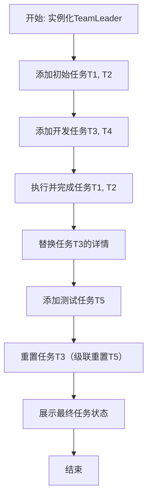
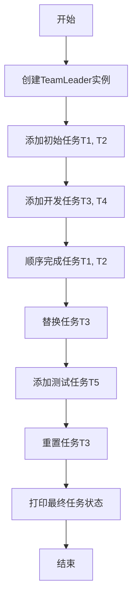
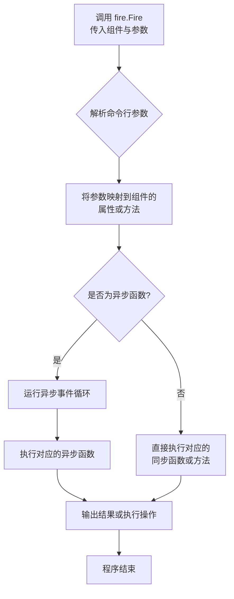
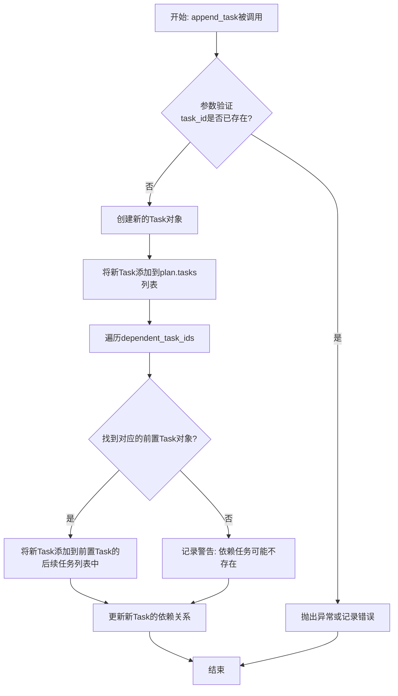
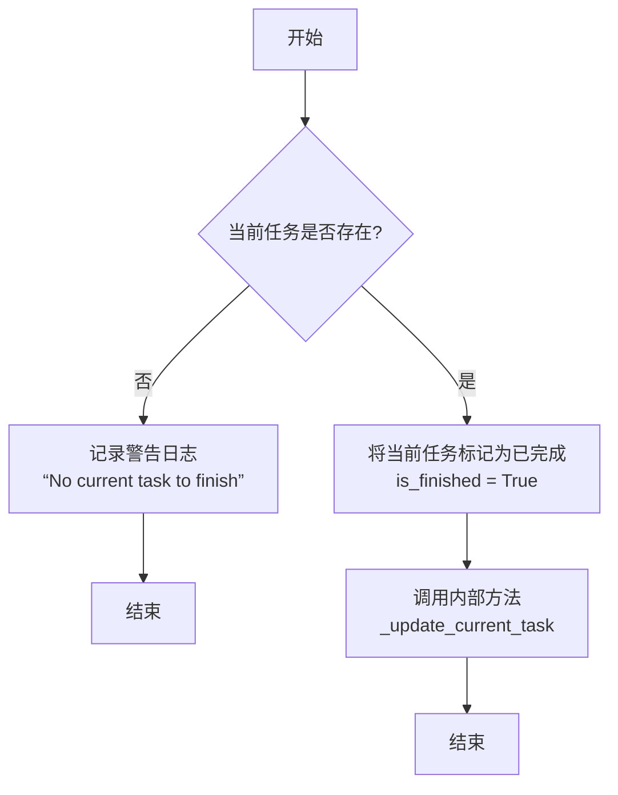
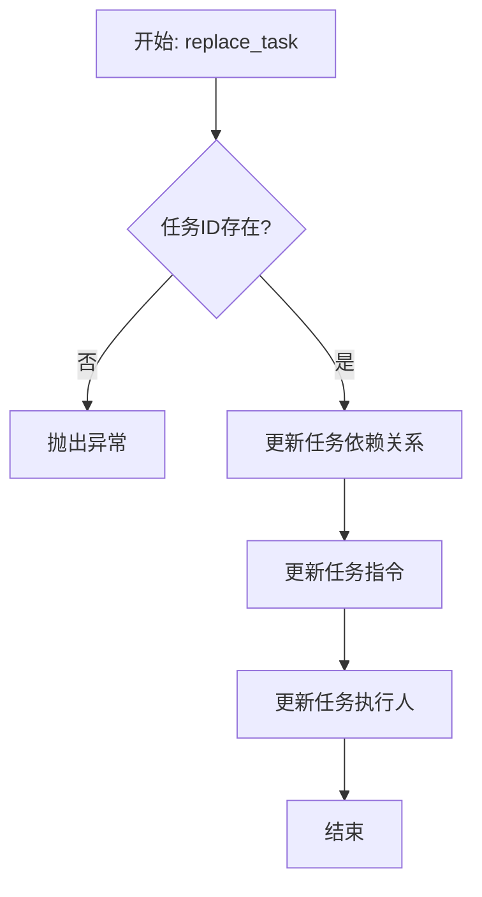

# `.\MetaGPT\examples\di\atomization_capacity_plan.py` 详细设计文档

该代码是一个任务管理系统的演示脚本，它通过实例化一个TeamLeader角色，向其内部的任务规划器（planner.plan）添加、执行、替换、重置一系列具有依赖关系的任务，并最终展示所有任务的状态，以此模拟一个软件开发项目（包含需求、设计、开发、测试等阶段）的任务编排与执行流程。

## 整体流程



## 类结构

```
TeamLeader (主角色类)
└── planner (规划器属性)
    └── plan (计划对象)
        ├── tasks (任务列表)
        ├── current_task (当前任务)
        ├── append_task (方法)
        ├── finish_current_task (方法)
        ├── replace_task (方法)
        └── reset_task (方法)
```

## 全局变量及字段


### `logger`
    
用于记录程序运行日志的日志记录器实例，来自metagpt.logs模块。

类型：`Logger`
    


### `TeamLeader.planner`
    
TeamLeader角色中负责任务规划的核心组件，包含任务计划（plan）。

类型：`Planner (推断类型)`
    


### `Plan (推断类，代码中未直接定义，通过tl.planner.plan访问).tasks`
    
计划中所有任务的列表，包含已添加的所有Task对象。

类型：`List[Task]`
    


### `Plan (推断类，代码中未直接定义，通过tl.planner.plan访问).current_task`
    
当前正在执行或待执行的任务对象。

类型：`Task`
    


### `Task (推断类，代码中未直接定义，是tasks列表中的元素).task_id`
    
任务的唯一标识符，用于引用和依赖管理。

类型：`str`
    


### `Task (推断类，代码中未直接定义，是tasks列表中的元素).dependent_task_ids`
    
此任务所依赖的前置任务ID列表，决定了任务的执行顺序。

类型：`List[str]`
    


### `Task (推断类，代码中未直接定义，是tasks列表中的元素).instruction`
    
任务的详细描述或指令，说明了需要完成的具体工作内容。

类型：`str`
    


### `Task (推断类，代码中未直接定义，是tasks列表中的元素).assignee`
    
被分配执行此任务的人员或角色名称。

类型：`str`
    


### `Task (推断类，代码中未直接定义，是tasks列表中的元素).is_finished`
    
表示任务是否已完成的布尔标志。

类型：`bool`
    
    

## 全局函数及方法

### `main`

该函数是一个异步的演示函数，用于展示 `TeamLeader` 角色及其内部规划器（`planner.plan`）的任务管理功能。它通过一系列步骤（添加任务、完成任务、替换任务、重置任务）来模拟一个软件开发项目的任务流程，并最终打印出所有任务的状态。

参数：
- 无

返回值：`None`，该函数不返回任何值，主要用于执行演示流程。

#### 流程图



#### 带注释源码

```python
async def main():
    # 1. 初始化TeamLeader角色，它内部包含一个规划器（planner）来管理任务计划（plan）
    tl = TeamLeader()
    # 2. 记录日志：开始添加初始任务
    logger.info("\n=== Adding Initial Tasks ===")
    # 3. 向计划中添加第一个任务T1（创建PRD），无依赖，分配给Alice
    tl.planner.plan.append_task(
        task_id="T1", dependent_task_ids=[], instruction="Create Product Requirements Document (PRD)", assignee="Alice"
    )
    # 4. 向计划中添加第二个任务T2（设计系统架构），依赖T1，分配给Bob
    tl.planner.plan.append_task(
        task_id="T2", dependent_task_ids=["T1"], instruction="Design System Architecture", assignee="Bob"
    )

    # 5. 记录日志：开始添加开发任务
    logger.info("\n=== Adding Development Tasks ===")
    # 6. 添加开发任务T3（实现核心功能模块），依赖T2，分配给Alex
    tl.planner.plan.append_task(
        task_id="T3", dependent_task_ids=["T2"], instruction="Implement Core Function Modules", assignee="Alex"
    )
    # 7. 添加开发任务T4（实现用户界面），依赖T2，分配给Alex
    tl.planner.plan.append_task(
        task_id="T4", dependent_task_ids=["T2"], instruction="Implement User Interface", assignee="Alex"
    )

    # 8. 记录日志：开始执行并完成任务
    logger.info("\n=== Execute and Complete Tasks ===")
    # 9. 打印当前任务（应为T1）的指令并标记其为完成
    logger.info(f"Current Task: {tl.planner.plan.current_task.instruction}")
    tl.planner.plan.finish_current_task()  # 完成 T1

    # 10. 打印新的当前任务（应为T2）的指令并标记其为完成
    logger.info(f"Current Task: {tl.planner.plan.current_task.instruction}")
    tl.planner.plan.finish_current_task()  # 完成 T2

    # 11. 记录日志：开始替换任务
    logger.info("\n=== Replace Task ===")
    # 12. 替换任务T3的依赖、指令和分配人
    tl.planner.plan.replace_task(
        task_id="T3",
        new_dependent_task_ids=["T2"],
        new_instruction="Implement Core Function Modules (Add New Features)",
        new_assignee="Senior_Developer",
    )

    # 13. 记录日志：开始添加测试任务
    logger.info("\n=== Add Testing Tasks ===")
    # 14. 添加测试任务T5（执行集成测试），依赖T3和T4，分配给Edward
    tl.planner.plan.append_task(
        task_id="T5", dependent_task_ids=["T3", "T4"], instruction="Execute Integration Tests", assignee="Edward"
    )

    # 15. 记录日志：开始重置任务
    logger.info("\n=== Reset Task ===")
    # 16. 说明重置T3也会重置依赖它的T5
    logger.info("Reset Task T3 (This will also reset T5 which depends on it)")
    # 17. 重置任务T3（将其状态标记为未完成，并可能级联重置其依赖任务）
    tl.planner.plan.reset_task("T3")

    # 18. 记录日志：显示最终状态
    logger.info("\n=== Final Status ===")
    # 19. 计算并打印已完成的任务数量
    logger.info(f"Completed Tasks: {len([t for t in tl.planner.plan.tasks if t.is_finished])}")
    # 20. 打印当前任务的指令
    logger.info(f"Current Task: {tl.planner.plan.current_task.instruction}")
    # 21. 遍历并打印所有任务的详细信息（ID、指令、完成状态）
    logger.info("All Tasks:")
    for task in tl.planner.plan.tasks:
        logger.info(f"- {task.task_id}: {task.instruction} (Completed: {task.is_finished})")
```

### `fire.Fire`

`fire.Fire` 是 Google Fire 库的核心函数，用于将 Python 程序（模块、类、函数、对象）自动转换为命令行接口（CLI）。它解析命令行参数，并将其映射到被调用对象的相应属性或方法上，从而实现通过命令行调用 Python 代码的功能。

参数：

- `component`：`Any`，要转换为命令行接口的 Python 组件。可以是模块、类、类实例、函数或字典等。
- `command`：`Optional[Sequence[str]]`，可选参数，表示要执行的命令行参数序列。如果为 `None`，则从 `sys.argv` 中获取。
- `name`：`Optional[str]`，可选参数，指定生成的 CLI 工具的名称。如果为 `None`，则使用组件本身的名称。

返回值：`None`，此函数通常不直接返回值，而是根据命令行参数执行相应的操作并可能退出程序。

#### 流程图



#### 带注释源码

```python
# 导入 fire 库，这是 Google 提供的用于快速创建 CLI 的工具
import fire

# ... 其他导入和代码 ...

# 程序的入口点，当脚本被直接运行时执行
if __name__ == "__main__":
    # 调用 fire.Fire 函数，将 main 函数（一个异步函数）作为组件传入
    # fire.Fire 会自动处理以下事情：
    # 1. 解析通过命令行传入的参数（本例中 main 函数无参数，所以通常无额外参数）。
    # 2. 由于 main 是一个异步函数，fire 会检测到这一点。
    # 3. 它会自动创建一个异步事件循环（asyncio event loop）。
    # 4. 在该事件循环中运行 main() 函数。
    # 5. 执行 main 函数中定义的所有任务流程。
    # 如果没有 fire.Fire，直接调用 `asyncio.run(main())` 也能达到类似效果。
    # fire.Fire 的优势在于它能将更复杂的函数签名（带参数的函数）方便地暴露为命令行参数。
    fire.Fire(main)
```

### `tl.planner.plan.append_task`

该方法用于向任务计划（`Plan`）中添加一个新的任务。它接收任务的ID、依赖关系、指令描述和执行者等信息，并将该任务整合到计划的任务列表中，同时更新任务之间的依赖关系。

参数：

- `task_id`：`str`，新任务的唯一标识符。
- `dependent_task_ids`：`list[str]`，该任务所依赖的前置任务ID列表。如果任务没有依赖，则为空列表。
- `instruction`：`str`，对新任务的描述性指令。
- `assignee`：`str`，负责执行该任务的成员名称。

返回值：`None`，该方法不返回任何值，其作用是将新任务添加到计划中。

#### 流程图



#### 带注释源码

```python
def append_task(self, task_id: str, dependent_task_ids: list[str], instruction: str, assignee: str) -> None:
    """
    向计划中添加一个新任务。

    该方法会创建一个新的Task对象，并根据提供的依赖任务ID列表建立任务间的依赖关系。
    如果提供的task_id已存在，通常会抛出异常以防止重复。

    Args:
        task_id (str): 新任务的唯一标识符。
        dependent_task_ids (list[str]): 该任务所依赖的前置任务ID列表。
        instruction (str): 对新任务的描述性指令。
        assignee (str): 负责执行该任务的成员名称。

    Returns:
        None: 该方法不返回任何值。
    """
    # 1. 检查task_id是否已存在，若存在则抛出ValueError异常
    if any(task.task_id == task_id for task in self.tasks):
        raise ValueError(f"Task with ID '{task_id}' already exists.")

    # 2. 创建新的Task对象
    new_task = Task(
        task_id=task_id,
        instruction=instruction,
        assignee=assignee
    )

    # 3. 将新任务添加到总任务列表中
    self.tasks.append(new_task)

    # 4. 建立依赖关系
    for dep_id in dependent_task_ids:
        # 在现有任务中查找依赖任务
        for task in self.tasks:
            if task.task_id == dep_id:
                # 将新任务添加到依赖任务的后续任务列表中
                task.next_tasks.append(new_task)
                # 同时在新任务中记录其依赖的任务
                new_task.dependent_tasks.append(task)
                break
        else:
            # 如果循环完成仍未找到依赖任务，记录警告（依赖任务可能稍后添加）
            logger.warning(f"Dependent task '{dep_id}' not found when adding task '{task_id}'. Dependency may be added later.")
```

### `Plan.finish_current_task`

该方法用于标记当前任务为已完成状态，并自动将任务指针移动到下一个可执行的任务。它会更新当前任务的完成状态，并基于任务依赖关系重新计算下一个待执行的任务。

参数：
- 无显式参数。该方法通过 `self` 访问当前 `Plan` 实例的内部状态。

返回值：`None`，无返回值。

#### 流程图



#### 带注释源码

```python
def finish_current_task(self):
    """
    完成当前任务。
    将当前任务标记为已完成，并更新当前任务指针至下一个可执行的任务。
    """
    if not self.current_task:
        # 如果没有当前任务，记录警告信息
        logger.warning("No current task to finish")
        return

    # 将当前任务标记为已完成
    self.current_task.is_finished = True
    # 调用内部方法，基于任务依赖关系更新当前任务指针
    self._update_current_task()
```

### `tl.planner.plan.replace_task`

该方法用于替换计划中一个已存在的任务。它允许更新任务的依赖关系、指令描述和执行人。如果指定的任务ID不存在，则会引发异常。此操作会确保任务依赖关系的完整性，并可能影响依赖于被替换任务的其他任务的状态。

参数：

- `task_id`：`str`，需要被替换的任务的唯一标识符。
- `new_dependent_task_ids`：`List[str]`，新的依赖任务ID列表，指定了该任务执行前必须完成的任务。
- `new_instruction`：`str`，新的任务指令描述，说明了任务的具体内容。
- `new_assignee`：`str`，新的任务执行人，指定了负责完成该任务的成员。

返回值：`None`，该方法不返回任何值，直接修改计划中的任务列表。

#### 流程图



#### 带注释源码

```python
def replace_task(
    self,
    task_id: str,
    new_dependent_task_ids: List[str],
    new_instruction: str,
    new_assignee: str,
) -> None:
    """
    替换一个已存在的任务。

    参数:
        task_id (str): 要替换的任务的ID。
        new_dependent_task_ids (List[str]): 新的依赖任务ID列表。
        new_instruction (str): 新的任务指令。
        new_assignee (str): 新的任务执行人。

    异常:
        ValueError: 如果任务ID不存在。
    """
    # 查找任务索引
    task_index = next(
        (i for i, t in enumerate(self.tasks) if t.task_id == task_id), None
    )
    if task_index is None:
        raise ValueError(f"Task with ID {task_id} not found.")

    # 更新任务属性
    task = self.tasks[task_index]
    task.dependent_task_ids = new_dependent_task_ids
    task.instruction = new_instruction
    task.assignee = new_assignee
    # 注意：这里没有重置任务状态（如 is_finished），
    # 意味着替换操作不会改变任务的完成状态。
```

### `tl.planner.plan.reset_task`

该方法用于重置指定任务及其所有下游依赖任务的状态。当某个任务需要重新执行时（例如，其前置任务或需求发生变更），调用此方法可以将其自身及其所有后续任务的状态从“已完成”或“进行中”重置为“待处理”，从而允许工作流重新执行这些任务。

参数：

-  `task_id`：`str`，需要重置的任务的唯一标识符。

返回值：`None`，此方法不返回任何值，其作用是通过修改内部任务对象的状态来实现重置功能。

#### 流程图

```mermaid
flowchart TD
    A[开始: reset_task(task_id)] --> B{任务ID是否存在?}
    B -- 否 --> C[记录错误日志并返回]
    B -- 是 --> D[获取目标任务对象]
    D --> E[调用内部方法 _reset_task(task)]
    E --> F[递归重置所有下游依赖任务]
    F --> G[将目标任务状态重置为待处理]
    G --> H[结束]
```

#### 带注释源码

```python
def reset_task(self, task_id: str):
    """
    重置指定任务及其所有下游依赖任务。
    该方法会递归地将目标任务及其所有后续任务的状态重置为“待处理”（is_finished=False），
    并清空其输出结果（output），以便重新执行。

    Args:
        task_id (str): 需要重置的任务的唯一标识符。

    Returns:
        None: 此方法不返回任何值，直接修改内部任务对象的状态。
    """
    # 1. 根据task_id查找对应的任务对象
    task = self._get_task_by_id(task_id)
    if not task:
        # 如果未找到任务，记录错误日志并提前返回
        logger.error(f"Task {task_id} not found.")
        return

    # 2. 调用内部递归方法，从目标任务开始重置
    self._reset_task(task)

def _reset_task(self, task):
    """
    内部递归方法，用于重置单个任务及其所有下游依赖任务。

    Args:
        task (Task): 需要重置的任务对象。

    Returns:
        None: 此方法不返回任何值，直接修改任务对象的状态。
    """
    # 1. 递归重置所有下游依赖任务
    # 遍历所有任务，找出那些依赖当前任务的任务（即下游任务），并递归重置它们
    for t in self.tasks:
        if task.task_id in t.dependent_task_ids:
            self._reset_task(t)

    # 2. 重置当前任务的状态
    # 将任务标记为未完成，并清空其输出结果
    task.is_finished = False
    task.output = None
    # 注意：此方法通常不会修改任务的指令、负责人或依赖关系，仅重置执行状态。
```

## 关键组件


### TeamLeader

团队领导角色，负责协调和管理任务规划与执行流程。

### Planner

任务规划器，负责管理任务列表、任务依赖关系以及任务状态。

### Plan

具体的任务计划，包含任务列表、当前任务以及任务操作方法（如添加、完成、替换、重置任务）。

### Task

单个任务单元，包含任务ID、依赖任务ID、指令、分配人员以及完成状态等信息。


## 问题及建议


### 已知问题

-   **硬编码的任务逻辑**：`main` 函数中的任务创建、执行、替换和重置逻辑是硬编码的。这只是一个演示脚本，无法适应真实、动态变化的项目需求。任何任务流程的变更都需要直接修改源代码。
-   **缺乏错误处理**：代码在执行任务操作（如 `finish_current_task`, `replace_task`, `reset_task`）时，没有进行任何错误检查或异常捕获。例如，如果当前任务不存在或任务ID无效，程序可能会崩溃或产生不可预期的行为。
-   **演示性质的状态管理**：代码通过手动调用 `finish_current_task` 来推进 `current_task`，并假设任务顺序严格遵循依赖关系。这种显式、线性的控制流在复杂的、可能并发的真实场景中难以维护和扩展。
-   **日志信息不完整**：日志主要记录了操作步骤，但没有记录关键的操作结果、状态变更细节或潜在的错误信息，不利于调试和监控。
-   **紧耦合的调用方式**：`main` 函数直接操作 `tl.planner.plan` 的内部结构（如 `tasks`, `current_task`），违反了封装原则。这增加了模块间的耦合度，使得 `Plan` 类的内部实现变更会直接影响上层调用代码。

### 优化建议

-   **抽象任务流程定义**：将任务ID、依赖、指令和分配信息从代码中抽离出来，改为通过配置文件（如YAML、JSON）或领域特定语言（DSL）来定义。`main` 函数应作为解析并执行该定义的引擎。
-   **增强健壮性**：
    -   在执行 `plan` 的方法（如 `finish_current_task`, `reset_task`）前，增加前置条件检查（例如，检查任务是否存在、依赖是否满足）。
    -   使用 `try-except` 块捕获可能抛出的异常，并记录有意义的错误日志，确保程序在部分操作失败时能优雅降级或明确报错。
-   **实现状态机与自动化推进**：在 `Plan` 类内部实现一个基于任务依赖图的状态机。当一个任务完成时，自动根据依赖关系计算并更新下一个可执行的 `current_task`，而不是由外部脚本手动指定。
-   **丰富日志内容**：在关键状态变更处（如任务开始、完成、重置、替换）记录更详细的信息，包括任务对象的核心字段、操作前后的状态对比等。考虑引入结构化日志以便于后续分析。
-   **封装与接口设计**：
    -   为 `TeamLeader` 或 `Plan` 类提供更高级、语义清晰的公共接口（例如，`start_project(config)`, `execute_next_phase()`），而不是暴露其内部组件的所有细节。
    -   让 `main` 函数通过这些高层接口与系统交互，降低耦合度。
-   **增加可视化与监控**：考虑在演示或开发阶段，增加将任务依赖图（DAG）和当前状态输出为图像（如通过Mermaid或Graphviz）的功能，便于直观理解项目进度。
-   **考虑异步与并发**：如果任务可以并行执行（如T3和T4），`Plan` 类的设计应支持管理多个并发的“当前任务”，而不仅仅是单个 `current_task`。`main` 函数中的演示逻辑也应相应调整以展示并发能力。


## 其它


### 设计目标与约束

本代码示例的核心设计目标是展示一个任务规划与执行系统（`TeamLeader` 与 `Plan`）的基本操作流程，包括任务的增、删、改、查、执行与重置。其约束在于：1) 作为演示代码，功能完整性优先于生产环境的健壮性；2) 依赖 `metagpt` 框架提供的 `TeamLeader` 角色和 `Plan` 数据结构；3) 执行流程是线性的、预设的，不具备动态任务调度或并发执行能力。

### 错误处理与异常设计

当前代码示例中未显式包含错误处理逻辑。潜在的异常场景包括：1) 在 `finish_current_task` 时 `current_task` 可能为 `None`；2) `replace_task` 或 `reset_task` 时指定的 `task_id` 不存在；3) `append_task` 时指定的 `dependent_task_ids` 包含不存在的任务ID。这些异常预计由底层的 `metagpt.roles.di.team_leader.TeamLeader` 及其 `planner.plan` 对象内部处理，可能抛出异常或静默失败，但示例中未进行捕获或检查。

### 数据流与状态机

数据流围绕 `tl.planner.plan.tasks` 这个任务列表展开。初始状态为空。通过 `append_task` 流入新任务，每个任务包含 `task_id`, `instruction`, `assignee`, `is_finished` 等状态。`current_task` 指向第一个未完成的任务。`finish_current_task` 操作改变当前任务的 `is_finished` 状态，并触发 `current_task` 指针移动到下一个未完成任务，构成一个简单的线性状态推进。`replace_task` 修改指定任务的内容和依赖。`reset_task` 将指定任务及其所有下游依赖任务的 `is_finished` 状态重置为 `False`，并可能回滚 `current_task` 指针，这是状态机中唯一的非单向操作。

### 外部依赖与接口契约

1.  **外部依赖**:
    *   `fire`: 用于将 `main` 函数转换为命令行接口，允许传递参数（尽管本例未使用）。
    *   `metagpt.logs.logger`: 用于结构化的日志输出。
    *   `metagpt.roles.di.team_leader.TeamLeader`: 核心外部类，提供了任务规划的执行上下文。其 `planner.plan` 属性是实现任务管理功能的关键依赖。
2.  **接口契约**:
    *   与 `TeamLeader` 和 `Plan` 的契约是隐式的，基于对其方法（`append_task`, `finish_current_task`, `replace_task`, `reset_task`）和属性（`tasks`, `current_task`）的调用。代码假设这些接口存在且行为符合预期（例如，`reset_task` 会递归重置下游任务）。

### 并发与同步考虑

当前代码为纯异步函数 (`async def main`) 的线性演示，所有操作都是顺序执行的，不存在并发任务执行或共享资源的竞争条件。然而，`TeamLeader` 和 `Plan` 组件在设计上可能支持异步操作或用于多代理环境，但在此示例中并未体现。如果未来扩展为并发执行任务，则需要考虑任务状态的原子性更新、`current_task` 的并发访问控制以及任务依赖关系的动态检查等问题。

### 配置与可扩展性

示例中所有任务数据（ID、描述、分配者、依赖）都是硬编码在 `main` 函数中的。这缺乏配置性。一个可扩展的设计应允许从外部配置文件（如 JSON、YAML）或数据库加载任务蓝图。此外，`TeamLeader` 的初始化没有传递任何参数，表明其配置可能依赖于全局环境或默认设置，这限制了其在不同场景下的可配置性。任务的执行逻辑（`finish_current_task` 具体做了什么）被完全封装在 `metagpt` 框架内，用户无法自定义完成一个任务时需要触发的具体业务动作。

    