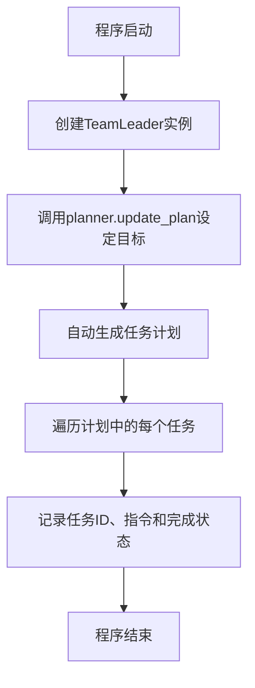
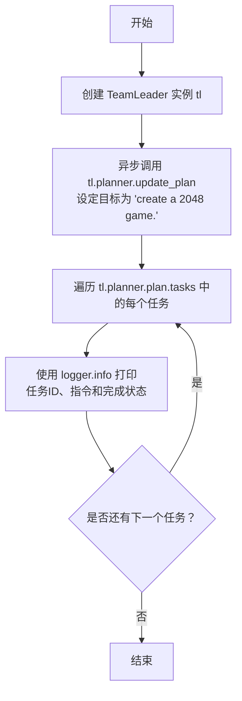

# `.\MetaGPT\examples\di\automated_planning_of_tasks.py` 详细设计文档

该代码是一个简单的任务执行入口脚本，它创建了一个TeamLeader角色实例，为其设定一个创建2048游戏的目标，然后自动生成并遍历执行计划中的所有任务，同时记录每个任务的基本信息和完成状态。

## 整体流程



## 类结构

```
TeamLeader (角色类)
├── planner (规划器属性)
│   └── plan (计划属性)
│       └── tasks (任务列表)
│           ├── task_id (任务ID)
│           ├── instruction (任务指令)
│           └── is_finished (完成状态)
```

## 全局变量及字段


### `TeamLeader.planner`
    
负责管理任务规划和执行的组件，用于生成、更新和跟踪实现特定目标所需的任务列表。

类型：`Planner`
    
    

## 全局函数及方法


### `main`

该函数是程序的入口点，负责创建一个 `TeamLeader` 角色实例，为其设定一个创建2048游戏的目标，并自动生成实现该目标所需的任务列表。最后，它会遍历并打印出所有生成任务的详细信息，包括任务ID、指令和完成状态。

参数：
- 无

返回值：`None`，该函数不返回任何值，其主要功能是执行流程和打印日志。

#### 流程图



#### 带注释源码

```python
import fire

from metagpt.logs import logger
from metagpt.roles.di.team_leader import TeamLeader


async def main():
    # 创建一个 TeamLeader 角色的实例
    tl = TeamLeader()

    # 异步调用计划器的 update_plan 方法，设定目标为“创建一个2048游戏”。
    # 此方法将根据目标自动分析并生成一系列需要完成的任务。
    await tl.planner.update_plan(goal="create a 2048 game.")

    # 遍历计划（plan）中的所有任务（tasks）
    # 使用日志记录器（logger）打印每个任务的ID、指令内容以及是否已完成的状态。
    for task in tl.planner.plan.tasks:
        logger.info(f"- {task.task_id}: {task.instruction} (Completed: {task.is_finished})")


# 程序的入口点。当脚本被直接运行时，使用 fire 库将 main 函数转换为命令行接口。
if __name__ == "__main__":
    fire.Fire(main)
```


## 关键组件


### TeamLeader

TeamLeader 是负责协调和管理任务执行流程的核心角色，它通过 Planner 组件来规划和更新任务列表，以达成设定的目标。

### Planner

Planner 是 TeamLeader 内部的一个关键组件，负责根据给定的目标（如“create a 2048 game”）生成、管理和更新具体的任务计划。

### Plan

Plan 是 Planner 组件维护的核心数据结构，它包含了一个任务列表，每个任务都有唯一的ID、指令描述和完成状态，用于追踪项目目标的执行进度。

### Task

Task 是 Plan 中的基本执行单元，每个任务都封装了具体的指令（instruction）和完成状态（is_finished），是驱动目标实现的具体步骤。


## 问题及建议


### 已知问题

-   **硬编码的业务逻辑**：代码中直接将目标 `"create a 2048 game."` 硬编码在 `main` 函数中。这使得脚本的用途单一，无法灵活地应用于其他目标或任务，降低了代码的复用性。
-   **缺乏配置化或参数化输入**：脚本的执行目标完全固定，无法通过命令行参数、配置文件或环境变量等方式动态指定，限制了其在自动化流程或不同场景下的使用。
-   **异步入口点与同步调用框架的潜在不匹配**：`main` 函数被定义为 `async`，但通过 `fire.Fire(main)` 调用。虽然 `fire` 库可能支持异步函数，但这种组合可能在某些环境下（如某些事件循环配置）引发运行时错误或行为不一致，增加了部署和调试的复杂性。
-   **日志输出信息有限**：当前仅输出了任务的基本信息（ID、指令、完成状态）。对于监控、调试或理解任务执行过程而言，缺乏更详细的上下文信息，例如任务间的依赖关系、执行耗时、可能产生的错误等。

### 优化建议

-   **将业务目标参数化**：修改 `main` 函数，使其接受一个参数（例如 `goal`），并通过 `fire` 库从命令行传入。例如：`async def main(goal: str = "create a 2048 game."):` 并调用 `fire.Fire(main)`。这样用户可以通过命令行指定任意目标，如 `python script.py --goal "build a tic-tac-toe game"`。
-   **增强日志和可观测性**：在日志中增加更多维度的信息。例如，在开始更新计划前，记录传入的目标；可以记录 `planner.update_plan` 方法执行后的总结信息，如生成的任务总数；未来在任务执行循环中，可以加入更细粒度的状态跟踪。
-   **明确异步执行上下文**：为确保异步代码正确运行，建议显式地管理事件循环。可以将入口点改为同步函数，在内部使用 `asyncio.run()` 来调用异步的 `main` 逻辑。或者，如果坚持使用 `fire` 直接调用异步函数，需在文档中明确说明运行环境要求，并考虑在 `main` 函数内部进行事件循环的安全检查或适配。
-   **考虑错误处理机制**：当前代码没有对 `tl.planner.update_plan` 或后续操作可能抛出的异常进行捕获和处理。建议增加 `try...except` 块，捕获可能出现的异常（如网络错误、规划逻辑错误等），并进行适当的日志记录和错误退出，提高脚本的健壮性。
-   **分离配置与逻辑**：对于更复杂的应用，可以考虑将目标、团队配置等抽离到配置文件（如 YAML、JSON）或环境变量中，使核心脚本专注于业务流程，提升可维护性。


## 其它


### 设计目标与约束

本代码模块的设计目标是提供一个简洁、可执行的入口点，用于演示或驱动一个基于`TeamLeader`角色的任务规划与执行流程。其核心约束包括：1) 作为脚本入口，必须保持轻量级，不包含复杂的业务逻辑；2) 依赖`fire`库提供命令行接口，要求函数签名清晰；3) 作为异步程序的入口，需要正确处理异步执行环境；4) 主要功能是展示`TeamLeader`和`planner`组件的交互结果，而非实现完整应用。

### 错误处理与异常设计

当前代码的错误处理机制较为基础。`main`函数内部没有显式的`try-except`块来捕获和处理可能发生的异常，例如：`TeamLeader`初始化失败、`planner.update_plan`异步调用中的网络或逻辑错误、`fire.Fire`解析命令行参数错误等。任何未捕获的异常都将导致程序崩溃，并向控制台输出堆栈跟踪信息。这是一种适合脚本调试但不利于生产环境稳定性的设计。建议增加全局异常捕获，对不同类型的异常进行分级处理（如记录日志、友好提示、优雅退出）。

### 数据流与状态机

本模块的数据流是单向且简单的：1) 程序启动，解析命令行参数（本例中无参数）；2) 进入`main`函数，创建`TeamLeader`实例(`tl`)，此对象内部包含`planner`及`plan`状态；3) 调用`tl.planner.update_plan`，传入目标字符串“create a 2048 game.”。此调用是核心，会触发`planner`内部的状态变迁（例如，从“空闲”到“规划中”再到“规划完成”），并填充`tl.planner.plan.tasks`列表；4) 遍历`tasks`列表，将每个任务的信息通过`logger`输出。整个流程没有复杂的状态分支，可以视为一个线性的“初始化 -> 规划 -> 展示”状态序列。

### 外部依赖与接口契约

1.  **外部库依赖**：
    *   `fire`：用于自动生成命令行接口。`main`函数需满足其调用约定（如支持异步函数）。
    *   `metagpt.logs.logger`：用于结构化日志输出。代码依赖其`info`方法。
    *   `metagpt.roles.di.team_leader.TeamLeader`：核心业务类。代码依赖其构造函数、`planner`属性以及`planner`的`update_plan`方法和`plan`属性。
2.  **接口契约**：
    *   `main()`函数：是一个异步函数，无参数，返回`None`。它定义了脚本执行的逻辑序列。
    *   与`TeamLeader`的契约：假设`tl.planner.update_plan`是一个异步方法，接受一个`goal`字符串参数，并会更新内部状态。假设`tl.planner.plan.tasks`是一个可迭代对象，其中每个元素都有`task_id`、`instruction`、`is_finished`属性。
    *   与`fire`的契约：通过`fire.Fire(main)`调用，`fire`将负责调用`main`函数并管理异步事件循环。

### 安全性与合规性考虑

当前代码段不直接涉及敏感数据处理、网络通信或文件操作，因此显性的安全风险较低。然而，从架构角度看：1) 代码接受外部输入的唯一途径是通过`fire`库可能传入的命令行参数，但当前`main`函数未定义任何参数，因此不存在注入风险。2) 如果未来扩展，`goal`参数变为从外部（如命令行、配置文件）动态获取，则需考虑对输入进行验证和清理，防止注入攻击或非预期目标导致系统异常。3) 依赖的`metagpt`内部组件应自行确保其操作的安全性。目前此方面无特殊设计。

### 性能考量

作为启动脚本，性能并非其主要考量点。主要性能影响在于其调用的异步操作`tl.planner.update_plan`，该操作的耗时取决于`TeamLeader`和`planner`内部实现的复杂度（可能涉及LLM调用、复杂规划算法等）。脚本本身的循环遍历和日志输出操作是轻量级的O(n)操作，n为任务数量，通常不会成为瓶颈。需要注意的是，脚本使用异步函数，确保了在等待`update_plan`这类可能阻塞的IO操作时不会浪费资源。

### 部署与运维

该代码是一个独立的Python脚本。部署时需确保：1) Python环境（建议3.7+）已安装；2) 通过`pip`安装了所有依赖包（`fire`, `metagpt`及其依赖）；3) 脚本具有可执行权限（在Unix-like系统上）。运维方面：1) 日志输出依赖于`metagpt.logs.logger`的配置，需确保其被正确配置以输出到期望的目标（如控制台、文件）；2) 由于没有内置的守护进程或服务化机制，该脚本通常由运维人员手动执行或由调度系统（如cron, Airflow）触发；3) 监控需关注脚本的退出码以及`logger`输出的错误信息。

    