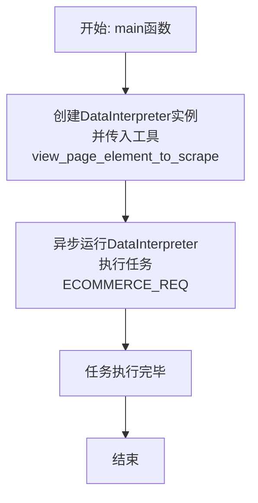
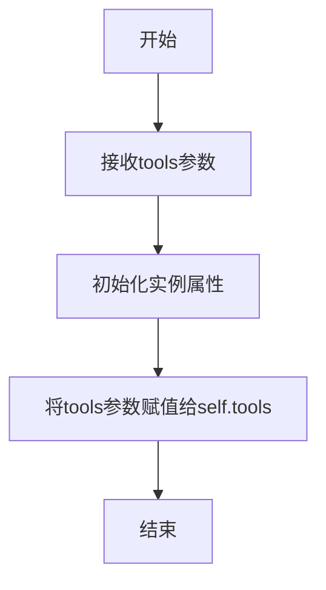

# `.\MetaGPT\examples\di\crawl_webpage.py` 详细设计文档

该代码是一个使用MetaGPT框架中DataInterpreter角色的网页爬虫脚本，它通过自然语言指令驱动智能体自动完成网页数据抓取任务。核心功能是接收用户用自然语言描述的网页抓取需求（如从指定网站获取表格数据、产品信息或新闻快讯），DataInterpreter智能体会自动分析需求、查看页面元素、编写并执行爬虫代码，最终将结果保存为CSV文件。

## 整体流程

```mermaid
graph TD
    A[脚本开始执行] --> B[定义三个网页抓取任务描述字符串]
    B --> C[异步main函数被调用]
    C --> D[创建DataInterpreter实例，传入view_page_element_to_scrape工具]
    D --> E[调用di.run(ECOMMERCE_REQ)执行电商网站抓取任务]
    E --> F{DataInterpreter内部执行流程}
    F --> G[解析自然语言指令]
    G --> H[调用view_page_element_to_scrape工具查看页面DOM结构]
    H --> I[根据页面结构和任务要求，自动生成或调整爬虫代码]
    I --> J[执行生成的爬虫代码，获取数据]
    J --> K[将数据保存为CSV文件]
    K --> L[任务完成，流程结束]
```

## 类结构

```
外部依赖/导入模块
├── metagpt.roles.di.data_interpreter.DataInterpreter (智能体角色类)
└── metagpt.tools.libs.web_scraping.view_page_element_to_scrape (网页抓取工具函数)

本文件结构
├── 全局常量: PAPER_LIST_REQ, ECOMMERCE_REQ, NEWS_36KR_REQ
└── 异步函数: main
```

## 全局变量及字段


### `PAPER_LIST_REQ`
    
一个字符串常量，定义了从指定网页（papercopilot.com）的`paperlist`表格中抓取数据的任务需求，要求筛选标题包含`multiagent`或`large language model`的论文并保存为CSV文件。

类型：`str`
    


### `ECOMMERCE_REQ`
    
一个字符串常量，定义了从电商网站（scrapeme.live）抓取产品数据的任务需求，要求保存第一页产品的名称、价格、产品URL和图片URL到CSV文件。

类型：`str`
    


### `NEWS_36KR_REQ`
    
一个字符串常量，定义了从36kr创投平台抓取所有初创企业融资快讯的任务需求，包含一个详细的多步骤中文流程，最终要求将结果保存到本地CSV文件。

类型：`str`
    


    

## 全局函数及方法


### `main`

这是一个异步入口函数，用于启动一个数据解释器（DataInterpreter）来执行一个网页爬取任务。它首先创建一个配置了特定工具（`view_page_element_to_scrape`）的DataInterpreter实例，然后运行一个获取电子商务网站产品数据并保存为CSV文件的任务。

参数：
-  `无`：`无`，此函数不接受任何参数。

返回值：`None`，此函数不返回任何值。

#### 流程图



#### 带注释源码

```python
async def main():
    # 1. 实例化DataInterpreter角色，并为其配置一个名为'view_page_element_to_scrape'的工具。
    #    这个工具的作用是在编写爬虫代码前，先查看目标网页的DOM结构。
    di = DataInterpreter(tools=[view_page_element_to_scrape.__name__])

    # 2. 异步调用DataInterpreter实例的`run`方法，执行预定义的电子商务爬取任务（ECOMMERCE_REQ）。
    #    DataInterpreter将根据任务描述，自主规划步骤（如查看页面元素、编写爬虫代码、提取数据、保存文件等）并执行。
    await di.run(ECOMMERCE_REQ)
```


### `view_page_element_to_scrape`

该函数是一个用于网页抓取的工具函数，其核心功能是接收一个网页URL，通过无头浏览器（如Playwright）加载该页面，然后返回页面的HTML源代码。这使得数据抓取脚本或智能体（如DataInterpreter）能够在编写具体的抓取逻辑（如XPath或CSS选择器）之前，先直观地查看和分析目标网页的DOM结构，从而更准确地定位需要抓取的数据元素。

参数：

-  `url`：`str`，目标网页的URL地址。

返回值：`str`，目标网页的HTML源代码字符串。

#### 流程图

```mermaid
flowchart TD
    A[开始: 调用 view_page_element_to_scrape(url)] --> B{参数 url 是否有效?};
    B -- 否 --> C[抛出 ValueError 异常];
    B -- 是 --> D[启动 Playwright 无头浏览器];
    D --> E[创建新浏览器上下文和页面];
    E --> F[导航至目标 URL];
    F --> G[等待页面加载完成];
    G --> H[获取页面完整的 HTML 内容];
    H --> I[关闭浏览器上下文和浏览器];
    I --> J[返回 HTML 内容字符串];
    J --> K[结束];
```

#### 带注释源码

```python
# 注意：以下是根据函数名称和上下文推断出的典型实现。
# 实际源码可能位于 `metagpt.tools.libs.web_scraping` 模块中。
async def view_page_element_to_scrape(url: str) -> str:
    """
    使用无头浏览器打开指定URL并返回其HTML内容，用于辅助编写网页抓取代码。

    Args:
        url (str): 要查看的网页URL。

    Returns:
        str: 网页的HTML源代码。

    Raises:
        ValueError: 如果URL为空或无效。
        Exception: 浏览器操作或网络请求可能引发的各种异常。
    """
    # 1. 参数校验
    if not url or not isinstance(url, str):
        raise ValueError("URL must be a non-empty string.")

    # 2. 导入必要的库（通常在函数外部，此处为示意）
    # from playwright.async_api import async_playwright
    # import asyncio

    # 3. 启动Playwright无头浏览器
    async with async_playwright() as p:
        # 4. 启动浏览器实例（例如Chromium）
        browser = await p.chromium.launch(headless=True)
        try:
            # 5. 创建新的浏览器上下文和页面
            context = await browser.new_context()
            page = await context.new_page()

            # 6. 导航到目标URL并等待页面加载
            # 这里通常会增加等待条件，如等待某个关键元素出现或网络空闲
            response = await page.goto(url, wait_until="networkidle")
            # 可选：检查HTTP响应状态码
            if not response or not response.ok:
                # 可以记录日志或抛出更具体的异常
                print(f"Warning: Page load may have failed. Status: {response.status if response else 'No response'}")

            # 7. 获取页面的完整HTML内容
            html_content = await page.content()

            # 8. 返回获取到的HTML
            return html_content
        finally:
            # 9. 确保浏览器被正确关闭，释放资源
            await browser.close()
```


### `DataInterpreter.__init__`

该方法用于初始化 `DataInterpreter` 类的实例。它接收一系列工具名称作为参数，并将这些工具注册到实例中，以便后续在代码解释和执行过程中使用。

参数：

- `tools`：`list[str]`，一个字符串列表，表示要注册的工具名称。这些工具通常是预定义的函数或方法，用于扩展 `DataInterpreter` 的功能。

返回值：`None`，该方法不返回任何值。

#### 流程图



#### 带注释源码

```python
def __init__(self, tools: list[str]):
    """
    初始化DataInterpreter实例。
    
    参数:
        tools (list[str]): 一个字符串列表，表示要注册的工具名称。
    """
    self.tools = tools  # 将传入的工具列表赋值给实例属性self.tools
```

### `DataInterpreter.run`

该方法是一个异步方法，是DataInterpreter角色的核心执行入口。它接收一个自然语言描述的任务需求，通过调用内置的规划器（Planner）将需求分解为一系列可执行的步骤（计划），然后由执行器（Executor）按顺序执行这些步骤中的代码或工具调用，最终完成任务目标。该方法整合了任务规划、代码生成/执行、结果反思与计划调整的完整循环。

参数：
-  `instruction`：`str`，用户用自然语言描述的任务需求或指令。
-  `plan`：`Optional[List[Plan]]`，可选参数，一个预先定义好的计划列表。如果提供，将直接执行此计划，而不会调用规划器生成新计划。
-  `max_retry`：`int`，可选参数，执行失败时的最大重试次数，默认为3。
-  `reflection`：`Optional[Reflection]`，可选参数，一个反思对象，用于在执行过程中进行总结和优化。
-  `cnt`：`int`，可选参数，内部使用的计数器，用于跟踪执行轮次，默认为0。

返回值：`None`，此方法主要执行任务并产生副作用（如生成文件、调用API等），不直接返回业务数据。

#### 流程图

```mermaid
flowchart TD
    A[开始: run(instruction, ...)] --> B{plan 参数是否为空?};
    B -- 是 --> C[调用 self.planner.plan<br>生成初始计划];
    B -- 否 --> D[使用传入的 plan];
    C --> D;
    D --> E[初始化上下文 Context];
    E --> F[进入循环: for step in plan];
    F --> G[执行当前步骤 step];
    G --> H{执行是否成功?};
    H -- 是 --> I[更新上下文<br>记录结果];
    H -- 否 --> J[重试次数 cnt < max_retry?];
    J -- 是 --> K[cnt += 1<br>生成反思与调整计划];
    K --> G;
    J -- 否 --> L[抛出执行异常];
    I --> M{是否所有步骤完成?};
    M -- 否 --> F;
    M -- 是 --> N[结束循环];
    N --> O[返回 None];
    L --> O;
```

#### 带注释源码

```python
    async def run(
        self,
        instruction: str,
        plan: Optional[List[Plan]] = None,
        max_retry: int = 3,
        reflection: Optional[Reflection] = None,
        cnt: int = 0,
    ) -> None:
        """
        Runs the DataInterpreter to execute a given instruction.

        This method orchestrates the entire process of interpreting a natural language
        instruction, planning the steps, executing them, and handling retries with
        reflection if necessary.

        Args:
            instruction (str): The natural language instruction describing the task.
            plan (Optional[List[Plan]]): A pre-defined plan to execute. If provided,
                the planner is bypassed and this plan is used directly.
            max_retry (int): The maximum number of retries allowed for a step upon failure.
            reflection (Optional[Reflection]): An object used for reflecting on execution
                outcomes to improve future steps.
            cnt (int): An internal counter tracking the number of execution rounds/retries.

        Returns:
            None: This method performs actions (like writing files, calling APIs) but does
                not return a value directly.

        Raises:
            Exception: If a step fails and the maximum retry limit is reached.
        """
        # 1. 规划阶段：如果没有提供预定义计划，则使用规划器根据指令生成计划。
        if not plan:
            plan = await self.planner.plan(instruction=instruction)
        # 初始化执行上下文，用于在步骤间传递信息和状态。
        context = Context()

        # 2. 执行阶段：遍历计划中的每一个步骤。
        for step in plan:
            # 2.1 尝试执行当前步骤。
            success = await step.execute(context)
            # 2.2 如果执行失败，进入重试逻辑。
            if not success:
                # 检查是否已达到最大重试次数。
                if cnt < max_retry:
                    # 未达到最大重试次数，则进行反思。
                    cnt += 1
                    # 生成反思，分析失败原因。
                    reflection = await self.planner.reflect(
                        instruction=instruction, plan=plan, context=context
                    )
                    # 根据反思结果，重新规划（调整）后续步骤。
                    plan = await self.planner.replan(
                        instruction=instruction, reflection=reflection, context=context
                    )
                    # 使用调整后的新计划，重新开始执行循环。
                    await self.run(
                        instruction=instruction,
                        plan=plan,
                        max_retry=max_retry,
                        reflection=reflection,
                        cnt=cnt,
                    )
                else:
                    # 已达到最大重试次数，抛出异常。
                    raise Exception("Max retry reached")
            # 2.3 如果执行成功，更新上下文（例如，记录步骤的输出结果）。
            context.update(step)
        # 3. 所有步骤执行完毕，方法结束。
        return
```

## 关键组件


### DataInterpreter

一个基于元编程技术（MetaGPT）的角色类，用于解释和执行数据操作任务，特别是网页爬取任务。它接收自然语言指令，通过调用工具（如`view_page_element_to_scrape`）来规划、生成和执行代码，以完成数据获取和保存等目标。

### view_page_element_to_scrape

一个网页爬取工具函数，其核心功能是在编写爬虫代码前，先查看并分析目标网页的DOM结构，以帮助DataInterpreter更好地理解页面元素布局，从而生成准确、健壮的网页抓取代码。

### 网页爬取任务请求（ECOMMERCE_REQ, PAPER_LIST_REQ, NEWS_36KR_REQ）

定义了具体的、以自然语言描述的网页数据抓取需求。这些请求作为DataInterpreter的输入，指导其执行特定的数据采集工作流，包括指定目标URL、所需数据字段、数据筛选条件（如关键词、时间范围）以及输出格式（如CSV文件）。

### 异步执行框架（asyncio）

代码通过`asyncio.run(main())`启动一个异步执行环境。这允许`DataInterpreter.run`方法进行非阻塞的I/O操作（如网络请求），在处理网页爬取这类高延迟任务时能更高效地利用系统资源。


## 问题及建议


### 已知问题

-   **工具导入方式不一致**：代码中通过 `view_page_element_to_scrape.__name__` 字符串形式传递工具名，而非直接传递函数对象。这种方式虽然可行，但牺牲了类型安全性和IDE的智能提示，增加了运行时错误的风险（例如函数名拼写错误）。
-   **硬编码的请求任务**：`PAPER_LIST_REQ`、`ECOMMERCE_REQ`、`NEWS_36KR_REQ` 等任务请求以硬编码字符串形式定义在模块顶部。这使得代码难以复用和扩展，每次执行新任务都需要修改源代码。
-   **缺乏配置化与参数化**：当前脚本的执行目标（`ECOMMERCE_REQ`）是固定的。无法通过命令行参数或配置文件灵活指定要执行哪个爬虫任务，限制了脚本的通用性。
-   **错误处理机制不明确**：`main` 函数和 `DataInterpreter.run` 方法中未见显式的错误处理逻辑（如网络请求失败、解析异常、文件写入权限问题等）。这可能导致任务在遇到意外情况时静默失败或抛出未处理的异常，不利于调试和运维。
-   **潜在的资源管理问题**：代码使用了异步执行，但未展示对 `DataInterpreter` 实例或网络会话等资源进行显式的生命周期管理（如 `close` 或 `aclose` 方法）。在长时间运行或执行多个任务时，可能存在资源泄漏的风险。
-   **代码可测试性差**：由于任务请求硬编码且直接调用了外部服务，难以编写单元测试来验证核心逻辑。对 `DataInterpreter` 的依赖也使得测试需要模拟或使用真实的 DI 环境。

### 优化建议

-   **直接传递工具函数**：建议将 `tools=[view_page_element_to_scrape.__name__]` 改为 `tools=[view_page_element_to_scrape]`，直接传递函数引用。这能提升代码的清晰度和工具性。
-   **将任务请求外部化**：将不同的爬虫任务描述（如 `PAPER_LIST_REQ`）移出代码，存储到独立的配置文件（如 YAML、JSON）或数据库中。主程序通过读取配置来动态加载和执行任务，提高可维护性和扩展性。
-   **增加命令行接口**：使用 `argparse` 或 `click` 库为脚本添加命令行参数，允许用户指定要运行的任务标识符、输出文件路径、并发数等配置，提升脚本的灵活性。
-   **增强错误处理与日志记录**：
    -   在 `main` 函数中使用 `try-except` 块捕获可能发生的异常，并进行适当的处理（如重试、记录详细错误日志、优雅退出）。
    -   为 `DataInterpreter` 的执行过程增加更详细的日志输出，便于跟踪任务进度和定位问题。
    -   考虑对网络请求、文件操作等关键步骤添加超时和重试机制。
-   **显式管理资源**：确保在 `main` 函数结束时，或在异常发生时，正确关闭 `DataInterpreter` 实例及其可能持有的任何资源（如 HTTP 会话）。如果 `DataInterpreter` 支持异步上下文管理器，优先使用 `async with` 语法。
-   **提升可测试性**：
    -   将核心的业务逻辑（如任务解析、结果处理）从 `main` 函数中抽离出来，形成独立的、可测试的函数或类。
    -   使用依赖注入，使 `DataInterpreter` 的实例化可以通过参数传入，便于在测试中替换为 Mock 对象。
    -   为关键函数编写单元测试，模拟网络响应和文件操作。
-   **考虑添加结果验证**：在数据保存到 CSV 后，可以添加一个简单的验证步骤，例如检查文件是否存在、行数是否符合预期、关键字段是否非空等，确保爬取任务的完整性。
-   **文档化任务格式**：如果任务请求的格式是固定的，应编写明确的文档或 Schema 来描述其结构，方便未来添加新任务或与其他系统集成。


## 其它


### 设计目标与约束

本代码的核心设计目标是利用DataInterpreter角色，结合特定的网页元素查看工具，根据用户提供的自然语言指令，自动生成并执行网页爬取任务，并将结果保存为CSV文件。主要约束包括：1) 依赖MetaGPT框架的DataInterpreter角色及其工具生态系统；2) 爬取任务需遵循目标网站的Robots协议，避免对目标服务器造成过大负载；3) 代码执行环境需支持异步操作(asyncio)；4) 对于中文网站的处理需考虑编码问题。

### 错误处理与异常设计

当前代码未显式包含错误处理逻辑，错误处理主要依赖于DataInterpreter内部实现及底层库（如aiohttp, requests, BeautifulSoup等）。潜在的异常包括：网络请求失败（超时、连接错误、HTTP错误状态码）、网页结构解析失败（元素定位错误、编码错误）、文件IO错误（CSV写入权限或路径错误）以及DataInterpreter任务规划或执行失败。优化方向应为在`main`函数或DataInterpreter调用外层增加try-except块，捕获`asyncio.TimeoutError`、`aiohttp.ClientError`、`Exception`等通用异常，并记录日志或给出用户友好的错误提示。

### 数据流与状态机

数据流始于用户定义的任务需求字符串（如`ECOMMERCE_REQ`）。DataInterpreter接收需求后，进入“任务规划”状态，解析需求并生成一系列可执行步骤。随后进入“任务执行”状态，依次调用工具（如`view_page_element_to_scrape`）或执行代码。在执行过程中，DataInterpreter可能根据中间结果（如查看的页面元素）动态调整后续步骤（“动态重规划”状态）。核心数据流为：用户需求 -> DataInterpreter解析与规划 -> 执行网页请求获取HTML -> 解析HTML提取目标数据 -> 将数据转换为结构化格式（如list[dict]）-> 将数据写入CSV文件。整个过程由DataInterpreter内部状态机管理，对外表现为一个异步执行流。

### 外部依赖与接口契约

1.  **MetaGPT框架**：核心依赖，特别是`metagpt.roles.di.data_interpreter.DataInterpreter`类，定义了智能体运行的核心接口（如`run`方法）。
2.  **网页元素查看工具**：`metagpt.tools.libs.web_scraping.view_page_element_to_scrape`函数，是DataInterpreter可调用的工具之一。其接口契约是接收与网页爬取相关的上下文或指令，并返回页面元素信息，以辅助DataInterpreter编写准确的爬取代码。
3.  **第三方库**：间接依赖用于网络请求（如aiohttp）、HTML解析（如BeautifulSoup, lxml）、数据操作（如pandas）的库，这些由DataInterpreter在生成代码时可能引入。
4.  **异步运行时**：依赖Python的`asyncio`库来运行异步主函数。
5.  **目标网站**：代码功能正确性依赖于`https://scrapeme.live/shop/`等目标网站的页面结构保持稳定。页面结构变更将导致爬取失败，需调整指令或爬取逻辑。

    